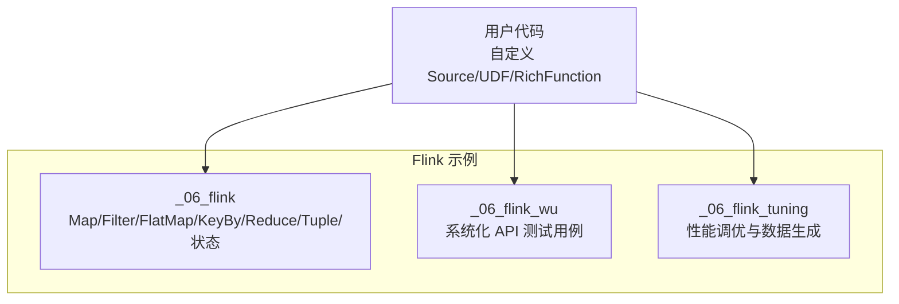
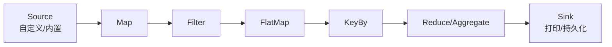
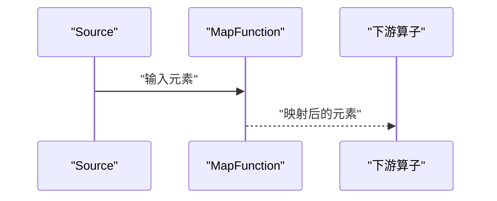
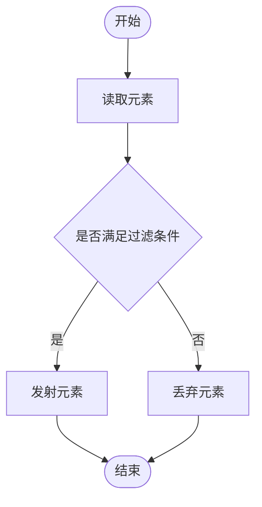
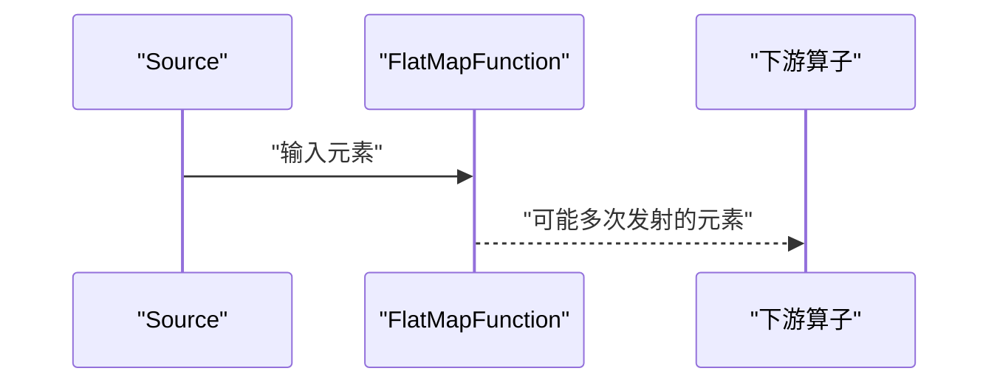
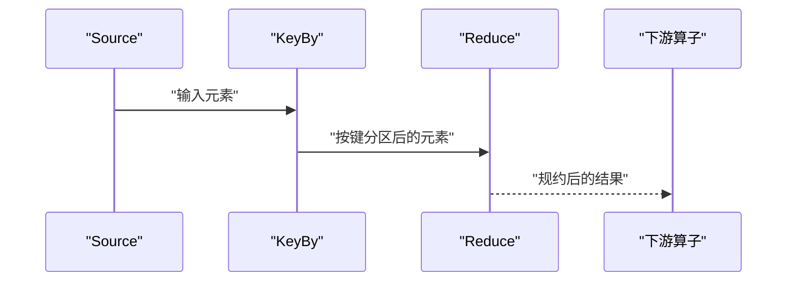
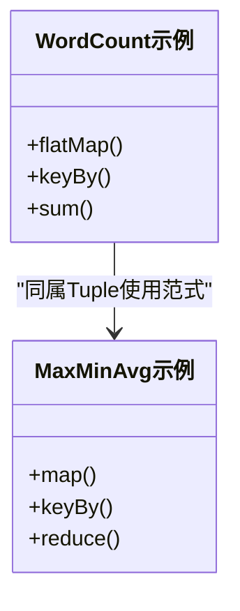
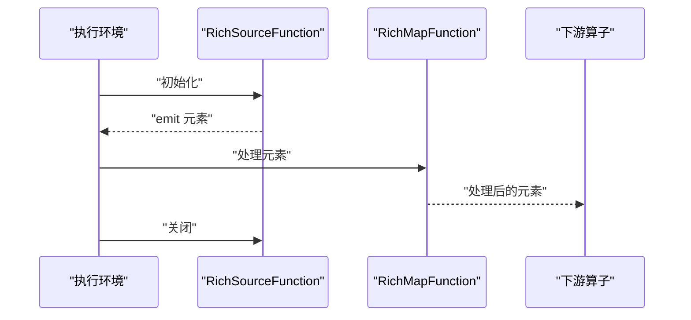
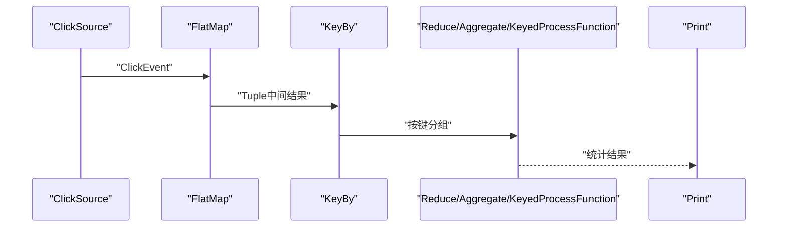
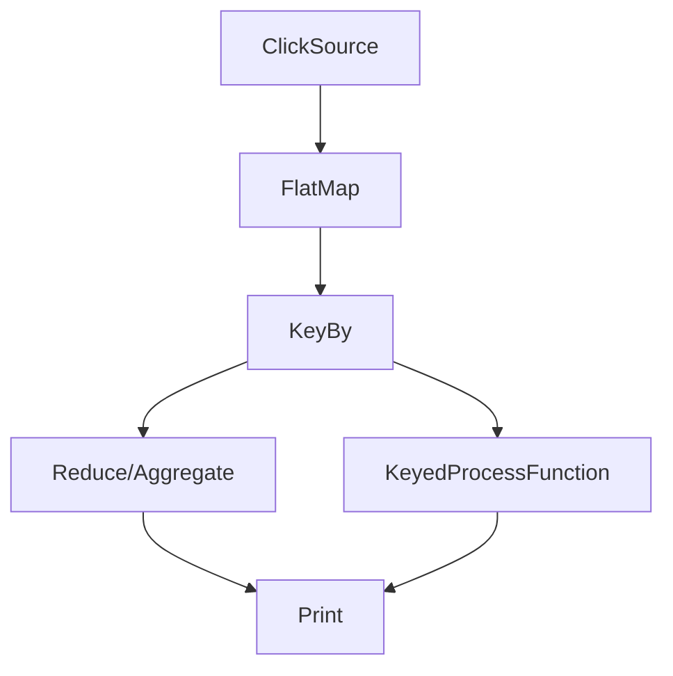

# DataStream API

<cite>
**本文引用的文件**
- [_06_flink/src/main/java/_05_DIY/_01_Map.java](file://_06_flink/src/main/java/_05_DIY/_01_Map.java)
- [_06_flink/src/main/java/_05_DIY/_02_Filter.java](file://_06_flink/src/main/java/_05_DIY/_02_Filter.java)
- [_06_flink/src/main/java/_05_DIY/_03_FlatMap_My.java](file://_06_flink/src/main/java/_05_DIY/_03_FlatMap_My.java)
- [_06_flink/src/main/java/_05_DIY/_04_FlatMap_teacher.java](file://_06_flink/src/main/java/_05_DIY/_04_FlatMap_teacher.java)
- [_06_flink/src/main/java/_05_DIY/_05_MapTupple.java](file://_06_flink/src/main/java/_05_DIY/_05_MapTupple.java)
- [_06_flink/src/main/java/_05_DIY/_06_KeyBy.java](file://_06_flink/src/main/java/_05_DIY/_06_KeyBy.java)
- [_06_flink/src/main/java/_06_exam/_01_.java](file://_06_flink/src/main/java/_06_exam/_01_.java)
- [_06_flink/src/main/java/_06_exam/_03_WordCount.java](file://_06_flink/src/main/java/_06_exam/_03_WordCount.java)
- [_06_flink/src/main/java/_06_exam/_06_MaxMinAvg.java](file://_06_flink/src/main/java/_06_exam/_06_MaxMinAvg.java)
- [_06_flink/src/main/java/_06_exam/_07_MaxMinAvg_my.java](file://_06_flink/src/main/java/_06_exam/_07_MaxMinAvg_my.java)
- [_06_flink/src/main/java/_06_exam/_09_ClickCount.java](file://_06_flink/src/main/java/_06_exam/_09_ClickCount.java)
- [_06_flink/src/main/java/_06_exam/exeClickEvent.java](file://_06_flink/src/main/java/_06_exam/exeClickEvent.java)
- [_06_flink_tuning/src/main/java/com/atguigu/flink/tuning/DataStreamDataGenDemo.java](file://_06_flink_tuning/src/main/java/com/atguigu/flink/tuning/DataStreamDataGenDemo.java)
- [_06_flink_tuning/src/main/java/com/atguigu/flink/tuning/BackpressureDemo.java](file://_06_flink_tuning/src/main/java/com/atguigu/flink/tuning/BackpressureDemo.java)
- [_06_flink_wu/src/main/java/com/atguigu/chapter05/TransFilterTest.java](file://_06_flink_wu/src/main/java/com/atguigu/chapter05/TransFilterTest.java)
- [_06_flink_wu/src/main/java/com/atguigu/chapter05/TransFlatmapTest.java](file://_06_flink_wu/src/main/java/com/atguigu/chapter05/TransFlatmapTest.java)
- [_06_flink_wu/src/main/java/com/atguigu/chapter05/TransMapTest.java](file://_06_flink_wu/src/main/java/com/atguigu/chapter05/TransMapTest.java)
- [_06_flink_wu/src/main/java/com/atguigu/chapter05/TransReduceTest.java](file://_06_flink_wu/src/main/java/com/atguigu/chapter05/TransReduceTest.java)
- [_06_flink_wu/src/main/java/com/atguigu/chapter05/TransPojoAggregationTest.java](file://_06_flink_wu/src/main/java/com/atguigu/chapter05/TransPojoAggregationTest.java)
- [_06_flink_wu/src/main/java/com/atguigu/chapter05/TransTupleAggreationTest.java](file://_06_flink_wu/src/main/java/com/atguigu/chapter05/TransTupleAggreationTest.java)
- [_06_flink_wu/src/main/java/com/atguigu/chapter05/TransRichFunctionTest.java](file://_06_flink_wu/src/main/java/com/atguigu/chapter05/TransRichFunctionTest.java)
- [_06_flink_wu/src/main/java/com/atguigu/chapter05/TransUdfTest.java](file://_06_flink_wu/src/main/java/com/atguigu/chapter05/TransUdfTest.java)
- [_06_flink_wu/src/main/java/com/atguigu/chapter05/SourceCustomParallelTest.java](file://_06_flink_wu/src/main/java/com/atguigu/chapter05/SourceCustomParallelTest.java)
</cite>

## 目录
1. [引言](#引言)
2. [项目结构](#项目结构)
3. [核心组件](#核心组件)
4. [架构总览](#架构总览)
5. [详细组件分析](#详细组件分析)
6. [依赖关系分析](#依赖关系分析)
7. [性能考虑](#性能考虑)
8. [故障排查指南](#故障排查指南)
9. [结论](#结论)
10. [附录](#附录)

## 引言
本技术文档围绕 Apache Flink 的 DataStream 编程模型，系统梳理并演示核心 Transformation 算子（Map、Filter、FlatMap、KeyBy、Reduce、Aggregate）的使用方法与适用场景，并结合仓库中的示例，给出从基础数据转换到复杂业务聚合的完整实现路径。文档同时覆盖 Tuple 数据结构的最佳实践、自定义算子开发要点以及性能优化建议，帮助读者快速掌握从入门到实战的 DataStream 开发技能。

## 项目结构
本仓库中与 DataStream API 相关的示例主要集中在以下模块：
- _06_flink：包含大量基础与进阶的 DataStream 示例，涵盖 Map、Filter、FlatMap、KeyBy、Reduce、Tuple 使用、状态与窗口等主题。
- _06_flink_wu：提供更系统的 DataStream API 测试用例，如 Map、Filter、FlatMap、Reduce、POJO 聚合、Tuple 聚合、RichFunction、UDF、自定义并行 Source 等。
- _06_flink_tuning：包含数据生成、背压诊断、禁用算子链等性能调优示例，便于理解 DataStream 的执行拓扑与吞吐瓶颈。

**章节来源**
- file://_06_flink/src/main/java/_05_DIY/_01_Map.java#L1-L68
- file://_06_flink_wu/src/main/java/com/atguigu/chapter05/TransMapTest.java#L1-L200
- file://_06_flink_tuning/src/main/java/com/atguigu/flink/tuning/DataStreamDataGenDemo.java#L1-L60

## 核心组件
本节聚焦 DataStream 中最常用的 Transformation 算子及其典型用法，结合仓库中的示例文件进行说明。

- Map 算子
  - 作用：一对一转换，常用于抽取字段或类型转换。
  - 示例参考：
    - [匿名函数与外部类实现](file://_06_flink/src/main/java/_05_DIY/_01_Map.java#L20-L67)
    - [系统化 Map 用法](file://_06_flink_wu/src/main/java/com/atguigu/chapter05/TransMapTest.java#L1-L200)
  - 使用技巧：
    - 对 POJO 字段抽取时，优先使用 lambda 表达式简化代码。
    - 返回类型不匹配时，可借助返回类型声明确保类型推断正确（参见 Tuple 场景）。

- Filter 算子
  - 作用：基于条件过滤，保留满足条件的元素。
  - 示例参考：
    - [匿名函数与外部类实现](file://_06_flink/src/main/java/_05_DIY/_02_Filter.java#L20-L64)
    - [系统化 Filter 用法](file://_06_flink_wu/src/main/java/com/atguigu/chapter05/TransFilterTest.java#L1-L200)
  - 使用技巧：
    - 过滤条件尽量简单且可复用，必要时封装为外部类实现 FilterFunction。

- FlatMap 算子
  - 作用：一对多转换，支持向下游发射多个元素。
  - 示例参考：
    - [自定义 POJO 的 FlatMap（含返回类型声明）](file://_06_flink/src/main/java/_05_DIY/_03_FlatMap_My.java#L12-L41)
    - [教学示例：按颜色策略输出](file://_06_flink/src/main/java/_05_DIY/_04_FlatMap_teacher.java#L14-L35)
    - [系统化 FlatMap 用法](file://_06_flink_wu/src/main/java/com/atguigu/chapter05/TransFlatmapTest.java#L1-L200)
  - 使用技巧：
    - 使用 Collector 在单次调用中多次收集，避免循环内重复 map。
    - 自定义 POJO 时务必显式声明返回类型，确保类型安全。

- KeyBy 算子
  - 作用：基于键分区，决定后续聚合的分组方式。
  - 示例参考：
    - [基于表达式的 KeyBy 与 Reduce 聚合](file://_06_flink/src/main/java/_05_DIY/_06_KeyBy.java#L12-L33)
    - [系统化 POJO/字段 KeyBy 与聚合](file://_06_flink_wu/src/main/java/com/atguigu/chapter05/TransPojoAggregationTest.java#L1-L200)
  - 使用技巧：
    - KeyBy 的键选择应尽量轻量且稳定，避免高基数键导致数据倾斜。
    - 聚合前设置合适的并行度，有助于提升吞吐。

- Reduce 算子
  - 作用：同组内两两规约，适合求和、最大值、最小值等二元可交换可结合的聚合。
  - 示例参考：
    - [整型序列规约求和](file://_06_flink/src/main/java/_05_DIY/_06_KeyBy.java#L18-L27)
    - [系统化 Reduce 用法](file://_06_flink_wu/src/main/java/com/atguigu/chapter05/TransReduceTest.java#L1-L200)
  - 使用技巧：
    - Reduce 的输入与输出类型一致，注意初始状态与累积状态的一致性。
    - 对于复杂统计（如均值、方差），可结合状态或使用 Aggregate/Window 实现。

- Aggregate 算子族
  - 作用：提供更灵活的聚合能力，如 Min/Max/Sum/First/Last 等。
  - 示例参考：
    - [系统化 POJO/字段聚合（含 Tuple）](file://_06_flink_wu/src/main/java/com/atguigu/chapter05/TransTupleAggreationTest.java#L1-L200)
  - 使用技巧：
    - 对多字段聚合，推荐使用 Tuple 或 POJO 组织中间结果，减少多次 KeyBy。
    - 聚合字段命名需与后续访问一致（如按字段名访问）。

**章节来源**
- file://_06_flink/src/main/java/_05_DIY/_01_Map.java#L20-L67
- file://_06_flink/src/main/java/_05_DIY/_02_Filter.java#L20-L64
- file://_06_flink/src/main/java/_05_DIY/_03_FlatMap_My.java#L12-L41
- file://_06_flink/src/main/java/_05_DIY/_04_FlatMap_teacher.java#L14-L35
- file://_06_flink/src/main/java/_05_DIY/_06_KeyBy.java#L12-L33
- file://_06_flink_wu/src/main/java/com/atguigu/chapter05/TransMapTest.java#L1-L200
- file://_06_flink_wu/src/main/java/com/atguigu/chapter05/TransFilterTest.java#L1-L200
- file://_06_flink_wu/src/main/java/com/atguigu/chapter05/TransFlatmapTest.java#L1-L200
- file://_06_flink_wu/src/main/java/com/atguigu/chapter05/TransReduceTest.java#L1-L200
- file://_06_flink_wu/src/main/java/com/atguigu/chapter05/TransPojoAggregationTest.java#L1-L200
- file://_06_flink_wu/src/main/java/com/atguigu/chapter05/TransTupleAggreationTest.java#L1-L200

## 架构总览
下图展示了典型的 DataStream 执行拓扑：Source → Transformation → Sink。其中 Transformation 层包含 Map、Filter、FlatMap、KeyBy、Reduce 等算子，它们通过链式组合形成 DAG。

**图表来源**
- file://_06_flink/src/main/java/_05_DIY/_01_Map.java#L12-L27
- file://_06_flink/src/main/java/_05_DIY/_02_Filter.java#L16-L33
- file://_06_flink/src/main/java/_05_DIY/_03_FlatMap_My.java#L16-L37
- file://_06_flink/src/main/java/_05_DIY/_06_KeyBy.java#L12-L27
- file://_06_flink/src/main/java/_06_exam/_03_WordCount.java#L13-L32

## 详细组件分析

### Map 算子分析
- 功能：一对一映射，常用于字段抽取、类型转换。
- 代码片段路径：
  - [匿名函数抽取字段](file://_06_flink/src/main/java/_05_DIY/_01_Map.java#L20-L27)
  - [匿名类实现 MapFunction](file://_06_flink/src/main/java/_05_DIY/_01_Map.java#L26-L39)
  - [外部类实现 MapFunction](file://_06_flink/src/main/java/_05_DIY/_01_Map.java#L36-L40)
- 使用建议：
  - 对 POJO 字段抽取优先使用 lambda，简洁直观。
  - 当需要复用逻辑时，抽取为外部类实现 MapFunction。

**图表来源**
- file://_06_flink/src/main/java/_05_DIY/_01_Map.java#L20-L39

**章节来源**
- file://_06_flink/src/main/java/_05_DIY/_01_Map.java#L20-L67

### Filter 算子分析
- 功能：基于布尔条件过滤元素。
- 代码片段路径：
  - [匿名函数过滤用户名](file://_06_flink/src/main/java/_05_DIY/_02_Filter.java#L20-L24)
  - [匿名类实现 FilterFunction](file://_06_flink/src/main/java/_05_DIY/_02_Filter.java#L25-L33)
  - [外部类实现 FilterFunction](file://_06_flink/src/main/java/_05_DIY/_02_Filter.java#L35-L41)
- 使用建议：
  - 过滤条件尽量幂等且无副作用。
  - 复杂过滤逻辑建议封装为外部类，提高可读性与可测试性。

**图表来源**
- file://_06_flink/src/main/java/_05_DIY/_02_Filter.java#L20-L41

**章节来源**
- file://_06_flink/src/main/java/_05_DIY/_02_Filter.java#L20-L64

### FlatMap 算子分析
- 功能：一对多转换，支持在单次调用中多次收集。
- 代码片段路径：
  - [自定义 POJO 的 FlatMap（含返回类型声明）](file://_06_flink/src/main/java/_05_DIY/_03_FlatMap_My.java#L16-L37)
  - [教学示例：按颜色策略输出](file://_06_flink/src/main/java/_05_DIY/_04_FlatMap_teacher.java#L18-L35)
- 使用建议：
  - 使用 Collector 在一次 flatMap 中多次 emit，避免多次 map。
  - 自定义 POJO 时务必显式声明返回类型，确保类型安全。

**图表来源**
- file://_06_flink/src/main/java/_05_DIY/_03_FlatMap_My.java#L16-L37
- file://_06_flink/src/main/java/_05_DIY/_04_FlatMap_teacher.java#L18-L35

**章节来源**
- file://_06_flink/src/main/java/_05_DIY/_03_FlatMap_My.java#L12-L41
- file://_06_flink/src/main/java/_05_DIY/_04_FlatMap_teacher.java#L14-L35

### KeyBy 与 Reduce 分析
- 功能：KeyBy 进行分区，Reduce 进行组内规约。
- 代码片段路径：
  - [基于表达式的 KeyBy 与 Reduce](file://_06_flink/src/main/java/_05_DIY/_06_KeyBy.java#L12-L27)
  - [系统化 Reduce 用法](file://_06_flink_wu/src/main/java/com/atguigu/chapter05/TransReduceTest.java#L1-L200)
- 使用建议：
  - 键选择应避免高基数，防止数据倾斜。
  - Reduce 的输入输出类型保持一致，注意累积状态初始化。

**图表来源**
- file://_06_flink/src/main/java/_05_DIY/_06_KeyBy.java#L12-L27

**章节来源**
- file://_06_flink/src/main/java/_05_DIY/_06_KeyBy.java#L12-L33
- file://_06_flink_wu/src/main/java/com/atguigu/chapter05/TransReduceTest.java#L1-L200

### Tuple 数据结构与最佳实践
- 功能：Tuple 用于组织多字段的中间结果，常见为二元组、五元组等。
- 代码片段路径：
  - [将整数映射为 Tuple2 并声明返回类型](file://_06_flink/src/main/java/_05_DIY/_05_MapTupple.java#L16-L27)
  - [WordCount 使用 Tuple3](file://_06_flink/src/main/java/_06_exam/_03_WordCount.java#L13-L31)
  - [自定义统计使用 Tuple5](file://_06_flink/src/main/java/_06_exam/_07_MaxMinAvg_my.java#L34-L63)
- 最佳实践：
  - 明确字段含义，合理选择 Tuple 类型（如 Tuple2、Tuple3、Tuple5）。
  - 使用返回类型声明确保类型安全，避免运行期类型错误。

**图表来源**
- file://_06_flink/src/main/java/_06_exam/_03_WordCount.java#L13-L31
- file://_06_flink/src/main/java/_06_exam/_07_MaxMinAvg_my.java#L34-L63

**章节来源**
- file://_06_flink/src/main/java/_05_DIY/_05_MapTupple.java#L12-L29
- file://_06_flink/src/main/java/_06_exam/_03_WordCount.java#L13-L31
- file://_06_flink/src/main/java/_06_exam/_07_MaxMinAvg_my.java#L34-L63

### 自定义算子与 RichFunction
- 功能：通过 Rich 系列函数扩展生命周期管理、状态访问与并行度控制。
- 代码片段路径：
  - [系统化 RichFunction 用法](file://_06_flink_wu/src/main/java/com/atguigu/chapter05/TransRichFunctionTest.java#L1-L200)
  - [自定义并行 Source（实现 ParallelSourceFunction）](file://_06_flink_wu/src/main/java/com/atguigu/chapter05/SourceCustomParallelTest.java#L16-L41)
  - [自定义 UDF（Scalar/Aggregate/Table）](file://_06_flink_wu/src/main/java/com/atguigu/chapter05/TransUdfTest.java#L1-L200)
- 使用建议：
  - 在 open 中初始化状态与配置，在 close 中释放资源。
  - 自定义 Source 应保证线程安全与取消语义。

**图表来源**
- file://_06_flink_wu/src/main/java/com/atguigu/chapter05/TransRichFunctionTest.java#L1-L200
- file://_06_flink_wu/src/main/java/com/atguigu/chapter05/SourceCustomParallelTest.java#L16-L41

**章节来源**
- file://_06_flink_wu/src/main/java/com/atguigu/chapter05/TransRichFunctionTest.java#L1-L200
- file://_06_flink_wu/src/main/java/com/atguigu/chapter05/SourceCustomParallelTest.java#L16-L41
- file://_06_flink_wu/src/main/java/com/atguigu/chapter05/TransUdfTest.java#L1-L200

### 复杂业务案例：点击事件聚合
- 功能：对点击事件进行清洗、分组与聚合，输出统计指标。
- 代码片段路径：
  - [点击事件数据结构](file://_06_flink/src/main/java/_06_exam/exeClickEvent.java#L1-L27)
  - [WordCount（按用户名聚合）](file://_06_flink/src/main/java/_06_exam/_03_WordCount.java#L13-L32)
  - [全量聚合（按固定键聚合）](file://_06_flink/src/main/java/_06_exam/_09_ClickCount.java#L14-L42)
  - [基于 KeyedProcessFunction 的统计（最小/大/均值）](file://_06_flink/src/main/java/_06_exam/_06_MaxMinAvg.java#L15-L75)
- 实施步骤：
  1) 从 Source 读取点击事件。
  2) 使用 FlatMap 清洗并构造中间 Tuple。
  3) 使用 KeyBy 按维度分组。
  4) 使用 Reduce/Aggregate/KeyedProcessFunction 输出统计结果。

**图表来源**
- file://_06_flink/src/main/java/_06_exam/_03_WordCount.java#L13-L32
- file://_06_flink/src/main/java/_06_exam/_09_ClickCount.java#L14-L42
- file://_06_flink/src/main/java/_06_exam/_06_MaxMinAvg.java#L15-L75

**章节来源**
- file://_06_flink/src/main/java/_06_exam/exeClickEvent.java#L1-L27
- file://_06_flink/src/main/java/_06_exam/_03_WordCount.java#L13-L32
- file://_06_flink/src/main/java/_06_exam/_09_ClickCount.java#L14-L42
- file://_06_flink/src/main/java/_06_exam/_06_MaxMinAvg.java#L15-L75

## 依赖关系分析
- 组件耦合：
  - Map/Filter/FlatMap 独立性强，可自由串联。
  - KeyBy 与 Reduce/Aggregate 存在强关联，前者决定分组，后者决定聚合行为。
- 外部依赖：
  - 示例中使用了自定义 Source（ClickSource）、自定义事件类型（exeClickEvent）等。
- 循环依赖：
  - 示例文件之间未见循环导入；算子链路清晰，符合 DataStream DAG 特性。

**图表来源**
- file://_06_flink/src/main/java/_06_exam/_03_WordCount.java#L13-L32
- file://_06_flink/src/main/java/_06_exam/_09_ClickCount.java#L14-L42
- file://_06_flink/src/main/java/_06_exam/_06_MaxMinAvg.java#L15-L75

**章节来源**
- file://_06_flink/src/main/java/_06_exam/_03_WordCount.java#L13-L32
- file://_06_flink/src/main/java/_06_exam/_09_ClickCount.java#L14-L42
- file://_06_flink/src/main/java/_06_exam/_06_MaxMinAvg.java#L15-L75

## 性能考虑
- 禁用算子链：在调试或定位背压时，可通过禁用 Operator Chaining 观察瓶颈。
  - 参考：[禁用算子链示例](file://_06_flink_tuning/src/main/java/com/atguigu/flink/tuning/BackpressureDemo.java#L16-L23)
- 背压诊断：通过持续 emit 数据观察上下游压力，定位慢算子。
  - 参考：[背压诊断示例](file://_06_flink_tuning/src/main/java/com/atguigu/flink/tuning/BackpressureDemo.java#L21-L35)
- 数据生成与吞吐：使用内置数据生成器或本地 Web UI 提升开发效率。
  - 参考：[数据生成示例](file://_06_flink_tuning/src/main/java/com/atguigu/flink/tuning/DataStreamDataGenDemo.java#L16-L30)

**章节来源**
- file://_06_flink_tuning/src/main/java/com/atguigu/flink/tuning/BackpressureDemo.java#L16-L35
- file://_06_flink_tuning/src/main/java/com/atguigu/flink/tuning/DataStreamDataGenDemo.java#L16-L30

## 故障排查指南
- 类型不匹配：
  - 现象：编译或运行时报类型不兼容。
  - 排查：检查返回类型声明，确保与下游算子期望类型一致。
  - 参考：[FlatMap 返回类型声明](file://_06_flink/src/main/java/_05_DIY/_03_FlatMap_My.java#L23-L27)
- 并行度与输出顺序：
  - 现象：设置 print 并行度后输出顺序变化。
  - 排查：并行度仅影响下游算子实例数量，不改变全局顺序；顺序由事件时间/水位线决定。
  - 参考：[KeyBy 并行度设置注释](file://_06_flink/src/main/java/_05_DIY/_06_KeyBy.java#L26-L31)
- 聚合结果异常：
  - 现象：Reduce/Average 结果不正确。
  - 排查：确认键选择稳定性、初始状态与累积状态一致性。
  - 参考：[Reduce 与 KeyedProcessFunction 统计](file://_06_flink/src/main/java/_06_exam/_06_MaxMinAvg.java#L28-L75)

**章节来源**
- file://_06_flink/src/main/java/_05_DIY/_03_FlatMap_My.java#L23-L27
- file://_06_flink/src/main/java/_05_DIY/_06_KeyBy.java#L26-L31
- file://_06_flink/src/main/java/_06_exam/_06_MaxMinAvg.java#L28-L75

## 结论
通过对仓库中 Map、Filter、FlatMap、KeyBy、Reduce、Aggregate 等算子的系统梳理与示例解析，可以构建从简单数据转换到复杂业务聚合的完整 DataStream 应用。配合 Tuple 数据结构、自定义算子与性能调优实践，能够高效应对实时流处理场景中的多样化需求。

## 附录
- 常用示例路径索引：
  - Map：[匿名函数/匿名类/外部类](file://_06_flink/src/main/java/_05_DIY/_01_Map.java#L20-L67)
  - Filter：[匿名函数/匿名类/外部类](file://_06_flink/src/main/java/_05_DIY/_02_Filter.java#L20-L64)
  - FlatMap：[POJO/颜色策略](file://_06_flink/src/main/java/_05_DIY/_03_FlatMap_My.java#L16-L37), [file://_06_flink/src/main/java/_05_DIY/_04_FlatMap_teacher.java#L18-L35)
  - KeyBy + Reduce：[表达式键/并行度设置](file://_06_flink/src/main/java/_05_DIY/_06_KeyBy.java#L12-L33)
  - Tuple 使用：[MapTupple](file://_06_flink/src/main/java/_05_DIY/_05_MapTupple.java#L16-L27), [WordCount](file://_06_flink/src/main/java/_06_exam/_03_WordCount.java#L13-L31), [MaxMinAvg_my](file://_06_flink/src/main/java/_06_exam/_07_MaxMinAvg_my.java#L34-L63)
  - 复杂业务：[点击事件聚合](file://_06_flink/src/main/java/_06_exam/_03_WordCount.java#L13-L32), [file://_06_flink/src/main/java/_06_exam/_09_ClickCount.java#L14-L42), [file://_06_flink/src/main/java/_06_exam/_06_MaxMinAvg.java#L15-L75)
  - 自定义算子：[RichFunction](file://_06_flink_wu/src/main/java/com/atguigu/chapter05/TransRichFunctionTest.java#L1-L200), [ParallelSource](file://_06_flink_wu/src/main/java/com/atguigu/chapter05/SourceCustomParallelTest.java#L16-L41), [UDF](file://_06_flink_wu/src/main/java/com/atguigu/chapter05/TransUdfTest.java#L1-L200)
  - 性能调优：[禁用链/背压诊断](file://_06_flink_tuning/src/main/java/com/atguigu/flink/tuning/BackpressureDemo.java#L16-L35), [数据生成](file://_06_flink_tuning/src/main/java/com/atguigu/flink/tuning/DataStreamDataGenDemo.java#L16-L30)