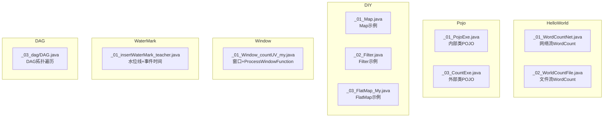
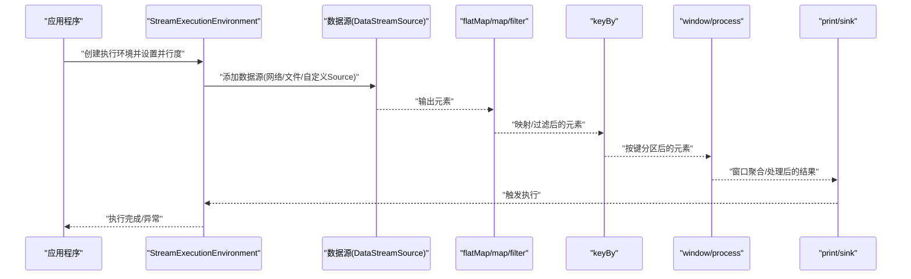
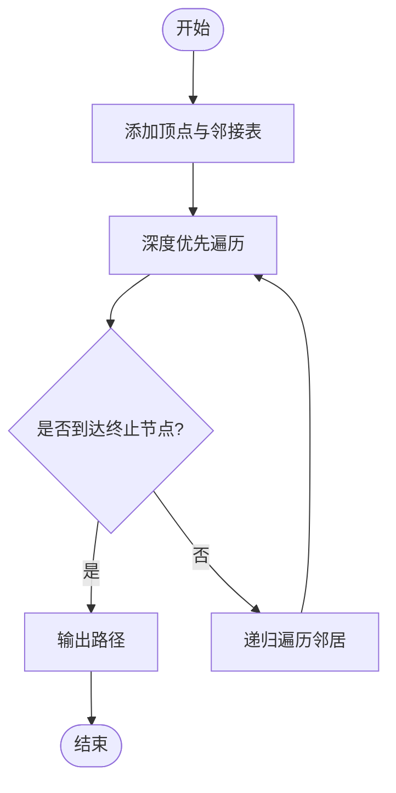
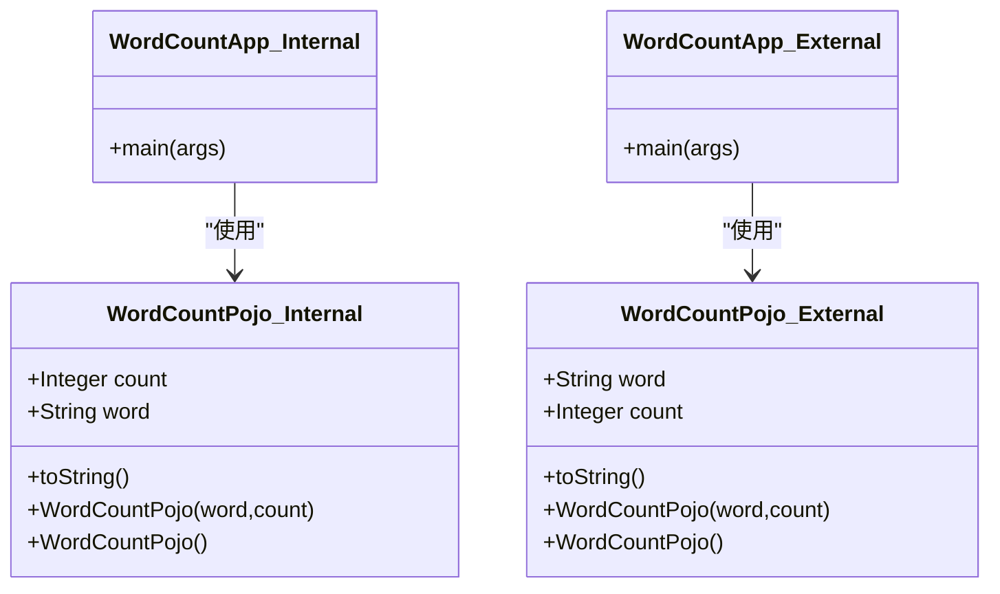
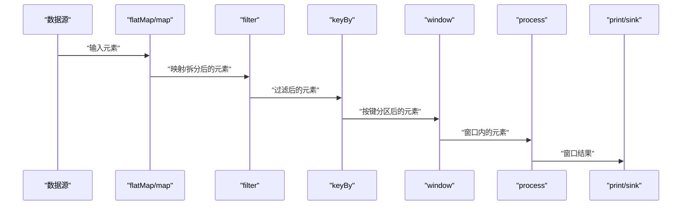
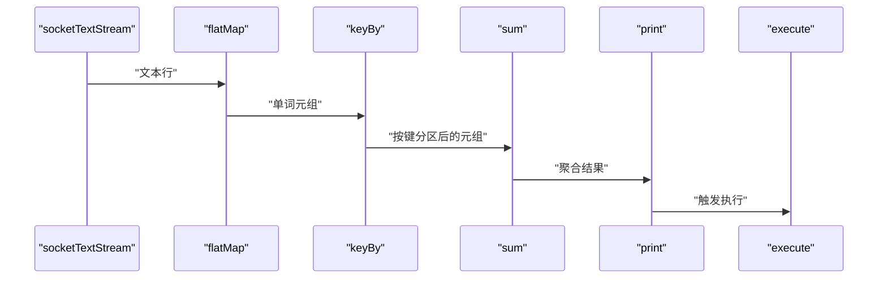

# Flink基础概念

<cite>
**本文引用的文件**
- [WordCount网络流示例（网络）](file://_06_flink/src/main/java/_01_HelloWorld/_01_WordCountNet.java)
- [WordCount文件流示例（文件）](file://_06_flink/src/main/java/_01_HelloWorld/_02_WorldCountFile.java)
- [POJO词频统计示例（内部类POJO）](file://_06_flink/src/main/java/_02_Pojo/_01_PojoExe.java)
- [POJO词频统计示例（外部类POJO）](file://_06_flink/src/main/java/_02_Pojo/_03_CountExe.java)
- [自定义函数示例（Map）](file://_06_flink/src/main/java/_05_DIY/_01_Map.java)
- [自定义函数示例（Filter）](file://_06_flink/src/main/java/_05_DIY/_02_Filter.java)
- [自定义函数示例（FlatMap）](file://_06_flink/src/main/java/_05_DIY/_03_FlatMap_My.java)
- [窗口与ProcessWindowFunction示例](file://_06_flink/src/main/java/_09_window/_01_Window_countUV_my.java)
- [水位线与事件时间示例](file://_06_flink/src/main/java/_10_waterMark/_01_insertWaterMark_teacher.java)
- [DAG拓扑遍历示例](file://_06_flink/src/main/java/_03_dag/DAG.java)
</cite>

## 目录
1. [引言](#引言)
2. [项目结构](#项目结构)
3. [核心组件](#核心组件)
4. [架构总览](#架构总览)
5. [详细组件分析](#详细组件分析)
6. [依赖关系分析](#依赖关系分析)
7. [性能考虑](#性能考虑)
8. [故障排查指南](#故障排查指南)
9. [结论](#结论)
10. [附录](#附录)

## 引言
本技术文档围绕Flink基础概念展开，系统讲解StreamExecutionEnvironment、DataStream、算子链、并行度、DAG执行图、POJO数据模型与最佳实践，并结合仓库中的WordCount网络流与文件流示例，帮助初学者快速掌握Flink的编程模型与运行机制。

## 项目结构
本仓库中与Flink基础相关的核心示例集中在路径“_06_flink/src/main/java”下，按功能划分为：
- HelloWorld：网络流与文件流的WordCount入门示例
- Pojo：基于POJO的词频统计示例
- DIY：Map/Filter/FlatMap等自定义函数示例
- window：窗口与ProcessWindowFunction示例
- waterMark：水位线与事件时间示例
- exam：综合练习示例
- dag：DAG拓扑遍历示例

下面给出与Flink核心概念直接相关的文件组织示意：

**图表来源**
- [WordCount网络流示例（网络）](file://_06_flink/src/main/java/_01_HelloWorld/_01_WordCountNet.java#L1-L57)
- [WordCount文件流示例（文件）](file://_06_flink/src/main/java/_01_HelloWorld/_02_WorldCountFile.java#L1-L37)
- [POJO词频统计示例（内部类POJO）](file://_06_flink/src/main/java/_02_Pojo/_01_PojoExe.java#L1-L59)
- [POJO词频统计示例（外部类POJO）](file://_06_flink/src/main/java/_02_Pojo/_03_CountExe.java#L1-L65)
- [自定义函数示例（Map）](file://_06_flink/src/main/java/_05_DIY/_01_Map.java#L1-L68)
- [自定义函数示例（Filter）](file://_06_flink/src/main/java/_05_DIY/_02_Filter.java#L1-L65)
- [自定义函数示例（FlatMap）](file://_06_flink/src/main/java/_05_DIY/_03_FlatMap_My.java#L1-L45)
- [窗口与ProcessWindowFunction示例](file://_06_flink/src/main/java/_09_window/_01_Window_countUV_my.java#L1-L62)
- [水位线与事件时间示例](file://_06_flink/src/main/java/_10_waterMark/_01_insertWaterMark_teacher.java#L1-L78)
- [DAG拓扑遍历示例](file://_06_flink/src/main/java/_03_dag/DAG.java#L1-L73)

**章节来源**
- [WordCount网络流示例（网络）](file://_06_flink/src/main/java/_01_HelloWorld/_01_WordCountNet.java#L1-L57)
- [WordCount文件流示例（文件）](file://_06_flink/src/main/java/_01_HelloWorld/_02_WorldCountFile.java#L1-L37)
- [POJO词频统计示例（内部类POJO）](file://_06_flink/src/main/java/_02_Pojo/_01_PojoExe.java#L1-L59)
- [POJO词频统计示例（外部类POJO）](file://_06_flink/src/main/java/_02_Pojo/_03_CountExe.java#L1-L65)
- [自定义函数示例（Map）](file://_06_flink/src/main/java/_05_DIY/_01_Map.java#L1-L68)
- [自定义函数示例（Filter）](file://_06_flink/src/main/java/_05_DIY/_02_Filter.java#L1-L65)
- [自定义函数示例（FlatMap）](file://_06_flink/src/main/java/_05_DIY/_03_FlatMap_My.java#L1-L45)
- [窗口与ProcessWindowFunction示例](file://_06_flink/src/main/java/_09_window/_01_Window_countUV_my.java#L1-L62)
- [水位线与事件时间示例](file://_06_flink/src/main/java/_10_waterMark/_01_insertWaterMark_teacher.java#L1-L78)
- [DAG拓扑遍历示例](file://_06_flink/src/main/java/_03_dag/DAG.java#L1-L73)

## 核心组件
- StreamExecutionEnvironment：Flink程序的入口，负责设置并行度、启用检查点、配置状态后端等全局属性，并构建执行图。
- DataStream：表示流式数据序列，支持多种转换操作（如map、flatMap、filter、keyBy、window、process等）。
- 算子链：Flink将多个连续的轻量算子合并为一个任务链，减少序列化与网络传输开销，提升吞吐。
- 并行度：决定算子实例数量，影响任务分片与负载均衡；可通过环境或算子级别设置。
- DAG执行图：由数据源、转换算子与终端算子构成的有向无环图，描述数据从源到 sink 的完整处理路径。
- POJO：普通旧式Java对象，作为Flink数据模型时需遵循可序列化、公共无参构造等约定。

**章节来源**
- [WordCount网络流示例（网络）](file://_06_flink/src/main/java/_01_HelloWorld/_01_WordCountNet.java#L14-L56)
- [WordCount文件流示例（文件）](file://_06_flink/src/main/java/_01_HelloWorld/_02_WorldCountFile.java#L12-L36)
- [POJO词频统计示例（内部类POJO）](file://_06_flink/src/main/java/_02_Pojo/_01_PojoExe.java#L10-L58)
- [POJO词频统计示例（外部类POJO）](file://_06_flink/src/main/java/_02_Pojo/_03_CountExe.java#L43-L64)
- [DAG拓扑遍历示例](file://_06_flink/src/main/java/_03_dag/DAG.java#L1-L73)

## 架构总览
下图展示了Flink程序从环境构建到执行的整体流程，以及数据在各算子间的传递关系。

**图表来源**
- [WordCount网络流示例（网络）](file://_06_flink/src/main/java/_01_HelloWorld/_01_WordCountNet.java#L14-L56)
- [WordCount文件流示例（文件）](file://_06_flink/src/main/java/_01_HelloWorld/_02_WorldCountFile.java#L12-L36)
- [自定义函数示例（Map）](file://_06_flink/src/main/java/_05_DIY/_01_Map.java#L12-L57)
- [自定义函数示例（Filter）](file://_06_flink/src/main/java/_05_DIY/_02_Filter.java#L12-L54)
- [窗口与ProcessWindowFunction示例](file://_06_flink/src/main/java/_09_window/_01_Window_countUV_my.java#L28-L43)

## 详细组件分析

### StreamExecutionEnvironment（执行环境）
- 职责：创建执行上下文、设置并行度、启用检查点、配置状态后端与存储等。
- 关键点：
  - setParallelism用于统一设置默认并行度。
  - 可在算子级覆盖并行度（如对中间流单独设置）。
  - 检查点配置与状态后端在复杂作业中尤为重要。

**章节来源**
- [WordCount网络流示例（网络）](file://_06_flink/src/main/java/_01_HelloWorld/_01_WordCountNet.java#L14-L27)
- [WordCount文件流示例（文件）](file://_06_flink/src/main/java/_01_HelloWorld/_02_WorldCountFile.java#L12-L16)
- [POJO词频统计示例（外部类POJO）](file://_06_flink/src/main/java/_02_Pojo/_03_CountExe.java#L11-L16)

### DataStream（数据流）
- 职责：承载流式数据，提供丰富的转换接口（map、flatMap、filter、keyBy、window、process等）。
- 特性：
  - 支持从Socket、文件、自定义Source等多种数据源接入。
  - 支持Tuple与POJO作为数据载体。

**章节来源**
- [WordCount网络流示例（网络）](file://_06_flink/src/main/java/_01_HelloWorld/_01_WordCountNet.java#L29-L33)
- [WordCount文件流示例（文件）](file://_06_flink/src/main/java/_01_HelloWorld/_02_WorldCountFile.java#L17-L20)
- [自定义函数示例（Map）](file://_06_flink/src/main/java/_05_DIY/_01_Map.java#L17-L20)
- [自定义函数示例（Filter）](file://_06_flink/src/main/java/_05_DIY/_02_Filter.java#L17-L18)

### 算子链（Operator Chain）
- 背景：Flink将无状态或轻量状态的连续算子合并为一个任务链，减少序列化与网络传输。
- 示例体现：
  - flatMap、keyBy、sum等连续转换通常形成链式结构。
  - 若中间插入重状态或阻塞算子，可能打断链路。

**章节来源**
- [WordCount网络流示例（网络）](file://_06_flink/src/main/java/_01_HelloWorld/_01_WordCountNet.java#L34-L49)
- [WordCount文件流示例（文件）](file://_06_flink/src/main/java/_01_HelloWorld/_02_WorldCountFile.java#L18-L31)
- [POJO词频统计示例（内部类POJO）](file://_06_flink/src/main/java/_02_Pojo/_01_PojoExe.java#L38-L53)

### 并行度（Parallelism）
- 环境级并行度：通过setParallelism设置，默认对所有算子生效。
- 算子级并行度：可在特定算子上单独设置，用于优化热点或扩展吞吐。
- 实践建议：
  - 将keyBy放在合适位置以充分利用下游并行度。
  - 对CPU密集型算子适当提高并行度。

**章节来源**
- [WordCount网络流示例（网络）](file://_06_flink/src/main/java/_01_HelloWorld/_01_WordCountNet.java#L14-L18)
- [WordCount文件流示例（文件）](file://_06_flink/src/main/java/_01_HelloWorld/_02_WorldCountFile.java#L14-L16)
- [POJO词频统计示例（外部类POJO）](file://_06_flink/src/main/java/_02_Pojo/_03_CountExe.java#L29-L35)

### DAG执行图（有向无环图）
- 定义：由数据源、转换算子与终端算子组成的有向图，描述数据处理路径。
- 本仓库中的DAG示例展示了拓扑遍历思想，有助于理解Flink执行计划的拓扑特性。

**图表来源**
- [DAG拓扑遍历示例](file://_06_flink/src/main/java/_03_dag/DAG.java#L1-L73)

**章节来源**
- [DAG拓扑遍历示例](file://_06_flink/src/main/java/_03_dag/DAG.java#L1-L73)

### POJO数据模型与最佳实践
- POJO要求：
  - 可序列化，字段可见性不限，但建议使用公共字段或提供getter/setter。
  - 提供无参构造函数，便于Flink反序列化。
- 本仓库提供了两种POJO使用方式：
  - 内部类POJO：在示例类内部定义，适合简单场景。
  - 外部类POJO：独立类文件，便于复用与测试。
- 类型推断与returns：
  - 使用Types.POJO显式声明返回类型，有助于类型安全与IDE提示。

**图表来源**
- [POJO词频统计示例（内部类POJO）](file://_06_flink/src/main/java/_02_Pojo/_01_PojoExe.java#L10-L58)
- [POJO词频统计示例（外部类POJO）](file://_06_flink/src/main/java/_02_Pojo/_03_CountExe.java#L43-L64)

**章节来源**
- [POJO词频统计示例（内部类POJO）](file://_06_flink/src/main/java/_02_Pojo/_01_PojoExe.java#L10-L58)
- [POJO词频统计示例（外部类POJO）](file://_06_flink/src/main/java/_02_Pojo/_03_CountExe.java#L11-L64)
- [自定义函数示例（FlatMap）](file://_06_flink/src/main/java/_05_DIY/_03_FlatMap_My.java#L12-L38)

### 基本算子与数据转换
- Map/FlatMap/Filter：用于字段抽取、过滤与扁平化。
- KeyBy：按键分区，决定后续窗口/聚合的并行粒度。
- Window/ProcessWindowFunction：基于事件时间或处理时间进行窗口计算。
- Watermark：用于处理乱序与延迟，确保窗口正确触发。

**图表来源**
- [自定义函数示例（Map）](file://_06_flink/src/main/java/_05_DIY/_01_Map.java#L21-L39)
- [自定义函数示例（Filter）](file://_06_flink/src/main/java/_05_DIY/_02_Filter.java#L20-L39)
- [窗口与ProcessWindowFunction示例](file://_06_flink/src/main/java/_09_window/_01_Window_countUV_my.java#L36-L43)
- [水位线与事件时间示例](file://_06_flink/src/main/java/_10_waterMark/_01_insertWaterMark_teacher.java#L47-L64)

**章节来源**
- [自定义函数示例（Map）](file://_06_flink/src/main/java/_05_DIY/_01_Map.java#L12-L57)
- [自定义函数示例（Filter）](file://_06_flink/src/main/java/_05_DIY/_02_Filter.java#L12-L54)
- [窗口与ProcessWindowFunction示例](file://_06_flink/src/main/java/_09_window/_01_Window_countUV_my.java#L28-L43)
- [水位线与事件时间示例](file://_06_flink/src/main/java/_10_waterMark/_01_insertWaterMark_teacher.java#L27-L74)

### WordCount网络流与文件流示例
- 网络流WordCount：
  - 使用socketTextStream作为数据源，接收文本行。
  - flatMap将行拆分为单词并标记初始计数。
  - keyBy按单词分区，sum对计数求和。
  - print输出结果，execute触发执行。
- 文件流WordCount：
  - 使用readTextFile读取本地文件。
  - 其余转换逻辑与网络流一致。

**图表来源**
- [WordCount网络流示例（网络）](file://_06_flink/src/main/java/_01_HelloWorld/_01_WordCountNet.java#L29-L51)
- [WordCount文件流示例（文件）](file://_06_flink/src/main/java/_01_HelloWorld/_02_WorldCountFile.java#L17-L33)

**章节来源**
- [WordCount网络流示例（网络）](file://_06_flink/src/main/java/_01_HelloWorld/_01_WordCountNet.java#L14-L56)
- [WordCount文件流示例（文件）](file://_06_flink/src/main/java/_01_HelloWorld/_02_WorldCountFile.java#L12-L36)

## 依赖关系分析
- 组件耦合：
  - 执行环境与数据源、转换算子之间为单向依赖。
  - keyBy与window等算子依赖于上游已分区的数据流。
- 外部依赖：
  - 本仓库示例未引入额外第三方库，主要依赖Flink Streaming API。
- 循环依赖：
  - 示例均为线性流水线，不存在循环依赖。

**图表来源**
- [WordCount网络流示例（网络）](file://_06_flink/src/main/java/_01_HelloWorld/_01_WordCountNet.java#L14-L51)
- [WordCount文件流示例（文件）](file://_06_flink/src/main/java/_01_HelloWorld/_02_WorldCountFile.java#L12-L33)
- [自定义函数示例（Map）](file://_06_flink/src/main/java/_05_DIY/_01_Map.java#L17-L39)
- [自定义函数示例（Filter）](file://_06_flink/src/main/java/_05_DIY/_02_Filter.java#L17-L39)
- [窗口与ProcessWindowFunction示例](file://_06_flink/src/main/java/_09_window/_01_Window_countUV_my.java#L36-L43)

**章节来源**
- [WordCount网络流示例（网络）](file://_06_flink/src/main/java/_01_HelloWorld/_01_WordCountNet.java#L14-L56)
- [WordCount文件流示例（文件）](file://_06_flink/src/main/java/_01_HelloWorld/_02_WorldCountFile.java#L12-L36)
- [自定义函数示例（Map）](file://_06_flink/src/main/java/_05_DIY/_01_Map.java#L12-L57)
- [自定义函数示例（Filter）](file://_06_flink/src/main/java/_05_DIY/_02_Filter.java#L12-L54)
- [窗口与ProcessWindowFunction示例](file://_06_flink/src/main/java/_09_window/_01_Window_countUV_my.java#L28-L43)

## 性能考虑
- 并行度设置：根据数据量与CPU核数合理设置，避免过度并行导致调度开销增大。
- 算子链优化：尽量将无状态或轻量状态算子串联，减少中间shuffle。
- 数据倾斜：通过合理的keyBy策略与重分区（如rebalance）缓解热点。
- 状态与检查点：在需要精确一次语义时启用检查点，注意存储与最小暂停间隔配置。
- 类型信息：使用Types.POJO明确返回类型，有助于类型推断与序列化优化。

[本节为通用指导，无需具体文件来源]

## 故障排查指南
- 程序不执行或卡住：
  - 确认已调用execute触发执行。
  - 检查数据源是否持续产生数据（网络流需确保nc等工具正常推送）。
- 结果异常或为空：
  - 检查flatMap/Filter逻辑是否正确过滤或拆分。
  - 确认keyBy的键是否正确，避免因键不匹配导致聚合异常。
- 乱序与延迟：
  - 使用WatermarkStrategy插入水位线，设置合理的最大延迟时间。
- 类型推断问题：
  - 使用Types.POJO显式声明返回类型，避免编译或运行时类型不匹配。

**章节来源**
- [水位线与事件时间示例](file://_06_flink/src/main/java/_10_waterMark/_01_insertWaterMark_teacher.java#L47-L64)
- [自定义函数示例（FlatMap）](file://_06_flink/src/main/java/_05_DIY/_03_FlatMap_My.java#L23-L38)

## 结论
通过仓库中的WordCount网络流与文件流示例，以及POJO、自定义函数、窗口与水位线等示例，可以系统掌握Flink的基础概念与编程模型。理解StreamExecutionEnvironment、DataStream、算子链、并行度与DAG执行图，是进一步学习Flink高级特性的基石。

## 附录
- 进一步阅读建议：
  - 学习窗口与触发器（Trigger）、状态管理与检查点。
  - 探索事件时间与处理时间的区别及适用场景。
  - 实践Kafka等外部系统的Source/Sink集成。

[本节为总结性内容，无需具体文件来源]