# Flink流处理

<cite>
**本文引用的文件**
- [pom.xml](file://_06_flink/pom.xml)
- [_01_WordCountNet.java](file://_06_flink/src/main/java/_01_HelloWorld/_01_WordCountNet.java)
- [_01_PojoExe.java](file://_06_flink/src/main/java/_02_Pojo/_01_PojoExe.java)
- [_04_KeyedProcessFunction.java](file://_06_flink/src/main/java/_08_richFunction/_04_KeyedProcessFunction.java)
- [_01_Window_countUV_my.java](file://_06_flink/src/main/java/_09_window/_01_Window_countUV_my.java)
- [_01_insertWaterMark_teacher.java](file://_06_flink/src/main/java/_10_waterMark/_01_insertWaterMark_teacher.java)
- [_01_3Failed.java](file://_06_flink/src/main/java/_18_CEP/_01_3Failed.java)
- [_01_SQLStream.java](file://_06_flink/src/main/java/_19_FlinkSQL/_01_SQLStream.java)
- [_03_CheckPoint.java](file://_06_flink/src/main/java/_17_UV/_03_CheckPoint.java)
- [_01_lateness_teacher.java](file://_06_flink/src/main/java/_14_lateness/_01_lateness_teacher.java)
- [_01_QuaryCoStream.java](file://_06_flink/src/main/java/_15_CoStream/_01_QuaryCoStream.java)
- [ClickEvent.java](file://_06_flink/src/main/java/com/atguigu/utils/ClickEvent.java)
- [UserBehavior.java](file://_06_flink/src/main/java/com/atguigu/utils/UserBehavior.java)
- [_06_flink_my_pom.xml](file://_06_flink_my/pom.xml)
</cite>

## 目录
1. [引言](#引言)
2. [项目结构](#项目结构)
3. [核心组件](#核心组件)
4. [架构总览](#架构总览)
5. [详细组件分析](#详细组件分析)
6. [依赖分析](#依赖分析)
7. [性能考虑](#性能考虑)
8. [故障排查指南](#故障排查指南)
9. [结论](#结论)
10. [附录](#附录)

## 引言
本技术文档围绕Flink流处理框架，系统梳理其核心架构与流处理范式，涵盖DataStream API、Table API、CEP复杂事件处理、状态管理、窗口与时间语义（事件时间、处理时间、水位线）、背压与性能调优、检查点机制以及实际业务场景（如电商实时监控）的应用实践。文档通过仓库中的示例代码进行逐层解析，帮助读者从入门到精通掌握Flink实时计算。

## 项目结构
该仓库以模块化方式组织Flink示例工程，核心模块为“_06_flink”，内含大量基于DataStream API的实战示例，覆盖词频统计、窗口聚合、水位线与迟到数据、CEP模式匹配、SQL桥接、检查点与状态管理、CoStream连接与侧输出等主题。同时提供两个pom.xml用于依赖管理与打包。

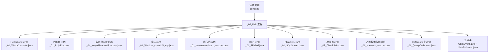

图表来源
- [_01_WordCountNet.java](file://_06_flink/src/main/java/_01_HelloWorld/_01_WordCountNet.java#L1-L57)
- [_01_PojoExe.java](file://_06_flink/src/main/java/_02_Pojo/_01_PojoExe.java#L1-L59)
- [_04_KeyedProcessFunction.java](file://_06_flink/src/main/java/_08_richFunction/_04_KeyedProcessFunction.java#L1-L63)
- [_01_Window_countUV_my.java](file://_06_flink/src/main/java/_09_window/_01_Window_countUV_my.java#L1-L62)
- [_01_insertWaterMark_teacher.java](file://_06_flink/src/main/java/_10_waterMark/_01_insertWaterMark_teacher.java#L1-L78)
- [_01_3Failed.java](file://_06_flink/src/main/java/_18_CEP/_01_3Failed.java#L1-L115)
- [_01_SQLStream.java](file://_06_flink/src/main/java/_19_FlinkSQL/_01_SQLStream.java#L1-L76)
- [_03_CheckPoint.java](file://_06_flink/src/main/java/_17_UV/_03_CheckPoint.java#L1-L55)
- [_01_lateness_teacher.java](file://_06_flink/src/main/java/_14_lateness/_01_lateness_teacher.java#L1-L58)
- [_01_QuaryCoStream.java](file://_06_flink/src/main/java/_15_CoStream/_01_QuaryCoStream.java#L1-L55)
- [ClickEvent.java](file://_06_flink/src/main/java/com/atguigu/utils/ClickEvent.java#L1-L34)
- [UserBehavior.java](file://_06_flink/src/main/java/com/atguigu/utils/UserBehavior.java#L1-L35)
- [pom.xml](file://_06_flink/pom.xml#L1-L175)

章节来源
- [pom.xml](file://_06_flink/pom.xml#L1-L175)

## 核心组件
- 流执行环境与并行度：通过环境配置统一设置并行度，贯穿所有示例。
- 数据源与转换：从Socket、文件、自定义Source或静态元素读取数据，经flatMap、map、filter、keyBy等转换。
- 状态与检查点：启用检查点、配置存储位置与后端，保障容错与一致性。
- 时间语义与水位线：为事件时间分配时间戳并插入水位线，支持有序/乱序数据。
- 窗口与聚合：滚动/滑动/会话窗口，配合Process/Aggregate/Reduce等窗口函数。
- CEP模式匹配：定义模式并匹配连续事件序列，用于异常检测与风控。
- FlinkSQL桥接：将DataStream转换为动态表，再转回DataStream进行输出。
- 富函数与定时器：KeyedProcessFunction实现精确控制与定时触发。
- CoStream与侧输出：连接查询流与主数据流，对迟到数据进行侧输出分流。

章节来源
- [_01_WordCountNet.java](file://_06_flink/src/main/java/_01_HelloWorld/_01_WordCountNet.java#L1-L57)
- [_03_CheckPoint.java](file://_06_flink/src/main/java/_17_UV/_03_CheckPoint.java#L1-L55)
- [_01_insertWaterMark_teacher.java](file://_06_flink/src/main/java/_10_waterMark/_01_insertWaterMark_teacher.java#L1-L78)
- [_01_Window_countUV_my.java](file://_06_flink/src/main/java/_09_window/_01_Window_countUV_my.java#L1-L62)
- [_01_3Failed.java](file://_06_flink/src/main/java/_18_CEP/_01_3Failed.java#L1-L115)
- [_01_SQLStream.java](file://_06_flink/src/main/java/_19_FlinkSQL/_01_SQLStream.java#L1-L76)
- [_04_KeyedProcessFunction.java](file://_06_flink/src/main/java/_08_richFunction/_04_KeyedProcessFunction.java#L1-L63)
- [_01_QuaryCoStream.java](file://_06_flink/src/main/java/_15_CoStream/_01_QuaryCoStream.java#L1-L55)
- [_01_lateness_teacher.java](file://_06_flink/src/main/java/_14_lateness/_01_lateness_teacher.java#L1-L58)

## 架构总览
下图展示了Flink流处理的典型数据通路：数据源 → 分配时间戳与水位线 → 键控分区 → 窗口/CEP/状态 → 输出Sink。

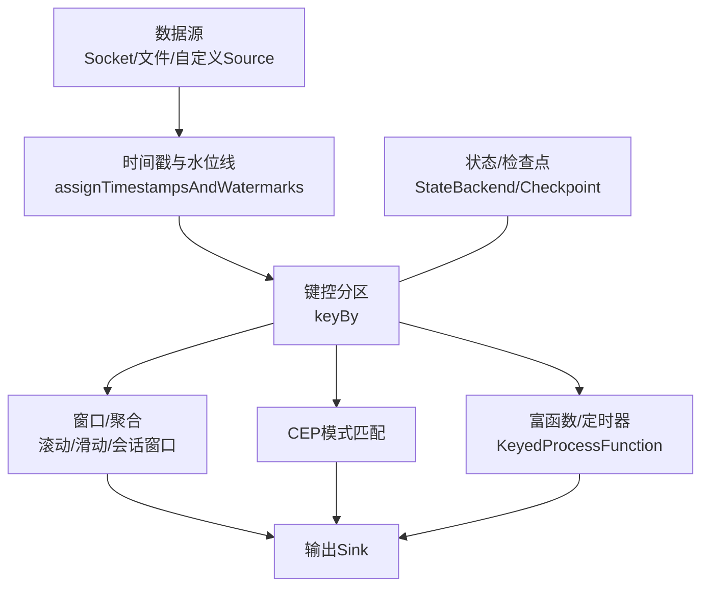

图表来源
- [_01_insertWaterMark_teacher.java](file://_06_flink/src/main/java/_10_waterMark/_01_insertWaterMark_teacher.java#L1-L78)
- [_01_Window_countUV_my.java](file://_06_flink/src/main/java/_09_window/_01_Window_countUV_my.java#L1-L62)
- [_01_3Failed.java](file://_06_flink/src/main/java/_18_CEP/_01_3Failed.java#L1-L115)
- [_04_KeyedProcessFunction.java](file://_06_flink/src/main/java/_08_richFunction/_04_KeyedProcessFunction.java#L1-L63)
- [_03_CheckPoint.java](file://_06_flink/src/main/java/_17_UV/_03_CheckPoint.java#L1-L55)

## 详细组件分析

### DataStream API：从Socket到词频统计
- 环境与并行度：统一设置并行度，便于演示单机执行。
- Socket数据源：通过网络端口接收文本行，按空格切分单词并映射为二元组。
- 键控与聚合：按单词keyBy后进行sum聚合，最终打印结果。
- 检查点：示例注释展示了启用检查点、配置存储与清理策略的方法。

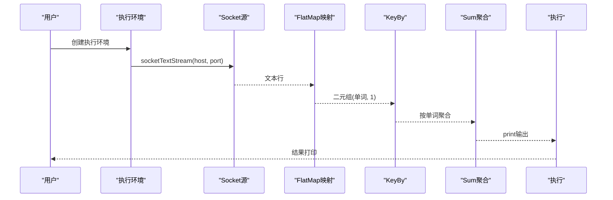

图表来源
- [_01_WordCountNet.java](file://_06_flink/src/main/java/_01_HelloWorld/_01_WordCountNet.java#L1-L57)

章节来源
- [_01_WordCountNet.java](file://_06_flink/src/main/java/_01_HelloWorld/_01_WordCountNet.java#L1-L57)

### POJO与键控聚合
- POJO封装：将词频统计结果封装为POJO，便于后续keyBy与sum。
- 键控与聚合：以字段名进行聚合，体现Flink对POJO字段的友好支持。

章节来源
- [_01_PojoExe.java](file://_06_flink/src/main/java/_02_Pojo/_01_PojoExe.java#L1-L59)

### 富函数与定时器：KeyedProcessFunction
- 定时器注册：分别注册处理时间与事件时间定时器，演示两种时间语义的差异。
- 定时器触发：在回调中输出当前Key与定时器触发信息，便于调试与审计。

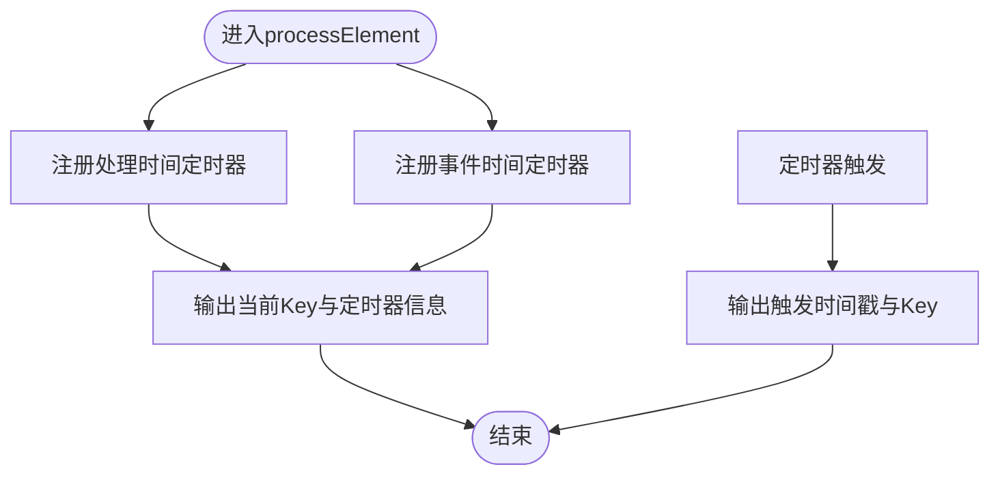

图表来源
- [_04_KeyedProcessFunction.java](file://_06_flink/src/main/java/_08_richFunction/_04_KeyedProcessFunction.java#L1-L63)

章节来源
- [_04_KeyedProcessFunction.java](file://_06_flink/src/main/java/_08_richFunction/_04_KeyedProcessFunction.java#L1-L63)

### 窗口与UV统计
- 滚动处理时间窗口：以固定窗口大小统计每个Key在窗口内的点击次数。
- ProcessWindowFunction：在窗口内收集全部元素，计算窗口起止时间与元素数量。

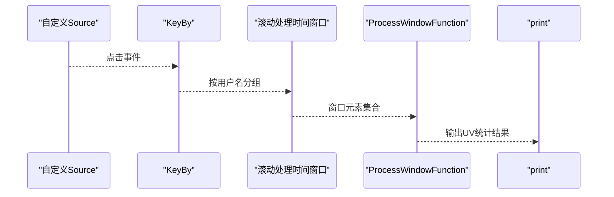

图表来源
- [_01_Window_countUV_my.java](file://_06_flink/src/main/java/_09_window/_01_Window_countUV_my.java#L1-L62)

章节来源
- [_01_Window_countUV_my.java](file://_06_flink/src/main/java/_09_window/_01_Window_countUV_my.java#L1-L62)

### 水位线与事件时间
- 事件时间分配：将输入中的时间戳字段映射为事件时间。
- 水位线策略：采用有界乱序（bounded out-of-orderness），设置最大延迟时间。
- 窗口计算：基于事件时间的滚动窗口，确保结果可复现且不受乱序影响。

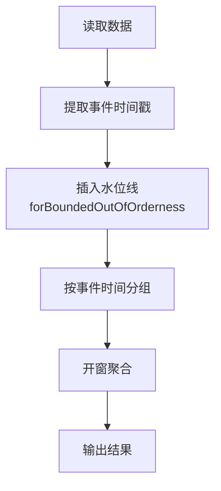

图表来源
- [_01_insertWaterMark_teacher.java](file://_06_flink/src/main/java/_10_waterMark/_01_insertWaterMark_teacher.java#L1-L78)

章节来源
- [_01_insertWaterMark_teacher.java](file://_06_flink/src/main/java/_10_waterMark/_01_insertWaterMark_teacher.java#L1-L78)

### CEP复杂事件处理：连续失败检测
- 事件模型：定义包含用户、行为与时间戳的事件类。
- 模式定义：连续三次失败作为规则，要求事件严格相邻。
- 模式匹配：在Keyed流上匹配模式并输出告警信息。

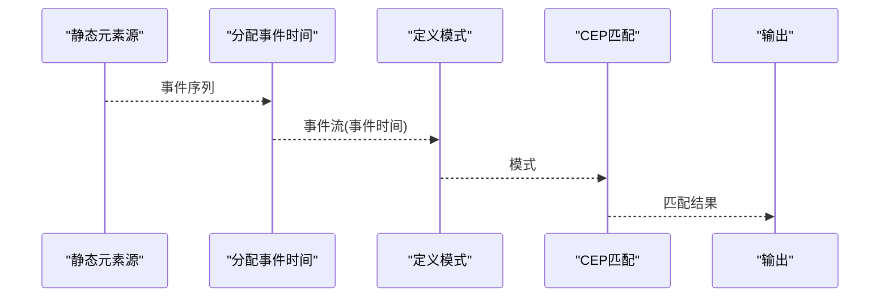

图表来源
- [_01_3Failed.java](file://_06_flink/src/main/java/_18_CEP/_01_3Failed.java#L1-L115)

章节来源
- [_01_3Failed.java](file://_06_flink/src/main/java/_18_CEP/_01_3Failed.java#L1-L115)

### FlinkSQL桥接：动态表与Changelog
- 数据流到动态表：将DataStream转换为表，并声明事件时间列。
- 动态表到数据流：将表转换为Changelog流以便进一步处理与打印。

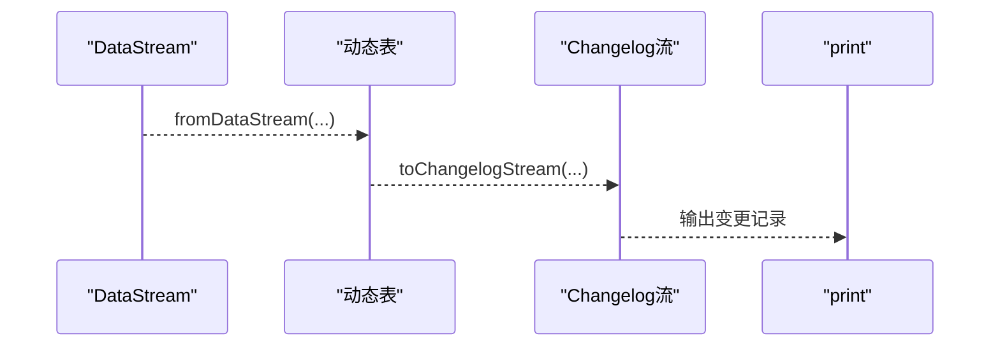

图表来源
- [_01_SQLStream.java](file://_06_flink/src/main/java/_19_FlinkSQL/_01_SQLStream.java#L1-L76)

章节来源
- [_01_SQLStream.java](file://_06_flink/src/main/java/_19_FlinkSQL/_01_SQLStream.java#L1-L76)

### 检查点与状态管理
- 检查点配置：启用周期性检查点、设置存储路径与后端。
- 状态后端：示例展示了HashMapStateBackend的使用方式。
- 生产建议：注释中给出外部存储与清理策略的配置思路。

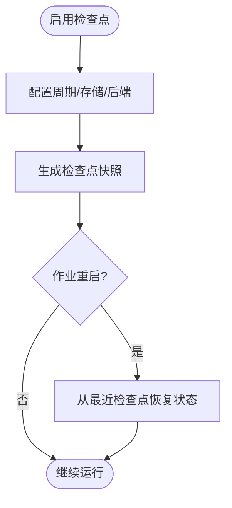

图表来源
- [_03_CheckPoint.java](file://_06_flink/src/main/java/_17_UV/_03_CheckPoint.java#L1-L55)

章节来源
- [_03_CheckPoint.java](file://_06_flink/src/main/java/_17_UV/_03_CheckPoint.java#L1-L55)

### 迟到数据与侧输出
- 迟到判定：比较事件时间与当前水位线，落后于水位线的数据视为迟到。
- 侧输出流：将迟到数据输出到单独的SideOutput标签流，避免污染主流。

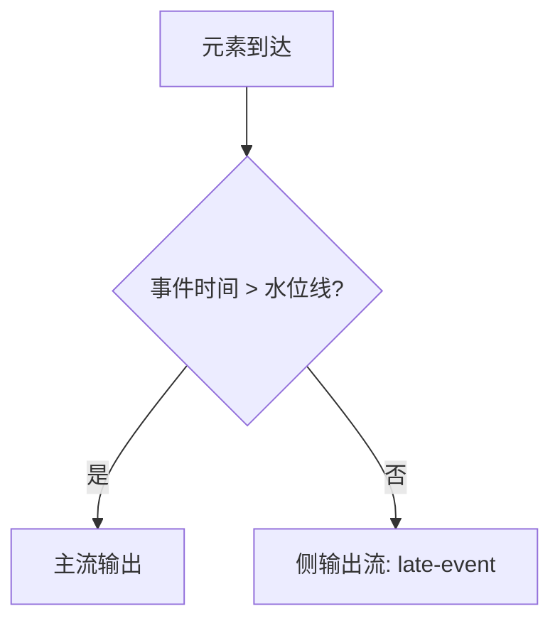

图表来源
- [_01_lateness_teacher.java](file://_06_flink/src/main/java/_14_lateness/_01_lateness_teacher.java#L1-L58)

章节来源
- [_01_lateness_teacher.java](file://_06_flink/src/main/java/_14_lateness/_01_lateness_teacher.java#L1-L58)

### CoStream查询流与广播
- 广播维度：将查询流以广播形式分发给所有并行子任务。
- 连接策略：通过CoFlatMap在主流与查询流之间进行联动，实现按条件过滤。

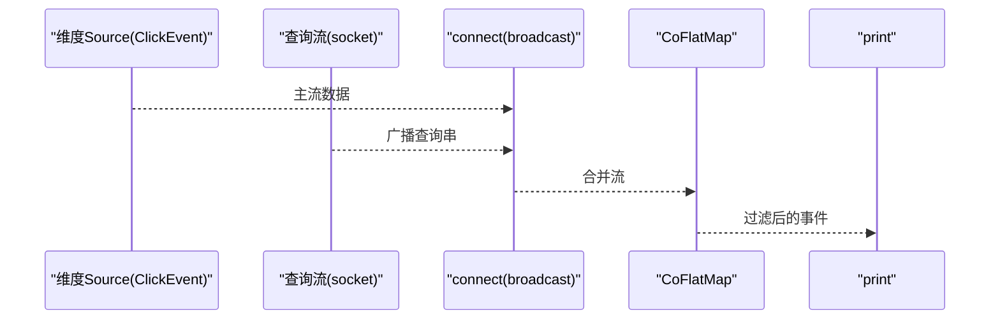

图表来源
- [_01_QuaryCoStream.java](file://_06_flink/src/main/java/_15_CoStream/_01_QuaryCoStream.java#L1-L55)

章节来源
- [_01_QuaryCoStream.java](file://_06_flink/src/main/java/_15_CoStream/_01_QuaryCoStream.java#L1-L55)

## 依赖分析
- Flink核心与生态：包含Streaming Java、Clients、CEP、Table API Bridge、Planner Blink、Kafka Connector、CSV等依赖。
- 版本与Scala兼容：统一使用Flink 1.13.0与Scala 2.12。
- 打包与编译：Maven Assembly插件用于打包可运行Jar；编译插件指定Java 8。

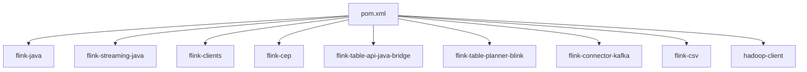

图表来源
- [pom.xml](file://_06_flink/pom.xml#L1-L175)

章节来源
- [pom.xml](file://_06_flink/pom.xml#L1-L175)
- [_06_flink_my_pom.xml](file://_06_flink_my/pom.xml#L1-L175)

## 性能考虑
- 并行度与分区：合理设置并行度，避免热点Key导致倾斜；必要时使用重平衡或自定义分区策略。
- 窗口与触发器：根据业务选择合适的窗口类型与触发策略，减少不必要的全量聚合。
- 状态与检查点：选择合适的状态后端与检查点间隔，降低检查点开销与恢复时间。
- 定时器与背压：避免过多定时器引发频繁触发；关注下游背压，及时扩容或优化算子。
- 资源与内存：结合RocksDB等外部状态后端，平衡内存与磁盘I/O。

## 故障排查指南
- 水位线不前进：确认时间戳分配是否正确、水位线策略是否合理、最大乱序延迟是否过大。
- 迟到数据丢失：检查AllowedLateness与SideOutput配置，确保迟到数据被正确分流。
- 检查点失败：核对存储路径权限、后端类型与网络稳定性；必要时调整最小暂停间隔。
- 定时器未触发：确认注册的是处理时间还是事件时间定时器，以及窗口边界与水位线推进情况。
- CoStream广播问题：确保广播前的维度流并行度为1，避免下游看到不一致的广播状态。

章节来源
- [_01_insertWaterMark_teacher.java](file://_06_flink/src/main/java/_10_waterMark/_01_insertWaterMark_teacher.java#L1-L78)
- [_01_lateness_teacher.java](file://_06_flink/src/main/java/_14_lateness/_01_lateness_teacher.java#L1-L58)
- [_03_CheckPoint.java](file://_06_flink/src/main/java/_17_UV/_03_CheckPoint.java#L1-L55)
- [_04_KeyedProcessFunction.java](file://_06_flink/src/main/java/_08_richFunction/_04_KeyedProcessFunction.java#L1-L63)
- [_01_QuaryCoStream.java](file://_06_flink/src/main/java/_15_CoStream/_01_QuaryCoStream.java#L1-L55)

## 结论
本仓库提供了从基础到进阶的Flink流处理实践路径：从Socket词频统计到窗口聚合、水位线与迟到数据、CEP模式匹配、SQL桥接、状态与检查点、富函数与定时器、CoStream与侧输出。结合这些示例，读者可以快速搭建电商实时监控等生产级应用，并在实践中不断优化性能与可靠性。

## 附录
- 实战建议
  - 事件时间优先：在需要可复现结果与跨节点一致性时，优先使用事件时间与水位线。
  - 窗口设计：根据业务SLA选择滚动/滑动/会话窗口，控制允许延迟与侧输出策略。
  - 容错与恢复：启用检查点并配置外部存储，结合状态后端与清理策略提升可用性。
  - 调优手段：观察背压、调节并行度、优化KeyBy与窗口大小、减少状态大小与序列化开销。
- 项目场景参考
  - 电商实时监控：UV/商品热度TopN、登录失败检测、订单超时告警、实时报表与看板。