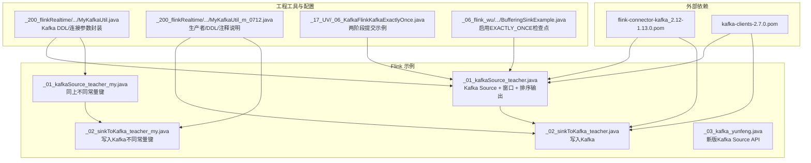
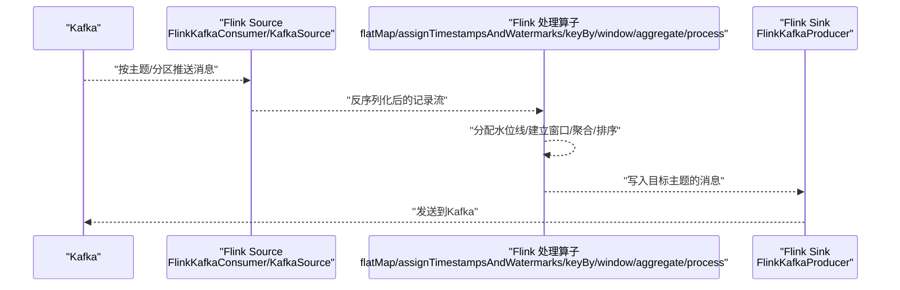
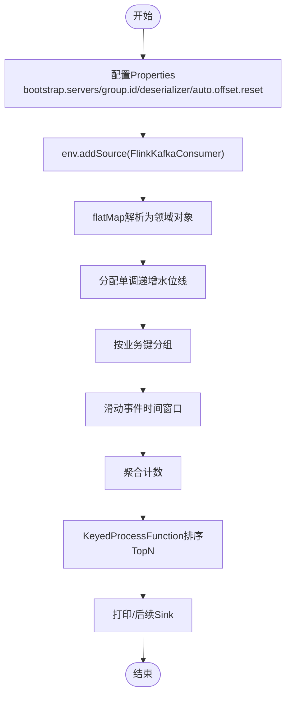
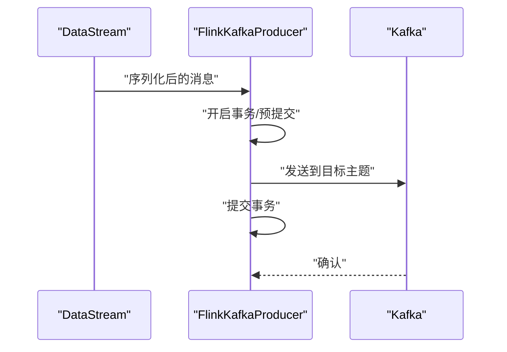
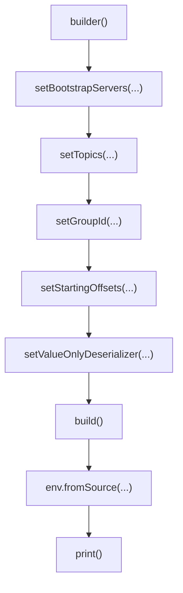
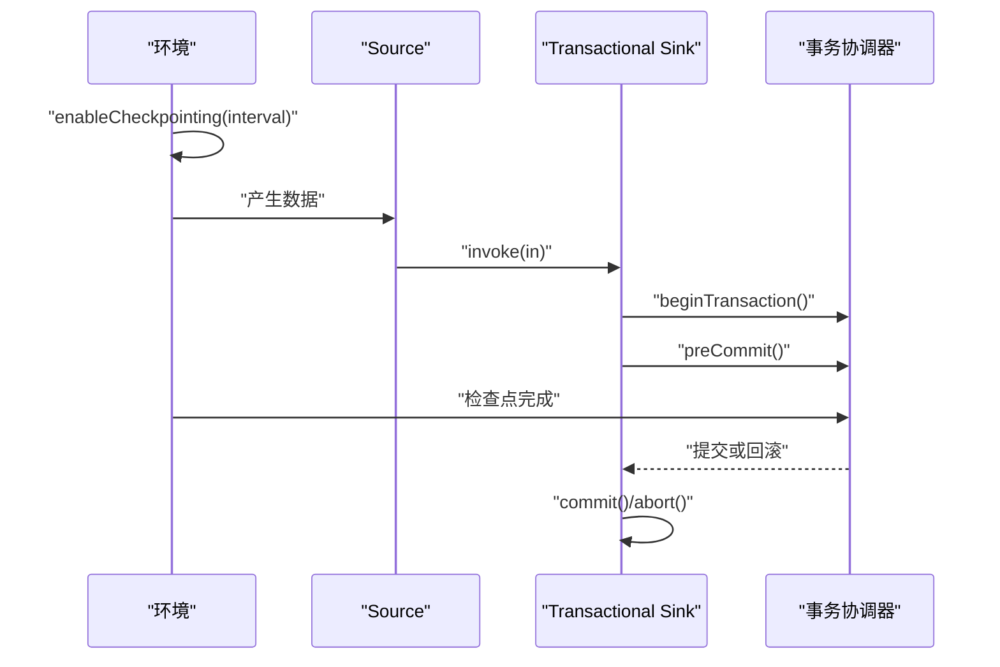
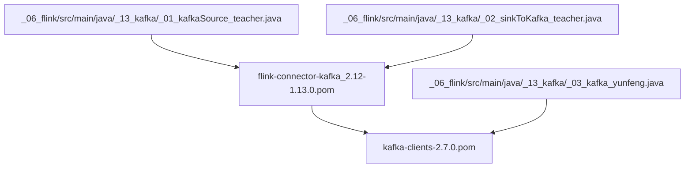

# Kafka集成

<cite>
**本文引用的文件**
- [_06_flink/src/main/java/_13_kafka/_01_kafkaSource_teacher.java](file://_06_flink/src/main/java/_13_kafka/_01_kafkaSource_teacher.java)
- [_06_flink/src/main/java/_13_kafka/_01_kafkaSource_teacher_my.java](file://_06_flink/src/main/java/_13_kafka/_01_kafkaSource_teacher_my.java)
- [_06_flink/src/main/java/_13_kafka/_02_sinkToKafka_teacher.java](file://_06_flink/src/main/java/_13_kafka/_02_sinkToKafka_teacher.java)
- [_06_flink/src/main/java/_13_kafka/_02_sinkToKafka_teacher_my.java](file://_06_flink/src/main/java/_13_kafka/_02_sinkToKafka_teacher_my.java)
- [_06_flink/src/main/java/_13_kafka/_03_kafka_yunfeng.java](file://_06_flink/src/main/java/_13_kafka/_03_kafka_yunfeng.java)
- [_06_flink/src/main/java/_17_UV/_06_KafkaFlinkKafkaExactlyOnce.java](file://_06_flink/src/main/java/_17_UV/_06_KafkaFlinkKafkaExactlyOnce.java)
- [_200_flinkRealtime/src/main/java/com/atguigu/gmall/realtime/util/MyKafkaUtil.java](file://_200_flinkRealtime/src/main/java/com/atguigu/gmall/realtime/util/MyKafkaUtil.java)
- [_200_flinkRealtime/src/main/java/com/atguigu/gmall/realtime/util/MyKafkaUtil_m_0712.java](file://_200_flinkRealtime/src/main/java/com/atguigu/gmall/realtime/util/MyKafkaUtil_m_0712.java)
- [_06_flink_wu/src/main/java/com/atguigu/chatper09/BufferingSinkExample.java](file://_06_flink_wu/src/main/java/com/atguigu/chatper09/BufferingSinkExample.java)
- [org/apache/flink/flink-connector-kafka_2.12/1.13.0/flink-connector-kafka_2.12-1.13.0.pom](file://org/apache/flink/flink-connector-kafka_2.12/1.13.0/flink-connector-kafka_2.12-1.13.0.pom)
- [org/apache/kafka/kafka-clients/2.7.0/kafka-clients-2.7.0.pom](file://org/apache/kafka/kafka-clients/2.7.0/kafka-clients-2.7.0.pom)
</cite>

## 目录
1. [简介](#简介)
2. [项目结构](#项目结构)
3. [核心组件](#核心组件)
4. [架构总览](#架构总览)
5. [详细组件分析](#详细组件分析)
6. [依赖关系分析](#依赖关系分析)
7. [性能考虑](#性能考虑)
8. [故障排查指南](#故障排查指南)
9. [结论](#结论)
10. [附录](#附录)

## 简介
本技术文档围绕Flink与Kafka的集成实践展开，覆盖Kafka Source与Kafka Sink的配置与使用、主题订阅与分区消费、偏移量管理、Exactly-Once语义保障机制、消费者组与故障恢复策略，以及性能优化与监控最佳实践。文档基于仓库中的示例代码进行系统性梳理，帮助读者快速构建可靠的实时数据管道。

## 项目结构
本仓库中与Kafka集成直接相关的示例位于“_06_flink”模块下的“_13_kafka”包，涵盖两类典型场景：
- 从Kafka读取事件流并进行窗口聚合与TopN输出
- 将数据写入Kafka作为下游输出

此外，还包含：
- 使用新版Kafka Source API的示例
- Exactly-Once语义的两阶段提交实现思路
- 工程级工具类封装Kafka连接参数与DDL片段
- 检查点配置示例，体现Exactly-Once的运行时要求

图表来源
- [_06_flink/src/main/java/_13_kafka/_01_kafkaSource_teacher.java](file://_06_flink/src/main/java/_13_kafka/_01_kafkaSource_teacher.java#L1-L160)
- [_06_flink/src/main/java/_13_kafka/_02_sinkToKafka_teacher.java](file://_06_flink/src/main/java/_13_kafka/_02_sinkToKafka_teacher.java#L1-L33)
- [_06_flink/src/main/java/_13_kafka/_03_kafka_yunfeng.java](file://_06_flink/src/main/java/_13_kafka/_03_kafka_yunfeng.java#L1-L43)
- [_200_flinkRealtime/src/main/java/com/atguigu/gmall/realtime/util/MyKafkaUtil.java](file://_200_flinkRealtime/src/main/java/com/atguigu/gmall/realtime/util/MyKafkaUtil.java#L61-L91)
- [_200_flinkRealtime/src/main/java/com/atguigu/gmall/realtime/util/MyKafkaUtil_m_0712.java](file://_200_flinkRealtime/src/main/java/com/atguigu/gmall/realtime/util/MyKafkaUtil_m_0712.java#L108-L196)
- [_06_flink/src/main/java/_17_UV/_06_KafkaFlinkKafkaExactlyOnce.java](file://_06_flink/src/main/java/_17_UV/_06_KafkaFlinkKafkaExactlyOnce.java#L1-L163)
- [_06_flink_wu/src/main/java/com/atguigu/chatper09/BufferingSinkExample.java](file://_06_flink_wu/src/main/java/com/atguigu/chatper09/BufferingSinkExample.java#L29-L56)
- [org/apache/flink/flink-connector-kafka_2.12/1.13.0/flink-connector-kafka_2.12-1.13.0.pom](file://org/apache/flink/flink-connector-kafka_2.12/1.13.0/flink-connector-kafka_2.12-1.13.0.pom#L1-L39)
- [org/apache/kafka/kafka-clients/2.7.0/kafka-clients-2.7.0.pom](file://org/apache/kafka/kafka-clients/2.7.0/kafka-clients-2.7.0.pom#L1-L42)

章节来源
- [file://_06_flink/src/main/java/_13_kafka/_01_kafkaSource_teacher.java#L1-L160]
- [file://_06_flink/src/main/java/_13_kafka/_02_sinkToKafka_teacher.java#L1-L33]
- [file://_06_flink/src/main/java/_13_kafka/_03_kafka_yunfeng.java#L1-L43]
- [file://_200_flinkRealtime/src/main/java/com/atguigu/gmall/realtime/util/MyKafkaUtil.java#L61-L91]
- [file://_200_flinkRealtime/src/main/java/com/atguigu/gmall/realtime/util/MyKafkaUtil_m_0712.java#L108-L196]
- [file://_06_flink/src/main/java/_17_UV/_06_KafkaFlinkKafkaExactlyOnce.java#L1-L163]
- [file://_06_flink_wu/src/main/java/com/atguigu/chatper09/BufferingSinkExample.java#L29-L56]
- [file://org/apache/flink/flink-connector-kafka_2.12/1.13.0/flink-connector-kafka_2.12-1.13.0.pom#L1-L39]
- [file://org/apache/kafka/kafka-clients/2.7.0/kafka-clients-2.7.0.pom#L1-L42]

## 核心组件
- Kafka Source（旧版FlinkKafkaConsumer）
  - 通过SimpleStringSchema或自定义KafkaDeserializationSchema解析消息
  - 设置消费者组ID、偏移量重置策略、反序列化器等
  - 在示例中结合水位线与滑动窗口完成实时统计
- Kafka Sink（FlinkKafkaProducer）
  - 使用SimpleStringSchema或自定义KafkaSerializationSchema序列化输出
  - 支持Exactly-Once语义（事务模式），需配合检查点
- 新版Kafka Source API（KafkaSource.builder）
  - 以builder方式声明bootstrap.servers、topics、groupId、startingOffsets、valueOnlyDeserializer
  - 适合新版本Flink Connector
- 工具类封装
  - 提供Kafka DDL片段与连接参数模板，便于统一管理
  - 生产者支持事务超时配置与Exactly-Once语义
- Exactly-Once语义
  - 通过两阶段提交（TwoPhaseCommitSinkFunction）与检查点协同实现
  - 检查点模式需设置为EXACTLY_ONCE，且事务超时应大于检查点间隔

章节来源
- [file://_06_flink/src/main/java/_13_kafka/_01_kafkaSource_teacher.java#L30-L110]
- [file://_06_flink/src/main/java/_13_kafka/_01_kafkaSource_teacher_my.java#L30-L110]
- [file://_06_flink/src/main/java/_13_kafka/_02_sinkToKafka_teacher.java#L13-L31]
- [file://_06_flink/src/main/java/_13_kafka/_02_sinkToKafka_teacher_my.java#L11-L29]
- [file://_06_flink/src/main/java/_13_kafka/_03_kafka_yunfeng.java#L18-L30]
- [file://_200_flinkRealtime/src/main/java/com/atguigu/gmall/realtime/util/MyKafkaUtil.java#L61-L91]
- [file://_200_flinkRealtime/src/main/java/com/atguigu/gmall/realtime/util/MyKafkaUtil_m_0712.java#L108-L196]
- [file://_06_flink/src/main/java/_17_UV/_06_KafkaFlinkKafkaExactlyOnce.java#L24-L163]
- [file://_06_flink_wu/src/main/java/com/atguigu/chatper09/BufferingSinkExample.java#L42-L50]

## 架构总览
下图展示了从Kafka读取数据、在Flink中进行窗口计算与TopN排序，并将结果写回Kafka的整体流程。

图表来源
- [_06_flink/src/main/java/_13_kafka/_01_kafkaSource_teacher.java](file://_06_flink/src/main/java/_13_kafka/_01_kafkaSource_teacher.java#L30-L110)
- [_06_flink/src/main/java/_13_kafka/_02_sinkToKafka_teacher.java](file://_06_flink/src/main/java/_13_kafka/_02_sinkToKafka_teacher.java#L13-L31)
- [_06_flink/src/main/java/_13_kafka/_03_kafka_yunfeng.java](file://_06_flink/src/main/java/_13_kafka/_03_kafka_yunfeng.java#L18-L30)

## 详细组件分析

### 组件A：Kafka Source（旧版FlinkKafkaConsumer）
- 配置要点
  - bootstrap.servers：Kafka集群地址
  - group.id：消费者组ID
  - key/value.deserializer：键值反序列化器
  - auto.offset.reset：偏移量重置策略（如latest）
- 数据处理链路
  - flatMap解析为领域对象
  - 分配单调递增水位线
  - 按商品ID分组，滑动窗口聚合
  - 再按窗口结束时间分组，使用KeyedProcessFunction做TopN
  - 最终打印结果
- 关键路径
  - Source配置与添加：[file://_06_flink/src/main/java/_13_kafka/_01_kafkaSource_teacher.java#L35-L50]
  - flatMap解析与过滤：[file://_06_flink/src/main/java/_13_kafka/_01_kafkaSource_teacher.java#L49-L61]
  - 水位线与窗口：[file://_06_flink/src/main/java/_13_kafka/_01_kafkaSource_teacher.java#L62-L74]
  - 聚合与排序输出：[file://_06_flink/src/main/java/_13_kafka/_01_kafkaSource_teacher.java#L74-L109]

图表来源
- [_06_flink/src/main/java/_13_kafka/_01_kafkaSource_teacher.java](file://_06_flink/src/main/java/_13_kafka/_01_kafkaSource_teacher.java#L35-L110)

章节来源
- [file://_06_flink/src/main/java/_13_kafka/_01_kafkaSource_teacher.java#L30-L110]
- [file://_06_flink/src/main/java/_13_kafka/_01_kafkaSource_teacher_my.java#L30-L110]

### 组件B：Kafka Sink（FlinkKafkaProducer）
- 配置要点
  - bootstrap.servers：Kafka集群地址
  - 序列化器：SimpleStringSchema或自定义KafkaSerializationSchema
  - 事务超时：TRANSACTION_TIMEOUT_CONFIG
  - 语义：Semantic.EXACTLY_ONCE
- 关键路径
  - 生产者构造与添加Sink：[file://_06_flink/src/main/java/_13_kafka/_02_sinkToKafka_teacher.java#L19-L29]
  - 生产者构造与添加Sink（不同常量键）：[file://_06_flink/src/main/java/_13_kafka/_02_sinkToKafka_teacher_my.java#L16-L26]
  - 工具类封装生产者与DDL：[file://_200_flinkRealtime/src/main/java/com/atguigu/gmall/realtime/util/MyKafkaUtil.java#L61-L91]
  - 事务超时与语义说明（注释）：[file://_200_flinkRealtime/src/main/java/com/atguigu/gmall/realtime/util/MyKafkaUtil_m_0712.java#L108-L139]

图表来源
- [_06_flink/src/main/java/_13_kafka/_02_sinkToKafka_teacher.java](file://_06_flink/src/main/java/_13_kafka/_02_sinkToKafka_teacher.java#L19-L29)
- [_06_flink/src/main/java/_13_kafka/_02_sinkToKafka_teacher_my.java](file://_06_flink/src/main/java/_13_kafka/_02_sinkToKafka_teacher_my.java#L16-L26)
- [_200_flinkRealtime/src/main/java/com/atguigu/gmall/realtime/util/MyKafkaUtil.java](file://_200_flinkRealtime/src/main/java/com/atguigu/gmall/realtime/util/MyKafkaUtil.java#L61-L91)
- [_200_flinkRealtime/src/main/java/com/atguigu/gmall/realtime/util/MyKafkaUtil_m_0712.java](file://_200_flinkRealtime/src/main/java/com/atguigu/gmall/realtime/util/MyKafkaUtil_m_0712.java#L108-L139)

章节来源
- [file://_06_flink/src/main/java/_13_kafka/_02_sinkToKafka_teacher.java#L13-L31]
- [file://_06_flink/src/main/java/_13_kafka/_02_sinkToKafka_teacher_my.java#L11-L29]
- [file://_200_flinkRealtime/src/main/java/com/atguigu/gmall/realtime/util/MyKafkaUtil.java#L61-L91]
- [file://_200_flinkRealtime/src/main/java/com/atguigu/gmall/realtime/util/MyKafkaUtil_m_0712.java#L108-L139]

### 组件C：新版Kafka Source API（KafkaSource.builder）
- 配置要点
  - setBootstrapServers：Kafka集群地址
  - setTopics：订阅主题
  - setGroupId：消费者组ID
  - setStartingOffsets：从最新/最早/指定偏移量开始
  - setValueOnlyDeserializer：仅值反序列化器
- 关键路径
  - 构建与fromSource接入：[file://_06_flink/src/main/java/_13_kafka/_03_kafka_yunfeng.java#L18-L30]

图表来源
- [_06_flink/src/main/java/_13_kafka/_03_kafka_yunfeng.java](file://_06_flink/src/main/java/_13_kafka/_03_kafka_yunfeng.java#L18-L30)

章节来源
- [file://_06_flink/src/main/java/_13_kafka/_03_kafka_yunfeng.java#L18-L30]

### 组件D：Exactly-Once语义与两阶段提交
- 实现思路
  - 通过TwoPhaseCommitSinkFunction实现事务：beginTransaction、preCommit、commit/abort
  - 结合enableCheckpointing与CheckpointingMode.EXACTLY_ONCE
  - 事务超时需大于检查点间隔，避免事务过期导致回滚
- 关键路径
  - 两阶段提交示例：[file://_06_flink/src/main/java/_17_UV/_06_KafkaFlinkKafkaExactlyOnce.java#L94-L161]
  - 启用EXACTLY_ONCE检查点：[file://_06_flink_wu/src/main/java/com/atguigu/chatper09/BufferingSinkExample.java#L42-L49]

图表来源
- [_06_flink/src/main/java/_17_UV/_06_KafkaFlinkKafkaExactlyOnce.java](file://_06_flink/src/main/java/_17_UV/_06_KafkaFlinkKafkaExactlyOnce.java#L94-L161)
- [_06_flink_wu/src/main/java/com/atguigu/chatper09/BufferingSinkExample.java](file://_06_flink_wu/src/main/java/com/atguigu/chatper09/BufferingSinkExample.java#L42-L49)

章节来源
- [file://_06_flink/src/main/java/_17_UV/_06_KafkaFlinkKafkaExactlyOnce.java#L24-L163]
- [file://_06_flink_wu/src/main/java/com/atguigu/chatper09/BufferingSinkExample.java#L29-L56]

### 组件E：工程工具类封装（Kafka DDL与连接参数）
- 功能
  - 统一封装Kafka DDL片段（含connector、topic、bootstrap.servers、group.id、scan.startup.mode、format等）
  - 提供生产者构造方法，支持事务超时与Exactly-Once语义
- 关键路径
  - DDL模板与生产者封装：[file://_200_flinkRealtime/src/main/java/com/atguigu/gmall/realtime/util/MyKafkaUtil.java#L61-L91]
  - 生产者与事务超时说明（注释）：[file://_200_flinkRealtime/src/main/java/com/atguigu/gmall/realtime/util/MyKafkaUtil_m_0712.java#L108-L139]

章节来源
- [file://_200_flinkRealtime/src/main/java/com/atguigu/gmall/realtime/util/MyKafkaUtil.java#L61-L91]
- [file://_200_flinkRealtime/src/main/java/com/atguigu/gmall/realtime/util/MyKafkaUtil_m_0712.java#L108-L139]

## 依赖关系分析
- Flink Connector Kafka
  - 版本：1.13.0（示例中使用）
  - 作用：提供FlinkKafkaConsumer/FlinkKafkaProducer与Kafka交互能力
- Kafka Clients
  - 版本：2.7.0（示例中使用）
  - 作用：Kafka客户端库，负责网络通信与协议交互
- Maven依赖关系
  - Flink Connector依赖Kafka Clients
  - 示例工程通过Maven引入上述依赖

图表来源
- [org/apache/flink/flink-connector-kafka_2.12/1.13.0/flink-connector-kafka_2.12-1.13.0.pom](file://org/apache/flink/flink-connector-kafka_2.12/1.13.0/flink-connector-kafka_2.12-1.13.0.pom#L1-L39)
- [org/apache/kafka/kafka-clients/2.7.0/kafka-clients-2.7.0.pom](file://org/apache/kafka/kafka-clients/2.7.0/kafka-clients-2.7.0.pom#L1-L42)
- [_06_flink/src/main/java/_13_kafka/_01_kafkaSource_teacher.java](file://_06_flink/src/main/java/_13_kafka/_01_kafkaSource_teacher.java#L1-L160)
- [_06_flink/src/main/java/_13_kafka/_02_sinkToKafka_teacher.java](file://_06_flink/src/main/java/_13_kafka/_02_sinkToKafka_teacher.java#L1-L33)
- [_06_flink/src/main/java/_13_kafka/_03_kafka_yunfeng.java](file://_06_flink/src/main/java/_13_kafka/_03_kafka_yunfeng.java#L1-L43)

章节来源
- [file://org/apache/flink/flink-connector-kafka_2.12/1.13.0/flink-connector-kafka_2.12-1.13.0.pom#L1-L39]
- [file://org/apache/kafka/kafka-clients/2.7.0/kafka-clients-2.7.0.pom#L1-L42]

## 性能考虑
- 并行度与分区匹配
  - Source并行度建议与主题分区数一致，避免热点与背压
  - Sink并行度与目标主题分区数匹配，提升吞吐
- 序列化与反序列化
  - 使用轻量序列化方案（如SimpleStringSchema），减少CPU开销
  - 自定义序列化/反序列化时注意字节编码一致性
- 水位线与窗口
  - 合理设置最大无序度与AllowedLateness，平衡延迟与准确性
  - 滑动窗口的窗口大小与滑动步长需与业务需求匹配
- 检查点与事务
  - EXACTLY_ONCE下，检查点间隔与事务超时需协调，避免频繁回滚
  - 启用未对齐检查点可降低尾部延迟
- 网络与I/O
  - Kafka客户端压缩（如snappy/lz4）与批大小可调优
  - Flink端缓冲与背压监控，必要时启用RocksDB状态后端

## 故障排查指南
- 偏移量与消费者组
  - 若首次启动或重启后重复消费，检查auto.offset.reset与group.id是否正确
  - 消费停滞时，确认Kafka主题分区与Flink Source并行度匹配
- Exactly-Once失败
  - 检查是否启用EXACTLY_ONCE检查点模式
  - 校验事务超时是否大于检查点间隔
  - 观察两阶段提交回调（begin/preCommit/commit/abort）是否正常
- 生产者异常
  - 确认bootstrap.servers可达
  - 检查序列化器与消息键/值编码
  - 关注事务超时与网络抖动导致的提交失败
- 监控与日志
  - 关注Flink Web UI的检查点状态、背压与算子吞吐
  - Kafka端查看主题分区滞后与消费者组位移变化

章节来源
- [file://_06_flink/src/main/java/_17_UV/_06_KafkaFlinkKafkaExactlyOnce.java#L94-L161]
- [file://_06_flink_wu/src/main/java/com/atguigu/chatper09/BufferingSinkExample.java#L42-L49]
- [file://_200_flinkRealtime/src/main/java/com/atguigu/gmall/realtime/util/MyKafkaUtil_m_0712.java#L108-L139]

## 结论
通过仓库中的示例，可以清晰地构建从Kafka读取、在Flink中进行复杂事件处理与窗口计算，并将结果可靠地写回Kafka的数据流水线。结合工程工具类封装与两阶段提交实践，能够有效落地Exactly-Once语义与高可用的生产级集成方案。建议在生产环境中进一步完善监控、限流与资源规划，确保端到端的稳定性与性能。

## 附录
- 常用配置清单（基于示例）
  - Source
    - bootstrap.servers：Kafka集群地址
    - group.id：消费者组ID
    - key/value.deserializer：反序列化器
    - auto.offset.reset：latest/earliest
  - Sink
    - bootstrap.servers：Kafka集群地址
    - 事务超时：TRANSACTION_TIMEOUT_CONFIG
    - 语义：Semantic.EXACTLY_ONCE
  - 检查点
    - enableCheckpointing(interval)
    - CheckpointingMode.EXACTLY_ONCE
    - maxConcurrentCheckpoints、checkpointTimeout等