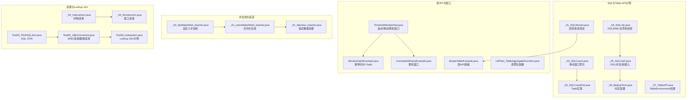
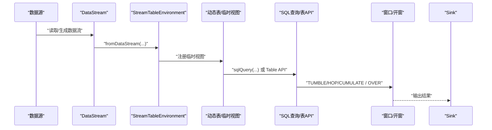
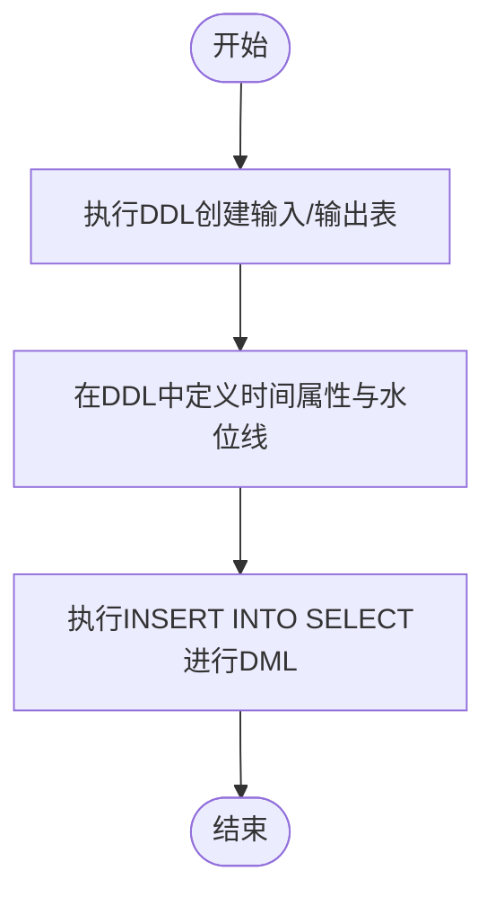
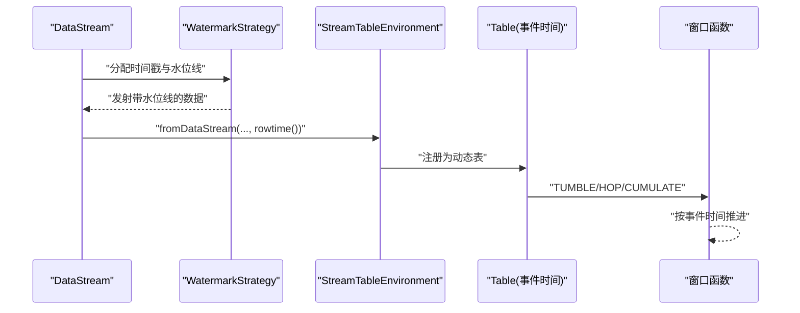
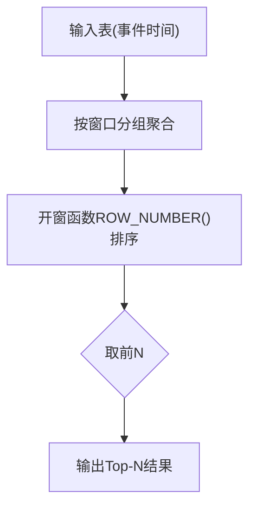
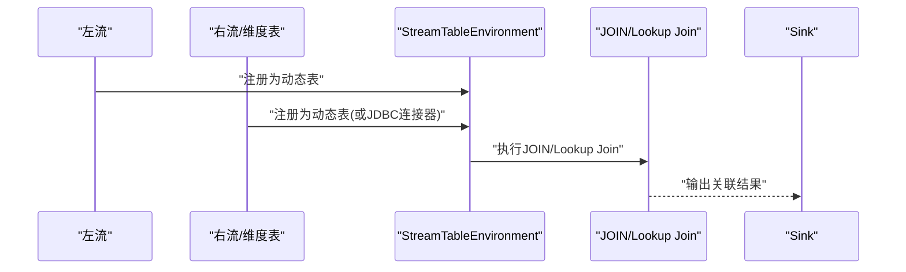
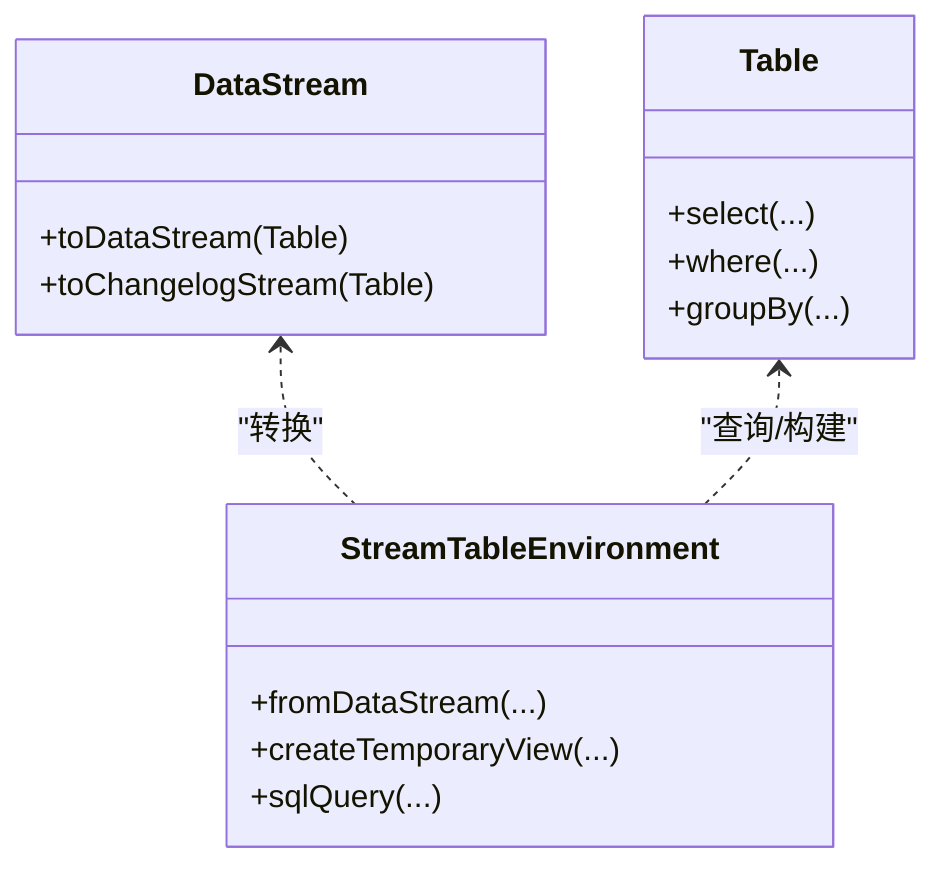
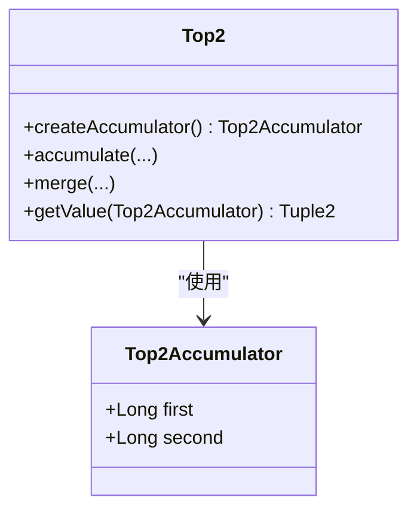
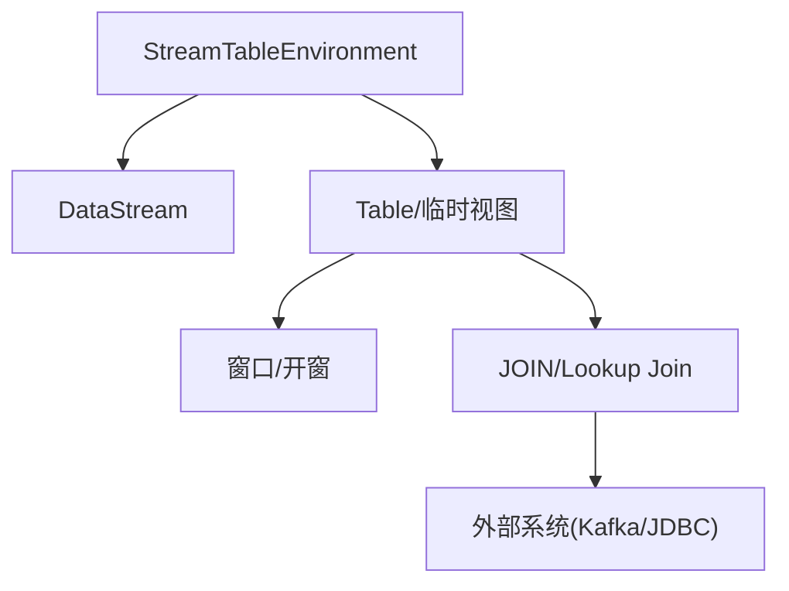

# SQL与Table API

<cite>
**本文引用的文件**
- [_06_flink/_19_FlinkSQL/_01_SQLStream.java](file://_06_flink/_19_FlinkSQL/_01_SQLStream.java)
- [_06_flink/_19_FlinkSQL/_02_SQLCount.java](file://_06_flink/_19_FlinkSQL/_02_SQLCount.java)
- [_06_flink/_19_FlinkSQL/_03_SQLCountHot.java](file://_06_flink/_19_FlinkSQL/_03_SQLCountHot.java)
- [_06_flink/_19_FlinkSQL/_04_SQLLite.java](file://_06_flink/_19_FlinkSQL/_04_SQLLite.java)
- [_06_flink/_19_FlinkSQL/_05_SQLLite2.java](file://_06_flink/_19_FlinkSQL/_05_SQLLite2.java)
- [_06_flink/_19_FlinkSQL/_06_BeijingTime.java](file://_06_flink/_19_FlinkSQL/_06_BeijingTime.java)
- [_06_flink/_19_FlinkSQL/_07_TableAPI.java](file://_06_flink/_19_FlinkSQL/_07_TableAPI.java)
- [_06_flink_wu/chapter11/SimpleTableExample.java](file://_06_flink_wu/chapter11/SimpleTableExample.java)
- [_06_flink_wu/chapter11/TimeAndWindowTest.java](file://_06_flink_wu/chapter11/TimeAndWindowTest.java)
- [_06_flink_wu/chapter11/WindowTopNExample.java](file://_06_flink_wu/chapter11/WindowTopNExample.java)
- [_06_flink_wu/chapter11/CumulateWindowExample.java](file://_06_flink_wu/chapter11/CumulateWindowExample.java)
- [_06_flink_wu/chapter11/UdfTest_TableAggregatteFunction.java](file://_06_flink_wu/chapter11/UdfTest_TableAggregatteFunction.java)
- [_06_flink/_10_waterMark/_02_diyWaterMark_teacher.java](file://_06_flink/_10_waterMark/_02_diyWaterMark_teacher.java)
- [_06_flink/_12_unionWaterMark/_01_unionWaterMark_teacher.java](file://_06_flink/_12_unionWaterMark/_01_unionWaterMark_teacher.java)
- [_06_flink/_14_lateness/_01_lateness_teacher.java](file://_06_flink/_14_lateness/_01_lateness_teacher.java)
- [_06_flink/_15_CoStream/_04_IntervalJoin.java](file://_06_flink/_15_CoStream/_04_IntervalJoin.java)
- [_06_flink/_15_CoStream/_05_WindowJoin.java](file://_06_flink/_15_CoStream/_05_WindowJoin.java)
- [_06_flink/_10_waterMark/_02_diyWaterMark_teacher.java](file://_06_flink/_10_waterMark/_02_diyWaterMark_teacher.java)
- [_06_flink/_12_unionWaterMark/_01_unionWaterMark_teacher.java](file://_06_flink/_12_unionWaterMark/_01_unionWaterMark_teacher.java)
- [_06_flink/_14_lateness/_01_lateness_teacher.java](file://_06_flink/_14_lateness/_01_lateness_teacher.java)
- [_200_flinkRealtime/test/Test02_FlinkSQLJoin.java](file://_200_flinkRealtime/test/Test02_FlinkSQLJoin.java)
- [_200_flinkRealtime/test/Test03_JdbcConnector.java](file://_200_flinkRealtime/test/Test03_JdbcConnector.java)
- [_300_eduRealtime/test/Test03_lookupJoin.java](file://_300_eduRealtime/test/Test03_lookupJoin.java)
- [_200_flinkRealtime0106/test/Test03_lookupJoin.java](file://_200_flinkRealtime0106/test/Test03_lookupJoin.java)
</cite>

## 目录
1. [引言](#引言)
2. [项目结构](#项目结构)
3. [核心组件](#核心组件)
4. [架构总览](#架构总览)
5. [详细组件分析](#详细组件分析)
6. [依赖分析](#依赖分析)
7. [性能考虑](#性能考虑)
8. [故障排查指南](#故障排查指南)
9. [结论](#结论)
10. [附录](#附录)

## 引言
本技术文档围绕Flink SQL与Table API展开，系统梳理流式SQL查询、表定义、DDL与DML操作、时间属性与水位线（Watermark）的使用、Table API与DataStream API的互操作、复杂SQL与Top-N实现、窗口与开窗函数、连接（JOIN）与Lookup Join、以及性能优化与执行监控要点。文档以仓库中的示例代码为依据，提供可追溯的“章节来源”和“图表来源”，帮助读者快速理解并落地到实际项目。

## 项目结构
本仓库中与Flink SQL/Table API相关的核心示例分布在以下路径：
- 流式SQL与Table API基础：_06_flink/_19_FlinkSQL
- 表API与窗口、时间属性示例：_06_flink_wu/chapter11
- 水位线与延迟数据处理：_06_flink/_10_waterMark、_06_flink/_12_unionWaterMark、_06_flink/_14_lateness
- 复杂连接与Lookup Join：_06_flink/_15_CoStream、_200_flinkRealtime/test、_300_eduRealtime/test、_200_flinkRealtime0106/test

**图表来源**
- [_06_flink/_19_FlinkSQL/_01_SQLStream.java](file://_06_flink/_19_FlinkSQL/_01_SQLStream.java#L1-L76)
- [_06_flink/_19_FlinkSQL/_02_SQLCount.java](file://_06_flink/_19_FlinkSQL/_02_SQLCount.java#L1-L86)
- [_06_flink/_19_FlinkSQL/_03_SQLCountHot.java](file://_06_flink/_19_FlinkSQL/_03_SQLCountHot.java#L1-L107)
- [_06_flink/_19_FlinkSQL/_04_SQLLite.java](file://_06_flink/_19_FlinkSQL/_04_SQLLite.java#L1-L46)
- [_06_flink/_19_FlinkSQL/_05_SQLLite2.java](file://_06_flink/_19_FlinkSQL/_05_SQLLite2.java#L1-L49)
- [_06_flink/_19_FlinkSQL/_06_BeijingTime.java](file://_06_flink/_19_FlinkSQL/_06_BeijingTime.java#L1-L27)
- [_06_flink/_19_FlinkSQL/_07_TableAPI.java](file://_06_flink/_19_FlinkSQL/_07_TableAPI.java#L1-L26)
- [_06_flink_wu/chapter11/SimpleTableExample.java](file://_06_flink_wu/chapter11/SimpleTableExample.java#L1-L58)
- [_06_flink_wu/chapter11/TimeAndWindowTest.java](file://_06_flink_wu/chapter11/TimeAndWindowTest.java#L62-L124)
- [_06_flink_wu/chapter11/WindowTopNExample.java](file://_06_flink_wu/chapter11/WindowTopNExample.java#L32-L60)
- [_06_flink_wu/chapter11/CumulateWindowExample.java](file://_06_flink_wu/chapter11/CumulateWindowExample.java#L32-L60)
- [_06_flink_wu/chapter11/UdfTest_TableAggregatteFunction.java](file://_06_flink_wu/chapter11/UdfTest_TableAggregatteFunction.java#L58-L91)
- [_06_flink/_10_waterMark/_02_diyWaterMark_teacher.java](file://_06_flink/_10_waterMark/_02_diyWaterMark_teacher.java#L1-L32)
- [_06_flink/_12_unionWaterMark/_01_unionWaterMark_teacher.java](file://_06_flink/_12_unionWaterMark/_01_unionWaterMark_teacher.java#L1-L32)
- [_06_flink/_14_lateness/_01_lateness_teacher.java](file://_06_flink/_14_lateness/_01_lateness_teacher.java#L1-L32)
- [_06_flink/_15_CoStream/_04_IntervalJoin.java](file://_06_flink/_15_CoStream/_04_IntervalJoin.java#L23-L39)
- [_06_flink/_15_CoStream/_05_WindowJoin.java](file://_06_flink/_15_CoStream/_05_WindowJoin.java#L26-L42)
- [_200_flinkRealtime/test/Test02_FlinkSQLJoin.java](file://_200_flinkRealtime/test/Test02_FlinkSQLJoin.java#L1-L35)
- [_200_flinkRealtime/test/Test03_JdbcConnector.java](file://_200_flinkRealtime/test/Test03_JdbcConnector.java#L1-L29)
- [_300_eduRealtime/test/Test03_lookupJoin.java](file://_300_eduRealtime/test/Test03_lookupJoin.java#L1-L37)
- [_200_flinkRealtime0106/test/Test03_lookupJoin.java](file://_200_flinkRealtime0106/test/Test03_lookupJoin.java#L1-L37)

**章节来源**
- [_06_flink/_19_FlinkSQL/_01_SQLStream.java](file://_06_flink/_19_FlinkSQL/_01_SQLStream.java#L1-L76)
- [_06_flink/_19_FlinkSQL/_02_SQLCount.java](file://_06_flink/_19_FlinkSQL/_02_SQLCount.java#L1-L86)
- [_06_flink/_19_FlinkSQL/_03_SQLCountHot.java](file://_06_flink/_19_FlinkSQL/_03_SQLCountHot.java#L1-L107)
- [_06_flink/_19_FlinkSQL/_04_SQLLite.java](file://_06_flink/_19_FlinkSQL/_04_SQLLite.java#L1-L46)
- [_06_flink/_19_FlinkSQL/_05_SQLLite2.java](file://_06_flink/_19_FlinkSQL/_05_SQLLite2.java#L1-L49)
- [_06_flink/_19_FlinkSQL/_06_BeijingTime.java](file://_06_flink/_19_FlinkSQL/_06_BeijingTime.java#L1-L27)
- [_06_flink/_19_FlinkSQL/_07_TableAPI.java](file://_06_flink/_19_FlinkSQL/_07_TableAPI.java#L1-L26)
- [_06_flink_wu/chapter11/SimpleTableExample.java](file://_06_flink_wu/chapter11/SimpleTableExample.java#L1-L58)
- [_06_flink_wu/chapter11/TimeAndWindowTest.java](file://_06_flink_wu/chapter11/TimeAndWindowTest.java#L62-L124)
- [_06_flink_wu/chapter11/WindowTopNExample.java](file://_06_flink_wu/chapter11/WindowTopNExample.java#L32-L60)
- [_06_flink_wu/chapter11/CumulateWindowExample.java](file://_06_flink_wu/chapter11/CumulateWindowExample.java#L32-L60)
- [_06_flink_wu/chapter11/UdfTest_TableAggregatteFunction.java](file://_06_flink_wu/chapter11/UdfTest_TableAggregatteFunction.java#L58-L91)
- [_06_flink/_10_waterMark/_02_diyWaterMark_teacher.java](file://_06_flink/_10_waterMark/_02_diyWaterMark_teacher.java#L1-L32)
- [_06_flink/_12_unionWaterMark/_01_unionWaterMark_teacher.java](file://_06_flink/_12_unionWaterMark/_01_unionWaterMark_teacher.java#L1-L32)
- [_06_flink/_14_lateness/_01_lateness_teacher.java](file://_06_flink/_14_lateness/_01_lateness_teacher.java#L1-L32)
- [_06_flink/_15_CoStream/_04_IntervalJoin.java](file://_06_flink/_15_CoStream/_04_IntervalJoin.java#L23-L39)
- [_06_flink/_15_CoStream/_05_WindowJoin.java](file://_06_flink/_15_CoStream/_05_WindowJoin.java#L26-L42)
- [_200_flinkRealtime/test/Test02_FlinkSQLJoin.java](file://_200_flinkRealtime/test/Test02_FlinkSQLJoin.java#L1-L35)
- [_200_flinkRealtime/test/Test03_JdbcConnector.java](file://_200_flinkRealtime/test/Test03_JdbcConnector.java#L1-L29)
- [_300_eduRealtime/test/Test03_lookupJoin.java](file://_300_eduRealtime/test/Test03_lookupJoin.java#L1-L37)
- [_200_flinkRealtime0106/test/Test03_lookupJoin.java](file://_200_flinkRealtime0106/test/Test03_lookupJoin.java#L1-L37)

## 核心组件
- 流式SQL与Table API桥接
  - 通过StreamTableEnvironment在DataStream与Table之间双向转换，支持将流注册为临时视图后进行SQL查询或直接使用Table API链式表达式。
  - 示例参考：[_06_flink/_19_FlinkSQL/_01_SQLStream.java](file://_06_flink/_19_FlinkSQL/_01_SQLStream.java#L1-L76)、[_06_flink_wu/chapter11/SimpleTableExample.java](file://_06_flink_wu/chapter11/SimpleTableExample.java#L1-L58)。

- 时间属性与水位线
  - 在将DataStream转换为Table时，使用rowtime()声明事件时间属性；在DDL中通过WATERMARK FOR定义水位线生成策略；在窗口函数中使用TUMBLE/HOP/CUMULATE等。
  - 示例参考：[_06_flink/_19_FlinkSQL/_05_SQLLite2.java](file://_06_flink/_19_FlinkSQL/_05_SQLLite2.java#L1-L49)、[_06_flink_wu/chapter11/TimeAndWindowTest.java](file://_06_flink_wu/chapter11/TimeAndWindowTest.java#L62-L124)。

- 窗口与开窗函数
  - 支持滚动（TUMBLE）、滑动（HOP）、累积（CUMULATE）窗口与OVER开窗；结合ROW_NUMBER()实现Top-N。
  - 示例参考：[_06_flink/_19_FlinkSQL/_02_SQLCount.java](file://_06_flink/_19_FlinkSQL/_02_SQLCount.java#L1-L86)、[_06_flink/_19_FlinkSQL/_03_SQLCountHot.java](file://_06_flink/_19_FlinkSQL/_03_SQLCountHot.java#L1-L107)、[_06_flink_wu/chapter11/WindowTopNExample.java](file://_06_flink_wu/chapter11/WindowTopNExample.java#L32-L60)。

- 连接与Lookup Join
  - 支持SQL JOIN、窗口连接、间隔连接；Lookup Join通过JDBC连接器与外部维度表进行关联。
  - 示例参考：[_06_flink/_15_CoStream/_04_IntervalJoin.java](file://_06_flink/_15_CoStream/_04_IntervalJoin.java#L23-L39)、[_06_flink/_15_CoStream/_05_WindowJoin.java](file://_06_flink/_15_CoStream/_05_WindowJoin.java#L26-L42)、[_200_flinkRealtime/test/Test03_JdbcConnector.java](file://_200_flinkRealtime/test/Test03_JdbcConnector.java#L1-L29)、[_300_eduRealtime/test/Test03_lookupJoin.java](file://_300_eduRealtime/test/Test03_lookupJoin.java#L1-L37)。

- DDL/DML与表定义
  - 使用executeSql创建表（文件系统、打印输出、Kafka、JDBC等），并执行INSERT INTO SELECT完成DML。
  - 示例参考：[_06_flink/_19_FlinkSQL/_04_SQLLite.java](file://_06_flink/_19_FlinkSQL/_04_SQLLite.java#L1-L46)、[_06_flink/_19_FlinkSQL/_05_SQLLite2.java](file://_06_flink/_19_FlinkSQL/_05_SQLLite2.java#L1-L49)。

**章节来源**
- [_06_flink/_19_FlinkSQL/_01_SQLStream.java](file://_06_flink/_19_FlinkSQL/_01_SQLStream.java#L1-L76)
- [_06_flink/_19_FlinkSQL/_02_SQLCount.java](file://_06_flink/_19_FlinkSQL/_02_SQLCount.java#L1-L86)
- [_06_flink/_19_FlinkSQL/_03_SQLCountHot.java](file://_06_flink/_19_FlinkSQL/_03_SQLCountHot.java#L1-L107)
- [_06_flink/_19_FlinkSQL/_04_SQLLite.java](file://_06_flink/_19_FlinkSQL/_04_SQLLite.java#L1-L46)
- [_06_flink/_19_FlinkSQL/_05_SQLLite2.java](file://_06_flink/_19_FlinkSQL/_05_SQLLite2.java#L1-L49)
- [_06_flink_wu/chapter11/SimpleTableExample.java](file://_06_flink_wu/chapter11/SimpleTableExample.java#L1-L58)
- [_06_flink_wu/chapter11/TimeAndWindowTest.java](file://_06_flink_wu/chapter11/TimeAndWindowTest.java#L62-L124)
- [_06_flink/_15_CoStream/_04_IntervalJoin.java](file://_06_flink/_15_CoStream/_04_IntervalJoin.java#L23-L39)
- [_06_flink/_15_CoStream/_05_WindowJoin.java](file://_06_flink/_15_CoStream/_05_WindowJoin.java#L26-L42)
- [_200_flinkRealtime/test/Test03_JdbcConnector.java](file://_200_flinkRealtime/test/Test03_JdbcConnector.java#L1-L29)
- [_300_eduRealtime/test/Test03_lookupJoin.java](file://_300_eduRealtime/test/Test03_lookupJoin.java#L1-L37)

## 架构总览
下图展示了从数据源到表、SQL查询、窗口与连接、再到Sink的整体流程。

**图表来源**
- [_06_flink/_19_FlinkSQL/_01_SQLStream.java](file://_06_flink/_19_FlinkSQL/_01_SQLStream.java#L1-L76)
- [_06_flink_wu/chapter11/SimpleTableExample.java](file://_06_flink_wu/chapter11/SimpleTableExample.java#L1-L58)
- [_06_flink_wu/chapter11/TimeAndWindowTest.java](file://_06_flink_wu/chapter11/TimeAndWindowTest.java#L62-L124)

## 详细组件分析

### 组件A：流式SQL与表定义（DDL/DML）
- 功能要点
  - 使用StreamTableEnvironment创建表（文件系统、打印输出、Kafka、JDBC等）。
  - 通过executeSql执行INSERT INTO SELECT完成DML。
  - 在DDL中定义时间属性与水位线，确保窗口计算基于事件时间。
- 关键路径
  - 表定义与DML：[_06_flink/_19_FlinkSQL/_04_SQLLite.java](file://_06_flink/_19_FlinkSQL/_04_SQLLite.java#L1-L46)、[_06_flink/_19_FlinkSQL/_05_SQLLite2.java](file://_06_flink/_19_FlinkSQL/_05_SQLLite2.java#L1-L49)
  - 时区配置：[_06_flink/_19_FlinkSQL/_06_BeijingTime.java](file://_06_flink/_19_FlinkSQL/_06_BeijingTime.java#L1-L27)
  - TableEnvironment创建：[_06_flink/_19_FlinkSQL/_07_TableAPI.java](file://_06_flink/_19_FlinkSQL/_07_TableAPI.java#L1-L26)

**图表来源**
- [_06_flink/_19_FlinkSQL/_04_SQLLite.java](file://_06_flink/_19_FlinkSQL/_04_SQLLite.java#L1-L46)
- [_06_flink/_19_FlinkSQL/_05_SQLLite2.java](file://_06_flink/_19_FlinkSQL/_05_SQLLite2.java#L1-L49)

**章节来源**
- [_06_flink/_19_FlinkSQL/_04_SQLLite.java](file://_06_flink/_19_FlinkSQL/_04_SQLLite.java#L1-L46)
- [_06_flink/_19_FlinkSQL/_05_SQLLite2.java](file://_06_flink/_19_FlinkSQL/_05_SQLLite2.java#L1-L49)
- [_06_flink/_19_FlinkSQL/_06_BeijingTime.java](file://_06_flink/_19_FlinkSQL/_06_BeijingTime.java#L1-L27)
- [_06_flink/_19_FlinkSQL/_07_TableAPI.java](file://_06_flink/_19_FlinkSQL/_07_TableAPI.java#L1-L26)

### 组件B：时间属性与水位线
- 功能要点
  - 在DataStream转换为Table时声明rowtime()作为事件时间。
  - 在DDL中使用WATERMARK FOR定义水位线，如“ts减去固定延迟”。
  - 通过WatermarkStrategy在DataStream侧生成水位线，用于窗口计算。
- 关键路径
  - 表定义含水位线：[_06_flink/_19_FlinkSQL/_05_SQLLite2.java](file://_06_flink/_19_FlinkSQL/_05_SQLLite2.java#L1-L49)
  - 表API中声明rowtime：[_06_flink/_19_FlinkSQL/_01_SQLStream.java](file://_06_flink/_19_FlinkSQL/_01_SQLStream.java#L1-L76)
  - 自定义水位线策略：[_06_flink/_10_waterMark/_02_diyWaterMark_teacher.java](file://_06_flink/_10_waterMark/_02_diyWaterMark_teacher.java#L1-L32)
  - 合并水位线：[_06_flink/_12_unionWaterMark/_01_unionWaterMark_teacher.java](file://_06_flink/_12_unionWaterMark/_01_unionWaterMark_teacher.java#L1-L32)
  - 延迟数据处理：[_06_flink/_14_lateness/_01_lateness_teacher.java](file://_06_flink/_14_lateness/_01_lateness_teacher.java#L1-L32)

**图表来源**
- [_06_flink/_19_FlinkSQL/_01_SQLStream.java](file://_06_flink/_19_FlinkSQL/_01_SQLStream.java#L1-L76)
- [_06_flink/_10_waterMark/_02_diyWaterMark_teacher.java](file://_06_flink/_10_waterMark/_02_diyWaterMark_teacher.java#L1-L32)
- [_06_flink/_12_unionWaterMark/_01_unionWaterMark_teacher.java](file://_06_flink/_12_unionWaterMark/_01_unionWaterMark_teacher.java#L1-L32)
- [_06_flink/_14_lateness/_01_lateness_teacher.java](file://_06_flink/_14_lateness/_01_lateness_teacher.java#L1-L32)

**章节来源**
- [_06_flink/_19_FlinkSQL/_01_SQLStream.java](file://_06_flink/_19_FlinkSQL/_01_SQLStream.java#L1-L76)
- [_06_flink/_19_FlinkSQL/_05_SQLLite2.java](file://_06_flink/_19_FlinkSQL/_05_SQLLite2.java#L1-L49)
- [_06_flink/_10_waterMark/_02_diyWaterMark_teacher.java](file://_06_flink/_10_waterMark/_02_diyWaterMark_teacher.java#L1-L32)
- [_06_flink/_12_unionWaterMark/_01_unionWaterMark_teacher.java](file://_06_flink/_12_unionWaterMark/_01_unionWaterMark_teacher.java#L1-L32)
- [_06_flink/_14_lateness/_01_lateness_teacher.java](file://_06_flink/_14_lateness/_01_lateness_teacher.java#L1-L32)

### 组件C：窗口与Top-N（热门商品统计）
- 功能要点
  - 使用TUMBLE/HOP/CUMULATE定义滚动/滑动/累积窗口。
  - 使用ROW_NUMBER() OVER实现每窗口Top-N。
  - 通过Table API或SQL完成窗口聚合与排序。
- 关键路径
  - 滑动窗口聚合：[_06_flink/_19_FlinkSQL/_02_SQLCount.java](file://_06_flink/_19_FlinkSQL/_02_SQLCount.java#L1-L86)
  - Top-N实现（嵌套SQL）：[_06_flink/_19_FlinkSQL/_03_SQLCountHot.java](file://_06_flink/_19_FlinkSQL/_03_SQLCountHot.java#L1-L107)
  - 窗口函数综合示例：[_06_flink_wu/chapter11/TimeAndWindowTest.java](file://_06_flink_wu/chapter11/TimeAndWindowTest.java#L62-L124)
  - 事件时间+TopN：[_06_flink_wu/chapter11/WindowTopNExample.java](file://_06_flink_wu/chapter11/WindowTopNExample.java#L32-L60)
  - 累积窗口：[_06_flink_wu/chapter11/CumulateWindowExample.java](file://_06_flink_wu/chapter11/CumulateWindowExample.java#L32-L60)

**图表来源**
- [_06_flink/_19_FlinkSQL/_02_SQLCount.java](file://_06_flink/_19_FlinkSQL/_02_SQLCount.java#L1-L86)
- [_06_flink/_19_FlinkSQL/_03_SQLCountHot.java](file://_06_flink/_19_FlinkSQL/_03_SQLCountHot.java#L1-L107)
- [_06_flink_wu/chapter11/TimeAndWindowTest.java](file://_06_flink_wu/chapter11/TimeAndWindowTest.java#L62-L124)

**章节来源**
- [_06_flink/_19_FlinkSQL/_02_SQLCount.java](file://_06_flink/_19_FlinkSQL/_02_SQLCount.java#L1-L86)
- [_06_flink/_19_FlinkSQL/_03_SQLCountHot.java](file://_06_flink/_19_FlinkSQL/_03_SQLCountHot.java#L1-L107)
- [_06_flink_wu/chapter11/TimeAndWindowTest.java](file://_06_flink_wu/chapter11/TimeAndWindowTest.java#L62-L124)
- [_06_flink_wu/chapter11/WindowTopNExample.java](file://_06_flink_wu/chapter11/WindowTopNExample.java#L32-L60)
- [_06_flink_wu/chapter11/CumulateWindowExample.java](file://_06_flink_wu/chapter11/CumulateWindowExample.java#L32-L60)

### 组件D：连接与Lookup Join
- 功能要点
  - SQL JOIN、窗口连接、间隔连接用于多流或多表关联。
  - Lookup Join通过JDBC连接器与外部维度表进行关联，适合低延迟维度查找。
- 关键路径
  - 间隔连接：[_06_flink/_15_CoStream/_04_IntervalJoin.java](file://_06_flink/_15_CoStream/_04_IntervalJoin.java#L23-L39)
  - 窗口连接：[_06_flink/_15_CoStream/_05_WindowJoin.java](file://_06_flink/_15_CoStream/_05_WindowJoin.java#L26-L42)
  - SQL JOIN示例：[_200_flinkRealtime/test/Test02_FlinkSQLJoin.java](file://_200_flinkRealtime/test/Test02_FlinkSQLJoin.java#L1-L35)
  - JDBC连接器/维度表：[_200_flinkRealtime/test/Test03_JdbcConnector.java](file://_200_flinkRealtime/test/Test03_JdbcConnector.java#L1-L29)
  - Lookup Join示例：[_300_eduRealtime/test/Test03_lookupJoin.java](file://_300_eduRealtime/test/Test03_lookupJoin.java#L1-L37)、[_200_flinkRealtime0106/test/Test03_lookupJoin.java](file://_200_flinkRealtime0106/test/Test03_lookupJoin.java#L1-L37)

**图表来源**
- [_06_flink/_15_CoStream/_04_IntervalJoin.java](file://_06_flink/_15_CoStream/_04_IntervalJoin.java#L23-L39)
- [_06_flink/_15_CoStream/_05_WindowJoin.java](file://_06_flink/_15_CoStream/_05_WindowJoin.java#L26-L42)
- [_200_flinkRealtime/test/Test03_JdbcConnector.java](file://_200_flinkRealtime/test/Test03_JdbcConnector.java#L1-L29)
- [_300_eduRealtime/test/Test03_lookupJoin.java](file://_300_eduRealtime/test/Test03_lookupJoin.java#L1-L37)

**章节来源**
- [_06_flink/_15_CoStream/_04_IntervalJoin.java](file://_06_flink/_15_CoStream/_04_IntervalJoin.java#L23-L39)
- [_06_flink/_15_CoStream/_05_WindowJoin.java](file://_06_flink/_15_CoStream/_05_WindowJoin.java#L26-L42)
- [_200_flinkRealtime/test/Test02_FlinkSQLJoin.java](file://_200_flinkRealtime/test/Test02_FlinkSQLJoin.java#L1-L35)
- [_200_flinkRealtime/test/Test03_JdbcConnector.java](file://_200_flinkRealtime/test/Test03_JdbcConnector.java#L1-L29)
- [_300_eduRealtime/test/Test03_lookupJoin.java](file://_300_eduRealtime/test/Test03_lookupJoin.java#L1-L37)
- [_200_flinkRealtime0106/test/Test03_lookupJoin.java](file://_200_flinkRealtime0106/test/Test03_lookupJoin.java#L1-L37)

### 组件E：Table API与DataStream互操作
- 功能要点
  - fromDataStream将DataStream转换为Table，支持声明rowtime()等时间属性。
  - toDataStream/toChangelogStream将Table转换回流，便于打印或下游处理。
  - 可在同一作业中混合使用Table API与DataStream API。
- 关键路径
  - 表API基础与转换：[_06_flink_wu/chapter11/SimpleTableExample.java](file://_06_flink_wu/chapter11/SimpleTableExample.java#L1-L58)
  - 流转表/表转流：[_06_flink/_19_FlinkSQL/_01_SQLStream.java](file://_06_flink/_19_FlinkSQL/_01_SQLStream.java#L1-L76)

**图表来源**
- [_06_flink_wu/chapter11/SimpleTableExample.java](file://_06_flink_wu/chapter11/SimpleTableExample.java#L1-L58)
- [_06_flink/_19_FlinkSQL/_01_SQLStream.java](file://_06_flink/_19_FlinkSQL/_01_SQLStream.java#L1-L76)

**章节来源**
- [_06_flink_wu/chapter11/SimpleTableExample.java](file://_06_flink_wu/chapter11/SimpleTableExample.java#L1-L58)
- [_06_flink/_19_FlinkSQL/_01_SQLStream.java](file://_06_flink/_19_FlinkSQL/_01_SQLStream.java#L1-L76)

### 组件F：自定义表聚合函数（Top2）
- 功能要点
  - 使用TableAggregateFunction实现自定义聚合，返回多值（如Top2及其排名）。
  - 在Table API中通过flatAggregate调用自定义函数。
- 关键路径
  - 表聚合函数示例：[_06_flink_wu/chapter11/UdfTest_TableAggregatteFunction.java](file://_06_flink_wu/chapter11/UdfTest_TableAggregatteFunction.java#L58-L91)

**图表来源**
- [_06_flink_wu/chapter11/UdfTest_TableAggregatteFunction.java](file://_06_flink_wu/chapter11/UdfTest_TableAggregatteFunction.java#L58-L91)

**章节来源**
- [_06_flink_wu/chapter11/UdfTest_TableAggregatteFunction.java](file://_06_flink_wu/chapter11/UdfTest_TableAggregatteFunction.java#L58-L91)

## 依赖分析
- 组件耦合
  - StreamTableEnvironment是SQL与Table API的中枢，负责将DataStream转换为Table、注册临时视图、执行SQL查询与DDL。
  - 窗口与时间属性紧密耦合：DDL中定义的时间属性与水位线直接影响窗口计算的正确性。
  - 连接与Lookup Join依赖外部系统（Kafka/JDBC），需关注连接器配置与维度表一致性。
- 外部依赖
  - Kafka/JDBC连接器用于数据摄取与维度表访问。
  - WatermarkStrategy/Watermark用于事件时间推进与延迟数据处理。

**图表来源**
- [_06_flink/_19_FlinkSQL/_01_SQLStream.java](file://_06_flink/_19_FlinkSQL/_01_SQLStream.java#L1-L76)
- [_06_flink/_19_FlinkSQL/_05_SQLLite2.java](file://_06_flink/_19_FlinkSQL/_05_SQLLite2.java#L1-L49)
- [_200_flinkRealtime/test/Test03_JdbcConnector.java](file://_200_flinkRealtime/test/Test03_JdbcConnector.java#L1-L29)

**章节来源**
- [_06_flink/_19_FlinkSQL/_01_SQLStream.java](file://_06_flink/_19_FlinkSQL/_01_SQLStream.java#L1-L76)
- [_06_flink/_19_FlinkSQL/_05_SQLLite2.java](file://_06_flink/_19_FlinkSQL/_05_SQLLite2.java#L1-L49)
- [_200_flinkRealtime/test/Test03_JdbcConnector.java](file://_200_flinkRealtime/test/Test03_JdbcConnector.java#L1-L29)

## 性能考虑
- 窗口选择与计算频率
  - 使用HOP/TUMBLE等窗口在窗口内聚合，避免对每条记录重复计算，提升效率。
  - 参考：[_06_flink/_19_FlinkSQL/_02_SQLCount.java](file://_06_flink/_19_FlinkSQL/_02_SQLCount.java#L1-L86)
- 事件时间与水位线
  - 正确设置WATERMARK与延迟容忍，减少乱序带来的重复触发与状态膨胀。
  - 参考：[_06_flink/_19_FlinkSQL/_05_SQLLite2.java](file://_06_flink/_19_FlinkSQL/_05_SQLLite2.java#L1-L49)、[_06_flink/_14_lateness/_01_lateness_teacher.java](file://_06_flink/_14_lateness/_01_lateness_teacher.java#L1-L32)
- 连接策略
  - Lookup Join适合低延迟维度查找；SQL JOIN/窗口连接适合批/半连接场景。
  - 参考：[_300_eduRealtime/test/Test03_lookupJoin.java](file://_300_eduRealtime/test/Test03_lookupJoin.java#L1-L37)、[_200_flinkRealtime/test/Test02_FlinkSQLJoin.java](file://_200_flinkRealtime/test/Test02_FlinkSQLJoin.java#L1-L35)
- 并行度与状态保留
  - 合理设置并行度与状态保留时间，平衡吞吐与内存占用。
  - 参考：[_200_flinkRealtime/test/Test02_FlinkSQLJoin.java](file://_200_flinkRealtime/test/Test02_FlinkSQLJoin.java#L1-L35)

[本节为通用指导，不直接分析具体文件，故无“章节来源”]

## 故障排查指南
- 水位线未推进导致窗口不触发
  - 检查DDL中WATERMARK定义与DataStream侧WatermarkStrategy是否一致。
  - 参考：[_06_flink/_19_FlinkSQL/_05_SQLLite2.java](file://_06_flink/_19_FlinkSQL/_05_SQLLite2.java#L1-L49)、[_06_flink/_10_waterMark/_02_diyWaterMark_teacher.java](file://_06_flink/_10_waterMark/_02_diyWaterMark_teacher.java#L1-L32)
- 延迟数据丢失或重复
  - 配置AllowedLateness与SideOutput，确保延迟数据被正确处理。
  - 参考：[_06_flink/_14_lateness/_01_lateness_teacher.java](file://_06_flink/_14_lateness/_01_lateness_teacher.java#L1-L32)
- Lookup Join维度表不同步
  - 确认JDBC连接器配置、缓存刷新策略与维度表一致性。
  - 参考：[_200_flinkRealtime/test/Test03_JdbcConnector.java](file://_200_flinkRealtime/test/Test03_JdbcConnector.java#L1-L29)、[_300_eduRealtime/test/Test03_lookupJoin.java](file://_300_eduRealtime/test/Test03_lookupJoin.java#L1-L37)

**章节来源**
- [_06_flink/_19_FlinkSQL/_05_SQLLite2.java](file://_06_flink/_19_FlinkSQL/_05_SQLLite2.java#L1-L49)
- [_06_flink/_10_waterMark/_02_diyWaterMark_teacher.java](file://_06_flink/_10_waterMark/_02_diyWaterMark_teacher.java#L1-L32)
- [_06_flink/_14_lateness/_01_lateness_teacher.java](file://_06_flink/_14_lateness/_01_lateness_teacher.java#L1-L32)
- [_200_flinkRealtime/test/Test03_JdbcConnector.java](file://_200_flinkRealtime/test/Test03_JdbcConnector.java#L1-L29)
- [_300_eduRealtime/test/Test03_lookupJoin.java](file://_300_eduRealtime/test/Test03_lookupJoin.java#L1-L37)

## 结论
本仓库提供了从基础流式SQL、时间属性与水位线、窗口与Top-N、连接与Lookup Join到DDL/DML的完整示例。建议在生产中：
- 明确事件时间与水位线策略，合理设置窗口与延迟容忍；
- 优先使用窗口内聚合与Lookup Join降低计算与网络开销；
- 通过并行度与状态保留参数平衡性能与资源；
- 使用表API与SQL混合建模，提升开发效率与可维护性。

[本节为总结性内容，不直接分析具体文件，故无“章节来源”]

## 附录
- 实战案例清单
  - 实时计数：[_06_flink/_19_FlinkSQL/_02_SQLCount.java](file://_06_flink/_19_FlinkSQL/_02_SQLCount.java#L1-L86)
  - 热门商品统计（Top-N）：[_06_flink/_19_FlinkSQL/_03_SQLCountHot.java](file://_06_flink/_19_FlinkSQL/_03_SQLCountHot.java#L1-L107)
  - 文件系统表与DML：[_06_flink/_19_FlinkSQL/_04_SQLLite.java](file://_06_flink/_19_FlinkSQL/_04_SQLLite.java#L1-L46)、[_06_flink/_19_FlinkSQL/_05_SQLLite2.java](file://_06_flink/_19_FlinkSQL/_05_SQLLite2.java#L1-L49)
  - 事件时间与水位线：[_06_flink/_19_FlinkSQL/_01_SQLStream.java](file://_06_flink/_19_FlinkSQL/_01_SQLStream.java#L1-L76)、[_06_flink/_10_waterMark/_02_diyWaterMark_teacher.java](file://_06_flink/_10_waterMark/_02_diyWaterMark_teacher.java#L1-L32)
  - 窗口与开窗函数：[_06_flink_wu/chapter11/TimeAndWindowTest.java](file://_06_flink_wu/chapter11/TimeAndWindowTest.java#L62-L124)
  - Lookup Join与JDBC：[_200_flinkRealtime/test/Test03_JdbcConnector.java](file://_200_flinkRealtime/test/Test03_JdbcConnector.java#L1-L29)、[_300_eduRealtime/test/Test03_lookupJoin.java](file://_300_eduRealtime/test/Test03_lookupJoin.java#L1-L37)

[本节为索引性内容，不直接分析具体文件，故无“章节来源”]