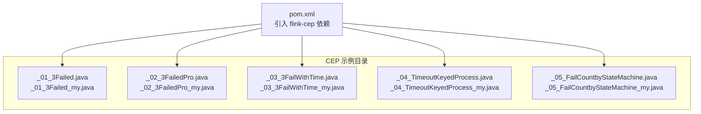
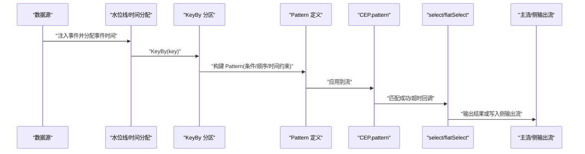
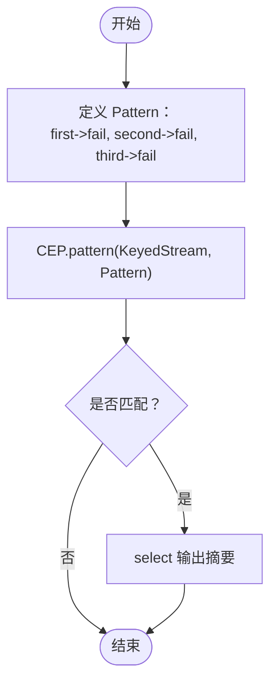
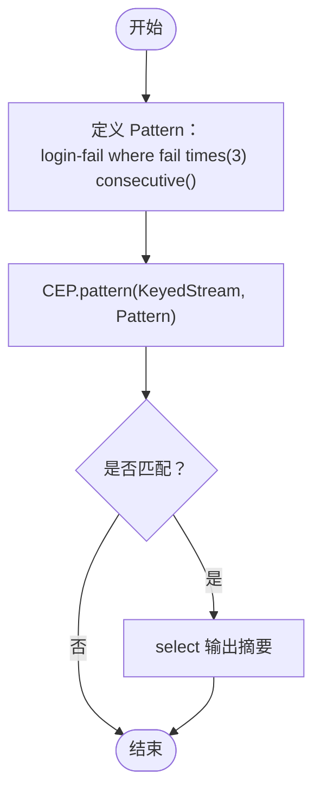
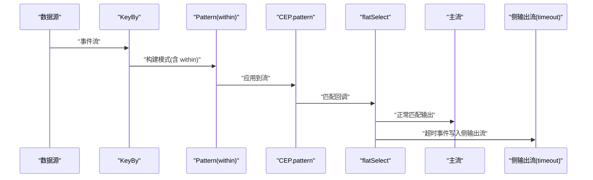
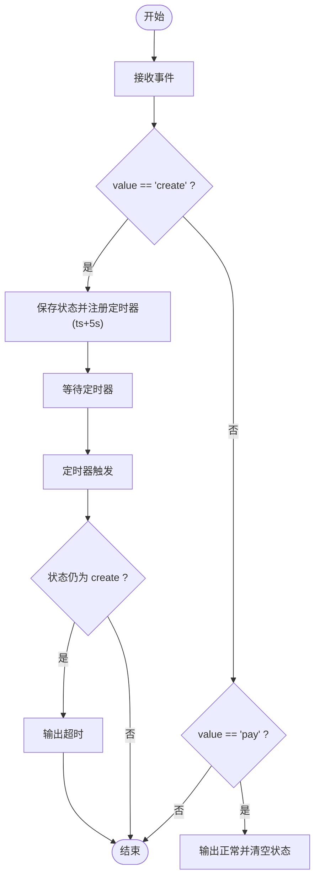
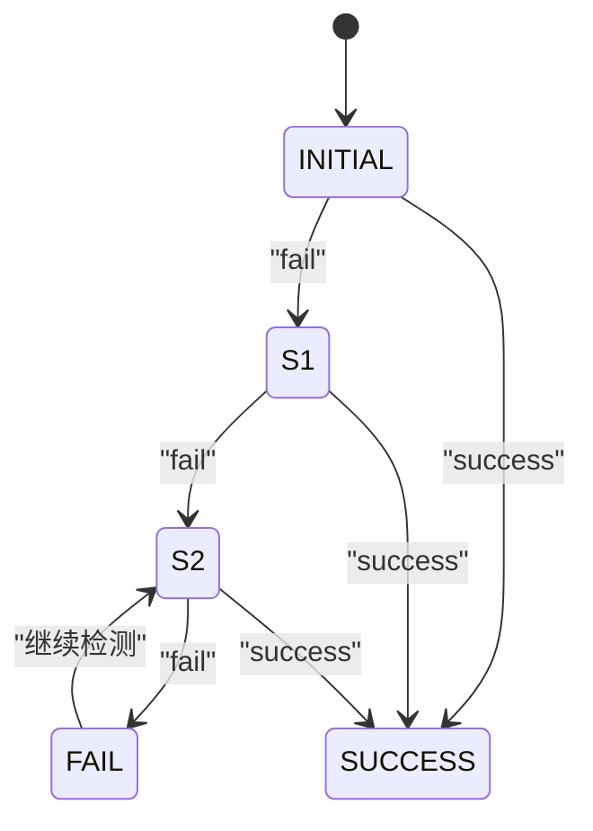
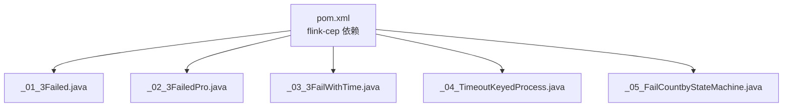

# 复杂事件处理(CEP)

<cite>
**本文引用的文件**
- [_06_flink/pom.xml](file://_06_flink/pom.xml)
- [_06_flink/src/main/java/_18_CEP/_01_3Failed.java](file://_06_flink/src/main/java/_18_CEP/_01_3Failed.java)
- [_06_flink/src/main/java/_18_CEP/_01_3Failed_my.java](file://_06_flink/src/main/java/_18_CEP/_01_3Failed_my.java)
- [_06_flink/src/main/java/_18_CEP/_02_3FailedPro.java](file://_06_flink/src/main/java/_18_CEP/_02_3FailedPro.java)
- [_06_flink/src/main/java/_18_CEP/_02_3FailedPro_my.java](file://_06_flink/src/main/java/_18_CEP/_02_3FailedPro_my.java)
- [_06_flink/src/main/java/_18_CEP/_03_3FailWithTime.java](file://_06_flink/src/main/java/_18_CEP/_03_3FailWithTime.java)
- [_06_flink/src/main/java/_18_CEP/_03_3FailWithTime_my.java](file://_06_flink/src/main/java/_18_CEP/_03_3FailWithTime_my.java)
- [_06_flink/src/main/java/_18_CEP/_04_TimeoutKeyedProcess.java](file://_06_flink/src/main/java/_18_CEP/_04_TimeoutKeyedProcess.java)
- [_06_flink/src/main/java/_18_CEP/_04_TimeoutKeyedProcess_my.java](file://_06_flink/src/main/java/_18_CEP/_04_TimeoutKeyedProcess_my.java)
- [_06_flink/src/main/java/_18_CEP/_05_FailCountbyStateMachine.java](file://_06_flink/src/main/java/_18_CEP/_05_FailCountbyStateMachine.java)
- [_06_flink/src/main/java/_18_CEP/_05_FailCountbyStateMachine_my.java](file://_06_flink/src/main/java/_18_CEP/_05_FailCountbyStateMachine_my.java)
</cite>

## 目录
1. [引言](#引言)
2. [项目结构](#项目结构)
3. [核心组件](#核心组件)
4. [架构总览](#架构总览)
5. [详细组件分析](#详细组件分析)
6. [依赖关系分析](#依赖关系分析)
7. [性能考量](#性能考量)
8. [故障排查指南](#故障排查指南)
9. [结论](#结论)
10. [附录](#附录)

## 引言
本文件围绕 Flink 复杂事件处理（Complex Event Processing, CEP）进行系统化技术文档整理，结合仓库中的示例代码，深入讲解以下主题：
- CEP 核心概念与应用场景：模式匹配、事件序列分析、复杂条件检测
- Pattern API 使用方法：条件定义、时间约束 within、循环模式 times/consecutive、复合模式构建
- 实战案例：连续失败检测、超时处理、状态机模式
- 性能特性与适用场景：内存使用、吞吐量与延迟权衡
- 模式设计最佳实践与性能优化建议

## 项目结构
本仓库的 CEP 示例集中在 _06_flink/src/main/java/_18_CEP 目录下，包含多个循序渐进的示例，覆盖从简单连续失败检测到带超时处理、再到状态机实现的完整路径。

**图表来源**
- [_06_flink/src/main/java/_18_CEP/_01_3Failed.java](file://_06_flink/src/main/java/_18_CEP/_01_3Failed.java#L1-L115)
- [_06_flink/src/main/java/_18_CEP/_02_3FailedPro.java](file://_06_flink/src/main/java/_18_CEP/_02_3FailedPro.java#L1-L102)
- [_06_flink/src/main/java/_18_CEP/_03_3FailWithTime.java](file://_06_flink/src/main/java/_18_CEP/_03_3FailWithTime.java#L1-L129)
- [_06_flink/src/main/java/_18_CEP/_04_TimeoutKeyedProcess.java](file://_06_flink/src/main/java/_18_CEP/_04_TimeoutKeyedProcess.java#L1-L99)
- [_06_flink/src/main/java/_18_CEP/_05_FailCountbyStateMachine.java](file://_06_flink/src/main/java/_18_CEP/_05_FailCountbyStateMachine.java#L1-L121)
- [_06_flink/pom.xml](file://_06_flink/pom.xml#L50-L89)

**章节来源**
- [_06_flink/pom.xml](file://_06_flink/pom.xml#L50-L89)

## 核心组件
- Pattern API：用于定义事件序列模式，支持 where 条件、next/and 组合、times/consecutive 循环约束、within 时间窗口约束
- CEP.pattern：在 KeyedStream 上应用 Pattern，返回 PatternStream
- select/flatSelect：对匹配结果进行转换输出；配合 OutputTag 实现超时侧输出流
- KeyedProcessFunction：用于自定义状态机与定时器，实现超时检测与状态流转

关键实现位置参考：
- Pattern 定义与匹配：见各示例的 Pattern 构建与 CEP.pattern 调用
- 超时处理：见 _03_3FailWithTime* 的 flatSelect 与 OutputTag
- 状态机实现：见 _05_FailCountbyStateMachine*

**章节来源**
- [_06_flink/src/main/java/_18_CEP/_01_3Failed.java](file://_06_flink/src/main/java/_18_CEP/_01_3Failed.java#L40-L89)
- [_06_flink/src/main/java/_18_CEP/_02_3FailedPro.java](file://_06_flink/src/main/java/_18_CEP/_02_3FailedPro.java#L40-L74)
- [_06_flink/src/main/java/_18_CEP/_03_3FailWithTime.java](file://_06_flink/src/main/java/_18_CEP/_03_3FailWithTime.java#L40-L102)
- [_06_flink/src/main/java/_18_CEP/_05_FailCountbyStateMachine.java](file://_06_flink/src/main/java/_18_CEP/_05_FailCountbyStateMachine.java#L43-L96)

## 架构总览
下图展示了 CEP 在流处理中的典型工作流：事件时间分配、KeyBy 分区、模式定义与匹配、结果输出与超时侧输出。

**图表来源**
- [_06_flink/src/main/java/_18_CEP/_01_3Failed.java](file://_06_flink/src/main/java/_18_CEP/_01_3Failed.java#L21-L89)
- [_06_flink/src/main/java/_18_CEP/_03_3FailWithTime.java](file://_06_flink/src/main/java/_18_CEP/_03_3FailWithTime.java#L40-L102)
- [_06_flink/src/main/java/_18_CEP/_05_FailCountbyStateMachine.java](file://_06_flink/src/main/java/_18_CEP/_05_FailCountbyStateMachine.java#L43-L96)

## 详细组件分析

### 组件A：连续三次失败检测（逐个 next 组合）
- 目标：检测同一 key 下连续三次 fail 事件
- 关键点：
  - 使用 begin("first").where(...).next("second").where(...).next("third").where(...)
  - 通过 keyBy 对事件按用户分区，保证跨事件的匹配只在同 key 内发生
  - 使用 select 输出匹配到的事件序列摘要

**图表来源**
- [_06_flink/src/main/java/_18_CEP/_01_3Failed.java](file://_06_flink/src/main/java/_18_CEP/_01_3Failed.java#L40-L89)
- [_06_flink/src/main/java/_18_CEP/_01_3Failed_my.java](file://_06_flink/src/main/java/_18_CEP/_01_3Failed_my.java#L40-L89)

**章节来源**
- [_06_flink/src/main/java/_18_CEP/_01_3Failed.java](file://_06_flink/src/main/java/_18_CEP/_01_3Failed.java#L21-L89)
- [_06_flink/src/main/java/_18_CEP/_01_3Failed_my.java](file://_06_flink/src/main/java/_18_CEP/_01_3Failed_my.java#L21-L89)

### 组件B：连续三次失败检测（times/consecutive 简化）
- 目标：相同功能，但使用 times(3).consecutive() 简化模式定义
- 关键点：更紧凑的声明式模式，减少链式 next 的样板代码

**图表来源**
- [_06_flink/src/main/java/_18_CEP/_02_3FailedPro.java](file://_06_flink/src/main/java/_18_CEP/_02_3FailedPro.java#L40-L74)
- [_06_flink/src/main/java/_18_CEP/_02_3FailedPro_my.java](file://_06_flink/src/main/java/_18_CEP/_02_3FailedPro_my.java#L42-L71)

**章节来源**
- [_06_flink/src/main/java/_18_CEP/_02_3FailedPro.java](file://_06_flink/src/main/java/_18_CEP/_02_3FailedPro.java#L40-L74)
- [_06_flink/src/main/java/_18_CEP/_02_3FailedPro_my.java](file://_06_flink/src/main/java/_18_CEP/_02_3FailedPro_my.java#L42-L71)

### 组件C：超时处理（within + 侧输出流）
- 目标：在固定时间窗口内完成“创建-支付”事件序列，否则判定超时
- 关键点：
  - within(Time.seconds(N)) 限定事件序列时间跨度
  - flatSelect 同时处理超时与正常匹配，使用 OutputTag 将超时写入侧输出流
  - 主流输出正常匹配结果，侧输出流单独消费

**图表来源**
- [_06_flink/src/main/java/_18_CEP/_03_3FailWithTime.java](file://_06_flink/src/main/java/_18_CEP/_03_3FailWithTime.java#L40-L102)
- [_06_flink/src/main/java/_18_CEP/_03_3FailWithTime_my.java](file://_06_flink/src/main/java/_18_CEP/_03_3FailWithTime_my.java#L42-L96)

**章节来源**
- [_06_flink/src/main/java/_18_CEP/_03_3FailWithTime.java](file://_06_flink/src/main/java/_18_CEP/_03_3FailWithTime.java#L21-L102)
- [_06_flink/src/main/java/_18_CEP/_03_3FailWithTime_my.java](file://_06_flink/src/main/java/_18_CEP/_03_3FailWithTime_my.java#L22-L96)

### 组件D：基于 KeyedProcessFunction 的超时检测（对比实现）
- 目标：不使用 CEP，仅用 KeyedProcessFunction + 定时器实现相同超时逻辑
- 关键点：
  - 在 receive "create" 事件时保存状态并注册定时器
  - 收到 "pay" 事件时清除状态并输出正常结果
  - 定时触发时若仍处于 create 状态则判定超时

**图表来源**
- [_06_flink/src/main/java/_18_CEP/_04_TimeoutKeyedProcess.java](file://_06_flink/src/main/java/_18_CEP/_04_TimeoutKeyedProcess.java#L35-L71)
- [_06_flink/src/main/java/_18_CEP/_04_TimeoutKeyedProcess_my.java](file://_06_flink/src/main/java/_18_CEP/_04_TimeoutKeyedProcess_my.java#L36-L72)

**章节来源**
- [_06_flink/src/main/java/_18_CEP/_04_TimeoutKeyedProcess.java](file://_06_flink/src/main/java/_18_CEP/_04_TimeoutKeyedProcess.java#L16-L71)
- [_06_flink/src/main/java/_18_CEP/_04_TimeoutKeyedProcess_my.java](file://_06_flink/src/main/java/_18_CEP/_04_TimeoutKeyedProcess_my.java#L16-L72)

### 组件E：状态机模式（连续失败计数）
- 目标：用有限状态机实现连续三次失败检测
- 关键点：
  - 状态转移表：INITIAL->fail=S1，S1->fail=S2，S2->fail=FAIL
  - 使用 ValueState 存储当前状态，processElement 根据输入驱动状态迁移
  - 达到 FAIL 时输出告警并回退到 S2 以允许重复检测

**图表来源**
- [_06_flink/src/main/java/_18_CEP/_05_FailCountbyStateMachine.java](file://_06_flink/src/main/java/_18_CEP/_05_FailCountbyStateMachine.java#L51-L96)
- [_06_flink/src/main/java/_18_CEP/_05_FailCountbyStateMachine_my.java](file://_06_flink/src/main/java/_18_CEP/_05_FailCountbyStateMachine_my.java#L52-L98)

**章节来源**
- [_06_flink/src/main/java/_18_CEP/_05_FailCountbyStateMachine.java](file://_06_flink/src/main/java/_18_CEP/_05_FailCountbyStateMachine.java#L43-L96)
- [_06_flink/src/main/java/_18_CEP/_05_FailCountbyStateMachine_my.java](file://_06_flink/src/main/java/_18_CEP/_05_FailCountbyStateMachine_my.java#L45-L98)

## 依赖关系分析
- 依赖管理：pom.xml 中引入 flink-cep 依赖，确保 CEP 功能可用
- 运行时要求：示例普遍使用事件时间与水位线策略，确保乱序与迟到数据的正确处理
- 并行度：示例多设置为单并行度以便演示，生产中应根据数据量与延迟需求调整

**图表来源**
- [_06_flink/pom.xml](file://_06_flink/pom.xml#L50-L89)
- [_06_flink/src/main/java/_18_CEP/_01_3Failed.java](file://_06_flink/src/main/java/_18_CEP/_01_3Failed.java#L1-L20)
- [_06_flink/src/main/java/_18_CEP/_02_3FailedPro.java](file://_06_flink/src/main/java/_18_CEP/_02_3FailedPro.java#L1-L20)
- [_06_flink/src/main/java/_18_CEP/_03_3FailWithTime.java](file://_06_flink/src/main/java/_18_CEP/_03_3FailWithTime.java#L1-L20)
- [_06_flink/src/main/java/_18_CEP/_04_TimeoutKeyedProcess.java](file://_06_flink/src/main/java/_18_CEP/_04_TimeoutKeyedProcess.java#L1-L20)
- [_06_flink/src/main/java/_18_CEP/_05_FailCountbyStateMachine.java](file://_06_flink/src/main/java/_18_CEP/_05_FailCountbyStateMachine.java#L1-L20)

**章节来源**
- [_06_flink/pom.xml](file://_06_flink/pom.xml#L50-L89)

## 性能考量
- 事件时间与水位线：CEP 必须使用事件时间，合理设置时间戳与水位线策略，避免因乱序导致的误判与资源浪费
- KeyBy 分区：按业务键分区可显著降低跨键匹配开销，同时避免跨键状态污染
- 模式复杂度：尽量使用 times/consecutive 等简洁表达，减少链式 next 的深度与宽度，降低匹配状态规模
- 超时窗口 within：合理设置时间窗口，过小易漏检，过大增加状态持有时间与内存占用
- 侧输出流：将超时与正常匹配分流，避免主流阻塞，提升整体吞吐
- 状态机替代：对于固定状态转移的场景，KeyedProcessFunction 可能比通用 CEP 更轻量，但需自行处理超时与状态清理

[本节为通用性能指导，无需特定文件引用]

## 故障排查指南
- 未设置事件时间：若未分配事件时间与水位线，CEP 可能无法正确识别迟到或乱序事件，导致匹配异常
  - 参考路径：示例中均包含 assignTimestampsAndWatermarks 的设置
- 并行度问题：示例多为单并行度，若改为多并行度需确保 KeyBy 正确且状态后端配置合理
- 超时未触发：确认 within 时间窗口设置与事件时间戳是否一致；检查侧输出标签是否一致
- 状态机未复位：状态机达到 FAIL 后应回退到合适状态以允许重复检测，避免状态卡死

**章节来源**
- [_06_flink/src/main/java/_18_CEP/_01_3Failed.java](file://_06_flink/src/main/java/_18_CEP/_01_3Failed.java#L21-L40)
- [_06_flink/src/main/java/_18_CEP/_03_3FailWithTime.java](file://_06_flink/src/main/java/_18_CEP/_03_3FailWithTime.java#L40-L61)
- [_06_flink/src/main/java/_18_CEP/_05_FailCountbyStateMachine.java](file://_06_flink/src/main/java/_18_CEP/_05_FailCountbyStateMachine.java#L74-L96)

## 结论
本仓库提供了从基础连续失败检测到超时处理、再到状态机实现的完整 CEP 能力示例。通过 Pattern API 的条件、顺序与时间约束组合，可以高效地表达复杂的业务规则；配合侧输出流与 KeyedProcessFunction，既能满足高吞吐场景，也能灵活处理超时与状态管理。生产落地时，应结合事件时间策略、KeyBy 分区、within 窗口与状态后端配置，持续优化内存占用与延迟表现。

[本节为总结性内容，无需特定文件引用]

## 附录
- 模式设计最佳实践
  - 明确事件边界与业务键，优先使用 KeyBy 分区
  - 用 times/consecutive 简化连续事件表达，避免深层链式 next
  - within 窗口应基于业务 SLA 设定，兼顾准确率与资源消耗
  - 对于固定状态转移场景，评估使用 KeyedProcessFunction 的性价比
- 性能优化建议
  - 合理设置水位线与乱序容忍，避免过度放大状态窗口
  - 控制匹配状态数量，必要时拆分模式或引入早停策略
  - 使用侧输出流隔离超时与正常路径，减少主流阻塞
  - 监控状态后端内存与 RocksDB 行为，按需调优

[本节为通用指导，无需特定文件引用]