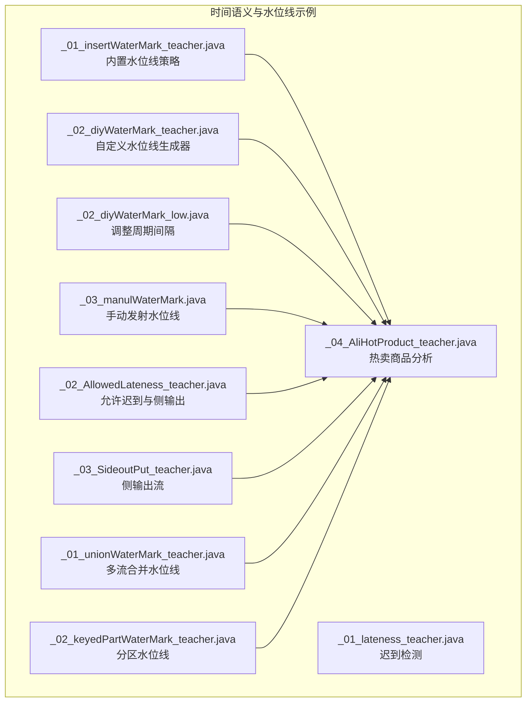
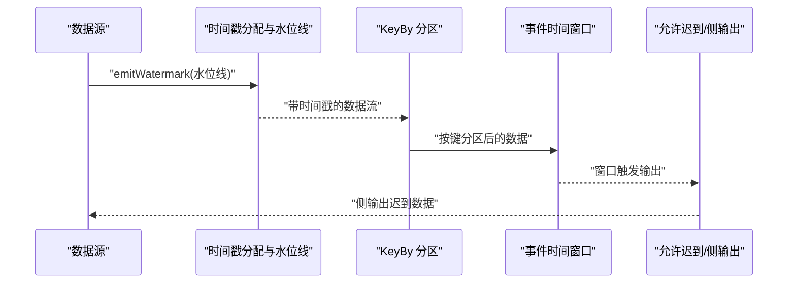
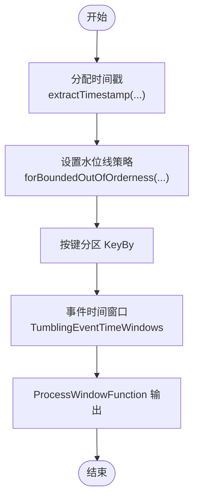
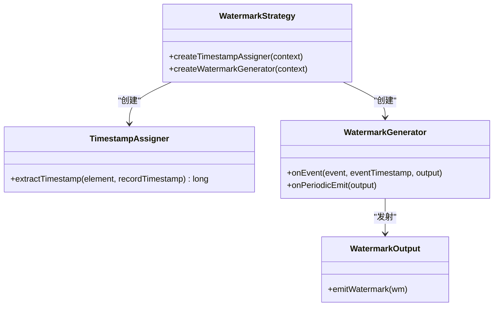
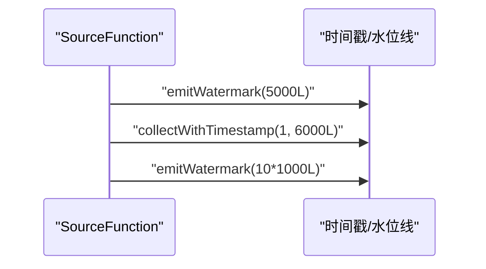
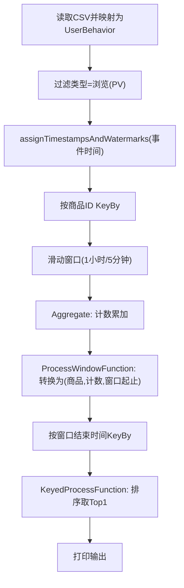
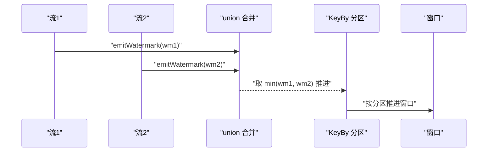
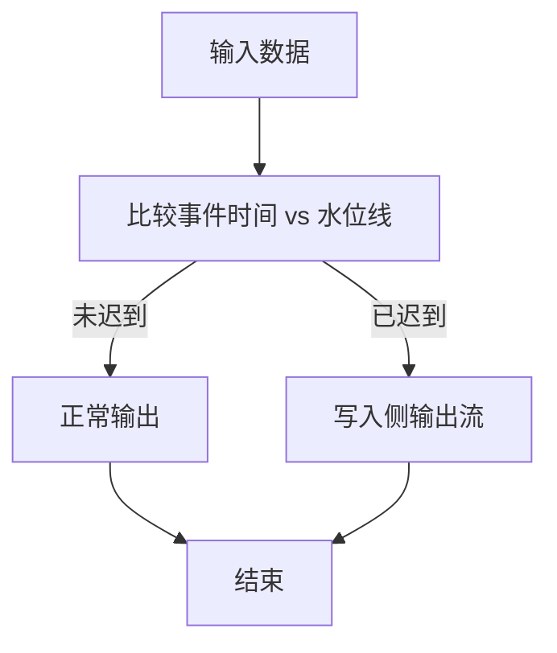
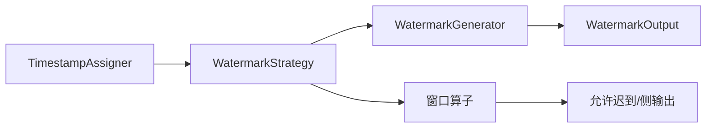

# 时间语义与水位线

<cite>
**本文引用的文件**
- [_01_insertWaterMark_teacher.java](file://_06_flink/src/main/java/_10_waterMark/_01_insertWaterMark_teacher.java)
- [_02_diyWaterMark_teacher.java](file://_06_flink/src/main/java/_10_waterMark/_02_diyWaterMark_teacher.java)
- [_02_diyWaterMark_low.java](file://_06_flink/src/main/java/_10_waterMark/_02_diyWaterMark_low.java)
- [_03_manulWaterMark.java](file://_06_flink/src/main/java/_10_waterMark/_03_manulWaterMark.java)
- [_04_AliHotProduct_teacher.java](file://_06_flink/src/main/java/_10_waterMark/_04_AliHotProduct_teacher.java)
- [_01_unionWaterMark_teacher.java](file://_06_flink/src/main/java/_12_unionWaterMark/_01_unionWaterMark_teacher.java)
- [_02_keyedPartWaterMark_teacher.java](file://_06_flink/src/main/java/_12_unionWaterMark/_02_keyedPartWaterMark_teacher.java)
- [_01_lateness_teacher.java](file://_06_flink/src/main/java/_14_lateness/_01_lateness_teacher.java)
- [_02_AllowedLateness_teacher.java](file://_06_flink/src/main/java/_14_lateness/_02_AllowedLateness_teacher.java)
- [_03_SideoutPut_teacher.java](file://_06_flink/src/main/java/_14_lateness/_03_SideoutPut_teacher.java)
</cite>

## 目录
1. [简介](#简介)
2. [项目结构](#项目结构)
3. [核心组件](#核心组件)
4. [架构总览](#架构总览)
5. [详细组件分析](#详细组件分析)
6. [依赖关系分析](#依赖关系分析)
7. [性能考量](#性能考量)
8. [故障排查指南](#故障排查指南)
9. [结论](#结论)
10. [附录](#附录)

## 简介
本技术文档围绕 Apache Flink 的时间语义与水位线展开，系统阐述事件时间、处理时间、摄入时间的概念与差异，并结合仓库中的示例代码，深入讲解水位线的工作原理、生成策略、单流水位线与多流水位线的合并策略，以及自定义水位线生成器的开发方法与性能优化技巧。同时，通过“阿里热卖商品分析”等真实场景，演示如何正确使用水位线处理乱序数据；最后给出延迟数据与迟到数据处理的最佳实践。

## 项目结构
本仓库中与时间语义和水位线直接相关的示例主要集中在以下包与文件：
- 水位线基础与内置策略：_01_insertWaterMark_teacher.java、_02_diyWaterMark_teacher.java、_02_diyWaterMark_low.java、_03_manulWaterMark.java
- 实战案例：_04_AliHotProduct_teacher.java（基于用户行为数据统计热卖商品）
- 多流合并与分区水位线：_01_unionWaterMark_teacher.java、_02_keyedPartWaterMark_teacher.java
- 迟到数据与侧输出：_01_lateness_teacher.java、_02_AllowedLateness_teacher.java、_03_SideoutPut_teacher.java

图表来源
- [_01_insertWaterMark_teacher.java](file://_06_flink/src/main/java/_10_waterMark/_01_insertWaterMark_teacher.java#L1-L78)
- [_02_diyWaterMark_teacher.java](file://_06_flink/src/main/java/_10_waterMark/_02_diyWaterMark_teacher.java#L1-L94)
- [_02_diyWaterMark_low.java](file://_06_flink/src/main/java/_10_waterMark/_02_diyWaterMark_low.java#L1-L66)
- [_03_manulWaterMark.java](file://_06_flink/src/main/java/_10_waterMark/_03_manulWaterMark.java#L1-L49)
- [_01_lateness_teacher.java](file://_06_flink/src/main/java/_14_lateness/_01_lateness_teacher.java#L1-L58)
- [_02_AllowedLateness_teacher.java](file://_06_flink/src/main/java/_14_lateness/_02_AllowedLateness_teacher.java#L1-L77)
- [_03_SideoutPut_teacher.java](file://_06_flink/src/main/java/_14_lateness/_03_SideoutPut_teacher.java#L1-L59)
- [_01_unionWaterMark_teacher.java](file://_06_flink/src/main/java/_12_unionWaterMark/_01_unionWaterMark_teacher.java#L1-L79)
- [_02_keyedPartWaterMark_teacher.java](file://_06_flink/src/main/java/_12_unionWaterMark/_02_keyedPartWaterMark_teacher.java#L1-L71)
- [_04_AliHotProduct_teacher.java](file://_06_flink/src/main/java/_10_waterMark/_04_AliHotProduct_teacher.java#L1-L137)

章节来源
- [本节未直接分析具体文件，仅用于概览]

## 核心组件
- 事件时间（Event Time）：记录事件实际发生的时间戳，通常来自数据源或消息队列的生产时间。Flink 使用 Watermark 推进处理进度，确保窗口按事件时间闭合。
- 处理时间（Processing Time）：数据到达 Flink 算子的本地系统时间。简单但易受机器时钟影响，不适合严格的时间语义需求。
- 摄入时间（Ingestion Time）：数据进入 Flink 数据流的时间。介于事件时间和处理时间之间，常用于近似事件时间的快速实现。
- 水位线（Watermark）：一种推进机制，表示“不再期待更早时间”的边界。Flink 基于 Watermark 触发窗口计算与输出。
- 允许迟到（Allowed Lateness）：窗口在水位线触发后继续接收迟到数据，并可配置侧输出流导出超期数据。
- 单流水位线与多流水位线合并：多路输入时，Flink 会取各并行子流的最小水位线作为全局水位线，保证跨流一致性。

章节来源
- [_01_insertWaterMark_teacher.java](file://_06_flink/src/main/java/_10_waterMark/_01_insertWaterMark_teacher.java#L1-L78)
- [_02_diyWaterMark_teacher.java](file://_06_flink/src/main/java/_10_waterMark/_02_diyWaterMark_teacher.java#L1-L94)
- [_01_unionWaterMark_teacher.java](file://_06_flink/src/main/java/_12_unionWaterMark/_01_unionWaterMark_teacher.java#L1-L79)
- [_02_AllowedLateness_teacher.java](file://_06_flink/src/main/java/_14_lateness/_02_AllowedLateness_teacher.java#L1-L77)

## 架构总览
下图展示了从数据源到窗口计算与水位线推进的整体流程，包括内置与自定义水位线策略、多流合并与分区水位线、允许迟到与侧输出路径。

图表来源
- [_01_insertWaterMark_teacher.java](file://_06_flink/src/main/java/_10_waterMark/_01_insertWaterMark_teacher.java#L1-L78)
- [_02_diyWaterMark_teacher.java](file://_06_flink/src/main/java/_10_waterMark/_02_diyWaterMark_teacher.java#L1-L94)
- [_01_unionWaterMark_teacher.java](file://_06_flink/src/main/java/_12_unionWaterMark/_01_unionWaterMark_teacher.java#L1-L79)
- [_02_AllowedLateness_teacher.java](file://_06_flink/src/main/java/_14_lateness/_02_AllowedLateness_teacher.java#L1-L77)

## 详细组件分析

### 组件A：内置水位线策略与事件时间窗口
- 功能要点
  - 使用内置的有界无序（bounded out-of-orderness）策略，设置最大延迟时间。
  - 通过 TimestampAssigner 提取事件时间戳字段。
  - 结合滚动窗口按事件时间闭合，验证水位线推进与窗口触发。
- 关键路径
  - 时间戳提取与水位线策略配置：见 [assignTimestampsAndWatermarks(...)](file://_06_flink/src/main/java/_10_waterMark/_01_insertWaterMark_teacher.java#L49-L58)
  - 窗口与处理函数：见 [window(...) 与 process(...)](file://_06_flink/src/main/java/_10_waterMark/_01_insertWaterMark_teacher.java#L61-L73)

图表来源
- [_01_insertWaterMark_teacher.java](file://_06_flink/src/main/java/_10_waterMark/_01_insertWaterMark_teacher.java#L49-L73)

章节来源
- [_01_insertWaterMark_teacher.java](file://_06_flink/src/main/java/_10_waterMark/_01_insertWaterMark_teacher.java#L1-L78)

### 组件B：自定义水位线生成器（Bounded Out-Of-Order）
- 功能要点
  - 实现 WatermarkStrategy.createWatermarkGenerator，维护观察到的最大时间戳。
  - onEvent 每条数据触发，onPeriodicEmit 定期发射水位线（默认周期约 200ms）。
  - 可通过配置降低周期间隔，满足低延迟场景。
- 关键路径
  - 自定义 WatermarkStrategy：见 [createWatermarkGenerator(...)](file://_06_flink/src/main/java/_10_waterMark/_02_diyWaterMark_teacher.java#L48-L75)
  - 降低周期间隔：见 [setAutoWatermarkInterval(...)](file://_06_flink/src/main/java/_10_waterMark/_02_diyWaterMark_low.java#L21-L22)

图表来源
- [_02_diyWaterMark_teacher.java](file://_06_flink/src/main/java/_10_waterMark/_02_diyWaterMark_teacher.java#L35-L75)
- [_02_diyWaterMark_low.java](file://_06_flink/src/main/java/_10_waterMark/_02_diyWaterMark_low.java#L21-L22)

章节来源
- [_02_diyWaterMark_teacher.java](file://_06_flink/src/main/java/_10_waterMark/_02_diyWaterMark_teacher.java#L1-L94)
- [_02_diyWaterMark_low.java](file://_06_flink/src/main/java/_10_waterMark/_02_diyWaterMark_low.java#L1-L66)

### 组件C：手动发射水位线（SourceFunction）
- 功能要点
  - 在 SourceFunction 中 emitWatermark 手动控制水位线，验证 Flink 在 run 开始前与结束后自动发出特殊水位线的行为。
- 关键路径
  - 手动发射水位线与时间戳：见 [emitWatermark(...) 与 collectWithTimestamp(...)](file://_06_flink/src/main/java/_10_waterMark/_03_manulWaterMark.java#L21-L25)

图表来源
- [_03_manulWaterMark.java](file://_06_flink/src/main/java/_10_waterMark/_03_manulWaterMark.java#L17-L32)

章节来源
- [_03_manulWaterMark.java](file://_06_flink/src/main/java/_10_waterMark/_03_manulWaterMark.java#L1-L49)

### 组件D：阿里热卖商品分析（实战案例）
- 场景说明
  - 基于用户行为数据统计每小时、5 分钟滑动窗口内各商品的浏览次数，并在窗口结束时输出该窗口内的销量排行。
  - 使用事件时间与水位线策略处理数据乱序，保证结果稳定。
- 关键路径
  - 读取 CSV 并映射为用户行为对象：见 [readTextFile(...) 与 map(...)](file://_06_flink/src/main/java/_10_waterMark/_04_AliHotProduct_teacher.java#L33-L44)
  - 事件时间与水位线策略：见 [assignTimestampsAndWatermarks(...)](file://_06_flink/src/main/java/_10_waterMark/_04_AliHotProduct_teacher.java#L46-L54)
  - 滑动窗口聚合与窗口结果转换：见 [SlidingEventTimeWindows 与 AggregateFunction/ProcessWindowFunction](file://_06_flink/src/main/java/_10_waterMark/_04_AliHotProduct_teacher.java#L56-L60)
  - 窗口内 TopN 计算与输出：见 [KeyedProcessFunction 与排序输出](file://_06_flink/src/main/java/_10_waterMark/_04_AliHotProduct_teacher.java#L60-L97)

图表来源
- [_04_AliHotProduct_teacher.java](file://_06_flink/src/main/java/_10_waterMark/_04_AliHotProduct_teacher.java#L33-L97)

章节来源
- [_04_AliHotProduct_teacher.java](file://_06_flink/src/main/java/_10_waterMark/_04_AliHotProduct_teacher.java#L1-L137)

### 组件E：多流合并与水位线合并策略
- 单流水位线
  - 每条流各自维护水位线，窗口按该流自身推进。
- 多流合并（union）
  - Flink 对 union 后的流取各并行子流的最小水位线作为全局水位线，避免过早触发窗口。
- 分区水位线（KeyBy 后并行度 > 1）
  - 每个分区独立维护水位线，窗口按分区维度推进，适合高吞吐场景。

图表来源
- [_01_unionWaterMark_teacher.java](file://_06_flink/src/main/java/_12_unionWaterMark/_01_unionWaterMark_teacher.java#L65-L74)
- [_02_keyedPartWaterMark_teacher.java](file://_06_flink/src/main/java/_12_unionWaterMark/_02_keyedPartWaterMark_teacher.java#L53-L63)

章节来源
- [_01_unionWaterMark_teacher.java](file://_06_flink/src/main/java/_12_unionWaterMark/_01_unionWaterMark_teacher.java#L1-L79)
- [_02_keyedPartWaterMark_teacher.java](file://_06_flink/src/main/java/_12_unionWaterMark/_02_keyedPartWaterMark_teacher.java#L1-L71)

### 组件F：迟到数据与侧输出
- 迟到检测
  - 在 ProcessFunction 中比较数据事件时间与当前水位线，判断是否迟到。
- 允许迟到与侧输出
  - 使用 allowedLateness 配置窗口等待迟到数据；通过 sideOutputLateData 将超期数据发送至侧输出流。
- 关键路径
  - 迟到检测与侧输出：见 [processElement 中的迟到判断与输出](file://_06_flink/src/main/java/_14_lateness/_01_lateness_teacher.java#L33-L48)
  - 允许迟到与侧输出流：见 [allowedLateness 与 sideOutputLateData](file://_06_flink/src/main/java/_14_lateness/_02_AllowedLateness_teacher.java#L51-L58)
  - 侧输出流读取与打印：见 [getSideOutput(...) 打印](file://_06_flink/src/main/java/_14_lateness/_02_AllowedLateness_teacher.java#L70-L73)

图表来源
- [_01_lateness_teacher.java](file://_06_flink/src/main/java/_14_lateness/_01_lateness_teacher.java#L33-L48)
- [_02_AllowedLateness_teacher.java](file://_06_flink/src/main/java/_14_lateness/_02_AllowedLateness_teacher.java#L51-L73)

章节来源
- [_01_lateness_teacher.java](file://_06_flink/src/main/java/_14_lateness/_01_lateness_teacher.java#L1-L58)
- [_02_AllowedLateness_teacher.java](file://_06_flink/src/main/java/_14_lateness/_02_AllowedLateness_teacher.java#L1-L77)
- [_03_SideoutPut_teacher.java](file://_06_flink/src/main/java/_14_lateness/_03_SideoutPut_teacher.java#L1-L59)

## 依赖关系分析
- 组件耦合
  - WatermarkStrategy 与 TimestampAssigner 解耦，分别负责时间戳提取与水位线生成。
  - 允许迟到与侧输出与窗口算子强关联，需谨慎配置 allowedLateness 与侧输出标签。
- 外部依赖
  - Flink Streaming API 的 WatermarkStrategy、ProcessWindowFunction、KeyedProcessFunction 等。
- 循环依赖
  - 示例代码均为单向数据流，不存在循环依赖。

图表来源
- [_02_diyWaterMark_teacher.java](file://_06_flink/src/main/java/_10_waterMark/_02_diyWaterMark_teacher.java#L35-L75)
- [_02_AllowedLateness_teacher.java](file://_06_flink/src/main/java/_14_lateness/_02_AllowedLateness_teacher.java#L51-L58)

章节来源
- [_02_diyWaterMark_teacher.java](file://_06_flink/src/main/java/_10_waterMark/_02_diyWaterMark_teacher.java#L1-L94)
- [_02_AllowedLateness_teacher.java](file://_06_flink/src/main/java/_14_lateness/_02_AllowedLateness_teacher.java#L1-L77)

## 性能考量
- 水位线周期
  - 默认周期约为 200ms，可通过 setAutoWatermarkInterval 调整周期，降低周期可提升实时性但增加开销。
  - 参考：[_02_diyWaterMark_low.java](file://_06_flink/src/main/java/_10_waterMark/_02_diyWaterMark_low.java#L21-L22)
- 并行度与分区
  - KeyBy 分区可提升吞吐，但需关注分区水位线独立推进带来的延迟窗口触发。
  - 参考：[_02_keyedPartWaterMark_teacher.java](file://_06_flink/src/main/java/_12_unionWaterMark/_02_keyedPartWaterMark_teacher.java#L53-L63)
- 允许迟到与状态
  - allowedLateness 会延长窗口存活时间，需评估状态存储与内存占用。
  - 参考：[_02_AllowedLateness_teacher.java](file://_06_flink/src/main/java/_14_lateness/_02_AllowedLateness_teacher.java#L51-L58)
- 自定义水位线生成器
  - onPeriodicEmit 频率与业务延迟容忍度平衡；避免过于频繁发射导致 CPU 压力。
  - 参考：[_02_diyWaterMark_teacher.java](file://_06_flink/src/main/java/_10_waterMark/_02_diyWaterMark_teacher.java#L67-L73)

章节来源
- [_02_diyWaterMark_low.java](file://_06_flink/src/main/java/_10_waterMark/_02_diyWaterMark_low.java#L1-L66)
- [_02_keyedPartWaterMark_teacher.java](file://_06_flink/src/main/java/_12_unionWaterMark/_02_keyedPartWaterMark_teacher.java#L1-L71)
- [_02_AllowedLateness_teacher.java](file://_06_flink/src/main/java/_14_lateness/_02_AllowedLateness_teacher.java#L1-L77)
- [_02_diyWaterMark_teacher.java](file://_06_flink/src/main/java/_10_waterMark/_02_diyWaterMark_teacher.java#L1-L94)

## 故障排查指南
- 水位线不前进
  - 检查是否正确提取事件时间戳与设置 WatermarkStrategy。
  - 参考：[_01_insertWaterMark_teacher.java](file://_06_flink/src/main/java/_10_waterMark/_01_insertWaterMark_teacher.java#L49-L58)
- 迟到数据过多
  - 适当提高 allowedLateness 或优化上游数据产生与传输延迟。
  - 参考：[_02_AllowedLateness_teacher.java](file://_06_flink/src/main/java/_14_lateness/_02_AllowedLateness_teacher.java#L51-L58)
- 侧输出流为空
  - 确认迟到判断逻辑与 sideOutputLateData 标签一致。
  - 参考：[_03_SideoutPut_teacher.java](file://_06_flink/src/main/java/_14_lateness/_03_SideoutPut_teacher.java#L40-L46)
- 多流合并水位线异常
  - 确保各流均正确分配时间戳与水位线，检查 union 后的最小水位线推进。
  - 参考：[_01_unionWaterMark_teacher.java](file://_06_flink/src/main/java/_12_unionWaterMark/_01_unionWaterMark_teacher.java#L65-L74)

章节来源
- [_01_insertWaterMark_teacher.java](file://_06_flink/src/main/java/_10_waterMark/_01_insertWaterMark_teacher.java#L1-L78)
- [_02_AllowedLateness_teacher.java](file://_06_flink/src/main/java/_14_lateness/_02_AllowedLateness_teacher.java#L1-L77)
- [_03_SideoutPut_teacher.java](file://_06_flink/src/main/java/_14_lateness/_03_SideoutPut_teacher.java#L1-L59)
- [_01_unionWaterMark_teacher.java](file://_06_flink/src/main/java/_12_unionWaterMark/_01_unionWaterMark_teacher.java#L1-L79)

## 结论
- 事件时间 + 水位线是构建稳定流处理应用的关键。内置策略适用于大多数场景，自定义生成器可满足复杂乱序与低延迟需求。
- 多流合并与分区水位线需要理解最小水位线推进原则，避免过早或过晚触发窗口。
- 允许迟到与侧输出提供了处理乱序与超期数据的有效手段，应结合业务容忍度合理配置。
- “阿里热卖商品分析”案例展示了从数据接入、事件时间处理、窗口聚合到 TopN 输出的完整链路，可作为实际项目的参考模板。

## 附录
- 最佳实践清单
  - 明确事件时间来源与时间戳字段，确保数据质量。
  - 优先使用内置有界无序策略，必要时再自定义水位线生成器。
  - 合理设置 allowedLateness 与侧输出，平衡准确性与时效性。
  - 多流合并时统一时间语义，避免跨流时间错配。
  - 监控水位线推进速率与窗口触发频率，及时调参。