# 状态管理

<cite>
**本文引用的文件**
- [Temperature_my.java](file://_06_flink/src/main/java/_08_richFunction/_10_Temperature_my.java)
- [Temperature_my_2.java](file://_06_flink/src/main/java/_08_richFunction/_10_Temperature_my_2.java)
- [Temperature_my_3.java](file://_06_flink/src/main/java/_08_richFunction/_10_Temperature_my_3.java)
- [Temperature_teacher.java](file://_06_flink/src/main/java/_08_richFunction/_10_Temperature_teacher.java)
- [Spark_Integer_my.java](file://_06_flink/src/main/java/_08_richFunction/_08_Spark_Integer_my.java)
- [Spark_Integer_teacher.java](file://_06_flink/src/main/java/_08_richFunction/_08_Spark_Integer_teacher.java)
- [Dic_my.java](file://_06_flink/src/main/java/_08_richFunction/_09_Dic_my.java)
- [KeyedProcessFunction.java](file://_06_flink/src/main/java/_08_richFunction/_04_KeyedProcessFunction.java)
- [Alert.java](file://_06_flink/src/main/java/_08_richFunction/_04_Alert.java)
- [Spark_Boolean.java](file://_06_flink/src/main/java/_08_richFunction/_07_Spark_Boolean.java)
- [CheckPoint.java](file://_06_flink/src/main/java/_17_UV/_03_CheckPoint.java)
- [SaveCheckPoint.java](file://_06_flink/src/main/java/_17_UV/_05_SaveCheckPoint.java)
- [KafkaFlinkKafkaExactlyOnce.java](file://_06_flink/src/main/java/_17_UV/_06_KafkaFlinkKafkaExactlyOnce.java)
- [BufferingSinkExample.java](file://_06_flink_wu/src/main/java/com/atguigu/chatper09/BufferingSinkExample.java)
- [SensorReading.java](file://_06_flink/src/main/java/com/atguigu/utils/SensorReading.java)
- [SensorSource.java](file://_06_flink/src/main/java/com/atguigu/utils/SensorSource.java)
- [flink-state-backends-1.13.0.pom](file://org/apache/flink/flink-state-backends/1.13.0/flink-state-backends-1.13.0.pom)
- [flink-statebackend-rocksdb_2.12-1.13.0.pom](file://org/apache/flink/flink-statebackend-rocksdb_2.12/1.13.0/flink-statebackend-rocksdb_2.12-1.13.0.pom)
- [flink-statebackend-rocksdb_2.11-1.13.1.pom](file://org/apache/flink/flink-statebackend-rocksdb_2.11/1.13.1/flink-statebackend-rocksdb_2.11-1.13.1.pom)
</cite>

## 目录
1. [简介](#简介)
2. [项目结构](#项目结构)
3. [核心组件](#核心组件)
4. [架构总览](#架构总览)
5. [详细组件分析](#详细组件分析)
6. [依赖关系分析](#依赖关系分析)
7. [性能考虑](#性能考虑)
8. [故障排查指南](#故障排查指南)
9. [结论](#结论)
10. [附录](#附录)

## 简介
本技术文档围绕Flink状态管理展开，系统阐述Keyed State与Operator State的区别与使用场景，详解RichFunction、KeyedProcessFunction等状态函数的使用方法，并结合温度监控、字典查询、告警系统等实际案例，展示状态在流处理中的落地实践。同时，文档覆盖状态后端（State Backend）的选择与配置、状态持久化、检查点机制与状态恢复的实现细节，并提供性能优化与内存管理的最佳实践。

## 项目结构
本仓库中与Flink状态管理密切相关的代码主要集中在以下模块：
- _06_flink/src/main/java/_08_richFunction：包含KeyedProcessFunction、RichFunction、定时器与状态使用的大量示例
- _06_flink/src/main/java/_17_UV：包含检查点、Operator State与Exactly-once语义的示例
- _06_flink_wu/src/main/java/com/atguigu/chatper09：包含状态后端配置与外部化检查点的示例
- com/atguigu/utils：包含传感器数据模型与数据源，用于温度监控等场景

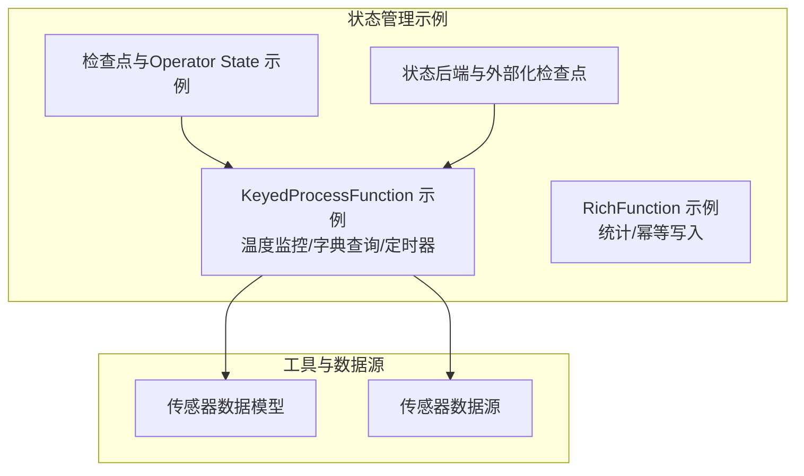

**图表来源**
- [Temperature_my.java](file://_06_flink/src/main/java/_08_richFunction/_10_Temperature_my.java#L1-L37)
- [Spark_Integer_my.java](file://_06_flink/src/main/java/_08_richFunction/_08_Spark_Integer_my.java#L1-L33)
- [CheckPoint.java](file://_06_flink/src/main/java/_17_UV/_03_CheckPoint.java#L1-L27)
- [BufferingSinkExample.java](file://_06_flink_wu/src/main/java/com/atguigu/chatper09/BufferingSinkExample.java#L29-L56)
- [SensorReading.java](file://_06_flink/src/main/java/com/atguigu/utils/SensorReading.java#L1-L23)
- [SensorSource.java](file://_06_flink/src/main/java/com/atguigu/utils/SensorSource.java#L1-L31)

**章节来源**
- [Temperature_my.java](file://_06_flink/src/main/java/_08_richFunction/_10_Temperature_my.java#L1-L37)
- [Spark_Integer_my.java](file://_06_flink/src/main/java/_08_richFunction/_08_Spark_Integer_my.java#L1-L33)
- [CheckPoint.java](file://_06_flink/src/main/java/_17_UV/_03_CheckPoint.java#L1-L27)
- [BufferingSinkExample.java](file://_06_flink_wu/src/main/java/com/atguigu/chatper09/BufferingSinkExample.java#L29-L56)
- [SensorReading.java](file://_06_flink/src/main/java/com/atguigu/utils/SensorReading.java#L1-L23)
- [SensorSource.java](file://_06_flink/src/main/java/com/atguigu/utils/SensorSource.java#L1-L31)

## 核心组件
- Keyed State（键控状态）：按key划分的状态，KeyedProcessFunction在每个key上维护独立的状态，适合需要基于key进行聚合或上下文记忆的场景
- Operator State（算子状态）：在算子实例级别维护的状态，适用于广播、列表状态等，典型用法为Source的偏移量记录
- RichFunction：在FlatMap/Map等基础上扩展了生命周期回调（open/close），并提供运行时上下文，便于声明和使用状态
- KeyedProcessFunction：功能最强的状态函数，支持Keyed State、定时器（processing time/event time）、侧输出等能力
- 检查点（Checkpoint）：周期性持久化状态，保障容错与一致性；配合状态后端实现本地与远端存储

**章节来源**
- [Spark_Boolean.java](file://_06_flink/src/main/java/_08_richFunction/_07_Spark_Boolean.java#L1-L147)
- [KeyedProcessFunction.java](file://_06_flink/src/main/java/_08_richFunction/_04_KeyedProcessFunction.java#L1-L63)
- [SaveCheckPoint.java](file://_06_flink/src/main/java/_17_UV/_05_SaveCheckPoint.java#L1-L98)
- [KafkaFlinkKafkaExactlyOnce.java](file://_06_flink/src/main/java/_17_UV/_06_KafkaFlinkKafkaExactlyOnce.java#L32-L105)

## 架构总览
下图展示了状态管理在Flink作业中的整体交互：数据源产生事件，经过KeyBy进入KeyedProcessFunction，利用Keyed State与定时器完成状态维护与触发逻辑；同时，检查点机制定期持久化状态，确保故障恢复时能从最近一次检查点恢复。

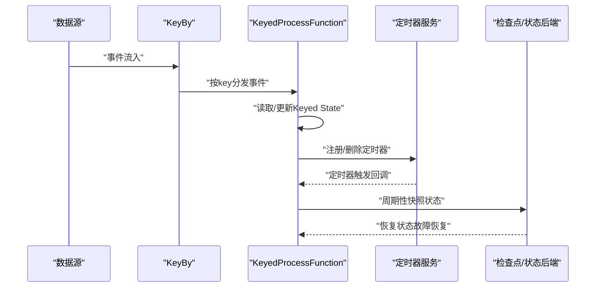

**图表来源**
- [Temperature_my.java](file://_06_flink/src/main/java/_08_richFunction/_10_Temperature_my.java#L1-L37)
- [Temperature_teacher.java](file://_06_flink/src/main/java/_08_richFunction/_10_Temperature_teacher.java#L1-L94)
- [CheckPoint.java](file://_06_flink/src/main/java/_17_UV/_03_CheckPoint.java#L1-L27)

## 详细组件分析

### Keyed State与Operator State的区别与使用场景
- Keyed State：按key隔离，适合“每key一份”的状态，如温度阈值、窗口聚合中间结果、字典映射等
- Operator State：在算子实例级别，适合“全局”或“分片”的状态，如Source的偏移量列表状态

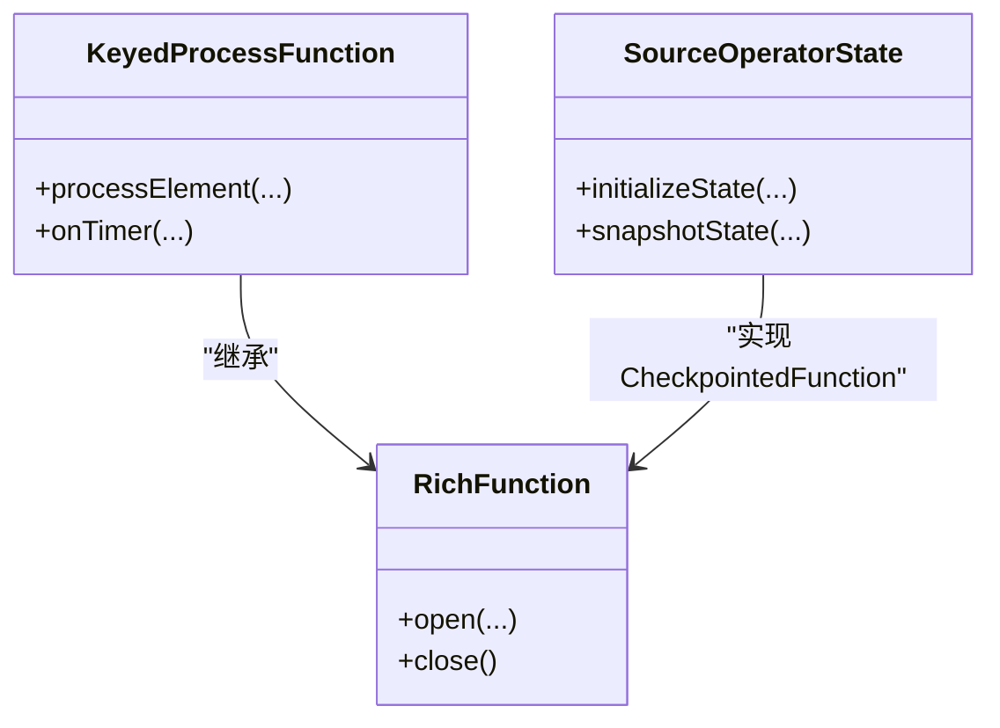

**图表来源**
- [Spark_Boolean.java](file://_06_flink/src/main/java/_08_richFunction/_07_Spark_Boolean.java#L1-L147)
- [SaveCheckPoint.java](file://_06_flink/src/main/java/_17_UV/_05_SaveCheckPoint.java#L1-L98)

**章节来源**
- [Spark_Boolean.java](file://_06_flink/src/main/java/_08_richFunction/_07_Spark_Boolean.java#L1-L147)
- [SaveCheckPoint.java](file://_06_flink/src/main/java/_17_UV/_05_SaveCheckPoint.java#L1-L98)

### RichFunction与KeyedProcessFunction的使用
- RichFunction：通过open初始化状态描述符，使用运行时上下文获取状态句柄
- KeyedProcessFunction：在processElement中读取/更新Keyed State，必要时注册定时器；在onTimer中处理定时触发逻辑

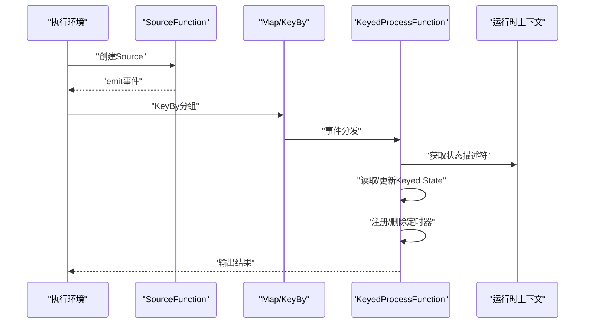

**图表来源**
- [Spark_Integer_my.java](file://_06_flink/src/main/java/_08_richFunction/_08_Spark_Integer_my.java#L1-L33)
- [Spark_Integer_teacher.java](file://_06_flink/src/main/java/_08_richFunction/_08_Spark_Integer_teacher.java#L1-L36)
- [KeyedProcessFunction.java](file://_06_flink/src/main/java/_08_richFunction/_04_KeyedProcessFunction.java#L1-L63)

**章节来源**
- [Spark_Integer_my.java](file://_06_flink/src/main/java/_08_richFunction/_08_Spark_Integer_my.java#L1-L33)
- [Spark_Integer_teacher.java](file://_06_flink/src/main/java/_08_richFunction/_08_Spark_Integer_teacher.java#L1-L36)
- [KeyedProcessFunction.java](file://_06_flink/src/main/java/_08_richFunction/_04_KeyedProcessFunction.java#L1-L63)

### 温度监控与告警系统（Keyed State + 定时器）
- 场景目标：检测同一传感器键控下连续1秒温度上升，若满足条件则注册1秒后触发的报警定时器；若在定时器触发前出现温度下降，则取消定时器
- 关键状态：
  - 上一次温度值（ValueState<Double>）
  - 报警定时器时间戳（ValueState<Long>）

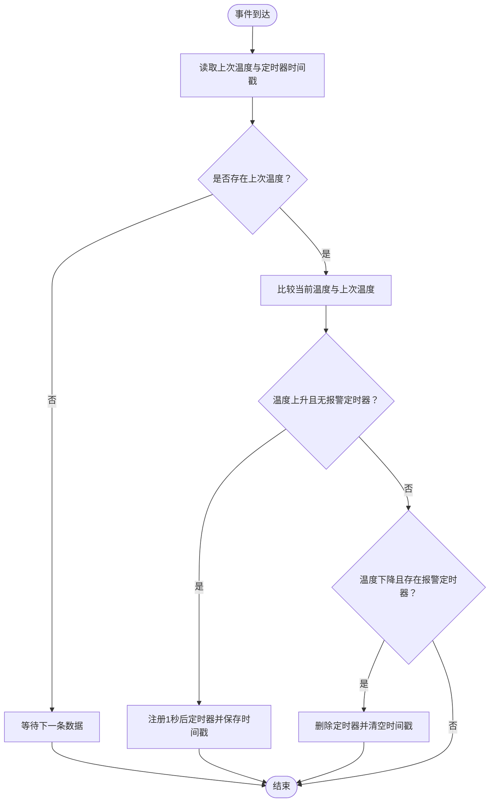

**图表来源**
- [Temperature_teacher.java](file://_06_flink/src/main/java/_08_richFunction/_10_Temperature_teacher.java#L1-L94)
- [Temperature_my_2.java](file://_06_flink/src/main/java/_08_richFunction/_10_Temperature_my_2.java#L70-L99)
- [Temperature_my_3.java](file://_06_flink/src/main/java/_08_richFunction/_10_Temperature_my_3.java#L68-L102)
- [SensorReading.java](file://_06_flink/src/main/java/com/atguigu/utils/SensorReading.java#L1-L23)
- [SensorSource.java](file://_06_flink/src/main/java/com/atguigu/utils/SensorSource.java#L1-L31)

**章节来源**
- [Temperature_teacher.java](file://_06_flink/src/main/java/_08_richFunction/_10_Temperature_teacher.java#L1-L94)
- [Temperature_my_2.java](file://_06_flink/src/main/java/_08_richFunction/_10_Temperature_my_2.java#L70-L99)
- [Temperature_my_3.java](file://_06_flink/src/main/java/_08_richFunction/_10_Temperature_my_3.java#L68-L102)
- [SensorReading.java](file://_06_flink/src/main/java/com/atguigu/utils/SensorReading.java#L1-L23)
- [SensorSource.java](file://_06_flink/src/main/java/com/atguigu/utils/SensorSource.java#L1-L31)

### 字典查询（Keyed State MapState）
- 场景目标：对每个用户访问的URL进行计数，使用MapState维护每个用户的URL计数
- 关键状态：MapState<String, Integer>，键为URL，值为计数

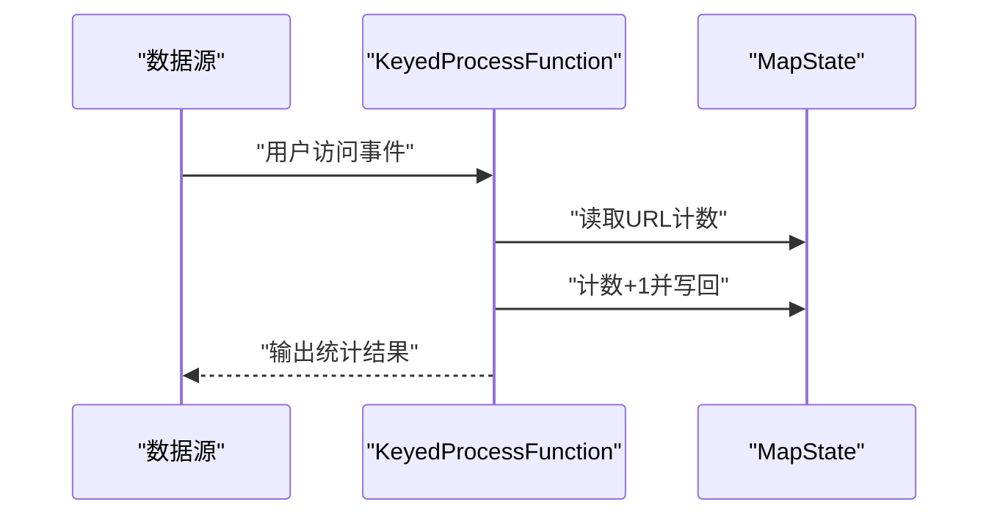

**图表来源**
- [Dic_my.java](file://_06_flink/src/main/java/_08_richFunction/_09_Dic_my.java#L1-L50)

**章节来源**
- [Dic_my.java](file://_06_flink/src/main/java/_08_richFunction/_09_Dic_my.java#L1-L50)

### 统计聚合与定时输出（ValueState + 定时器）
- 场景目标：对整型序列进行滚动统计（最小值、最大值、总和、计数、平均值），定时器周期性输出统计结果
- 关键状态：ValueState<IntStatistic>，保存聚合中间结果；ValueState<Boolean>用于防重复定时器注册

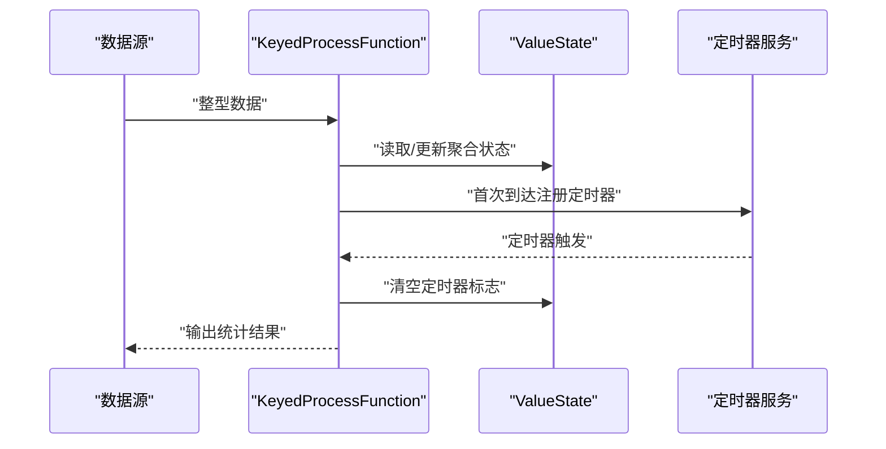

**图表来源**
- [Spark_Boolean.java](file://_06_flink/src/main/java/_08_richFunction/_07_Spark_Boolean.java#L1-L147)
- [Spark_Integer_my.java](file://_06_flink/src/main/java/_08_richFunction/_08_Spark_Integer_my.java#L1-L33)

**章节来源**
- [Spark_Boolean.java](file://_06_flink/src/main/java/_08_richFunction/_07_Spark_Boolean.java#L1-L147)
- [Spark_Integer_my.java](file://_06_flink/src/main/java/_08_richFunction/_08_Spark_Integer_my.java#L1-L33)

### 检查点与Operator State（Source偏移量）
- 场景目标：Source通过ListState记录已消费偏移量，在故障恢复时从上次检查点恢复偏移量继续消费，实现Exactly-once
- 关键接口：CheckpointedFunction.initializeState、snapshotState

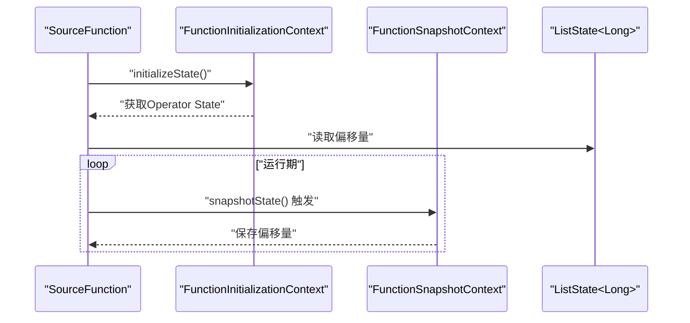

**图表来源**
- [SaveCheckPoint.java](file://_06_flink/src/main/java/_17_UV/_05_SaveCheckPoint.java#L1-L98)
- [KafkaFlinkKafkaExactlyOnce.java](file://_06_flink/src/main/java/_17_UV/_06_KafkaFlinkKafkaExactlyOnce.java#L32-L105)

**章节来源**
- [SaveCheckPoint.java](file://_06_flink/src/main/java/_17_UV/_05_SaveCheckPoint.java#L1-L98)
- [KafkaFlinkKafkaExactlyOnce.java](file://_06_flink/src/main/java/_17_UV/_06_KafkaFlinkKafkaExactlyOnce.java#L32-L105)

### 状态后端选择与配置
- MemoryStateBackend：内存态，速度快但不可用于生产；适合本地测试
- FsStateBackend：文件系统态，适合小规模状态与简单部署
- RocksDBStateBackend：磁盘+LSM树，适合大规模状态与高吞吐场景；需引入rocksdb模块

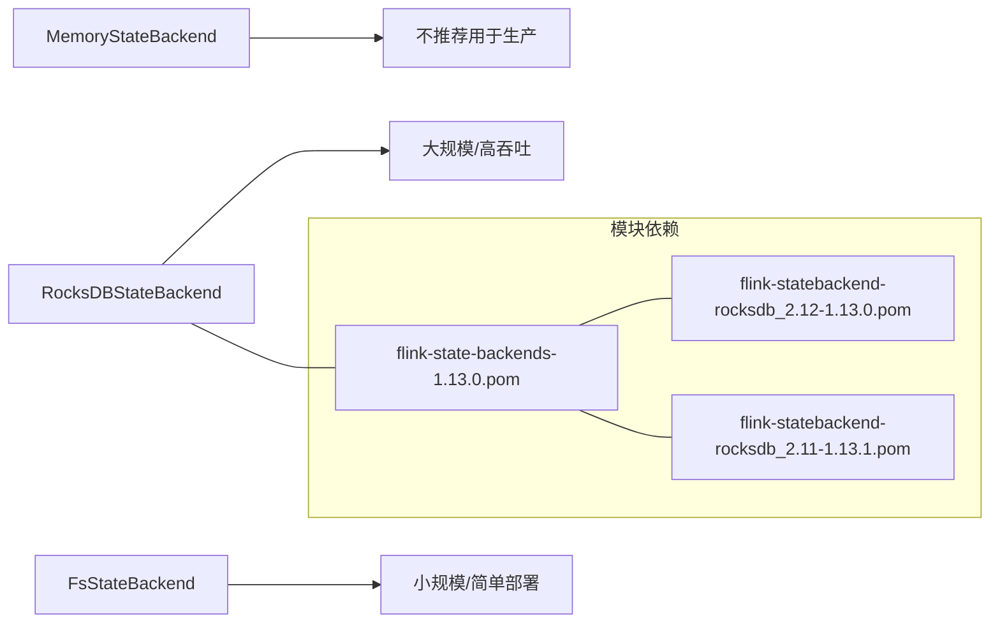

**图表来源**
- [flink-state-backends-1.13.0.pom](file://org/apache/flink/flink-state-backends/1.13.0/flink-state-backends-1.13.0.pom#L1-L44)
- [flink-statebackend-rocksdb_2.12-1.13.0.pom](file://org/apache/flink/flink-statebackend-rocksdb_2.12/1.13.0/flink-statebackend-rocksdb_2.12-1.13.0.pom#L1-L33)
- [flink-statebackend-rocksdb_2.11-1.13.1.pom](file://org/apache/flink/flink-statebackend-rocksdb_2.11/1.13.1/flink-statebackend-rocksdb_2.11-1.13.1.pom#L1-L33)

**章节来源**
- [flink-state-backends-1.13.0.pom](file://org/apache/flink/flink-state-backends/1.13.0/flink-state-backends-1.13.0.pom#L1-L44)
- [flink-statebackend-rocksdb_2.12-1.13.0.pom](file://org/apache/flink/flink-statebackend-rocksdb_2.12/1.13.0/flink-statebackend-rocksdb_2.12-1.13.0.pom#L1-L33)
- [flink-statebackend-rocksdb_2.11-1.13.1.pom](file://org/apache/flink/flink-statebackend-rocksdb_2.11/1.13.1/flink-statebackend-rocksdb_2.11-1.13.1.pom#L1-L33)

### 状态持久化、检查点与恢复
- 检查点配置：启用周期性检查点、设置模式（精确一次）、超时与并发策略、外部化检查点保留策略
- 状态恢复：重启后从最近检查点恢复Keyed State与Operator State

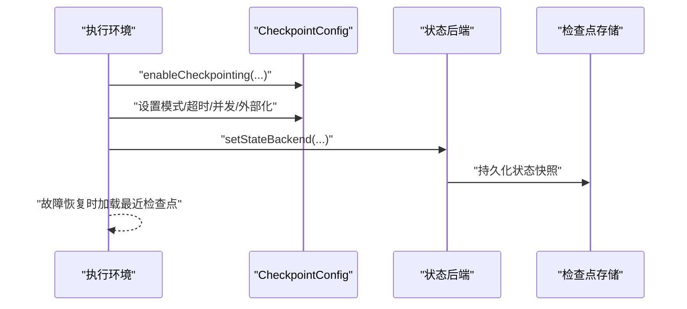

**图表来源**
- [CheckPoint.java](file://_06_flink/src/main/java/_17_UV/_03_CheckPoint.java#L1-L27)
- [BufferingSinkExample.java](file://_06_flink_wu/src/main/java/com/atguigu/chatper09/BufferingSinkExample.java#L29-L56)

**章节来源**
- [CheckPoint.java](file://_06_flink/src/main/java/_17_UV/_03_CheckPoint.java#L1-L27)
- [BufferingSinkExample.java](file://_06_flink_wu/src/main/java/com/atguigu/chatper09/BufferingSinkExample.java#L29-L56)

## 依赖关系分析
- 状态函数依赖运行时上下文获取状态描述符，Keyed State通过ValueState/MapState等类型声明
- 检查点依赖CheckpointedFunction接口与状态后端，Operator State通过OperatorStateStore访问
- 状态后端模块通过父POM聚合，RocksDB子模块提供磁盘态实现

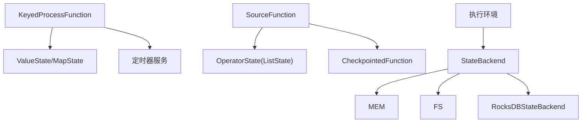

**图表来源**
- [Spark_Boolean.java](file://_06_flink/src/main/java/_08_richFunction/_07_Spark_Boolean.java#L1-L147)
- [SaveCheckPoint.java](file://_06_flink/src/main/java/_17_UV/_05_SaveCheckPoint.java#L1-L98)
- [flink-state-backends-1.13.0.pom](file://org/apache/flink/flink-state-backends/1.13.0/flink-state-backends-1.13.0.pom#L1-L44)

**章节来源**
- [Spark_Boolean.java](file://_06_flink/src/main/java/_08_richFunction/_07_Spark_Boolean.java#L1-L147)
- [SaveCheckPoint.java](file://_06_flink/src/main/java/_17_UV/_05_SaveCheckPoint.java#L1-L98)
- [flink-state-backends-1.13.0.pom](file://org/apache/flink/flink-state-backends/1.13.0/flink-state-backends-1.13.0.pom#L1-L44)

## 性能考虑
- 状态大小与序列化：优先使用紧凑类型与高效序列化，避免大对象频繁更新
- 定时器数量控制：合理使用定时器，避免过多定时器导致调度开销增大
- 检查点间隔与超时：根据数据速率与状态大小调整检查点间隔与超时，平衡吞吐与恢复时间
- 状态后端选择：小状态可用FsStateBackend，大状态建议RocksDBStateBackend并结合外部化检查点
- RocksDB调优：结合内存与磁盘I/O特性，调整压缩、缓存与写放大策略（参考调优示例）

[本节为通用指导，无需列出具体文件来源]

## 故障排查指南
- 检查点未生效：确认是否启用检查点、状态后端是否正确设置、检查点存储路径是否可达
- 状态恢复异常：核对状态描述符名称与类型一致性，确保恢复时签名一致
- 定时器未触发：检查定时器注册与删除逻辑，确认Keyed State在触发时仍可访问
- Operator State丢失：确认实现CheckpointedFunction并在initializeState中正确读取ListState

**章节来源**
- [CheckPoint.java](file://_06_flink/src/main/java/_17_UV/_03_CheckPoint.java#L1-L27)
- [SaveCheckPoint.java](file://_06_flink/src/main/java/_17_UV/_05_SaveCheckPoint.java#L1-L98)
- [Temperature_teacher.java](file://_06_flink/src/main/java/_08_richFunction/_10_Temperature_teacher.java#L1-L94)

## 结论
Flink状态管理通过Keyed State与Operator State分别满足“每key一份”与“算子级”的状态需求，结合KeyedProcessFunction与RichFunction可灵活实现复杂业务逻辑。借助检查点与状态后端，系统可在故障后可靠恢复。针对不同场景选择合适的状态后端与检查点策略，并遵循性能优化与内存管理最佳实践，可显著提升系统的稳定性与吞吐表现。

## 附录
- 实战案例清单
  - 温度监控与告警：[Temperature_my.java](file://_06_flink/src/main/java/_08_richFunction/_10_Temperature_my.java#L1-L37)、[Temperature_teacher.java](file://_06_flink/src/main/java/_08_richFunction/_10_Temperature_teacher.java#L1-L94)
  - 字典查询与计数：[Dic_my.java](file://_06_flink/src/main/java/_08_richFunction/_09_Dic_my.java#L1-L50)
  - 统计聚合与定时输出：[Spark_Boolean.java](file://_06_flink/src/main/java/_08_richFunction/_07_Spark_Boolean.java#L1-L147)、[Spark_Integer_my.java](file://_06_flink/src/main/java/_08_richFunction/_08_Spark_Integer_my.java#L1-L33)
  - 检查点与Exactly-once：[CheckPoint.java](file://_06_flink/src/main/java/_17_UV/_03_CheckPoint.java#L1-L27)、[SaveCheckPoint.java](file://_06_flink/src/main/java/_17_UV/_05_SaveCheckPoint.java#L1-L98)、[KafkaFlinkKafkaExactlyOnce.java](file://_06_flink/src/main/java/_17_UV/_06_KafkaFlinkKafkaExactlyOnce.java#L32-L105)
  - 状态后端与外部化检查点：[BufferingSinkExample.java](file://_06_flink_wu/src/main/java/com/atguigu/chatper09/BufferingSinkExample.java#L29-L56)、[flink-state-backends-1.13.0.pom](file://org/apache/flink/flink-state-backends/1.13.0/flink-state-backends-1.13.0.pom#L1-L44)