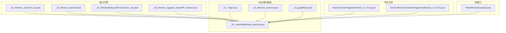
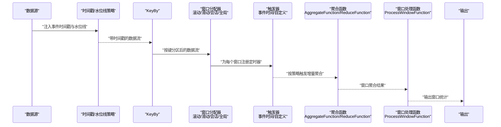
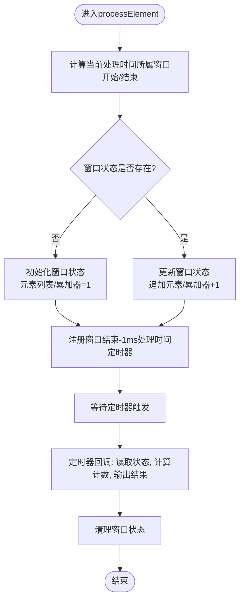
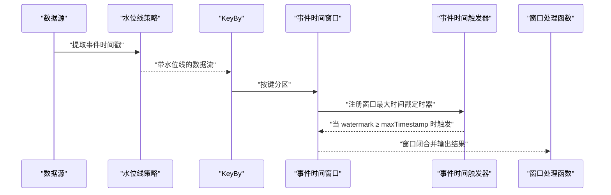
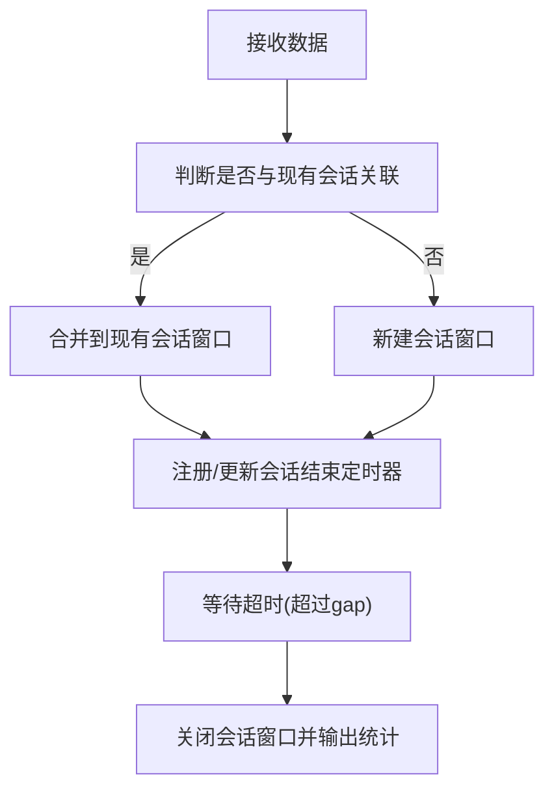
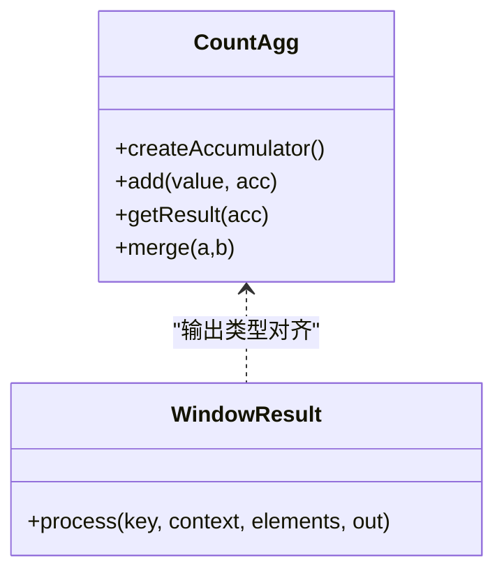
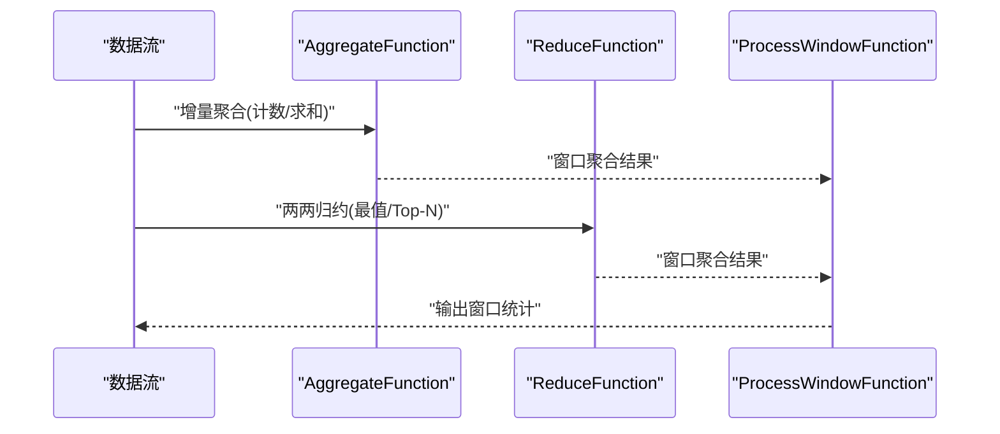
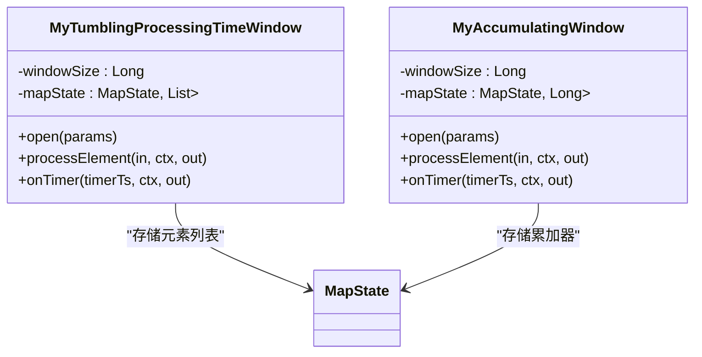
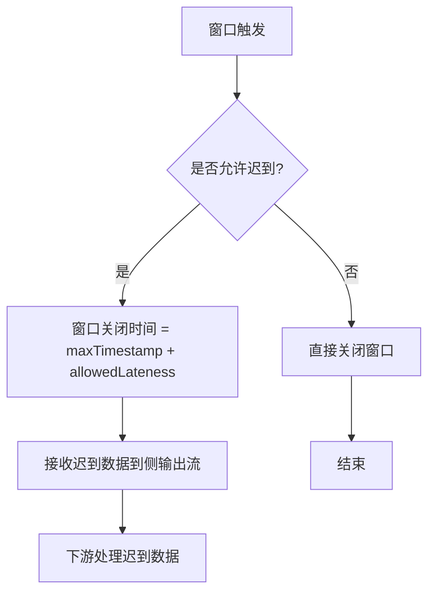

# 窗口操作

<cite>
**本文引用的文件**
- [窗口创建源码分析.txt](file://_06_flink/窗口创建源码分析.txt)
- [_01_Window_countUV_my.java](file://_06_flink/src/main/java/_09_window/_01_Window_countUV_my.java)
- [_02_Window_teacher.java](file://_06_flink/src/main/java/_09_window/_02_Window_teacher.java)
- [_03_WindowByKeyedProcessFunc_my.java](file://_06_flink/src/main/java/_09_window/_03_WindowByKeyedProcessFunc_my.java)
- [_05_Window_Aggrate_KeyedPF_teacher.java](file://_06_flink/src/main/java/_09_window/_05_Window_Aggrate_KeyedPF_teacher.java)
- [_01_insertWaterMark_teacher.java](file://_06_flink/src/main/java/_10_waterMark/_01_insertWaterMark_teacher.java)
- [_01_Triger.java](file://_06_flink/src/main/java/_16_triger/_01_Triger.java)
- [_01_lateness_teacher.java](file://_06_flink/src/main/java/_14_lateness/_01_lateness_teacher.java)
- [_15_gapMerge.java](file://_06_flink/src/main/java/_14_lateness/_15_gapMerge.java)
- [DwsUserUserRegisterWindow_m_0713.java](file://_200_flinkRealtime/src/main/java/com/atguigu/gmall/realtime/app/dws/DwsUserUserRegisterWindow_m_0713.java)
- [DwsTrafficVcChArIsNewPageViewWindow_m_0712.java](file://_200_flinkRealtime/src/main/java/com/atguigu/gmall/realtime/app/dws/DwsTrafficVcChArIsNewPageViewWindow_m_0712.java)
- [FakeWindowExample.java](file://_06_flink_wu/src/main/java/com/atguigu/chatper09/FakeWindowExample.java)
</cite>

## 目录
1. [引言](#引言)
2. [项目结构](#项目结构)
3. [核心组件](#核心组件)
4. [架构总览](#架构总览)
5. [详细组件分析](#详细组件分析)
6. [依赖分析](#依赖分析)
7. [性能考虑](#性能考虑)
8. [故障排查指南](#故障排查指南)
9. [结论](#结论)
10. [附录](#附录)

## 引言
本文件围绕 Apache Flink 窗口操作进行系统化技术文档整理，覆盖滚动窗口、滑动窗口、会话窗口与全局窗口的概念与实现要点；详解事件时间与处理时间在窗口计算中的作用；通过 CountWindow 与 TimeWindow 的具体示例演示窗口聚合；解释 WindowFunction、ReduceFunction、AggregateFunction 等窗口函数的使用方法；并结合 KeyedProcessFunction 在窗口中的应用与窗口状态管理给出实操指引。最后提供窗口性能优化与内存管理的最佳实践。

## 项目结构
本仓库中与窗口操作密切相关的代码主要集中在以下路径：
- _06_flink/src/main/java/_09_window：窗口开窗、聚合与窗口函数示例
- _06_flink/src/main/java/_10_waterMark：水位线与事件时间示例
- _06_flink/src/main/java/_14_lateness：迟到数据与 Allowed Lateness 示例
- _06_flink/src/main/java/_16_triger：自定义触发器示例
- _200_flinkRealtime：真实业务场景下的窗口聚合与窗口函数应用
- _06_flink_wu：自定义“伪窗口”示例，便于理解窗口状态与定时器

**图表来源**
- [_01_Window_countUV_my.java](file://_06_flink/src/main/java/_09_window/_01_Window_countUV_my.java#L1-L62)
- [_02_Window_teacher.java](file://_06_flink/src/main/java/_09_window/_02_Window_teacher.java#L1-L77)
- [_03_WindowByKeyedProcessFunc_my.java](file://_06_flink/src/main/java/_09_window/_03_WindowByKeyedProcessFunc_my.java#L1-L113)
- [_05_Window_Aggrate_KeyedPF_teacher.java](file://_06_flink/src/main/java/_09_window/_05_Window_Aggrate_KeyedPF_teacher.java#L1-L91)
- [_01_insertWaterMark_teacher.java](file://_06_flink/src/main/java/_10_waterMark/_01_insertWaterMark_teacher.java#L1-L78)
- [_01_Triger.java](file://_06_flink/src/main/java/_16_triger/_01_Triger.java#L1-L91)
- [_01_lateness_teacher.java](file://_06_flink/src/main/java/_14_lateness/_01_lateness_teacher.java#L1-L58)
- [_15_gapMerge.java](file://_06_flink/src/main/java/_14_lateness/_15_gapMerge.java#L1-L50)
- [DwsUserUserRegisterWindow_m_0713.java](file://_200_flinkRealtime/src/main/java/com/atguigu/gmall/realtime/app/dws/DwsUserUserRegisterWindow_m_0713.java#L81-L120)
- [DwsTrafficVcChArIsNewPageViewWindow_m_0712.java](file://_200_flinkRealtime/src/main/java/com/atguigu/gmall/realtime/app/dws/DwsTrafficVcChArIsNewPageViewWindow_m_0712.java#L224-L243)
- [FakeWindowExample.java](file://_06_flink_wu/src/main/java/com/atguigu/chatper09/FakeWindowExample.java#L54-L86)

**章节来源**
- [窗口创建源码分析.txt](file://_06_flink/窗口创建源码分析.txt#L1-L80)

## 核心组件
- 窗口分配器与窗口类型
  - 滚动窗口：按固定窗口长度划分，窗口边界对齐到时间轴刻度
  - 滑动窗口：窗口按步长滑动，支持重叠
  - 会话窗口：基于不活跃间隔 gap 的动态窗口
  - 全局窗口：无预设划分，常与自定义触发器、定时器配合
- 时间语义
  - 事件时间：基于数据本身的时间戳，依赖水位线推进
  - 处理时间：基于处理节点本地时钟，无乱序处理
- 窗口函数族
  - AggregateFunction：增量聚合，适合计数、求和等
  - ReduceFunction：两两归约，适合不可拆分聚合
  - WindowFunction/ProcessWindowFunction：全量窗口处理，可访问窗口元信息
- KeyedProcessFunction：在无内置窗口分配器时，手工维护窗口状态与定时器

**章节来源**
- [_01_Window_countUV_my.java](file://_06_flink/src/main/java/_09_window/_01_Window_countUV_my.java#L1-L62)
- [_02_Window_teacher.java](file://_06_flink/src/main/java/_09_window/_02_Window_teacher.java#L1-L77)
- [_03_WindowByKeyedProcessFunc_my.java](file://_06_flink/src/main/java/_09_window/_03_WindowByKeyedProcessFunc_my.java#L1-L113)
- [_05_Window_Aggrate_KeyedPF_teacher.java](file://_06_flink/src/main/java/_09_window/_05_Window_Aggrate_KeyedPF_teacher.java#L1-L91)
- [_01_insertWaterMark_teacher.java](file://_06_flink/src/main/java/_10_waterMark/_01_insertWaterMark_teacher.java#L1-L78)
- [_01_Triger.java](file://_06_flink/src/main/java/_16_triger/_01_Triger.java#L1-L91)
- [_01_lateness_teacher.java](file://_06_flink/src/main/java/_14_lateness/_01_lateness_teacher.java#L1-L58)
- [_15_gapMerge.java](file://_06_flink/src/main/java/_14_lateness/_15_gapMerge.java#L1-L50)
- [窗口创建源码分析.txt](file://_06_flink/窗口创建源码分析.txt#L1-L80)

## 架构总览
下图展示了从数据源到窗口计算再到输出的整体流程，以及水位线、触发器与定时器在其中的作用。

**图表来源**
- [_01_insertWaterMark_teacher.java](file://_06_flink/src/main/java/_10_waterMark/_01_insertWaterMark_teacher.java#L1-L78)
- [_01_Triger.java](file://_06_flink/src/main/java/_16_triger/_01_Triger.java#L1-L91)
- [_02_Window_teacher.java](file://_06_flink/src/main/java/_09_window/_02_Window_teacher.java#L1-L77)
- [_01_Window_countUV_my.java](file://_06_flink/src/main/java/_09_window/_01_Window_countUV_my.java#L1-L62)

## 详细组件分析

### 滚动窗口与处理时间窗口
- 概念与实现
  - 滚动窗口按固定长度对齐时间轴，窗口边界固定且互斥
  - 处理时间滚动窗口不依赖水位线，基于本地处理时间推进
- 示例要点
  - 使用处理时间滚动窗口进行计数统计
  - 可选两种路径：全量窗口处理或增量聚合+窗口处理
- 关键点
  - 计算窗口开始/结束时间：基于当前处理时间取模
  - 注册窗口结束-1ms的处理时间定时器触发窗口计算
  - 使用 MapState 存储窗口元素或累加器，避免重复计算

**图表来源**
- [_03_WindowByKeyedProcessFunc_my.java](file://_06_flink/src/main/java/_09_window/_03_WindowByKeyedProcessFunc_my.java#L1-L113)
- [_05_Window_Aggrate_KeyedPF_teacher.java](file://_06_flink/src/main/java/_09_window/_05_Window_Aggrate_KeyedPF_teacher.java#L1-L91)

**章节来源**
- [_01_Window_countUV_my.java](file://_06_flink/src/main/java/_09_window/_01_Window_countUV_my.java#L1-L62)
- [_03_WindowByKeyedProcessFunc_my.java](file://_06_flink/src/main/java/_09_window/_03_WindowByKeyedProcessFunc_my.java#L1-L113)
- [_05_Window_Aggrate_KeyedPF_teacher.java](file://_06_flink/src/main/java/_09_window/_05_Window_Aggrate_KeyedPF_teacher.java#L1-L91)

### 事件时间窗口与水位线
- 概念与实现
  - 事件时间窗口基于数据事件时间戳划分，需水位线推进触发
  - 水位线单调递增，窗口在 watermark ≥ 窗口最大时间戳 时触发
- 示例要点
  - 使用 WatermarkStrategy 为数据流分配时间戳与水位线
  - 使用事件时间滚动窗口进行聚合与输出
- 关键点
  - 窗口最大时间戳为 end - 1ms，确保左闭右开
  - 默认触发器为事件时间触发器，按水位线推进触发

**图表来源**
- [_01_insertWaterMark_teacher.java](file://_06_flink/src/main/java/_10_waterMark/_01_insertWaterMark_teacher.java#L1-L78)
- [窗口创建源码分析.txt](file://_06_flink/窗口创建源码分析.txt#L1-L80)

**章节来源**
- [_01_insertWaterMark_teacher.java](file://_06_flink/src/main/java/_10_waterMark/_01_insertWaterMark_teacher.java#L1-L78)
- [窗口创建源码分析.txt](file://_06_flink/窗口创建源码分析.txt#L1-L80)

### 滑动窗口
- 概念与实现
  - 滑动窗口以固定步长向前滑动，允许窗口重叠
  - 通常与事件时间或处理时间结合使用
- 示例要点
  - 使用滑动窗口进行高频统计，如每5秒统计最近10秒内的点击数
- 关键点
  - 窗口大小与滑动步长决定重叠程度与计算频率
  - 合理设置 allowed lateness 以容忍部分乱序

**章节来源**
- [_02_Window_teacher.java](file://_06_flink/src/main/java/_09_window/_02_Window_teacher.java#L1-L77)

### 会话窗口
- 概念与实现
  - 基于不活跃间隔 gap 的动态窗口，超过 gap 才关闭窗口
  - 适用于用户行为会话识别与统计
- 示例要点
  - 使用 ProcessingTimeSessionWindows.withGap 定义会话窗口
  - 结合 KeyedProcessFunction 或窗口处理函数输出会话统计

**图表来源**
- [_15_gapMerge.java](file://_06_flink/src/main/java/_14_lateness/_15_gapMerge.java#L1-L50)

**章节来源**
- [_15_gapMerge.java](file://_06_flink/src/main/java/_14_lateness/_15_gapMerge.java#L1-L50)

### 全局窗口
- 概念与实现
  - 无预设窗口划分，所有数据进入同一全局窗口
  - 常与自定义触发器、定时器、侧输出配合使用
- 示例要点
  - 使用全局窗口与自定义触发器实现按条件触发的聚合
  - 可结合 KeyedProcessFunction 手工维护全局状态

**章节来源**
- [_01_Triger.java](file://_06_flink/src/main/java/_16_triger/_01_Triger.java#L1-L91)

### 窗口聚合函数：CountWindow 与 TimeWindow
- CountWindow
  - 基于元素数量划分窗口，适合按批次统计
  - 示例：使用 AggregateFunction 进行计数，再由窗口处理函数输出
- TimeWindow
  - 基于时间划分窗口，支持事件时间与处理时间
  - 示例：事件时间滚动窗口 + 聚合 + 窗口处理输出

**图表来源**
- [_02_Window_teacher.java](file://_06_flink/src/main/java/_09_window/_02_Window_teacher.java#L1-L77)

**章节来源**
- [_02_Window_teacher.java](file://_06_flink/src/main/java/_09_window/_02_Window_teacher.java#L1-L77)

### 窗口函数：WindowFunction、ReduceFunction、AggregateFunction
- AggregateFunction
  - 增量聚合，适合计数、求和、平均等
  - 与窗口处理函数组合，输出最终统计
- ReduceFunction
  - 两两归约，适合不可拆分聚合（如最值、Top-N）
- WindowFunction/ProcessWindowFunction
  - 全量窗口处理，可访问窗口元信息（开始/结束时间）

**图表来源**
- [_02_Window_teacher.java](file://_06_flink/src/main/java/_09_window/_02_Window_teacher.java#L1-L77)
- [DwsTrafficVcChArIsNewPageViewWindow_m_0712.java](file://_200_flinkRealtime/src/main/java/com/atguigu/gmall/realtime/app/dws/DwsTrafficVcChArIsNewPageViewWindow_m_0712.java#L224-L243)

**章节来源**
- [_02_Window_teacher.java](file://_06_flink/src/main/java/_09_window/_02_Window_teacher.java#L1-L77)
- [DwsTrafficVcChArIsNewPageViewWindow_m_0712.java](file://_200_flinkRealtime/src/main/java/com/atguigu/gmall/realtime/app/dws/DwsTrafficVcChArIsNewPageViewWindow_m_0712.java#L224-L243)

### KeyedProcessFunction 在窗口中的应用与窗口状态管理
- 应用场景
  - 无内置窗口分配器时，手工维护窗口状态与定时器
  - 需要细粒度控制窗口生命周期与输出时机
- 状态管理
  - 使用 MapState 存储窗口元素列表或累加器
  - 使用定时器在窗口结束前或结束后触发计算与清理
- 示例要点
  - 计算窗口开始/结束时间
  - 注册处理时间定时器（窗口结束-1ms）
  - 定时器触发时读取状态、计算结果并清理

**图表来源**
- [_03_WindowByKeyedProcessFunc_my.java](file://_06_flink/src/main/java/_09_window/_03_WindowByKeyedProcessFunc_my.java#L1-L113)
- [_05_Window_Aggrate_KeyedPF_teacher.java](file://_06_flink/src/main/java/_09_window/_05_Window_Aggrate_KeyedPF_teacher.java#L1-L91)

**章节来源**
- [_03_WindowByKeyedProcessFunc_my.java](file://_06_flink/src/main/java/_09_window/_03_WindowByKeyedProcessFunc_my.java#L1-L113)
- [_05_Window_Aggrate_KeyedPF_teacher.java](file://_06_flink/src/main/java/_09_window/_05_Window_Aggrate_KeyedPF_teacher.java#L1-L91)

### 迟到数据与 Allowed Lateness
- 概念与实现
  - 允许在窗口关闭后的一段时间内接收迟到数据
  - 可通过侧输出流收集迟到数据
- 示例要点
  - 使用 WatermarkStrategy 设置最大延迟
  - 使用 AllowedLateness 配置窗口关闭后可接收的额外时间
  - 将迟到数据输出到侧输出流以便后续处理

**图表来源**
- [_01_lateness_teacher.java](file://_06_flink/src/main/java/_14_lateness/_01_lateness_teacher.java#L1-L58)
- [窗口创建源码分析.txt](file://_06_flink/窗口创建源码分析.txt#L60-L80)

**章节来源**
- [_01_lateness_teacher.java](file://_06_flink/src/main/java/_14_lateness/_01_lateness_teacher.java#L1-L58)
- [窗口创建源码分析.txt](file://_06_flink/窗口创建源码分析.txt#L60-L80)

### 自定义触发器与窗口生命周期
- 概念与实现
  - 自定义触发器可改变窗口触发策略，如每条数据即触发或按固定周期触发
  - 触发器在水位线到达窗口最大时间戳时默认触发
- 示例要点
  - 使用自定义触发器实现高频输出
  - 触发后可选择 FIRE 或 FIRE_AND_PURGE

**章节来源**
- [_01_Triger.java](file://_06_flink/src/main/java/_16_triger/_01_Triger.java#L1-L91)

### 真实业务中的窗口聚合与窗口函数
- 示例要点
  - 使用 ReduceFunction 对复杂指标进行归约
  - 使用 WindowFunction/ProcessWindowFunction 输出带窗口时间戳的结果
- 关键点
  - 聚合与输出的泛型需保持一致
  - 输出结果包含 stt/edt/ts 等业务时间字段

**章节来源**
- [DwsTrafficVcChArIsNewPageViewWindow_m_0712.java](file://_200_flinkRealtime/src/main/java/com/atguigu/gmall/realtime/app/dws/DwsTrafficVcChArIsNewPageViewWindow_m_0712.java#L224-L243)
- [DwsUserUserRegisterWindow_m_0713.java](file://_200_flinkRealtime/src/main/java/com/atguigu/gmall/realtime/app/dws/DwsUserUserRegisterWindow_m_0713.java#L81-L120)

## 依赖分析
- 组件耦合关系
  - 数据源 → 水位线策略 → KeyBy → 窗口分配器 → 触发器 → 聚合/窗口处理 → 输出
- 外部依赖与集成点
  - 水位线策略与事件时间窗口强相关
  - 会话窗口依赖 gap 配置与处理时间定时器
  - 允许迟到数据依赖 allowed lateness 与侧输出流

**图表来源**
- [_01_insertWaterMark_teacher.java](file://_06_flink/src/main/java/_10_waterMark/_01_insertWaterMark_teacher.java#L1-L78)
- [_01_Triger.java](file://_06_flink/src/main/java/_16_triger/_01_Triger.java#L1-L91)
- [_02_Window_teacher.java](file://_06_flink/src/main/java/_09_window/_02_Window_teacher.java#L1-L77)

**章节来源**
- [_01_insertWaterMark_teacher.java](file://_06_flink/src/main/java/_10_waterMark/_01_insertWaterMark_teacher.java#L1-L78)
- [_01_Triger.java](file://_06_flink/src/main/java/_16_triger/_01_Triger.java#L1-L91)
- [_02_Window_teacher.java](file://_06_flink/src/main/java/_09_window/_02_Window_teacher.java#L1-L77)

## 性能考虑
- 窗口数量与键数量
  - KeyBy 后的并行度直接影响窗口数量，合理设置并行度避免过多小窗口
- 聚合策略选择
  - 优先使用 AggregateFunction 进行增量聚合，减少全量窗口处理成本
  - ReduceFunction 适合不可拆分聚合，避免中间结果膨胀
- 定时器与状态
  - 使用处理时间定时器时，注意窗口结束-1ms的触发时机，避免频繁触发
  - MapState 中的键设计应尽量紧凑，减少内存占用
- 允许迟到与侧输出
  - 合理设置 allowed lateness，避免过长导致状态膨胀
  - 将迟到数据分流至侧输出，减轻主路径压力
- 事件时间窗口
  - 设置合理的最大无序度，平衡延迟与吞吐
  - 使用水位线推进策略，避免频繁推进造成抖动

[本节为通用指导，无需列出具体文件来源]

## 故障排查指南
- 窗口未触发
  - 检查水位线是否单调递增，是否达到窗口最大时间戳
  - 确认触发器策略是否符合预期
- 迟到数据丢失
  - 检查 allowed lateness 是否设置，侧输出标签是否正确
- 状态异常
  - 检查窗口键设计与状态命名，避免键冲突
  - 确认定时器是否正确注册与清理
- 会话窗口问题
  - 检查 gap 配置是否合理，是否出现频繁合并或分裂

**章节来源**
- [_01_lateness_teacher.java](file://_06_flink/src/main/java/_14_lateness/_01_lateness_teacher.java#L1-L58)
- [_01_Triger.java](file://_06_flink/src/main/java/_16_triger/_01_Triger.java#L1-L91)
- [_15_gapMerge.java](file://_06_flink/src/main/java/_14_lateness/_15_gapMerge.java#L1-L50)

## 结论
Flink 窗口操作通过窗口分配器、水位线与触发器协同工作，实现对事件时间与处理时间的灵活统计。在实际工程中，应根据业务需求选择合适的窗口类型与聚合策略，合理设置触发与允许迟到，结合 KeyedProcessFunction 进行精细的状态与定时器管理，从而在保证准确性的同时获得良好的性能表现。

## 附录
- 伪窗口示例：通过定时器与状态模拟窗口行为，便于理解窗口生命周期与状态管理

**章节来源**
- [FakeWindowExample.java](file://_06_flink_wu/src/main/java/com/atguigu/chatper09/FakeWindowExample.java#L54-L86)