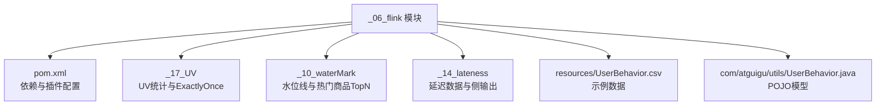
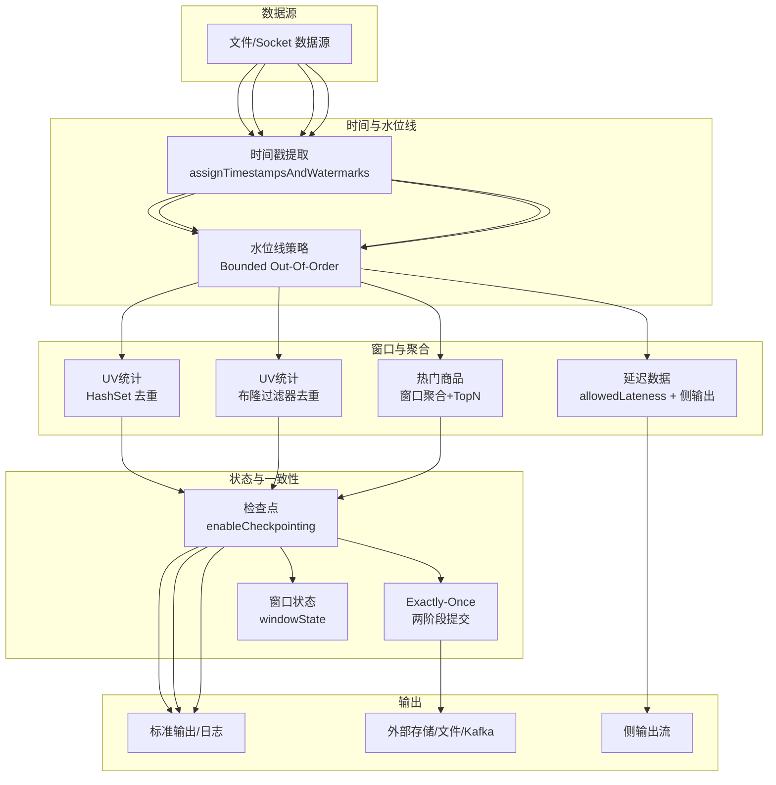
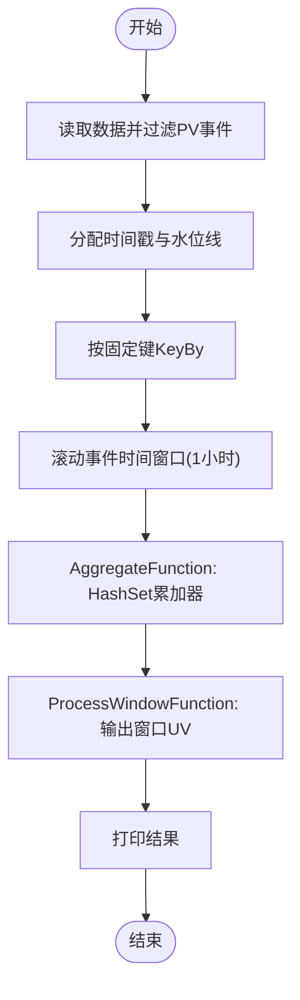
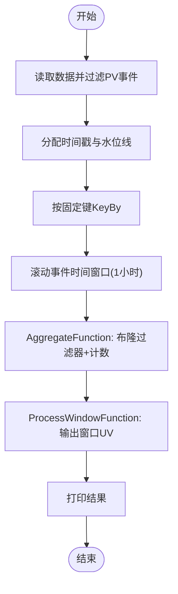
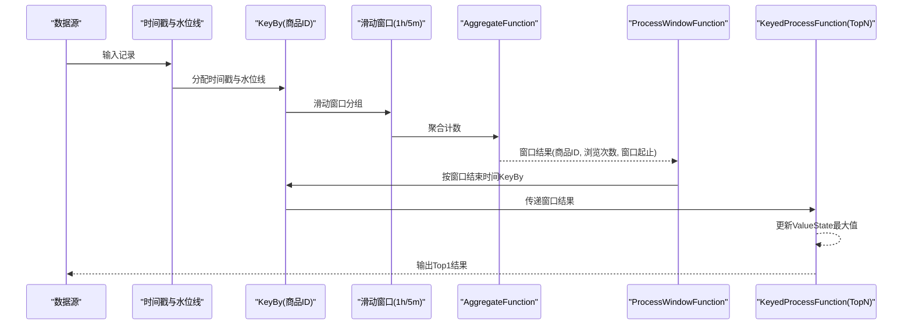
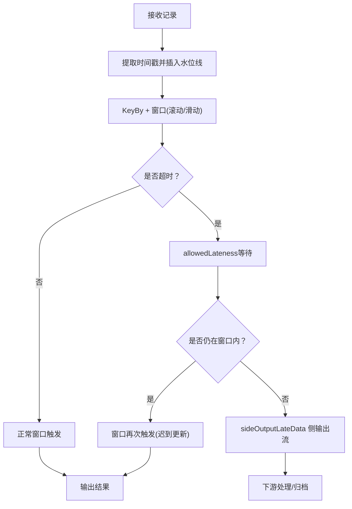
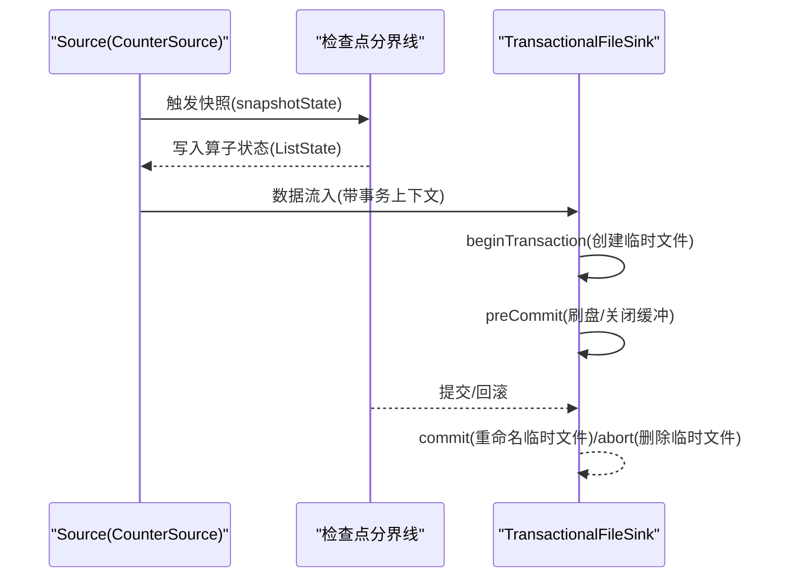
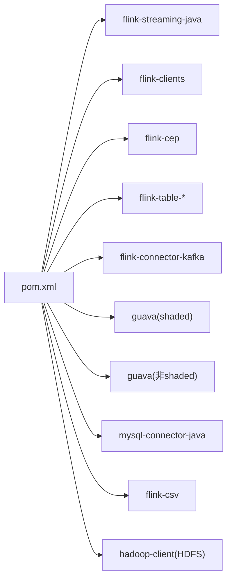

# 项目实战

<cite>
**本文引用的文件**
- [_06_flink/pom.xml](file://_06_flink/pom.xml)
- [_17_UV/_01_UV.java](file://_17_UV/_01_UV.java)
- [_17_UV/_02_UvBloomFilter.java](file://_17_UV/_02_UvBloomFilter.java)
- [_17_UV/_03_CheckPoint.java](file://_17_UV/_03_CheckPoint.java)
- [_17_UV/_04_WindowState.java](file://_17_UV/_04_WindowState.java)
- [_17_UV/_06_KafkaFlinkKafkaExactlyOnce.java](file://_17_UV/_06_KafkaFlinkKafkaExactlyOnce.java)
- [_10_waterMark/_01_insertWaterMark_teacher.java](file://_10_waterMark/_01_insertWaterMark_teacher.java)
- [_10_waterMark/_04_AliHotProduct_mine.java](file://_10_waterMark/_04_AliHotProduct_mine.java)
- [_14_lateness/_01_lateness_teacher.java](file://_14_lateness/_01_lateness_teacher.java)
- [_14_lateness/_02_AllowedLateness_teacher.java](file://_14_lateness/_02_AllowedLateness_teacher.java)
- [_06_flink/src/main/resources/UserBehavior.csv](file://_06_flink/src/main/resources/UserBehavior.csv)
- [com/atguigu/utils/UserBehavior.java](file://com/atguigu/utils/UserBehavior.java)
</cite>

## 目录
1. [引言](#引言)
2. [项目结构](#项目结构)
3. [核心组件](#核心组件)
4. [架构总览](#架构总览)
5. [详细组件分析](#详细组件分析)
6. [依赖分析](#依赖分析)
7. [性能考虑](#性能考虑)
8. [故障排查指南](#故障排查指南)
9. [结论](#结论)
10. [附录](#附录)

## 引言
本技术文档围绕一个电商监控实战项目，系统梳理Flink在生产环境中的完整应用流程，覆盖UV统计、热门商品分析、延迟数据处理等核心场景，并深入讲解布隆过滤器去重、检查点机制、窗口状态管理与 Exactly-Once 语义保障。文档提供从需求分析到上线运维的全流程实践建议，帮助读者快速掌握Flink在真实业务中的落地方法。

## 项目结构
该仓库包含多个模块，其中与Flink实战直接相关的是 _06_flink 模块。其核心由若干示例工程组成，分别演示窗口聚合、水位线与迟到数据、布隆过滤器去重、检查点与 Exactly-Once 等主题。工程通过Maven统一管理依赖，版本为1.13.0，涵盖Streaming、Table API、Kafka Connector、CSV工具等。

图示来源
- [_06_flink/pom.xml](file://_06_flink/pom.xml#L1-L175)
- [_17_UV/_01_UV.java](file://_17_UV/_01_UV.java#L1-L101)
- [_10_waterMark/_01_insertWaterMark_teacher.java](file://_10_waterMark/_01_insertWaterMark_teacher.java#L1-L78)
- [_14_lateness/_01_lateness_teacher.java](file://_14_lateness/_01_lateness_teacher.java#L1-L58)
- [_06_flink/src/main/resources/UserBehavior.csv](file://_06_flink/src/main/resources/UserBehavior.csv)
- [com/atguigu/utils/UserBehavior.java](file://com/atguigu/utils/UserBehavior.java#L1-L35)

章节来源
- [_06_flink/pom.xml](file://_06_flink/pom.xml#L1-L175)

## 核心组件
- UV统计（精确去重与布隆过滤器）
  - 精确去重：基于窗口内HashSet累加器，按用户ID去重并统计UV数量。
  - 布隆过滤器：使用布隆过滤器近似去重，支持误判率与容量配置，适合大规模数据流。
- 热门商品分析（窗口聚合+TopN）
  - 商品浏览计数聚合，结合KeyedProcessFunction维护窗口内最大值，输出Top1商品。
- 延迟数据处理（水位线、AllowedLateness、侧输出）
  - 通过WatermarkStrategy设置延迟容忍时间，使用allowedLateness与sideOutputLateData处理迟到数据。
- 检查点与 Exactly-Once
  - 启用检查点，配置StateBackend与Checkpoint存储；通过TwoPhaseCommitSink实现端到端Exactly-Once。

章节来源
- [_17_UV/_01_UV.java](file://_17_UV/_01_UV.java#L1-L101)
- [_17_UV/_02_UvBloomFilter.java](file://_17_UV/_02_UvBloomFilter.java#L1-L123)
- [_10_waterMark/_04_AliHotProduct_mine.java](file://_10_waterMark/_04_AliHotProduct_mine.java#L1-L133)
- [_14_lateness/_02_AllowedLateness_teacher.java](file://_14_lateness/_02_AllowedLateness_teacher.java#L1-L77)
- [_17_UV/_03_CheckPoint.java](file://_17_UV/_03_CheckPoint.java#L1-L55)
- [_17_UV/_06_KafkaFlinkKafkaExactlyOnce.java](file://_17_UV/_06_KafkaFlinkKafkaExactlyOnce.java#L1-L163)

## 架构总览
下图展示了电商监控项目的整体数据流与处理链路：数据源读取CSV或Socket，经时间特征与水位线注入后进入窗口聚合；UV统计采用不同去重策略；热门商品分析在窗口结果上做TopN；延迟数据通过AllowedLateness与侧输出处理；最终通过检查点与两阶段提交保障Exactly-Once。

图示来源
- [_17_UV/_01_UV.java](file://_17_UV/_01_UV.java#L1-L101)
- [_17_UV/_02_UvBloomFilter.java](file://_17_UV/_02_UvBloomFilter.java#L1-L123)
- [_10_waterMark/_04_AliHotProduct_mine.java](file://_10_waterMark/_04_AliHotProduct_mine.java#L1-L133)
- [_14_lateness/_02_AllowedLateness_teacher.java](file://_14_lateness/_02_AllowedLateness_teacher.java#L1-L77)
- [_17_UV/_03_CheckPoint.java](file://_17_UV/_03_CheckPoint.java#L1-L55)
- [_17_UV/_06_KafkaFlinkKafkaExactlyOnce.java](file://_17_UV/_06_KafkaFlinkKafkaExactlyOnce.java#L1-L163)

## 详细组件分析

### UV统计（精确去重）
- 设计要点
  - 使用事件时间窗口，按小时滚动窗口统计UV。
  - 采用AggregateFunction累加器维护Set，保证同一窗口内用户ID幂等加入。
  - 使用ProcessWindowFunction输出窗口起止时间与UV计数。
- 性能与复杂度
  - 时间复杂度：O(n) 聚合，Set查找与插入均摊O(1)。
  - 空间复杂度：O(U)（U为窗口内独立用户数）。
- 适用场景
  - 数据规模可控、要求精确去重的场景。

图示来源
- [_17_UV/_01_UV.java](file://_17_UV/_01_UV.java#L1-L101)

章节来源
- [_17_UV/_01_UV.java](file://_17_UV/_01_UV.java#L1-L101)

### UV统计（布隆过滤器去重）
- 设计要点
  - 使用布隆过滤器近似去重，支持误判率与容量配置。
  - AggregateFunction返回Tuple2<布隆过滤器, 计数>，仅当mightContain=false时才增加计数。
- 性能与复杂度
  - 时间复杂度：O(1) 插入/查询。
  - 空间复杂度：由布隆过滤器参数决定，远小于精确去重方案。
- 适用场景
  - 大规模数据流、可接受极低误判率的UV统计。

图示来源
- [_17_UV/_02_UvBloomFilter.java](file://_17_UV/_02_UvBloomFilter.java#L1-L123)

章节来源
- [_17_UV/_02_UvBloomFilter.java](file://_17_UV/_02_UvBloomFilter.java#L1-L123)

### 热门商品分析（窗口聚合+TopN）
- 设计要点
  - 以商品ID为键，滑动窗口（1小时，步长5分钟）统计浏览次数。
  - 使用AggregateFunction进行计数聚合，ProcessWindowFunction封装窗口结果。
  - 在下游KeyedProcessFunction中维护窗口内最大值，输出Top1商品。
- 状态管理
  - 使用ValueState保存窗口内的最大浏览次数，实现跨迟到数据的增量更新。

图示来源
- [_10_waterMark/_04_AliHotProduct_mine.java](file://_10_waterMark/_04_AliHotProduct_mine.java#L1-L133)

章节来源
- [_10_waterMark/_04_AliHotProduct_mine.java](file://_10_waterMark/_04_AliHotProduct_mine.java#L1-L133)

### 延迟数据处理（水位线、AllowedLateness、侧输出）
- 设计要点
  - 使用WatermarkStrategy.forBoundedOutOfOrderness设置最大延迟时间。
  - 通过allowedLateness延长窗口关闭，sideOutputLateData将迟到数据分流至侧输出流。
  - 在ProcessWindowFunction中区分首次触发与迟到数据更新，结合windowState实现幂等输出。

图示来源
- [_14_lateness/_02_AllowedLateness_teacher.java](file://_14_lateness/_02_AllowedLateness_teacher.java#L1-L77)
- [_17_UV/_04_WindowState.java](file://_17_UV/_04_WindowState.java#L1-L99)
- [_14_lateness/_01_lateness_teacher.java](file://_14_lateness/_01_lateness_teacher.java#L1-L58)

章节来源
- [_14_lateness/_02_AllowedLateness_teacher.java](file://_14_lateness/_02_AllowedLateness_teacher.java#L1-L77)
- [_17_UV/_04_WindowState.java](file://_17_UV/_04_WindowState.java#L1-L99)
- [_14_lateness/_01_lateness_teacher.java](file://_14_lateness/_01_lateness_teacher.java#L1-L58)

### 检查点机制与 Exactly-Once
- 检查点配置
  - 启用检查点周期，设置StateBackend与Checkpoint存储路径。
- Exactly-Once 实现
  - 通过TwoPhaseCommitSinkFunction实现两阶段提交：beginTransaction、preCommit、commit/abort。
  - Source端实现CheckpointedFunction，使用ListState保存消费偏移量，实现故障恢复后的精准重启。

图示来源
- [_17_UV/_03_CheckPoint.java](file://_17_UV/_03_CheckPoint.java#L1-L55)
- [_17_UV/_06_KafkaFlinkKafkaExactlyOnce.java](file://_17_UV/_06_KafkaFlinkKafkaExactlyOnce.java#L1-L163)

章节来源
- [_17_UV/_03_CheckPoint.java](file://_17_UV/_03_CheckPoint.java#L1-L55)
- [_17_UV/_06_KafkaFlinkKafkaExactlyOnce.java](file://_17_UV/_06_KafkaFlinkKafkaExactlyOnce.java#L1-L163)

## 依赖分析
- Flink核心与生态
  - flink-streaming-java、flink-clients、flink-cep、flink-table-*、flink-connector-kafka 等。
- 工具与第三方
  - Guava（含shaded版本）、MySQL驱动、CSV工具、Hadoop客户端（用于HDFS检查点）。
- Maven装配
  - maven-assembly-plugin 打包可运行的fat-jar，便于部署。

图示来源
- [_06_flink/pom.xml](file://_06_flink/pom.xml#L1-L175)

章节来源
- [_06_flink/pom.xml](file://_06_flink/pom.xml#L1-L175)

## 性能考虑
- 去重策略选择
  - 小规模高精度：HashSet累加器。
  - 大规模低误判：布隆过滤器，合理设置容量与误判率。
- 窗口与水位线
  - 合理设置allowedLateness，避免过度延长窗口导致内存压力。
  - 使用滑动窗口时注意步长与窗口大小平衡吞吐与实时性。
- 状态与检查点
  - 使用ValueState/MapState等轻量状态，避免大对象频繁序列化。
  - 检查点间隔与存储路径I/O性能匹配，避免成为瓶颈。
- 并行度与背压
  - 通过背压监控与倾斜检测优化分区与算子并行度。

## 故障排查指南
- 水位线与延迟数据
  - 若出现大量侧输出迟到数据，检查WatermarkStrategy的时间戳提取与延迟容忍设置。
  - 使用ProcessFunction输出当前水位线与事件时间，辅助定位乱序程度。
- 窗口重复触发
  - 确认是否启用allowedLateness以及windowState标志位逻辑，避免重复输出。
- Exactly-Once 失败
  - 核查两阶段提交生命周期：事务开启、预提交、正式提交/回滚。
  - Source端偏移量状态是否正确写入与恢复。
- 检查点异常
  - 检查StateBackend与Checkpoint存储路径权限与可用空间。
  - 调整检查点间隔与超时阈值，避免频繁失败。

章节来源
- [_14_lateness/_01_lateness_teacher.java](file://_14_lateness/_01_lateness_teacher.java#L1-L58)
- [_17_UV/_04_WindowState.java](file://_17_UV/_04_WindowState.java#L1-L99)
- [_17_UV/_06_KafkaFlinkKafkaExactlyOnce.java](file://_17_UV/_06_KafkaFlinkKafkaExactlyOnce.java#L1-L163)
- [_17_UV/_03_CheckPoint.java](file://_17_UV/_03_CheckPoint.java#L1-L55)

## 结论
本实战项目以电商监控为主线，系统演示了Flink在真实生产环境中的关键能力：事件时间处理、水位线与延迟容错、窗口聚合与TopN、布隆过滤器去重、检查点与状态管理，以及端到端 Exactly-Once 保障。通过模块化的代码组织与清晰的数据流设计，读者可以快速复用这些模式到实际业务中，并在此基础上持续优化性能与稳定性。

## 附录
- 示例数据
  - 使用 UserBehavior.csv 提供用户行为数据，包含用户ID、商品ID、类别ID、行为类型与时间戳。
- 关键类与POJO
  - UserBehavior：统一的数据模型，便于映射与处理。

章节来源
- [_06_flink/src/main/resources/UserBehavior.csv](file://_06_flink/src/main/resources/UserBehavior.csv)
- [com/atguigu/utils/UserBehavior.java](file://com/atguigu/utils/UserBehavior.java#L1-L35)