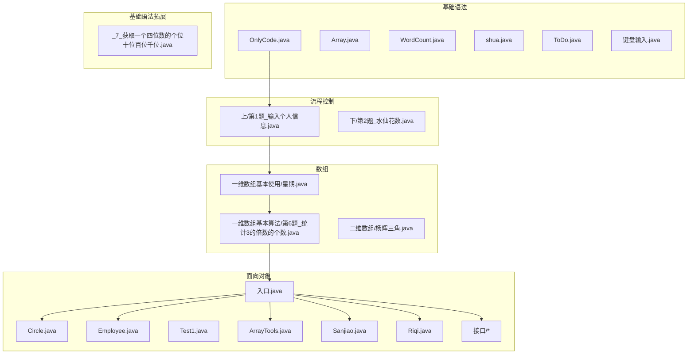
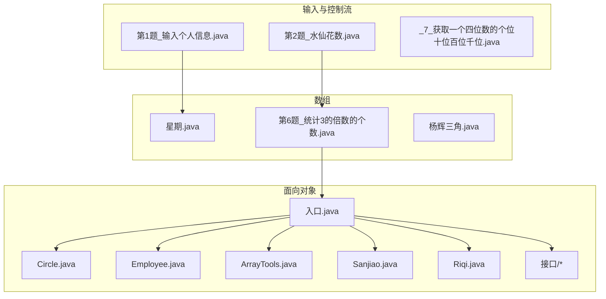
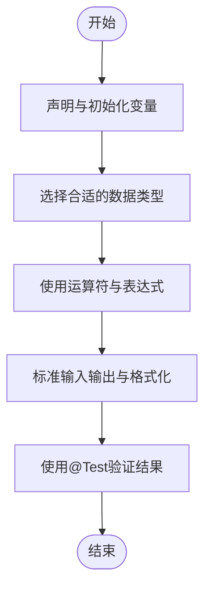
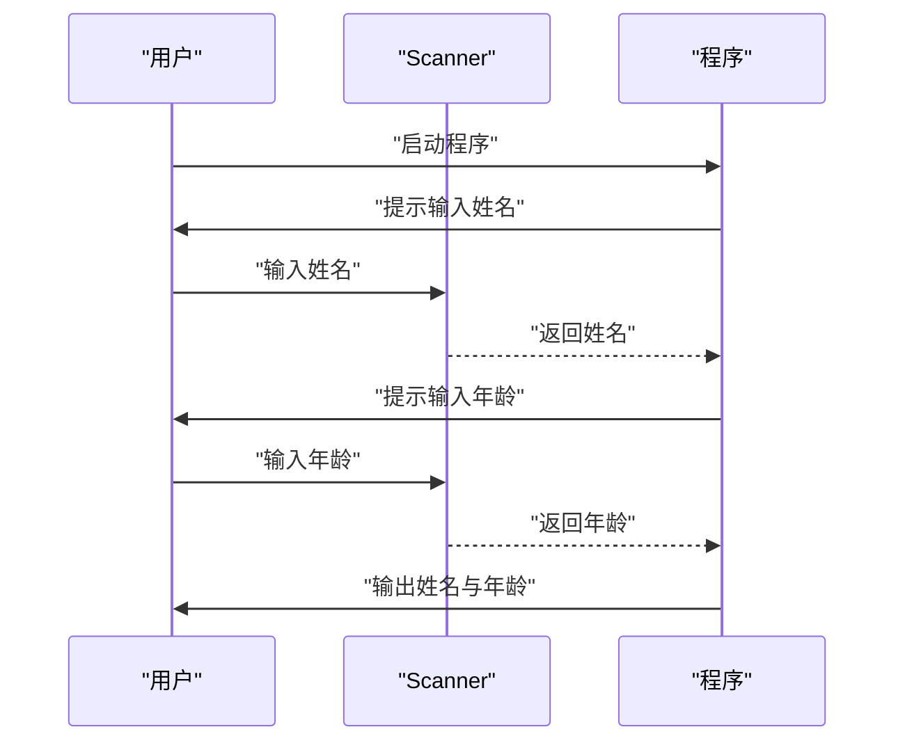
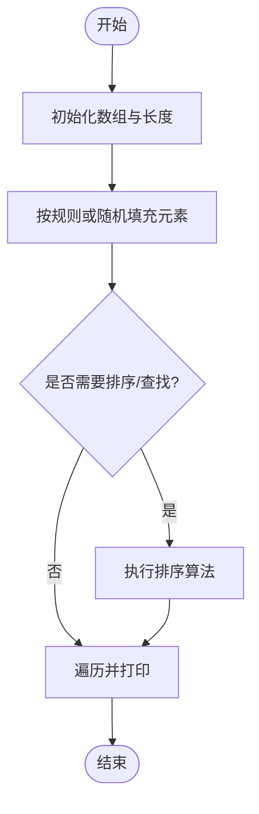
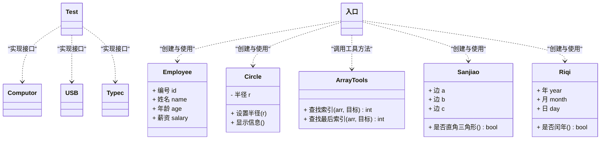
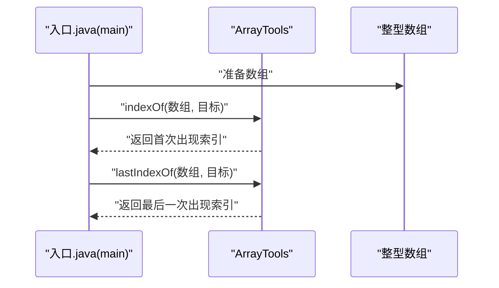
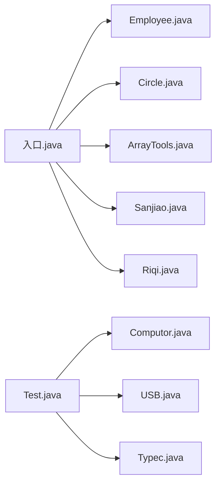

# Java基础学习

<cite>
**本文引用的文件**
- [OnlyCode.java](file://_01_javaEE/src/main/java/_01_基础语法/OnlyCode.java)
- [Array.java](file://_01_javaEE/src/main/java/_01_基础语法/Array.java)
- [第1题_输入个人信息.java](file://_01_javaEE/src/main/java/_03_流程控制/上/第1题_输入个人信息.java)
- [_7_获取一个四位数的个位十位百位千位.java](file://_01_javaEE/src/main/java/_02_基础语法拓展/_7_获取一个四位数的个位十位百位千位.java)
- [第2题_水仙花数.java](file://_01_javaEE/src/main/java/_03_流程控制/下/第2题_水仙花数.java)
- [星期.java](file://_01_javaEE/src/main/java/_04_数组/一维数组基本使用/星期.java)
- [第6题_统计3的倍数的个数.java](file://_01_javaEE/src/main/java/_04_数组/一维数组基本算法/第6题_统计3的倍数的个数.java)
- [杨辉三角.java](file://_01_javaEE/src/main/java/_04_数组/二维数组/杨辉三角.java)
- [Circle.java](file://_01_javaEE/src/main/java/_05_面向对象基础上/第一次练习/Circle.java)
- [Employee.java](file://_01_javaEE/src/main/java/_07_面向对象/Employee.java)
- [入口.java](file://_01_javaEE/src/main/java/_07_面向对象/入口.java)
- [Test1.java](file://_01_javaEE/src/main/java/_05_面向对象基础上/第一次练习/Test1.java)
- [WordCount.java](file://_01_javaEE/src/main/java/_01_基础语法/WordCount.java)
- [shua.java](file://_01_javaEE/src/main/java/_01_基础语法/shua.java)
- [ToDo.java](file://_01_javaEE/src/main/java/_01_基础语法/ToDo.java)
- [键盘输入.java](file://_01_javaEE/src/main/java/_01_基础语法/键盘输入.java)
- [ArrayTools.java](file://_01_javaEE/src/main/java/_07_面向对象/ArrayTools.java)
- [Sanjiao.java](file://_01_javaEE/src/main/java/_07_面向对象/Sanjiao.java)
- [Riqi.java](file://_01_javaEE/src/main/java/_07_面向对象/Riqi.java)
- [Computor.java](file://_01_javaEE/src/main/java/_07_面向对象/接口/Computor.java)
- [USB.java](file://_01_javaEE/src/main/java/_07_面向对象/接口/USB.java)
- [Typec.java](file://_01_javaEE/src/main/java/_07_面向对象/接口/Typec.java)
- [Test.java](file://_01_javaEE/src/main/java/_07_面向对象/接口/Test.java)
</cite>

## 目录
1. [引言](#引言)
2. [项目结构](#项目结构)
3. [核心组件](#核心组件)
4. [架构总览](#架构总览)
5. [详细组件分析](#详细组件分析)
6. [依赖分析](#依赖分析)
7. [性能考虑](#性能考虑)
8. [故障排查指南](#故障排查指南)
9. [结论](#结论)
10. [附录](#附录)

## 引言
本学习文档围绕Java基础语法到面向对象编程、数组与常用API、泛型等核心主题，结合仓库中的示例程序，构建一条由浅入深的学习路径。文档以“循序渐进”的方式组织内容，既适合零基础入门，也为后续大数据方向（如Hadoop、Spark、Flink）打下扎实的编程基础。

## 项目结构
该仓库以模块化的方式组织Java示例代码，主要学习路径集中在 _01_javaEE 模块中，涵盖：
- 基础语法与键盘输入
- 流程控制（分支与循环）
- 数组（一维与二维）
- 面向对象（类、对象、封装、继承、多态）
- 常用API与工具类
- 接口与抽象能力

下面给出一个概念化的项目结构图，帮助理解各模块之间的关系：

## 核心组件
本节聚焦Java基础学习的关键知识点与对应示例文件，帮助读者建立系统化的知识框架。

- 变量与数据类型
  - 示例：OnlyCode.java 展示了基本数据类型、字面量、类型转换与位运算等基础操作。
  - 练习：Array.java 提供单元测试入口，便于验证不同场景。
  - 参考路径：file://_01_javaEE/src/main/java/_01_基础语法/OnlyCode.java#L1-L116；file://_01_javaEE/src/main/java/_01_基础语法/Array.java#L1-L23

- 控制流语句
  - 分支与循环：第2题_水仙花数.java 展示了循环与条件判断的组合应用。
  - 键盘输入与交互：第1题_输入个人信息.java 使用Scanner进行输入处理。
  - 参考路径：file://_01_javaEE/src/main/java/_03_流程控制/下/第2题_水仙花数.java#L1-L27；file://_01_javaEE/src/main/java/_03_流程控制/上/第1题_输入个人信息.java#L1-L29

- 数组操作
  - 一维数组：星期.java 展示数组定义、输入校验与遍历访问。
  - 一维数组算法：第6题_统计3的倍数的个数.java 包含随机数生成、计数与冒泡排序。
  - 二维数组：杨辉三角.java 展示二维数组初始化与规律填充。
  - 参考路径：file://_01_javaEE/src/main/java/_04_数组/一维数组基本使用/星期.java#L1-L31；file://_01_javaEE/src/main/java/_04_数组/一维数组基本算法/第6题_统计3的倍数的个数.java#L1-L44；file://_01_javaEE/src/main/java/_04_数组/二维数组/杨辉三角.java#L1-L43

- 面向对象编程
  - 类与对象：Circle.java、Employee.java、入口.java、Test1.java 展示封装、构造与使用。
  - 工具类：ArrayTools.java 提供数组查找等辅助功能。
  - 几何与日期：Sanjiao.java、Riqi.java 展示业务类的设计与方法调用。
  - 接口：Computor.java、USB.java、Typec.java、Test.java 展示接口定义与实现。
  - 参考路径：file://_01_javaEE/src/main/java/_05_面向对象基础上/第一次练习/Circle.java#L1-L20；file://_01_javaEE/src/main/java/_07_面向对象/Employee.java#L1-L24；file://_01_javaEE/src/main/java/_07_面向对象/入口.java#L1-L119；file://_01_javaEE/src/main/java/_05_面向对象基础上/第一次练习/Test1.java#L1-L56；file://_01_javaEE/src/main/java/_07_面向对象/ArrayTools.java；file://_01_javaEE/src/main/java/_07_面向对象/Sanjiao.java；file://_01_javaEE/src/main/java/_07_面向对象/Riqi.java；file://_01_javaEE/src/main/java/_07_面向对象/接口/Computor.java；file://_01_javaEE/src/main/java/_07_面向对象/接口/USB.java；file://_01_javaEE/src/main/java/_07_面向对象/接口/Typec.java；file://_01_javaEE/src/main/java/_07_面向对象/接口/Test.java

- 常用API与工具
  - 字符串与格式化：WordCount.java、键盘输入.java 展示字符串处理与输入输出。
  - 参考路径：file://_01_javaEE/src/main/java/_01_基础语法/WordCount.java；file://_01_javaEE/src/main/java/_01_基础语法/键盘输入.java

**章节来源**
- file://_01_javaEE/src/main/java/_01_基础语法/OnlyCode.java#L1-L116
- file://_01_javaEE/src/main/java/_01_基础语法/Array.java#L1-L23
- file://_01_javaEE/src/main/java/_03_流程控制/下/第2题_水仙花数.java#L1-L27
- file://_01_javaEE/src/main/java/_03_流程控制/上/第1题_输入个人信息.java#L1-L29
- file://_01_javaEE/src/main/java/_04_数组/一维数组基本使用/星期.java#L1-L31
- file://_01_javaEE/src/main/java/_04_数组/一维数组基本算法/第6题_统计3的倍数的个数.java#L1-L44
- file://_01_javaEE/src/main/java/_04_数组/二维数组/杨辉三角.java#L1-L43
- file://_01_javaEE/src/main/java/_05_面向对象基础上/第一次练习/Circle.java#L1-L20
- file://_01_javaEE/src/main/java/_07_面向对象/Employee.java#L1-L24
- file://_01_javaEE/src/main/java/_07_面向对象/入口.java#L1-L119
- file://_01_javaEE/src/main/java/_05_面向对象基础上/第一次练习/Test1.java#L1-L56
- file://_01_javaEE/src/main/java/_01_基础语法/WordCount.java
- file://_01_javaEE/src/main/java/_01_基础语法/键盘输入.java

## 架构总览
下图展示了从“输入与控制流”到“数组与算法”，再到“面向对象建模”的学习路径与文件间的关联关系。

**图表来源**
- [第1题_输入个人信息.java](file://_01_javaEE/src/main/java/_03_流程控制/上/第1题_输入个人信息.java#L1-L29)
- [第2题_水仙花数.java](file://_01_javaEE/src/main/java/_03_流程控制/下/第2题_水仙花数.java#L1-L27)
- [_7_获取一个四位数的个位十位百位千位.java](file://_01_javaEE/src/main/java/_02_基础语法拓展/_7_获取一个四位数的个位十位百位千位.java#L1-L26)
- [星期.java](file://_01_javaEE/src/main/java/_04_数组/一维数组基本使用/星期.java#L1-L31)
- [第6题_统计3的倍数的个数.java](file://_01_javaEE/src/main/java/_04_数组/一维数组基本算法/第6题_统计3的倍数的个数.java#L1-L44)
- [杨辉三角.java](file://_01_javaEE/src/main/java/_04_数组/二维数组/杨辉三角.java#L1-L43)
- [Circle.java](file://_01_javaEE/src/main/java/_05_面向对象基础上/第一次练习/Circle.java#L1-L20)
- [Employee.java](file://_01_javaEE/src/main/java/_07_面向对象/Employee.java#L1-L24)
- [入口.java](file://_01_javaEE/src/main/java/_07_面向对象/入口.java#L1-L119)
- [ArrayTools.java](file://_01_javaEE/src/main/java/_07_面向对象/ArrayTools.java)
- [Sanjiao.java](file://_01_javaEE/src/main/java/_07_面向对象/Sanjiao.java)
- [Riqi.java](file://_01_javaEE/src/main/java/_07_面向对象/Riqi.java)
- [Computor.java](file://_01_javaEE/src/main/java/_07_面向对象/接口/Computor.java)
- [USB.java](file://_01_javaEE/src/main/java/_07_面向对象/接口/USB.java)
- [Typec.java](file://_01_javaEE/src/main/java/_07_面向对象/接口/Typec.java)
- [Test.java](file://_01_javaEE/src/main/java/_07_面向对象/接口/Test.java)

## 详细组件分析

### 基础语法与数据类型
- 主要概念
  - 基本数据类型、字面量、类型转换、位运算、三元运算符。
  - 输入输出与字符串处理。
- 关键示例
  - OnlyCode.java：演示基本类型、位移、取整、字符编码等。
  - WordCount.java、键盘输入.java：演示输入输出与字符串处理。
- 学习建议
  - 先理解八种基本类型与默认值，再掌握运算符优先级与强制类型转换。
  - 结合单元测试验证结果，逐步扩展到表达式与格式化输出。

**章节来源**
- file://_01_javaEE/src/main/java/_01_基础语法/OnlyCode.java#L1-L116
- file://_01_javaEE/src/main/java/_01_基础语法/WordCount.java
- file://_01_javaEE/src/main/java/_01_基础语法/键盘输入.java
- file://_01_javaEE/src/main/java/_01_基础语法/Array.java#L1-L23

### 流程控制与键盘输入
- 主要概念
  - 分支（if-else）、循环（for、while）、输入Scanner。
- 关键示例
  - 第1题_输入个人信息.java：从键盘读取姓名与年龄并输出。
  - 第2题_水仙花数.java：遍历三位数并判断是否满足水仙花数条件。
  - _7_获取一个四位数的个位十位百位千位.java：对整数按位拆分。
- 学习建议
  - 先用简单分支与循环完成数值计算任务，再引入输入输出。
  - 注重输入合法性校验与异常处理意识。

**章节来源**
- file://_01_javaEE/src/main/java/_03_流程控制/上/第1题_输入个人信息.java#L1-L29
- file://_01_javaEE/src/main/java/_03_流程控制/下/第2题_水仙花数.java#L1-L27
- file://_01_javaEE/src/main/java/_02_基础语法拓展/_7_获取一个四位数的个位十位百位千位.java#L1-L26

### 数组与算法
- 主要概念
  - 一维数组定义、初始化、访问与遍历；二维数组的初始化与规律填充。
  - 基础排序与查找思想（冒泡排序、线性查找）。
- 关键示例
  - 星期.java：数组存储英文星期名称，循环输入与边界校验。
  - 第6题_统计3的倍数的个数.java：随机数生成、计数与冒泡排序。
  - 杨辉三角.java：二维数组按规律填充并打印。
- 学习建议
  - 先掌握数组索引与越界防护，再引入排序与查找。
  - 通过可视化打印加深对二维数组结构的理解。

**章节来源**
- file://_01_javaEE/src/main/java/_04_数组/一维数组基本使用/星期.java#L1-L31
- file://_01_javaEE/src/main/java/_04_数组/一维数组基本算法/第6题_统计3的倍数的个数.java#L1-L44
- file://_01_javaEE/src/main/java/_04_数组/二维数组/杨辉三角.java#L1-L43

### 面向对象编程
- 主要概念
  - 封装：通过private字段与public方法控制访问。
  - 继承：子类复用父类成员，覆盖方法体现多态。
  - 多态：同一接口不同实现，运行时绑定。
  - 接口：定义行为契约，实现类提供具体实现。
- 关键示例
  - Circle.java：封装半径与面积、周长计算。
  - Employee.java：员工信息建模。
  - 入口.java：创建对象、赋值与方法调用。
  - ArrayTools.java：数组工具方法（查找索引等）。
  - Sanjiao.java、Riqi.java：业务类（三角形判定、闰年判断）。
  - 接口：Computor.java、USB.java、Typec.java、Test.java。
- 学习建议
  - 先从简单类与对象入手，逐步引入封装与方法设计。
  - 通过接口理解“对外暴露行为、对内隐藏实现”。

**图表来源**
- [Circle.java](file://_01_javaEE/src/main/java/_05_面向对象基础上/第一次练习/Circle.java#L1-L20)
- [Employee.java](file://_01_javaEE/src/main/java/_07_面向对象/Employee.java#L1-L24)
- [入口.java](file://_01_javaEE/src/main/java/_07_面向对象/入口.java#L1-L119)
- [ArrayTools.java](file://_01_javaEE/src/main/java/_07_面向对象/ArrayTools.java)
- [Sanjiao.java](file://_01_javaEE/src/main/java/_07_面向对象/Sanjiao.java)
- [Riqi.java](file://_01_javaEE/src/main/java/_07_面向对象/Riqi.java)
- [Computor.java](file://_01_javaEE/src/main/java/_07_面向对象/接口/Computor.java)
- [USB.java](file://_01_javaEE/src/main/java/_07_面向对象/接口/USB.java)
- [Typec.java](file://_01_javaEE/src/main/java/_07_面向对象/接口/Typec.java)
- [Test.java](file://_01_javaEE/src/main/java/_07_面向对象/接口/Test.java)

**章节来源**
- file://_01_javaEE/src/main/java/_05_面向对象基础上/第一次练习/Circle.java#L1-L20
- file://_01_javaEE/src/main/java/_07_面向对象/Employee.java#L1-L24
- file://_01_javaEE/src/main/java/_07_面向对象/入口.java#L1-L119
- file://_01_javaEE/src/main/java/_07_面向对象/ArrayTools.java
- file://_01_javaEE/src/main/java/_07_面向对象/Sanjiao.java
- file://_01_javaEE/src/main/java/_07_面向对象/Riqi.java
- file://_01_javaEE/src/main/java/_07_面向对象/接口/Computor.java
- file://_01_javaEE/src/main/java/_07_面向对象/接口/USB.java
- file://_01_javaEE/src/main/java/_07_面向对象/接口/Typec.java
- file://_01_javaEE/src/main/java/_07_面向对象/接口/Test.java

### 常用API与工具类
- 主要概念
  - Scanner输入、字符串处理、数组工具方法。
- 关键示例
  - 入口.java 中调用 ArrayTools 的 indexOf/lastIndexOf 方法。
  - WordCount.java、键盘输入.java 展示字符串与IO处理。
- 学习建议
  - 先掌握Scanner的基本用法，再扩展到复杂输入与格式化输出。
  - 通过工具类提升代码复用性与可维护性。

**图表来源**
- [入口.java](file://_01_javaEE/src/main/java/_07_面向对象/入口.java#L1-L119)
- [ArrayTools.java](file://_01_javaEE/src/main/java/_07_面向对象/ArrayTools.java)

**章节来源**
- file://_01_javaEE/src/main/java/_07_面向对象/入口.java#L1-L119
- file://_01_javaEE/src/main/java/_07_面向对象/ArrayTools.java
- file://_01_javaEE/src/main/java/_01_基础语法/WordCount.java
- file://_01_javaEE/src/main/java/_01_基础语法/键盘输入.java

## 依赖分析
- 文件间耦合关系
  - 入口.java 依赖 Employee、Circle、ArrayTools、Sanjiao、Riqi 等类，形成“测试驱动”的调用关系。
  - 数组示例（星期.java、第6题_统计3的倍数的个数.java、杨辉三角.java）彼此独立，但共同服务于数组与循环训练。
  - 接口文件（Computor.java、USB.java、Typec.java、Test.java）定义统一行为，Test.java 实现多个接口，体现多态与接口分离。
- 设计模式与职责
  - 工具类（ArrayTools.java）承担通用算法逻辑，降低主流程复杂度。
  - 业务类（Sanjiao.java、Riqi.java）封装领域知识，便于复用与测试。

**图表来源**
- [入口.java](file://_01_javaEE/src/main/java/_07_面向对象/入口.java#L1-L119)
- [Employee.java](file://_01_javaEE/src/main/java/_07_面向对象/Employee.java#L1-L24)
- [Circle.java](file://_01_javaEE/src/main/java/_05_面向对象基础上/第一次练习/Circle.java#L1-L20)
- [ArrayTools.java](file://_01_javaEE/src/main/java/_07_面向对象/ArrayTools.java)
- [Sanjiao.java](file://_01_javaEE/src/main/java/_07_面向对象/Sanjiao.java)
- [Riqi.java](file://_01_javaEE/src/main/java/_07_面向对象/Riqi.java)
- [Test.java](file://_01_javaEE/src/main/java/_07_面向对象/接口/Test.java)
- [Computor.java](file://_01_javaEE/src/main/java/_07_面向对象/接口/Computor.java)
- [USB.java](file://_01_javaEE/src/main/java/_07_面向对象/接口/USB.java)
- [Typec.java](file://_01_javaEE/src/main/java/_07_面向对象/接口/Typec.java)

**章节来源**
- file://_01_javaEE/src/main/java/_07_面向对象/入口.java#L1-L119
- file://_01_javaEE/src/main/java/_07_面向对象/Employee.java#L1-L24
- file://_01_javaEE/src/main/java/_05_面向对象基础上/第一次练习/Circle.java#L1-L20
- file://_01_javaEE/src/main/java/_07_面向对象/ArrayTools.java
- file://_01_javaEE/src/main/java/_07_面向对象/Sanjiao.java
- file://_01_javaEE/src/main/java/_07_面向对象/Riqi.java
- file://_01_javaEE/src/main/java/_07_面向对象/接口/Test.java
- file://_01_javaEE/src/main/java/_07_面向对象/接口/Computor.java
- file://_01_javaEE/src/main/java/_07_面向对象/接口/USB.java
- file://_01_javaEE/src/main/java/_07_面向对象/接口/Typec.java

## 性能考虑
- 时间复杂度
  - 冒泡排序：平均与最坏情况为 O(n^2)，适合小规模数据教学。
  - 线性查找：O(n)，适用于无序数组。
- 空间复杂度
  - 数组存储为 O(n)，二维数组为 O(n^2)。
- 优化建议
  - 在大规模数据场景，优先采用更高效的排序与查找算法（如快速排序、二分查找）。
  - 使用工具类与方法抽取，减少重复计算与内存分配。

## 故障排查指南
- 常见问题
  - 数组越界：检查索引范围与数组长度，确保输入合法。
  - 类型不匹配：注意基本类型与包装类型的差异，避免隐式转换导致精度丢失。
  - 输入阻塞：Scanner未正确消费换行符或空格，导致读取异常。
- 定位方法
  - 使用单元测试（@Test）验证关键分支与边界条件。
  - 通过打印中间变量与阶段性结果定位错误位置。
- 参考示例
  - OnlyCode.java 的 @Test 方法用于验证表达式与取整逻辑。
  - 第1题_输入个人信息.java 展示正确的输入顺序与换行处理。

**章节来源**
- file://_01_javaEE/src/main/java/_01_基础语法/OnlyCode.java#L1-L116
- file://_01_javaEE/src/main/java/_03_流程控制/上/第1题_输入个人信息.java#L1-L29

## 结论
本学习文档基于仓库中的实际示例，系统梳理了Java基础语法、流程控制、数组与面向对象等核心主题。通过“示例—原理—练习”的闭环，读者可以逐步掌握从变量与数据类型到类与接口的编程思维，并为后续大数据技术栈学习奠定坚实基础。

## 附录
- 练习题目索引
  - 基础语法：OnlyCode.java、Array.java、WordCount.java、键盘输入.java
  - 流程控制：第1题_输入个人信息.java、第2题_水仙花数.java、_7_获取一个四位数的个位十位百位千位.java
  - 数组：星期.java、第6题_统计3的倍数的个数.java、杨辉三角.java
  - 面向对象：Circle.java、Employee.java、入口.java、ArrayTools.java、Sanjiao.java、Riqi.java、接口/*、Test1.java
- 学习建议
  - 每个示例完成后，尝试修改参数或添加新功能，加深理解。
  - 将相似任务抽象为工具方法，培养工程化思维。