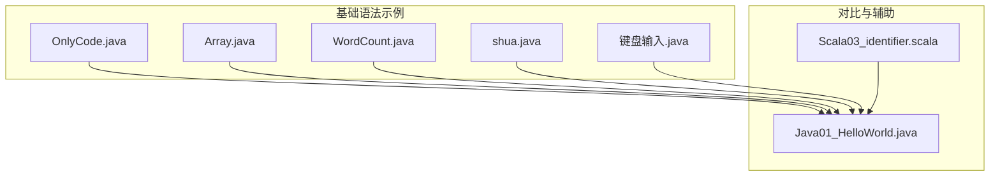
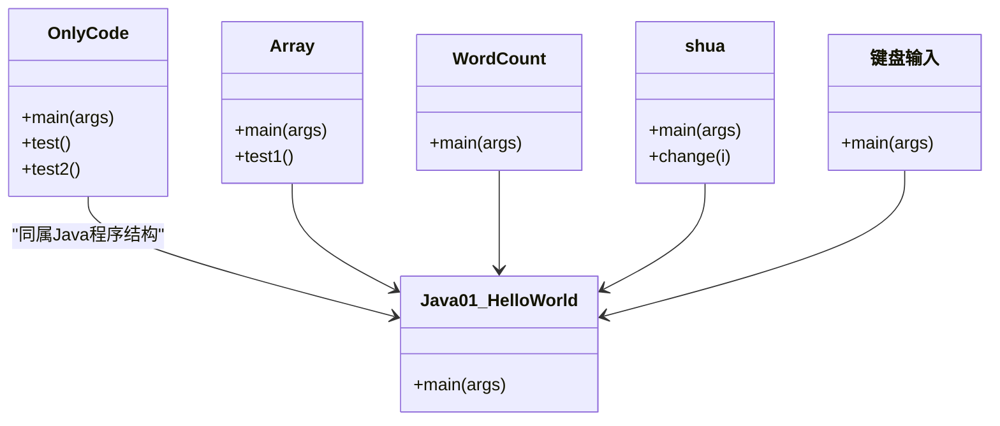
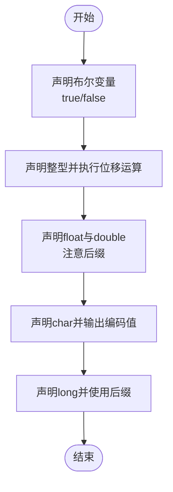
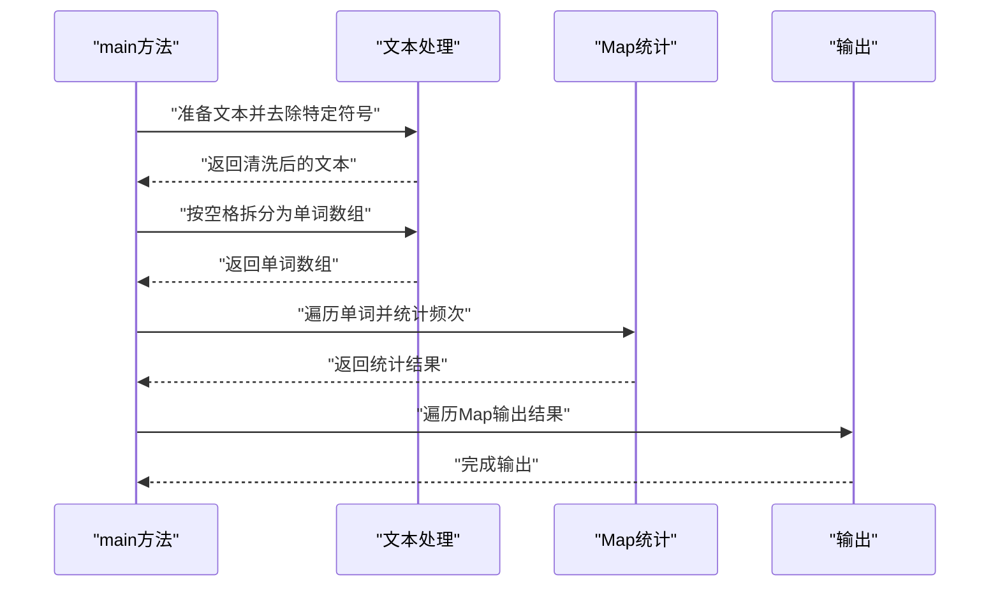
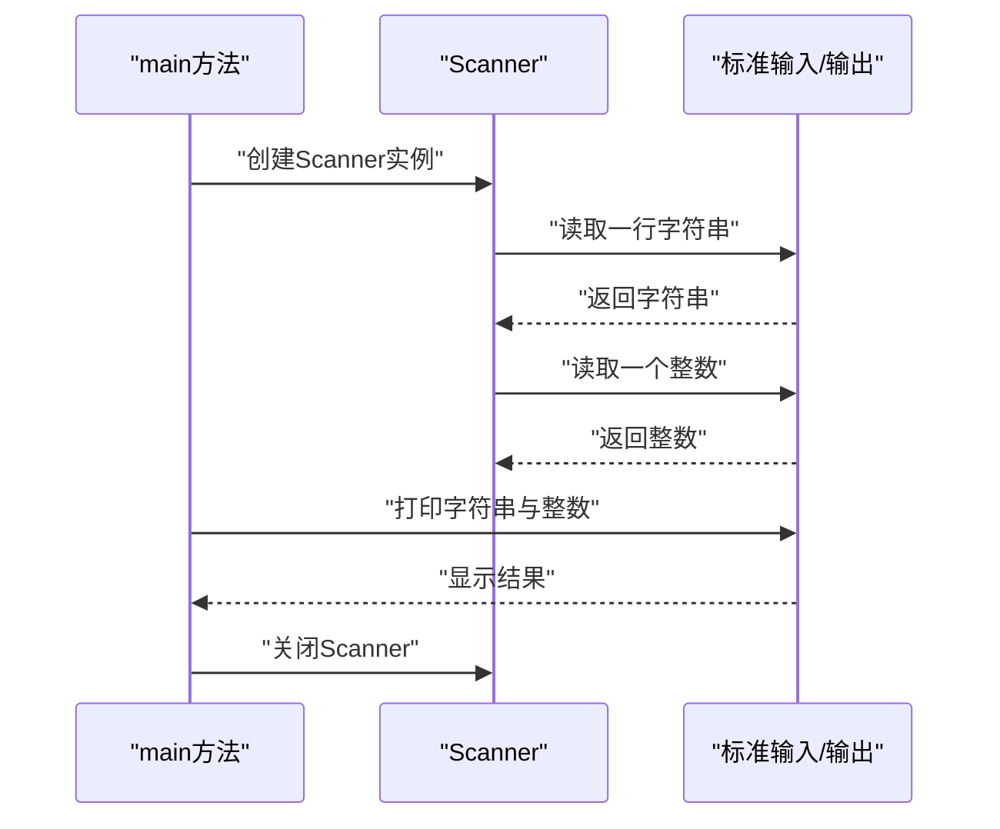
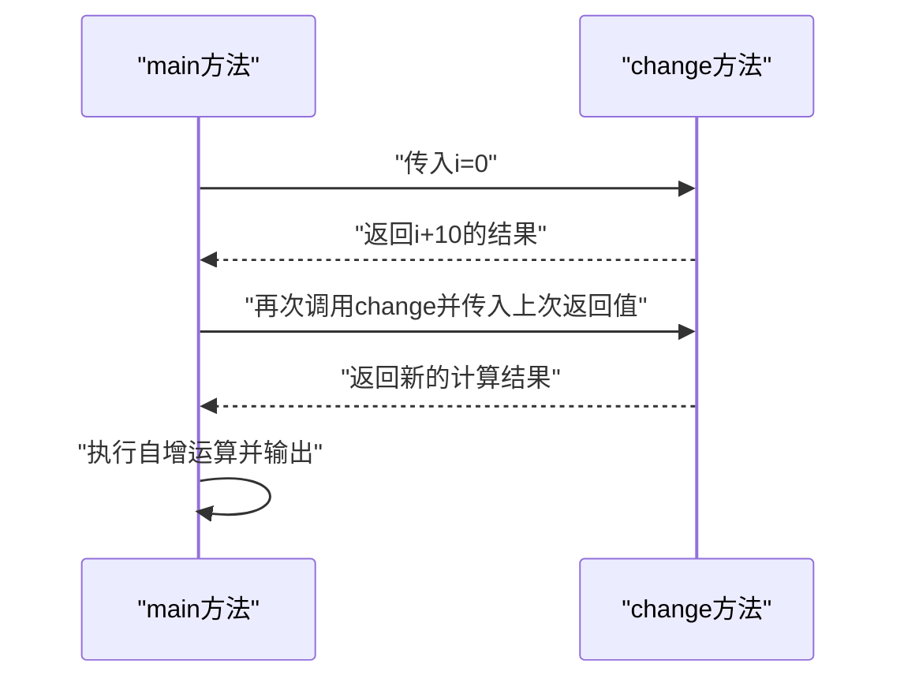
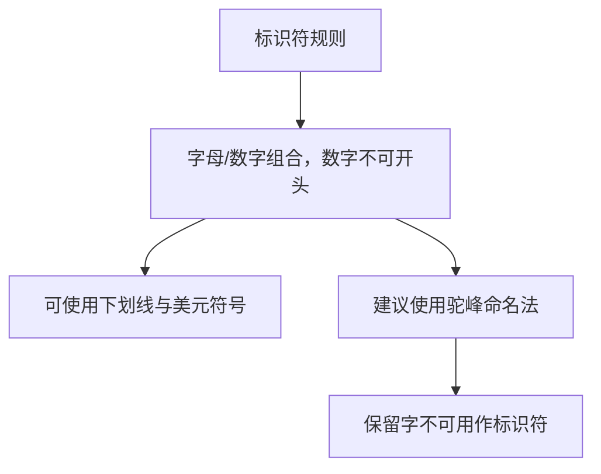
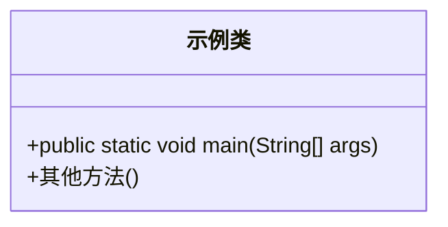
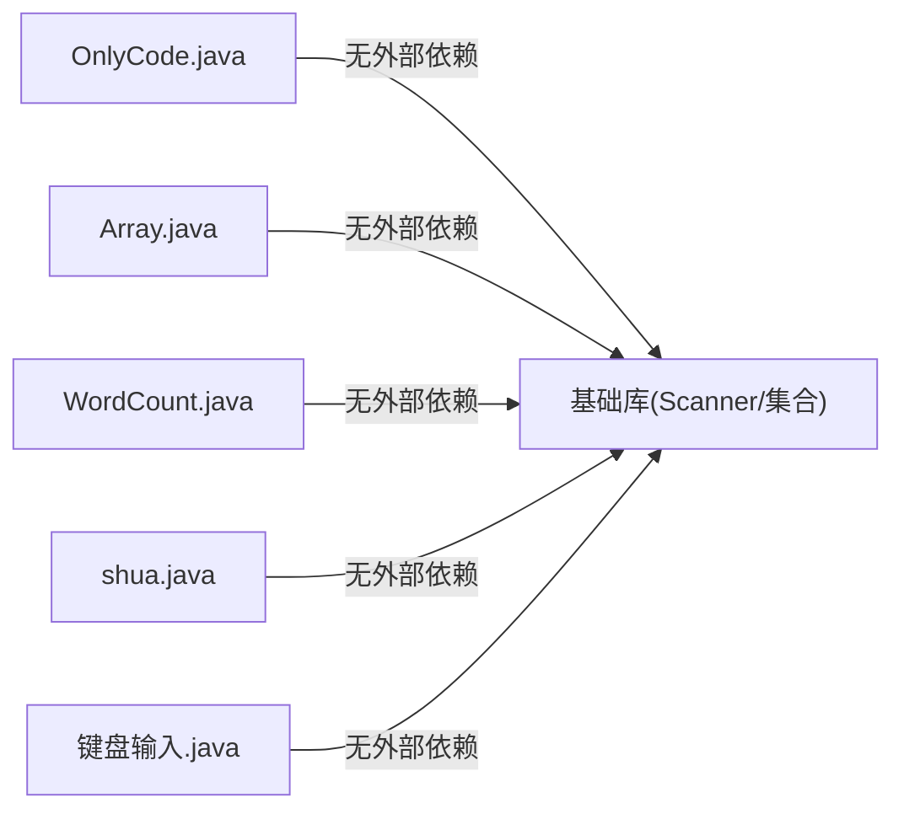

# 基础语法

<cite>
**本文引用的文件**
- [OnlyCode.java](file://_01_javaEE/src/main/java/_01_基础语法/OnlyCode.java)
- [Array.java](file://_01_javaEE/src/main/java/_01_基础语法/Array.java)
- [WordCount.java](file://_01_javaEE/src/main/java/_01_基础语法/WordCount.java)
- [shua.java](file://_01_javaEE/src/main/java/_01_基础语法/shua.java)
- [键盘输入.java](file://_01_javaEE/src/main/java/_01_基础语法/键盘输入.java)
- [Java01_HelloWorld.java](file://_04_scalaTest/src/main/java/com/atguigu/java/chapter01/Java01_HelloWorld.java)
- [Scala03_identifier.scala](file://_04_scalaTest/src/main/scala/com/atguigu/scala/chapter02/Scala03_identifier.scala)
</cite>

## 目录
1. [引言](#引言)
2. [项目结构](#项目结构)
3. [核心组件](#核心组件)
4. [架构总览](#架构总览)
5. [详细组件分析](#详细组件分析)
6. [依赖分析](#依赖分析)
7. [性能考虑](#性能考虑)
8. [故障排查指南](#故障排查指南)
9. [结论](#结论)
10. [附录：练习与参考](#附录练习与参考)

## 引言
本学习文档围绕Java基础语法展开，聚焦以下主题：
- 变量声明与使用：基本数据类型、引用数据类型、类型转换与运算
- 标识符命名规则与关键字使用
- Java程序基本结构：类定义、主方法、注释规范
- 输入输出与常见语法错误及调试方法
- 结合仓库中的示例文件，提供可直接对照学习的路径与思路

## 项目结构
本次文档涉及的基础语法示例主要位于“_01_javaEE”模块下的“_01_基础语法”包中，同时补充了部分来自其他模块的对比与辅助材料。

图示来源
- [OnlyCode.java](file://_01_javaEE/src/main/java/_01_基础语法/OnlyCode.java#L1-L116)
- [Array.java](file://_01_javaEE/src/main/java/_01_基础语法/Array.java#L1-L23)
- [WordCount.java](file://_01_javaEE/src/main/java/_01_基础语法/WordCount.java#L1-L33)
- [shua.java](file://_01_javaEE/src/main/java/_01_基础语法/shua.java#L1-L22)
- [键盘输入.java](file://_01_javaEE/src/main/java/_01_基础语法/键盘输入.java#L1-L27)
- [Java01_HelloWorld.java](file://_04_scalaTest/src/main/java/com/atguigu/java/chapter01/Java01_HelloWorld.java#L1-L8)
- [Scala03_identifier.scala](file://_04_scalaTest/src/main/scala/com/atguigu/scala/chapter02/Scala03_identifier.scala#L1-L56)

章节来源
- [OnlyCode.java](file://_01_javaEE/src/main/java/_01_基础语法/OnlyCode.java#L1-L116)
- [Array.java](file://_01_javaEE/src/main/java/_01_基础语法/Array.java#L1-L23)
- [WordCount.java](file://_01_javaEE/src/main/java/_01_基础语法/WordCount.java#L1-L33)
- [shua.java](file://_01_javaEE/src/main/java/_01_基础语法/shua.java#L1-L22)
- [键盘输入.java](file://_01_javaEE/src/main/java/_01_基础语法/键盘输入.java#L1-L27)
- [Java01_HelloWorld.java](file://_04_scalaTest/src/main/java/com/atguigu/java/chapter01/Java01_HelloWorld.java#L1-L8)
- [Scala03_identifier.scala](file://_04_scalaTest/src/main/scala/com/atguigu/scala/chapter02/Scala03_identifier.scala#L1-L56)

## 核心组件
- 变量与数据类型演示：在示例中展示了布尔、字符、整型、浮点型、长整型等基本数据类型的声明与使用，并演示了位移运算与强制类型转换。
- 输入输出与键盘输入：通过Scanner实现标准输入读取与输出。
- 简单统计与集合使用：使用Map进行字符串计数，体现引用类型的使用。
- 主方法与类结构：所有示例均采用标准Java类与main方法结构，便于初学者理解程序入口与组织方式。
- 标识符与命名：通过对比不同语言的标识符特性，帮助理解Java标识符的合法字符与命名约定。

章节来源
- [OnlyCode.java](file://_01_javaEE/src/main/java/_01_基础语法/OnlyCode.java#L12-L82)
- [OnlyCode.java](file://_01_javaEE/src/main/java/_01_基础语法/OnlyCode.java#L48-L76)
- [键盘输入.java](file://_01_javaEE/src/main/java/_01_基础语法/键盘输入.java#L14-L24)
- [WordCount.java](file://_01_javaEE/src/main/java/_01_基础语法/WordCount.java#L6-L31)
- [Java01_HelloWorld.java](file://_04_scalaTest/src/main/java/com/atguigu/java/chapter01/Java01_HelloWorld.java#L3-L6)
- [Scala03_identifier.scala](file://_04_scalaTest/src/main/scala/com/atguigu/scala/chapter02/Scala03_identifier.scala#L9-L18)

## 架构总览
从整体上看，这些示例文件共同构成了一个“入门级语法实验室”，每个文件代表一个独立的功能片段，便于逐步学习与验证。它们共享相同的程序结构模式：类定义、主方法、必要的导入与注释。

图示来源
- [OnlyCode.java](file://_01_javaEE/src/main/java/_01_基础语法/OnlyCode.java#L11-L116)
- [Array.java](file://_01_javaEE/src/main/java/_01_基础语法/Array.java#L11-L22)
- [WordCount.java](file://_01_javaEE/src/main/java/_01_基础语法/WordCount.java#L6-L31)
- [shua.java](file://_01_javaEE/src/main/java/_01_基础语法/shua.java#L9-L21)
- [键盘输入.java](file://_01_javaEE/src/main/java/_01_基础语法/键盘输入.java#L13-L26)
- [Java01_HelloWorld.java](file://_04_scalaTest/src/main/java/com/atguigu/java/chapter01/Java01_HelloWorld.java#L3-L6)

## 详细组件分析

### 变量声明与基本数据类型
- 布尔类型与包装类型：演示了boolean与Boolean的使用差异，以及大小写形式的常量。
- 整型与位移运算：展示了整型变量与左移运算的使用。
- 浮点型与精度后缀：演示了float与double的声明与后缀写法。
- 字符类型与编码：演示了char存储中文字符与强制类型转换为int查看编码值。
- 长整型与后缀：演示了long类型的声明与大小写后缀写法。

图示来源
- [OnlyCode.java](file://_01_javaEE/src/main/java/_01_基础语法/OnlyCode.java#L19-L76)

章节来源
- [OnlyCode.java](file://_01_javaEE/src/main/java/_01_基础语法/OnlyCode.java#L19-L76)

### 引用数据类型与简单统计
- 使用HashMap进行字符串计数，体现引用类型的创建与使用。
- 遍历Map输出键值对，展示集合的典型操作。

图示来源
- [WordCount.java](file://_01_javaEE/src/main/java/_01_基础语法/WordCount.java#L6-L31)

章节来源
- [WordCount.java](file://_01_javaEE/src/main/java/_01_基础语法/WordCount.java#L6-L31)

### 输入输出与键盘输入
- 使用Scanner读取一行字符串与一个整数，并在结束后关闭资源。
- 展示标准输入输出的基本流程与注意事项。

图示来源
- [键盘输入.java](file://_01_javaEE/src/main/java/_01_基础语法/键盘输入.java#L14-L24)

章节来源
- [键盘输入.java](file://_01_javaEE/src/main/java/_01_基础语法/键盘输入.java#L14-L24)

### 方法调用与参数传递
- 通过一个简单的change方法演示形参与实参的关系，以及返回值的使用。
- 展示自增运算符在赋值中的行为。

图示来源
- [shua.java](file://_01_javaEE/src/main/java/_01_基础语法/shua.java#L10-L21)

章节来源
- [shua.java](file://_01_javaEE/src/main/java/_01_基础语法/shua.java#L10-L21)

### 标识符命名规则与关键字使用
- 对比Java与Scala的标识符特性，强调Java标识符的合法字符与命名约定。
- 提醒数字不能作为标识符开头，建议遵循驼峰命名法。

图示来源
- [Scala03_identifier.scala](file://_04_scalaTest/src/main/scala/com/atguigu/scala/chapter02/Scala03_identifier.scala#L9-L18)

章节来源
- [Scala03_identifier.scala](file://_04_scalaTest/src/main/scala/com/atguigu/scala/chapter02/Scala03_identifier.scala#L9-L18)

### Java程序基本结构
- 类定义与主方法：所有示例均采用标准Java类与main方法结构。
- 注释规范：单行注释、块注释与文档注释的使用。

图示来源
- [Java01_HelloWorld.java](file://_04_scalaTest/src/main/java/com/atguigu/java/chapter01/Java01_HelloWorld.java#L3-L6)

章节来源
- [Java01_HelloWorld.java](file://_04_scalaTest/src/main/java/com/atguigu/java/chapter01/Java01_HelloWorld.java#L3-L6)

## 依赖分析
- 文件间无直接依赖关系，均为独立示例文件，便于单独学习与运行。
- 所有示例共享相同的Java程序结构与基本库（如Scanner、集合框架），不引入额外外部依赖。

图示来源
- [OnlyCode.java](file://_01_javaEE/src/main/java/_01_基础语法/OnlyCode.java#L1-L116)
- [Array.java](file://_01_javaEE/src/main/java/_01_基础语法/Array.java#L1-L23)
- [WordCount.java](file://_01_javaEE/src/main/java/_01_基础语法/WordCount.java#L1-L33)
- [shua.java](file://_01_javaEE/src/main/java/_01_基础语法/shua.java#L1-L22)
- [键盘输入.java](file://_01_javaEE/src/main/java/_01_基础语法/键盘输入.java#L1-L27)

## 性能考虑
- 基础语法示例以教学为主，性能开销极低；在实际开发中应注意：
  - 避免在循环内频繁创建大对象（如Scanner未及时关闭可能造成资源占用）
  - 使用StringBuilder进行大量字符串拼接
  - 合理选择数据类型，避免不必要的装箱/拆箱

## 故障排查指南
- 常见语法错误与调试要点
  - 类名与文件名不一致：确保类名与文件名一致且首字母大写
  - 缺少主方法：Java程序必须包含public static void main(String[] args)
  - 标识符非法：遵守Java标识符规则，数字不能开头
  - 类型不匹配：注意基本类型与引用类型的差异，必要时进行显式类型转换
  - 资源未关闭：使用Scanner后应调用close()释放资源
  - 注释与输出：单行注释使用//，块注释使用/*...*/，文档注释用于API说明

章节来源
- [OnlyCode.java](file://_01_javaEE/src/main/java/_01_基础语法/OnlyCode.java#L12-L82)
- [键盘输入.java](file://_01_javaEE/src/main/java/_01_基础语法/键盘输入.java#L14-L24)
- [Scala03_identifier.scala](file://_04_scalaTest/src/main/scala/com/atguigu/scala/chapter02/Scala03_identifier.scala#L9-L18)

## 结论
通过对仓库中基础语法示例的系统梳理，初学者可以快速掌握Java变量与数据类型、输入输出、引用类型使用、标识符命名与程序结构等核心概念。建议按照示例文件逐一实践，并结合练习题巩固理解。

## 附录：练习与参考
- 练习建议
  - 修改OnlyCode.java中的变量值，观察输出变化
  - 在WordCount.java中加入更多标点符号处理逻辑
  - 在键盘输入.java中尝试读取更多类型的输入并进行格式化输出
  - 尝试在shua.java中增加更多方法调用与参数传递场景
- 参考路径
  - 变量与数据类型：[OnlyCode.java](file://_01_javaEE/src/main/java/_01_基础语法/OnlyCode.java#L19-L76)
  - 输入输出与键盘输入：[键盘输入.java](file://_01_javaEE/src/main/java/_01_基础语法/键盘输入.java#L14-L24)
  - 引用类型与统计：[WordCount.java](file://_01_javaEE/src/main/java/_01_基础语法/WordCount.java#L6-L31)
  - 方法调用与参数传递：[shua.java](file://_01_javaEE/src/main/java/_01_基础语法/shua.java#L10-L21)
  - 标识符命名规则：[Scala03_identifier.scala](file://_04_scalaTest/src/main/scala/com/atguigu/scala/chapter02/Scala03_identifier.scala#L9-L18)
  - 程序基本结构：[Java01_HelloWorld.java](file://_04_scalaTest/src/main/java/com/atguigu/java/chapter01/Java01_HelloWorld.java#L3-L6)