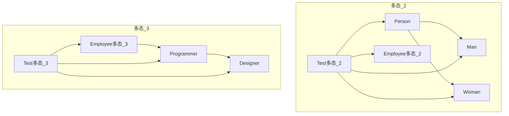
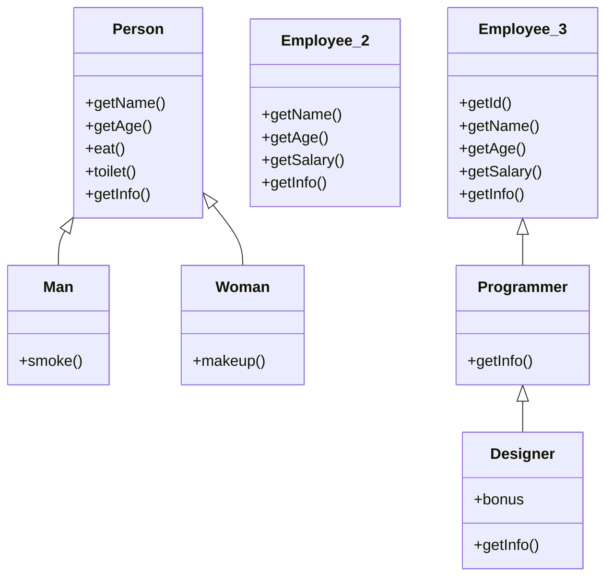
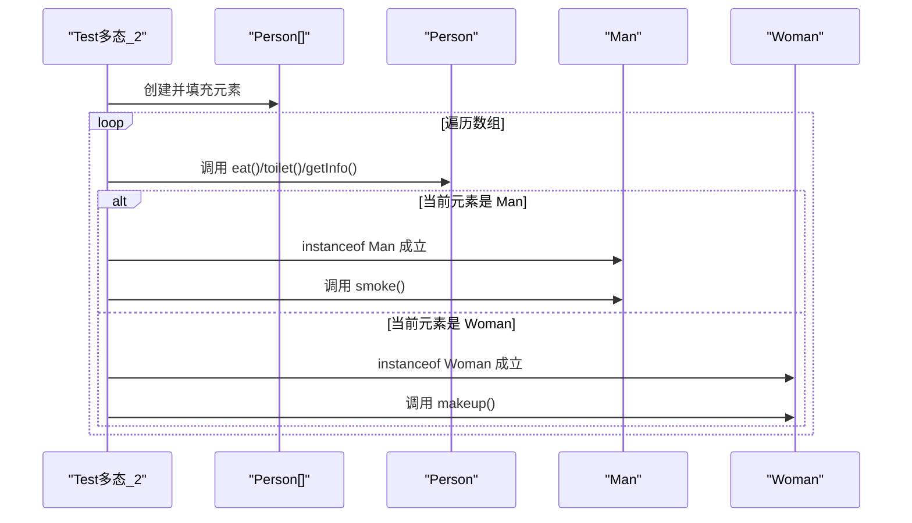
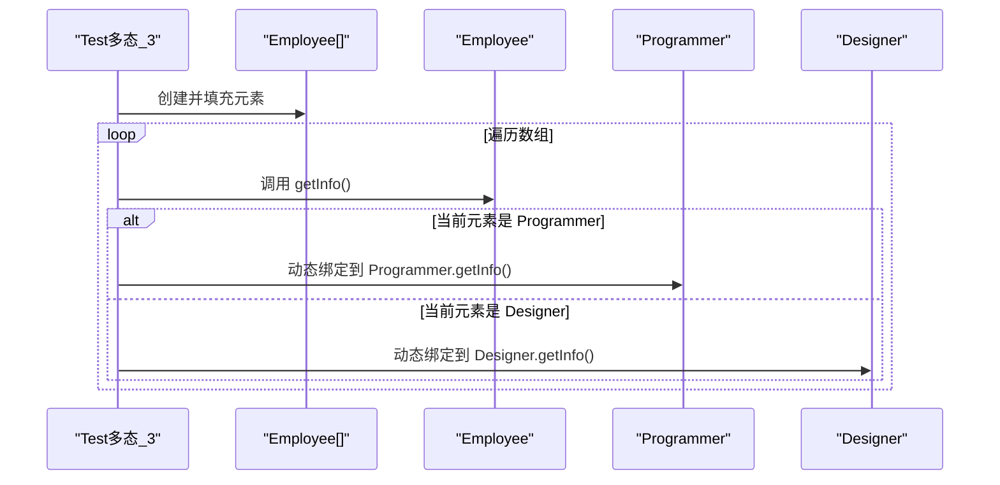
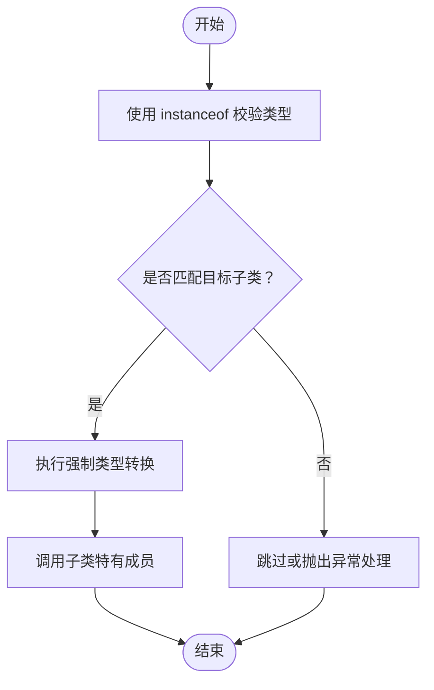
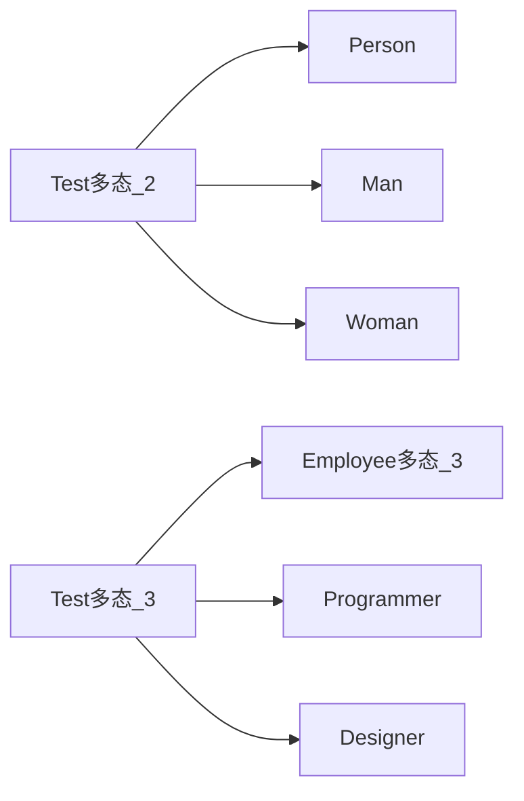

# 多态

<cite>
**本文引用的文件**
- [Person.java](file://_01_javaEE/src/main/java/_09_多态/_2/Person.java)
- [Man.java](file://_01_javaEE/src/main/java/_09_多态/_2/Man.java)
- [Woman.java](file://_01_javaEE/src/main/java/_09_多态/_2/Woman.java)
- [Test_2.java](file://_01_javaEE/src/main/java/_09_多态/_2/Test.java)
- [Employee.java（多态_2）](file://_01_javaEE/src/main/java/_09_多态/_2/Employee.java)
- [Programmer.java](file://_01_javaEE/src/main/java/_09_多态/_3/Programmer.java)
- [Designer.java](file://_01_javaEE/src/main/java/_09_多态/_3/Designer.java)
- [Employee.java（多态_3）](file://_01_javaEE/src/main/java/_09_多态/_3/Employee.java)
- [Test_3.java](file://_01_javaEE/src/main/java/_09_多态/_3/Test.java)
</cite>

## 目录
1. [引言](#引言)
2. [项目结构](#项目结构)
3. [核心组件](#核心组件)
4. [架构总览](#架构总览)
5. [详细组件分析](#详细组件分析)
6. [依赖分析](#依赖分析)
7. [性能考虑](#性能考虑)
8. [故障排查指南](#故障排查指南)
9. [结论](#结论)
10. [附录](#附录)

## 引言
本章节围绕Java多态展开，系统讲解编译时多态（方法重载）与运行时多态（方法重写）的区别，并结合仓库中的Person、Employee、Designer等类层次结构，演示多态在实际开发中的应用。重点覆盖：
- 方法重写与动态绑定的工作机制
- 向上转型与向下转型的原理、安全转换与instanceof校验
- 多态在面向对象设计中的价值：提升可扩展性与可维护性
- 在工厂模式、策略模式等场景中如何利用多态解耦

## 项目结构
本次文档聚焦于“多态”主题下的两个示例包：
- 多态_2：以Person为基类，Man/Woman继承Person并重写行为；同时对比另一个Employee类族，展示多态在数组中的统一处理。
- 多态_3：以Employee为基类，Programmer继承Employee，Designer继承Programmer，形成更深层级的继承链，体现运行时多态在复杂层次中的表现。

图表来源
- [Person.java](file://_01_javaEE/src/main/java/_09_多态/_2/Person.java#L1-L60)
- [Man.java](file://_01_javaEE/src/main/java/_09_多态/_2/Man.java#L1-L20)
- [Woman.java](file://_01_javaEE/src/main/java/_09_多态/_2/Woman.java#L1-L19)
- [Employee.java（多态_2）](file://_01_javaEE/src/main/java/_09_多态/_2/Employee.java#L1-L56)
- [Test_2.java](file://_01_javaEE/src/main/java/_09_多态/_2/Test.java#L1-L61)
- [Employee.java（多态_3）](file://_01_javaEE/src/main/java/_09_多态/_3/Employee.java#L1-L55)
- [Programmer.java](file://_01_javaEE/src/main/java/_09_多态/_3/Programmer.java#L1-L19)
- [Designer.java](file://_01_javaEE/src/main/java/_09_多态/_3/Designer.java#L1-L19)
- [Test_3.java](file://_01_javaEE/src/main/java/_09_多态/_3/Test.java#L1-L26)

章节来源
- [Person.java](file://_01_javaEE/src/main/java/_09_多态/_2/Person.java#L1-L60)
- [Employee.java（多态_2）](file://_01_javaEE/src/main/java/_09_多态/_2/Employee.java#L1-L56)
- [Test_2.java](file://_01_javaEE/src/main/java/_09_多态/_2/Test.java#L1-L61)
- [Employee.java（多态_3）](file://_01_javaEE/src/main/java/_09_多态/_3/Employee.java#L1-L55)
- [Programmer.java](file://_01_javaEE/src/main/java/_09_多态/_3/Programmer.java#L1-L19)
- [Designer.java](file://_01_javaEE/src/main/java/_09_多态/_3/Designer.java#L1-L19)
- [Test_3.java](file://_01_javaEE/src/main/java/_09_多态/_3/Test.java#L1-L26)

## 核心组件
- 基类与派生类
  - 多态_2：Person作为抽象的人类模型，Man与Woman分别重写其行为；同时存在另一个Employee类族用于对比说明多态在数组中的统一处理。
  - 多态_3：Employee为通用员工模型，Programmer与Designer分别在职责与信息输出上进行重写，体现层级化扩展。
- 关键方法
  - 重写方法：如Person.eat、Person.toilet、Employee.getInfo、Programmer.getInfo、Designer.getInfo等，均通过@Override标注并在运行时根据实际对象类型解析。
  - 特有方法：Man.smoke、Woman.makeup、Designer.bonus等，需要通过向下转型与instanceof校验后方可调用。
- 数组与统一处理
  - 多态_2：Person[]数组中存放Man/Woman实例，统一通过父类引用调用重写方法。
  - 多态_3：Employee[]数组中存放Employee/Programmer/Designer实例，统一输出信息，体现运行时多态。

章节来源
- [Person.java](file://_01_javaEE/src/main/java/_09_多态/_2/Person.java#L1-L60)
- [Man.java](file://_01_javaEE/src/main/java/_09_多态/_2/Man.java#L1-L20)
- [Woman.java](file://_01_javaEE/src/main/java/_09_多态/_2/Woman.java#L1-L19)
- [Employee.java（多态_2）](file://_01_javaEE/src/main/java/_09_多态/_2/Employee.java#L1-L56)
- [Programmer.java](file://_01_javaEE/src/main/java/_09_多态/_3/Programmer.java#L1-L19)
- [Designer.java](file://_01_javaEE/src/main/java/_09_多态/_3/Designer.java#L1-L19)
- [Employee.java（多态_3）](file://_01_javaEE/src/main/java/_09_多态/_3/Employee.java#L1-L55)

## 架构总览
下图展示了两类多态示例的整体关系与调用路径：

图表来源
- [Person.java](file://_01_javaEE/src/main/java/_09_多态/_2/Person.java#L1-L60)
- [Man.java](file://_01_javaEE/src/main/java/_09_多态/_2/Man.java#L1-L20)
- [Woman.java](file://_01_javaEE/src/main/java/_09_多态/_2/Woman.java#L1-L19)
- [Employee.java（多态_2）](file://_01_javaEE/src/main/java/_09_多态/_2/Employee.java#L1-L56)
- [Employee.java（多态_3）](file://_01_javaEE/src/main/java/_09_多态/_3/Employee.java#L1-L55)
- [Programmer.java](file://_01_javaEE/src/main/java/_09_多态/_3/Programmer.java#L1-L19)
- [Designer.java](file://_01_javaEE/src/main/java/_09_多态/_3/Designer.java#L1-L19)

## 详细组件分析

### 多态_2：Person、Man、Woman与Employee对比
- 继承关系与重写
  - Person.eat被Man/Woman重写，体现运行时多态：同一调用点，不同行为。
  - Employee（多态_2）提供独立的getInfo实现，用于与Person的getInfo形成对比。
- 数组统一处理
  - 使用Person[]装载Man/Woman实例，遍历时统一调用eat、toilet、getInfo，验证多态效果。
- 向下转型与instanceof校验
  - 在遍历中使用instanceof判断具体类型，随后进行强制类型转换，调用特有方法（如Man.smoke、Woman.makeup），确保类型安全。

图表来源
- [Test_2.java](file://_01_javaEE/src/main/java/_09_多态/_2/Test.java#L1-L61)
- [Person.java](file://_01_javaEE/src/main/java/_09_多态/_2/Person.java#L1-L60)
- [Man.java](file://_01_javaEE/src/main/java/_09_多态/_2/Man.java#L1-L20)
- [Woman.java](file://_01_javaEE/src/main/java/_09_多态/_2/Woman.java#L1-L19)

章节来源
- [Test_2.java](file://_01_javaEE/src/main/java/_09_多态/_2/Test.java#L1-L61)
- [Person.java](file://_01_javaEE/src/main/java/_09_多态/_2/Person.java#L1-L60)
- [Man.java](file://_01_javaEE/src/main/java/_09_多态/_2/Man.java#L1-L20)
- [Woman.java](file://_01_javaEE/src/main/java/_09_多态/_2/Woman.java#L1-L19)
- [Employee.java（多态_2）](file://_01_javaEE/src/main/java/_09_多态/_2/Employee.java#L1-L56)

### 多态_3：Employee、Programmer、Designer的层级化多态
- 层级关系与重写
  - Employee提供通用属性与getInfo；Programmer与Designer分别重写getInfo，体现职责差异。
  - Designer在重写的同时保留超类返回值，配合super调用，保证多态链路稳定。
- 数组统一处理
  - Employee[]数组中混入Employee、Programmer、Designer实例，统一通过getInfo输出，验证运行时多态在深层级中的表现。

图表来源
- [Test_3.java](file://_01_javaEE/src/main/java/_09_多态/_3/Test.java#L1-L26)
- [Employee.java（多态_3）](file://_01_javaEE/src/main/java/_09_多态/_3/Employee.java#L1-L55)
- [Programmer.java](file://_01_javaEE/src/main/java/_09_多态/_3/Programmer.java#L1-L19)
- [Designer.java](file://_01_javaEE/src/main/java/_09_多态/_3/Designer.java#L1-L19)

章节来源
- [Test_3.java](file://_01_javaEE/src/main/java/_09_多态/_3/Test.java#L1-L26)
- [Employee.java（多态_3）](file://_01_javaEE/src/main/java/_09_多态/_3/Employee.java#L1-L55)
- [Programmer.java](file://_01_javaEE/src/main/java/_09_多态/_3/Programmer.java#L1-L19)
- [Designer.java](file://_01_javaEE/src/main/java/_09_多态/_3/Designer.java#L1-L19)

### 编译时多态与运行时多态
- 编译时多态（方法重载）
  - 概念：在同一类中，方法名相同但参数列表不同，在编译期根据实参类型确定调用版本。
  - 本仓库未直接提供重载示例，但可通过在现有类中添加重载方法（如带不同参数的构造函数或同名方法）来演示。重载不涉及继承，因此不属于本节讨论范围。
- 运行时多态（方法重写）
  - 概念：子类重写父类方法，运行期根据对象实际类型决定调用哪个版本，体现“一个接口，多种形态”。
  - 示例：Person.eat、Programmer.getInfo、Designer.getInfo等均体现了运行时多态。

章节来源
- [Person.java](file://_01_javaEE/src/main/java/_09_多态/_2/Person.java#L1-L60)
- [Programmer.java](file://_01_javaEE/src/main/java/_09_多态/_3/Programmer.java#L1-L19)
- [Designer.java](file://_01_javaEE/src/main/java/_09_多态/_3/Designer.java#L1-L19)

### 向上转型与向下转型
- 向上转型
  - 将子类对象赋给父类引用，无需显式转换。例如：Person p = new Man()。
  - 优点：统一管理、便于多态处理；缺点：只能访问父类可见成员。
- 向下转型
  - 将父类引用转换为子类类型，需先使用instanceof校验，避免ClassCastException。
  - 示例：在多态_2中，对Person数组元素使用instanceof判断后进行强制转换，再调用特有方法。
- 注意事项
  - 必须先instanceof校验，再进行强制转换。
  - 若类型不匹配，转换会抛出异常，应谨慎处理。
  - 向下转型仅能访问被提升前可见的方法与字段，特有方法需通过转型后对象调用。

图表来源
- [Test_2.java](file://_01_javaEE/src/main/java/_09_多态/_2/Test.java#L44-L60)

章节来源
- [Test_2.java](file://_01_javaEE/src/main/java/_09_多态/_2/Test.java#L44-L60)

### 多态在设计模式中的应用
- 工厂模式
  - 思想：通过统一接口创建不同产品，客户端只依赖抽象，不关心具体实现。
  - 结合本仓库：可设计一个工厂方法，返回Employee或其子类对象，客户端统一接收Employee引用，内部通过配置/条件选择具体类型。这样新增子类无需修改客户端代码，符合开闭原则。
- 策略模式
  - 思想：将可变算法封装为独立策略类，统一接口由上下文调用，运行期替换策略。
  - 结合本仓库：可将不同员工类型的“工作行为”抽象为策略接口，Programmer与Designer分别实现该接口，运行期注入不同策略，实现灵活切换。

## 依赖分析
- 继承依赖
  - 多态_2：Person -> Man/Woman；多态_3：Employee -> Programmer -> Designer。
- 调用依赖
  - Test类依赖各子类的重写方法，体现多态调用链。
- 类型依赖
  - 数组统一持有父类引用，但实际存储子类对象，形成“父类视角，子类行为”的依赖关系。

图表来源
- [Test_2.java](file://_01_javaEE/src/main/java/_09_多态/_2/Test.java#L1-L61)
- [Test_3.java](file://_01_javaEE/src/main/java/_09_多态/_3/Test.java#L1-L26)
- [Person.java](file://_01_javaEE/src/main/java/_09_多态/_2/Person.java#L1-L60)
- [Man.java](file://_01_javaEE/src/main/java/_09_多态/_2/Man.java#L1-L20)
- [Woman.java](file://_01_javaEE/src/main/java/_09_多态/_2/Woman.java#L1-L19)
- [Employee.java（多态_3）](file://_01_javaEE/src/main/java/_09_多态/_3/Employee.java#L1-L55)
- [Programmer.java](file://_01_javaEE/src/main/java/_09_多态/_3/Programmer.java#L1-L19)
- [Designer.java](file://_01_javaEE/src/main/java/_09_多态/_3/Designer.java#L1-L19)

章节来源
- [Test_2.java](file://_01_javaEE/src/main/java/_09_多态/_2/Test.java#L1-L61)
- [Test_3.java](file://_01_javaEE/src/main/java/_09_多态/_3/Test.java#L1-L26)

## 性能考虑
- 运行时多态的开销
  - 动态绑定需要在运行期解析方法表，相比内联调用略有额外开销。但在现代JIT优化下，影响通常很小。
- 数组与多态
  - 使用父类数组统一管理子类对象，便于扩展，但频繁instanceof与强制转换可能带来少量分支判断成本。
- 最佳实践
  - 将高频分支逻辑下沉至子类，减少主流程中的类型判断次数。
  - 对于热点路径，尽量减少不必要的向下转型与类型检查。

## 故障排查指南
- 常见问题
  - ClassCastException：未进行instanceof校验就强制转换，导致类型不兼容。
  - 误以为向上转型可访问子类特有成员：向上转型后只能访问父类可见成员。
- 排查步骤
  - 在强制转换前加入instanceof判断，失败时记录日志或抛出自定义异常。
  - 使用断言或单元测试覆盖所有子类分支，确保每种类型都能正确处理。
  - 对数组统一处理时，打印实际类型与调用栈，定位多态绑定是否符合预期。

章节来源
- [Test_2.java](file://_01_javaEE/src/main/java/_09_多态/_2/Test.java#L44-L60)

## 结论
- 多态是面向对象的核心特性之一，通过运行时多态实现了“对修改封闭、对扩展开放”的设计目标。
- 本仓库通过Person/Man/Woman与Employee/Programmer/Designer两套示例，清晰展示了：
  - 方法重写与动态绑定
  - 向上/向下转型与instanceof校验
  - 在数组中统一处理不同子类对象
- 在实际工程中，建议结合工厂模式与策略模式，进一步发挥多态的优势，提升系统的可扩展性与可维护性。

## 附录
- 实践建议
  - 新增子类时，优先考虑重写必要的方法，保持接口一致性。
  - 避免过度使用向下转型，必要时通过抽象接口或模板方法消除特有方法的直接调用。
  - 在团队协作中，明确约定多态边界与扩展点，减少因类型转换引发的隐患。