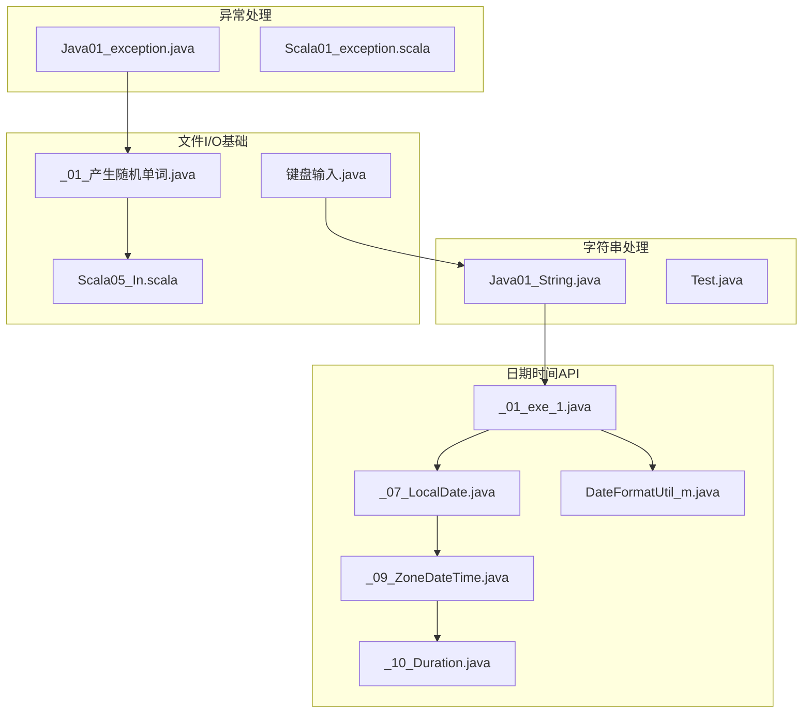
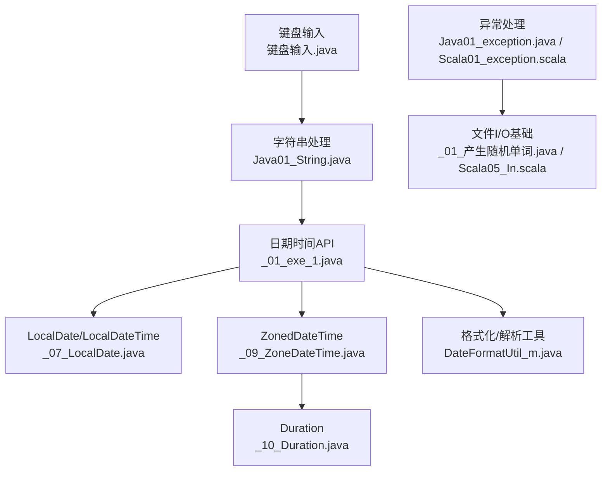
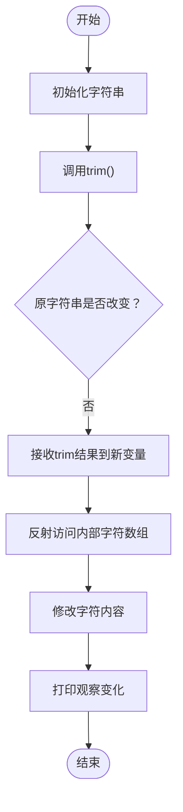
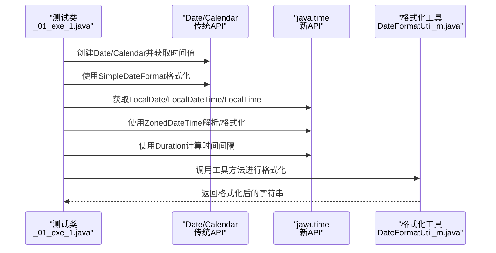
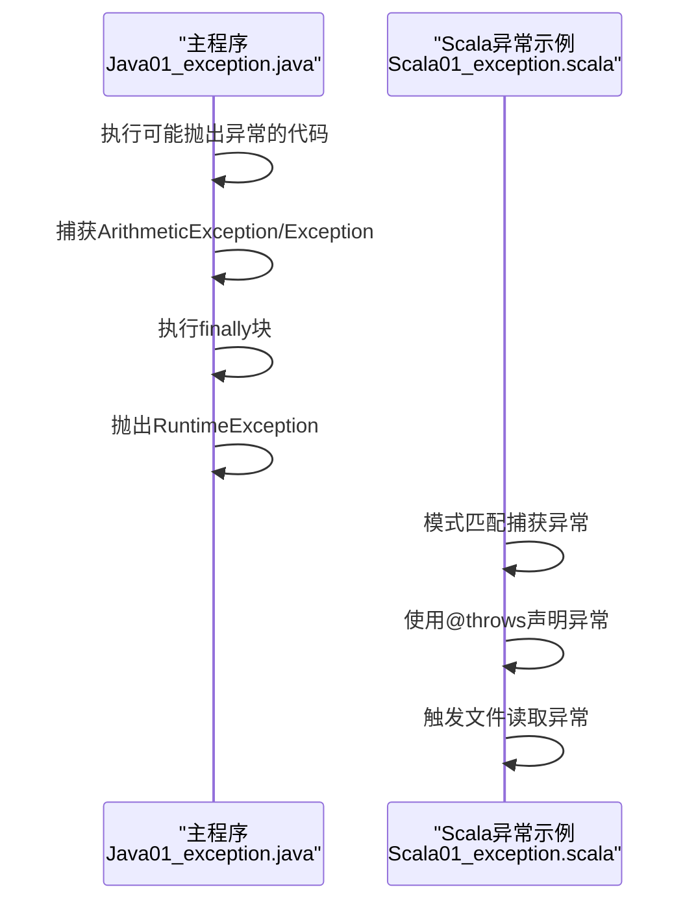
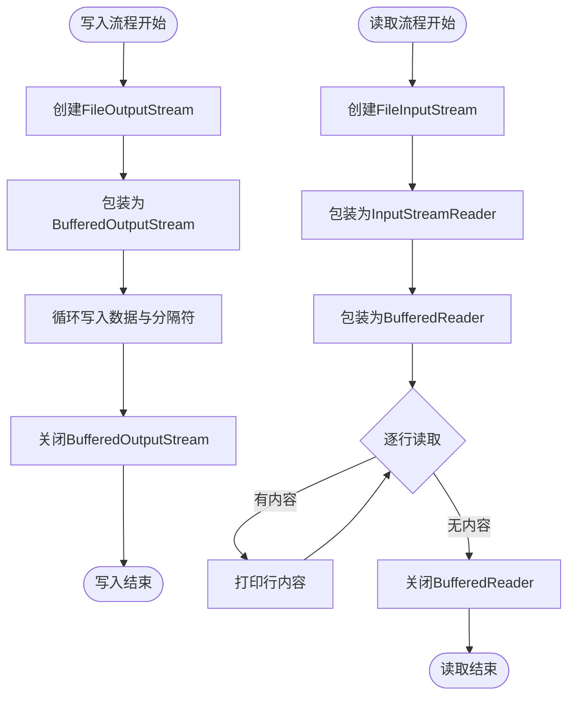
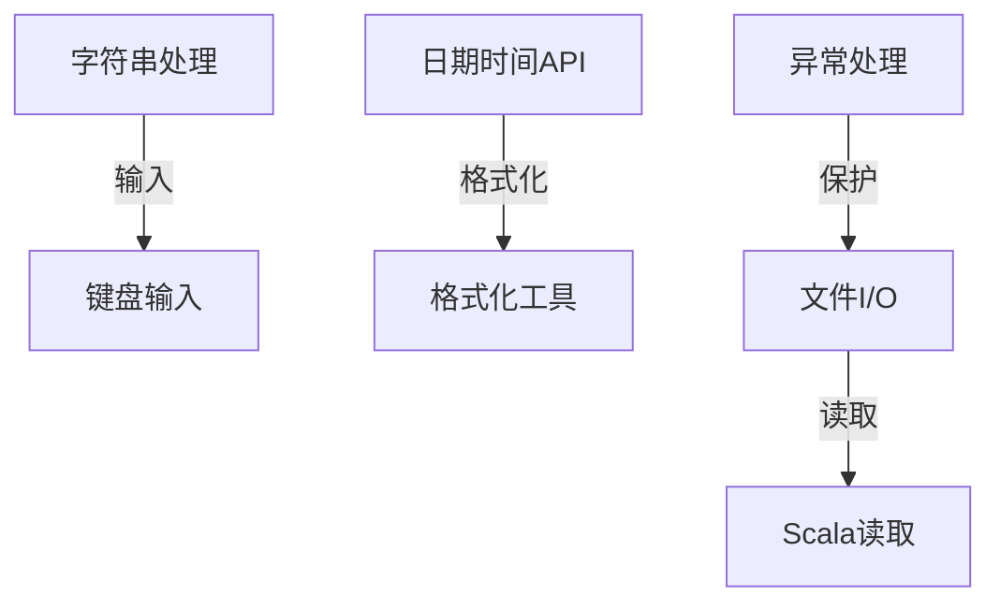

# 常用API

<cite>
**本文引用的文件**
- [Java01_String.java](file://_04_scalaTest/src/main/java/com/atguigu/java/chapter02/Java01_String.java)
- [_01_exe_1.java](file://_01_javaEE/src/main/java/_10_常用API/_03_Date/_01_exe_1.java)
- [_07_LocalDate.java](file://_01_javaEE/src/main/java/_10_常用API/_03_Date/_07_LocalDate.java)
- [_09_ZoneDateTime.java](file://_01_javaEE/src/main/java/_10_常用API/_03_Date/_09_ZoneDateTime.java)
- [_10_Duration.java](file://_01_javaEE/src/main/java/_10_常用API/_03_Date/_10_Duration.java)
- [Java01_exception.java](file://_04_scalaTest/src/main/java/com/atguigu/java/chapter09/Java01_exception.java)
- [_01_产生随机单词.java](file://_01_javaEE/src/main/java/_14_File类与IO流/_01_产生随机单词.java)
- [Test.java](file://_01_javaEE/src/main/java/_10_常用API/_01_字符串/Test.java)
- [键盘输入.java](file://_01_javaEE/src/main/java/_01_基础语法/键盘输入.java)
- [Scala01_exception.scala](file://_04_scalaTest/src/main/scala/com/atguigu/scala/chapter09/Scala01_exception.scala)
- [Scala05_In.scala](file://_04_scalaTest/src/main/scala/com/atguigu/scala/chapter02/Scala05_In.scala)
- [DateFormatUtil_m.java](file://_200_flinkRealtime/src/main/java/com/atguigu/gmall/realtime/util/DateFormatUtil_m.java)
</cite>

## 目录
1. [引言](#引言)
2. [项目结构](#项目结构)
3. [核心组件](#核心组件)
4. [架构总览](#架构总览)
5. [详细组件分析](#详细组件分析)
6. [依赖关系分析](#依赖关系分析)
7. [性能考量](#性能考量)
8. [故障排查指南](#故障排查指南)
9. [结论](#结论)
10. [附录](#附录)

## 引言
本章节围绕Java标准库中最常用的API进行系统性参考说明，覆盖字符串处理、日期时间API（含传统与现代）、异常处理以及文件I/O基础。通过对仓库中现有示例文件的深入分析，帮助读者建立对这些API的结构化理解，并提供可直接定位到源码位置的学习路径，便于进一步实践与扩展。

## 项目结构
与“常用API”主题直接相关的示例分布在以下模块：
- 字符串处理：位于“_04_scalaTest”下的Java字符串示例
- 日期时间API：位于“_01_javaEE”下的Date与java.time示例
- 异常处理：位于“_04_scalaTest”的Java与Scala异常示例
- 文件I/O基础：位于“_01_javaEE”的File类与IO流示例

**图示来源**
- [Java01_String.java](file://_04_scalaTest/src/main/java/com/atguigu/java/chapter02/Java01_String.java#L1-L47)
- [_01_exe_1.java](file://_01_javaEE/src/main/java/_10_常用API/_03_Date/_01_exe_1.java#L1-L147)
- [_07_LocalDate.java](file://_01_javaEE/src/main/java/_10_常用API/_03_Date/_07_LocalDate.java#L1-L20)
- [_09_ZoneDateTime.java](file://_01_javaEE/src/main/java/_10_常用API/_03_Date/_09_ZoneDateTime.java#L1-L20)
- [_10_Duration.java](file://_01_javaEE/src/main/java/_10_常用API/_03_Date/_10_Duration.java#L1-L19)
- [Java01_exception.java](file://_04_scalaTest/src/main/java/com/atguigu/java/chapter09/Java01_exception.java#L1-L46)
- [_01_产生随机单词.java](file://_01_javaEE/src/main/java/_14_File类与IO流/_01_产生随机单词.java#L1-L37)
- [Scala01_exception.scala](file://_04_scalaTest/src/main/scala/com/atguigu/scala/chapter09/Scala01_exception.scala#L1-L45)
- [Scala05_In.scala](file://_04_scalaTest/src/main/scala/com/atguigu/scala/chapter02/Scala05_In.scala#L1-L50)
- [键盘输入.java](file://_01_javaEE/src/main/java/_01_基础语法/键盘输入.java#L1-L26)
- [DateFormatUtil_m.java](file://_200_flinkRealtime/src/main/java/com/atguigu/gmall/realtime/util/DateFormatUtil_m.java#L36-L48)

**章节来源**
- [Java01_String.java](file://_04_scalaTest/src/main/java/com/atguigu/java/chapter02/Java01_String.java#L1-L47)
- [_01_exe_1.java](file://_01_javaEE/src/main/java/_10_常用API/_03_Date/_01_exe_1.java#L1-L147)

## 核心组件
- 字符串处理：重点演示不可变性、空白裁剪、字符数组反射修改等行为，帮助理解String的内部机制与安全边界。
- 日期时间API：涵盖传统Date/Calendar/TimeZone与SimpleDateFormat，以及java.time包的新API（LocalDate、LocalTime、LocalDateTime、ZonedDateTime、Duration），并结合格式化与解析示例。
- 异常处理：展示Java与Scala的异常捕获、抛出与声明方式，强调finally块与异常层次结构的使用。
- 文件I/O基础：演示字节输出流、缓冲输出流、文件写入与关闭，以及从文件读取的基本流程。

**章节来源**
- [Java01_String.java](file://_04_scalaTest/src/main/java/com/atguigu/java/chapter02/Java01_String.java#L1-L47)
- [_01_exe_1.java](file://_01_javaEE/src/main/java/_10_常用API/_03_Date/_01_exe_1.java#L1-L147)
- [Java01_exception.java](file://_04_scalaTest/src/main/java/com/atguigu/java/chapter09/Java01_exception.java#L1-L46)
- [_01_产生随机单词.java](file://_01_javaEE/src/main/java/_14_File类与IO流/_01_产生随机单词.java#L1-L37)

## 架构总览
下图展示了常用API在示例中的组织关系与数据流向：字符串处理示例作为输入基础，日期时间API贯穿格式化与解析，异常处理保障流程稳定性，文件I/O负责持久化与读取。

**图示来源**
- [Java01_String.java](file://_04_scalaTest/src/main/java/com/atguigu/java/chapter02/Java01_String.java#L1-L47)
- [_01_exe_1.java](file://_01_javaEE/src/main/java/_10_常用API/_03_Date/_01_exe_1.java#L1-L147)
- [_07_LocalDate.java](file://_01_javaEE/src/main/java/_10_常用API/_03_Date/_07_LocalDate.java#L1-L20)
- [_09_ZoneDateTime.java](file://_01_javaEE/src/main/java/_10_常用API/_03_Date/_09_ZoneDateTime.java#L1-L20)
- [_10_Duration.java](file://_01_javaEE/src/main/java/_10_常用API/_03_Date/_10_Duration.java#L1-L19)
- [Java01_exception.java](file://_04_scalaTest/src/main/java/com/atguigu/java/chapter09/Java01_exception.java#L1-L46)
- [Scala01_exception.scala](file://_04_scalaTest/src/main/scala/com/atguigu/scala/chapter09/Scala01_exception.scala#L1-L45)
- [_01_产生随机单词.java](file://_01_javaEE/src/main/java/_14_File类与IO流/_01_产生随机单词.java#L1-L37)
- [Scala05_In.scala](file://_04_scalaTest/src/main/scala/com/atguigu/scala/chapter02/Scala05_In.scala#L1-L50)
- [键盘输入.java](file://_01_javaEE/src/main/java/_01_基础语法/键盘输入.java#L1-L26)
- [DateFormatUtil_m.java](file://_200_flinkRealtime/src/main/java/com/atguigu/gmall/realtime/util/DateFormatUtil_m.java#L36-L48)

## 详细组件分析

### 字符串处理（String）
- 不可变性与裁剪：示例展示字符串不可变特性与trim的返回新对象行为，强调原字符串不变。
- 内部字段访问：通过反射访问底层字符数组，演示字符串内部结构，提醒生产环境避免直接修改。
- 实践建议：优先使用不可变字符串的安全特性；需要修改时使用StringBuilder/StringBuffer或构造新字符串。

**图示来源**
- [Java01_String.java](file://_04_scalaTest/src/main/java/com/atguigu/java/chapter02/Java01_String.java#L1-L47)

**章节来源**
- [Java01_String.java](file://_04_scalaTest/src/main/java/com/atguigu/java/chapter02/Java01_String.java#L1-L47)
- [Test.java](file://_01_javaEE/src/main/java/_10_常用API/_01_字符串/Test.java#L1-L38)

### 日期时间API（传统与现代）
- 传统API：演示Date、Calendar、TimeZone、SimpleDateFormat的使用，包括毫秒值转换、格式化与区域设置。
- 新API：展示LocalDate、LocalTime、LocalDateTime、ZonedDateTime的创建与查询；Duration用于时间间隔计算；DateTimeFormatter用于解析与格式化。
- 工具集成：在实际工程中可将时间戳转为本地时间字符串，体现跨模块复用。

**图示来源**
- [_01_exe_1.java](file://_01_javaEE/src/main/java/_10_常用API/_03_Date/_01_exe_1.java#L1-L147)
- [_07_LocalDate.java](file://_01_javaEE/src/main/java/_10_常用API/_03_Date/_07_LocalDate.java#L1-L20)
- [_09_ZoneDateTime.java](file://_01_javaEE/src/main/java/_10_常用API/_03_Date/_09_ZoneDateTime.java#L1-L20)
- [_10_Duration.java](file://_01_javaEE/src/main/java/_10_常用API/_03_Date/_10_Duration.java#L1-L19)
- [DateFormatUtil_m.java](file://_200_flinkRealtime/src/main/java/com/atguigu/gmall/realtime/util/DateFormatUtil_m.java#L36-L48)

**章节来源**
- [_01_exe_1.java](file://_01_javaEE/src/main/java/_10_常用API/_03_Date/_01_exe_1.java#L1-L147)
- [_07_LocalDate.java](file://_01_javaEE/src/main/java/_10_常用API/_03_Date/_07_LocalDate.java#L1-L20)
- [_09_ZoneDateTime.java](file://_01_javaEE/src/main/java/_10_常用API/_03_Date/_09_ZoneDateTime.java#L1-L20)
- [_10_Duration.java](file://_01_javaEE/src/main/java/_10_常用API/_03_Date/_10_Duration.java#L1-L19)
- [DateFormatUtil_m.java](file://_200_flinkRealtime/src/main/java/com/atguigu/gmall/realtime/util/DateFormatUtil_m.java#L36-L48)

### 异常处理（最佳实践）
- Java侧：演示try-catch-finally结构、异常类型选择与打印栈信息；展示throws声明与throw抛出异常。
- Scala侧：演示模式匹配的异常捕获、@throws注解声明异常，以及编译时与运行时异常的差异。
- 最佳实践：优先捕获具体异常；finally用于释放资源；避免吞掉异常；必要时记录日志。

**图示来源**
- [Java01_exception.java](file://_04_scalaTest/src/main/java/com/atguigu/java/chapter09/Java01_exception.java#L1-L46)
- [Scala01_exception.scala](file://_04_scalaTest/src/main/scala/com/atguigu/scala/chapter09/Scala01_exception.scala#L1-L45)

**章节来源**
- [Java01_exception.java](file://_04_scalaTest/src/main/java/com/atguigu/java/chapter09/Java01_exception.java#L1-L46)
- [Scala01_exception.scala](file://_04_scalaTest/src/main/scala/com/atguigu/scala/chapter09/Scala01_exception.scala#L1-L45)

### 文件I/O基础（准备与读取）
- 写入：使用BufferedOutputStream与FileOutputStream向文件写入字节序列，注意关闭流以释放资源。
- 读取：在Scala中演示使用FileInputStream/InputStreamReader/BufferedReader按行读取文件内容。
- 控制台输入：使用Scanner从标准输入读取文本与数字，演示基本交互。

**图示来源**
- [_01_产生随机单词.java](file://_01_javaEE/src/main/java/_14_File类与IO流/_01_产生随机单词.java#L1-L37)
- [Scala05_In.scala](file://_04_scalaTest/src/main/scala/com/atguigu/scala/chapter02/Scala05_In.scala#L1-L50)
- [键盘输入.java](file://_01_javaEE/src/main/java/_01_基础语法/键盘输入.java#L1-L26)

**章节来源**
- [_01_产生随机单词.java](file://_01_javaEE/src/main/java/_14_File类与IO流/_01_产生随机单词.java#L1-L37)
- [Scala05_In.scala](file://_04_scalaTest/src/main/scala/com/atguigu/scala/chapter02/Scala05_In.scala#L1-L50)
- [键盘输入.java](file://_01_javaEE/src/main/java/_01_基础语法/键盘输入.java#L1-L26)

## 依赖关系分析
- 组件内聚：各示例文件功能单一，分别聚焦字符串、日期时间、异常与I/O，内聚度高。
- 组件耦合：字符串与键盘输入存在用户交互输入场景的潜在耦合；日期时间API之间存在方法级依赖（如格式化依赖Formatter）；I/O示例与工具类存在调用关系。
- 外部依赖：日期时间API依赖java.time包；I/O示例依赖java.io与java.nio；异常示例依赖JRE异常体系。

**图示来源**
- [Java01_String.java](file://_04_scalaTest/src/main/java/com/atguigu/java/chapter02/Java01_String.java#L1-L47)
- [键盘输入.java](file://_01_javaEE/src/main/java/_01_基础语法/键盘输入.java#L1-L26)
- [_01_exe_1.java](file://_01_javaEE/src/main/java/_10_常用API/_03_Date/_01_exe_1.java#L1-L147)
- [DateFormatUtil_m.java](file://_200_flinkRealtime/src/main/java/com/atguigu/gmall/realtime/util/DateFormatUtil_m.java#L36-L48)
- [_01_产生随机单词.java](file://_01_javaEE/src/main/java/_14_File类与IO流/_01_产生随机单词.java#L1-L37)
- [Scala05_In.scala](file://_04_scalaTest/src/main/scala/com/atguigu/scala/chapter02/Scala05_In.scala#L1-L50)
- [Java01_exception.java](file://_04_scalaTest/src/main/java/com/atguigu/java/chapter09/Java01_exception.java#L1-L46)

**章节来源**
- [Java01_String.java](file://_04_scalaTest/src/main/java/com/atguigu/java/chapter02/Java01_String.java#L1-L47)
- [_01_exe_1.java](file://_01_javaEE/src/main/java/_10_常用API/_03_Date/_01_exe_1.java#L1-L147)
- [_01_产生随机单词.java](file://_01_javaEE/src/main/java/_14_File类与IO流/_01_产生随机单词.java#L1-L37)
- [Java01_exception.java](file://_04_scalaTest/src/main/java/com/atguigu/java/chapter09/Java01_exception.java#L1-L46)

## 性能考量
- 字符串：频繁拼接建议使用StringBuilder/StringBuffer，避免大量中间对象创建。
- 日期时间：java.time为不可变线程安全设计，适合并发场景；格式化/解析应复用Formatter实例以减少开销。
- I/O：使用缓冲流（BufferedOutputStream/BufferedReader）提升吞吐；及时关闭流，避免资源泄漏。
- 异常：避免在热路径中频繁抛出异常；捕获具体异常类型，减少不必要的栈追踪成本。

[本节为通用指导，不直接分析具体文件]

## 故障排查指南
- 字符串不可变问题：若期望原字符串被修改，请改用可变对象或重新赋值新字符串。
- 日期时间格式错误：检查SimpleDateFormat模式与DateTimeFormatter模式是否一致，注意大小写与时区标识。
- I/O异常：确认文件路径与权限；确保在finally或try-with-resources中正确关闭流。
- 异常未捕获：在调用链上添加合适的catch块，必要时使用日志记录异常上下文。

**章节来源**
- [Java01_exception.java](file://_04_scalaTest/src/main/java/com/atguigu/java/chapter09/Java01_exception.java#L1-L46)
- [_01_产生随机单词.java](file://_01_javaEE/src/main/java/_14_File类与IO流/_01_产生随机单词.java#L1-L37)
- [_01_exe_1.java](file://_01_javaEE/src/main/java/_10_常用API/_03_Date/_01_exe_1.java#L1-L147)

## 结论
通过对仓库中字符串、日期时间、异常与I/O示例的系统梳理，可以形成一套从基础到进阶的常用API学习路径。建议先掌握字符串不可变性与常用方法，再过渡到java.time新API与格式化/解析，随后学习异常处理与I/O基础，最终在实际工程中结合工具类实现稳定可靠的业务逻辑。

[本节为总结性内容，不直接分析具体文件]

## 附录
- 学习路径建议
  - 字符串：从不可变性与常用方法入手，逐步掌握正则与格式化。
  - 日期时间：先熟悉传统API，再转向java.time新API，重点掌握格式化与时区处理。
  - 异常处理：理解异常层次与最佳实践，结合日志与资源管理。
  - 文件I/O：掌握字节流与缓冲流，了解编码与资源关闭。
- 参考示例定位
  - 字符串处理：[Java01_String.java](file://_04_scalaTest/src/main/java/com/atguigu/java/chapter02/Java01_String.java#L1-L47)，[Test.java](file://_01_javaEE/src/main/java/_10_常用API/_01_字符串/Test.java#L1-L38)
  - 日期时间API：[_01_exe_1.java](file://_01_javaEE/src/main/java/_10_常用API/_03_Date/_01_exe_1.java#L1-L147)，[_07_LocalDate.java](file://_01_javaEE/src/main/java/_10_常用API/_03_Date/_07_LocalDate.java#L1-L20)，[_09_ZoneDateTime.java](file://_01_javaEE/src/main/java/_10_常用API/_03_Date/_09_ZoneDateTime.java#L1-L20)，[_10_Duration.java](file://_01_javaEE/src/main/java/_10_常用API/_03_Date/_10_Duration.java#L1-L19)，[DateFormatUtil_m.java](file://_200_flinkRealtime/src/main/java/com/atguigu/gmall/realtime/util/DateFormatUtil_m.java#L36-L48)
  - 异常处理：[Java01_exception.java](file://_04_scalaTest/src/main/java/com/atguigu/java/chapter09/Java01_exception.java#L1-L46)，[Scala01_exception.scala](file://_04_scalaTest/src/main/scala/com/atguigu/scala/chapter09/Scala01_exception.scala#L1-L45)
  - 文件I/O基础：[_01_产生随机单词.java](file://_01_javaEE/src/main/java/_14_File类与IO流/_01_产生随机单词.java#L1-L37)，[Scala05_In.scala](file://_04_scalaTest/src/main/scala/com/atguigu/scala/chapter02/Scala05_In.scala#L1-L50)，[键盘输入.java](file://_01_javaEE/src/main/java/_01_基础语法/键盘输入.java#L1-L26)