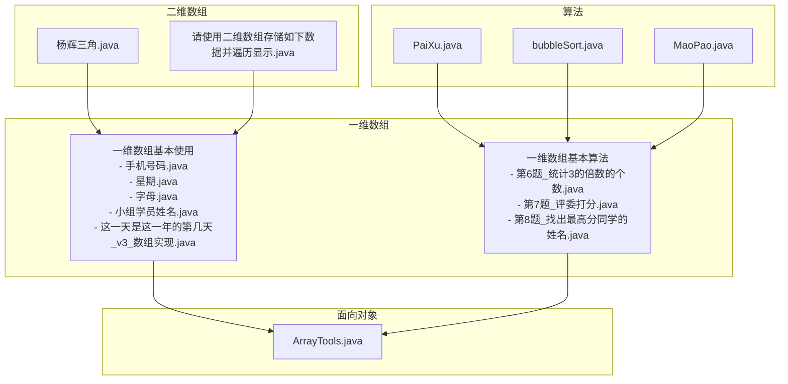
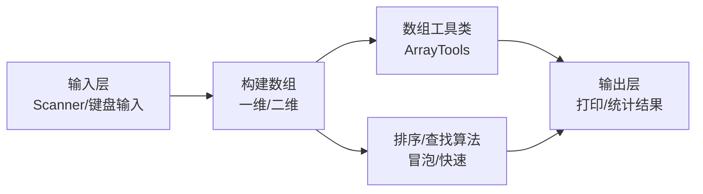
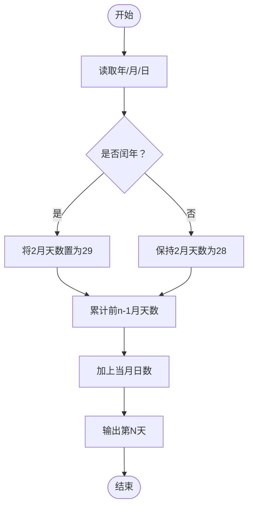
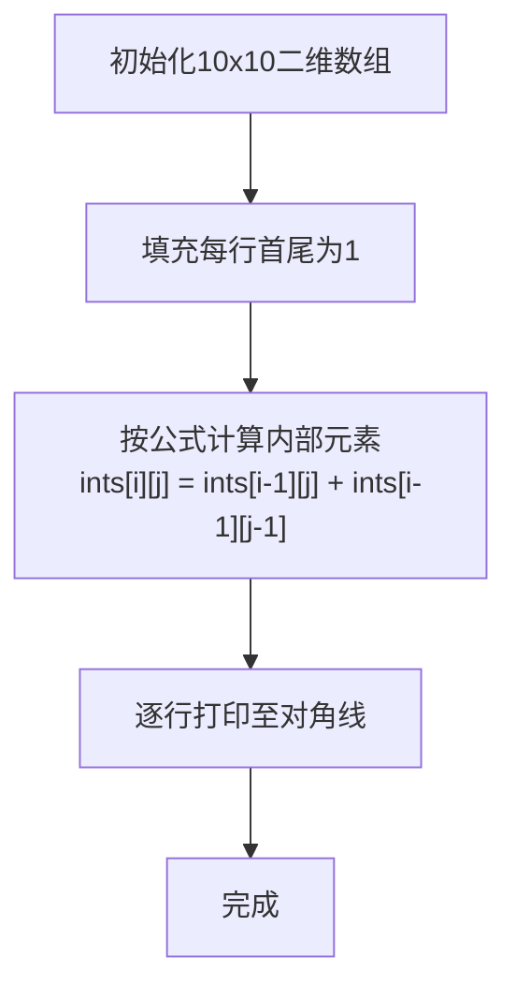
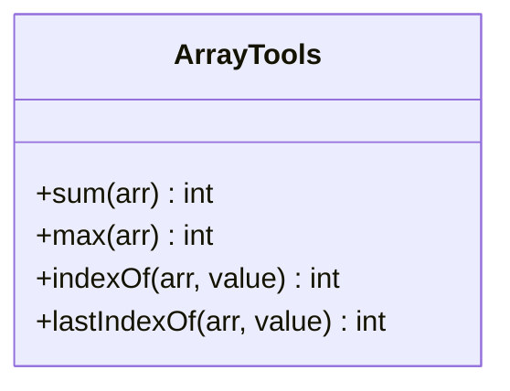
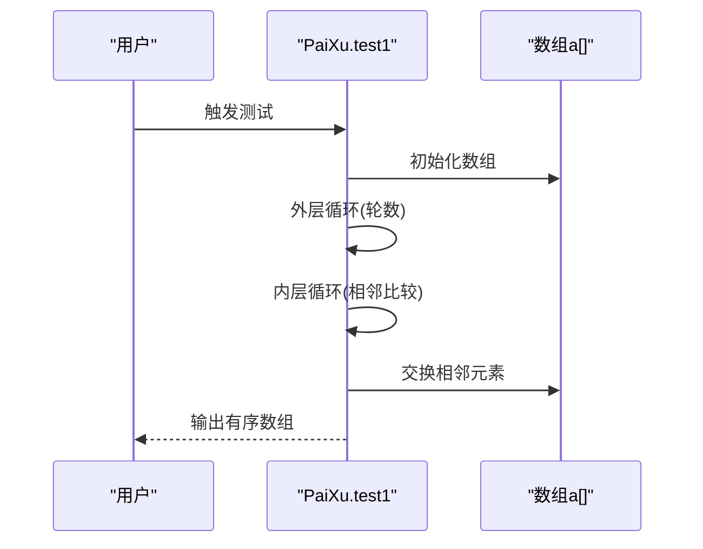
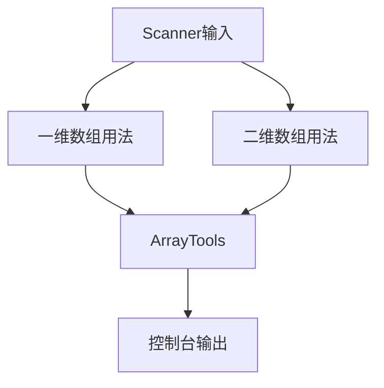

# 数组

<cite>
**本文引用的文件**
- [手机号码.java](file://_01_javaEE/src/main/java/_04_数组/一维数组基本使用/手机号码.java)
- [星期.java](file://_01_javaEE/src/main/java/_04_数组/一维数组基本使用/星期.java)
- [字母.java](file://_01_javaEE/src/main/java/_04_数组/一维数组基本使用/字母.java)
- [小组学员姓名.java](file://_01_javaEE/src/main/java/_04_数组/一维数组基本使用/小组学员姓名.java)
- [这一天是这一年的第几天_v3_数组实现.java](file://_01_javaEE/src/main/java/_04_数组/一维数组基本使用/这一天是这一年的第几天_v3_数组实现.java)
- [第6题_统计3的倍数的个数.java](file://_01_javaEE/src/main/java/_04_数组/一维数组基本算法/第6题_统计3的倍数的个数.java)
- [第7题_评委打分.java](file://_01_javaEE/src/main/java/_04_数组/一维数组基本算法/第7题_评委打分.java)
- [第8题_找出最高分同学的姓名.java](file://_01_javaEE/src/main/java/_04_数组/一维数组基本算法/第8题_找出最高分同学的姓名.java)
- [ArrayTools.java](file://_01_javaEE/src/main/java/_07_面向对象/ArrayTools.java)
- [PaiXu.java](file://_11_Algorithm/src/main/java/_50_算法/_01_排序/PaiXu.java)
- [bubbleSort.java](file://_11_Algorithm/src/main/java/_50_算法/_01_排序/bubbleSort.java)
- [MaoPao.java](file://_06_flink_chen/src/main/java/org/MaoPao.java)
- [杨辉三角.java](file://_01_javaEE/src/main/java/_04_数组/二维数组/杨辉三角.java)
- [请使用二维数组存储如下数据并遍历显示.java](file://_01_javaEE/src/main/java/_04_数组/二维数组/请使用二维数组存储如下数据并遍历显示.java)
</cite>

## 目录
1. [引言](#引言)
2. [项目结构](#项目结构)
3. [核心组件](#核心组件)
4. [架构概览](#架构概览)
5. [详细组件分析](#详细组件分析)
6. [依赖分析](#依赖分析)
7. [性能考量](#性能考量)
8. [故障排查指南](#故障排查指南)
9. [结论](#结论)
10. [附录](#附录)

## 引言
本章节围绕Java数组展开，系统讲解数组的概念、声明与初始化、内存与索引访问、长度属性等核心知识；并通过大量实战案例，覆盖学生成绩管理、日期计算、矩阵与图像处理等典型应用场景；同时梳理数组常用算法（查找、排序、求和等），并提供由浅入深的练习建议，帮助读者建立扎实的数据结构基础。

## 项目结构
数组相关内容主要分布在以下模块：
- 一维数组基本使用：涵盖数组声明、初始化、遍历、键盘输入、字符串拼接、日期计算等
- 一维数组基本算法：包含统计计数、排序、最高分查找等
- 二维数组：包含杨辉三角、员工信息二维表遍历
- 面向对象：封装数组工具类，提供求和、最大值、查找下标等方法
- 算法：提供冒泡排序、快速排序等排序实现

图表来源
- [手机号码.java](file://_01_javaEE/src/main/java/_04_数组/一维数组基本使用/手机号码.java#L1-L19)
- [星期.java](file://_01_javaEE/src/main/java/_04_数组/一维数组基本使用/星期.java#L1-L30)
- [字母.java](file://_01_javaEE/src/main/java/_04_数组/一维数组基本使用/字母.java#L1-L29)
- [小组学员姓名.java](file://_01_javaEE/src/main/java/_04_数组/一维数组基本使用/小组学员姓名.java#L1-L30)
- [这一天是这一年的第几天_v3_数组实现.java](file://_01_javaEE/src/main/java/_04_数组/一维数组基本使用/这一天是这一年的第几天_v3_数组实现.java#L1-L62)
- [第6题_统计3的倍数的个数.java](file://_01_javaEE/src/main/java/_04_数组/一维数组基本算法/第6题_统计3的倍数的个数.java#L1-L44)
- [第7题_评委打分.java](file://_01_javaEE/src/main/java/_04_数组/一维数组基本算法/第7题_评委打分.java#L1-L58)
- [第8题_找出最高分同学的姓名.java](file://_01_javaEE/src/main/java/_04_数组/一维数组基本算法/第8题_找出最高分同学的姓名.java#L1-L45)
- [ArrayTools.java](file://_01_javaEE/src/main/java/_07_面向对象/ArrayTools.java#L1-L56)
- [PaiXu.java](file://_11_Algorithm/src/main/java/_50_算法/_01_排序/PaiXu.java#L1-L45)
- [bubbleSort.java](file://_11_Algorithm/src/main/java/_50_算法/_01_排序/bubbleSort.java#L1-L19)
- [MaoPao.java](file://_06_flink_chen/src/main/java/org/MaoPao.java#L1-L41)
- [杨辉三角.java](file://_01_javaEE/src/main/java/_04_数组/二维数组/杨辉三角.java#L1-L43)
- [请使用二维数组存储如下数据并遍历显示.java](file://_01_javaEE/src/main/java/_04_数组/二维数组/请使用二维数组存储如下数据并遍历显示.java#L1-L53)

章节来源
- [手机号码.java](file://_01_javaEE/src/main/java/_04_数组/一维数组基本使用/手机号码.java#L1-L19)
- [星期.java](file://_01_javaEE/src/main/java/_04_数组/一维数组基本使用/星期.java#L1-L30)
- [字母.java](file://_01_javaEE/src/main/java/_04_数组/一维数组基本使用/字母.java#L1-L29)
- [小组学员姓名.java](file://_01_javaEE/src/main/java/_04_数组/一维数组基本使用/小组学员姓名.java#L1-L30)
- [这一天是这一年的第几天_v3_数组实现.java](file://_01_javaEE/src/main/java/_04_数组/一维数组基本使用/这一天是这一年的第几天_v3_数组实现.java#L1-L62)
- [第6题_统计3的倍数的个数.java](file://_01_javaEE/src/main/java/_04_数组/一维数组基本算法/第6题_统计3的倍数的个数.java#L1-L44)
- [第7题_评委打分.java](file://_01_javaEE/src/main/java/_04_数组/一维数组基本算法/第7题_评委打分.java#L1-L58)
- [第8题_找出最高分同学的姓名.java](file://_01_javaEE/src/main/java/_04_数组/一维数组基本算法/第8题_找出最高分同学的姓名.java#L1-L45)
- [ArrayTools.java](file://_01_javaEE/src/main/java/_07_面向对象/ArrayTools.java#L1-L56)
- [PaiXu.java](file://_11_Algorithm/src/main/java/_50_算法/_01_排序/PaiXu.java#L1-L45)
- [bubbleSort.java](file://_11_Algorithm/src/main/java/_50_算法/_01_排序/bubbleSort.java#L1-L19)
- [MaoPao.java](file://_06_flink_chen/src/main/java/org/MaoPao.java#L1-L41)
- [杨辉三角.java](file://_01_javaEE/src/main/java/_04_数组/二维数组/杨辉三角.java#L1-L43)
- [请使用二维数组存储如下数据并遍历显示.java](file://_01_javaEE/src/main/java/_04_数组/二维数组/请使用二维数组存储如下数据并遍历显示.java#L1-L53)

## 核心组件
- 一维数组基础用法
  - 声明与初始化：静态字面量、动态new、动态赋值
  - 遍历与访问：for、增强for、索引越界防护
  - 输入输出：Scanner交互、next/nextLine差异
  - 实战应用：字符串拼接、星期映射、字母表生成、日期累计天数
- 二维数组基础用法
  - 声明与初始化：矩形与不规则二维数组
  - 遍历与访问：双重循环、列筛选
  - 实战应用：员工信息表、杨辉三角
- 数组工具类
  - 功能：求和、求最大值、查找首次/末次出现位置
  - 设计：方法职责单一、参数与返回值清晰
- 基础算法
  - 查找：顺序查找（首次/末次）
  - 排序：冒泡排序、快速排序
  - 统计：计数、去极值求平均

章节来源
- [ArrayTools.java](file://_01_javaEE/src/main/java/_07_面向对象/ArrayTools.java#L1-L56)
- [杨辉三角.java](file://_01_javaEE/src/main/java/_04_数组/二维数组/杨辉三角.java#L1-L43)
- [请使用二维数组存储如下数据并遍历显示.java](file://_01_javaEE/src/main/java/_04_数组/二维数组/请使用二维数组存储如下数据并遍历显示.java#L1-L53)
- [PaiXu.java](file://_11_Algorithm/src/main/java/_50_算法/_01_排序/PaiXu.java#L1-L45)
- [bubbleSort.java](file://_11_Algorithm/src/main/java/_50_算法/_01_排序/bubbleSort.java#L1-L19)
- [MaoPao.java](file://_06_flink_chen/src/main/java/org/MaoPao.java#L1-L41)

## 架构概览
数组作为最基础的数据结构，贯穿“输入-处理-输出”的完整链路：
- 输入层：Scanner接收用户输入，构建一维/二维数组
- 处理层：数组工具类与算法模块完成统计、查找、排序等逻辑
- 输出层：格式化打印结果，或用于后续业务处理

图表来源
- [ArrayTools.java](file://_01_javaEE/src/main/java/_07_面向对象/ArrayTools.java#L1-L56)
- [PaiXu.java](file://_11_Algorithm/src/main/java/_50_算法/_01_排序/PaiXu.java#L1-L45)
- [bubbleSort.java](file://_11_Algorithm/src/main/java/_50_算法/_01_排序/bubbleSort.java#L1-L19)
- [MaoPao.java](file://_06_flink_chen/src/main/java/org/MaoPao.java#L1-L41)

## 详细组件分析

### 一维数组基础用法
- 手机号码拼接：利用索引数组对基础数组进行重排拼接，体现“索引即映射”的思想
- 星期查询：数组保存英文单词，键盘输入0-6映射到对应索引
- 字母表生成：预分配长度，按ASCII码填充大小写字母
- 学员姓名录入：动态指定数组长度，逐项录入并遍历输出
- 日期累计天数：使用数组存储每月天数，闰年修正，累加前n-1月天数

图表来源
- [这一天是这一年的第几天_v3_数组实现.java](file://_01_javaEE/src/main/java/_04_数组/一维数组基本使用/这一天是这一年的第几天_v3_数组实现.java#L1-L62)

章节来源
- [手机号码.java](file://_01_javaEE/src/main/java/_04_数组/一维数组基本使用/手机号码.java#L1-L19)
- [星期.java](file://_01_javaEE/src/main/java/_04_数组/一维数组基本使用/星期.java#L1-L30)
- [字母.java](file://_01_javaEE/src/main/java/_04_数组/一维数组基本使用/字母.java#L1-L29)
- [小组学员姓名.java](file://_01_javaEE/src/main/java/_04_数组/一维数组基本使用/小组学员姓名.java#L1-L30)
- [这一天是这一年的第几天_v3_数组实现.java](file://_01_javaEE/src/main/java/_04_数组/一维数组基本使用/这一天是这一年的第几天_v3_数组实现.java#L1-L62)

### 二维数组基础用法
- 杨辉三角：预设首尾为1，内部元素由上一行相邻两数之和得到，体现动态规划思想
- 员工信息表：多行多列混合数据，按行遍历并根据某列值进行分类输出

图表来源
- [杨辉三角.java](file://_01_javaEE/src/main/java/_04_数组/二维数组/杨辉三角.java#L1-L43)

章节来源
- [杨辉三角.java](file://_01_javaEE/src/main/java/_04_数组/二维数组/杨辉三角.java#L1-L43)
- [请使用二维数组存储如下数据并遍历显示.java](file://_01_javaEE/src/main/java/_04_数组/二维数组/请使用二维数组存储如下数据并遍历显示.java#L1-L53)

### 数组工具类（ArrayTools）
- 功能清单
  - 求和：遍历累加
  - 最大值：线性扫描更新
  - 首次出现位置：顺序查找
  - 末次出现位置：逆向扫描
- 设计要点
  - 方法单一职责，避免副作用
  - 正确处理空数组与越界风险
  - 返回约定明确（未找到返回-1）

图表来源
- [ArrayTools.java](file://_01_javaEE/src/main/java/_07_面向对象/ArrayTools.java#L1-L56)

章节来源
- [ArrayTools.java](file://_01_javaEE/src/main/java/_07_面向对象/ArrayTools.java#L1-L56)

### 基础算法
- 冒泡排序：相邻比较交换，外层控制轮数，内层边界递减
- 快速排序：分治思想，选取枢轴，左右分区递归

图表来源
- [PaiXu.java](file://_11_Algorithm/src/main/java/_50_算法/_01_排序/PaiXu.java#L1-L45)

章节来源
- [PaiXu.java](file://_11_Algorithm/src/main/java/_50_算法/_01_排序/PaiXu.java#L1-L45)
- [bubbleSort.java](file://_11_Algorithm/src/main/java/_50_算法/_01_排序/bubbleSort.java#L1-L19)
- [MaoPao.java](file://_06_flink_chen/src/main/java/org/MaoPao.java#L1-L41)

### 实战案例与场景应用
- 学生成绩管理
  - 录入姓名与分数，遍历显示，查找最高分同学
  - 去极值求平均分（排序后去掉最高与最低）
- 矩阵运算与图像处理
  - 使用二维数组存储像素或特征矩阵，按行/列遍历处理
  - 杨辉三角作为组合数与递推关系的可视化示例
- 图像处理
  - 将像素灰度/RGB值存入二维数组，进行滤波、裁剪等操作（思路迁移）

章节来源
- [第7题_评委打分.java](file://_01_javaEE/src/main/java/_04_数组/一维数组基本算法/第7题_评委打分.java#L1-L58)
- [第8题_找出最高分同学的姓名.java](file://_01_javaEE/src/main/java/_04_数组/一维数组基本算法/第8题_找出最高分同学的姓名.java#L1-L45)
- [杨辉三角.java](file://_01_javaEE/src/main/java/_04_数组/二维数组/杨辉三角.java#L1-L43)

## 依赖分析
- 模块内依赖
  - 一维/二维数组用法与算法模块相互独立，但共同依赖Scanner与标准输出
  - ArrayTools被多个用例间接调用，形成“工具-用例”依赖
- 外部依赖
  - 无第三方库，纯Java标准库

图表来源
- [ArrayTools.java](file://_01_javaEE/src/main/java/_07_面向对象/ArrayTools.java#L1-L56)
- [第6题_统计3的倍数的个数.java](file://_01_javaEE/src/main/java/_04_数组/一维数组基本算法/第6题_统计3的倍数的个数.java#L1-L44)
- [第7题_评委打分.java](file://_01_javaEE/src/main/java/_04_数组/一维数组基本算法/第7题_评委打分.java#L1-L58)
- [第8题_找出最高分同学的姓名.java](file://_01_javaEE/src/main/java/_04_数组/一维数组基本算法/第8题_找出最高分同学的姓名.java#L1-L45)
- [杨辉三角.java](file://_01_javaEE/src/main/java/_04_数组/二维数组/杨辉三角.java#L1-L43)
- [请使用二维数组存储如下数据并遍历显示.java](file://_01_javaEE/src/main/java/_04_数组/二维数组/请使用二维数组存储如下数据并遍历显示.java#L1-L53)

## 性能考量
- 时间复杂度
  - 遍历：O(n)，适用于大规模数据的线性扫描
  - 冒泡排序：O(n^2)，适合小规模或教学演示
  - 快速排序：平均O(n log n)，最坏O(n^2)，适合中大规模数据
- 空间复杂度
  - 原地排序算法（如快速排序）空间开销低
  - 额外数组结构（如杨辉三角）需预先估算容量
- 实践建议
  - 尽量避免重复计算（如将数组长度缓存为局部变量）
  - 合理选择算法：小规模用冒泡，中大规模用快速排序
  - 注意索引边界，防止越界异常

## 故障排查指南
- 常见问题
  - 索引越界：检查循环终止条件与数组长度
  - 输入阻塞：next/nextLine混用导致换行符吞噬
  - 闰年判断：四年一闰、百年不闰、四百年再闰
- 定位方法
  - 使用最小可复现样例（固定输入）
  - 打印中间变量（当前索引、当前值、累计和）
  - 单元测试：针对边界值（空数组、单元素、全相同元素）

章节来源
- [这一天是这一年的第几天_v3_数组实现.java](file://_01_javaEE/src/main/java/_04_数组/一维数组基本使用/这一天是这一年的第几天_v3_数组实现.java#L1-L62)
- [第6题_统计3的倍数的个数.java](file://_01_javaEE/src/main/java/_04_数组/一维数组基本算法/第6题_统计3的倍数的个数.java#L1-L44)
- [第7题_评委打分.java](file://_01_javaEE/src/main/java/_04_数组/一维数组基本算法/第7题_评委打分.java#L1-L58)

## 结论
数组是程序设计的基础构件，掌握其声明、初始化、索引访问与长度属性，是进一步学习集合框架与高级数据结构的前提。通过本章的实战案例与算法训练，读者可以熟练运用数组解决实际问题，并为后续学习排序、查找、动态规划等奠定坚实基础。

## 附录
- 练习建议
  - 基础遍历：打印数组、求和、计数
  - 查找算法：顺序查找、二分查找（有序数组）
  - 排序算法：冒泡、选择、插入、快速排序
  - 应用综合：学生成绩统计、矩阵转置、图像灰度直方图
- 参考路径
  - 一维数组基础用法：[手机号码.java](file://_01_javaEE/src/main/java/_04_数组/一维数组基本使用/手机号码.java#L1-L19)、[星期.java](file://_01_javaEE/src/main/java/_04_数组/一维数组基本使用/星期.java#L1-L30)、[字母.java](file://_01_javaEE/src/main/java/_04_数组/一维数组基本使用/字母.java#L1-L29)、[小组学员姓名.java](file://_01_javaEE/src/main/java/_04_数组/一维数组基本使用/小组学员姓名.java#L1-L30)、[这一天是这一年的第几天_v3_数组实现.java](file://_01_javaEE/src/main/java/_04_数组/一维数组基本使用/这一天是这一年的第几天_v3_数组实现.java#L1-L62)
  - 一维数组算法：[第6题_统计3的倍数的个数.java](file://_01_javaEE/src/main/java/_04_数组/一维数组基本算法/第6题_统计3的倍数的个数.java#L1-L44)、[第7题_评委打分.java](file://_01_javaEE/src/main/java/_04_数组/一维数组基本算法/第7题_评委打分.java#L1-L58)、[第8题_找出最高分同学的姓名.java](file://_01_javaEE/src/main/java/_04_数组/一维数组基本算法/第8题_找出最高分同学的姓名.java#L1-L45)
  - 二维数组：[杨辉三角.java](file://_01_javaEE/src/main/java/_04_数组/二维数组/杨辉三角.java#L1-L43)、[请使用二维数组存储如下数据并遍历显示.java](file://_01_javaEE/src/main/java/_04_数组/二维数组/请使用二维数组存储如下数据并遍历显示.java#L1-L53)
  - 工具类：[ArrayTools.java](file://_01_javaEE/src/main/java/_07_面向对象/ArrayTools.java#L1-L56)
  - 排序算法：[PaiXu.java](file://_11_Algorithm/src/main/java/_50_算法/_01_排序/PaiXu.java#L1-L45)、[bubbleSort.java](file://_11_Algorithm/src/main/java/_50_算法/_01_排序/bubbleSort.java#L1-L19)、[MaoPao.java](file://_06_flink_chen/src/main/java/org/MaoPao.java#L1-L41)