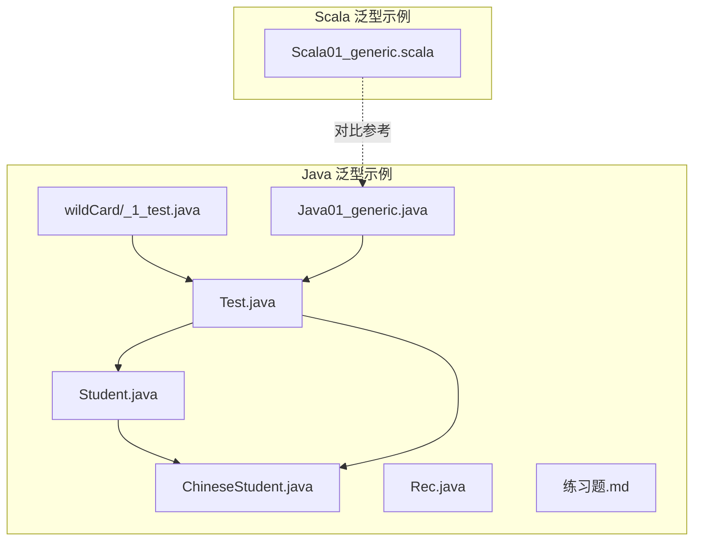
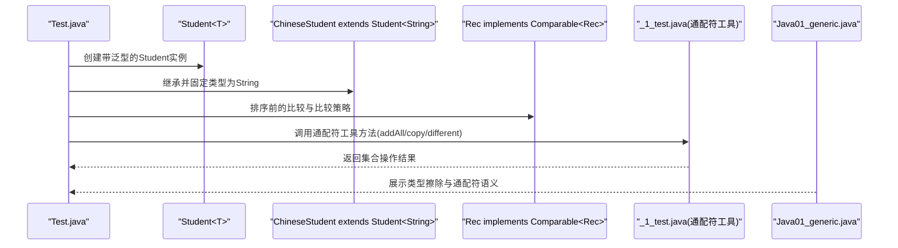
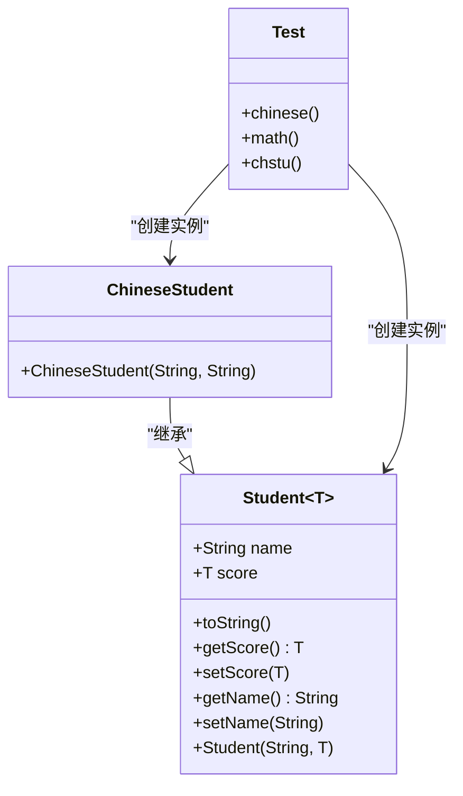
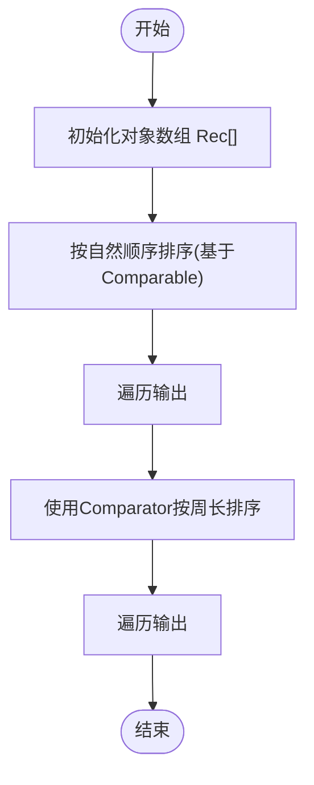
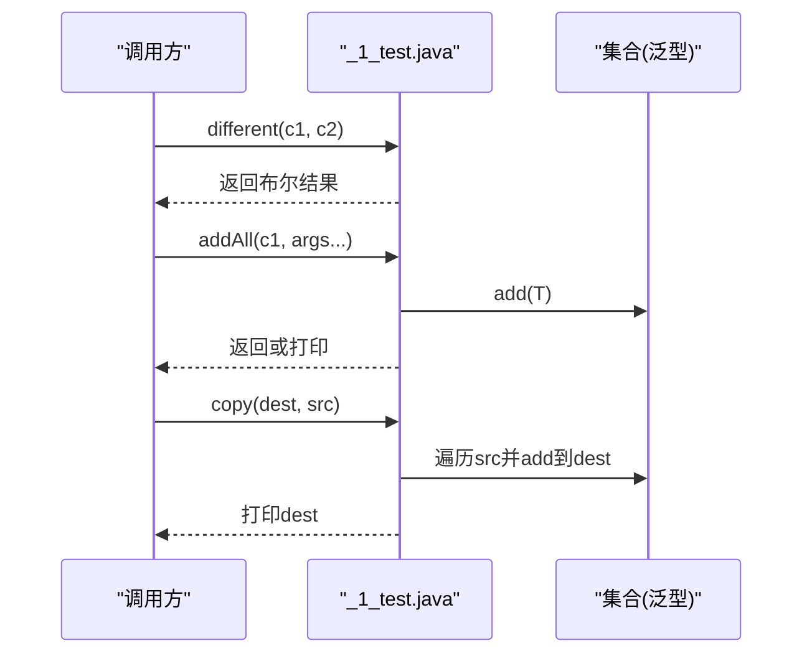
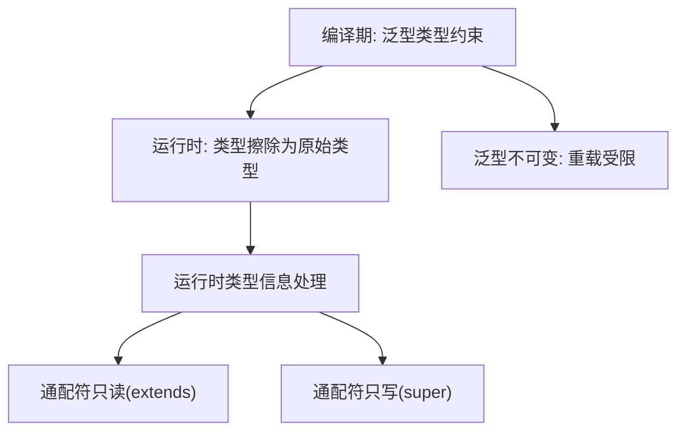
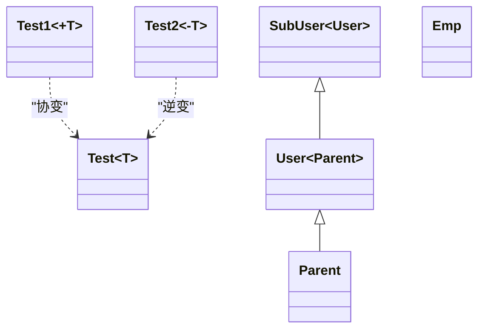
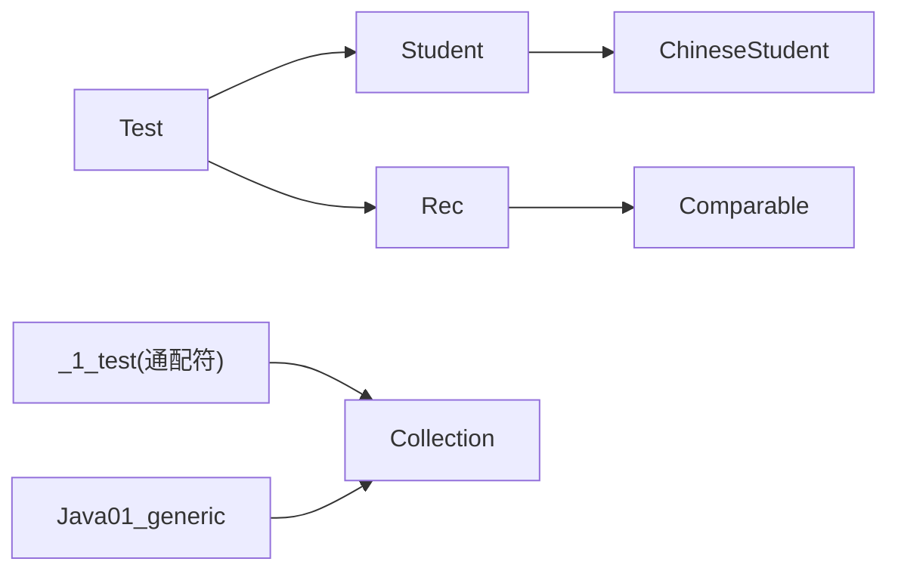

# 泛型

<cite>
**本文引用的文件**
- [Student.java](file://_01_javaEE/src/main/java/_12_泛型/Student.java)
- [ChineseStudent.java](file://_01_javaEE/src/main/java/_12_泛型/ChineseStudent.java)
- [Test.java](file://_01_javaEE/src/main/java/_12_泛型/Test.java)
- [Rec.java](file://_01_javaEE/src/main/java/_12_泛型/Rec.java)
- [testFanxing.java](file://_01_javaEE/src/main/java/_12_泛型/testFanxing.java)
- [_1_test.java](file://_01_javaEE/src/main/java/_12_泛型/wildCard/_1_test.java)
- [练习题.md](file://_01_javaEE/src/main/java/_12_泛型/练习题.md)
- [Java01_generic.java](file://_04_scalaTest/src/main/java/com/atguigu/java/chapter11/Java01_generic.java)
- [Scala01_generic.scala](file://_04_scalaTest/src/main/scala/com/atguigu/scala/chapter11/Scala01_generic.scala)
</cite>

## 目录
1. [引言](#引言)
2. [项目结构](#项目结构)
3. [核心组件](#核心组件)
4. [架构总览](#架构总览)
5. [详细组件分析](#详细组件分析)
6. [依赖分析](#依赖分析)
7. [性能考虑](#性能考虑)
8. [故障排查指南](#故障排查指南)
9. [结论](#结论)
10. [附录](#附录)

## 引言
本章节围绕Java泛型展开，系统讲解类型安全、避免强制类型转换、泛型类/方法/接口的定义与使用、通配符（上界、下界、无界）的应用场景，并结合Student类、ChineseStudent类等实例演示泛型在实际项目中的落地方式。同时，阐述泛型的类型擦除机制及运行时类型信息处理，最后提供配套练习题帮助巩固。

## 项目结构
本仓库中与“泛型”主题直接相关的Java代码主要集中在以下路径：
- _01_javaEE/src/main/java/_12_泛型：包含Student、ChineseStudent、Rec、Test、wildCard工具类、练习题文档等
- _04_scalaTest/src/main/java/com/atguigu/java/chapter11：Java侧泛型示例（类型擦除、通配符）
- _04_scalaTest/src/main/scala/com/atguigu/scala/chapter11：Scala侧泛型示例（协变/逆变/上下限）

**图表来源**
- [Student.java](file://_01_javaEE/src/main/java/_12_泛型/Student.java#L1-L36)
- [ChineseStudent.java](file://_01_javaEE/src/main/java/_12_泛型/ChineseStudent.java#L1-L8)
- [Rec.java](file://_01_javaEE/src/main/java/_12_泛型/Rec.java#L1-L66)
- [Test.java](file://_01_javaEE/src/main/java/_12_泛型/Test.java#L1-L25)
- [_1_test.java](file://_01_javaEE/src/main/java/_12_泛型/wildCard/_1_test.java#L1-L150)
- [练习题.md](file://_01_javaEE/src/main/java/_12_泛型/练习题.md#L1-L147)
- [Java01_generic.java](file://_04_scalaTest/src/main/java/com/atguigu/java/chapter11/Java01_generic.java#L1-L128)
- [Scala01_generic.scala](file://_04_scalaTest/src/main/scala/com/atguigu/scala/chapter11/Scala01_generic.scala#L1-L95)

**章节来源**
- [Student.java](file://_01_javaEE/src/main/java/_12_泛型/Student.java#L1-L36)
- [ChineseStudent.java](file://_01_javaEE/src/main/java/_12_泛型/ChineseStudent.java#L1-L8)
- [Rec.java](file://_01_javaEE/src/main/java/_12_泛型/Rec.java#L1-L66)
- [Test.java](file://_01_javaEE/src/main/java/_12_泛型/Test.java#L1-L25)
- [_1_test.java](file://_01_javaEE/src/main/java/_12_泛型/wildCard/_1_test.java#L1-L150)
- [练习题.md](file://_01_javaEE/src/main/java/_12_泛型/练习题.md#L1-L147)
- [Java01_generic.java](file://_04_scalaTest/src/main/java/com/atguigu/java/chapter11/Java01_generic.java#L1-L128)
- [Scala01_generic.scala](file://_04_scalaTest/src/main/scala/com/atguigu/scala/chapter11/Scala01_generic.scala#L1-L95)

## 核心组件
- 泛型类：以Student<T>为例，通过类型参数T在编译期约束成员变量与方法的类型，提升类型安全并避免强制类型转换。
- 泛型方法：在工具类中定义泛型方法，实现跨类型数组的交换、反转、排序等通用操作。
- 泛型接口/比较器：Rec实现Comparable<Rec>，并通过自定义比较策略实现排序；配合Arrays.sort与Comparator实现灵活排序。
- 通配符：无界通配符<?>用于读取集合元素；上界通配符<? extends T>用于“只读”场景；下界通配符<? super T>用于“只写/填充”场景。
- 继承与限定：ChineseStudent继承Student<String>，体现泛型类型实参的确定化；工具类addAll/copy分别演示下界与上下界组合使用。
- 类型擦除与运行时：Java01_generic展示了编译期类型约束与运行时类型擦除的关系，强调泛型不可变性与通配符的边界。

**章节来源**
- [Student.java](file://_01_javaEE/src/main/java/_12_泛型/Student.java#L1-L36)
- [ChineseStudent.java](file://_01_javaEE/src/main/java/_12_泛型/ChineseStudent.java#L1-L8)
- [Rec.java](file://_01_javaEE/src/main/java/_12_泛型/Rec.java#L1-L66)
- [testFanxing.java](file://_01_javaEE/src/main/java/_12_泛型/testFanxing.java#L1-L51)
- [_1_test.java](file://_01_javaEE/src/main/java/_12_泛型/wildCard/_1_test.java#L1-L150)
- [Java01_generic.java](file://_04_scalaTest/src/main/java/com/atguigu/java/chapter11/Java01_generic.java#L1-L128)

## 架构总览
下面以“测试驱动的泛型应用”为主线，展示从测试入口到具体业务类的调用关系与数据流转。

**图表来源**
- [Test.java](file://_01_javaEE/src/main/java/_12_泛型/Test.java#L1-L25)
- [Student.java](file://_01_javaEE/src/main/java/_12_泛型/Student.java#L1-L36)
- [ChineseStudent.java](file://_01_javaEE/src/main/java/_12_泛型/ChineseStudent.java#L1-L8)
- [Rec.java](file://_01_javaEE/src/main/java/_12_泛型/Rec.java#L1-L66)
- [_1_test.java](file://_01_javaEE/src/main/java/_12_泛型/wildCard/_1_test.java#L1-L150)
- [Java01_generic.java](file://_04_scalaTest/src/main/java/com/atguigu/java/chapter11/Java01_generic.java#L1-L128)

## 详细组件分析

### 泛型类与继承：Student 与 ChineseStudent
- Student<T>：定义泛型字段score，构造函数、getter/setter均受T约束，确保编译期类型一致。
- ChineseStudent：继承Student<String>，将T固定为String，简化调用并保证score始终为字符串类型。
- 测试入口Test：分别以String与Double作为T进行实例化，验证泛型类在不同类型下的复用能力。

**图表来源**
- [Student.java](file://_01_javaEE/src/main/java/_12_泛型/Student.java#L1-L36)
- [ChineseStudent.java](file://_01_javaEE/src/main/java/_12_泛型/ChineseStudent.java#L1-L8)
- [Test.java](file://_01_javaEE/src/main/java/_12_泛型/Test.java#L1-L25)

**章节来源**
- [Student.java](file://_01_javaEE/src/main/java/_12_泛型/Student.java#L1-L36)
- [ChineseStudent.java](file://_01_javaEE/src/main/java/_12_泛型/ChineseStudent.java#L1-L8)
- [Test.java](file://_01_javaEE/src/main/java/_12_泛型/Test.java#L1-L25)

### 泛型方法与排序：Rec 与 testFanxing
- Rec：实现Comparable<Rec>，按面积优先、周长次之的规则进行比较，体现泛型在比较逻辑中的应用。
- testFanxing：演示数组排序与比较器使用，既可直接对实现了Comparable的类型排序，也可通过Comparator按指定规则排序。

**图表来源**
- [Rec.java](file://_01_javaEE/src/main/java/_12_泛型/Rec.java#L1-L66)
- [testFanxing.java](file://_01_javaEE/src/main/java/_12_泛型/testFanxing.java#L1-L51)

**章节来源**
- [Rec.java](file://_01_javaEE/src/main/java/_12_泛型/Rec.java#L1-L66)
- [testFanxing.java](file://_01_javaEE/src/main/java/_12_泛型/testFanxing.java#L1-L51)

### 通配符工具：addAll、copy、different
- different(Collection<?> c1, Collection<?> c2)：使用无界通配符读取集合元素，判断两集合是否完全相等。
- addAll(Collection<? super T> c1, T... args)：使用下界通配符，允许向“元素类型大于等于T”的集合添加T类型元素。
- copy(Collection<? super T> dest, Collection<? extends T> src)：使用上下界组合，将src中“元素类型小于等于T”的元素复制到dest中（元素类型大于等于T）。

**图表来源**
- [_1_test.java](file://_01_javaEE/src/main/java/_12_泛型/wildCard/_1_test.java#L1-L150)

**章节来源**
- [_1_test.java](file://_01_javaEE/src/main/java/_12_泛型/wildCard/_1_test.java#L1-L150)

### 类型擦除与运行时类型信息：Java01_generic
- 编译期约束：泛型在编译期检查类型，运行时被擦除为原始类型。
- 不可变性：泛型类型参数在静态方法签名中不可直接作为方法重载依据。
- 通配符语义：extends用于“只读”，super用于“只写/填充”。

**图表来源**
- [Java01_generic.java](file://_04_scalaTest/src/main/java/com/atguigu/java/chapter11/Java01_generic.java#L1-L128)

**章节来源**
- [Java01_generic.java](file://_04_scalaTest/src/main/java/com/atguigu/java/chapter11/Java01_generic.java#L1-L128)

### Scala 泛型对比参考：协变/逆变/上下限
- 协变[+T]：子类型可被当作父类型使用。
- 逆变[-T]：父类型可被当作子类型使用。
- 上下限：在函数签名中限制类型范围，提升表达力与安全性。

**图表来源**
- [Scala01_generic.scala](file://_04_scalaTest/src/main/scala/com/atguigu/scala/chapter11/Scala01_generic.scala#L1-L95)

**章节来源**
- [Scala01_generic.scala](file://_04_scalaTest/src/main/scala/com/atguigu/scala/chapter11/Scala01_generic.scala#L1-L95)

## 依赖分析
- 组件内聚与耦合
  - Student与ChineseStudent：强内聚的继承关系，ChineseStudent仅在类型实参层面与Student解耦。
  - Rec与Comparable：通过Comparable接口实现排序，低耦合的比较策略。
  - 通配符工具：与集合类型解耦，通过通配符实现“只读/只写”的安全边界。
- 外部依赖
  - Java标准库：Arrays、Comparator、Comparable、Collection等。
  - 测试框架：JUnit注解用于测试入口。

**图表来源**
- [Student.java](file://_01_javaEE/src/main/java/_12_泛型/Student.java#L1-L36)
- [ChineseStudent.java](file://_01_javaEE/src/main/java/_12_泛型/ChineseStudent.java#L1-L8)
- [Rec.java](file://_01_javaEE/src/main/java/_12_泛型/Rec.java#L1-L66)
- [Test.java](file://_01_javaEE/src/main/java/_12_泛型/Test.java#L1-L25)
- [_1_test.java](file://_01_javaEE/src/main/java/_12_泛型/wildCard/_1_test.java#L1-L150)
- [Java01_generic.java](file://_04_scalaTest/src/main/java/com/atguigu/java/chapter11/Java01_generic.java#L1-L128)

**章节来源**
- [Student.java](file://_01_javaEE/src/main/java/_12_泛型/Student.java#L1-L36)
- [ChineseStudent.java](file://_01_javaEE/src/main/java/_12_泛型/ChineseStudent.java#L1-L8)
- [Rec.java](file://_01_javaEE/src/main/java/_12_泛型/Rec.java#L1-L66)
- [Test.java](file://_01_javaEE/src/main/java/_12_泛型/Test.java#L1-L25)
- [_1_test.java](file://_01_javaEE/src/main/java/_12_泛型/wildCard/_1_test.java#L1-L150)
- [Java01_generic.java](file://_04_scalaTest/src/main/java/com/atguigu/java/chapter11/Java01_generic.java#L1-L128)

## 性能考虑
- 泛型带来的零开销抽象：编译期类型检查，运行时类型擦除，不会引入额外对象分配。
- 集合排序与比较器：在大数据量排序时，选择合适的比较策略（自然排序 vs 自定义比较器）可减少重复计算。
- 通配符使用：合理使用<? super T>与<? extends T>可避免不必要的装箱/拆箱与类型转换，提高集合操作效率。

## 故障排查指南
- 编译错误：类型不匹配或未指定泛型实参
  - 现象：编译报错，提示类型不兼容
  - 排查：确认构造函数与字段类型一致；为Student传入正确的T实参
  - 参考路径：[Student.java](file://_01_javaEE/src/main/java/_12_泛型/Student.java#L1-L36)、[ChineseStudent.java](file://_01_javaEE/src/main/java/_12_泛型/ChineseStudent.java#L1-L8)
- 运行时ClassCastException：强制类型转换失败
  - 现象：运行时报错
  - 排查：避免在未使用泛型的集合中混入不兼容类型；确保addAll/copy的类型边界满足<? super T>与<? extends T>
  - 参考路径：[_1_test.java](file://_01_javaEE/src/main/java/_12_泛型/wildCard/_1_test.java#L1-L150)
- 排序异常：比较器逻辑错误
  - 现象：排序结果不符合预期
  - 排查：检查Rec.compareTo与Comparator的比较逻辑；确保数值比较使用Double.compare
  - 参考路径：[Rec.java](file://_01_javaEE/src/main/java/_12_泛型/Rec.java#L1-L66)、[testFanxing.java](file://_01_javaEE/src/main/java/_12_泛型/testFanxing.java#L1-L51)
- 类型擦除导致的泛型不可重载
  - 现象：静态方法重载无法按泛型区分
  - 排查：遵循Java泛型不可变原则，通过方法名或参数区分重载
  - 参考路径：[Java01_generic.java](file://_04_scalaTest/src/main/java/com/atguigu/java/chapter11/Java01_generic.java#L1-L128)

**章节来源**
- [Student.java](file://_01_javaEE/src/main/java/_12_泛型/Student.java#L1-L36)
- [ChineseStudent.java](file://_01_javaEE/src/main/java/_12_泛型/ChineseStudent.java#L1-L8)
- [_1_test.java](file://_01_javaEE/src/main/java/_12_泛型/wildCard/_1_test.java#L1-L150)
- [Rec.java](file://_01_javaEE/src/main/java/_12_泛型/Rec.java#L1-L66)
- [testFanxing.java](file://_01_javaEE/src/main/java/_12_泛型/testFanxing.java#L1-L51)
- [Java01_generic.java](file://_04_scalaTest/src/main/java/com/atguigu/java/chapter11/Java01_generic.java#L1-L128)

## 结论
通过Student与ChineseStudent的继承关系、Rec的比较与排序、通配符工具的读写边界控制，以及Java01_generic对类型擦除与不可变性的演示，本章系统呈现了Java泛型在类型安全、代码复用与运行时表现方面的优势。建议在实际项目中优先采用泛型类/方法/接口，善用通配符限定读写边界，并结合集合框架实践，逐步建立对泛型的深度理解与工程化应用能力。

## 附录
- 练习题与参考实现
  - 随机验证码与学生对象管理：参考练习题文档中的集合与迭代器任务
    - 参考路径：[练习题.md](file://_01_javaEE/src/main/java/_12_泛型/练习题.md#L1-L147)
  - 交换两个元素、反转数组、数组排序：参考练习题文档中的泛型方法任务
    - 参考路径：[练习题.md](file://_01_javaEE/src/main/java/_12_泛型/练习题.md#L1-L147)
  - 自定义容器MyArrayList<T>：参考练习题文档中的拔高题
    - 参考路径：[练习题.md](file://_01_javaEE/src/main/java/_12_泛型/练习题.md#L1-L147)