# 流程控制

<cite>
**本文引用的文件**
- [第1题_输入个人信息.java](file://_01_javaEE/src/main/java/_03_流程控制/上/第1题_输入个人信息.java)
- [第7题_彩票.java](file://_01_javaEE/src/main/java/_03_流程控制/上/第7题_彩票.java)
- [第10题_押豹子.java](file://_01_javaEE/src/main/java/_03_流程控制/上/第10题_押豹子.java)
- [第5题_ATM.java](file://_01_javaEE/src/main/java/_03_流程控制/下/第5题_ATM.java)
- [第6题_九九乘法表.java](file://_01_javaEE/src/main/java/_03_流程控制/下/第6题_九九乘法表.java)
- [第1题_1_100偶数.java](file://_01_javaEE/src/main/java/_03_流程控制/下/第1题_1_100偶数.java)
- [第2题_水仙花数.java](file://_01_javaEE/src/main/java/_03_流程控制/下/第2题_水仙花数.java)
- [第3题_Foobizbaz.java](file://_01_javaEE/src/main/java/_03_流程控制/下/第3题_Foobizbaz.java)
- [第4题_接收2个正数.java](file://_01_javaEE/src/main/java/_03_流程控制/下/第4题_接收2个正数.java)
- [第7题_菱形.java](file://_01_javaEE/src/main/java/_03_流程控制/下/第7题_菱形.java)
- [Java01_switch.java](file://_04_scalaTest/src/main/java/com/atguigu/java/chapter08/Java01_switch.java)
- [第6题_统计3的倍数的个数.java](file://_01_javaEE/src/main/java/_04_数组/一维数组基本算法/第6题_统计3的倍数的个数.java)
- [PaiXu.java](file://_11_Algorithm/src/main/java/_50_算法/_01_排序/PaiXu.java)
- [feibo.java](file://_11_Algorithm/src/main/java/_11_递归/feibo.java)
</cite>

## 目录
1. [引言](#引言)
2. [项目结构](#项目结构)
3. [核心组件](#核心组件)
4. [架构总览](#架构总览)
5. [详细组件分析](#详细组件分析)
6. [依赖分析](#依赖分析)
7. [性能考量](#性能考量)
8. [故障排查指南](#故障排查指南)
9. [结论](#结论)
10. [附录：练习与进阶](#附录练习与进阶)

## 引言
本学习文档围绕Java中的三种基本控制结构展开：顺序结构、选择结构（if-else与switch-case）、循环结构（for、while、do-while）。通过对仓库中实际示例的系统化解析，帮助读者建立清晰的程序逻辑思维，掌握从简单数字打印到复杂算法实现的渐进式能力提升路径。文档同时总结常见陷阱与最佳实践，便于快速定位问题并优化代码质量。

## 项目结构
仓库中与流程控制直接相关的示例主要分布在以下位置：
- Java基础流程控制示例：_01_javaEE/src/main/java/_03_流程控制
- Java选择结构示例：_04_scalaTest/src/main/java/com/atguigu/java/chapter08
- 与循环、数组、排序、递归相关的综合示例：_01_javaEE/src/main/java/_04_数组、_11_Algorithm

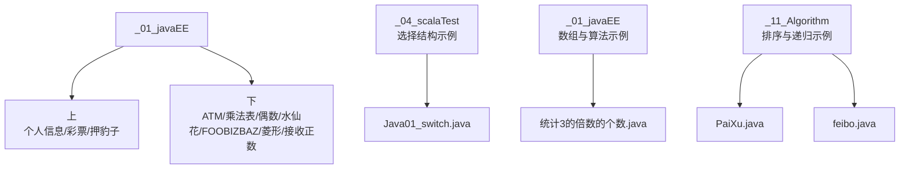

**章节来源**
- file://_01_javaEE/src/main/java/_03_流程控制/上/第1题_输入个人信息.java#L1-L29
- file://_01_javaEE/src/main/java/_03_流程控制/下/第5题_ATM.java#L1-L54
- file://_04_scalaTest/src/main/java/com/atguigu/java/chapter08/Java01_switch.java#L1-L21
- file://_01_javaEE/src/main/java/_04_数组/一维数组基本算法/第6题_统计3的倍数的个数.java#L1-L43
- file://_11_Algorithm/src/main/java/_50_算法/_01_排序/PaiXu.java#L1-L45
- file://_11_Algorithm/src/main/java/_11_递归/feibo.java#L1-L61

## 核心组件
- 顺序结构：按语句出现顺序依次执行，体现为示例中从键盘读取输入、赋值、输出等线性步骤。
- 选择结构：if-else用于多分支判定；switch-case用于离散值的多路分支。
- 循环结构：for适合已知次数或范围的迭代；while/do-while适合基于条件的反复执行。

典型应用示例：
- 顺序结构：个人信息输入、随机数生成与输出。
- 选择结构：ATM菜单处理（switch）、彩票中奖规则判定（if-else）。
- 循环结构：九九乘法表（双重for）、水仙花数枚举、菱形图案打印、接收两个正数并校验（do-while）。

**章节来源**
- file://_01_javaEE/src/main/java/_03_流程控制/上/第1题_输入个人信息.java#L1-L29
- file://_01_javaEE/src/main/java/_03_流程控制/下/第5题_ATM.java#L1-L54
- file://_01_javaEE/src/main/java/_03_流程控制/下/第6题_九九乘法表.java#L1-L19
- file://_01_javaEE/src/main/java/_03_流程控制/下/第2题_水仙花数.java#L1-L27
- file://_01_javaEE/src/main/java/_03_流程控制/下/第7题_菱形.java#L1-L36
- file://_01_javaEE/src/main/java/_03_流程控制/下/第4题_接收2个正数.java#L1-L46
- file://_01_javaEE/src/main/java/_03_流程控制/上/第7题_彩票.java#L1-L70

## 架构总览
以“输入—判定—输出”为主线，结合循环与嵌套循环完成复杂任务。下图展示了典型流程控制在示例中的组合方式。

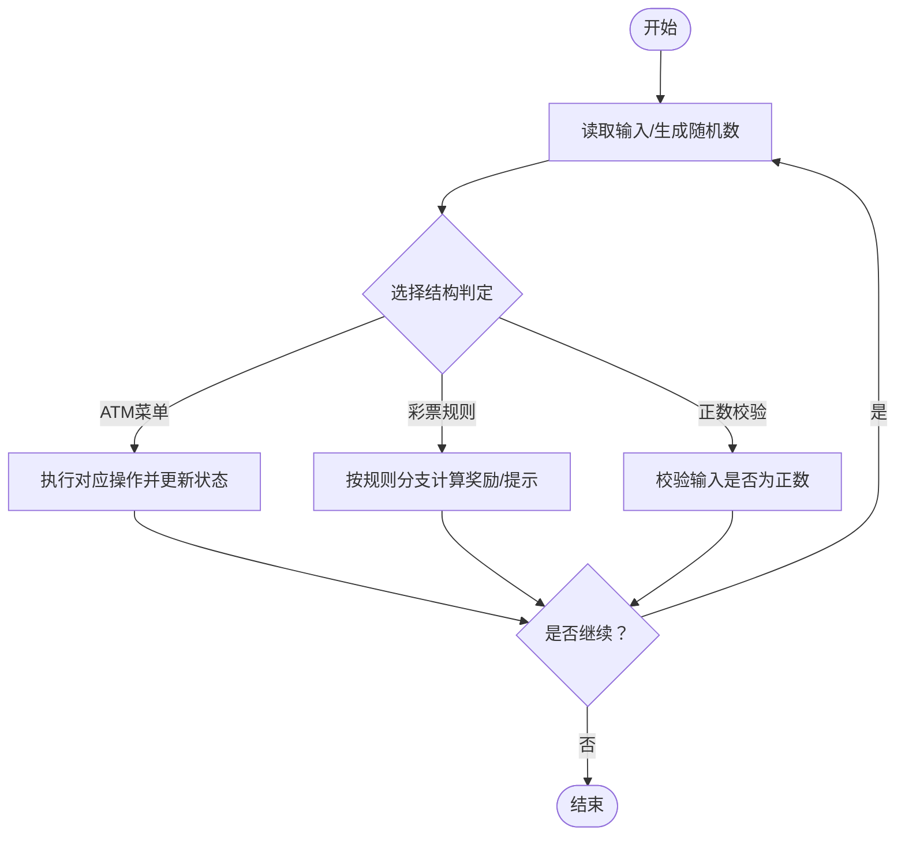

**图表来源**
- file://_01_javaEE/src/main/java/_03_流程控制/下/第5题_ATM.java#L1-L54
- file://_01_javaEE/src/main/java/_03_流程控制/上/第7题_彩票.java#L1-L70
- file://_01_javaEE/src/main/java/_03_流程控制/下/第4题_接收2个正数.java#L1-L46

## 详细组件分析

### 组件A：顺序结构与输入输出（个人信息）
- 关键点：Scanner读取字符串与整数；按顺序输出结果。
- 学习要点：变量命名规范、输入输出格式化、顺序执行的直观性。

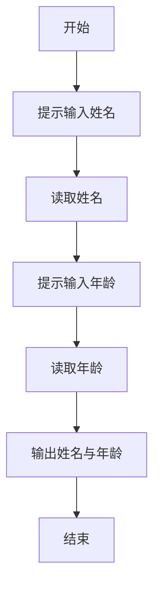

**图表来源**
- file://_01_javaEE/src/main/java/_03_流程控制/上/第1题_输入个人信息.java#L1-L29

**章节来源**
- file://_01_javaEE/src/main/java/_03_流程控制/上/第1题_输入个人信息.java#L1-L29

### 组件B：选择结构（if-else）——彩票游戏
- 关键点：随机生成两位数；拆分十位与个位；多级if-else覆盖完全匹配、数字全对但顺序不同、顺序匹配一项、非顺序匹配一项、无匹配五种情形。
- 学习要点：else-if链的穷举覆盖、数值拆分技巧、分支顺序与可读性。

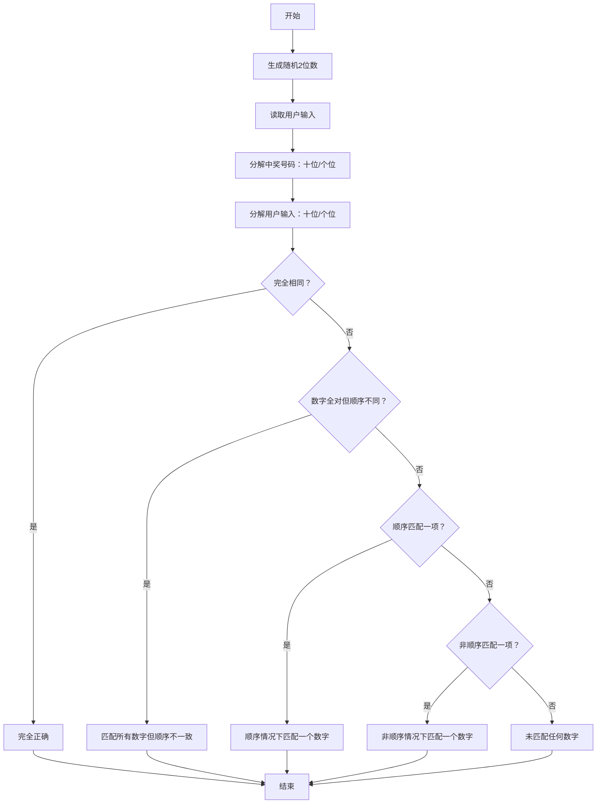

**图表来源**
- file://_01_javaEE/src/main/java/_03_流程控制/上/第7题_彩票.java#L1-L70

**章节来源**
- file://_01_javaEE/src/main/java/_03_流程控制/上/第7题_彩票.java#L1-L70

### 组件C：选择结构（switch-case）——ATM菜单
- 关键点：无限循环显示菜单；根据用户选择执行存款、取款、查询余额或退出；金额输入仅在涉及存取时触发。
- 学习要点：switch的case分支与break；while(true)与return退出；状态变量（余额）的更新。

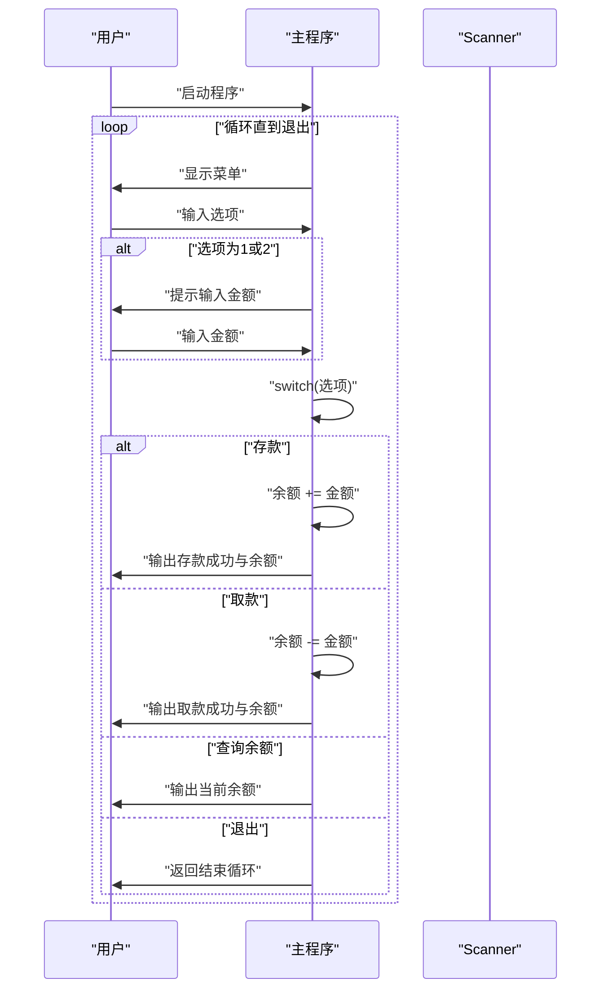

**图表来源**
- file://_01_javaEE/src/main/java/_03_流程控制/下/第5题_ATM.java#L1-L54

**章节来源**
- file://_01_javaEE/src/main/java/_03_流程控制/下/第5题_ATM.java#L1-L54

### 组件D：循环结构（for）——九九乘法表与水仙花数
- 九九乘法表：外层i从1到8，内层j从1到i，逐行打印乘法表达式并换行。
- 水仙花数：遍历0到999，分离个、十、百位，判断各位立方和是否等于原数。

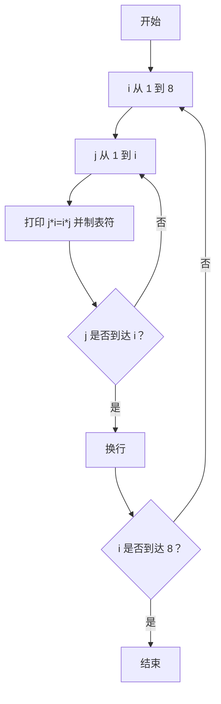

**图表来源**
- file://_01_javaEE/src/main/java/_03_流程控制/下/第6题_九九乘法表.java#L1-L19

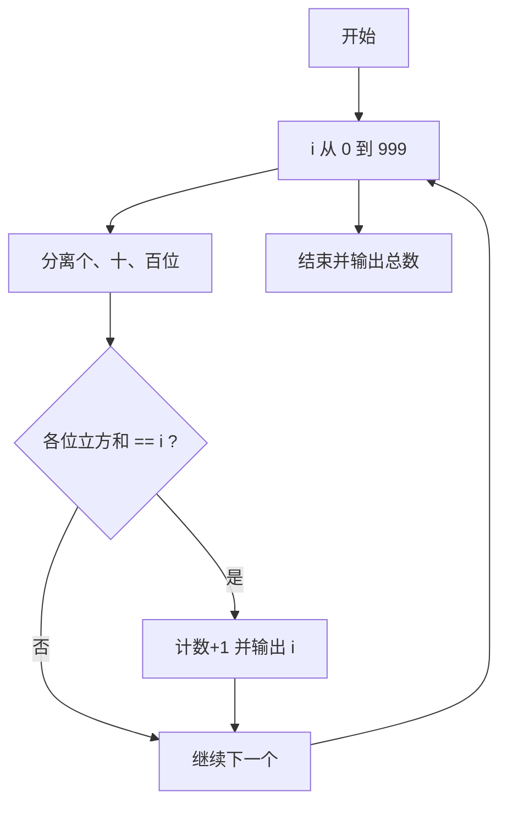

**图表来源**
- file://_01_javaEE/src/main/java/_03_流程控制/下/第2题_水仙花数.java#L1-L27

**章节来源**
- file://_01_javaEE/src/main/java/_03_流程控制/下/第6题_九九乘法表.java#L1-L19
- file://_01_javaEE/src/main/java/_03_流程控制/下/第2题_水仙花数.java#L1-L27

### 组件E：循环结构（do-while）——接收两个正数
- 关键点：先读取第一个数，若为负则提示重新输入；再读取第二个数，若为负同样提示；当两次均为正数时输出m与n；以特定终止值结束循环。
- 学习要点：do-while保证至少执行一次；输入校验与错误提示；局部变量作用域与生命周期。

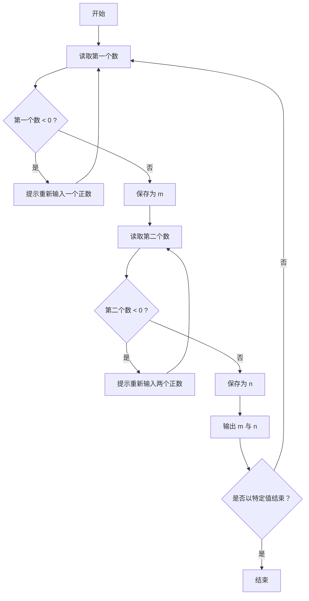

**图表来源**
- file://_01_javaEE/src/main/java/_03_流程控制/下/第4题_接收2个正数.java#L1-L46

**章节来源**
- file://_01_javaEE/src/main/java/_03_流程控制/下/第4题_接收2个正数.java#L1-L46

### 组件F：循环嵌套与模式打印（菱形）
- 关键点：两段双重循环分别绘制上半部与下半部菱形；通过空格与星号数量的数学关系控制形状。
- 学习要点：嵌套循环的内外层变量独立管理；数学规律抽象与公式复用。

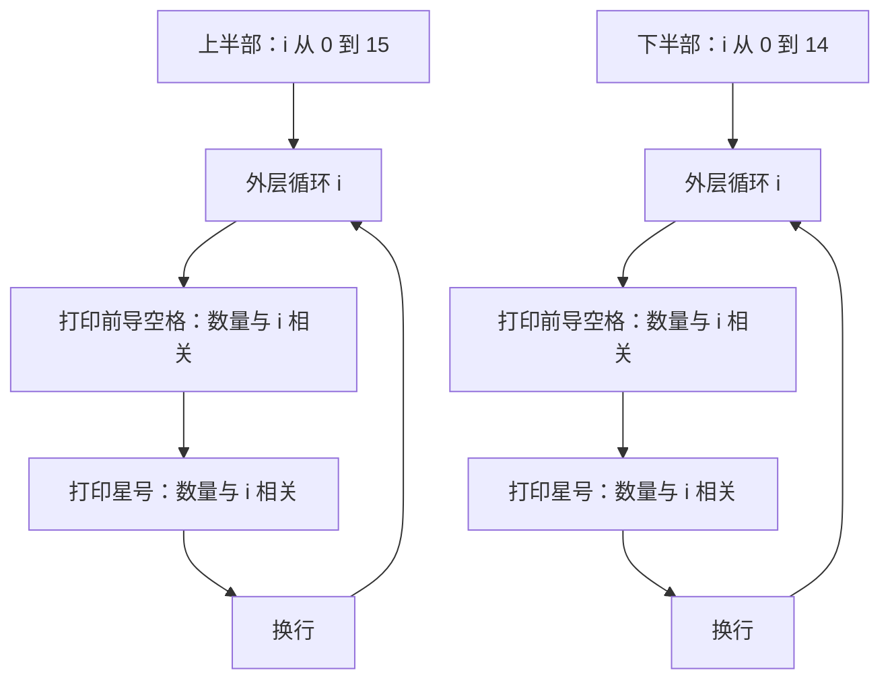

**图表来源**
- file://_01_javaEE/src/main/java/_03_流程控制/下/第7题_菱形.java#L1-L36

**章节来源**
- file://_01_javaEE/src/main/java/_03_流程控制/下/第7题_菱形.java#L1-L36

### 组件G：数组与循环结合（统计3的倍数）
- 关键点：生成固定长度数组并填充随机数；遍历数组统计3的倍数个数；使用冒泡排序对数组进行降序排列。
- 学习要点：数组初始化与访问；循环中条件判断与计数；排序算法的边界与提前终止优化。

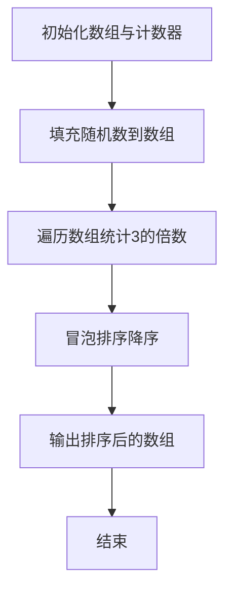

**图表来源**
- file://_01_javaEE/src/main/java/_04_数组/一维数组基本算法/第6题_统计3的倍数的个数.java#L1-L43

**章节来源**
- file://_01_javaEE/src/main/java/_04_数组/一维数组基本算法/第6题_统计3的倍数的个数.java#L1-L43

### 组件H：排序与递归（斐波那契）
- 排序：冒泡排序演示外层控制轮数、内层比较相邻元素、提前终止标志。
- 递归：斐波那契数列的递归定义与数组迭代实现对比。

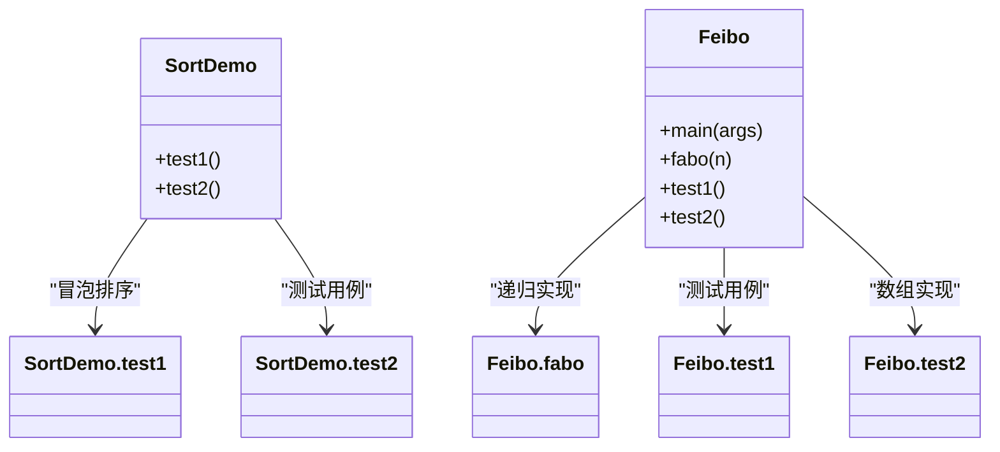

**图表来源**
- file://_11_Algorithm/src/main/java/_50_算法/_01_排序/PaiXu.java#L1-L45
- file://_11_Algorithm/src/main/java/_11_递归/feibo.java#L1-L61

**章节来源**
- file://_11_Algorithm/src/main/java/_50_算法/_01_排序/PaiXu.java#L1-L45
- file://_11_Algorithm/src/main/java/_11_递归/feibo.java#L1-L61

### 组件I：switch选择结构（Java示例）
- 关键点：switch对离散值进行分支处理；default分支可选；每个case后需break避免贯穿。

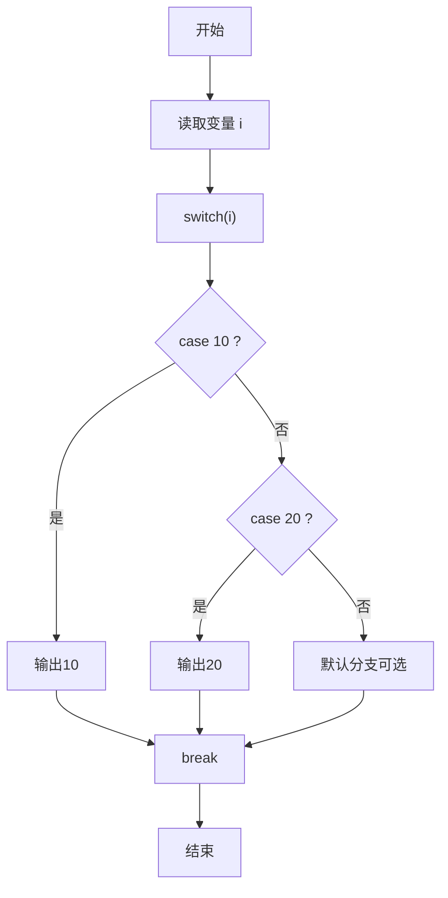

**图表来源**
- file://_04_scalaTest/src/main/java/com/atguigu/java/chapter08/Java01_switch.java#L1-L21

**章节来源**
- file://_04_scalaTest/src/main/java/com/atguigu/java/chapter08/Java01_switch.java#L1-L21

## 依赖分析
- 组件耦合：各示例相对独立，主要依赖Scanner与Math.random等标准库；少数示例间存在数据与逻辑上的间接关联（如彩票与随机数生成）。
- 外部依赖：java.util.Scanner、java.lang.Math。
- 循环与嵌套：菱形打印、乘法表、水仙花数均体现双层循环的组合使用；数组示例引入排序算法与条件统计。
- 递归与迭代：斐波那契提供递归与数组两种实现思路，便于对比性能与理解。

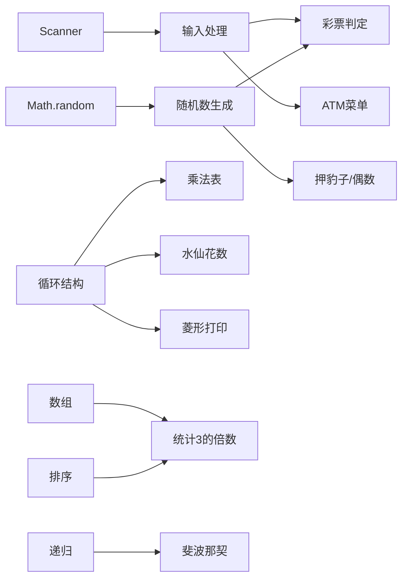

**图表来源**
- file://_01_javaEE/src/main/java/_03_流程控制/上/第7题_彩票.java#L1-L70
- file://_01_javaEE/src/main/java/_03_流程控制/下/第5题_ATM.java#L1-L54
- file://_01_javaEE/src/main/java/_03_流程控制/下/第6题_九九乘法表.java#L1-L19
- file://_01_javaEE/src/main/java/_03_流程控制/下/第2题_水仙花数.java#L1-L27
- file://_01_javaEE/src/main/java/_03_流程控制/下/第7题_菱形.java#L1-L36
- file://_01_javaEE/src/main/java/_04_数组/一维数组基本算法/第6题_统计3的倍数的个数.java#L1-L43
- file://_11_Algorithm/src/main/java/_11_递归/feibo.java#L1-L61

**章节来源**
- file://_01_javaEE/src/main/java/_03_流程控制/上/第7题_彩票.java#L1-L70
- file://_01_javaEE/src/main/java/_03_流程控制/下/第5题_ATM.java#L1-L54
- file://_01_javaEE/src/main/java/_03_流程控制/下/第6题_九九乘法表.java#L1-L19
- file://_01_javaEE/src/main/java/_03_流程控制/下/第2题_水仙花数.java#L1-L27
- file://_01_javaEE/src/main/java/_03_流程控制/下/第7题_菱形.java#L1-L36
- file://_01_javaEE/src/main/java/_04_数组/一维数组基本算法/第6题_统计3的倍数的个数.java#L1-L43
- file://_11_Algorithm/src/main/java/_11_递归/feibo.java#L1-L61

## 性能考量
- 循环次数与边界：for循环的边界设置直接影响时间复杂度；内层循环应尽量减少不必要的比较。
- 提前终止：排序示例中通过布尔标志检测是否已有序，从而提前结束，降低无效比较次数。
- I/O开销：频繁的键盘输入与输出会影响性能，建议批量处理或减少交互次数。
- 数据规模：数组规模增大时，排序与统计的时间复杂度随之上升，应优先选择合适的数据结构与算法。

[本节为通用指导，无需列出具体文件来源]

## 故障排查指南
- switch未写break导致贯穿：检查每个case后是否添加break，避免意外执行后续分支。
- while(true)无法退出：确认退出条件与return/continue/break的使用是否正确。
- do-while输入校验死循环：确保输入更新与循环条件判断逻辑一致，避免遗漏更新。
- 循环变量作用域：局部变量仅在块内有效，避免在块外误用。
- 数学拆分与边界：水仙花数与彩票拆位时注意取模与整除的边界情况。

**章节来源**
- file://_01_javaEE/src/main/java/_03_流程控制/下/第5题_ATM.java#L1-L54
- file://_01_javaEE/src/main/java/_03_流程控制/下/第4题_接收2个正数.java#L1-L46
- file://_01_javaEE/src/main/java/_03_流程控制/上/第7题_彩票.java#L1-L70
- file://_01_javaEE/src/main/java/_03_流程控制/下/第2题_水仙花数.java#L1-L27

## 结论
通过对仓库中流程控制示例的系统梳理，可以发现顺序、选择与循环三大结构在实际问题中的灵活组合与广泛应用。从简单的输入输出到复杂的嵌套循环与算法实现，逐步加深对程序逻辑的理解与掌控力。建议在实践中不断总结分支覆盖、循环边界、提前终止等技巧，形成稳定可靠的编码习惯。

[本节为总结性内容，无需列出具体文件来源]

## 附录：练习与进阶
- 基础练习
  - 输出1到100之间的所有偶数（参考随机偶数生成思路）。
  - 编写一个程序，打印指定行数的空心菱形。
  - 输入若干个整数，统计其中正数、负数与零的个数。
- 进阶练习
  - 使用冒泡排序对学生成绩进行升序排序，并统计不及格人数。
  - 实现斐波那契数列的递归与迭代版本，比较性能差异。
  - 设计一个简易的计算器，支持加减乘除与连续计算。
- 综合实战
  - 开发一个“幸运数字”小游戏：用户输入一个三位数，程序随机生成目标数，给出“大了/小了/正确”的提示，统计猜测次数。
  - 实现一个学生成绩管理系统，支持录入、查询、排序与统计功能。

[本节为练习建议，无需列出具体文件来源]