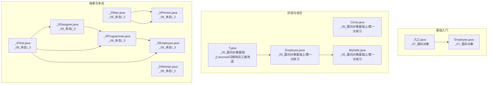
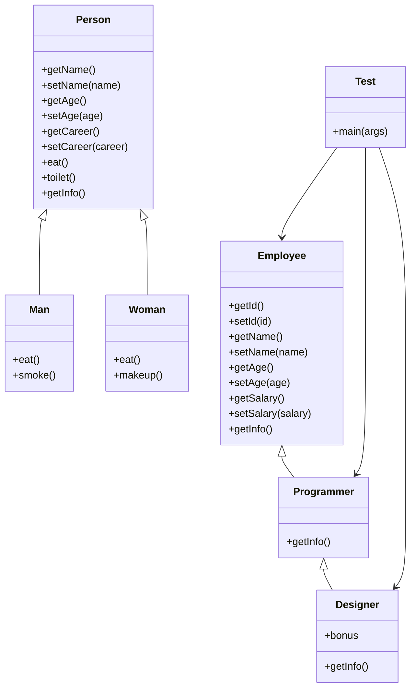
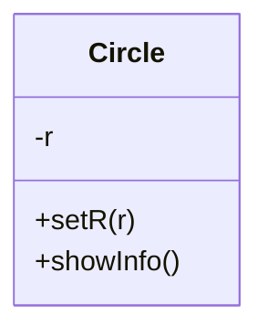
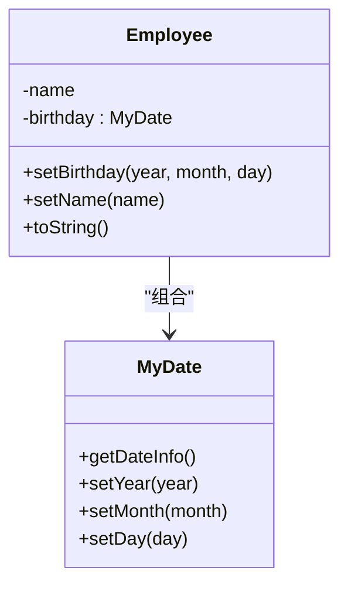
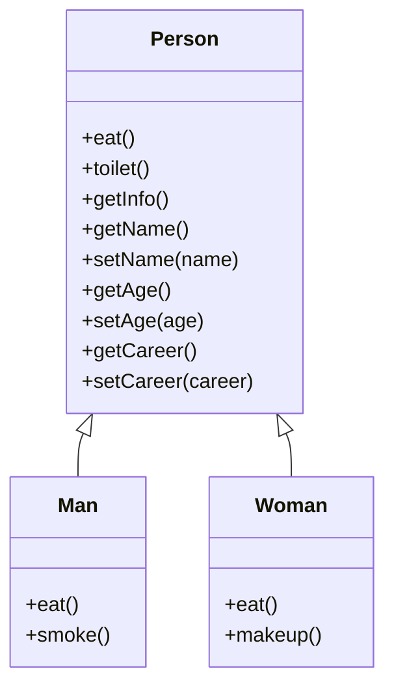
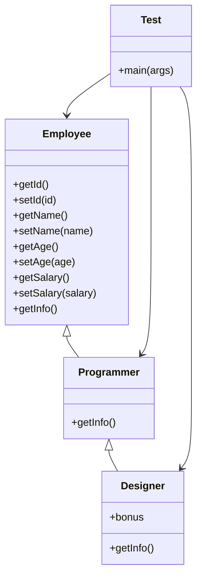
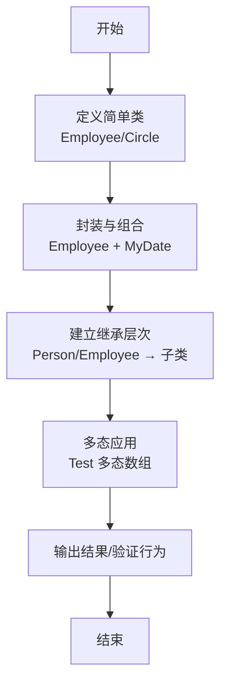
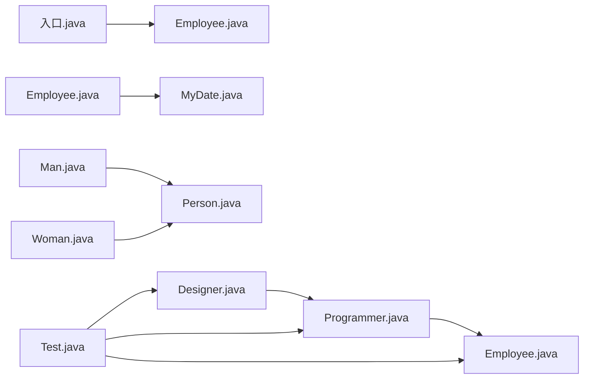

# 面向对象编程基础

<cite>
**本文引用的文件**
- [_01_javaEE/src/main/java/_07_面向对象/Employee.java](file://_01_javaEE/src/main/java/_07_面向对象/Employee.java)
- [_01_javaEE/src/main/java/_07_面向对象/入口.java](file://_01_javaEE/src/main/java/_07_面向对象/入口.java)
- [_01_javaEE/src/main/java/_05_面向对象基础上/第一次练习/Circle.java](file://_01_javaEE/src/main/java/_05_面向对象基础上/第一次练习/Circle.java)
- [_01_javaEE/src/main/java/_05_面向对象基础上/第一次练习/Employee.java](file://_01_javaEE/src/main/java/_05_面向对象基础上/第一次练习/Employee.java)
- [_01_javaEE/src/main/java/_05_面向对象基础上/第一次练习/MyDate.java](file://_01_javaEE/src/main/java/_05_面向对象基础上/第一次练习/MyDate.java)
- [_01_javaEE/src/main/java/_05_面向对象基础上/second/日期和员工类改造/T.java](file://_01_javaEE/src/main/java/_05_面向对象基础上/second/日期和员工类改造/T.java)
- [_01_javaEE/src/main/java/_09_多态/_2/Person.java](file://_01_javaEE/src/main/java/_09_多态/_2/Person.java)
- [_01_javaEE/src/main/java/_09_多态/_2/Man.java](file://_01_javaEE/src/main/java/_09_多态/_2/Man.java)
- [_01_javaEE/src/main/java/_09_多态/_2/Woman.java](file://_01_javaEE/src/main/java/_09_多态/_2/Woman.java)
- [_01_javaEE/src/main/java/_09_多态/_3/Employee.java](file://_01_javaEE/src/main/java/_09_多态/_3/Employee.java)
- [_01_javaEE/src/main/java/_09_多态/_3/Programmer.java](file://_01_javaEE/src/main/java/_09_多态/_3/Programmer.java)
- [_01_javaEE/src/main/java/_09_多态/_3/Designer.java](file://_01_javaEE/src/main/java/_09_多态/_3/Designer.java)
- [_01_javaEE/src/main/java/_09_多态/_3/Test.java](file://_01_javaEE/src/main/java/_09_多态/_3/Test.java)
</cite>

## 目录
1. 引言
2. 项目结构
3. 核心组件
4. 架构总览
5. 详细组件分析
6. 依赖分析
7. 性能考虑
8. 故障排查指南
9. 结论
10. 附录

## 引言
本学习文档围绕“面向对象编程基础”展开，结合仓库中的多个示例文件，系统讲解类与对象的关系、封装性、继承性与多态性的基本原理。通过 Circle 类、Employee 类、Person/Man/Woman 继承体系、以及多态数组与方法重写等案例，帮助读者从简单类定义逐步过渡到复杂对象设计与运行时行为的掌握。同时，文档强调面向对象设计的基本原则与最佳实践，使初学者能够循序渐进地理解并应用这些核心概念。

## 项目结构
本仓库中与“面向对象基础”直接相关的示例主要分布在以下路径：
- 基础入门与对象创建：_07_面向对象
- 封装与组合（含自定义类型）：_05_面向对象基础上/第一次练习
- 继承与多态：_09_多态/_2 与 _09_多态/_3

下面以图示方式概览这些模块之间的关系与职责分工：

图表来源
- [_07_面向对象/Employee.java](file://_01_javaEE/src/main/java/_07_面向对象/Employee.java#L1-L24)
- [_07_面向对象/入口.java](file://_01_javaEE/src/main/java/_07_面向对象/入口.java#L1-L119)
- [_05_面向对象基础上/第一次练习/Circle.java](file://_01_javaEE/src/main/java/_05_面向对象基础上/第一次练习/Circle.java#L1-L20)
- [_05_面向对象基础上/第一次练习/Employee.java](file://_01_javaEE/src/main/java/_05_面向对象基础上/第一次练习/Employee.java#L1-L53)
- [_05_面向对象基础上/第一次练习/MyDate.java](file://_01_javaEE/src/main/java/_05_面向对象基础上/第一次练习/MyDate.java#L1-L71)
- [_05_面向对象基础上/second/日期和员工类改造/T.java](file://_01_javaEE/src/main/java/_05_面向对象基础上/second/日期和员工类改造/T.java#L1-L23)
- [_09_多态/_2/Person.java](file://_01_javaEE/src/main/java/_09_多态/_2/Person.java#L1-L61)
- [_09_多态/_2/Man.java](file://_01_javaEE/src/main/java/_09_多态/_2/Man.java#L1-L20)
- [_09_多态/_2/Woman.java](file://_01_javaEE/src/main/java/_09_多态/_2/Woman.java#L1-L19)
- [_09_多态/_3/Employee.java](file://_01_javaEE/src/main/java/_09_多态/_3/Employee.java#L1-L55)
- [_09_多态/_3/Programmer.java](file://_01_javaEE/src/main/java/_09_多态/_3/Programmer.java#L1-L19)
- [_09_多态/_3/Designer.java](file://_01_javaEE/src/main/java/_09_多态/_3/Designer.java#L1-L19)
- [_09_多态/_3/Test.java](file://_01_javaEE/src/main/java/_09_多态/_3/Test.java#L1-L26)

章节来源
- file://_01_javaEE/src/main/java/_07_面向对象/Employee.java#L1-L24
- file://_01_javaEE/src/main/java/_07_面向对象/入口.java#L1-L119
- file://_01_javaEE/src/main/java/_05_面向对象基础上/第一次练习/Circle.java#L1-L20
- file://_01_javaEE/src/main/java/_05_面向对象基础上/第一次练习/Employee.java#L1-L53
- file://_01_javaEE/src/main/java/_05_面向对象基础上/第一次练习/MyDate.java#L1-L71
- file://_01_javaEE/src/main/java/_05_面向对象基础上/second/日期和员工类改造/T.java#L1-L23
- file://_01_javaEE/src/main/java/_09_多态/_2/Person.java#L1-L61
- file://_01_javaEE/src/main/java/_09_多态/_2/Man.java#L1-L20
- file://_01_javaEE/src/main/java/_09_多态/_2/Woman.java#L1-L19
- file://_01_javaEE/src/main/java/_09_多态/_3/Employee.java#L1-L55
- file://_01_javaEE/src/main/java/_09_多态/_3/Programmer.java#L1-L19
- file://_01_javaEE/src/main/java/_09_多态/_3/Designer.java#L1-L19
- file://_01_javaEE/src/main/java/_09_多态/_3/Test.java#L1-L26

## 核心组件
本节聚焦于面向对象的四大支柱：类与对象、封装、继承、多态，并结合仓库中的具体示例进行说明。

- 类与对象
  - 类是对一类具有相同属性与行为的对象的抽象描述；对象是类的具体实例。
  - 示例：_07_面向对象/Employee.java 定义了员工类的基本结构；_07_面向对象/入口.java 展示了如何创建对象并访问其成员。
  - 关键点：对象的创建使用 new 关键字；对象之间相互独立，拥有各自的成员变量副本。

- 封装
  - 通过将数据（成员变量）私有化（private），并提供公共的 getter/setter 方法，实现对内部状态的受控访问。
  - 示例：_09_多态/_3/Employee.java 中的私有字段与对应的访问器方法体现了封装思想；_05_面向对象基础上/第一次练习/Employee.java 通过组合 MyDate 实现更复杂的封装。
  - 关键点：封装提升安全性与可维护性；避免外部直接操作内部状态。

- 继承
  - 子类通过 extends 继承父类的成员（除被 private 修饰且无 public 访问器外），从而复用代码并扩展功能。
  - 示例：_09_多态/_2/Man.java 与 _09_多态/_2/Woman.java 继承自 _09_多态/_2/Person.java；_09_多态/_3/Programmer.java 继承自 _09_多态/_3/Employee.java。
  - 关键点：继承体现“是一个”的关系；子类可新增字段与方法，也可覆盖父类方法。

- 多态
  - 同一接口在不同对象上的不同实现；通常通过父类引用指向子类对象实现。
  - 示例：_09_多态/_3/Test.java 使用父类数组存储多种子类对象，并统一调用 getInfo()，体现了多态行为。
  - 关键点：运行时根据实际对象类型决定调用哪个方法；重写（override）是多态的基础。

章节来源
- file://_01_javaEE/src/main/java/_07_面向对象/Employee.java#L1-L24
- file://_01_javaEE/src/main/java/_07_面向对象/入口.java#L1-L119
- file://_01_javaEE/src/main/java/_09_多态/_3/Employee.java#L1-L55
- file://_01_javaEE/src/main/java/_05_面向对象基础上/第一次练习/Employee.java#L1-L53
- file://_01_javaEE/src/main/java/_09_多态/_2/Person.java#L1-L61
- file://_01_javaEE/src/main/java/_09_多态/_2/Man.java#L1-L20
- file://_01_javaEE/src/main/java/_09_多态/_2/Woman.java#L1-L19
- file://_01_javaEE/src/main/java/_09_多态/_3/Programmer.java#L1-L19
- file://_01_javaEE/src/main/java/_09_多态/_3/Designer.java#L1-L19
- file://_01_javaEE/src/main/java/_09_多态/_3/Test.java#L1-L26

## 架构总览
下图展示了从“简单类定义”到“继承与多态”的演进路径，以及各模块之间的依赖关系：

图表来源
- [_09_多态/_2/Person.java](file://_01_javaEE/src/main/java/_09_多态/_2/Person.java#L1-L61)
- [_09_多态/_2/Man.java](file://_01_javaEE/src/main/java/_09_多态/_2/Man.java#L1-L20)
- [_09_多态/_2/Woman.java](file://_01_javaEE/src/main/java/_09_多态/_2/Woman.java#L1-L19)
- [_09_多态/_3/Employee.java](file://_01_javaEE/src/main/java/_09_多态/_3/Employee.java#L1-L55)
- [_09_多态/_3/Programmer.java](file://_01_javaEE/src/main/java/_09_多态/_3/Programmer.java#L1-L19)
- [_09_多态/_3/Designer.java](file://_01_javaEE/src/main/java/_09_多态/_3/Designer.java#L1-L19)
- [_09_多态/_3/Test.java](file://_01_javaEE/src/main/java/_09_多态/_3/Test.java#L1-L26)

## 详细组件分析

### 组件A：Circle 类（封装与成员方法）
- 设计目标：演示封装与成员方法的使用，通过私有半径字段与公开的设置与展示方法，完成圆的属性管理与信息输出。
- 关键点：
  - 私有字段 r，通过 setR 控制赋值；
  - showInfo 输出半径、周长与面积，体现方法的职责单一。
- 适用场景：教学演示封装与方法设计。

图表来源
- [_05_面向对象基础上/第一次练习/Circle.java](file://_01_javaEE/src/main/java/_05_面向对象基础上/第一次练习/Circle.java#L1-L20)

章节来源
- file://_01_javaEE/src/main/java/_05_面向对象基础上/第一次练习/Circle.java#L1-L20

### 组件B：Employee 类（封装与组合）
- 设计目标：展示员工信息的封装，包含姓名与生日（MyDate）的组合。
- 关键点：
  - 私有字段 name 与 birthday（MyDate 实例）；
  - 提供 setBirthday 年/月/日 的设置方法；
  - 重写 toString 输出员工信息，体现封装与组合的价值。
- 适用场景：面向对象封装与对象组合的入门示例。

图表来源
- [_05_面向对象基础上/第一次练习/Employee.java](file://_01_javaEE/src/main/java/_05_面向对象基础上/第一次练习/Employee.java#L1-L53)
- [_05_面向对象基础上/第一次练习/MyDate.java](file://_01_javaEE/src/main/java/_05_面向对象基础上/第一次练习/MyDate.java#L1-L71)

章节来源
- file://_01_javaEE/src/main/java/_05_面向对象基础上/第一次练习/Employee.java#L1-L53
- file://_01_javaEE/src/main/java/_05_面向对象基础上/第一次练习/MyDate.java#L1-L71

### 组件C：Person/Man/Woman（继承与重写）
- 设计目标：演示继承关系与方法重写，子类在不改变接口的前提下改变行为。
- 关键点：
  - Person 定义通用行为（eat、toilet、getInfo 等）；
  - Man 与 Woman 通过 override 改写 eat 行为；
  - 子类新增特有方法（如 Man.smoke、Woman.makeup）。
- 适用场景：继承层次与多态行为的直观示例。

图表来源
- [_09_多态/_2/Person.java](file://_01_javaEE/src/main/java/_09_多态/_2/Person.java#L1-L61)
- [_09_多态/_2/Man.java](file://_01_javaEE/src/main/java/_09_多态/_2/Man.java#L1-L20)
- [_09_多态/_2/Woman.java](file://_01_javaEE/src/main/java/_09_多态/_2/Woman.java#L1-L19)

章节来源
- file://_01_javaEE/src/main/java/_09_多态/_2/Person.java#L1-L61
- file://_01_javaEE/src/main/java/_09_多态/_2/Man.java#L1-L20
- file://_01_javaEE/src/main/java/_09_多态/_2/Woman.java#L1-L19

### 组件D：Employee/Programmer/Designer（多态数组与重写）
- 设计目标：演示多态在数组中的应用，父类引用指向不同子类对象，统一调用同一方法却产生不同行为。
- 关键点：
  - Employee 定义 getInfo；
  - Programmer 与 Designer 重写 getInfo，并在必要时调用 super；
  - Test 中使用 Employee[] 存储多种子类对象，遍历统一输出，体现多态。
- 适用场景：多态的实际应用与运行时分派。

图表来源
- [_09_多态/_3/Employee.java](file://_01_javaEE/src/main/java/_09_多态/_3/Employee.java#L1-L55)
- [_09_多态/_3/Programmer.java](file://_01_javaEE/src/main/java/_09_多态/_3/Programmer.java#L1-L19)
- [_09_多态/_3/Designer.java](file://_01_javaEE/src/main/java/_09_多态/_3/Designer.java#L1-L19)
- [_09_多态/_3/Test.java](file://_01_javaEE/src/main/java/_09_多态/_3/Test.java#L1-L26)

章节来源
- file://_01_javaEE/src/main/java/_09_多态/_3/Employee.java#L1-L55
- file://_01_javaEE/src/main/java/_09_多态/_3/Programmer.java#L1-L19
- file://_01_javaEE/src/main/java/_09_多态/_3/Designer.java#L1-L19
- file://_01_javaEE/src/main/java/_09_多态/_3/Test.java#L1-L26

### 组件E：从简单类到复杂对象设计的完整流程
- 步骤一：定义简单类（如 Employee、Circle），明确职责与成员。
- 步骤二：引入封装与组合（如 Employee 组合 MyDate），提升内聚性与可维护性。
- 步骤三：建立继承层次（Person → Man/Woman；Employee → Programmer → Designer），复用与扩展并存。
- 步骤四：利用多态统一处理不同对象（Test 中的多态数组），实现运行时行为差异。

（该图为概念流程示意，无需图表来源）

## 依赖分析
- 模块耦合关系
  - _07_面向对象/入口.java 依赖 _07_面向对象/Employee.java 创建对象并访问成员。
  - _05_面向对象基础上/第一次练习/Employee.java 依赖 _05_面向对象基础上/第一次练习/MyDate.java 进行日期封装。
  - _09_多态/_2/Man.java 与 _09_多态/_2/Woman.java 依赖 _09_多态/_2/Person.java。
  - _09_多态/_3/Programmer.java 与 _09_多态/_3/Designer.java 依赖 _09_多态/_3/Employee.java。
  - _09_多态/_3/Test.java 依赖 Employee、Programmer、Designer 三者，形成多态数组。
- 可能的循环依赖
  - 当前示例未见循环依赖；若自行扩展，请避免子类反向引用父类容器或工具类。
- 外部依赖
  - 示例均为标准库与 JUnit 测试注解，无额外第三方依赖。

图表来源
- [_07_面向对象/入口.java](file://_01_javaEE/src/main/java/_07_面向对象/入口.java#L1-L119)
- [_07_面向对象/Employee.java](file://_01_javaEE/src/main/java/_07_面向对象/Employee.java#L1-L24)
- [_05_面向对象基础上/第一次练习/Employee.java](file://_01_javaEE/src/main/java/_05_面向对象基础上/第一次练习/Employee.java#L1-L53)
- [_05_面向对象基础上/第一次练习/MyDate.java](file://_01_javaEE/src/main/java/_05_面向对象基础上/FirstPractice/MyDate.java#L1-L71)
- [_09_多态/_2/Man.java](file://_01_javaEE/src/main/java/_09_多态/_2/Man.java#L1-L20)
- [_09_多态/_2/Woman.java](file://_01_javaEE/src/main/java/_09_多态/_2/Woman.java#L1-L19)
- [_09_多态/_2/Person.java](file://_01_javaEE/src/main/java/_09_多态/_2/Person.java#L1-L61)
- [_09_多态/_3/Programmer.java](file://_01_javaEE/src/main/java/_09_多态/_3/Programmer.java#L1-L19)
- [_09_多态/_3/Designer.java](file://_01_javaEE/src/main/java/_09_多态/_3/Designer.java#L1-L19)
- [_09_多态/_3/Employee.java](file://_01_javaEE/src/main/java/_09_多态/_3/Employee.java#L1-L55)
- [_09_多态/_3/Test.java](file://_01_javaEE/src/main/java/_09_多态/_3/Test.java#L1-L26)

章节来源
- file://_01_javaEE/src/main/java/_07_面向对象/入口.java#L1-L119
- file://_01_javaEE/src/main/java/_07_面向对象/Employee.java#L1-L24
- file://_01_javaEE/src/main/java/_05_面向对象基础上/第一次练习/Employee.java#L1-L53
- file://_01_javaEE/src/main/java/_05_面向对象基础上/第一次练习/MyDate.java#L1-L71
- file://_01_javaEE/src/main/java/_09_多态/_2/Man.java#L1-L20
- file://_01_javaEE/src/main/java/_09_多态/_2/Woman.java#L1-L19
- file://_01_javaEE/src/main/java/_09_多态/_2/Person.java#L1-L61
- file://_01_javaEE/src/main/java/_09_多态/_3/Programmer.java#L1-L19
- file://_01_javaEE/src/main/java/_09_多态/_3/Designer.java#L1-L19
- file://_01_javaEE/src/main/java/_09_多态/_3/Employee.java#L1-L55
- file://_01_javaEE/src/main/java/_09_多态/_3/Test.java#L1-L26

## 性能考虑
- 封装与组合
  - 合理拆分职责，避免在一个类中堆积过多逻辑，有助于降低复杂度与提升可维护性。
- 继承与多态
  - 适度使用继承，避免过深的继承层级；多态调用的开销极低，主要成本在于方法分派与对象内存占用。
- 对象创建
  - 在高频场景中，注意避免频繁创建临时对象；可结合工具类与缓存策略减少分配次数（本仓库示例未涉及）。
- 数据访问
  - 使用访问器方法而非直接暴露字段，便于后续加入校验、懒加载等优化（本仓库示例已体现）。

（本节为通用指导，无需章节来源）

## 故障排查指南
- 字段可见性问题
  - 若外部无法访问某成员，检查是否为 private 且缺少对应 getter/setter；参考 _09_多态/_3/Employee.java 的字段与访问器设计。
- 继承覆盖问题
  - 子类重写方法时需保持签名一致；若行为异常，检查是否遗漏 super 调用或覆盖逻辑错误；参考 _09_多态/_3/Programmer.java 与 _09_多态/_3/Designer.java 的 getInfo 重写。
- 多态调用不生效
  - 确认数组或变量的声明类型为父类，但实际存储的是子类对象；参考 _09_多态/_3/Test.java 的数组初始化与遍历。
- 组合对象初始化
  - 组合类必须先初始化内部对象再使用；参考 _05_面向对象基础上/第一次练习/Employee.java 中对 birthday 的 new 初始化。
- 构造方法与重载
  - 本仓库示例未显式定义构造方法；如需按需初始化，可在类中添加构造方法并遵循重载规则（同名方法、不同参数列表）。当前示例通过 setter 完成初始化，属于常见做法。

章节来源
- file://_01_javaEE/src/main/java/_09_多态/_3/Employee.java#L1-L55
- file://_01_javaEE/src/main/java/_09_多态/_3/Programmer.java#L1-L19
- file://_01_javaEE/src/main/java/_09_多态/_3/Designer.java#L1-L19
- file://_01_javaEE/src/main/java/_09_多态/_3/Test.java#L1-L26
- file://_01_javaEE/src/main/java/_05_面向对象基础上/第一次练习/Employee.java#L1-L53

## 结论
通过对仓库中多个示例的系统梳理，我们从“类与对象”出发，逐步深入到“封装、继承、多态”的核心概念，并结合 Circle、Employee、Person/Man/Woman、Employee/Programmer/Designer 等具体类，展示了从简单定义到复杂设计的完整过程。建议在实践中坚持“高内聚、低耦合”的设计原则，合理使用封装与组合，谨慎设计继承层次，并善用多态提升系统的可扩展性与可维护性。

（本节为总结性内容，无需章节来源）

## 附录
- 最佳实践清单
  - 明确职责：每个类只做一件事，方法职责单一。
  - 优先封装：私有字段 + 公共访问器，必要时加入校验。
  - 合理组合：当类 A 需要类 B 的能力时，优先组合而非过度继承。
  - 谨慎继承：仅在“是一个”关系成立时使用继承；避免过深层级。
  - 多态优先：面向父类编程，通过重写实现差异化行为。
  - 构造与初始化：若需强制初始化，提供构造方法；否则通过 setter 渐进式配置。
  - 单元测试：为关键逻辑编写测试，确保封装与重写的正确性。

（本节为通用指导，无需章节来源）