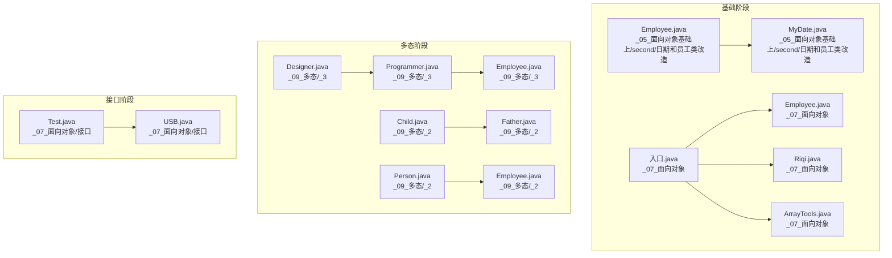
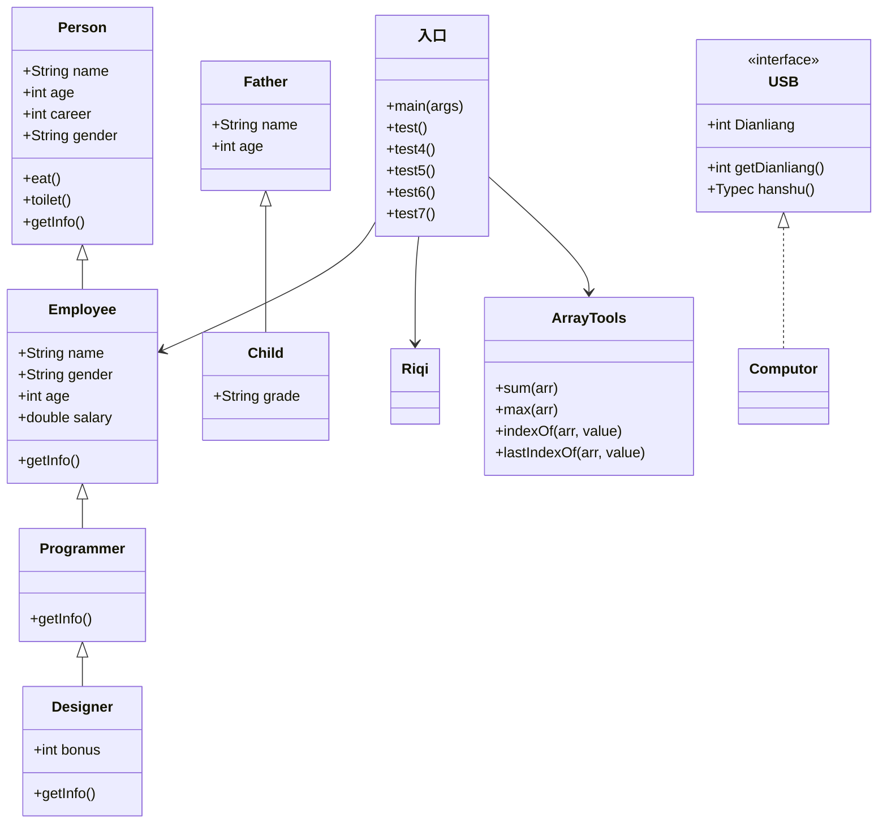
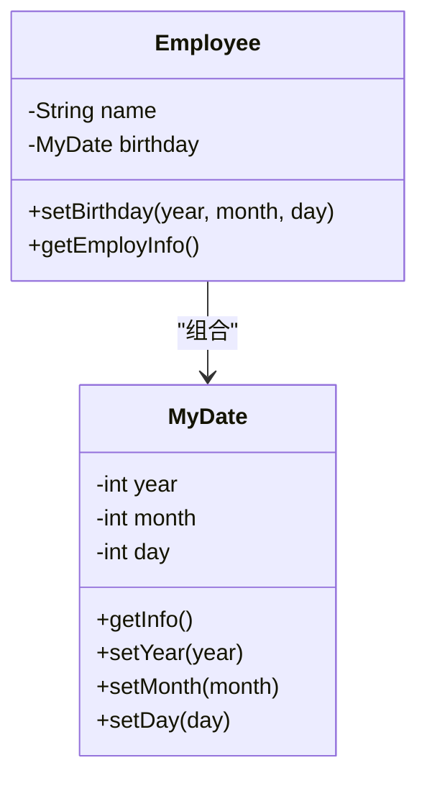
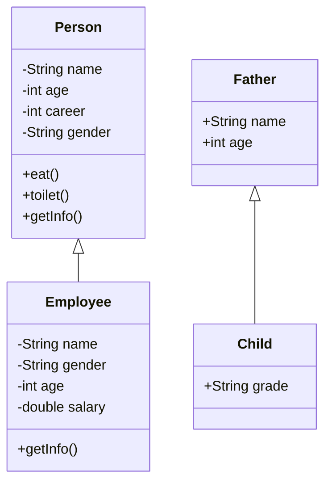
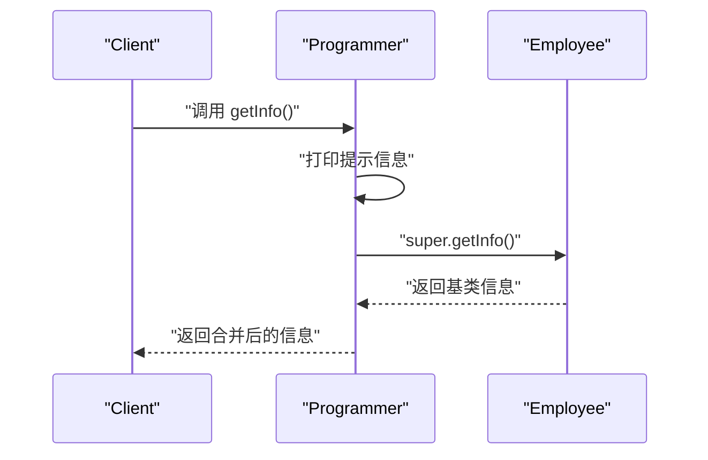
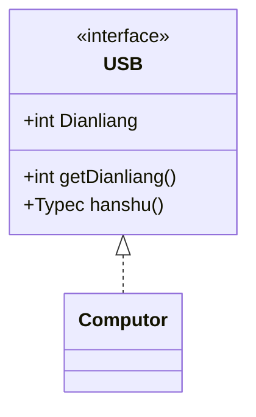
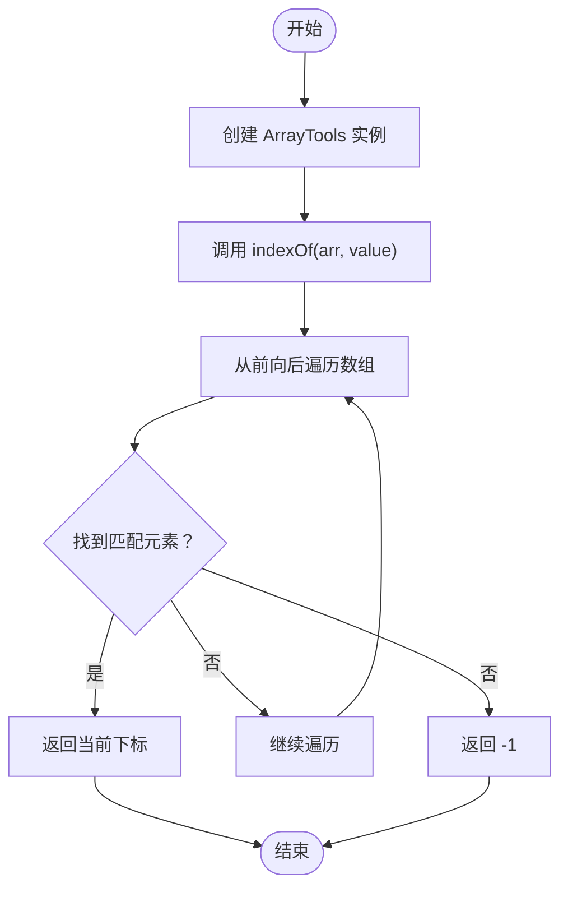
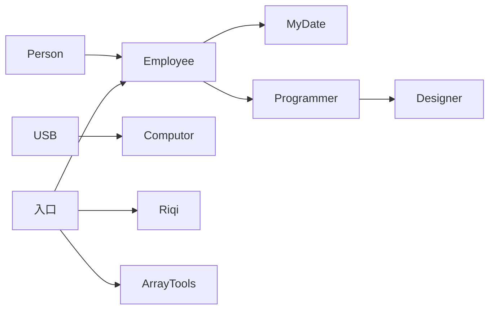

# 面向对象进阶

<cite>
**本文引用的文件**
- [Employee.java](file://_01_javaEE/src/main/java/_05_面向对象基础上/second/日期和员工类改造/Employee.java)
- [MyDate.java](file://_01_javaEE/src/main/java/_05_面向对象基础上/second/日期和员工类改造/MyDate.java)
- [Employee.java](file://_01_javaEE/src/main/java/_07_面向对象/Employee.java)
- [Riqi.java](file://_01_javaEE/src/main/java/_07_面向对象/Riqi.java)
- [ArrayTools.java](file://_01_javaEE/src/main/java/_07_面向对象/ArrayTools.java)
- [入口.java](file://_01_javaEE/src/main/java/_07_面向对象/入口.java)
- [Employee.java](file://_01_javaEE/src/main/java/_09_多态/_2/Employee.java)
- [Person.java](file://_01_javaEE/src/main/java/_09_多态/_2/Person.java)
- [Father.java](file://_01_javaEE/src/main/java/_09_多态/_2/Father.java)
- [Child.java](file://_01_javaEE/src/main/java/_09_多态/_2/Child.java)
- [Employee.java](file://_01_javaEE/src/main/java/_09_多态/_3/Employee.java)
- [Programmer.java](file://_01_javaEE/src/main/java/_09_多态/_3/Programmer.java)
- [Designer.java](file://_01_javaEE/src/main/java/_09_多态/_3/Designer.java)
- [USB.java](file://_01_javaEE/src/main/java/_07_面向对象/接口/USB.java)
- [Test.java](file://_01_javaEE/src/main/java/_07_面向对象/接口/Test.java)
</cite>

## 目录
1. 引言
2. 项目结构
3. 核心组件
4. 架构总览
5. 详细组件分析
6. 依赖分析
7. 性能考虑
8. 故障排查指南
9. 结论
10. 附录

## 引言
本技术文档围绕“面向对象进阶”主题，系统梳理仓库中与继承、方法重写、super 关键字、接口、抽象类与接口的区别、多态等核心概念相关的示例代码。通过对 Employee、Riqi、ArrayTools、Person/Father/Child、Programmer/Designer、USB 等类的逐层剖析，帮助读者建立从基础到进阶的完整知识体系，并为后续设计模式的学习打下坚实基础。

## 项目结构
面向对象相关示例主要分布在以下路径：
- _01_javaEE/src/main/java/_05_面向对象基础上：包含日期与员工类的组合示例，演示成员变量为自定义类型及构造初始化。
- _01_javaEE/src/main/java/_07_面向对象：包含员工类、日期类、数组工具类、接口定义与测试入口。
- _01_javaEE/src/main/java/_09_多态：包含继承层次、字段隐藏与方法重写、super 关键字使用、接口与类的组合。

图表来源
- [Employee.java](file://_01_javaEE/src/main/java/_05_面向对象基础上/second/日期和员工类改造/Employee.java#L1-L34)
- [MyDate.java](file://_01_javaEE/src/main/java/_05_面向对象基础上/second/日期和员工类改造/MyDate.java#L1-L34)
- [Employee.java](file://_01_javaEE/src/main/java/_07_面向对象/Employee.java#L1-L24)
- [Riqi.java](file://_01_javaEE/src/main/java/_07_面向对象/Riqi.java#L1-L59)
- [ArrayTools.java](file://_01_javaEE/src/main/java/_07_面向对象/ArrayTools.java#L1-L57)
- [入口.java](file://_01_javaEE/src/main/java/_07_面向对象/入口.java#L1-L119)
- [Person.java](file://_01_javaEE/src/main/java/_09_多态/_2/Person.java#L1-L61)
- [Father.java](file://_01_javaEE/src/main/java/_09_多态/_2/Father.java#L1-L11)
- [Child.java](file://_01_javaEE/src/main/java/_09_多态/_2/Child.java#L1-L16)
- [Employee.java](file://_01_javaEE/src/main/java/_09_多态/_2/Employee.java#L1-L56)
- [Employee.java](file://_01_javaEE/src/main/java/_09_多态/_3/Employee.java#L1-L56)
- [Programmer.java](file://_01_javaEE/src/main/java/_09_多态/_3/Programmer.java#L1-L19)
- [Designer.java](file://_01_javaEE/src/main/java/_09_多态/_3/Designer.java#L1-L19)
- [USB.java](file://_01_javaEE/src/main/java/_07_面向对象/接口/USB.java#L1-L15)
- [Test.java](file://_01_javaEE/src/main/java/_07_面向对象/接口/Test.java#L1-L11)

章节来源
- [Employee.java](file://_01_javaEE/src/main/java/_05_面向对象基础上/second/日期和员工类改造/Employee.java#L1-L34)
- [MyDate.java](file://_01_javaEE/src/main/java/_05_面向对象基础上/second/日期和员工类改造/MyDate.java#L1-L34)
- [Employee.java](file://_01_javaEE/src/main/java/_07_面向对象/Employee.java#L1-L24)
- [Riqi.java](file://_01_javaEE/src/main/java/_07_面向对象/Riqi.java#L1-L59)
- [ArrayTools.java](file://_01_javaEE/src/main/java/_07_面向对象/ArrayTools.java#L1-L57)
- [入口.java](file://_01_javaEE/src/main/java/_07_面向对象/入口.java#L1-L119)
- [Person.java](file://_01_javaEE/src/main/java/_09_多态/_2/Person.java#L1-L61)
- [Father.java](file://_01_javaEE/src/main/java/_09_多态/_2/Father.java#L1-L11)
- [Child.java](file://_01_javaEE/src/main/java/_09_多态/_2/Child.java#L1-L16)
- [Employee.java](file://_01_javaEE/src/main/java/_09_多态/_2/Employee.java#L1-L56)
- [Employee.java](file://_01_javaEE/src/main/java/_09_多态/_3/Employee.java#L1-L56)
- [Programmer.java](file://_01_javaEE/src/main/java/_09_多态/_3/Programmer.java#L1-L19)
- [Designer.java](file://_01_javaEE/src/main/java/_09_多态/_3/Designer.java#L1-L19)
- [USB.java](file://_01_javaEE/src/main/java/_07_面向对象/接口/USB.java#L1-L15)
- [Test.java](file://_01_javaEE/src/main/java/_07_面向对象/接口/Test.java#L1-L11)

## 核心组件
- 继承与封装：通过 Employee 与 MyDate 的组合，演示成员变量为自定义类型时的初始化与访问；通过 Person/Father/Child 展示字段隐藏与多态行为。
- 方法重写与 super：Programmer/Designer 对父类 Employee 的 getInfo 进行重写，并在重写方法中调用 super.getInfo，体现方法重写与 super 的使用。
- 接口与实现：USB 接口定义规范，Test 作为测试入口验证接口常量与方法的使用。
- 多态与动态绑定：Child 通过父类引用指向子类实例，演示多态下的字段隐藏与方法解析。
- 工具类与数据处理：ArrayTools 提供数组统计与索引查询功能，入口类进行综合测试。

章节来源
- [Employee.java](file://_01_javaEE/src/main/java/_05_面向对象基础上/second/日期和员工类改造/Employee.java#L1-L34)
- [MyDate.java](file://_01_javaEE/src/main/java/_05_面向对象基础上/second/日期和员工类改造/MyDate.java#L1-L34)
- [Employee.java](file://_01_javaEE/src/main/java/_09_多态/_2/Employee.java#L1-L56)
- [Person.java](file://_01_javaEE/src/main/java/_09_多态/_2/Person.java#L1-L61)
- [Child.java](file://_01_javaEE/src/main/java/_09_多态/_2/Child.java#L1-L16)
- [Programmer.java](file://_01_javaEE/src/main/java/_09_多态/_3/Programmer.java#L1-L19)
- [Designer.java](file://_01_javaEE/src/main/java/_09_多态/_3/Designer.java#L1-L19)
- [USB.java](file://_01_javaEE/src/main/java/_07_面向对象/接口/USB.java#L1-L15)
- [ArrayTools.java](file://_01_javaEE/src/main/java/_07_面向对象/ArrayTools.java#L1-L57)
- [入口.java](file://_01_javaEE/src/main/java/_07_面向对象/入口.java#L1-L119)

## 架构总览
下图展示了从“类与继承”到“多态与接口”的演进关系，以及工具类与测试入口的协作方式。

图表来源
- [Person.java](file://_01_javaEE/src/main/java/_09_多态/_2/Person.java#L1-L61)
- [Employee.java](file://_01_javaEE/src/main/java/_09_多态/_2/Employee.java#L1-L56)
- [Employee.java](file://_01_javaEE/src/main/java/_09_多态/_3/Employee.java#L1-L56)
- [Programmer.java](file://_01_javaEE/src/main/java/_09_多态/_3/Programmer.java#L1-L19)
- [Designer.java](file://_01_javaEE/src/main/java/_09_多态/_3/Designer.java#L1-L19)
- [Father.java](file://_01_javaEE/src/main/java/_09_多态/_2/Father.java#L1-L11)
- [Child.java](file://_01_javaEE/src/main/java/_09_多态/_2/Child.java#L1-L16)
- [USB.java](file://_01_javaEE/src/main/java/_07_面向对象/接口/USB.java#L1-L15)
- [ArrayTools.java](file://_01_javaEE/src/main/java/_07_面向对象/ArrayTools.java#L1-L57)
- [入口.java](file://_01_javaEE/src/main/java/_07_面向对象/入口.java#L1-L119)

## 详细组件分析

### 继承关系与组合：Employee 与 MyDate
- 设计要点
  - Employee 持有 MyDate 类型的生日字段，并在 setBirthday 中对内部日期对象进行赋值。
  - MyDate 提供日期信息格式化输出方法，便于 Employee 汇总信息展示。
- 关键路径
  - [Employee.setBirthday(...)](file://_01_javaEE/src/main/java/_05_面向对象基础上/second/日期和员工类改造/Employee.java#L24-L28)
  - [Employee.getEmployInfo()](file://_01_javaEE/src/main/java/_05_面向对象基础上/second/日期和员工类改造/Employee.java#L30-L31)
  - [MyDate.getInfo()](file://_01_javaEE/src/main/java/_05_面向对象基础上/second/日期和员工类改造/MyDate.java#L18-L19)

图表来源
- [Employee.java](file://_01_javaEE/src/main/java/_05_面向对象基础上/second/日期和员工类改造/Employee.java#L1-L34)
- [MyDate.java](file://_01_javaEE/src/main/java/_05_面向对象基础上/second/日期和员工类改造/MyDate.java#L1-L34)

章节来源
- [Employee.java](file://_01_javaEE/src/main/java/_05_面向对象基础上/second/日期和员工类改造/Employee.java#L1-L34)
- [MyDate.java](file://_01_javaEE/src/main/java/_05_面向对象基础上/second/日期和员工类改造/MyDate.java#L1-L34)

### 多态与字段隐藏：Person、Employee、Father、Child
- 字段隐藏现象
  - 父类与子类存在同名字段时，通过父类引用指向子类实例，访问的是父类字段，体现字段隐藏而非方法重写。
- 关键路径
  - [Father.name](file://_01_javaEE/src/main/java/_09_多态/_2/Father.java#L9-L10)
  - [Child.main(...) 打印 name](file://_01_javaEE/src/main/java/_09_多态/_2/Child.java#L12-L14)

图表来源
- [Person.java](file://_01_javaEE/src/main/java/_09_多态/_2/Person.java#L1-L61)
- [Employee.java](file://_01_javaEE/src/main/java/_09_多态/_2/Employee.java#L1-L56)
- [Father.java](file://_01_javaEE/src/main/java/_09_多态/_2/Father.java#L1-L11)
- [Child.java](file://_01_javaEE/src/main/java/_09_多态/_2/Child.java#L1-L16)

章节来源
- [Person.java](file://_01_javaEE/src/main/java/_09_多态/_2/Person.java#L1-L61)
- [Employee.java](file://_01_javaEE/src/main/java/_09_多态/_2/Employee.java#L1-L56)
- [Father.java](file://_01_javaEE/src/main/java/_09_多态/_2/Father.java#L1-L11)
- [Child.java](file://_01_javaEE/src/main/java/_09_多态/_2/Child.java#L1-L16)

### 方法重写与 super：Programmer、Designer、Employee
- 重写策略
  - 子类覆盖父类方法以扩展或定制行为；在重写方法中通过 super 调用父类实现，保证通用逻辑不丢失。
- 关键路径
  - [Programmer.getInfo() 重写并调用 super](file://_01_javaEE/src/main/java/_09_多态/_3/Programmer.java#L11-L16)
  - [Designer.getInfo() 重写并调用 super](file://_01_javaEE/src/main/java/_09_多态/_3/Designer.java#L12-L16)
  - [Employee.getInfo() 基类实现](file://_01_javaEE/src/main/java/_09_多态/_3/Employee.java#L15-L21)

图表来源
- [Programmer.java](file://_01_javaEE/src/main/java/_09_多态/_3/Programmer.java#L1-L19)
- [Employee.java](file://_01_javaEE/src/main/java/_09_多态/_3/Employee.java#L1-L56)

章节来源
- [Programmer.java](file://_01_javaEE/src/main/java/_09_多态/_3/Programmer.java#L1-L19)
- [Designer.java](file://_01_javaEE/src/main/java/_09_多态/_3/Designer.java#L1-L19)
- [Employee.java](file://_01_javaEE/src/main/java/_09_多态/_3/Employee.java#L1-L56)

### 接口与实现：USB 与测试
- 接口定义
  - USB 接口声明常量与方法签名，作为设备能力的契约。
- 测试入口
  - Test 通过具体实现类调用接口方法，验证常量与方法的行为。
- 关键路径
  - [USB 接口定义](file://_01_javaEE/src/main/java/_07_面向对象/接口/USB.java#L1-L15)
  - [Test 接口使用](file://_01_javaEE/src/main/java/_07_面向对象/接口/Test.java#L1-L11)

图表来源
- [USB.java](file://_01_javaEE/src/main/java/_07_面向对象/接口/USB.java#L1-L15)
- [Test.java](file://_01_javaEE/src/main/java/_07_面向对象/接口/Test.java#L1-L11)

章节来源
- [USB.java](file://_01_javaEE/src/main/java/_07_面向对象/接口/USB.java#L1-L15)
- [Test.java](file://_01_javaEE/src/main/java/_07_面向对象/接口/Test.java#L1-L11)

### 工具类与测试：ArrayTools 与 入口
- ArrayTools 提供数组统计与索引查询方法，入口类进行综合测试，涵盖数组遍历、索引定位与条件判断。
- 关键路径
  - [ArrayTools.sum/max/indexOf/lastIndexOf](file://_01_javaEE/src/main/java/_07_面向对象/ArrayTools.java#L15-L56)
  - [入口.test/test4/test5/test6/test7](file://_01_javaEE/src/main/java/_07_面向对象/入口.java#L29-L118)

图表来源
- [ArrayTools.java](file://_01_javaEE/src/main/java/_07_面向对象/ArrayTools.java#L1-L57)
- [入口.java](file://_01_javaEE/src/main/java/_07_面向对象/入口.java#L90-L102)

章节来源
- [ArrayTools.java](file://_01_javaEE/src/main/java/_07_面向对象/ArrayTools.java#L1-L57)
- [入口.java](file://_01_javaEE/src/main/java/_07_面向对象/入口.java#L1-L119)

## 依赖分析
- 组合关系
  - Employee 与 MyDate：Employee 组合 MyDate，用于封装日期信息。
- 继承关系
  - Person → Employee：Person 与 Employee 在多态示例中体现继承与重写。
  - Employee → Programmer → Designer：形成清晰的职责扩展链。
  - Father → Child：字段隐藏演示的基础。
- 接口实现
  - USB 由具体类实现，Test 作为外部消费者。
- 测试入口
  - 入口.java 聚合多个示例类，形成端到端的验证路径。

图表来源
- [Employee.java](file://_01_javaEE/src/main/java/_05_面向对象基础上/second/日期和员工类改造/Employee.java#L1-L34)
- [MyDate.java](file://_01_javaEE/src/main/java/_05_面向对象基础上/second/日期和员工类改造/MyDate.java#L1-L34)
- [Person.java](file://_01_javaEE/src/main/java/_09_多态/_2/Person.java#L1-L61)
- [Employee.java](file://_01_javaEE/src/main/java/_09_多态/_2/Employee.java#L1-L56)
- [Employee.java](file://_01_javaEE/src/main/java/_09_多态/_3/Employee.java#L1-L56)
- [Programmer.java](file://_01_javaEE/src/main/java/_09_多态/_3/Programmer.java#L1-L19)
- [Designer.java](file://_01_javaEE/src/main/java/_09_多态/_3/Designer.java#L1-L19)
- [USB.java](file://_01_javaEE/src/main/java/_07_面向对象/接口/USB.java#L1-L15)
- [入口.java](file://_01_javaEE/src/main/java/_07_面向对象/入口.java#L1-L119)

章节来源
- [Employee.java](file://_01_javaEE/src/main/java/_05_面向对象基础上/second/日期和员工类改造/Employee.java#L1-L34)
- [MyDate.java](file://_01_javaEE/src/main/java/_05_面向对象基础上/second/日期和员工类改造/MyDate.java#L1-L34)
- [Person.java](file://_01_javaEE/src/main/java/_09_多态/_2/Person.java#L1-L61)
- [Employee.java](file://_01_javaEE/src/main/java/_09_多态/_2/Employee.java#L1-L56)
- [Employee.java](file://_01_javaEE/src/main/java/_09_多态/_3/Employee.java#L1-L56)
- [Programmer.java](file://_01_javaEE/src/main/java/_09_多态/_3/Programmer.java#L1-L19)
- [Designer.java](file://_01_javaEE/src/main/java/_09_多态/_3/Designer.java#L1-L19)
- [USB.java](file://_01_javaEE/src/main/java/_07_面向对象/接口/USB.java#L1-L15)
- [入口.java](file://_01_javaEE/src/main/java/_07_面向对象/入口.java#L1-L119)

## 性能考虑
- 继承与组合
  - 组合优于继承：通过 Employee 组合 MyDate，避免不必要的继承层级，降低耦合度。
- 方法重写
  - 合理使用 super 调用父类实现，减少重复逻辑，提升可维护性。
- 数组工具
  - indexOf/lastIndexOf 采用线性扫描，时间复杂度 O(n)，在小规模数据中性能可接受；大规模数据建议引入二分查找或哈希索引。

## 故障排查指南
- 字段隐藏导致的误解
  - 当通过父类引用访问子类中的同名字段时，看到的是父类字段值，需检查字段可见性与命名冲突。
  - 参考路径：[Child.main 打印 name](file://_01_javaEE/src/main/java/_09_多态/_2/Child.java#L12-L14)
- 数组索引越界
  - indexOf 实现中使用元素值作为数组下标可能导致越界，应改为按索引遍历并比较元素值。
  - 参考路径：[ArrayTools.indexOf](file://_01_javaEE/src/main/java/_07_面向对象/ArrayTools.java#L35-L41)
- 闰年判断边界
  - 闰年规则需同时满足整除关系，确保逻辑分支正确。
  - 参考路径：[Riqi.isLeapYear](file://_01_javaEE/src/main/java/_07_面向对象/Riqi.java#L52-L56)
- 接口常量访问
  - 接口中的常量默认 public static final，实现类可直接访问；若访问不到，请确认包可见性与导入。
  - 参考路径：[USB 常量与方法](file://_01_javaEE/src/main/java/_07_面向对象/接口/USB.java#L1-L15)

章节来源
- [Child.java](file://_01_javaEE/src/main/java/_09_多态/_2/Child.java#L1-L16)
- [ArrayTools.java](file://_01_javaEE/src/main/java/_07_面向对象/ArrayTools.java#L35-L41)
- [Riqi.java](file://_01_javaEE/src/main/java/_07_面向对象/Riqi.java#L52-L56)
- [USB.java](file://_01_javaEE/src/main/java/_07_面向对象/接口/USB.java#L1-L15)

## 结论
本仓库提供了从“类与组合”到“继承与多态”，再到“接口与实现”的完整示例链路。通过 Employee/MyDate 的组合、Person/Employee 的继承与重写、Programmer/Designer 的职责扩展、USB 接口的契约式编程，以及 ArrayTools 与入口类的测试验证，读者可以系统掌握面向对象进阶的核心要点。建议在实际项目中优先采用组合、合理划分职责、明确接口契约，并善用重写与 super，以构建高内聚、低耦合且易于扩展的代码结构。

## 附录
- 建议实践清单
  - 使用组合替代部分继承，降低类层次深度。
  - 明确重写规则：保持行为一致性，必要时通过 super 调用父类实现。
  - 接口优先：对外暴露稳定契约，内部通过实现类灵活扩展。
  - 单元测试：以入口类为模板，补充针对工具类与业务类的测试用例。