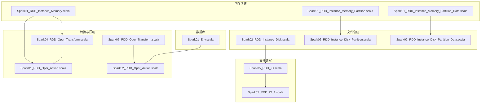
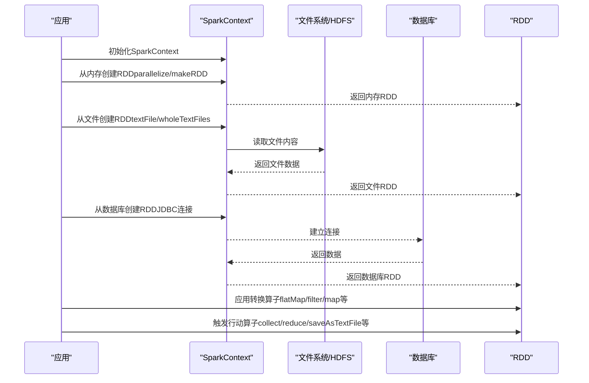
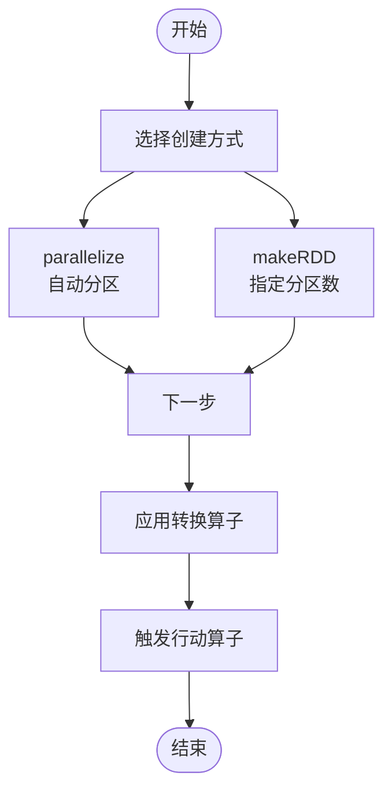
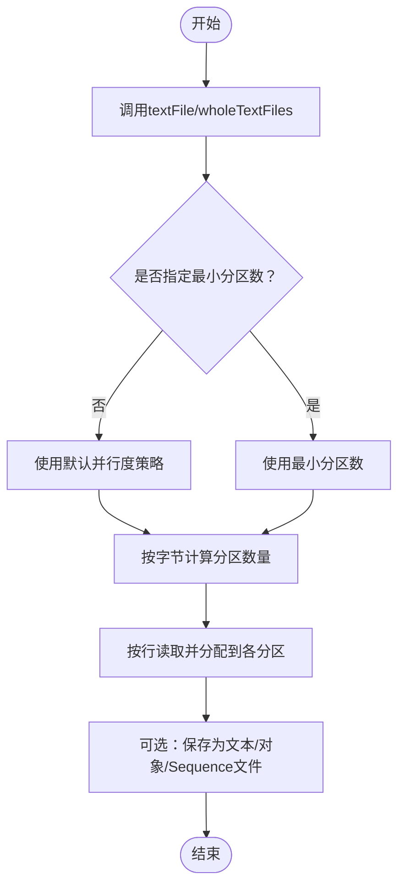
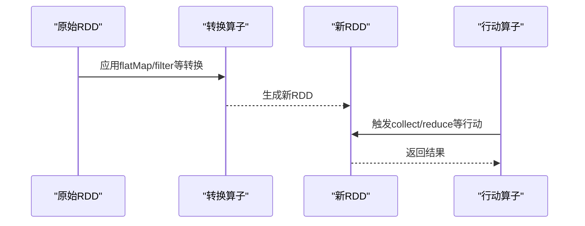
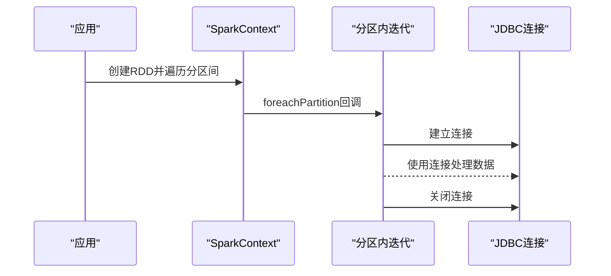
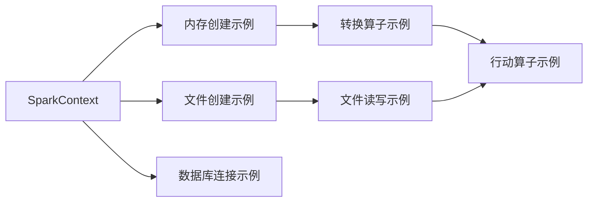

# RDD创建方式

<cite>
**本文引用的文件**
- [Spark01_RDD_Instance_Memory.scala](file://_04_sparkTest/src/main/java/com/atguigu/bigdata/spark/core/rdd/instance/Spark01_RDD_Instance_Memory.scala)
- [Spark01_RDD_Instance_Memory_Partition.scala](file://_04_sparkTest/src/main/java/com/atguigu/bigdata/spark/core/rdd/instance/Spark01_RDD_Instance_Memory_Partition.scala)
- [Spark01_RDD_Instance_Memory_Partition_Data.scala](file://_04_sparkTest/src/main/java/com/atguigu/bigdata/spark/core/rdd/instance/Spark01_RDD_Instance_Memory_Partition_Data.scala)
- [Spark02_RDD_Instance_Disk.scala](file://_04_sparkTest/src/main/java/com/atguigu/bigdata/spark/core/rdd/instance/Spark02_RDD_Instance_Disk.scala)
- [Spark02_RDD_Instance_Disk_Partition.scala](file://_04_sparkTest/src/main/java/com/atguigu/bigdata/spark/core/rdd/instance/Spark02_RDD_Instance_Disk_Partition.scala)
- [Spark02_RDD_Instance_Disk_Partition_Data.scala](file://_04_sparkTest/src/main/java/com/atguigu/bigdata/spark/core/rdd/instance/Spark02_RDD_Instance_Disk_Partition_Data.scala)
- [Spark05_RDD_IO.scala](file://_04_sparkTest/src/main/java/com/atguigu/bigdata/spark/core/rdd/persist/Spark05_RDD_IO.scala)
- [Spark05_RDD_IO_1.scala](file://_04_sparkTest/src/main/java/com/atguigu/bigdata/spark/core/rdd/persist/Spark05_RDD_IO_1.scala)
- [Spark04_RDD_Oper_Transform.scala](file://_04_sparkTest/src/main/java/com/atguigu/bigdata/spark/core/rdd/oper/transform/Spark04_RDD_Oper_Transform.scala)
- [Spark07_RDD_Oper_Transform.scala](file://_04_sparkTest/src/main/java/com/atguigu/bigdata/spark/core/rdd/oper/transform/Spark07_RDD_Oper_Transform.scala)
- [Spark01_RDD_Oper_Action.scala](file://_04_sparkTest/src/main/java/com/atguigu/bigdata/spark/core/rdd/oper/action/Spark01_RDD_Oper_Action.scala)
- [Spark02_RDD_Oper_Action.scala](file://_04_sparkTest/src/main/java/com/atguigu/bigdata/spark/core/rdd/oper/action/Spark02_RDD_Oper_Action.scala)
- [Spark01_Env.scala](file://_04_sparkTest/src/main/java/com/atguigu/bigdata/spark/streaming/Spark01_Env.scala)
</cite>

## 目录
1. [引言](#引言)
2. [项目结构](#项目结构)
3. [核心组件](#核心组件)
4. [架构概览](#架构概览)
5. [详细组件分析](#详细组件分析)
6. [依赖分析](#依赖分析)
7. [性能考虑](#性能考虑)
8. [故障排查指南](#故障排查指南)
9. [结论](#结论)
10. [附录](#附录)

## 引言
本技术文档围绕Apache Spark中RDD的多种创建方式进行系统化梳理，覆盖从内存集合、外部存储（文件、数据库）到由其他RDD转换而来的创建方式，并重点解释分区概念、默认分区数的计算规则以及手动设置分区的方法。文档通过仓库中的示例文件，逐项说明适用场景、参数配置与性能特点，并给出最佳实践建议与常见问题排查思路。

## 项目结构
本仓库中与RDD创建方式直接相关的核心示例集中在以下路径：
- 内存创建与分区：com.atguigu.bigdata.spark.core.rdd.instance 下的内存创建与分区示例
- 文件创建与分区：com.atguigu.bigdata.spark.core.rdd.instance 下的磁盘文件创建与分区示例
- 文件读写与序列化：com.atguigu.bigdata.spark.core.rdd.persist 下的文件读写示例
- 转换与行动算子：com.atguigu.bigdata.spark.core.rdd.oper.transform 与 action 包下的示例
- 数据库连接示例：com.atguigu.bigdata.spark.streaming 下的JDBC连接示例

图表来源
- [Spark01_RDD_Instance_Memory.scala](file://_04_sparkTest/src/main/java/com/atguigu/bigdata/spark/core/rdd/instance/Spark01_RDD_Instance_Memory.scala#L1-L24)
- [Spark01_RDD_Instance_Memory_Partition.scala](file://_04_sparkTest/src/main/java/com/atguigu/bigdata/spark/core/rdd/instance/Spark01_RDD_Instance_Memory_Partition.scala#L1-L29)
- [Spark01_RDD_Instance_Memory_Partition_Data.scala](file://_04_sparkTest/src/main/java/com/atguigu/bigdata/spark/core/rdd/instance/Spark01_RDD_Instance_Memory_Partition_Data.scala#L1-L27)
- [Spark02_RDD_Instance_Disk.scala](file://_04_sparkTest/src/main/java/com/atguigu/bigdata/spark/core/rdd/instance/Spark02_RDD_Instance_Disk.scala#L1-L32)
- [Spark02_RDD_Instance_Disk_Partition.scala](file://_04_sparkTest/src/main/java/com/atguigu/bigdata/spark/core/rdd/instance/Spark02_RDD_Instance_Disk_Partition.scala#L1-L31)
- [Spark02_RDD_Instance_Disk_Partition_Data.scala](file://_04_sparkTest/src/main/java/com/atguigu/bigdata/spark/core/rdd/instance/Spark02_RDD_Instance_Disk_Partition_Data.scala#L1-L44)
- [Spark05_RDD_IO.scala](file://_04_sparkTest/src/main/java/com/atguigu/bigdata/spark/core/rdd/persist/Spark05_RDD_IO.scala#L1-L27)
- [Spark05_RDD_IO_1.scala](file://_04_sparkTest/src/main/java/com/atguigu/bigdata/spark/core/rdd/persist/Spark05_RDD_IO_1.scala#L1-L21)
- [Spark04_RDD_Oper_Transform.scala](file://_04_sparkTest/src/main/java/com/atguigu/bigdata/spark/core/rdd/oper/transform/Spark04_RDD_Oper_Transform.scala#L1-L32)
- [Spark07_RDD_Oper_Transform.scala](file://_04_sparkTest/src/main/java/com/atguigu/bigdata/spark/core/rdd/oper/transform/Spark07_RDD_Oper_Transform.scala#L1-L29)
- [Spark01_RDD_Oper_Action.scala](file://_04_sparkTest/src/main/java/com/atguigu/bigdata/spark/core/rdd/oper/action/Spark01_RDD_Oper_Action.scala#L1-L27)
- [Spark02_RDD_Oper_Action.scala](file://_04_sparkTest/src/main/java/com/atguigu/bigdata/spark/core/rdd/oper/action/Spark02_RDD_Oper_Action.scala#L1-L29)
- [Spark01_Env.scala](file://_04_sparkTest/src/main/java/com/atguigu/bigdata/spark/streaming/Spark01_Env.scala#L1-L28)

章节来源
- [Spark01_RDD_Instance_Memory.scala](file://_04_sparkTest/src/main/java/com/atguigu/bigdata/spark/core/rdd/instance/Spark01_RDD_Instance_Memory.scala#L1-L24)
- [Spark02_RDD_Instance_Disk.scala](file://_04_sparkTest/src/main/java/com/atguigu/bigdata/spark/core/rdd/instance/Spark02_RDD_Instance_Disk.scala#L1-L32)

## 核心组件
- 内存集合创建
  - parallelize：从内存集合创建RDD，适合小规模本地测试与快速原型开发
  - makeRDD：支持指定分区数，便于显式控制并行度
- 外部存储创建
  - textFile：从文件系统读取文本文件，支持单文件、多路径、通配符；可指定最小分区数
  - wholeTextFiles：同时返回文件路径与内容，便于关联文件元信息
  - saveAsTextFile/saveAsObjectFile/saveAsSequenceFile：将RDD持久化为多种格式
- 其他RDD转换创建
  - 通过转换算子（如flatMap、filter等）从已有RDD派生新的RDD
- 数据库连接
  - 使用foreachPartition在每个分区内建立连接，减少连接开销

章节来源
- [Spark01_RDD_Instance_Memory.scala](file://_04_sparkTest/src/main/java/com/atguigu/bigdata/spark/core/rdd/instance/Spark01_RDD_Instance_Memory.scala#L1-L24)
- [Spark01_RDD_Instance_Memory_Partition.scala](file://_04_sparkTest/src/main/java/com/atguigu/bigdata/spark/core/rdd/instance/Spark01_RDD_Instance_Memory_Partition.scala#L1-L29)
- [Spark01_RDD_Instance_Memory_Partition_Data.scala](file://_04_sparkTest/src/main/java/com/atguigu/bigdata/spark/core/rdd/instance/Spark01_RDD_Instance_Memory_Partition_Data.scala#L1-L27)
- [Spark02_RDD_Instance_Disk.scala](file://_04_sparkTest/src/main/java/com/atguigu/bigdata/spark/core/rdd/instance/Spark02_RDD_Instance_Disk.scala#L1-L32)
- [Spark02_RDD_Instance_Disk_Partition.scala](file://_04_sparkTest/src/main/java/com/atguigu/bigdata/spark/core/rdd/instance/Spark02_RDD_Instance_Disk_Partition.scala#L1-L31)
- [Spark02_RDD_Instance_Disk_Partition_Data.scala](file://_04_sparkTest/src/main/java/com/atguigu/bigdata/spark/core/rdd/instance/Spark02_RDD_Instance_Disk_Partition_Data.scala#L1-L44)
- [Spark05_RDD_IO.scala](file://_04_sparkTest/src/main/java/com/atguigu/bigdata/spark/core/rdd/persist/Spark05_RDD_IO.scala#L1-L27)
- [Spark05_RDD_IO_1.scala](file://_04_sparkTest/src/main/java/com/atguigu/bigdata/spark/core/rdd/persist/Spark05_RDD_IO_1.scala#L1-L21)
- [Spark04_RDD_Oper_Transform.scala](file://_04_sparkTest/src/main/java/com/atguigu/bigdata/spark/core/rdd/oper/transform/Spark04_RDD_Oper_Transform.scala#L1-L32)
- [Spark07_RDD_Oper_Transform.scala](file://_04_sparkTest/src/main/java/com/atguigu/bigdata/spark/core/rdd/oper/transform/Spark07_RDD_Oper_Transform.scala#L1-L29)
- [Spark01_Env.scala](file://_04_sparkTest/src/main/java/com/atguigu/bigdata/spark/streaming/Spark01_Env.scala#L1-L28)

## 架构概览
下图展示了从不同数据源创建RDD的典型流程，以及后续的转换与行动算子对任务调度的影响。

图表来源
- [Spark01_RDD_Instance_Memory.scala](file://_04_sparkTest/src/main/java/com/atguigu/bigdata/spark/core/rdd/instance/Spark01_RDD_Instance_Memory.scala#L1-L24)
- [Spark02_RDD_Instance_Disk.scala](file://_04_sparkTest/src/main/java/com/atguigu/bigdata/spark/core/rdd/instance/Spark02_RDD_Instance_Disk.scala#L1-L32)
- [Spark01_Env.scala](file://_04_sparkTest/src/main/java/com/atguigu/bigdata/spark/streaming/Spark01_Env.scala#L1-L28)
- [Spark04_RDD_Oper_Transform.scala](file://_04_sparkTest/src/main/java/com/atguigu/bigdata/spark/core/rdd/oper/transform/Spark04_RDD_Oper_Transform.scala#L1-L32)
- [Spark01_RDD_Oper_Action.scala](file://_04_sparkTest/src/main/java/com/atguigu/bigdata/spark/core/rdd/oper/action/Spark01_RDD_Oper_Action.scala#L1-L27)

## 详细组件分析

### 内存集合创建（parallelize、makeRDD）
- parallelize
  - 适用场景：本地测试、小规模数据快速验证
  - 参数要点：传入集合，自动根据默认并行度划分分区
  - 性能特点：无外部I/O，启动快，适合小数据量
- makeRDD
  - 适用场景：需要显式控制分区数量
  - 参数要点：支持第二个参数指定分区数；默认分区数与调度器配置有关
  - 性能特点：分区数直接影响并行度与任务数量

图表来源
- [Spark01_RDD_Instance_Memory.scala](file://_04_sparkTest/src/main/java/com/atguigu/bigdata/spark/core/rdd/instance/Spark01_RDD_Instance_Memory.scala#L1-L24)
- [Spark01_RDD_Instance_Memory_Partition.scala](file://_04_sparkTest/src/main/java/com/atguigu/bigdata/spark/core/rdd/instance/Spark01_RDD_Instance_Memory_Partition.scala#L1-L29)
- [Spark01_RDD_Instance_Memory_Partition_Data.scala](file://_04_sparkTest/src/main/java/com/atguigu/bigdata/spark/core/rdd/instance/Spark01_RDD_Instance_Memory_Partition_Data.scala#L1-L27)

章节来源
- [Spark01_RDD_Instance_Memory.scala](file://_04_sparkTest/src/main/java/com/atguigu/bigdata/spark/core/rdd/instance/Spark01_RDD_Instance_Memory.scala#L1-L24)
- [Spark01_RDD_Instance_Memory_Partition.scala](file://_04_sparkTest/src/main/java/com/atguigu/bigdata/spark/core/rdd/instance/Spark01_RDD_Instance_Memory_Partition.scala#L1-L29)
- [Spark01_RDD_Instance_Memory_Partition_Data.scala](file://_04_sparkTest/src/main/java/com/atguigu/bigdata/spark/core/rdd/instance/Spark01_RDD_Instance_Memory_Partition_Data.scala#L1-L27)

### 文件创建（textFile、wholeTextFiles）与分区
- textFile
  - 单参数：文件路径（支持多路径、目录、通配符）
  - 双参数：文件路径 + 最小分区数
  - 分区计算规则：基于HDFS块大小与文件字节数，结合默认并行度策略；运行时按行读取，避免跨行截断
- wholeTextFiles
  - 返回键值对（文件路径，文件内容），便于同时获取文件元信息
- 分区数据读取细节
  - 按行读取，按偏移量切分，相同偏移不重复读取
  - 示例中展示了7字节数据按3个分区的预期读取区间

图表来源
- [Spark02_RDD_Instance_Disk.scala](file://_04_sparkTest/src/main/java/com/atguigu/bigdata/spark/core/rdd/instance/Spark02_RDD_Instance_Disk.scala#L1-L32)
- [Spark02_RDD_Instance_Disk_Partition.scala](file://_04_sparkTest/src/main/java/com/atguigu/bigdata/spark/core/rdd/instance/Spark02_RDD_Instance_Disk_Partition.scala#L1-L31)
- [Spark02_RDD_Instance_Disk_Partition_Data.scala](file://_04_sparkTest/src/main/java/com/atguigu/bigdata/spark/core/rdd/instance/Spark02_RDD_Instance_Disk_Partition_Data.scala#L1-L44)
- [Spark05_RDD_IO.scala](file://_04_sparkTest/src/main/java/com/atguigu/bigdata/spark/core/rdd/persist/Spark05_RDD_IO.scala#L1-L27)
- [Spark05_RDD_IO_1.scala](file://_04_sparkTest/src/main/java/com/atguigu/bigdata/spark/core/rdd/persist/Spark05_RDD_IO_1.scala#L1-L21)

章节来源
- [Spark02_RDD_Instance_Disk.scala](file://_04_sparkTest/src/main/java/com/atguigu/bigdata/spark/core/rdd/instance/Spark02_RDD_Instance_Disk.scala#L1-L32)
- [Spark02_RDD_Instance_Disk_Partition.scala](file://_04_sparkTest/src/main/java/com/atguigu/bigdata/spark/core/rdd/instance/Spark02_RDD_Instance_Disk_Partition.scala#L1-L31)
- [Spark02_RDD_Instance_Disk_Partition_Data.scala](file://_04_sparkTest/src/main/java/com/atguigu/bigdata/spark/core/rdd/instance/Spark02_RDD_Instance_Disk_Partition_Data.scala#L1-L44)
- [Spark05_RDD_IO.scala](file://_04_sparkTest/src/main/java/com/atguigu/bigdata/spark/core/rdd/persist/Spark05_RDD_IO.scala#L1-L27)
- [Spark05_RDD_IO_1.scala](file://_04_sparkTest/src/main/java/com/atguigu/bigdata/spark/core/rdd/persist/Spark05_RDD_IO_1.scala#L1-L21)

### 从其他RDD转换创建
- 转换算子示例
  - flatMap：扁平化处理，常用于将嵌套结构展开
  - filter：按条件过滤，可能引发数据倾斜
- 行动算子示例
  - collect：触发作业执行，收集结果
  - reduce：先分区内规约，再分区间规约

图表来源
- [Spark04_RDD_Oper_Transform.scala](file://_04_sparkTest/src/main/java/com/atguigu/bigdata/spark/core/rdd/oper/transform/Spark04_RDD_Oper_Transform.scala#L1-L32)
- [Spark07_RDD_Oper_Transform.scala](file://_04_sparkTest/src/main/java/com/atguigu/bigdata/spark/core/rdd/oper/transform/Spark07_RDD_Oper_Transform.scala#L1-L29)
- [Spark01_RDD_Oper_Action.scala](file://_04_sparkTest/src/main/java/com/atguigu/bigdata/spark/core/rdd/oper/action/Spark01_RDD_Oper_Action.scala#L1-L27)
- [Spark02_RDD_Oper_Action.scala](file://_04_sparkTest/src/main/java/com/atguigu/bigdata/spark/core/rdd/oper/action/Spark02_RDD_Oper_Action.scala#L1-L29)

章节来源
- [Spark04_RDD_Oper_Transform.scala](file://_04_sparkTest/src/main/java/com/atguigu/bigdata/spark/core/rdd/oper/transform/Spark04_RDD_Oper_Transform.scala#L1-L32)
- [Spark07_RDD_Oper_Transform.scala](file://_04_sparkTest/src/main/java/com/atguigu/bigdata/spark/core/rdd/oper/transform/Spark07_RDD_Oper_Transform.scala#L1-L29)
- [Spark01_RDD_Oper_Action.scala](file://_04_sparkTest/src/main/java/com/atguigu/bigdata/spark/core/rdd/oper/action/Spark01_RDD_Oper_Action.scala#L1-L27)
- [Spark02_RDD_Oper_Action.scala](file://_04_sparkTest/src/main/java/com/atguigu/bigdata/spark/core/rdd/oper/action/Spark02_RDD_Oper_Action.scala#L1-L29)

### 数据库连接创建（JDBC）
- 在每个分区内建立连接，减少连接数与初始化开销
- 适用于批处理场景，注意连接池与资源释放

图表来源
- [Spark01_Env.scala](file://_04_sparkTest/src/main/java/com/atguigu/bigdata/spark/streaming/Spark01_Env.scala#L1-L28)

章节来源
- [Spark01_Env.scala](file://_04_sparkTest/src/main/java/com/atguigu/bigdata/spark/streaming/Spark01_Env.scala#L1-L28)

## 依赖分析
- 组件耦合
  - 内存与文件创建示例均依赖SparkContext创建RDD
  - 文件读写示例依赖HDFS或本地文件系统
  - 转换与行动算子依赖已存在的RDD
  - 数据库示例依赖JDBC连接
- 外部依赖
  - Hadoop文件系统（HDFS/本地文件系统）
  - 数据库驱动（JDBC）

图表来源
- [Spark01_RDD_Instance_Memory.scala](file://_04_sparkTest/src/main/java/com/atguigu/bigdata/spark/core/rdd/instance/Spark01_RDD_Instance_Memory.scala#L1-L24)
- [Spark02_RDD_Instance_Disk.scala](file://_04_sparkTest/src/main/java/com/atguigu/bigdata/spark/core/rdd/instance/Spark02_RDD_Instance_Disk.scala#L1-L32)
- [Spark05_RDD_IO.scala](file://_04_sparkTest/src/main/java/com/atguigu/bigdata/spark/core/rdd/persist/Spark05_RDD_IO.scala#L1-L27)
- [Spark04_RDD_Oper_Transform.scala](file://_04_sparkTest/src/main/java/com/atguigu/bigdata/spark/core/rdd/oper/transform/Spark04_RDD_Oper_Transform.scala#L1-L32)
- [Spark01_Env.scala](file://_04_sparkTest/src/main/java/com/atguigu/bigdata/spark/streaming/Spark01_Env.scala#L1-L28)

章节来源
- [Spark01_RDD_Instance_Memory.scala](file://_04_sparkTest/src/main/java/com/atguigu/bigdata/spark/core/rdd/instance/Spark01_RDD_Instance_Memory.scala#L1-L24)
- [Spark02_RDD_Instance_Disk.scala](file://_04_sparkTest/src/main/java/com/atguigu/bigdata/spark/core/rdd/instance/Spark02_RDD_Instance_Disk.scala#L1-L32)
- [Spark05_RDD_IO.scala](file://_04_sparkTest/src/main/java/com/atguigu/bigdata/spark/core/rdd/persist/Spark05_RDD_IO.scala#L1-L27)
- [Spark04_RDD_Oper_Transform.scala](file://_04_sparkTest/src/main/java/com/atguigu/bigdata/spark/core/rdd/oper/transform/Spark04_RDD_Oper_Transform.scala#L1-L32)
- [Spark01_Env.scala](file://_04_sparkTest/src/main/java/com/atguigu/bigdata/spark/streaming/Spark01_Env.scala#L1-L28)

## 性能考虑
- 默认分区数
  - 内存创建：默认分区数与调度器配置相关，通常与总核数有关
  - 文件创建：最小分区数默认值与默认并行度策略相关
- 分区数量与数据分布
  - 分区过少导致并行度不足，分区过多增加任务调度开销
  - 文件读取按行读取，避免跨行截断；字节级分区计算与实际读取区间可能存在差异
- I/O与序列化
  - 文本文件适合快速原型；对象文件与Sequence文件适合结构化数据的高效读写
- 数据倾斜
  - 过滤等转换可能导致数据倾斜，需关注分区均匀性

章节来源
- [Spark01_RDD_Instance_Memory_Partition.scala](file://_04_sparkTest/src/main/java/com/atguigu/bigdata/spark/core/rdd/instance/Spark01_RDD_Instance_Memory_Partition.scala#L1-L29)
- [Spark02_RDD_Instance_Disk_Partition.scala](file://_04_sparkTest/src/main/java/com/atguigu/bigdata/spark/core/rdd/instance/Spark02_RDD_Instance_Disk_Partition.scala#L1-L31)
- [Spark02_RDD_Instance_Disk_Partition_Data.scala](file://_04_sparkTest/src/main/java/com/atguigu/bigdata/spark/core/rdd/instance/Spark02_RDD_Instance_Disk_Partition_Data.scala#L1-L44)
- [Spark07_RDD_Oper_Transform.scala](file://_04_sparkTest/src/main/java/com/atguigu/bigdata/spark/core/rdd/oper/transform/Spark07_RDD_Oper_Transform.scala#L1-L29)

## 故障排查指南
- 文件路径与权限
  - 确认路径正确且具备读取权限；通配符与多路径拼接需符合要求
- 分区数设置不当
  - 分区过少导致任务串行或内存压力；分区过多导致调度开销上升
- 数据倾斜
  - 检查过滤、连接等操作是否造成热点分区
- 序列化与格式
  - 对象文件与Sequence文件仅适用于特定数据类型；读写路径需一致
- 数据库连接
  - 确保每个分区内正确建立与关闭连接，避免连接泄漏

章节来源
- [Spark02_RDD_Instance_Disk.scala](file://_04_sparkTest/src/main/java/com/atguigu/bigdata/spark/core/rdd/instance/Spark02_RDD_Instance_Disk.scala#L1-L32)
- [Spark05_RDD_IO_1.scala](file://_04_sparkTest/src/main/java/com/atguigu/bigdata/spark/core/rdd/persist/Spark05_RDD_IO_1.scala#L1-L21)
- [Spark01_Env.scala](file://_04_sparkTest/src/main/java/com/atguigu/bigdata/spark/streaming/Spark01_Env.scala#L1-L28)

## 结论
- 内存创建适合快速验证与小规模数据；文件创建适合批量离线处理；数据库连接适合批式ETL
- 合理设置分区数是提升性能的关键；理解默认并行度与文件读取机制有助于优化
- 通过转换与行动算子串联形成完整的数据处理流水线；注意数据倾斜与I/O瓶颈

## 附录
- 实战建议
  - 小数据快速验证：使用parallelize
  - 显式并行度控制：使用makeRDD并指定分区数
  - 文本文件读取：优先使用textFile；需要文件元信息时使用wholeTextFiles
  - 结构化数据持久化：根据场景选择saveAsTextFile、saveAsObjectFile或saveAsSequenceFile
  - 数据库批处理：在foreachPartition内建立连接，避免频繁创建销毁连接