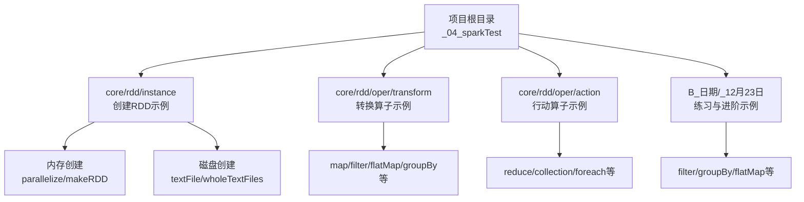
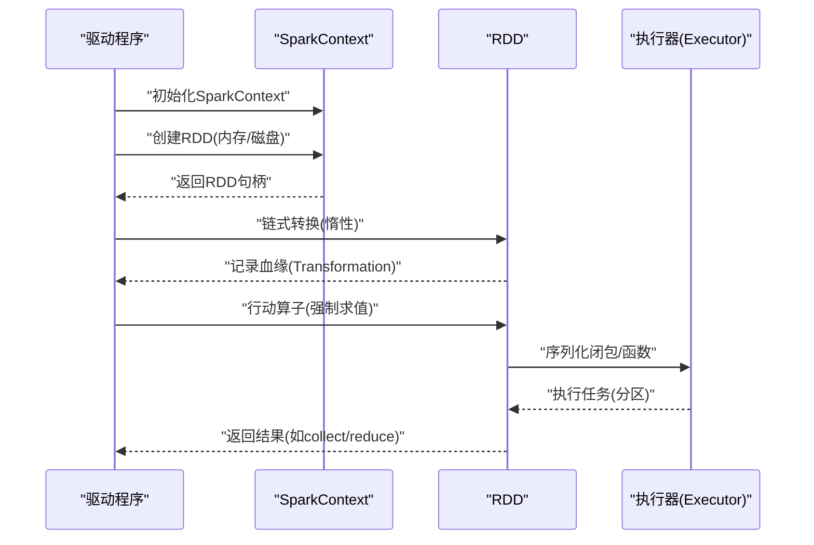
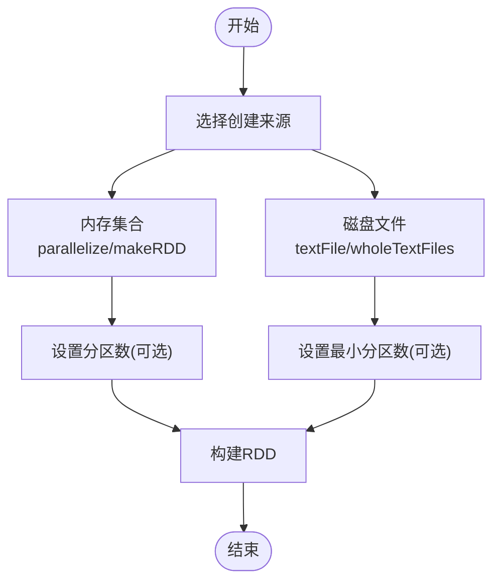
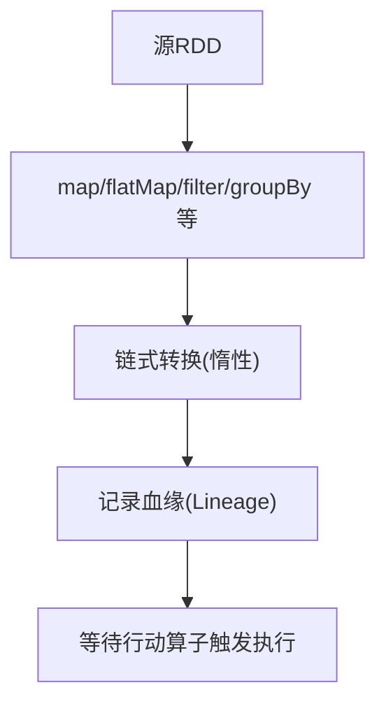
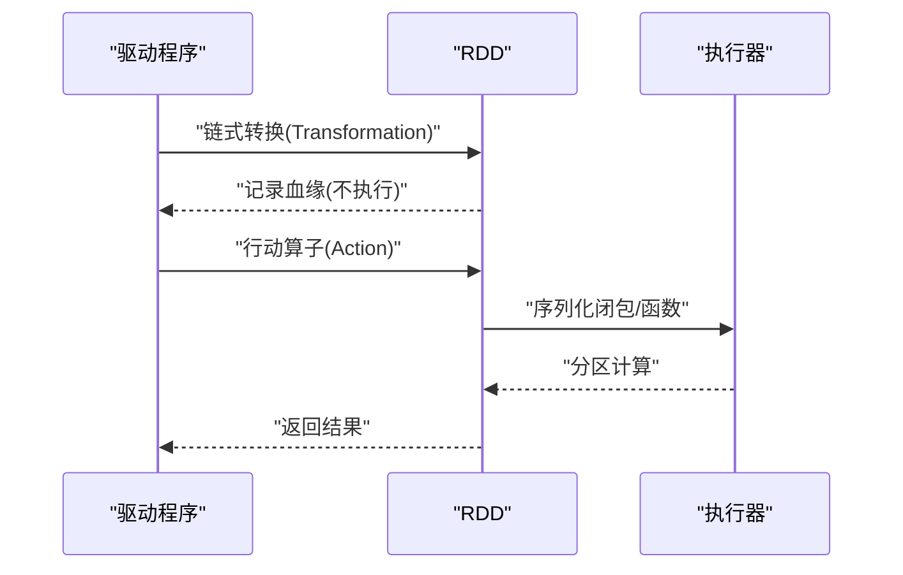
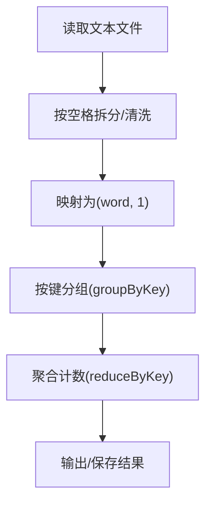
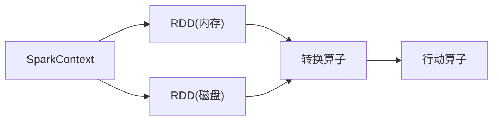

# RDD编程模型

<cite>
**本文引用的文件**
- [Spark01_RDD_Instance_Memory.scala](file://_04_sparkTest/src/main/java/com/atguigu/bigdata/spark/core/rdd/instance/Spark01_RDD_Instance_Memory.scala)
- [Spark02_RDD_Instance_Disk_Partition.scala](file://_04_sparkTest/src/main/java/com/atguigu/bigdata/spark/core/rdd/instance/Spark02_RDD_Instance_Disk_Partition.scala)
- [Spark02_RDD_Instance_Disk_Partition_Data.scala](file://_04_sparkTest/src/main/java/com/atguigu/bigdata/spark/core/rdd/instance/Spark02_RDD_Instance_Disk_Partition_Data.scala)
- [Spark02_RDD_Instance_Disk.scala](file://_04_sparkTest/src/main/java/com/atguigu/bigdata/spark/core/rdd/instance/Spark02_RDD_Instance_Disk.scala)
- [Spark13_RDD_Oper_Transform.scala](file://_04_sparkTest/src/main/java/com/atguigu/bigdata/spark/core/rdd/oper/transform/Spark13_RDD_Oper_Transform.scala)
- [Spark02_RDD_Oper_Action.scala](file://_04_sparkTest/src/main/java/com/atguigu/bigdata/spark/core/rdd/oper/action/Spark02_RDD_Oper_Action.scala)
- [Spark03_RDD_Oper_Action.scala](file://_04_sparkTest/src/main/java/com/atguigu/bigdata/spark/core/rdd/oper/action/Spark03_RDD_Oper_Action.scala)
- [Spark09_RDD_Oper_Action_2.scala](file://_04_sparkTest/src/main/java/com/atguigu/bigdata/spark/core/rdd/oper/action/Spark09_RDD_Oper_Action_2.scala)
- [Spark002_filter_1_got.scala](file://_04_sparkTest/src/main/java/B_日期/_12月23日/Spark002_filter_1_got.scala)
- [Spark001_groupBy_1_got.scala](file://_04_sparkTest/src/main/java/B_日期/_12月23日/Spark001_groupBy_1_got.scala)
- [Spark04_RDD_Oper_Transform_Test_flatMap_case_got.scala](file://_04_sparkTest/src/main/java/B_日期/_12月23日/Spark04_RDD_Oper_Transform_Test_flatMap_case_got.scala)
</cite>

## 目录
1. [引言](#引言)
2. [项目结构](#项目结构)
3. [核心组件](#核心组件)
4. [架构总览](#架构总览)
5. [详细组件分析](#详细组件分析)
6. [依赖分析](#依赖分析)
7. [性能考虑](#性能考虑)
8. [故障排查指南](#故障排查指南)
9. [结论](#结论)
10. [附录](#附录)

## 引言
本技术文档围绕RDD（弹性分布式数据集）编程模型展开，系统阐述其核心概念与实践应用，包括分区、依赖关系、血缘关系与序列化机制；详解转换操作与行动操作及惰性求值；覆盖RDD的创建方式（从内存集合、文件系统创建）、常用转换与行动操作、持久化与缓存策略，并通过仓库中的示例文件给出可追溯的代码路径与流程图示，帮助读者建立从入门到进阶的完整认知。

## 项目结构
该仓库中与RDD相关的内容主要集中在“_04_sparkTest”模块下的“core/rdd”目录，涵盖实例化（从内存/磁盘）、转换与行动两类算子示例，以及若干Scala练习文件。这些示例展示了SparkContext、RDD的基本用法与常见算子组合。

**章节来源**
- file://_04_sparkTest/src/main/java/com/atguigu/bigdata/spark/core/rdd/instance/Spark01_RDD_Instance_Memory.scala#L1-L24
- file://_04_sparkTest/src/main/java/com/atguigu/bigdata/spark/core/rdd/instance/Spark02_RDD_Instance_Disk_Partition.scala#L1-L30
- file://_04_sparkTest/src/main/java/com/atguigu/bigdata/spark/core/rdd/oper/transform/Spark13_RDD_Oper_Transform.scala#L1-L28
- file://_04_sparkTest/src/main/java/com/atguigu/bigdata/spark/core/rdd/oper/action/Spark02_RDD_Oper_Action.scala#L1-L29

## 核心组件
- SparkContext：驱动程序入口，负责创建RDD、调度任务与管理集群资源。
- RDD：不可变、分区化的分布式数据集合，支持转换与行动两类操作。
- 分区（Partition）：数据分片，决定并行度与本地化计算机会。
- 依赖关系（Dependency）：转换操作产生的父子RDD之间的依赖，分为窄依赖与宽依赖。
- 血缘关系（Lineage）：记录RDD构建的历史路径，用于容错重算。
- 序列化机制：在Executor与Driver之间传输闭包与函数时必须可序列化。

上述概念在以下示例中得到体现：
- 内存创建与磁盘创建示例展示了RDD的来源与分区策略。
- 转换与行动示例展示了惰性求值与闭包序列化问题。
- 练习示例展示了map、filter、flatMap、groupBy等常用算子。

**章节来源**
- file://_04_sparkTest/src/main/java/com/atguigu/bigdata/spark/core/rdd/instance/Spark01_RDD_Instance_Memory.scala#L1-L24
- file://_04_sparkTest/src/main/java/com/atguigu/bigdata/spark/core/rdd/oper/action/Spark09_RDD_Oper_Action_2.scala#L1-L35

## 架构总览
下图展示了从创建RDD到执行行动算子的总体流程，体现了惰性求值与闭包序列化的重要性。

**图表来源**
- [Spark01_RDD_Instance_Memory.scala](file://_04_sparkTest/src/main/java/com/atguigu/bigdata/spark/core/rdd/instance/Spark01_RDD_Instance_Memory.scala#L1-L24)
- [Spark02_RDD_Oper_Action.scala](file://_04_sparkTest/src/main/java/com/atguigu/bigdata/spark/core/rdd/oper/action/Spark02_RDD_Oper_Action.scala#L1-L29)
- [Spark09_RDD_Oper_Action_2.scala](file://_04_sparkTest/src/main/java/com/atguigu/bigdata/spark/core/rdd/oper/action/Spark09_RDD_Oper_Action_2.scala#L1-L35)

## 详细组件分析

### RDD创建方式
- 从内存集合创建：使用并行化或直接构造，适合小规模测试与演示。
- 从磁盘文件创建：支持单文件、多文件路径与通配符；可选择最小分区数；wholeTextFiles可同时返回文件路径与内容。

**图表来源**
- [Spark01_RDD_Instance_Memory.scala](file://_04_sparkTest/src/main/java/com/atguigu/bigdata/spark/core/rdd/instance/Spark01_RDD_Instance_Memory.scala#L1-L24)
- [Spark02_RDD_Instance_Disk_Partition.scala](file://_04_sparkTest/src/main/java/com/atguigu/bigdata/spark/core/rdd/instance/Spark02_RDD_Instance_Disk_Partition.scala#L1-L30)
- [Spark02_RDD_Instance_Disk_Partition_Data.scala](file://_04_sparkTest/src/main/java/com/atguigu/bigdata/spark/core/rdd/instance/Spark02_RDD_Instance_Disk_Partition_Data.scala#L1-L43)
- [Spark02_RDD_Instance_Disk.scala](file://_04_sparkTest/src/main/java/com/atguigu/bigdata/spark/core/rdd/instance/Spark02_RDD_Instance_Disk.scala#L1-L31)

**章节来源**
- file://_04_sparkTest/src/main/java/com/atguigu/bigdata/spark/core/rdd/instance/Spark01_RDD_Instance_Memory.scala#L1-L24
- file://_04_sparkTest/src/main/java/com/atguigu/bigdata/spark/core/rdd/instance/Spark02_RDD_Instance_Disk_Partition.scala#L1-L30
- file://_04_sparkTest/src/main/java/com/atguigu/bigdata/spark/core/rdd/instance/Spark02_RDD_Instance_Disk_Partition_Data.scala#L1-L43
- file://_04_sparkTest/src/main/java/com/atguigu/bigdata/spark/core/rdd/instance/Spark02_RDD_Instance_Disk.scala#L1-L31

### 转换操作（Transformations）
- 常见转换：map、flatMap、filter、groupBy等。
- 特点：返回新的RDD，不立即执行，仅记录血缘。
- 示例路径：
  - [Spark13_RDD_Oper_Transform.scala](file://_04_sparkTest/src/main/java/com/atguigu/bigdata/spark/core/rdd/oper/transform/Spark13_RDD_Oper_Transform.scala#L1-L28)
  - [Spark002_filter_1_got.scala](file://_04_sparkTest/src/main/java/B_日期/_12月23日/Spark002_filter_1_got.scala#L1-L24)
  - [Spark001_groupBy_1_got.scala](file://_04_sparkTest/src/main/java/B_日期/_12月23日/Spark001_groupBy_1_got.scala#L1-L31)
  - [Spark04_RDD_Oper_Transform_Test_flatMap_case_got.scala](file://_04_sparkTest/src/main/java/B_日期/_12月23日/Spark04_RDD_Oper_Transform_Test_flatMap_case_got.scala#L1-L31)

**图表来源**
- [Spark13_RDD_Oper_Transform.scala](file://_04_sparkTest/src/main/java/com/atguigu/bigdata/spark/core/rdd/oper/transform/Spark13_RDD_Oper_Transform.scala#L1-L28)
- [Spark002_filter_1_got.scala](file://_04_sparkTest/src/main/java/B_日期/_12月23日/Spark002_filter_1_got.scala#L1-L24)
- [Spark001_groupBy_1_got.scala](file://_04_sparkTest/src/main/java/B_日期/_12月23日/Spark001_groupBy_1_got.scala#L1-L31)
- [Spark04_RDD_Oper_Transform_Test_flatMap_case_got.scala](file://_04_sparkTest/src/main/java/B_日期/_12月23日/Spark04_RDD_Oper_Transform_Test_flatMap_case_got.scala#L1-L31)

**章节来源**
- file://_04_sparkTest/src/main/java/com/atguigu/bigdata/spark/core/rdd/oper/transform/Spark13_RDD_Oper_Transform.scala#L1-L28
- file://_04_sparkTest/src/main/java/B_日期/_12月23日/Spark002_filter_1_got.scala#L1-L24
- file://_04_sparkTest/src/main/java/B_日期/_12月23日/Spark001_groupBy_1_got.scala#L1-L31
- file://_04_sparkTest/src/main/java/B_日期/_12月23日/Spark04_RDD_Oper_Transform_Test_flatMap_case_got.scala#L1-L31

### 行动操作（Actions）与惰性求值
- 行动操作：reduce、collect、foreach等，触发任务执行。
- 惰性求值：转换链只记录血缘，直到遇到行动算子才真正计算。
- 闭包与序列化：在Executor端使用的外部变量需可序列化，否则会报错。

**图表来源**
- [Spark02_RDD_Oper_Action.scala](file://_04_sparkTest/src/main/java/com/atguigu/bigdata/spark/core/rdd/oper/action/Spark02_RDD_Oper_Action.scala#L1-L29)
- [Spark03_RDD_Oper_Action.scala](file://_04_sparkTest/src/main/java/com/atguigu/bigdata/spark/core/rdd/oper/action/Spark03_RDD_Oper_Action.scala#L1-L26)
- [Spark09_RDD_Oper_Action_2.scala](file://_04_sparkTest/src/main/java/com/atguigu/bigdata/spark/core/rdd/oper/action/Spark09_RDD_Oper_Action_2.scala#L1-L35)

**章节来源**
- file://_04_sparkTest/src/main/java/com/atguigu/bigdata/spark/core/rdd/oper/action/Spark02_RDD_Oper_Action.scala#L1-L29
- file://_04_sparkTest/src/main/java/com/atguigu/bigdata/spark/core/rdd/oper/action/Spark03_RDD_Oper_Action.scala#L1-L26
- file://_04_sparkTest/src/main/java/com/atguigu/bigdata/spark/core/rdd/oper/action/Spark09_RDD_Oper_Action_2.scala#L1-L35

### WordCount 实战与性能优化
- 基本流程：读取文本 -> 拆分单词 -> 映射为键值对 -> 聚合计数。
- 优化建议：
  - 合理设置分区数，避免数据倾斜。
  - 使用本地聚合（combine/partition）减少shuffle。
  - 对中间结果进行缓存（如persist/checkpoint）以复用。
  - 控制collect大小，避免Driver内存压力。

[此图为概念流程图，无需图表来源]

**章节来源**
- file://_04_sparkTest/src/main/java/B_日期/_12月30日/SparkStreaming02_WordCount_my.scala#L1-L42
- file://_04_sparkTest/src/main/java/B_日期/_12月30日/SparkStreaming02_WordCount_无界流_网络流.scala#L1-L42

## 依赖分析
- 组件耦合：示例代码均依赖SparkContext创建RDD，转换与行动算子在RDD上串联，形成清晰的调用链。
- 外部依赖：示例未引入额外第三方库，重点在于Spark API的使用。
- 潜在循环依赖：示例为单文件演示，不存在循环依赖风险。

**图表来源**
- [Spark01_RDD_Instance_Memory.scala](file://_04_sparkTest/src/main/java/com/atguigu/bigdata/spark/core/rdd/instance/Spark01_RDD_Instance_Memory.scala#L1-L24)
- [Spark02_RDD_Instance_Disk.scala](file://_04_sparkTest/src/main/java/com/atguigu/bigdata/spark/core/rdd/instance/Spark02_RDD_Instance_Disk.scala#L1-L31)
- [Spark13_RDD_Oper_Transform.scala](file://_04_sparkTest/src/main/java/com/atguigu/bigdata/spark/core/rdd/oper/transform/Spark13_RDD_Oper_Transform.scala#L1-L28)
- [Spark02_RDD_Oper_Action.scala](file://_04_sparkTest/src/main/java/com/atguigu/bigdata/spark/core/rdd/oper/action/Spark02_RDD_Oper_Action.scala#L1-L29)

**章节来源**
- file://_04_sparkTest/src/main/java/com/atguigu/bigdata/spark/core/rdd/instance/Spark01_RDD_Instance_Memory.scala#L1-L24
- file://_04_sparkTest/src/main/java/com/atguigu/bigdata/spark/core/rdd/instance/Spark02_RDD_Instance_Disk.scala#L1-L31
- file://_04_sparkTest/src/main/java/com/atguigu/bigdata/spark/core/rdd/oper/transform/Spark13_RDD_Oper_Transform.scala#L1-L28
- file://_04_sparkTest/src/main/java/com/atguigu/bigdata/spark/core/rdd/oper/action/Spark02_RDD_Oper_Action.scala#L1-L29

## 性能考虑
- 分区策略：根据数据量与CPU核数合理设置分区数，避免过多小分区导致调度开销过大。
- 本地化计算：尽量让任务在数据所在节点执行，减少网络传输。
- shuffle优化：优先使用map-side combine或reduce-side聚合，降低shuffle数据量。
- 缓存策略：对热点中间结果使用合适的存储级别进行缓存，必要时结合checkpoint。
- I/O优化：批量读写、压缩与合理的文件格式有助于提升吞吐。

[本节为通用指导，无需章节来源]

## 故障排查指南
- 闭包不可序列化：当在Executor端使用外部非序列化对象时，会抛出序列化异常。应确保闭包内使用的外部变量可序列化，或通过广播变量共享只读数据。
- Driver内存压力：collect等行动算子会将全部数据拉回Driver，可能导致内存溢出。建议改用局部聚合或采样输出。
- 数据倾斜：groupByKey等宽依赖操作可能造成热点分区。可通过预聚合、随机前缀或自定义分区器缓解。

**章节来源**
- file://_04_sparkTest/src/main/java/com/atguigu/bigdata/spark/core/rdd/oper/action/Spark09_RDD_Oper_Action_2.scala#L1-L35
- file://_04_sparkTest/src/main/java/com/atguigu/bigdata/spark/core/rdd/oper/action/Spark03_RDD_Oper_Action.scala#L1-L26

## 结论
通过仓库中的示例，我们系统地梳理了RDD的创建、转换、行动与惰性求值机制，并结合练习展示了filter、groupBy、flatMap等常用算子。配合分区、依赖与血缘的概念，读者可以理解Spark如何在分布式环境下高效、容错地执行大规模数据处理任务。在工程实践中，应重视分区策略、shuffle优化与缓存策略，以获得更佳的性能表现。

## 附录
- 常用算子参考路径
  - 转换：[Spark13_RDD_Oper_Transform.scala](file://_04_sparkTest/src/main/java/com/atguigu/bigdata/spark/core/rdd/oper/transform/Spark13_RDD_Oper_Transform.scala#L1-L28)
  - 行动：[Spark02_RDD_Oper_Action.scala](file://_04_sparkTest/src/main/java/com/atguigu/bigdata/spark/core/rdd/oper/action/Spark02_RDD_Oper_Action.scala#L1-L29)
  - 过滤：[Spark002_filter_1_got.scala](file://_04_sparkTest/src/main/java/B_日期/_12月23日/Spark002_filter_1_got.scala#L1-L24)
  - 分组：[Spark001_groupBy_1_got.scala](file://_04_sparkTest/src/main/java/B_日期/_12月23日/Spark001_groupBy_1_got.scala#L1-L31)
  - 扁平化：[Spark04_RDD_Oper_Transform_Test_flatMap_case_got.scala](file://_04_sparkTest/src/main/java/B_日期/_12月23日/Spark04_RDD_Oper_Transform_Test_flatMap_case_got.scala#L1-L31)