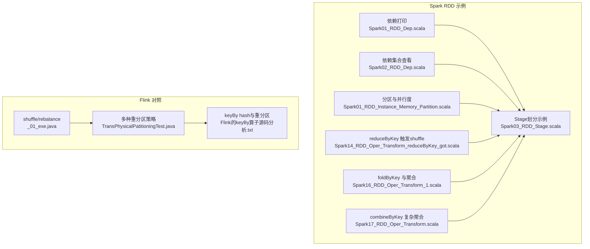
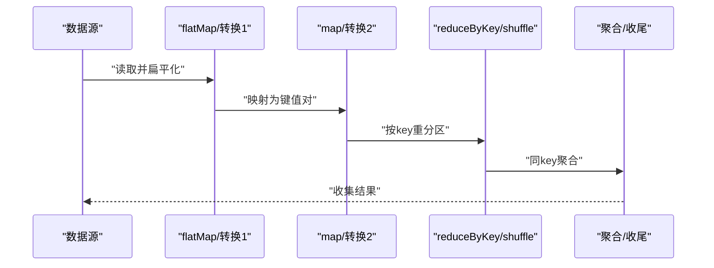
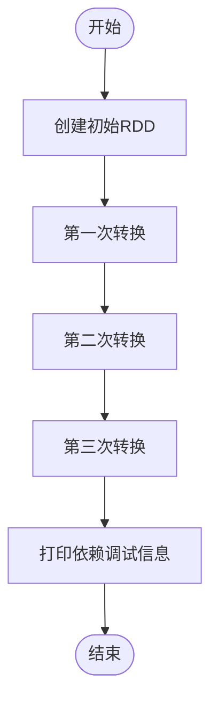
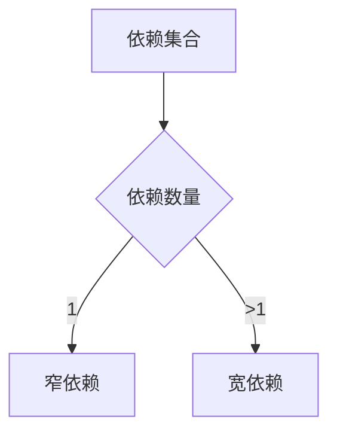
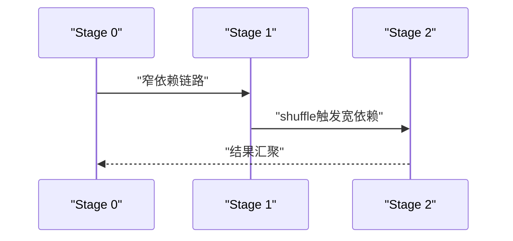
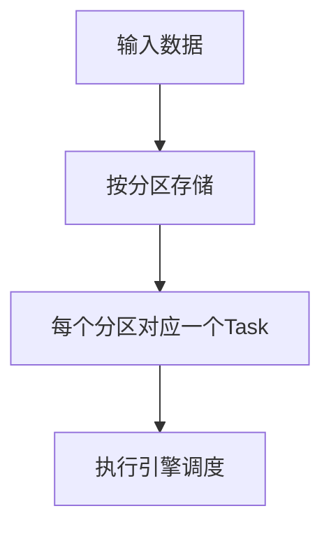
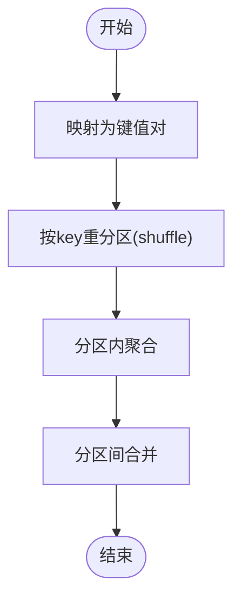
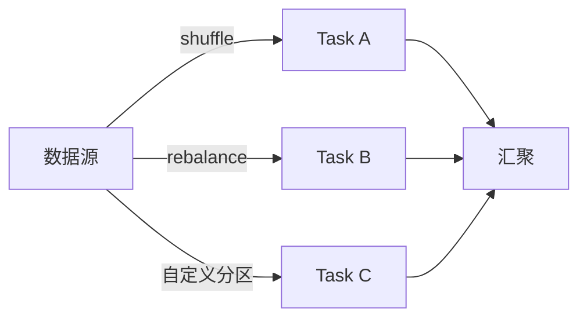
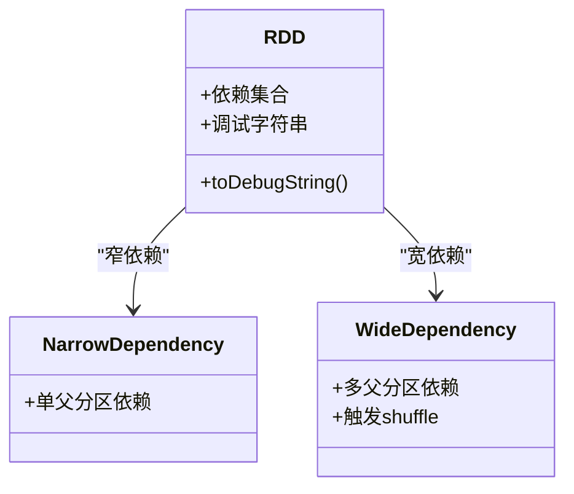

# 依赖关系与血缘

<cite>
**本文引用的文件**
- [Spark01_RDD_Dep.scala](file://_04_sparkTest/src/main/java/com/atguigu/bigdata/spark/core/rdd/oper/dep/Spark01_RDD_Dep.scala)
- [Spark02_RDD_Dep.scala](file://_04_sparkTest/src/main/java/com/atguigu/bigdata/spark/core/rdd/oper/dep/Spark02_RDD_Dep.scala)
- [Spark03_RDD_Stage.scala](file://_04_sparkTest/src/main/java/com/atguigu/bigdata/spark/core/rdd/oper/dep/Spark03_RDD_Stage.scala)
- [Spark01_RDD_Instance_Memory_Partition.scala](file://_04_sparkTest/src/main/java/com/atguigu/bigdata/spark/core/rdd/instance/Spark01_RDD_Instance_Memory_Partition.scala)
- [Spark14_RDD_Oper_Transform_reduceByKey_got.scala](file://_04_sparkTest/src/main/java/com/atguigu/bigdata/spark/core/rdd/oper/transform/Spark14_RDD_Oper_Transform_reduceByKey_got.scala)
- [Spark16_RDD_Oper_Transform_1.scala](file://_04_sparkTest/src/main/java/com/atguigu/bigdata/spark/core/rdd/oper/transform/Spark16_RDD_Oper_Transform_1.scala)
- [Spark17_RDD_Oper_Transform.scala](file://_04_sparkTest/src/main/java/com/atguigu/bigdata/spark/core/rdd/oper/transform/Spark17_RDD_Oper_Transform.scala)
- [_01_exe.java](file://_06_flink/src/main/java/_07_Phy/_01_exe.java)
- [TransPhysicalPatitioningTest.java](file://_06_flink_wu/src/main/java/com/atguigu/chapter05/TransPhysicalPatitioningTest.java)
- [Flink的keyBy算子源码分析.txt](file://_06_flink/Flink的keyBy算子源码分析.txt)
</cite>

## 目录
1. [简介](#简介)
2. [项目结构](#项目结构)
3. [核心组件](#核心组件)
4. [架构总览](#架构总览)
5. [详细组件分析](#详细组件分析)
6. [依赖关系分析](#依赖关系分析)
7. [性能考量](#性能考量)
8. [故障排查指南](#故障排查指南)
9. [结论](#结论)
10. [附录](#附录)

## 简介
本文件围绕RDD的依赖关系与血缘机制展开，系统阐述窄依赖与宽依赖的差异、DAG与Stage的划分、shuffle对性能的影响与优化策略，并结合仓库中的示例代码路径，帮助读者建立从概念到实践的完整认知，从而指导Spark应用的性能优化。

## 项目结构
该仓库包含大量Spark与Flink示例代码。与“依赖关系与血缘”主题最相关的部分集中在Spark RDD示例中，涵盖依赖打印、Stage划分、分区与调度等关键点；同时，Flink侧的物理分区与keyBy重分区逻辑可作为理解shuffle与数据重分布的对照参考。

**图表来源**
- [Spark01_RDD_Dep.scala](file://_04_sparkTest/src/main/java/com/atguigu/bigdata/spark/core/rdd/oper/dep/Spark01_RDD_Dep.scala#L1-L33)
- [Spark02_RDD_Dep.scala](file://_04_sparkTest/src/main/java/com/atguigu/bigdata/spark/core/rdd/oper/dep/Spark02_RDD_Dep.scala#L1-L37)
- [Spark03_RDD_Stage.scala](file://_04_sparkTest/src/main/java/com/atguigu/bigdata/spark/core/rdd/oper/dep/Spark03_RDD_Stage.scala#L1-L29)
- [Spark01_RDD_Instance_Memory_Partition.scala](file://_04_sparkTest/src/main/java/com/atguigu/bigdata/spark/core/rdd/instance/Spark01_RDD_Instance_Memory_Partition.scala#L1-L29)
- [Spark14_RDD_Oper_Transform_reduceByKey_got.scala](file://_04_sparkTest/src/main/java/com/atguigu/bigdata/spark/core/rdd/oper/transform/Spark14_RDD_Oper_Transform_reduceByKey_got.scala#L1-L28)
- [Spark16_RDD_Oper_Transform_1.scala](file://_04_sparkTest/src/main/java/com/atguigu/bigdata/spark/core/rdd/oper/transform/Spark16_RDD_Oper_Transform_1.scala#L1-L29)
- [Spark17_RDD_Oper_Transform.scala](file://_04_sparkTest/src/main/java/com/atguigu/bigdata/spark/core/rdd/oper/transform/Spark17_RDD_Oper_Transform.scala#L1-L57)
- [_01_exe.java](file://_06_flink/src/main/java/_07_Phy/_01_exe.java#L1-L29)
- [TransPhysicalPatitioningTest.java](file://_06_flink_wu/src/main/java/com/atguigu/chapter05/TransPhysicalPatitioningTest.java#L31-L85)
- [Flink的keyBy算子源码分析.txt](file://_06_flink/Flink的keyBy算子源码分析.txt#L22-L35)

**章节来源**
- [Spark01_RDD_Dep.scala](file://_04_sparkTest/src/main/java/com/atguigu/bigdata/spark/core/rdd/oper/dep/Spark01_RDD_Dep.scala#L1-L33)
- [Spark02_RDD_Dep.scala](file://_04_sparkTest/src/main/java/com/atguigu/bigdata/spark/core/rdd/oper/dep/Spark02_RDD_Dep.scala#L1-L37)
- [Spark03_RDD_Stage.scala](file://_04_sparkTest/src/main/java/com/atguigu/bigdata/spark/core/rdd/oper/dep/Spark03_RDD_Stage.scala#L1-L29)
- [Spark01_RDD_Instance_Memory_Partition.scala](file://_04_sparkTest/src/main/java/com/atguigu/bigdata/spark/core/rdd/instance/Spark01_RDD_Instance_Memory_Partition.scala#L1-L29)
- [Spark14_RDD_Oper_Transform_reduceByKey_got.scala](file://_04_sparkTest/src/main/java/com/atguigu/bigdata/spark/core/rdd/oper/transform/Spark14_RDD_Oper_Transform_reduceByKey_got.scala#L1-L28)
- [Spark16_RDD_Oper_Transform_1.scala](file://_04_sparkTest/src/main/java/com/atguigu/bigdata/spark/core/rdd/oper/transform/Spark16_RDD_Oper_Transform_1.scala#L1-L29)
- [Spark17_RDD_Oper_Transform.scala](file://_04_sparkTest/src/main/java/com/atguigu/bigdata/spark/core/rdd/oper/transform/Spark17_RDD_Oper_Transform.scala#L1-L57)
- [_01_exe.java](file://_06_flink/src/main/java/_07_Phy/_01_exe.java#L1-L29)
- [TransPhysicalPatitioningTest.java](file://_06_flink_wu/src/main/java/com/atguigu/chapter05/TransPhysicalPatitioningTest.java#L31-L85)
- [Flink的keyBy算子源码分析.txt](file://_06_flink/Flink的keyBy算子源码分析.txt#L22-L35)

## 核心组件
- 依赖打印与血缘可视化：通过调试字符串输出RDD的父子依赖链，直观呈现血缘关系。
- 依赖集合查看：直接打印每个RDD的依赖集合，区分窄依赖与宽依赖。
- Stage划分：通过连续转换与shuffle操作观察DAG切分为多个Stage的过程。
- 分区与并行度：通过指定分区数与保存输出，理解数据分布与任务粒度。
- shuffle触发算子：reduceByKey、foldByKey、combineByKey等，体现宽依赖与跨分区聚合。
- 物理分区对照：Flink侧的shuffle、rebalance、自定义分区等，用于对比shuffle行为。

**章节来源**
- [Spark01_RDD_Dep.scala](file://_04_sparkTest/src/main/java/com/atguigu/bigdata/spark/core/rdd/oper/dep/Spark01_RDD_Dep.scala#L1-L33)
- [Spark02_RDD_Dep.scala](file://_04_sparkTest/src/main/java/com/atguigu/bigdata/spark/core/rdd/oper/dep/Spark02_RDD_Dep.scala#L1-L37)
- [Spark03_RDD_Stage.scala](file://_04_sparkTest/src/main/java/com/atguigu/bigdata/spark/core/rdd/oper/dep/Spark03_RDD_Stage.scala#L1-L29)
- [Spark01_RDD_Instance_Memory_Partition.scala](file://_04_sparkTest/src/main/java/com/atguigu/bigdata/spark/core/rdd/instance/Spark01_RDD_Instance_Memory_Partition.scala#L1-L29)
- [Spark14_RDD_Oper_Transform_reduceByKey_got.scala](file://_04_sparkTest/src/main/java/com/atguigu/bigdata/spark/core/rdd/oper/transform/Spark14_RDD_Oper_Transform_reduceByKey_got.scala#L1-L28)
- [Spark16_RDD_Oper_Transform_1.scala](file://_04_sparkTest/src/main/java/com/atguigu/bigdata/spark/core/rdd/oper/transform/Spark16_RDD_Oper_Transform_1.scala#L1-L29)
- [Spark17_RDD_Oper_Transform.scala](file://_04_sparkTest/src/main/java/com/atguigu/bigdata/spark/core/rdd/oper/transform/Spark17_RDD_Oper_Transform.scala#L1-L57)
- [_01_exe.java](file://_06_flink/src/main/java/_07_Phy/_01_exe.java#L1-L29)
- [TransPhysicalPatitioningTest.java](file://_06_flink_wu/src/main/java/com/atguigu/chapter05/TransPhysicalPatitioningTest.java#L31-L85)

## 架构总览
下图展示了从数据源到最终聚合结果的典型流程，以及在shuffle处发生Stage切分与依赖类型变化的关键节点。

**图表来源**
- [Spark03_RDD_Stage.scala](file://_04_sparkTest/src/main/java/com/atguigu/bigdata/spark/core/rdd/oper/dep/Spark03_RDD_Stage.scala#L1-L29)
- [Spark14_RDD_Oper_Transform_reduceByKey_got.scala](file://_04_sparkTest/src/main/java/com/atguigu/bigdata/spark/core/rdd/oper/transform/Spark14_RDD_Oper_Transform_reduceByKey_got.scala#L1-L28)

## 详细组件分析

### 组件A：依赖打印与血缘可视化
- 功能要点
  - 使用调试字符串输出RDD的父子依赖链，便于观察血缘树。
  - 通过多次转换后逐层打印，验证每个中间RDD的父依赖是否唯一或多样。
- 关键路径
  - [依赖调试字符串输出](file://_04_sparkTest/src/main/java/com/atguigu/bigdata/spark/core/rdd/oper/dep/Spark01_RDD_Dep.scala#L1-L33)
- 实践建议
  - 在复杂转换链路中，优先打印中间RDD的依赖，定位shuffle发生的边界。
  - 结合Stage划分示例，确认shuffle前后Stage的边界。

**图表来源**
- [Spark01_RDD_Dep.scala](file://_04_sparkTest/src/main/java/com/atguigu/bigdata/spark/core/rdd/oper/dep/Spark01_RDD_Dep.scala#L1-L33)

**章节来源**
- [Spark01_RDD_Dep.scala](file://_04_sparkTest/src/main/java/com/atguigu/bigdata/spark/core/rdd/oper/dep/Spark01_RDD_Dep.scala#L1-L33)

### 组件B：依赖集合查看与窄/宽依赖识别
- 功能要点
  - 直接打印每个RDD的依赖集合，区分窄依赖（单父分区）与宽依赖（多父分区）。
  - 通过reduceByKey前后的依赖集合变化，明确shuffle边界。
- 关键路径
  - [依赖集合打印](file://_04_sparkTest/src/main/java/com/atguigu/bigdata/spark/core/rdd/oper/dep/Spark02_RDD_Dep.scala#L1-L37)
- 实践建议
  - 窄依赖：map、filter等不改变分区结构的转换。
  - 宽依赖：groupByKey、reduceByKey、join等涉及shuffle的转换。

**图表来源**
- [Spark02_RDD_Dep.scala](file://_04_sparkTest/src/main/java/com/atguigu/bigdata/spark/core/rdd/oper/dep/Spark02_RDD_Dep.scala#L1-L37)

**章节来源**
- [Spark02_RDD_Dep.scala](file://_04_sparkTest/src/main/java/com/atguigu/bigdata/spark/core/rdd/oper/dep/Spark02_RDD_Dep.scala#L1-L37)

### 组件C：Stage划分与DAG构建
- 功能要点
  - 通过连续转换与shuffle操作，观察DAG被切分为多个Stage的过程。
  - 明确Stage之间的边界由宽依赖触发的shuffle决定。
- 关键路径
  - [Stage划分示例](file://_04_sparkTest/src/main/java/com/atguigu/bigdata/spark/core/rdd/oper/dep/Spark03_RDD_Stage.scala#L1-L29)
- 实践建议
  - 将宽依赖尽量靠近数据源侧，减少上游Stage数量。
  - 合理设置分区数，避免单分区成为瓶颈。

**图表来源**
- [Spark03_RDD_Stage.scala](file://_04_sparkTest/src/main/java/com/atguigu/bigdata/spark/core/rdd/oper/dep/Spark03_RDD_Stage.scala#L1-L29)

**章节来源**
- [Spark03_RDD_Stage.scala](file://_04_sparkTest/src/main/java/com/atguigu/bigdata/spark/core/rdd/oper/dep/Spark03_RDD_Stage.scala#L1-L29)

### 组件D：分区与任务调度
- 功能要点
  - 指定分区数与保存输出，理解数据分布与任务粒度。
  - 通过并行度设置影响Task数量，进而影响Stage内并行度。
- 关键路径
  - [分区与并行度示例](file://_04_sparkTest/src/main/java/com/atguigu/bigdata/spark/core/rdd/instance/Spark01_RDD_Instance_Memory_Partition.scala#L1-L29)
- 实践建议
  - 分区数应与集群核数匹配，避免过多小分区导致调度开销。
  - 对大表聚合场景，适当增大分区数以提升并行度。

**图表来源**
- [Spark01_RDD_Instance_Memory_Partition.scala](file://_04_sparkTest/src/main/java/com/atguigu/bigdata/spark/core/rdd/instance/Spark01_RDD_Instance_Memory_Partition.scala#L1-L29)

**章节来源**
- [Spark01_RDD_Instance_Memory_Partition.scala](file://_04_sparkTest/src/main/java/com/atguigu/bigdata/spark/core/rdd/instance/Spark01_RDD_Instance_Memory_Partition.scala#L1-L29)

### 组件E：shuffle触发与聚合算子
- 功能要点
  - reduceByKey、foldByKey、combineByKey等算子均会触发shuffle，形成宽依赖。
  - 不同聚合算子在分区内与分区间计算规则上有所差异。
- 关键路径
  - [reduceByKey示例](file://_04_sparkTest/src/main/java/com/atguigu/bigdata/spark/core/rdd/oper/transform/Spark14_RDD_Oper_Transform_reduceByKey_got.scala#L1-L28)
  - [foldByKey示例](file://_04_sparkTest/src/main/java/com/atguigu/bigdata/spark/core/rdd/oper/transform/Spark16_RDD_Oper_Transform_1.scala#L1-L29)
  - [combineByKey示例](file://_04_sparkTest/src/main/java/com/atguigu/bigdata/spark/core/rdd/oper/transform/Spark17_RDD_Oper_Transform.scala#L1-L57)
- 实践建议
  - 当分区内与分区间规则一致时，优先使用foldByKey简化开发。
  - combineByKey适合复杂聚合（如求均值），需合理设计序列化与合并逻辑。

**图表来源**
- [Spark14_RDD_Oper_Transform_reduceByKey_got.scala](file://_04_sparkTest/src/main/java/com/atguigu/bigdata/spark/core/rdd/oper/transform/Spark14_RDD_Oper_Transform_reduceByKey_got.scala#L1-L28)
- [Spark16_RDD_Oper_Transform_1.scala](file://_04_sparkTest/src/main/java/com/atguigu/bigdata/spark/core/rdd/oper/transform/Spark16_RDD_Oper_Transform_1.scala#L1-L29)
- [Spark17_RDD_Oper_Transform.scala](file://_04_sparkTest/src/main/java/com/atguigu/bigdata/spark/core/rdd/oper/transform/Spark17_RDD_Oper_Transform.scala#L1-L57)

**章节来源**
- [Spark14_RDD_Oper_Transform_reduceByKey_got.scala](file://_04_sparkTest/src/main/java/com/atguigu/bigdata/spark/core/rdd/oper/transform/Spark14_RDD_Oper_Transform_reduceByKey_got.scala#L1-L28)
- [Spark16_RDD_Oper_Transform_1.scala](file://_04_sparkTest/src/main/java/com/atguigu/bigdata/spark/core/rdd/oper/transform/Spark16_RDD_Oper_Transform_1.scala#L1-L29)
- [Spark17_RDD_Oper_Transform.scala](file://_04_sparkTest/src/main/java/com/atguigu/bigdata/spark/core/rdd/oper/transform/Spark17_RDD_Oper_Transform.scala#L1-L57)

### 组件F：Flink侧shuffle与重分区对照
- 功能要点
  - Flink的shuffle、rebalance、broadcast、global、自定义分区等，体现数据重分布策略。
  - keyBy内部的hash与重分区逻辑，有助于理解shuffle的原理。
- 关键路径
  - [shuffle/rebalance示例](file://_06_flink/src/main/java/_07_Phy/_01_exe.java#L1-L29)
  - [多种重分区策略](file://_06_flink_wu/src/main/java/com/atguigu/chapter05/TransPhysicalPatitioningTest.java#L31-L85)
  - [keyBy hash分析](file://_06_flink/Flink的keyBy算子源码分析.txt#L22-L35)
- 实践建议
  - 在Spark中，尽量减少不必要的shuffle；必要时通过预聚合、广播join等方式降低shuffle代价。
  - 合理选择分区策略，避免热点分区与数据倾斜。

**图表来源**
- [_01_exe.java](file://_06_flink/src/main/java/_07_Phy/_01_exe.java#L1-L29)
- [TransPhysicalPatitioningTest.java](file://_06_flink_wu/src/main/java/com/atguigu/chapter05/TransPhysicalPatitioningTest.java#L31-L85)
- [Flink的keyBy算子源码分析.txt](file://_06_flink/Flink的keyBy算子源码分析.txt#L22-L35)

**章节来源**
- [_01_exe.java](file://_06_flink/src/main/java/_07_Phy/_01_exe.java#L1-L29)
- [TransPhysicalPatitioningTest.java](file://_06_flink_wu/src/main/java/com/atguigu/chapter05/TransPhysicalPatitioningTest.java#L31-L85)
- [Flink的keyBy算子源码分析.txt](file://_06_flink/Flink的keyBy算子源码分析.txt#L22-L35)

## 依赖关系分析
- 窄依赖（narrow dependency）
  - 特点：子分区仅依赖单个父分区；可流水线式执行，无需等待。
  - 识别：依赖集合大小为1；常见于map、filter、union等。
  - 参考路径：[依赖集合打印](file://_04_sparkTest/src/main/java/com/atguigu/bigdata/spark/core/rdd/oper/dep/Spark02_RDD_Dep.scala#L1-L37)
- 宽依赖（wide dependency）
  - 特点：子分区依赖多个父分区；通常触发shuffle，形成新的Stage。
  - 识别：依赖集合大小大于1；常见于groupByKey、reduceByKey、join等。
  - 参考路径：[reduceByKey示例](file://_04_sparkTest/src/main/java/com/atguigu/bigdata/spark/core/rdd/oper/transform/Spark14_RDD_Oper_Transform_reduceByKey_got.scala#L1-L28)
- 血缘关系（lineage）
  - 概念：记录RDD的转换历史，用于容错恢复。
  - 作用：当某个分区丢失时，可通过血缘链重新计算，避免全量重算。
  - 参考路径：[依赖调试字符串输出](file://_04_sparkTest/src/main/java/com/atguigu/bigdata/spark/core/rdd/oper/dep/Spark01_RDD_Dep.scala#L1-L33)
- DAG与Stage划分
  - 划分规则：遇到宽依赖即切分Stage；窄依赖可合并到同一Stage。
  - 参考路径：[Stage划分示例](file://_04_sparkTest/src/main/java/com/atguigu/bigdata/spark/core/rdd/oper/dep/Spark03_RDD_Stage.scala#L1-L29)

**图表来源**
- [Spark01_RDD_Dep.scala](file://_04_sparkTest/src/main/java/com/atguigu/bigdata/spark/core/rdd/oper/dep/Spark01_RDD_Dep.scala#L1-L33)
- [Spark02_RDD_Dep.scala](file://_04_sparkTest/src/main/java/com/atguigu/bigdata/spark/core/rdd/oper/dep/Spark02_RDD_Dep.scala#L1-L37)
- [Spark03_RDD_Stage.scala](file://_04_sparkTest/src/main/java/com/atguigu/bigdata/spark/core/rdd/oper/dep/Spark03_RDD_Stage.scala#L1-L29)

**章节来源**
- [Spark01_RDD_Dep.scala](file://_04_sparkTest/src/main/java/com/atguigu/bigdata/spark/core/rdd/oper/dep/Spark01_RDD_Dep.scala#L1-L33)
- [Spark02_RDD_Dep.scala](file://_04_sparkTest/src/main/java/com/atguigu/bigdata/spark/core/rdd/oper/dep/Spark02_RDD_Dep.scala#L1-L37)
- [Spark03_RDD_Stage.scala](file://_04_sparkTest/src/main/java/com/atguigu/bigdata/spark/core/rdd/oper/dep/Spark03_RDD_Stage.scala#L1-L29)

## 性能考量
- shuffle对性能的影响
  - 增加网络传输与磁盘IO；可能导致数据倾斜与热点。
  - 减少shuffle的策略：预聚合、combine本地聚合、广播join。
- 优化建议
  - 合理设置分区数，避免分区过少或过多。
  - 使用foldByKey或aggregateByKey在分区内先聚合，再减少shuffle数据量。
  - 通过自定义分区策略（Flink侧对照）降低热点。
- 参考路径
  - [foldByKey示例](file://_04_sparkTest/src/main/java/com/atguigu/bigdata/spark/core/rdd/oper/transform/Spark16_RDD_Oper_Transform_1.scala#L1-L29)
  - [combineByKey示例](file://_04_sparkTest/src/main/java/com/atguigu/bigdata/spark/core/rdd/oper/transform/Spark17_RDD_Oper_Transform.scala#L1-L57)
  - [shuffle/rebalance示例](file://_06_flink/src/main/java/_07_Phy/_01_exe.java#L1-L29)

**章节来源**
- [Spark16_RDD_Oper_Transform_1.scala](file://_04_sparkTest/src/main/java/com/atguigu/bigdata/spark/core/rdd/oper/transform/Spark16_RDD_Oper_Transform_1.scala#L1-L29)
- [Spark17_RDD_Oper_Transform.scala](file://_04_sparkTest/src/main/java/com/atguigu/bigdata/spark/core/rdd/oper/transform/Spark17_RDD_Oper_Transform.scala#L1-L57)
- [_01_exe.java](file://_06_flink/src/main/java/_07_Phy/_01_exe.java#L1-L29)

## 故障排查指南
- 血缘过长导致恢复慢
  - 症状：重启后恢复时间长。
  - 措施：在合适位置持久化中间结果，缩短血缘深度。
  - 参考路径：[依赖调试字符串输出](file://_04_sparkTest/src/main/java/com/atguigu/bigdata/spark/core/rdd/oper/dep/Spark01_RDD_Dep.scala#L1-L33)
- shuffle异常或数据倾斜
  - 症状：某些Task长时间运行或失败。
  - 措施：检查分区策略与键分布；必要时增加分区或使用Salting。
  - 参考路径：[reduceByKey示例](file://_04_sparkTest/src/main/java/com/atguigu/bigdata/spark/core/rdd/oper/transform/Spark14_RDD_Oper_Transform_reduceByKey_got.scala#L1-L28)
- Stage划分不合理
  - 症状：Stage过多导致调度开销大。
  - 措施：合并窄依赖链路，减少宽依赖前置。
  - 参考路径：[Stage划分示例](file://_04_sparkTest/src/main/java/com/atguigu/bigdata/spark/core/rdd/oper/dep/Spark03_RDD_Stage.scala#L1-L29)

**章节来源**
- [Spark01_RDD_Dep.scala](file://_04_sparkTest/src/main/java/com/atguigu/bigdata/spark/core/rdd/oper/dep/Spark01_RDD_Dep.scala#L1-L33)
- [Spark03_RDD_Stage.scala](file://_04_sparkTest/src/main/java/com/atguigu/bigdata/spark/core/rdd/oper/dep/Spark03_RDD_Stage.scala#L1-L29)
- [Spark14_RDD_Oper_Transform_reduceByKey_got.scala](file://_04_sparkTest/src/main/java/com/atguigu/bigdata/spark/core/rdd/oper/transform/Spark14_RDD_Oper_Transform_reduceByKey_got.scala#L1-L28)

## 结论
- 窄依赖与宽依赖是理解Spark执行模型的关键：前者推动流水线式高效执行，后者触发shuffle并形成Stage边界。
- 血缘机制保障容错恢复，但过长血缘会拖慢恢复速度，需权衡中间结果持久化。
- shuffle是性能瓶颈的主要来源，应通过分区策略、预聚合与广播等手段优化。
- 通过仓库中的示例路径，可将理论与实践结合，逐步掌握依赖关系与Stage划分的优化技巧。

## 附录
- 术语
  - 窄依赖：子分区仅依赖单个父分区。
  - 宽依赖：子分区依赖多个父分区，常伴随shuffle。
  - 血缘：记录RDD转换历史，支撑容错恢复。
  - Stage：DAG中由窄依赖连接的连续转换片段，宽依赖作为边界。
- 参考路径清单
  - [依赖调试字符串输出](file://_04_sparkTest/src/main/java/com/atguigu/bigdata/spark/core/rdd/oper/dep/Spark01_RDD_Dep.scala#L1-L33)
  - [依赖集合打印](file://_04_sparkTest/src/main/java/com/atguigu/bigdata/spark/core/rdd/oper/dep/Spark02_RDD_Dep.scala#L1-L37)
  - [Stage划分示例](file://_04_sparkTest/src/main/java/com/atguigu/bigdata/spark/core/rdd/oper/dep/Spark03_RDD_Stage.scala#L1-L29)
  - [分区与并行度示例](file://_04_sparkTest/src/main/java/com/atguigu/bigdata/spark/core/rdd/instance/Spark01_RDD_Instance_Memory_Partition.scala#L1-L29)
  - [reduceByKey示例](file://_04_sparkTest/src/main/java/com/atguigu/bigdata/spark/core/rdd/oper/transform/Spark14_RDD_Oper_Transform_reduceByKey_got.scala#L1-L28)
  - [foldByKey示例](file://_04_sparkTest/src/main/java/com/atguigu/bigdata/spark/core/rdd/oper/transform/Spark16_RDD_Oper_Transform_1.scala#L1-L29)
  - [combineByKey示例](file://_04_sparkTest/src/main/java/com/atguigu/bigdata/spark/core/rdd/oper/transform/Spark17_RDD_Oper_Transform.scala#L1-L57)
  - [shuffle/rebalance示例](file://_06_flink/src/main/java/_07_Phy/_01_exe.java#L1-L29)
  - [多种重分区策略](file://_06_flink_wu/src/main/java/com/atguigu/chapter05/TransPhysicalPatitioningTest.java#L31-L85)
  - [keyBy hash分析](file://_06_flink/Flink的keyBy算子源码分析.txt#L22-L35)