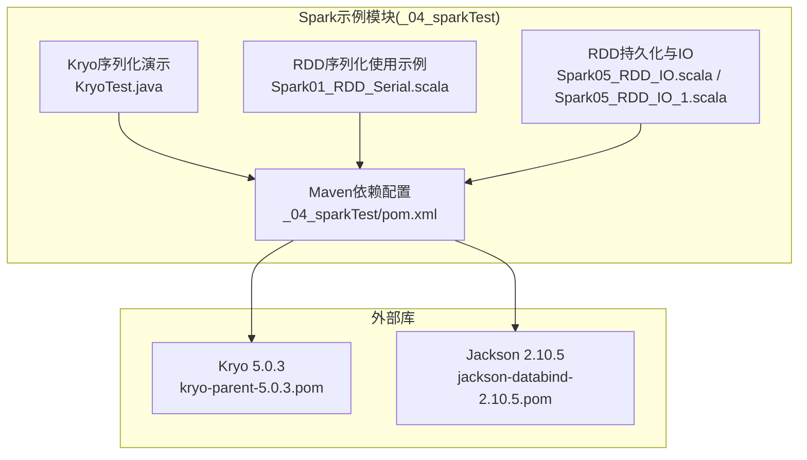
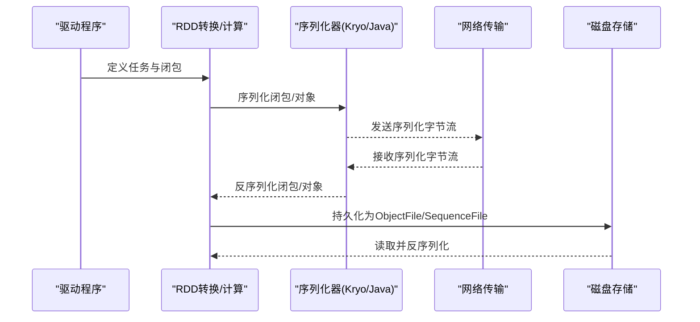
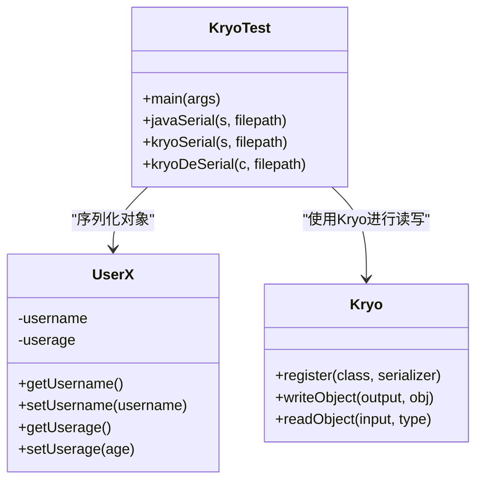
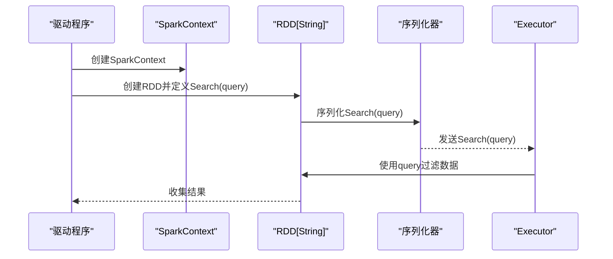
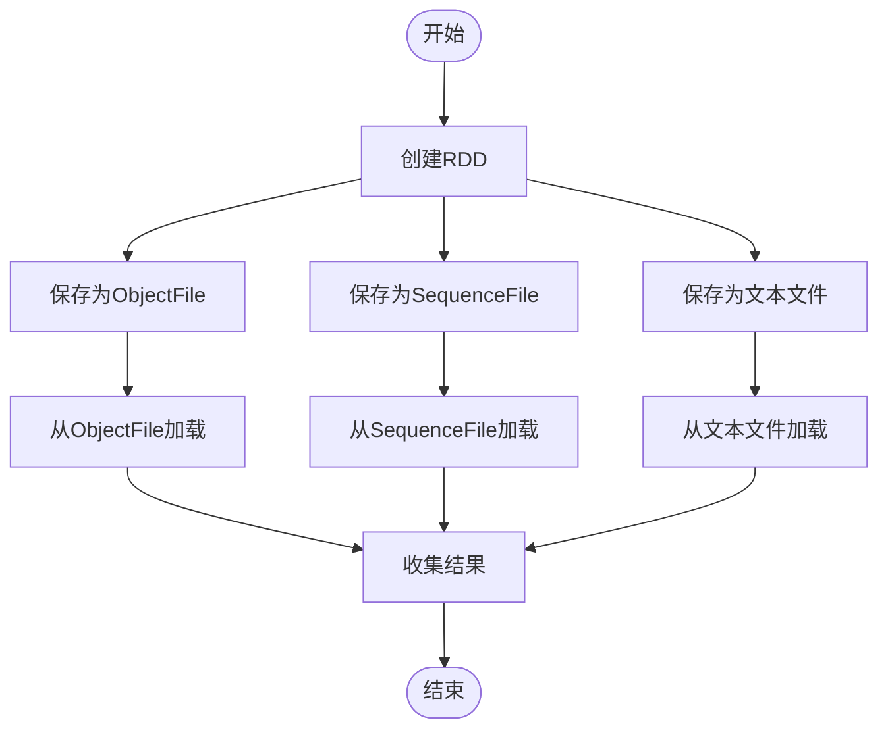
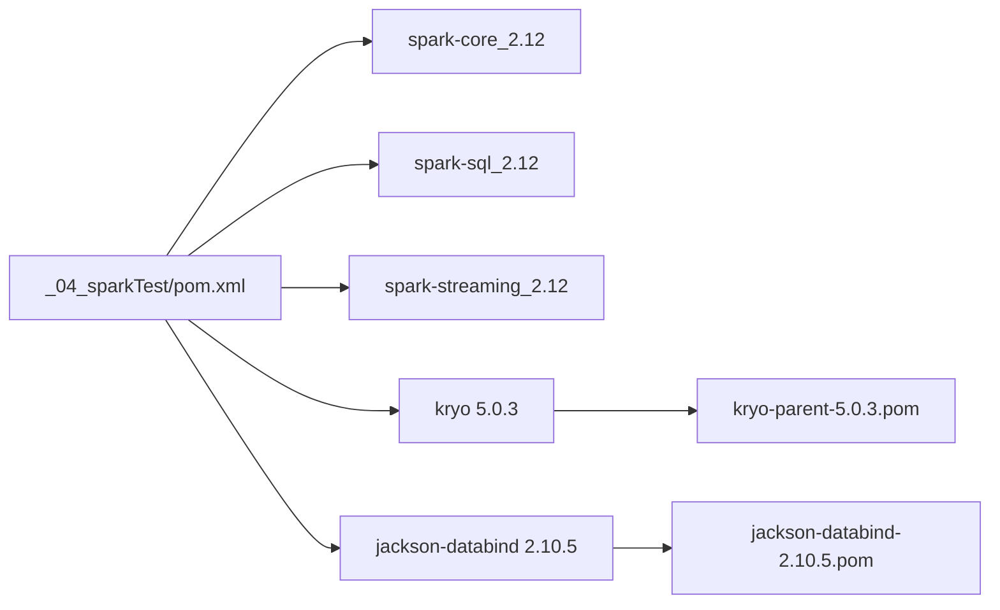

# 序列化机制

<cite>
**本文引用的文件**
- [KryoTest.java](file://_04_sparkTest/src/main/java/com/atguigu/bigdata/spark/core/test/KryoTest.java)
- [Spark01_RDD_Serial.scala](file://_04_sparkTest/src/main/java/com/atguigu/bigdata/spark/core/rdd/oper/serial/Spark01_RDD_Serial.scala)
- [Spark05_RDD_IO.scala](file://_04_sparkTest/src/main/java/com/atguigu/bigdata/spark/core/rdd/persist/Spark05_RDD_IO.scala)
- [Spark05_RDD_IO_1.scala](file://_04_sparkTest/src/main/java/com/atguigu/bigdata/spark/core/rdd/persist/Spark05_RDD_IO_1.scala)
- [_04_sparkTest/pom.xml](file://_04_sparkTest/pom.xml)
- [kryo-parent-5.0.3.pom](file://com/esotericsoftware/kryo-parent/5.0.3/kryo-parent-5.0.3.pom)
- [jackson-databind-2.10.5.pom](file://com/fasterxml/jackson/core/jackson-databind/2.10.5/jackson-databind-2.10.5.pom)
</cite>

## 目录
1. [引言](#引言)
2. [项目结构](#项目结构)
3. [核心组件](#核心组件)
4. [架构总览](#架构总览)
5. [详细组件分析](#详细组件分析)
6. [依赖关系分析](#依赖关系分析)
7. [性能考量](#性能考量)
8. [故障排查指南](#故障排查指南)
9. [结论](#结论)
10. [附录](#附录)

## 引言
本技术文档围绕RDD序列化机制展开，结合仓库中的示例代码，系统阐述Spark中对象序列化的必要性、实现原理与实践要点。文档重点覆盖以下方面：
- Java序列化与Kryo序列化的特性与性能差异
- 如何在Spark中选择与配置合适的序列化器
- 在何种场景下需要实现Serializable接口
- 通过具体示例展示不同序列化方式的性能差异
- 序列化对网络传输与磁盘存储的影响及优化策略
- 常见序列化问题（如NotSerializableException）的诊断与修复

## 项目结构
该仓库与Spark序列化相关的示例主要集中在_sparkTest模块中，涉及Kryo序列化演示、RDD持久化与IO操作、以及序列化在RDD操作中的应用。

图示来源
- [KryoTest.java](file://_04_sparkTest/src/main/java/com/atguigu/bigdata/spark/core/test/KryoTest.java#L1-L88)
- [Spark01_RDD_Serial.scala](file://_04_sparkTest/src/main/java/com/atguigu/bigdata/spark/core/rdd/oper/serial/Spark01_RDD_Serial.scala#L1-L37)
- [Spark05_RDD_IO.scala](file://_04_sparkTest/src/main/java/com/atguigu/bigdata/spark/core/rdd/persist/Spark05_RDD_IO.scala#L1-L27)
- [Spark05_RDD_IO_1.scala](file://_04_sparkTest/src/main/java/com/atguigu/bigdata/spark/core/rdd/persist/Spark05_RDD_IO_1.scala#L1-L21)
- [_04_sparkTest/pom.xml](file://_04_sparkTest/pom.xml#L1-L73)
- [kryo-parent-5.0.3.pom](file://com/esotericsoftware/kryo-parent/5.0.3/kryo-parent-5.0.3.pom#L42-L98)
- [jackson-databind-2.10.5.pom](file://com/fasterxml/jackson/core/jackson-databind/2.10.5/jackson-databind-2.10.5.pom#L69-L113)

章节来源
- [KryoTest.java](file://_04_sparkTest/src/main/java/com/atguigu/bigdata/spark/core/test/KryoTest.java#L1-L88)
- [Spark01_RDD_Serial.scala](file://_04_sparkTest/src/main/java/com/atguigu/bigdata/spark/core/rdd/oper/serial/Spark01_RDD_Serial.scala#L1-L37)
- [Spark05_RDD_IO.scala](file://_04_sparkTest/src/main/java/com/atguigu/bigdata/spark/core/rdd/persist/Spark05_RDD_IO.scala#L1-L27)
- [Spark05_RDD_IO_1.scala](file://_04_sparkTest/src/main/java/com/atguigu/bigdata/spark/core/rdd/persist/Spark05_RDD_IO_1.scala#L1-L21)
- [_04_sparkTest/pom.xml](file://_04_sparkTest/pom.xml#L1-L73)

## 核心组件
- Kryo序列化演示：通过Kryo对自定义可序列化对象进行序列化与反序列化，展示Kryo的注册与读写流程。
- RDD序列化使用示例：演示在RDD转换过程中，闭包变量的序列化与传递。
- RDD持久化与IO：展示saveAsObjectFile等持久化方式，体现序列化在磁盘存储中的作用。
- Maven依赖：明确引入Kryo与Jackson等序列化相关库，支撑示例运行。

章节来源
- [KryoTest.java](file://_04_sparkTest/src/main/java/com/atguigu/bigdata/spark/core/test/KryoTest.java#L1-L88)
- [Spark01_RDD_Serial.scala](file://_04_sparkTest/src/main/java/com/atguigu/bigdata/spark/core/rdd/oper/serial/Spark01_RDD_Serial.scala#L1-L37)
- [Spark05_RDD_IO.scala](file://_04_sparkTest/src/main/java/com/atguigu/bigdata/spark/core/rdd/persist/Spark05_RDD_IO.scala#L1-L27)
- [Spark05_RDD_IO_1.scala](file://_04_sparkTest/src/main/java/com/atguigu/bigdata/spark/core/rdd/persist/Spark05_RDD_IO_1.scala#L1-L21)
- [_04_sparkTest/pom.xml](file://_04_sparkTest/pom.xml#L1-L73)

## 架构总览
从整体上看，序列化贯穿Spark执行链路的关键节点：
- 计算阶段：闭包变量与函数在Executor之间传输时需要序列化
- 存储阶段：RDD持久化到磁盘或广播传播时需要序列化
- IO阶段：保存为ObjectFile/SequenceFile等格式时依赖序列化器

图示来源
- [Spark01_RDD_Serial.scala](file://_04_sparkTest/src/main/java/com/atguigu/bigdata/spark/core/rdd/oper/serial/Spark01_RDD_Serial.scala#L1-L37)
- [Spark05_RDD_IO.scala](file://_04_sparkTest/src/main/java/com/atguigu/bigdata/spark/core/rdd/persist/Spark05_RDD_IO.scala#L1-L27)
- [Spark05_RDD_IO_1.scala](file://_04_sparkTest/src/main/java/com/atguigu/bigdata/spark/core/rdd/persist/Spark05_RDD_IO_1.scala#L1-L21)

## 详细组件分析

### 组件A：Kryo序列化演示（KryoTest）
该组件通过Kryo对实现了Serializable的用户对象进行序列化与反序列化，展示了注册BeanSerializer与读写流程。

图示来源
- [KryoTest.java](file://_04_sparkTest/src/main/java/com/atguigu/bigdata/spark/core/test/KryoTest.java#L1-L88)

章节来源
- [KryoTest.java](file://_04_sparkTest/src/main/java/com/atguigu/bigdata/spark/core/test/KryoTest.java#L1-L88)

### 组件B：RDD序列化使用示例（Spark01_RDD_Serial）
该示例演示了在RDD转换中使用带状态的内部类Search，其字段作为闭包被序列化并在Executor端使用。

图示来源
- [Spark01_RDD_Serial.scala](file://_04_sparkTest/src/main/java/com/atguigu/bigdata/spark/core/rdd/oper/serial/Spark01_RDD_Serial.scala#L1-L37)

章节来源
- [Spark01_RDD_Serial.scala](file://_04_sparkTest/src/main/java/com/atguigu/bigdata/spark/core/rdd/oper/serial/Spark01_RDD_Serial.scala#L1-L37)

### 组件C：RDD持久化与IO（Spark05_RDD_IO / Spark05_RDD_IO_1）
这两个Scala文件分别演示了将RDD保存为文本文件、ObjectFile与SequenceFile，并展示了从这些格式读取数据的过程。

图示来源
- [Spark05_RDD_IO.scala](file://_04_sparkTest/src/main/java/com/atguigu/bigdata/spark/core/rdd/persist/Spark05_RDD_IO.scala#L1-L27)
- [Spark05_RDD_IO_1.scala](file://_04_sparkTest/src/main/java/com/atguigu/bigdata/spark/core/rdd/persist/Spark05_RDD_IO_1.scala#L1-L21)

章节来源
- [Spark05_RDD_IO.scala](file://_04_sparkTest/src/main/java/com/atguigu/bigdata/spark/core/rdd/persist/Spark05_RDD_IO.scala#L1-L27)
- [Spark05_RDD_IO_1.scala](file://_04_sparkTest/src/main/java/com/atguigu/bigdata/spark/core/rdd/persist/Spark05_RDD_IO_1.scala#L1-L21)

## 依赖关系分析
- Spark版本与Scala版本：pom中声明了spark-core/spark-sql/spark-streaming等依赖，版本为3.0.0，Scala版本为2.12。
- Kryo依赖：直接引入kryo 5.0.3，用于高性能序列化。
- Jackson依赖：引入jackson-core与jackson-databind，用于JSON等数据格式处理。

图示来源
- [_04_sparkTest/pom.xml](file://_04_sparkTest/pom.xml#L1-L73)
- [kryo-parent-5.0.3.pom](file://com/esotericsoftware/kryo-parent/5.0.3/kryo-parent-5.0.3.pom#L42-L98)
- [jackson-databind-2.10.5.pom](file://com/fasterxml/jackson/core/jackson-databind/2.10.5/jackson-databind-2.10.5.pom#L69-L113)

章节来源
- [_04_sparkTest/pom.xml](file://_04_sparkTest/pom.xml#L1-L73)
- [kryo-parent-5.0.3.pom](file://com/esotericsoftware/kryo-parent/5.0.3/kryo-parent-5.0.3.pom#L42-L98)
- [jackson-databind-2.10.5.pom](file://com/fasterxml/jackson/core/jackson-databind/2.10.5/jackson-databind-2.10.5.pom#L69-L113)

## 性能考量
- Java序列化与Kryo序列化对比
  - Java序列化：通用性强，但开销较大，适合简单场景；在示例中通过ObjectOutputStream进行对象写入。
  - Kryo序列化：基于注册的BeanSerializer，序列化体积更小、速度更快，适合复杂对象与频繁传输场景；示例中通过Kryo的register/readObject/writeObject完成读写。
- Spark中的序列化选择
  - 对于闭包变量与函数传输，建议优先考虑Kryo以降低网络传输与内存占用。
  - 对于需要跨语言或跨平台的数据交换，可考虑使用更通用的序列化方案（如JSON），但需权衡性能。
- RDD持久化与磁盘IO
  - 使用ObjectFile/SequenceFile等格式持久化RDD时，序列化器直接影响写入与读取性能。Kryo通常能带来更小的文件体积与更快的IO速度。
- 优化建议
  - 显式注册常用类型，减少反射开销
  - 尽量避免传输不可序列化对象或大对象
  - 合理拆分任务，降低闭包大小

章节来源
- [KryoTest.java](file://_04_sparkTest/src/main/java/com/atguigu/bigdata/spark/core/test/KryoTest.java#L1-L88)
- [Spark05_RDD_IO.scala](file://_04_sparkTest/src/main/java/com/atguigu/bigdata/spark/core/rdd/persist/Spark05_RDD_IO.scala#L1-L27)
- [Spark05_RDD_IO_1.scala](file://_04_sparkTest/src/main/java/com/atguigu/bigdata/spark/core/rdd/persist/Spark05_RDD_IO_1.scala#L1-L21)

## 故障排查指南
- 常见问题：NotSerializableException
  - 现象：在分布式计算中，若闭包或对象未实现Serializable，或包含非序列化字段，会抛出此类异常。
  - 诊断思路：
    - 检查闭包中使用的类是否实现Serializable
    - 检查是否存在transient字段导致序列化失败
    - 在Kryo示例中，UserX实现了Serializable，且transient字段不会被序列化，这可能影响反序列化后的状态一致性
  - 修复建议：
    - 为所有需要在网络间传输的对象实现Serializable
    - 对于不需要持久化的字段使用transient修饰，或在业务层自行处理
    - 在Spark中显式注册常用类型，避免反射带来的不确定性
- 其他建议
  - 在开发阶段开启严格序列化检查，尽早暴露问题
  - 对大对象进行拆分或缓存，减少序列化与网络传输成本

章节来源
- [KryoTest.java](file://_04_sparkTest/src/main/java/com/atguigu/bigdata/spark/core/test/KryoTest.java#L1-L88)
- [Spark01_RDD_Serial.scala](file://_04_sparkTest/src/main/java/com/atguigu/bigdata/spark/core/rdd/oper/serial/Spark01_RDD_Serial.scala#L1-L37)

## 结论
- Spark应用的性能与稳定性在很大程度上取决于序列化策略的选择与配置。Kryo相比Java序列化具有更小的体积与更高的吞吐，适合大多数生产场景。
- 在RDD计算与持久化环节，应优先采用Kryo，并对常用类型进行注册，以获得最佳性能。
- 对于需要跨语言或跨平台的数据交换，可考虑通用序列化方案，但需评估性能代价。
- 通过示例代码与依赖配置，可以快速搭建基于Kryo的序列化环境，并在实际项目中逐步优化。

## 附录
- 示例路径参考
  - Kryo序列化演示：[KryoTest.java](file://_04_sparkTest/src/main/java/com/atguigu/bigdata/spark/core/test/KryoTest.java#L1-L88)
  - RDD序列化使用示例：[Spark01_RDD_Serial.scala](file://_04_sparkTest/src/main/java/com/atguigu/bigdata/spark/core/rdd/oper/serial/Spark01_RDD_Serial.scala#L1-L37)
  - RDD持久化与IO：[Spark05_RDD_IO.scala](file://_04_sparkTest/src/main/java/com/atguigu/bigdata/spark/core/rdd/persist/Spark05_RDD_IO.scala#L1-L27)、[Spark05_RDD_IO_1.scala](file://_04_sparkTest/src/main/java/com/atguigu/bigdata/spark/core/rdd/persist/Spark05_RDD_IO_1.scala#L1-L21)
  - 依赖配置：[_04_sparkTest/pom.xml](file://_04_sparkTest/pom.xml#L1-L73)