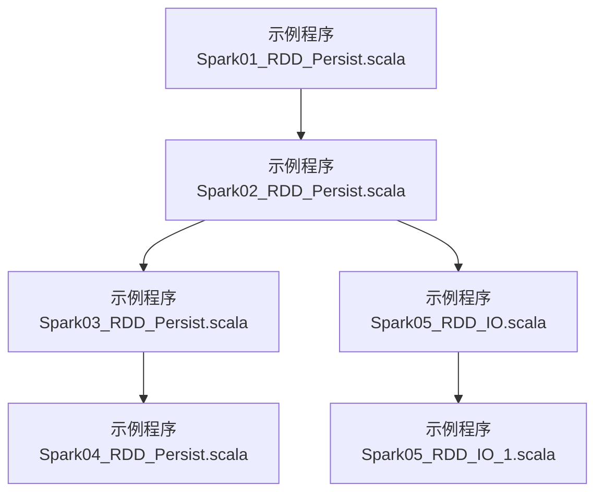
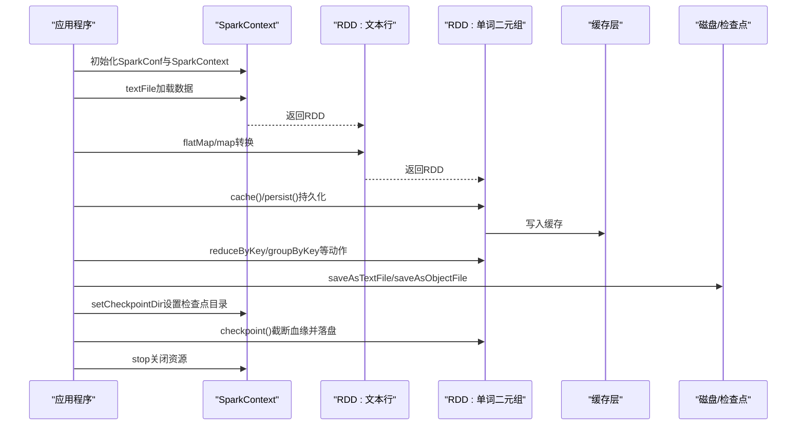
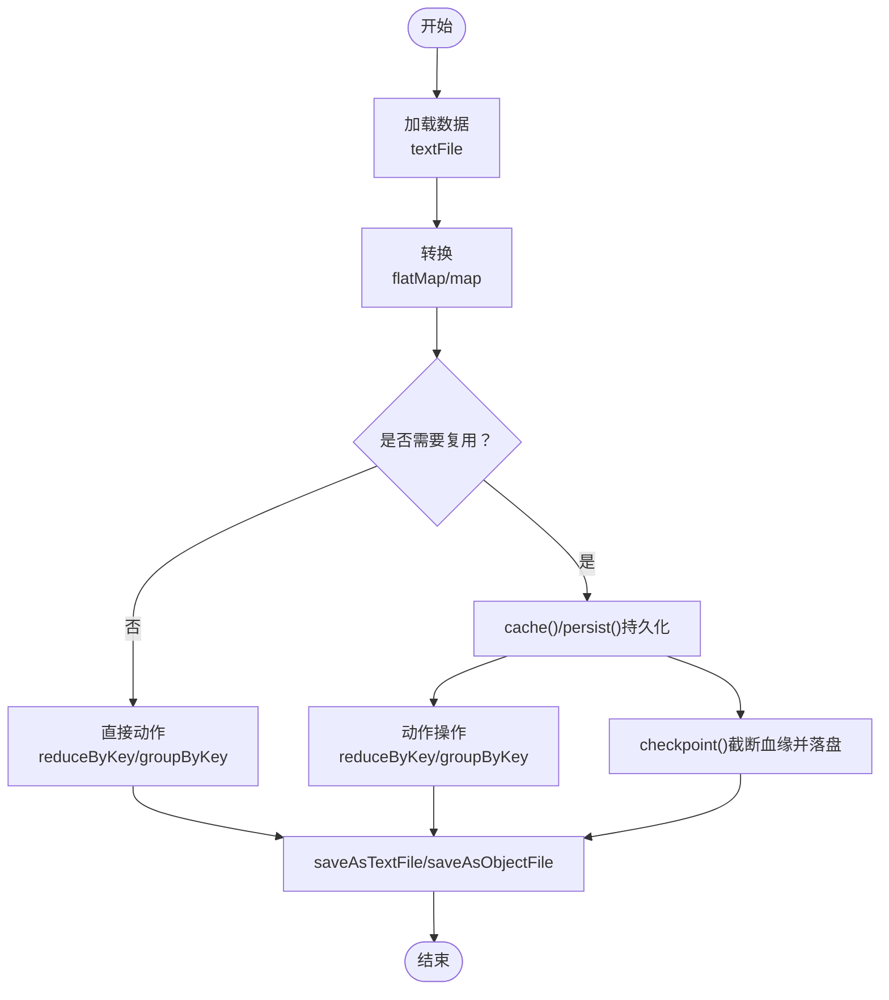
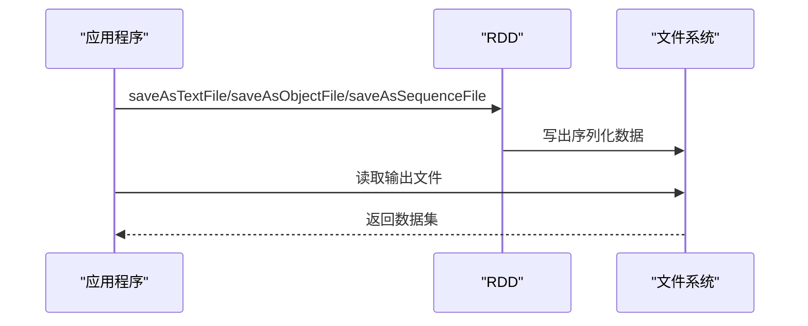
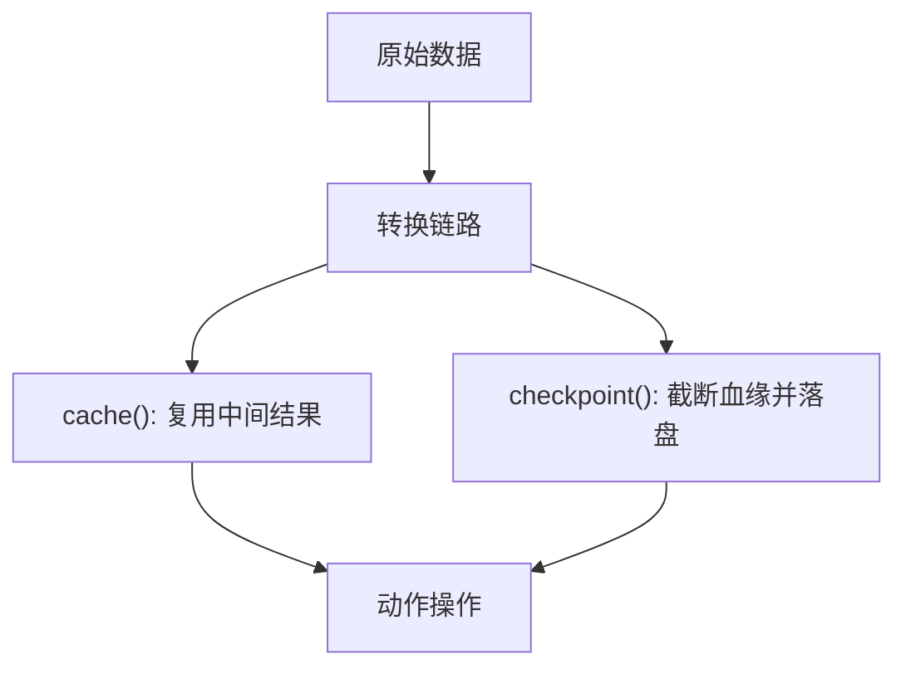
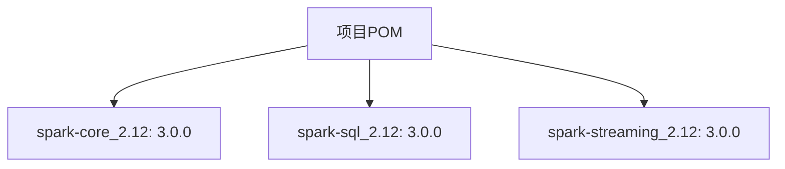

# 持久化与缓存

<cite>
**本文引用的文件**
- [Spark01_RDD_Persist.scala](file://_04_sparkTest/src/main/java/com/atguigu/bigdata/spark/core/rdd/persist/Spark01_RDD_Persist.scala)
- [Spark02_RDD_Persist.scala](file://_04_sparkTest/src/main/java/com/atguigu/bigdata/spark/core/rdd/persist/Spark02_RDD_Persist.scala)
- [Spark03_RDD_Persist.scala](file://_04_sparkTest/src/main/java/com/atguigu/bigdata/spark/core/rdd/persist/Spark03_RDD_Persist.scala)
- [Spark04_RDD_Persist.scala](file://_04_sparkTest/src/main/java/com/atguigu/bigdata/spark/core/rdd/persist/Spark04_RDD_Persist.scala)
- [Spark05_RDD_IO.scala](file://_04_sparkTest/src/main/java/com/atguigu/bigdata/spark/core/rdd/persist/Spark05_RDD_IO.scala)
- [Spark05_RDD_IO_1.scala](file://_04_sparkTest/src/main/java/com/atguigu/bigdata/spark/core/rdd/persist/Spark05_RDD_IO_1.scala)
- [pom.xml](file://_04_sparkTest/pom.xml)
</cite>

## 目录
1. [引言](#引言)
2. [项目结构](#项目结构)
3. [核心组件](#核心组件)
4. [架构总览](#架构总览)
5. [详细组件分析](#详细组件分析)
6. [依赖分析](#依赖分析)
7. [性能考量](#性能考量)
8. [故障排查指南](#故障排查指南)
9. [结论](#结论)
10. [附录](#附录)

## 引言
本技术文档围绕Spark RDD的持久化与缓存机制展开，系统阐述以下主题：
- RDD持久化与缓存的概念、重要性与适用场景
- 常见存储级别（如MEMORY_ONLY、MEMORY_AND_DISK、DISK_ONLY等）的特性与选择原则
- 如何结合数据规模、访问频率与内存限制选择合适的存储级别
- 使用cache()与persist()等API进行持久化的实践方法
- 持久化对性能的影响、内存管理机制、清理与失效策略
- 监控与管理缓存状态的方法
- 实战优化案例与最佳实践

## 项目结构
本仓库中与RDD持久化直接相关的示例位于“_04_sparkTest/src/main/java/.../rdd/persist”目录下，包含多个演示不同持久化策略与I/O方式的样例程序。这些示例通过本地模式运行，便于观察缓存行为与调试。

图表来源
- [Spark01_RDD_Persist.scala](file://_04_sparkTest/src/main/java/com/atguigu/bigdata/spark/core/rdd/persist/Spark01_RDD_Persist.scala#L1-L30)
- [Spark02_RDD_Persist.scala](file://_04_sparkTest/src/main/java/com/atguigu/bigdata/spark/core/rdd/persist/Spark02_RDD_Persist.scala#L1-L39)
- [Spark03_RDD_Persist.scala](file://_04_sparkTest/src/main/java/com/atguigu/bigdata/spark/core/rdd/persist/Spark03_RDD_Persist.scala#L1-L39)
- [Spark04_RDD_Persist.scala](file://_04_sparkTest/src/main/java/com/atguigu/bigdata/spark/core/rdd/persist/Spark04_RDD_Persist.scala#L1-L36)
- [Spark05_RDD_IO.scala](file://_04_sparkTest/src/main/java/com/atguigu/bigdata/spark/core/rdd/persist/Spark05_RDD_IO.scala#L1-L28)
- [Spark05_RDD_IO_1.scala](file://_04_sparkTest/src/main/java/com/atguigu/bigdata/spark/core/rdd/persist/Spark05_RDD_IO_1.scala#L1-L22)

章节来源
- [Spark01_RDD_Persist.scala](file://_04_sparkTest/src/main/java/com/atguigu/bigdata/spark/core/rdd/persist/Spark01_RDD_Persist.scala#L1-L30)
- [Spark02_RDD_Persist.scala](file://_04_sparkTest/src/main/java/com/atguigu/bigdata/spark/core/rdd/persist/Spark02_RDD_Persist.scala#L1-L39)
- [Spark03_RDD_Persist.scala](file://_04_sparkTest/src/main/java/com/atguigu/bigdata/spark/core/rdd/persist/Spark03_RDD_Persist.scala#L1-L39)
- [Spark04_RDD_Persist.scala](file://_04_sparkTest/src/main/java/com/atguigu/bigdata/spark/core/rdd/persist/Spark04_RDD_Persist.scala#L1-L36)
- [Spark05_RDD_IO.scala](file://_04_sparkTest/src/main/java/com/atguigu/bigdata/spark/core/rdd/persist/Spark05_RDD_IO.scala#L1-L28)
- [Spark05_RDD_IO_1.scala](file://_04_sparkTest/src/main/java/com/atguigu/bigdata/spark/core/rdd/persist/Spark05_RDD_IO_1.scala#L1-L22)

## 核心组件
- Spark环境初始化与配置
  - 示例通过SparkConf与SparkContext构建本地运行环境，并设置主节点与应用名。
  - 示例展示了如何设置检查点目录（用于后续的checkpoint操作）。
- RDD构建与转换
  - 使用textFile加载文本数据，flatMap与map进行分词与键值映射，随后进行reduceByKey与groupByKey等聚合操作。
- 缓存与持久化
  - cache()与persist()用于将中间结果写入存储层，避免重复计算。
  - checkpoint()用于切断血缘并落盘，增强容错与跨应用复用能力。
- 数据序列化与落盘
  - saveAsTextFile、saveAsObjectFile、saveAsSequenceFile等用于将结果或中间数据序列化输出。
  - 通过sc.textFile、sc.objectFile、sc.sequenceFile等从磁盘读回数据。

章节来源
- [Spark01_RDD_Persist.scala](file://_04_sparkTest/src/main/java/com/atguigu/bigdata/spark/core/rdd/persist/Spark01_RDD_Persist.scala#L1-L30)
- [Spark02_RDD_Persist.scala](file://_04_sparkTest/src/main/java/com/atguigu/bigdata/spark/core/rdd/persist/Spark02_RDD_Persist.scala#L1-L39)
- [Spark03_RDD_Persist.scala](file://_04_sparkTest/src/main/java/com/atguigu/bigdata/spark/core/rdd/persist/Spark03_RDD_Persist.scala#L1-L39)
- [Spark04_RDD_Persist.scala](file://_04_sparkTest/src/main/java/com/atguigu/bigdata/spark/core/rdd/persist/Spark04_RDD_Persist.scala#L1-L36)
- [Spark05_RDD_IO.scala](file://_04_sparkTest/src/main/java/com/atguigu/bigdata/spark/core/rdd/persist/Spark05_RDD_IO.scala#L1-L28)
- [Spark05_RDD_IO_1.scala](file://_04_sparkTest/src/main/java/com/atguigu/bigdata/spark/core/rdd/persist/Spark05_RDD_IO_1.scala#L1-L22)

## 架构总览
下图展示了从数据加载到缓存、持久化与落盘的整体流程，以及checkpoint对血缘的处理效果。

图表来源
- [Spark02_RDD_Persist.scala](file://_04_sparkTest/src/main/java/com/atguigu/bigdata/spark/core/rdd/persist/Spark02_RDD_Persist.scala#L1-L39)
- [Spark03_RDD_Persist.scala](file://_04_sparkTest/src/main/java/com/atguigu/bigdata/spark/core/rdd/persist/Spark03_RDD_Persist.scala#L1-L39)
- [Spark04_RDD_Persist.scala](file://_04_sparkTest/src/main/java/com/atguigu/bigdata/spark/core/rdd/persist/Spark04_RDD_Persist.scala#L1-L36)
- [Spark05_RDD_IO.scala](file://_04_sparkTest/src/main/java/com/atguigu/bigdata/spark/core/rdd/persist/Spark05_RDD_IO.scala#L1-L28)

## 详细组件分析

### 组件A：缓存与持久化策略
- cache()与persist()的作用
  - 将中间结果写入缓存层，避免重复计算；在多次动作操作之间复用。
  - persist()支持指定存储级别，可按需选择内存/磁盘组合。
- checkpoint()的作用
  - 截断RDD的血缘关系，将结果写入检查点目录，提升容错与跨应用复用能力。
  - 通常与cache()配合使用，先缓存再落盘，减少重复计算成本。

图表来源
- [Spark02_RDD_Persist.scala](file://_04_sparkTest/src/main/java/com/atguigu/bigdata/spark/core/rdd/persist/Spark02_RDD_Persist.scala#L1-L39)
- [Spark03_RDD_Persist.scala](file://_04_sparkTest/src/main/java/com/atguigu/bigdata/spark/core/rdd/persist/Spark03_RDD_Persist.scala#L1-L39)
- [Spark04_RDD_Persist.scala](file://_04_sparkTest/src/main/java/com/atguigu/bigdata/spark/core/rdd/persist/Spark04_RDD_Persist.scala#L1-L36)

章节来源
- [Spark02_RDD_Persist.scala](file://_04_sparkTest/src/main/java/com/atguigu/bigdata/spark/core/rdd/persist/Spark02_RDD_Persist.scala#L1-L39)
- [Spark03_RDD_Persist.scala](file://_04_sparkTest/src/main/java/com/atguigu/bigdata/spark/core/rdd/persist/Spark03_RDD_Persist.scala#L1-L39)
- [Spark04_RDD_Persist.scala](file://_04_sparkTest/src/main/java/com/atguigu/bigdata/spark/core/rdd/persist/Spark04_RDD_Persist.scala#L1-L36)

### 组件B：存储级别与选择原则
- 常见存储级别（基于Spark StorageLevel）
  - MEMORY_ONLY：仅内存，速度快但易溢出。
  - MEMORY_AND_DISK：内存不足时落盘，兼顾速度与容量。
  - DISK_ONLY：全部落盘，最安全但最慢。
  - 其他级别：包含副本、序列化方式、是否使用堆外内存等变体。
- 选择原则
  - 数据规模与内存上限：内存充足且热数据优先MEMORY_ONLY；否则选择MEMORY_AND_DISK。
  - 访问频率：高频热数据适合内存；低频数据可选DISK_ONLY。
  - 内存压力与GC影响：内存过载可能引发频繁GC，应考虑落盘或降低副本。
  - 序列化开销：压缩序列化可节省内存，但CPU开销增加。
- 在示例中的体现
  - 示例通过注释与调用cache()/persist()展示持久化的基本用法，未显式指定存储级别时，默认使用MEMORY_ONLY。

章节来源
- [Spark02_RDD_Persist.scala](file://_04_sparkTest/src/main/java/com/atguigu/bigdata/spark/core/rdd/persist/Spark02_RDD_Persist.scala#L1-L39)

### 组件C：I/O与数据落盘
- 写出
  - saveAsTextFile：文本格式写出。
  - saveAsObjectFile：对象序列化写出。
  - saveAsSequenceFile：键值对序列化写出（要求KV类型）。
- 读入
  - sc.textFile：从文本文件读取。
  - sc.objectFile：从对象序列化文件读取。
  - sc.sequenceFile：从序列化文件读取键值对。
- 在示例中的体现
  - 示例先将RDD写出多种格式，再从磁盘读回验证数据一致性。

图表来源
- [Spark05_RDD_IO.scala](file://_04_sparkTest/src/main/java/com/atguigu/bigdata/spark/core/rdd/persist/Spark05_RDD_IO.scala#L1-L28)
- [Spark05_RDD_IO_1.scala](file://_04_sparkTest/src/main/java/com/atguigu/bigdata/spark/core/rdd/persist/Spark05_RDD_IO_1.scala#L1-L22)

章节来源
- [Spark05_RDD_IO.scala](file://_04_sparkTest/src/main/java/com/atguigu/bigdata/spark/core/rdd/persist/Spark05_RDD_IO.scala#L1-L28)
- [Spark05_RDD_IO_1.scala](file://_04_sparkTest/src/main/java/com/atguigu/bigdata/spark/core/rdd/persist/Spark05_RDD_IO_1.scala#L1-L22)

### 组件D：血缘与检查点
- 血缘关系
  - cache()不会切断血缘，只是在缓存层复用中间结果。
  - checkpoint()会切断血缘，将结果写入检查点目录，后续重算只需从检查点开始。
- 在示例中的体现
  - 示例明确注释了cache与checkpoint对血缘的不同影响，并在设置检查点目录后调用checkpoint()。

图表来源
- [Spark03_RDD_Persist.scala](file://_04_sparkTest/src/main/java/com/atguigu/bigdata/spark/core/rdd/persist/Spark03_RDD_Persist.scala#L1-L39)
- [Spark04_RDD_Persist.scala](file://_04_sparkTest/src/main/java/com/atguigu/bigdata/spark/core/rdd/persist/Spark04_RDD_Persist.scala#L1-L36)

章节来源
- [Spark03_RDD_Persist.scala](file://_04_sparkTest/src/main/java/com/atguigu/bigdata/spark/core/rdd/persist/Spark03_RDD_Persist.scala#L1-L39)
- [Spark04_RDD_Persist.scala](file://_04_sparkTest/src/main/java/com/atguigu/bigdata/spark/core/rdd/persist/Spark04_RDD_Persist.scala#L1-L36)

## 依赖分析
- Spark版本与模块依赖
  - 示例基于Spark 3.0.0，使用spark-core、spark-sql、spark-streaming等模块。
  - 依赖通过Maven POM声明，确保编译与运行环境一致。

图表来源
- [pom.xml](file://_04_sparkTest/pom.xml#L1-L73)

章节来源
- [pom.xml](file://_04_sparkTest/pom.xml#L1-L73)

## 性能考量
- 缓存命中与重算成本
  - 对于需要多次动作的RDD，启用cache()可显著减少重复计算。
  - 对超大中间结果，优先选择MEMORY_AND_DISK，避免内存溢出。
- 存储级别权衡
  - MEMORY_ONLY：吞吐高，内存紧张时风险大。
  - MEMORY_AND_DISK：兼顾吞吐与容量，适合中大型中间结果。
  - DISK_ONLY：最稳健，但延迟最高。
- 序列化与压缩
  - 合理选择序列化方式可降低内存占用，但会增加CPU开销。
- 检查点与容错
  - checkpoint()可缩短重算路径，提高稳定性，但会带来额外IO成本。
- 监控与诊断
  - 使用toDebugString观察RDD血缘与分区信息，辅助定位缓存命中与重算问题。

章节来源
- [Spark02_RDD_Persist.scala](file://_04_sparkTest/src/main/java/com/atguigu/bigdata/spark/core/rdd/persist/Spark02_RDD_Persist.scala#L1-L39)
- [Spark04_RDD_Persist.scala](file://_04_sparkTest/src/main/java/com/atguigu/bigdata/spark/core/rdd/persist/Spark04_RDD_Persist.scala#L1-L36)

## 故障排查指南
- 检查点目录未设置
  - 若未设置检查点目录，checkpoint()会报错；示例中通过setCheckpointDir设置后方可使用。
- 缓存未生效
  - 确认在动作操作前调用cache()/persist()，并在同一作业生命周期内复用。
- 内存溢出
  - 适当降低数据驻留比例，改用MEMORY_AND_DISK或DISK_ONLY，或优化序列化方式。
- 血缘过长导致重算耗时
  - 在关键中间结果处插入checkpoint()，并结合cache()减少重复计算。
- I/O异常
  - 确认写出路径可写，读取路径正确；使用sc.textFile/sc.objectFile/sc.sequenceFile进行验证。

章节来源
- [Spark03_RDD_Persist.scala](file://_04_sparkTest/src/main/java/com/atguigu/bigdata/spark/core/rdd/persist/Spark03_RDD_Persist.scala#L1-L39)
- [Spark05_RDD_IO.scala](file://_04_sparkTest/src/main/java/com/atguigu/bigdata/spark/core/rdd/persist/Spark05_RDD_IO.scala#L1-L28)
- [Spark05_RDD_IO_1.scala](file://_04_sparkTest/src/main/java/com/atguigu/bigdata/spark/core/rdd/persist/Spark05_RDD_IO_1.scala#L1-L22)

## 结论
- RDD持久化与缓存是提升Spark作业性能的关键手段，应结合数据规模、访问频率与内存限制选择合适的存储级别。
- cache()与persist()用于加速重复计算，checkpoint()用于截断血缘与增强容错。
- 通过合理的序列化策略、I/O与监控手段，可在吞吐与稳定性之间取得平衡。
- 示例程序提供了从数据加载、转换、缓存、持久化到落盘与读回的完整实践路径，便于对照与迁移。

## 附录
- 最佳实践清单
  - 高频中间结果优先cache()，必要时指定MEMORY_ONLY或MEMORY_AND_DISK。
  - 超大中间结果使用MEMORY_AND_DISK或DISK_ONLY，避免内存溢出。
  - 在关键路径插入checkpoint()，缩短重算链路，提升稳定性。
  - 使用序列化优化内存占用，权衡CPU与内存开销。
  - 通过toDebugString与日志观察缓存命中与重算情况，持续优化。