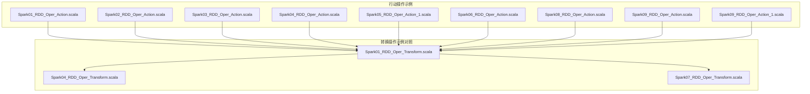
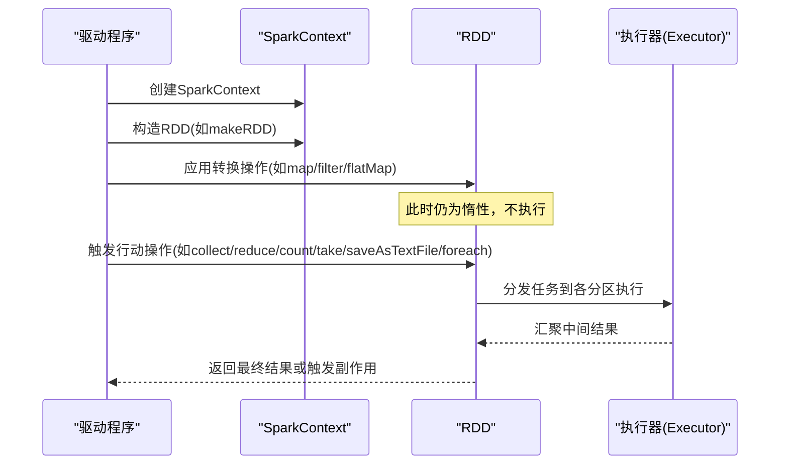
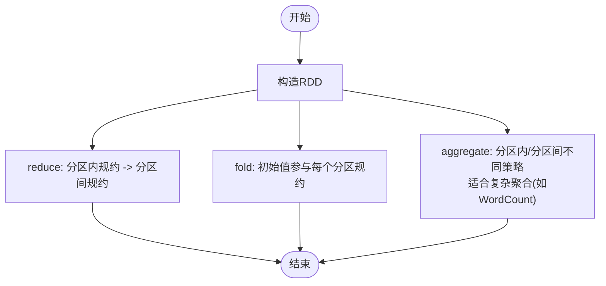

# 行动操作详解

<cite>
**本文引用的文件**
- [Spark01_RDD_Oper_Action.scala](file://_04_sparkTest/src/main/java/com/atguigu/bigdata/spark/core/rdd/oper/action/Spark01_RDD_Oper_Action.scala)
- [Spark02_RDD_Oper_Action.scala](file://_04_sparkTest/src/main/java/com/atguigu/bigdata/spark/core/rdd/oper/action/Spark02_RDD_Oper_Action.scala)
- [Spark03_RDD_Oper_Action.scala](file://_04_sparkTest/src/main/java/com/atguigu/bigdata/spark/core/rdd/oper/action/Spark03_RDD_Oper_Action.scala)
- [Spark04_RDD_Oper_Action.scala](file://_04_sparkTest/src/main/java/com/atguigu/bigdata/spark/core/rdd/oper/action/Spark04_RDD_Oper_Action.scala)
- [Spark05_RDD_Oper_Action_1.scala](file://_04_sparkTest/src/main/java/com/atguigu/bigdata/spark/core/rdd/oper/action/Spark05_RDD_Oper_Action_1.scala)
- [Spark06_RDD_Oper_Action.scala](file://_04_sparkTest/src/main/java/com/atguigu/bigdata/spark/core/rdd/oper/action/Spark06_RDD_Oper_Action.scala)
- [Spark08_RDD_Oper_Action.scala](file://_04_sparkTest/src/main/java/com/atguigu/bigdata/spark/core/rdd/oper/action/Spark08_RDD_Oper_Action.scala)
- [Spark09_RDD_Oper_Action.scala](file://_04_sparkTest/src/main/java/com/atguigu/bigdata/spark/core/rdd/oper/action/Spark09_RDD_Oper_Action.scala)
- [Spark09_RDD_Oper_Action_1.scala](file://_04_sparkTest/src/main/java/com/atguigu/bigdata/spark/core/rdd/oper/action/Spark09_RDD_Oper_Action_1.scala)
- [Spark01_RDD_Oper_Transform.scala](file://_04_sparkTest/src/main/java/com/atguigu/bigdata/spark/core/rdd/oper/transform/Spark01_RDD_Oper_Transform.scala)
- [Spark04_RDD_Oper_Transform.scala](file://_04_sparkTest/src/main/java/com/atguigu/bigdata/spark/core/rdd/oper/transform/Spark04_RDD_Oper_Transform.scala)
- [Spark07_RDD_Oper_Transform.scala](file://_04_sparkTest/src/main/java/com/atguigu/bigdata/spark/core/rdd/oper/transform/Spark07_RDD_Oper_Transform.scala)
</cite>

## 目录
1. [引言](#引言)
2. [项目结构](#项目结构)
3. [核心组件](#核心组件)
4. [架构总览](#架构总览)
5. [详细组件分析](#详细组件分析)
6. [依赖分析](#依赖分析)
7. [性能考虑](#性能考虑)
8. [故障排查指南](#故障排查指南)
9. [结论](#结论)
10. [附录](#附录)

## 引言
本文件围绕Spark RDD的“行动操作”展开系统化技术文档，结合仓库中的示例代码，深入讲解以下行动操作类别及其特性：
- 数据收集类：collect、take、first、takeOrdered
- 聚合类：reduce、fold、aggregate
- 计数类：count、countByValue（在示例中体现为count）
- 输出类：saveAsTextFile、saveAsObjectFile、saveAsSequenceFile
- 遍历副作用类：foreach

同时，文档解释行动操作如何触发作业（Job）执行、惰性求值机制的工作原理，并给出性能优化建议与常见问题排查方法。

## 项目结构
本仓库中与RDD行动操作直接相关的核心文件集中在“_04_sparkTest/src/main/java/.../rdd/oper/action/”目录下，另有若干转换操作示例用于对比说明惰性求值与实际执行的边界。



图表来源
- [Spark01_RDD_Oper_Action.scala](file://_04_sparkTest/src/main/java/com/atguigu/bigdata/spark/core/rdd/oper/action/Spark01_RDD_Oper_Action.scala#L1-L27)
- [Spark04_RDD_Oper_Transform.scala](file://_04_sparkTest/src/main/java/com/atguigu/bigdata/spark/core/rdd/oper/transform/Spark04_RDD_Oper_Transform.scala#L1-L32)

章节来源
- [Spark01_RDD_Oper_Action.scala](file://_04_sparkTest/src/main/java/com/atguigu/bigdata/spark/core/rdd/oper/action/Spark01_RDD_Oper_Action.scala#L1-L27)
- [Spark04_RDD_Oper_Transform.scala](file://_04_sparkTest/src/main/java/com/atguigu/bigdata/spark/core/rdd/oper/transform/Spark04_RDD_Oper_Transform.scala#L1-L32)

## 核心组件
- SparkContext：负责创建RDD、提交作业、管理集群资源
- RDD：分布式数据集，包含分区信息与计算逻辑；行动操作触发具体任务执行
- 行动操作：以collect、reduce、aggregate、count、take、first、takeOrdered、saveAsTextFile、foreach等为代表，返回驱动程序可消费的结果或触发副作用

章节来源
- [Spark01_RDD_Oper_Action.scala](file://_04_sparkTest/src/main/java/com/atguigu/bigdata/spark/core/rdd/oper/action/Spark01_RDD_Oper_Action.scala#L1-L27)
- [Spark03_RDD_Oper_Action.scala](file://_04_sparkTest/src/main/java/com/atguigu/bigdata/spark/core/rdd/oper/action/Spark03_RDD_Oper_Action.scala#L1-L26)

## 架构总览
从示例代码可见，行动操作与转换操作的典型调用链如下：



图表来源
- [Spark01_RDD_Oper_Action.scala](file://_04_sparkTest/src/main/java/com/atguigu/bigdata/spark/core/rdd/oper/action/Spark01_RDD_Oper_Action.scala#L1-L27)
- [Spark04_RDD_Oper_Transform.scala](file://_04_sparkTest/src/main/java/com/atguigu/bigdata/spark/core/rdd/oper/transform/Spark04_RDD_Oper_Transform.scala#L1-L32)

## 详细组件分析

### 数据收集与取样类行动操作
- collect
  - 作用：将所有分区的数据拉取到驱动程序，形成本地集合
  - 性能特点：可能对Driver内存造成压力，仅适用于小规模数据
  - 示例路径：[collect使用](file://_04_sparkTest/src/main/java/com/atguigu/bigdata/spark/core/rdd/oper/action/Spark01_RDD_Oper_Action.scala#L16-L21)、[collect与foreach对比](file://_04_sparkTest/src/main/java/com/atguigu/bigdata/spark/core/rdd/oper/action/Spark09_RDD_Oper_Action.scala#L17-L20)
- take(n)
  - 作用：从RDD中取出前n条记录（不保证全局排序）
  - 示例路径：[take使用](file://_04_sparkTest/src/main/java/com/atguigu/bigdata/spark/core/rdd/oper/action/Spark04_RDD_Oper_Action.scala#L17-L19)
- first
  - 作用：返回第一条记录
  - 示例路径：[first使用](file://_04_sparkTest/src/main/java/com/atguigu/bigdata/spark/core/rdd/oper/action/Spark04_RDD_Oper_Action.scala#L16-L16)
- takeOrdered(n)
  - 作用：按默认排序取前n条（返回有序集合）
  - 示例路径：[takeOrdered使用](file://_04_sparkTest/src/main/java/com/atguigu/bigdata/spark/core/rdd/oper/action/Spark04_RDD_Oper_Action.scala#L20-L20)

```mermaid
flowchart TD
Start(["开始"]) --> MakeRDD["构造RDD"]
MakeRDD --> ApplyTF["应用转换操作(惰性)"]
ApplyTF --> ChooseAction{"选择行动操作"}
ChooseAction --> |collect| Collect["拉取全量数据到Driver"]
ChooseAction --> |take(n)| Take["取前n条记录"]
ChooseAction --> |first| First["取第一条记录"]
ChooseAction --> |takeOrdered(n)| Ordered["取有序前n条"]
Collect --> End(["结束"])
Take --> End
First --> End
Ordered --> End
```

图表来源
- [Spark04_RDD_Oper_Action.scala](file://_04_sparkTest/src/main/java/com/atguigu/bigdata/spark/core/rdd/oper/action/Spark04_RDD_Oper_Action.scala#L1-L27)
- [Spark09_RDD_Oper_Action.scala](file://_04_sparkTest/src/main/java/com/atguigu/bigdata/spark/core/rdd/oper/action/Spark09_RDD_Oper_Action.scala#L1-L26)

章节来源
- [Spark04_RDD_Oper_Action.scala](file://_04_sparkTest/src/main/java/com/atguigu/bigdata/spark/core/rdd/oper/action/Spark04_RDD_Oper_Action.scala#L1-L27)
- [Spark09_RDD_Oper_Action.scala](file://_04_sparkTest/src/main/java/com/atguigu/bigdata/spark/core/rdd/oper/action/Spark09_RDD_Oper_Action.scala#L1-L26)

### 聚合类行动操作
- reduce(func)
  - 作用：对元素两两归约，先分区内规约，再分区间规约
  - 示例路径：[reduce使用与分区执行](file://_04_sparkTest/src/main/java/com/atguigu/bigdata/spark/core/rdd/oper/action/Spark02_RDD_Oper_Action.scala#L16-L23)
- fold(zero)(func)
  - 作用：与reduce类似，但zero作为初始值参与每个分区的规约
  - 示例路径：[fold使用](file://_04_sparkTest/src/main/java/com/atguigu/bigdata/spark/core/rdd/oper/action/Spark06_RDD_Oper_Action.scala#L18-L20)
- aggregate(zero)(seqOp, combOp)
  - 作用：支持不同类型的分区内与分区间聚合策略，适合复杂聚合（如WordCount）
  - 示例路径：[aggregate实现WordCount](file://_04_sparkTest/src/main/java/com/atguigu/bigdata/spark/core/rdd/oper/action/Spark05_RDD_Oper_Action_1.scala#L19-L38)、[aggregate与fold对比](file://_04_sparkTest/src/main/java/com/atguigu/bigdata/spark/core/rdd/oper/action/Spark06_RDD_Oper_Action.scala#L16-L21)



图表来源
- [Spark02_RDD_Oper_Action.scala](file://_04_sparkTest/src/main/java/com/atguigu/bigdata/spark/core/rdd/oper/action/Spark02_RDD_Oper_Action.scala#L1-L29)
- [Spark06_RDD_Oper_Action.scala](file://_04_sparkTest/src/main/java/com/atguigu/bigdata/spark/core/rdd/oper/action/Spark06_RDD_Oper_Action.scala#L1-L27)
- [Spark05_RDD_Oper_Action_1.scala](file://_04_sparkTest/src/main/java/com/atguigu/bigdata/spark/core/rdd/oper/action/Spark05_RDD_Oper_Action_1.scala#L1-L45)

章节来源
- [Spark02_RDD_Oper_Action.scala](file://_04_sparkTest/src/main/java/com/atguigu/bigdata/spark/core/rdd/oper/action/Spark02_RDD_Oper_Action.scala#L1-L29)
- [Spark06_RDD_Oper_Action.scala](file://_04_sparkTest/src/main/java/com/atguigu/bigdata/spark/core/rdd/oper/action/Spark06_RDD_Oper_Action.scala#L1-L27)
- [Spark05_RDD_Oper_Action_1.scala](file://_04_sparkTest/src/main/java/com/atguigu/bigdata/spark/core/rdd/oper/action/Spark05_RDD_Oper_Action_1.scala#L1-L45)

### 计数类行动操作
- count
  - 作用：统计元素总数
  - 示例路径：[count使用](file://_04_sparkTest/src/main/java/com/atguigu/bigdata/spark/core/rdd/oper/action/Spark04_RDD_Oper_Action.scala#L15-L15)
- countByValue
  - 作用：统计每个元素出现次数（在示例中体现为count的计数思想）
  - 示例路径：[count使用](file://_04_sparkTest/src/main/java/com/atguigu/bigdata/spark/core/rdd/oper/action/Spark04_RDD_Oper_Action.scala#L15-L15)

章节来源
- [Spark04_RDD_Oper_Action.scala](file://_04_sparkTest/src/main/java/com/atguigu/bigdata/spark/core/rdd/oper/action/Spark04_RDD_Oper_Action.scala#L1-L27)

### 输出类行动操作
- saveAsTextFile(path)
- saveAsObjectFile(path)
- saveAsSequenceFile(path)
  - 作用：将键值对RDD写出到指定路径（文本/序列化/SequenceFile格式）
  - 示例路径：[多种保存方式](file://_04_sparkTest/src/main/java/com/atguigu/bigdata/spark/core/rdd/oper/action/Spark08_RDD_Oper_Action.scala#L17-L21)

章节来源
- [Spark08_RDD_Oper_Action.scala](file://_04_sparkTest/src/main/java/com/atguigu/bigdata/spark/core/rdd/oper/action/Spark08_RDD_Oper_Action.scala#L1-L27)

### 副作用遍历类行动操作
- foreach(action)
  - 作用：对每个元素执行副作用（如打印、写外部存储），不会返回结果
  - 注意：在示例中演示了在Driver端累积变量与在Executor端累加的不同行为
  - 示例路径：[collect与foreach对比](file://_04_sparkTest/src/main/java/com/atguigu/bigdata/spark/core/rdd/oper/action/Spark09_RDD_Oper_Action.scala#L17-L20)、[Driver vs Executor累加](file://_04_sparkTest/src/main/java/com/atguigu/bigdata/spark/core/rdd/oper/action/Spark09_RDD_Oper_Action_1.scala#L24-L31)

章节来源
- [Spark09_RDD_Oper_Action.scala](file://_04_sparkTest/src/main/java/com/atguigu/bigdata/spark/core/rdd/oper/action/Spark09_RDD_Oper_Action.scala#L1-L26)
- [Spark09_RDD_Oper_Action_1.scala](file://_04_sparkTest/src/main/java/com/atguigu/bigdata/spark/core/rdd/oper/action/Spark09_RDD_Oper_Action_1.scala#L1-L37)

### 行动操作与转换操作的区别与联系
- 区别
  - 转换操作：map、flatMap、filter、mapPartitions等，返回新的RDD，仅记录计算计划，不立即执行
  - 行动操作：collect、reduce、count、saveAsTextFile、foreach等，触发实际计算并返回结果或产生副作用
- 联系
  - 行动操作是惰性求值的“终结者”，将转换操作构建的DAG真正执行
  - 示例路径：[转换后通过行动操作触发执行](file://_04_sparkTest/src/main/java/com/atguigu/bigdata/spark/core/rdd/oper/action/Spark01_RDD_Oper_Action.scala#L16-L21)、[flatMap与collect配合](file://_04_sparkTest/src/main/java/com/atguigu/bigdata/spark/core/rdd/oper/transform/Spark04_RDD_Oper_Transform.scala#L18-L25)

章节来源
- [Spark01_RDD_Oper_Action.scala](file://_04_sparkTest/src/main/java/com/atguigu/bigdata/spark/core/rdd/oper/action/Spark01_RDD_Oper_Action.scala#L1-L27)
- [Spark04_RDD_Oper_Transform.scala](file://_04_sparkTest/src/main/java/com/atguigu/bigdata/spark/core/rdd/oper/transform/Spark04_RDD_Oper_Transform.scala#L1-L32)

## 依赖分析
- 组件耦合
  - 行动操作依赖于SparkContext提供的执行环境与调度能力
  - 转换操作与行动操作共同构成RDD的DAG，行动操作决定何时执行
- 外部依赖
  - 文件系统：saveAsTextFile等输出依赖底层存储（如HDFS）
  - 内存与网络：collect等全量拉取对Driver内存与网络带宽提出更高要求


图表来源
- [Spark01_RDD_Oper_Action.scala](file://_04_sparkTest/src/main/java/com/atguigu/bigdata/spark/core/rdd/oper/action/Spark01_RDD_Oper_Action.scala#L1-L27)
- [Spark04_RDD_Oper_Transform.scala](file://_04_sparkTest/src/main/java/com/atguigu/bigdata/spark/core/rdd/oper/transform/Spark04_RDD_Oper_Transform.scala#L1-L32)

## 性能考虑
- 合理使用collect
  - 仅在数据规模可控时使用collect，避免Driver内存溢出
  - 参考示例：[collect风险提示与使用](file://_04_sparkTest/src/main/java/com/atguigu/bigdata/spark/core/rdd/oper/action/Spark03_RDD_Oper_Action.scala#L16-L20)
- 使用take/takeOrdered进行采样与预览
  - 在开发调试阶段优先使用take或takeOrdered获取少量样本，验证逻辑正确性
  - 参考示例：[take/takeOrdered使用](file://_04_sparkTest/src/main/java/com/atguigu/bigdata/spark/core/rdd/oper/action/Spark04_RDD_Oper_Action.scala#L17-L21)
- 聚合操作的选择
  - reduce/fold适合简单数值聚合；aggregate适合复杂聚合（如WordCount）
  - 参考示例：[aggregate实现WordCount](file://_04_sparkTest/src/main/java/com/atguigu/bigdata/spark/core/rdd/oper/action/Spark05_RDD_Oper_Action_1.scala#L19-L38)、[fold简化](file://_04_sparkTest/src/main/java/com/atguigu/bigdata/spark/core/rdd/oper/action/Spark06_RDD_Oper_Action.scala#L16-L21)
- 输出操作
  - saveAsTextFile等输出应评估目标存储的吞吐能力与分区数量
  - 参考示例：[多种保存方式](file://_04_sparkTest/src/main/java/com/atguigu/bigdata/spark/core/rdd/oper/action/Spark08_RDD_Oper_Action.scala#L17-L21)
- 副作用遍历
  - foreach适合打印或写外部系统，但注意不要在循环内做高代价操作
  - 参考示例：[Driver vs Executor累加差异](file://_04_sparkTest/src/main/java/com/atguigu/bigdata/spark/core/rdd/oper/action/Spark09_RDD_Oper_Action_1.scala#L24-L31)

章节来源
- [Spark03_RDD_Oper_Action.scala](file://_04_sparkTest/src/main/java/com/atguigu/bigdata/spark/core/rdd/oper/action/Spark03_RDD_Oper_Action.scala#L1-L26)
- [Spark04_RDD_Oper_Action.scala](file://_04_sparkTest/src/main/java/com/atguigu/bigdata/spark/core/rdd/oper/action/Spark04_RDD_Oper_Action.scala#L1-L27)
- [Spark05_RDD_Oper_Action_1.scala](file://_04_sparkTest/src/main/java/com/atguigu/bigdata/spark/core/rdd/oper/action/Spark05_RDD_Oper_Action_1.scala#L1-L45)
- [Spark06_RDD_Oper_Action.scala](file://_04_sparkTest/src/main/java/com/atguigu/bigdata/spark/core/rdd/oper/action/Spark06_RDD_Oper_Action.scala#L1-L27)
- [Spark08_RDD_Oper_Action.scala](file://_04_sparkTest/src/main/java/com/atguigu/bigdata/spark/core/rdd/oper/action/Spark08_RDD_Oper_Action.scala#L1-L27)
- [Spark09_RDD_Oper_Action_1.scala](file://_04_sparkTest/src/main/java/com/atguigu/bigdata/spark/core/rdd/oper/action/Spark09_RDD_Oper_Action_1.scala#L1-L37)

## 故障排查指南
- collect导致Driver内存不足
  - 现象：Driver OOM或长时间GC
  - 处理：改用take/takeOrdered采样，或分批处理
  - 参考示例：[collect风险提示](file://_04_sparkTest/src/main/java/com/atguigu/bigdata/spark/core/rdd/oper/action/Spark03_RDD_Oper_Action.scala#L16-L20)
- reduce/fold/aggregate结果异常
  - 现象：聚合结果与预期不符
  - 排查：确认分区内与分区间操作是否满足结合律/交换律；必要时使用aggregate并分别实现seqOp与combOp
  - 参考示例：[reduce与fold对比](file://_04_sparkTest/src/main/java/com/atguigu/bigdata/spark/core/rdd/oper/action/Spark02_RDD_Oper_Action.scala#L16-L23)、[fold简化](file://_04_sparkTest/src/main/java/com/atguigu/bigdata/spark/core/rdd/oper/action/Spark06_RDD_Oper_Action.scala#L16-L21)
- 输出失败
  - 现象：保存文件报错或无输出
  - 排查：检查输出路径权限与存储可用性；确认分区数量与数据量匹配
  - 参考示例：[保存文件示例](file://_04_sparkTest/src/main/java/com/atguigu/bigdata/spark/core/rdd/oper/action/Spark08_RDD_Oper_Action.scala#L17-L21)
- foreach副作用未生效
  - 现象：打印或外部写入未发生
  - 排查：确认是否在Executor端执行；避免在循环中进行昂贵操作
  - 参考示例：[Driver vs Executor累加](file://_04_sparkTest/src/main/java/com/atguigu/bigdata/spark/core/rdd/oper/action/Spark09_RDD_Oper_Action_1.scala#L24-L31)

章节来源
- [Spark03_RDD_Oper_Action.scala](file://_04_sparkTest/src/main/java/com/atguigu/bigdata/spark/core/rdd/oper/action/Spark03_RDD_Oper_Action.scala#L1-L26)
- [Spark02_RDD_Oper_Action.scala](file://_04_sparkTest/src/main/java/com/atguigu/bigdata/spark/core/rdd/oper/action/Spark02_RDD_Oper_Action.scala#L1-L29)
- [Spark06_RDD_Oper_Action.scala](file://_04_sparkTest/src/main/java/com/atguigu/bigdata/spark/core/rdd/oper/action/Spark06_RDD_Oper_Action.scala#L1-L27)
- [Spark08_RDD_Oper_Action.scala](file://_04_sparkTest/src/main/java/com/atguigu/bigdata/spark/core/rdd/oper/action/Spark08_RDD_Oper_Action.scala#L1-L27)
- [Spark09_RDD_Oper_Action_1.scala](file://_04_sparkTest/src/main/java/com/atguigu/bigdata/spark/core/rdd/oper/action/Spark09_RDD_Oper_Action_1.scala#L1-L37)

## 结论
- 行动操作是触发RDD惰性求值的关键节点，决定何时真正执行计算
- 不同行动操作适用于不同场景：collect用于全量数据、take/takeOrdered用于采样、reduce/fold/aggregate用于聚合、count用于计数、saveAs*用于输出、foreach用于副作用
- 实践中应优先采用采样与分区友好的行动操作，避免全量拉取带来的资源压力
- 聚合操作需关注结合律与交换律，必要时使用aggregate明确分区内与分区间策略

## 附录
- 相关转换操作示例（用于理解惰性求值与执行边界）
  - [map示例](file://_04_sparkTest/src/main/java/com/atguigu/bigdata/spark/core/rdd/oper/transform/Spark01_RDD_Oper_Transform.scala#L14-L25)
  - [flatMap示例](file://_04_sparkTest/src/main/java/com/atguigu/bigdata/spark/core/rdd/oper/transform/Spark04_RDD_Oper_Transform.scala#L18-L25)
  - [filter示例](file://_04_sparkTest/src/main/java/com/atguigu/bigdata/spark/core/rdd/oper/transform/Spark07_RDD_Oper_Transform.scala#L20-L23)

章节来源
- [Spark01_RDD_Oper_Transform.scala](file://_04_sparkTest/src/main/java/com/atguigu/bigdata/spark/core/rdd/oper/transform/Spark01_RDD_Oper_Transform.scala#L1-L31)
- [Spark04_RDD_Oper_Transform.scala](file://_04_sparkTest/src/main/java/com/atguigu/bigdata/spark/core/rdd/oper/transform/Spark04_RDD_Oper_Transform.scala#L1-L32)
- [Spark07_RDD_Oper_Transform.scala](file://_04_sparkTest/src/main/java/com/atguigu/bigdata/spark/core/rdd/oper/transform/Spark07_RDD_Oper_Transform.scala#L1-L29)