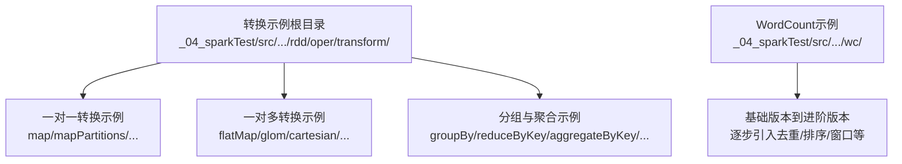
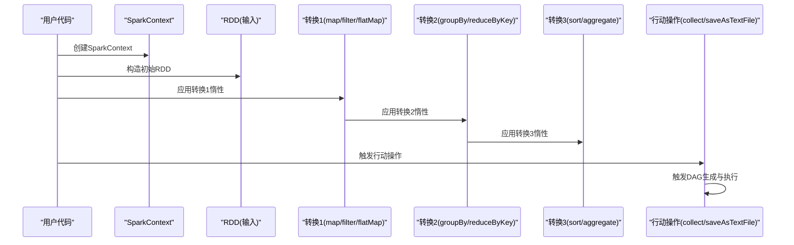
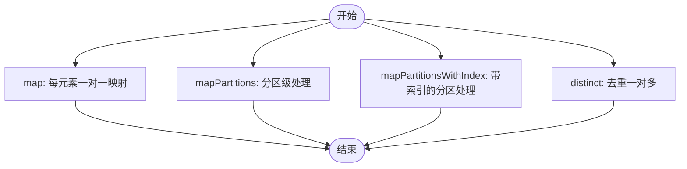
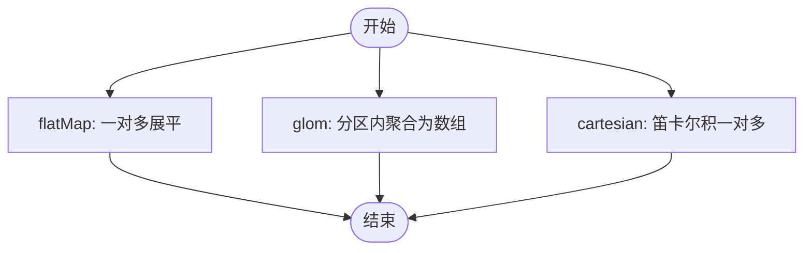
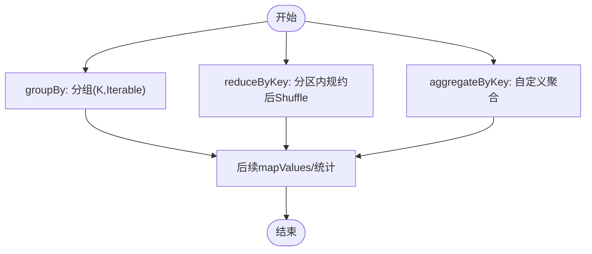
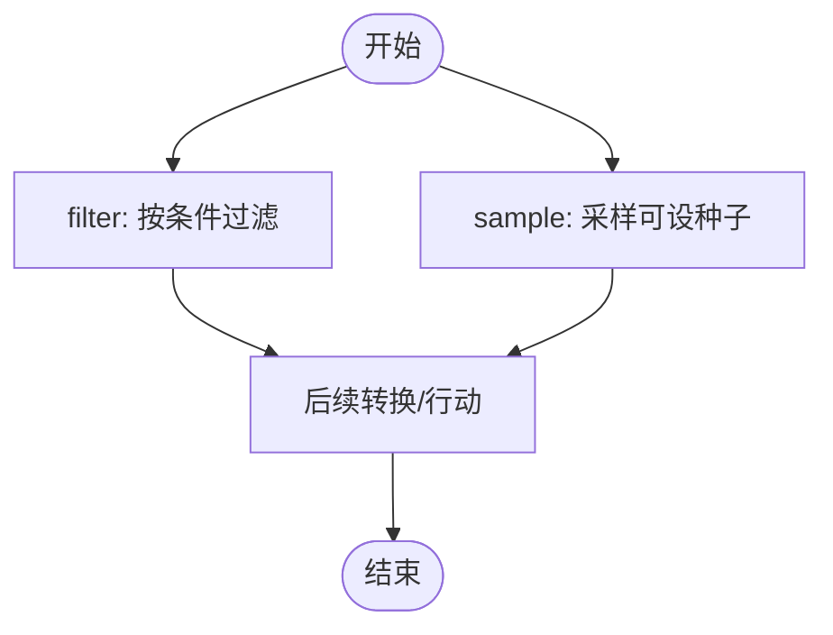
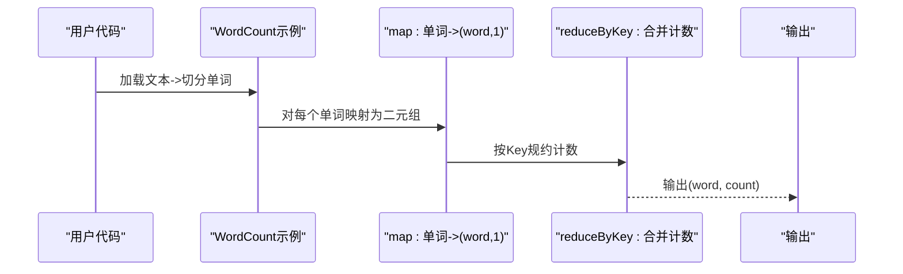
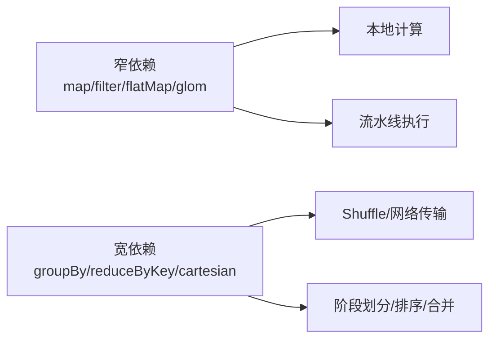

# 转换操作详解

<cite>
**本文引用的文件**
- [Spark01_RDD_Oper_Transform.scala](file://_04_sparkTest/src/main/java/com/atguigu/bigdata/spark/core/rdd/oper/transform/Spark01_RDD_Oper_Transform.scala)
- [Spark02_RDD_Oper_Transform.scala](file://_04_sparkTest/src/main/java/com/atguigu/bigdata/spark/core/rdd/oper/transform/Spark02_RDD_Oper_Transform.scala)
- [Spark03_RDD_Oper_Transform.scala](file://_04_sparkTest/src/main/java/com/atguigu/bigdata/spark/core/rdd/oper/transform/Spark03_RDD_Oper_Transform.scala)
- [Spark04_RDD_Oper_Transform.scala](file://_04_sparkTest/src/main/java/com/atguigu/bigdata/spark/core/rdd/oper/transform/Spark04_RDD_Oper_Transform.scala)
- [Spark05_RDD_Oper_Transform.scala](file://_04_sparkTest/src/main/java/com/atguigu/bigdata/spark/core/rdd/oper/transform/Spark05_RDD_Oper_Transform.scala)
- [Spark06_RDD_Oper_Transform.scala](file://_04_sparkTest/src/main/java/com/atguigu/bigdata/spark/core/rdd/oper/transform/Spark06_RDD_Oper_Transform.scala)
- [Spark07_RDD_Oper_Transform.scala](file://_04_sparkTest/src/main/java/com/atguigu/bigdata/spark/core/rdd/oper/transform/Spark07_RDD_Oper_Transform.scala)
- [Spark08_RDD_Oper_Transform.scala](file://_04_sparkTest/src/main/java/com/atguigu/bigdata/spark/core/rdd/oper/transform/Spark08_RDD_Oper_Transform.scala)
- [Spark09_RDD_Oper_Transform.scala](file://_04_sparkTest/src/main/java/com/atguigu/bigdata/spark/core/rdd/oper/transform/Spark09_RDD_Oper_Transform.scala)
- [Spark10_RDD_Oper_Transform.scala](file://_04_sparkTest/src/main/java/com/atguigu/bigdata/spark/core/rdd/oper/transform/Spark10_RDD_Oper_Transform.scala)
- [Spark11_RDD_Oper_Transform.scala](file://_04_sparkTest/src/main/java/com/atguigu/bigdata/spark/core/rdd/oper/transform/Spark11_RDD_Oper_Transform.scala)
- [Spark12_RDD_Oper_Transform.scala](file://_04_sparkTest/src/main/java/com/atguigu/bigdata/spark/core/rdd/oper/transform/Spark12_RDD_Oper_Transform.scala)
- [Spark13_RDD_Oper_Transform.scala](file://_04_sparkTest/src/main/java/com/atguigu/bigdata/spark/core/rdd/oper/transform/Spark13_RDD_Oper_Transform.scala)
- [Spark14_RDD_Oper_Transform.scala](file://_04_sparkTest/src/main/java/com/atguigu/bigdata/spark/core/rdd/oper/transform/Spark14_RDD_Oper_Transform.scala)
- [Spark15_RDD_Oper_Transform.scala](file://_04_sparkTest/src/main/java/com/atguigu/bigdata/spark/core/rdd/oper/transform/Spark15_RDD_Oper_Transform.scala)
- [Spark16_RDD_Oper_Transform.scala](file://_04_sparkTest/src/main/java/com/atguigu/bigdata/spark/core/rdd/oper/transform/Spark16_RDD_Oper_Transform.scala)
- [Spark17_RDD_Oper_Transform.scala](file://_04_sparkTest/src/main/java/com/atguigu/bigdata/spark/core/rdd/oper/transform/Spark17_RDD_Oper_Transform.scala)
- [Spark18_RDD_Oper_Transform.scala](file://_04_sparkTest/src/main/java/com/atguigu/bigdata/spark/core/rdd/oper/transform/Spark18_RDD_Oper_Transform.scala)
- [Spark19_RDD_Oper_Transform.scala](file://_04_sparkTest/src/main/java/com/atguigu/bigdata/spark/core/rdd/oper/transform/Spark19_RDD_Oper_Transform.scala)
- [Spark20_RDD_Oper_Transform.scala](file://_04_sparkTest/src/main/java/com/atguigu/bigdata/spark/core/rdd/oper/transform/Spark20_RDD_Oper_Transform.scala)
- [Spark21_RDD_Req.scala](file://_04_sparkTest/src/main/java/com/atguigu/bigdata/spark/core/rdd/oper/transform/Spark21_RDD_Req.scala)
- [Spark21_RDD_Req_1.scala](file://_04_sparkTest/src/main/java/com/atguigu/bigdata/spark/core/rdd/oper/transform/Spark21_RDD_Req_1.scala)
- [Spark01_RDD_Oper_Transform_1.scala](file://_04_sparkTest/src/main/java/com/atguigu/bigdata/spark/core/rdd/oper/transform/Spark01_RDD_Oper_Transform_1.scala)
- [Spark01_RDD_Oper_Transform_2.scala](file://_04_sparkTest/src/main/java/com/atguigu/bigdata/spark/core/rdd/oper/transform/Spark01_RDD_Oper_Transform_2.scala)
- [Spark01_RDD_Oper_Transform_3.scala](file://_04_sparkTest/src/main/java/com/atguigu/bigdata/spark/core/rdd/oper/transform/Spark01_RDD_Oper_Transform_3.scala)
- [Spark02_RDD_Oper_Transform_Test.scala](file://_04_sparkTest/src/main/java/com/atguigu/bigdata/spark/core/rdd/oper/transform/Spark02_RDD_Oper_Transform_Test.scala)
- [Spark03_RDD_Oper_Transform_Test.scala](file://_04_sparkTest/src/main/java/com/atguigu/bigdata/spark/core/rdd/oper/transform/Spark03_RDD_Oper_Transform_Test.scala)
- [Spark04_RDD_Oper_Transform_Test.scala](file://_04_sparkTest/src/main/java/com/atguigu/bigdata/spark/core/rdd/oper/transform/Spark04_RDD_Oper_Transform_Test.scala)
- [Spark05_RDD_Oper_Transform_Test.scala](file://_04_sparkTest/src/main/java/com/atguigu/bigdata/spark/core/rdd/oper/transform/Spark05_RDD_Oper_Transform_Test.scala)
- [Spark06_RDD_Oper_Transform_Test1.scala](file://_04_sparkTest/src/main/java/com/atguigu/bigdata/spark/core/rdd/oper/transform/Spark06_RDD_Oper_Transform_Test1.scala)
- [Spark06_RDD_Oper_Transform_Test2.scala](file://_04_sparkTest/src/main/java/com/atguigu/bigdata/spark/core/rdd/oper/transform/Spark06_RDD_Oper_Transform_Test2.scala)
- [Spark07_RDD_Oper_Transform_Test.scala](file://_04_sparkTest/src/main/java/com/atguigu/bigdata/spark/core/rdd/oper/transform/Spark07_RDD_Oper_Transform_Test.scala)
- [Spark08_RDD_Oper_Transform_Test.scala](file://_04_sparkTest/src/main/java/com/atguigu/bigdata/spark/core/rdd/oper/transform/Spark08_RDD_Oper_Transform_Test.scala)
- [Spark09_RDD_Oper_Transform_Test.scala](file://_04_sparkTest/src/main/java/com/atguigu/bigdata/spark/core/rdd/oper/transform/Spark09_RDD_Oper_Transform_Test.scala)
- [Spark10_RDD_Oper_Transform_Test.scala](file://_04_sparkTest/src/main/java/com/atguigu/bigdata/spark/core/rdd/oper/transform/Spark10_RDD_Oper_Transform_Test.scala)
- [Spark11_RDD_Oper_Transform_Test.scala](file://_04_sparkTest/src/main/java/com/atguigu/bigdata/spark/core/rdd/oper/transform/Spark11_RDD_Oper_Transform_Test.scala)
- [Spark12_RDD_Oper_Transform_Test.scala](file://_04_sparkTest/src/main/java/com/atguigu/bigdata/spark/core/rdd/oper/transform/Spark12_RDD_Oper_Transform_Test.scala)
- [Spark13_RDD_Oper_Transform_Test.scala](file://_04_sparkTest/src/main/java/com/atguigu/bigdata/spark/core/rdd/oper/transform/Spark13_RDD_Oper_Transform_Test.scala)
- [Spark14_RDD_Oper_Transform_Test.scala](file://_04_sparkTest/src/main/java/com/atguigu/bigdata/spark/core/rdd/oper/transform/Spark14_RDD_Oper_Transform_Test.scala)
- [Spark15_RDD_Oper_Transform_Test.scala](file://_04_sparkTest/src/main/java/com/atguigu/bigdata/spark/core/rdd/oper/transform/Spark15_RDD_Oper_Transform_Test.scala)
- [Spark16_RDD_Oper_Transform_Test.scala](file://_04_sparkTest/src/main/java/com/atguigu/bigdata/spark/core/rdd/oper/transform/Spark16_RDD_Oper_Transform_Test.scala)
- [Spark17_RDD_Oper_Transform_Test.scala](file://_04_sparkTest/src/main/java/com/atguigu/bigdata/spark/core/rdd/oper/transform/Spark17_RDD_Oper_Transform_Test.scala)
- [Spark18_RDD_Oper_Transform_Test.scala](file://_04_sparkTest/src/main/java/com/atguigu/bigdata/spark/core/rdd/oper/transform/Spark18_RDD_Oper_Transform_Test.scala)
- [Spark19_RDD_Oper_Transform_Test.scala](file://_04_sparkTest/src/main/java/com/atguigu/bigdata/spark/core/rdd/oper/transform/Spark19_RDD_Oper_Transform_Test.scala)
- [Spark20_RDD_Oper_Transform_Test.scala](file://_04_sparkTest/src/main/java/com/atguigu/bigdata/spark/core/rdd/oper/transform/Spark20_RDD_Oper_Transform_Test.scala)
- [Spark01_RDD_Oper_Transform_Test.scala](file://_04_sparkTest/src/main/java/com/atguigu/bigdata/spark/core/rdd/oper/transform/Spark01_RDD_Oper_Transform_Test.scala)
- [Spark04_RDD_Oper_Transform_reduceByKey_got.scala](file://_04_sparkTest/src/main/java/com/atguigu/bigdata/spark/core/rdd/oper/transform/Spark04_RDD_Oper_Transform_reduceByKey_got.scala)
- [Spark16_RDD_Oper_Transform_aggregateByKey_got.scala](file://_04_sparkTest/src/main/java/com/atguigu/bigdata/spark/core/rdd/oper/transform/Spark16_RDD_Oper_Transform_aggregateByKey_got.scala)
- [Spark02_WordCount.scala](file://_04_sparkTest/src/main/java/com/atguigu/bigdata/spark/core/wc/Spark02_WordCount.scala)
- [Spark03_WordCount.scala](file://_04_sparkTest/src/main/java/com/atguigu/bigdata/spark/core/wc/Spark03_WordCount.scala)
- [Spark04_WordCount.scala](file://_04_sparkTest/src/main/java/com/atguigu/bigdata/spark/core/wc/Spark04_WordCount.scala)
- [Spark05_WordCount.scala](file://_04_sparkTest/src/main/java/com/atguigu/bigdata/spark/core/wc/Spark05_WordCount.scala)
- [Spark06_WordCount.scala](file://_04_sparkTest/src/main/java/com/atguigu/bigdata/spark/core/wc/Spark06_WordCount.scala)
- [Spark07_WordCount.scala](file://_04_sparkTest/src/main/java/com/atguigu/bigdata/spark/core/wc/Spark07_WordCount.scala)
- [Spark08_WordCount.scala](file://_04_sparkTest/src/main/java/com/atguigu/bigdata/spark/core/wc/Spark08_WordCount.scala)
</cite>

## 目录
1. 引言
2. 项目结构
3. 核心组件
4. 架构总览
5. 详细组件分析
6. 依赖分析
7. 性能考虑
8. 故障排查指南
9. 结论
10. 附录

## 引言
本技术文档围绕Apache Spark RDD的转换操作展开，系统梳理“一对一”与“一对多”两类转换，解释窄依赖与宽依赖对性能的影响，并通过仓库中的示例演示常见组合模式（如map+filter+groupBy），给出WordCount等经典算法的实现路径与优化建议。同时，结合仓库中的测试与示例文件，帮助读者从代码层面理解惰性求值与DAG执行计划的生成过程。

## 项目结构
仓库中与Spark RDD转换相关的核心代码位于以下路径：
- 转换示例与测试：_04_sparkTest/src/main/java/com/atguigu/bigdata/spark/core/rdd/oper/transform/
- WordCount示例：_04_sparkTest/src/main/java/com/atguigu/bigdata/spark/core/wc/

该组织方式以“功能域+算子类型”划分，便于按转换类别检索与学习。

图示来源
- [Spark01_RDD_Oper_Transform.scala](file://_04_sparkTest/src/main/java/com/atguigu/bigdata/spark/core/rdd/oper/transform/Spark01_RDD_Oper_Transform.scala#L1-L31)
- [Spark04_RDD_Oper_Transform.scala](file://_04_sparkTest/src/main/java/com/atguigu/bigdata/spark/core/rdd/oper/transform/Spark04_RDD_Oper_Transform.scala#L1-L33)
- [Spark06_RDD_Oper_Transform.scala](file://_04_sparkTest/src/main/java/com/atguigu/bigdata/spark/core/rdd/oper/transform/Spark06_RDD_Oper_Transform.scala#L1-L44)
- [Spark02_WordCount.scala](file://_04_sparkTest/src/main/java/com/atguigu/bigdata/spark/core/wc/Spark02_WordCount.scala)

章节来源
- [Spark01_RDD_Oper_Transform.scala](file://_04_sparkTest/src/main/java/com/atguigu/bigdata/spark/core/rdd/oper/transform/Spark01_RDD_Oper_Transform.scala#L1-L31)
- [Spark04_RDD_Oper_Transform.scala](file://_04_sparkTest/src/main/java/com/atguigu/bigdata/spark/core/rdd/oper/transform/Spark04_RDD_Oper_Transform.scala#L1-L33)
- [Spark06_RDD_Oper_Transform.scala](file://_04_sparkTest/src/main/java/com/atguigu/bigdata/spark/core/rdd/oper/transform/Spark06_RDD_Oper_Transform.scala#L1-L44)
- [Spark02_WordCount.scala](file://_04_sparkTest/src/main/java/com/atguigu/bigdata/spark/core/wc/Spark02_WordCount.scala)

## 核心组件
- 一对一转换（每个输入元素映射为一个输出元素）
  - map：对每个元素应用函数
  - mapPartitions：以分区为单位处理迭代器
  - mapPartitionsWithIndex：带分区索引的分区级映射
  - distinct：去重（一对多，但常作为“一对一”使用场景的前置）
- 一对多转换（单个输入可能产生多个输出）
  - flatMap：对每个元素返回集合，再扁平化
  - glom：将分区内的元素收集为数组
  - cartesian：笛卡尔积（一对多）
- 分组与聚合
  - groupBy：按键分组
  - reduceByKey/aggregateByKey：基于键的规约/聚合
- 过滤与采样
  - filter：按谓词过滤
  - sample：带放回/不放回的采样
- 其他常用转换
  - sortByKey/keys/values/union/intersection/diff等（在示例中体现）

章节来源
- [Spark01_RDD_Oper_Transform.scala](file://_04_sparkTest/src/main/java/com/atguigu/bigdata/spark/core/rdd/oper/transform/Spark01_RDD_Oper_Transform.scala#L1-L31)
- [Spark02_RDD_Oper_Transform.scala](file://_04_sparkTest/src/main/java/com/atguigu/bigdata/spark/core/rdd/oper/transform/Spark02_RDD_Oper_Transform.scala#L1-L31)
- [Spark03_RDD_Oper_Transform.scala](file://_04_sparkTest/src/main/java/com/atguigu/bigdata/spark/core/rdd/oper/transform/Spark03_RDD_Oper_Transform.scala#L1-L31)
- [Spark04_RDD_Oper_Transform.scala](file://_04_sparkTest/src/main/java/com/atguigu/bigdata/spark/core/rdd/oper/transform/Spark04_RDD_Oper_Transform.scala#L1-L33)
- [Spark05_RDD_Oper_Transform.scala](file://_04_sparkTest/src/main/java/com/atguigu/bigdata/spark/core/rdd/oper/transform/Spark05_RDD_Oper_Transform.scala#L1-L30)
- [Spark06_RDD_Oper_Transform.scala](file://_04_sparkTest/src/main/java/com/atguigu/bigdata/spark/core/rdd/oper/transform/Spark06_RDD_Oper_Transform.scala#L1-L44)
- [Spark07_RDD_Oper_Transform.scala](file://_04_sparkTest/src/main/java/com/atguigu/bigdata/spark/core/rdd/oper/transform/Spark07_RDD_Oper_Transform.scala#L1-L30)
- [Spark08_RDD_Oper_Transform.scala](file://_04_sparkTest/src/main/java/com/atguigu/bigdata/spark/core/rdd/oper/transform/Spark08_RDD_Oper_Transform.scala#L1-L37)

## 架构总览
下图展示了从输入RDD到最终结果的典型转换链路，强调“惰性求值”与“DAG构建”的关系：转换操作仅记录逻辑，不立即执行；当遇到行动操作（如collect）时，Spark根据血缘关系构建DAG并调度执行。

图示来源
- [Spark01_RDD_Oper_Transform.scala](file://_04_sparkTest/src/main/java/com/atguigu/bigdata/spark/core/rdd/oper/transform/Spark01_RDD_Oper_Transform.scala#L1-L31)
- [Spark06_RDD_Oper_Transform.scala](file://_04_sparkTest/src/main/java/com/atguigu/bigdata/spark/core/rdd/oper/transform/Spark06_RDD_Oper_Transform.scala#L1-L44)
- [Spark14_RDD_Oper_Transform.scala](file://_04_sparkTest/src/main/java/com/atguigu/bigdata/spark/core/rdd/oper/transform/Spark14_RDD_Oper_Transform.scala)

## 详细组件分析

### 一对一转换
- map
  - 作用：对每个元素应用函数，保持元素数量不变
  - 示例路径：[Spark01_RDD_Oper_Transform.scala](file://_04_sparkTest/src/main/java/com/atguigu/bigdata/spark/core/rdd/oper/transform/Spark01_RDD_Oper_Transform.scala#L1-L31)
- mapPartitions
  - 作用：以分区为单位处理迭代器，适合批量初始化/清理
  - 示例路径：[Spark02_RDD_Oper_Transform.scala](file://_04_sparkTest/src/main/java/com/atguigu/bigdata/spark/core/rdd/oper/transform/Spark02_RDD_Oper_Transform.scala#L1-L31)
- mapPartitionsWithIndex
  - 作用：带分区索引的分区级处理，可用于分区级过滤或重定向
  - 示例路径：[Spark03_RDD_Oper_Transform.scala](file://_04_sparkTest/src/main/java/com/atguigu/bigdata/spark/core/rdd/oper/transform/Spark03_RDD_Oper_Transform.scala#L1-L31)
- distinct
  - 作用：去重（一对多视角：相同元素被合并为一个）
  - 示例路径：[Spark01_RDD_Oper_Transform_1.scala](file://_04_sparkTest/src/main/java/com/atguigu/bigdata/spark/core/rdd/oper/transform/Spark01_RDD_Oper_Transform_1.scala)

图示来源
- [Spark01_RDD_Oper_Transform.scala](file://_04_sparkTest/src/main/java/com/atguigu/bigdata/spark/core/rdd/oper/transform/Spark01_RDD_Oper_Transform.scala#L1-L31)
- [Spark02_RDD_Oper_Transform.scala](file://_04_sparkTest/src/main/java/com/atguigu/bigdata/spark/core/rdd/oper/transform/Spark02_RDD_Oper_Transform.scala#L1-L31)
- [Spark03_RDD_Oper_Transform.scala](file://_04_sparkTest/src/main/java/com/atguigu/bigdata/spark/core/rdd/oper/transform/Spark03_RDD_Oper_Transform.scala#L1-L31)
- [Spark01_RDD_Oper_Transform_1.scala](file://_04_sparkTest/src/main/java/com/atguigu/bigdata/spark/core/rdd/oper/transform/Spark01_RDD_Oper_Transform_1.scala)

章节来源
- [Spark01_RDD_Oper_Transform.scala](file://_04_sparkTest/src/main/java/com/atguigu/bigdata/spark/core/rdd/oper/transform/Spark01_RDD_Oper_Transform.scala#L1-L31)
- [Spark02_RDD_Oper_Transform.scala](file://_04_sparkTest/src/main/java/com/atguigu/bigdata/spark/core/rdd/oper/transform/Spark02_RDD_Oper_Transform.scala#L1-L31)
- [Spark03_RDD_Oper_Transform.scala](file://_04_sparkTest/src/main/java/com/atguigu/bigdata/spark/core/rdd/oper/transform/Spark03_RDD_Oper_Transform.scala#L1-L31)
- [Spark01_RDD_Oper_Transform_1.scala](file://_04_sparkTest/src/main/java/com/atguigu/bigdata/spark/core/rdd/oper/transform/Spark01_RDD_Oper_Transform_1.scala)

### 一对多转换
- flatMap
  - 作用：对每个元素返回集合，再扁平化
  - 示例路径：[Spark04_RDD_Oper_Transform.scala](file://_04_sparkTest/src/main/java/com/atguigu/bigdata/spark/core/rdd/oper/transform/Spark04_RDD_Oper_Transform.scala#L1-L33)
- glom
  - 作用：将分区内的元素收集为数组
  - 示例路径：[Spark05_RDD_Oper_Transform.scala](file://_04_sparkTest/src/main/java/com/atguigu/bigdata/spark/core/rdd/oper/transform/Spark05_RDD_Oper_Transform.scala#L1-L30)
- cartesian
  - 作用：两RDD的笛卡尔积（一对多）
  - 示例路径：[Spark13_RDD_Oper_Transform.scala](file://_04_sparkTest/src/main/java/com/atguigu/bigdata/spark/core/rdd/oper/transform/Spark13_RDD_Oper_Transform.scala)

图示来源
- [Spark04_RDD_Oper_Transform.scala](file://_04_sparkTest/src/main/java/com/atguigu/bigdata/spark/core/rdd/oper/transform/Spark04_RDD_Oper_Transform.scala#L1-L33)
- [Spark05_RDD_Oper_Transform.scala](file://_04_sparkTest/src/main/java/com/atguigu/bigdata/spark/core/rdd/oper/transform/Spark05_RDD_Oper_Transform.scala#L1-L30)
- [Spark13_RDD_Oper_Transform.scala](file://_04_sparkTest/src/main/java/com/atguigu/bigdata/spark/core/rdd/oper/transform/Spark13_RDD_Oper_Transform.scala)

章节来源
- [Spark04_RDD_Oper_Transform.scala](file://_04_sparkTest/src/main/java/com/atguigu/bigdata/spark/core/rdd/oper/transform/Spark04_RDD_Oper_Transform.scala#L1-L33)
- [Spark05_RDD_Oper_Transform.scala](file://_04_sparkTest/src/main/java/com/atguigu/bigdata/spark/core/rdd/oper/transform/Spark05_RDD_Oper_Transform.scala#L1-L30)
- [Spark13_RDD_Oper_Transform.scala](file://_04_sparkTest/src/main/java/com/atguigu/bigdata/spark/core/rdd/oper/transform/Spark13_RDD_Oper_Transform.scala)

### 分组与聚合
- groupBy
  - 作用：按指定规则分组，返回(K, Iterable[V])
  - 示例路径：[Spark06_RDD_Oper_Transform.scala](file://_04_sparkTest/src/main/java/com/atguigu/bigdata/spark/core/rdd/oper/transform/Spark06_RDD_Oper_Transform.scala#L1-L44)
- reduceByKey
  - 作用：按Key规约，天然存在Shuffle（宽依赖）
  - 示例路径：[Spark04_RDD_Oper_Transform_reduceByKey_got.scala](file://_04_sparkTest/src/main/java/com/atguigu/bigdata/spark/core/rdd/oper/transform/Spark04_RDD_Oper_Transform_reduceByKey_got.scala)
- aggregateByKey
  - 作用：按Key聚合，支持分区内/全局初值与组合函数
  - 示例路径：[Spark16_RDD_Oper_Transform_aggregateByKey_got.scala](file://_04_sparkTest/src/main/java/com/atguigu/bigdata/spark/core/rdd/oper/transform/Spark16_RDD_Oper_Transform_aggregateByKey_got.scala)

图示来源
- [Spark06_RDD_Oper_Transform.scala](file://_04_sparkTest/src/main/java/com/atguigu/bigdata/spark/core/rdd/oper/transform/Spark06_RDD_Oper_Transform.scala#L1-L44)
- [Spark04_RDD_Oper_Transform_reduceByKey_got.scala](file://_04_sparkTest/src/main/java/com/atguigu/bigdata/spark/core/rdd/oper/transform/Spark04_RDD_Oper_Transform_reduceByKey_got.scala)
- [Spark16_RDD_Oper_Transform_aggregateByKey_got.scala](file://_04_sparkTest/src/main/java/com/atguigu/bigdata/spark/core/rdd/oper/transform/Spark16_RDD_Oper_Transform_aggregateByKey_got.scala)

章节来源
- [Spark06_RDD_Oper_Transform.scala](file://_04_sparkTest/src/main/java/com/atguigu/bigdata/spark/core/rdd/oper/transform/Spark06_RDD_Oper_Transform.scala#L1-L44)
- [Spark04_RDD_Oper_Transform_reduceByKey_got.scala](file://_04_sparkTest/src/main/java/com/atguigu/bigdata/spark/core/rdd/oper/transform/Spark04_RDD_Oper_Transform_reduceByKey_got.scala)
- [Spark16_RDD_Oper_Transform_aggregateByKey_got.scala](file://_04_sparkTest/src/main/java/com/atguigu/bigdata/spark/core/rdd/oper/transform/Spark16_RDD_Oper_Transform_aggregateByKey_got.scala)

### 过滤与采样
- filter
  - 作用：按谓词过滤，可能造成数据倾斜
  - 示例路径：[Spark07_RDD_Oper_Transform.scala](file://_04_sparkTest/src/main/java/com/atguigu/bigdata/spark/core/rdd/oper/transform/Spark07_RDD_Oper_Transform.scala#L1-L30)
- sample
  - 作用：带/不带放回采样，支持随机种子
  - 示例路径：[Spark08_RDD_Oper_Transform.scala](file://_04_sparkTest/src/main/java/com/atguigu/bigdata/spark/core/rdd/oper/transform/Spark08_RDD_Oper_Transform.scala#L1-L37)

图示来源
- [Spark07_RDD_Oper_Transform.scala](file://_04_sparkTest/src/main/java/com/atguigu/bigdata/spark/core/rdd/oper/transform/Spark07_RDD_Oper_Transform.scala#L1-L30)
- [Spark08_RDD_Oper_Transform.scala](file://_04_sparkTest/src/main/java/com/atguigu/bigdata/spark/core/rdd/oper/transform/Spark08_RDD_Oper_Transform.scala#L1-L37)

章节来源
- [Spark07_RDD_Oper_Transform.scala](file://_04_sparkTest/src/main/java/com/atguigu/bigdata/spark/core/rdd/oper/transform/Spark07_RDD_Oper_Transform.scala#L1-L30)
- [Spark08_RDD_Oper_Transform.scala](file://_04_sparkTest/src/main/java/com/atguigu/bigdata/spark/core/rdd/oper/transform/Spark08_RDD_Oper_Transform.scala#L1-L37)

### 组合模式与经典算法
- 组合模式
  - map + filter + groupBy：先变换，再筛选，最后按维度分组
  - 示例路径：[Spark01_RDD_Oper_Transform_2.scala](file://_04_sparkTest/src/main/java/com/atguigu/bigdata/spark/core/rdd/oper/transform/Spark01_RDD_Oper_Transform_2.scala)，[Spark06_RDD_Oper_Transform_Test1.scala](file://_04_sparkTest/src/main/java/com/atguigu/bigdata/spark/core/rdd/oper/transform/Spark06_RDD_Oper_Transform_Test1.scala)
- WordCount
  - 基础版本：单词切分 -> 映射为(key, 1) -> reduceByKey(sum)
  - 进阶版本：加入预聚合、排序、窗口等
  - 示例路径：[Spark02_WordCount.scala](file://_04_sparkTest/src/main/java/com/atguigu/bigdata/spark/core/wc/Spark02_WordCount.scala) 至 [Spark08_WordCount.scala](file://_04_sparkTest/src/main/java/com/atguigu/bigdata/spark/core/wc/Spark08_WordCount.scala)

图示来源
- [Spark02_WordCount.scala](file://_04_sparkTest/src/main/java/com/atguigu/bigdata/spark/core/wc/Spark02_WordCount.scala)
- [Spark03_WordCount.scala](file://_04_sparkTest/src/main/java/com/atguigu/bigdata/spark/core/wc/Spark03_WordCount.scala)
- [Spark04_WordCount.scala](file://_04_sparkTest/src/main/java/com/atguigu/bigdata/spark/core/wc/Spark04_WordCount.scala)
- [Spark05_WordCount.scala](file://_04_sparkTest/src/main/java/com/atguigu/bigdata/spark/core/wc/Spark05_WordCount.scala)
- [Spark06_WordCount.scala](file://_04_sparkTest/src/main/java/com/atguigu/bigdata/spark/core/wc/Spark06_WordCount.scala)
- [Spark07_WordCount.scala](file://_04_sparkTest/src/main/java/com/atguigu/bigdata/spark/core/wc/Spark07_WordCount.scala)
- [Spark08_WordCount.scala](file://_04_sparkTest/src/main/java/com/atguigu/bigdata/spark/core/wc/Spark08_WordCount.scala)

章节来源
- [Spark01_RDD_Oper_Transform_2.scala](file://_04_sparkTest/src/main/java/com/atguigu/bigdata/spark/core/rdd/oper/transform/Spark01_RDD_Oper_Transform_2.scala)
- [Spark06_RDD_Oper_Transform_Test1.scala](file://_04_sparkTest/src/main/java/com/atguigu/bigdata/spark/core/rdd/oper/transform/Spark06_RDD_Oper_Transform_Test1.scala)
- [Spark02_WordCount.scala](file://_04_sparkTest/src/main/java/com/atguigu/bigdata/spark/core/wc/Spark02_WordCount.scala)
- [Spark03_WordCount.scala](file://_04_sparkTest/src/main/java/com/atguigu/bigdata/spark/core/wc/Spark03_WordCount.scala)
- [Spark04_WordCount.scala](file://_04_sparkTest/src/main/java/com/atguigu/bigdata/spark/core/wc/Spark04_WordCount.scala)
- [Spark05_WordCount.scala](file://_04_sparkTest/src/main/java/com/atguigu/bigdata/spark/core/wc/Spark05_WordCount.scala)
- [Spark06_WordCount.scala](file://_04_sparkTest/src/main/java/com/atguigu/bigdata/spark/core/wc/Spark06_WordCount.scala)
- [Spark07_WordCount.scala](file://_04_sparkTest/src/main/java/com/atguigu/bigdata/spark/core/wc/Spark07_WordCount.scala)
- [Spark08_WordCount.scala](file://_04_sparkTest/src/main/java/com/atguigu/bigdata/spark/core/wc/Spark08_WordCount.scala)

## 依赖分析
- 窄依赖（narrow dependency）
  - 特点：父RDD的每个分区最多被子RDD的一个分区使用；不会发生Shuffle
  - 代表：map、filter、flatMap、glom、mapPartitions等
  - 影响：可流水线化执行，局部性好，延迟低
- 宽依赖（wide dependency）
  - 特点：父RDD的分区可能被子RDD的多个分区使用；通常伴随Shuffle
  - 代表：groupBy、reduceByKey、aggregateByKey、cartesian等
  - 影响：需要Shuffle与序列化开销，易成为瓶颈

图示来源
- [Spark04_RDD_Oper_Transform.scala](file://_04_sparkTest/src/main/java/com/atguigu/bigdata/spark/core/rdd/oper/transform/Spark04_RDD_Oper_Transform.scala#L1-L33)
- [Spark06_RDD_Oper_Transform.scala](file://_04_sparkTest/src/main/java/com/atguigu/bigdata/spark/core/rdd/oper/transform/Spark06_RDD_Oper_Transform.scala#L1-L44)
- [Spark13_RDD_Oper_Transform.scala](file://_04_sparkTest/src/main/java/com/atguigu/bigdata/spark/core/rdd/oper/transform/Spark13_RDD_Oper_Transform.scala)
- [Spark04_RDD_Oper_Transform_reduceByKey_got.scala](file://_04_sparkTest/src/main/java/com/atguigu/bigdata/spark/core/rdd/oper/transform/Spark04_RDD_Oper_Transform_reduceByKey_got.scala)

章节来源
- [Spark04_RDD_Oper_Transform.scala](file://_04_sparkTest/src/main/java/com/atguigu/bigdata/spark/core/rdd/oper/transform/Spark04_RDD_Oper_Transform.scala#L1-L33)
- [Spark06_RDD_Oper_Transform.scala](file://_04_sparkTest/src/main/java/com/atguigu/bigdata/spark/core/rdd/oper/transform/Spark06_RDD_Oper_Transform.scala#L1-L44)
- [Spark13_RDD_Oper_Transform.scala](file://_04_sparkTest/src/main/java/com/atguigu/bigdata/spark/core/rdd/oper/transform/Spark13_RDD_Oper_Transform.scala)
- [Spark04_RDD_Oper_Transform_reduceByKey_got.scala](file://_04_sparkTest/src/main/java/com/atguigu/bigdata/spark/core/rdd/oper/transform/Spark04_RDD_Oper_Transform_reduceByKey_got.scala)

## 性能考虑
- 优先使用窄依赖转换（map/filter/flatMap/glom）减少Shuffle
- 在reduceByKey前尽量做map-side combine（如先filter/预聚合），降低shuffle数据量
- 控制分区数：过少导致单核瓶颈，过多增加调度与Shuffle开销
- 使用缓存（persist/checkpoint）避免重复计算昂贵转换
- 对于groupBy等高基数分组，评估内存与Shuffle成本，必要时采用近似算法或分桶策略
- 采样用于调试与参数调优，注意随机种子一致性

## 故障排查指南
- 数据倾斜
  - 现象：某些分区任务耗时远超其他分区
  - 排查：检查filter是否过度过滤导致数据集中；groupBy键分布是否极端
  - 处置：增加扰动键、使用Salting、或采用预聚合
  - 参考示例：[Spark07_RDD_Oper_Transform.scala](file://_04_sparkTest/src/main/java/com/atguigu/bigdata/spark/core/rdd/oper/transform/Spark07_RDD_Oper_Transform.scala#L1-L30)
- Shuffle异常
  - 现象：reduceByKey/aggregateByKey任务失败或超时
  - 排查：磁盘空间、网络带宽、序列化开销
  - 处置：调整分区数、启用压缩、优化序列化器
  - 参考示例：[Spark04_RDD_Oper_Transform_reduceByKey_got.scala](file://_04_sparkTest/src/main/java/com/atguigu/bigdata/spark/core/rdd/oper/transform/Spark04_RDD_Oper_Transform_reduceByKey_got.scala)
- 内存溢出
  - 现象：Executor OOM
  - 排查：聚合中间结果过大、缓存策略不当
  - 处置：减小聚合粒度、及时unpersist、使用外部排序
- 采样不稳定
  - 现象：多次运行采样结果差异较大
  - 处置：固定随机种子，避免伪随机波动
  - 参考示例：[Spark08_RDD_Oper_Transform.scala](file://_04_sparkTest/src/main/java/com/atguigu/bigdata/spark/core/rdd/oper/transform/Spark08_RDD_Oper_Transform.scala#L1-L37)

章节来源
- [Spark07_RDD_Oper_Transform.scala](file://_04_sparkTest/src/main/java/com/atguigu/bigdata/spark/core/rdd/oper/transform/Spark07_RDD_Oper_Transform.scala#L1-L30)
- [Spark04_RDD_Oper_Transform_reduceByKey_got.scala](file://_04_sparkTest/src/main/java/com/atguigu/bigdata/spark/core/rdd/oper/transform/Spark04_RDD_Oper_Transform_reduceByKey_got.scala)
- [Spark08_RDD_Oper_Transform.scala](file://_04_sparkTest/src/main/java/com/atguigu/bigdata/spark/core/rdd/oper/transform/Spark08_RDD_Oper_Transform.scala#L1-L37)

## 结论
通过对仓库中RDD转换示例的系统梳理，我们明确了“一对一”与“一对多”转换的职责边界，理解了窄依赖与宽依赖对性能的关键影响，并掌握了map+filter+groupBy等常见组合模式与WordCount的经典实现路径。实践中应优先选择窄依赖、合理设置分区、利用缓存与预聚合，以获得更优的吞吐与稳定性。

## 附录
- 测试与验证
  - 通过各示例文件末尾的collect等行动操作验证转换链路正确性
  - 参考测试文件：[Spark01_RDD_Oper_Transform_Test.scala](file://_04_sparkTest/src/main/java/com/atguigu/bigdata/spark/core/rdd/oper/transform/Spark01_RDD_Oper_Transform_Test.scala) 及其对应编号的测试文件
- 进一步阅读
  - 请求处理与TopN示例：[Spark21_RDD_Req.scala](file://_04_sparkTest/src/main/java/com/atguigu/bigdata/spark/core/rdd/oper/transform/Spark21_RDD_Req.scala)，[Spark21_RDD_Req_1.scala](file://_04_sparkTest/src/main/java/com/atguigu/bigdata/spark/core/rdd/oper/transform/Spark21_RDD_Req_1.scala)

章节来源
- [Spark01_RDD_Oper_Transform_Test.scala](file://_04_sparkTest/src/main/java/com/atguigu/bigdata/spark/core/rdd/oper/transform/Spark01_RDD_Oper_Transform_Test.scala)
- [Spark21_RDD_Req.scala](file://_04_sparkTest/src/main/java/com/atguigu/bigdata/spark/core/rdd/oper/transform/Spark21_RDD_Req.scala)
- [Spark21_RDD_Req_1.scala](file://_04_sparkTest/src/main/java/com/atguigu/bigdata/spark/core/rdd/oper/transform/Spark21_RDD_Req_1.scala)