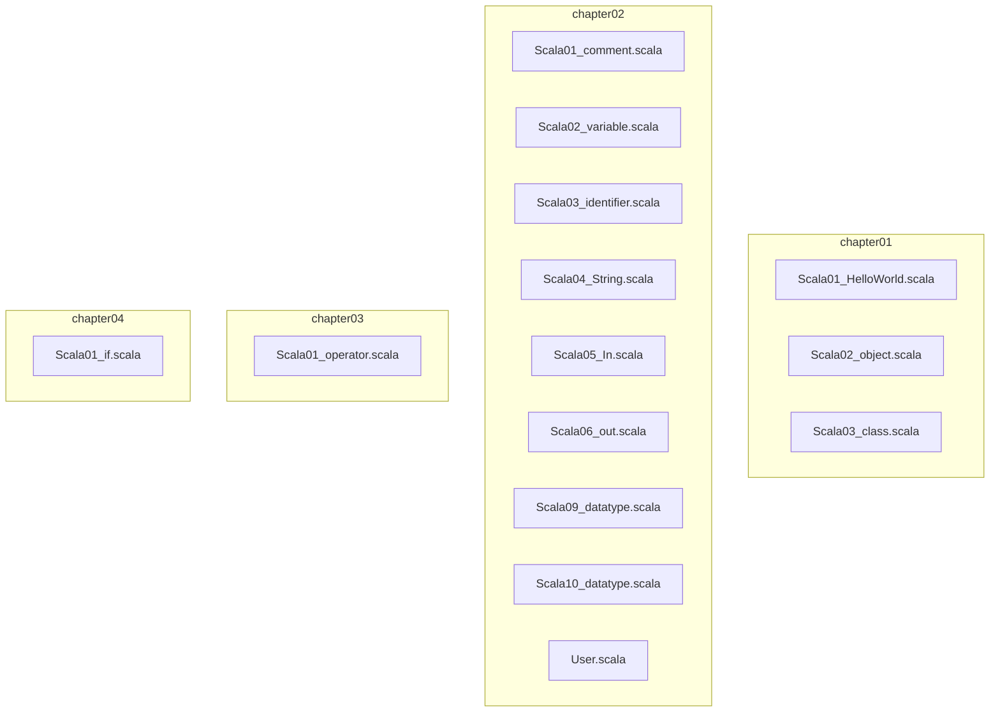
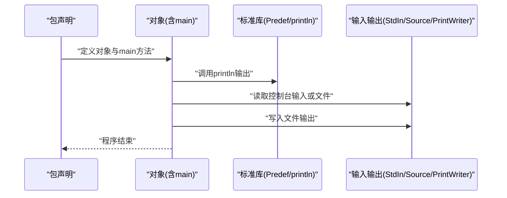
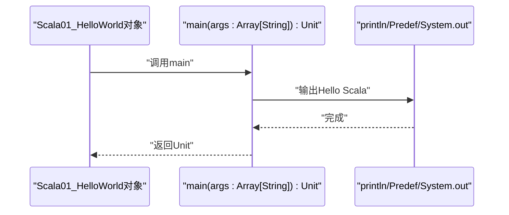
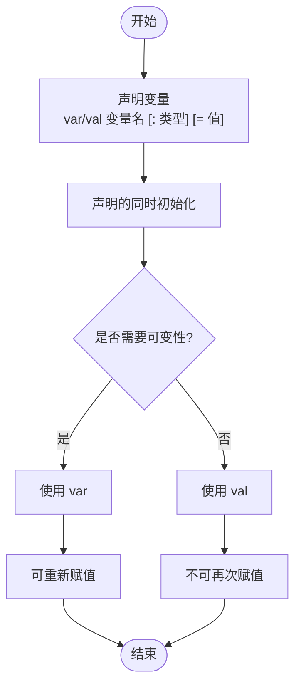
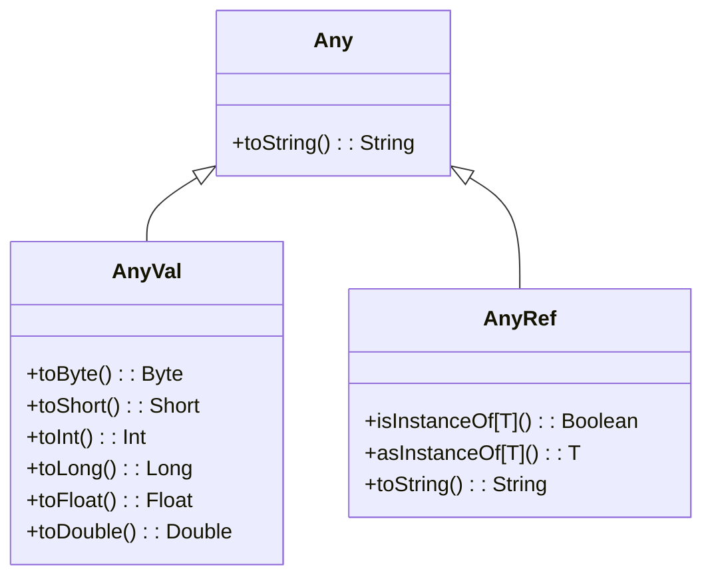
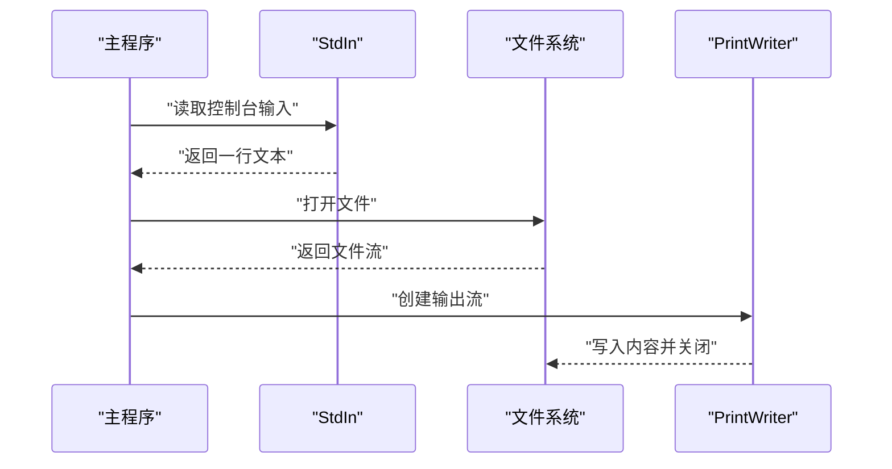
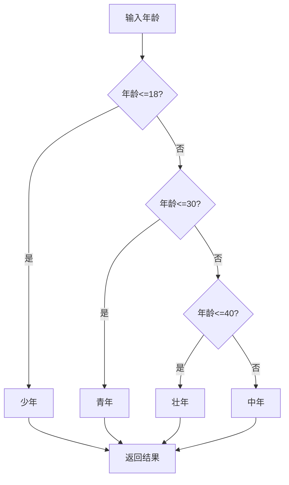
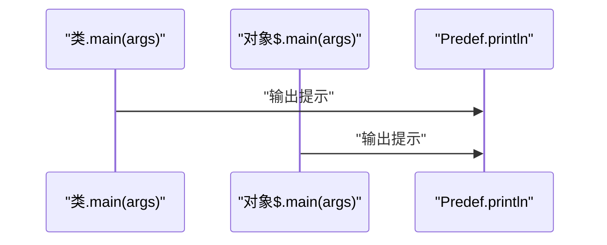
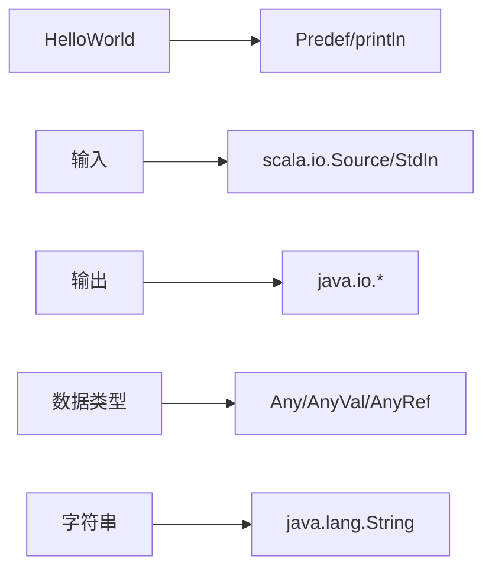

# Scala基础语法

<cite>
**本文引用的文件**
- [Scala01_HelloWorld.scala](file://_04_scalaTest/src/main/scala/com/atguigu/scala/chapter01/Scala01_HelloWorld.scala)
- [Scala02_object.scala](file://_04_scalaTest/src/main/scala/com/atguigu/scala/chapter01/Scala02_object.scala)
- [Scala03_class.scala](file://_04_scalaTest/src/main/scala/com/atguigu/scala/chapter01/Scala03_class.scala)
- [Scala01_comment.scala](file://_04_scalaTest/src/main/scala/com/atguigu/scala/chapter02/Scala01_comment.scala)
- [Scala02_variable.scala](file://_04_scalaTest/src/main/scala/com/atguigu/scala/chapter02/Scala02_variable.scala)
- [Scala03_identifier.scala](file://_04_scalaTest/src/main/scala/com/atguigu/scala/chapter02/Scala03_identifier.scala)
- [Scala04_String.scala](file://_04_scalaTest/src/main/scala/com/atguigu/scala/chapter02/Scala04_String.scala)
- [Scala05_In.scala](file://_04_scalaTest/src/main/scala/com/atguigu/scala/chapter02/Scala05_In.scala)
- [Scala06_out.scala](file://_04_scalaTest/src/main/scala/com/atguigu/scala/chapter02/Scala06_out.scala)
- [Scala09_datatype.scala](file://_04_scalaTest/src/main/scala/com/atguigu/scala/chapter02/Scala09_datatype.scala)
- [Scala10_datatype.scala](file://_04_scalaTest/src/main/scala/com/atguigu/scala/chapter02/Scala10_datatype.scala)
- [Scala01_operator.scala](file://_04_scalaTest/src/main/scala/com/atguigu/scala/chapter03/Scala01_operator.scala)
- [Scala01_if.scala](file://_04_scalaTest/src/main/scala/com/atguigu/scala/chapter04/Scala01_if.scala)
- [User.scala](file://_04_scalaTest/src/main/scala/com/atguigu/scala/chapter02/User.scala)
</cite>

## 目录
1. [引言](#引言)
2. [项目结构](#项目结构)
3. [核心组件](#核心组件)
4. [架构总览](#架构总览)
5. [详细组件分析](#详细组件分析)
6. [依赖分析](#依赖分析)
7. [性能考虑](#性能考虑)
8. [故障排查指南](#故障排查指南)
9. [结论](#结论)
10. [附录](#附录)

## 引言
本学习文档围绕Scala基础语法展开，结合仓库中的示例文件，系统讲解注释语法、标识符命名规则、变量声明（val与var）、数据类型与类型转换、字符串处理、输入输出、运算符本质、分支控制等核心知识点，并通过HelloWorld示例展示Scala程序的基本结构（包声明、对象定义、main方法）。同时，对比Scala与Java在语法上的差异与优势，帮助初学者快速建立对Scala语言的整体认知。

## 项目结构
仓库中与Scala基础语法相关的示例主要位于以下路径：
- chapter01：程序入口与对象/类的基本结构
- chapter02：注释、变量、标识符、字符串、输入输出、数据类型与类型转换、运算符本质（部分）
- chapter03：运算符本质
- chapter04：分支控制

下面给出与本学习文档相关的文件组织关系图：

**图表来源**
- [Scala01_HelloWorld.scala](file://_04_scalaTest/src/main/scala/com/atguigu/scala/chapter01/Scala01_HelloWorld.scala#L1-L57)
- [Scala02_object.scala](file://_04_scalaTest/src/main/scala/com/atguigu/scala/chapter01/Scala02_object.scala#L1-L87)
- [Scala03_class.scala](file://_04_scalaTest/src/main/scala/com/atguigu/scala/chapter01/Scala03_class.scala#L1-L29)
- [Scala01_comment.scala](file://_04_scalaTest/src/main/scala/com/atguigu/scala/chapter02/Scala01_comment.scala#L1-L24)
- [Scala02_variable.scala](file://_04_scalaTest/src/main/scala/com/atguigu/scala/chapter02/Scala02_variable.scala#L1-L49)
- [Scala03_identifier.scala](file://_04_scalaTest/src/main/scala/com/atguigu/scala/chapter02/Scala03_identifier.scala#L1-L57)
- [Scala04_String.scala](file://_04_scalaTest/src/main/scala/com/atguigu/scala/chapter02/Scala04_String.scala#L1-L58)
- [Scala05_In.scala](file://_04_scalaTest/src/main/scala/com/atguigu/scala/chapter02/Scala05_In.scala#L1-L77)
- [Scala06_out.scala](file://_04_scalaTest/src/main/scala/com/atguigu/scala/chapter02/Scala06_out.scala#L1-L31)
- [Scala09_datatype.scala](file://_04_scalaTest/src/main/scala/com/atguigu/scala/chapter02/Scala09_datatype.scala#L1-L68)
- [Scala10_datatype.scala](file://_04_scalaTest/src/main/scala/com/atguigu/scala/chapter02/Scala10_datatype.scala#L1-L20)
- [Scala01_operator.scala](file://_04_scalaTest/src/main/scala/com/atguigu/scala/chapter03/Scala01_operator.scala#L1-L25)
- [Scala01_if.scala](file://_04_scalaTest/src/main/scala/com/atguigu/scala/chapter04/Scala01_if.scala#L1-L104)
- [User.scala](file://_04_scalaTest/src/main/scala/com/atguigu/scala/chapter02/User.scala#L1-L15)

**章节来源**
- [Scala01_HelloWorld.scala](file://_04_scalaTest/src/main/scala/com/atguigu/scala/chapter01/Scala01_HelloWorld.scala#L1-L57)
- [Scala02_object.scala](file://_04_scalaTest/src/main/scala/com/atguigu/scala/chapter01/Scala02_object.scala#L1-L87)
- [Scala03_class.scala](file://_04_scalaTest/src/main/scala/com/atguigu/scala/chapter01/Scala03_class.scala#L1-L29)
- [Scala01_comment.scala](file://_04_scalaTest/src/main/scala/com/atguigu/scala/chapter02/Scala01_comment.scala#L1-L24)
- [Scala02_variable.scala](file://_04_scalaTest/src/main/scala/com/atguigu/scala/chapter02/Scala02_variable.scala#L1-L49)
- [Scala03_identifier.scala](file://_04_scalaTest/src/main/scala/com/atguigu/scala/chapter02/Scala03_identifier.scala#L1-L57)
- [Scala04_String.scala](file://_04_scalaTest/src/main/scala/com/atguigu/scala/chapter02/Scala04_String.scala#L1-L58)
- [Scala05_In.scala](file://_04_scalaTest/src/main/scala/com/atguigu/scala/chapter02/Scala05_In.scala#L1-L77)
- [Scala06_out.scala](file://_04_scalaTest/src/main/scala/com/atguigu/scala/chapter02/Scala06_out.scala#L1-L31)
- [Scala09_datatype.scala](file://_04_scalaTest/src/main/scala/com/atguigu/scala/chapter02/Scala09_datatype.scala#L1-L68)
- [Scala10_datatype.scala](file://_04_scalaTest/src/main/scala/com/atguigu/scala/chapter02/Scala10_datatype.scala#L1-L20)
- [Scala01_operator.scala](file://_04_scalaTest/src/main/scala/com/atguigu/scala/chapter03/Scala01_operator.scala#L1-L25)
- [Scala01_if.scala](file://_04_scalaTest/src/main/scala/com/atguigu/scala/chapter04/Scala01_if.scala#L1-L104)
- [User.scala](file://_04_scalaTest/src/main/scala/com/atguigu/scala/chapter02/User.scala#L1-L15)

## 核心组件
- 程序入口与结构
  - 包声明、对象定义、main方法、println输出、Unit返回类型、数组参数类型、分号省略规则等。
- 注释语法
  - 单行注释、多行注释、文档注释与Java一致。
- 变量声明
  - var与val的可变/不可变语义、类型推断、初始化方式。
- 标识符命名
  - 规则与符号使用示例，强调Scala更灵活的符号命名能力。
- 数据类型与类型转换
  - AnyVal/AnyRef层次、自动与强制类型转换、字符串转换、常量运算优化。
- 字符串处理
  - Java String别名、+拼接、printf格式化、插值字符串、多行字符串与stripMargin。
- 输入输出
  - 控制台输入StdIn、文件读取Source与迭代器、文件写出PrintWriter。
- 运算符本质
  - 运算符即方法调用，体现Scala“万物皆方法”的思想。
- 分支控制
  - if/else分支、if表达式返回值、封装为方法、三元简化写法。

**章节来源**
- [Scala01_HelloWorld.scala](file://_04_scalaTest/src/main/scala/com/atguigu/scala/chapter01/Scala01_HelloWorld.scala#L1-L57)
- [Scala01_comment.scala](file://_04_scalaTest/src/main/scala/com/atguigu/scala/chapter02/Scala01_comment.scala#L1-L24)
- [Scala02_variable.scala](file://_04_scalaTest/src/main/scala/com/atguigu/scala/chapter02/Scala02_variable.scala#L1-L49)
- [Scala03_identifier.scala](file://_04_scalaTest/src/main/scala/com/atguigu/scala/chapter02/Scala03_identifier.scala#L1-L57)
- [Scala09_datatype.scala](file://_04_scalaTest/src/main/scala/com/atguigu/scala/chapter02/Scala09_datatype.scala#L1-L68)
- [Scala10_datatype.scala](file://_04_scalaTest/src/main/scala/com/atguigu/scala/chapter02/Scala10_datatype.scala#L1-L20)
- [Scala04_String.scala](file://_04_scalaTest/src/main/scala/com/atguigu/scala/chapter02/Scala04_String.scala#L1-L58)
- [Scala05_In.scala](file://_04_scalaTest/src/main/scala/com/atguigu/scala/chapter02/Scala05_In.scala#L1-L77)
- [Scala06_out.scala](file://_04_scalaTest/src/main/scala/com/atguigu/scala/chapter02/Scala06_out.scala#L1-L31)
- [Scala01_operator.scala](file://_04_scalaTest/src/main/scala/com/atguigu/scala/chapter03/Scala01_operator.scala#L1-L25)
- [Scala01_if.scala](file://_04_scalaTest/src/main/scala/com/atguigu/scala/chapter04/Scala01_if.scala#L1-L104)

## 架构总览
下图展示了Scala程序的基本结构与运行流程，从包声明到对象定义再到main方法执行，以及与标准库的交互。

**图表来源**
- [Scala01_HelloWorld.scala](file://_04_scalaTest/src/main/scala/com/atguigu/scala/chapter01/Scala01_HelloWorld.scala#L1-L57)
- [Scala05_In.scala](file://_04_scalaTest/src/main/scala/com/atguigu/scala/chapter02/Scala05_In.scala#L1-L77)
- [Scala06_out.scala](file://_04_scalaTest/src/main/scala/com/atguigu/scala/chapter02/Scala06_out.scala#L1-L31)

## 详细组件分析

### 组件A：HelloWorld与程序结构
- 包声明与对象定义
  - 使用包声明组织代码；对象作为程序入口，包含main方法。
- main方法签名与返回类型
  - 形参为Array[String]，返回类型为Unit（等价于void）。
- 输出与分号省略
  - 提供System.out.println、Predef.println与println三种输出方式；说明分号在无歧义时可省略。
- 与Java的差异
  - 参数类型与参数名位置不同；返回类型位置不同；println来自Predef默认导入。

**图表来源**
- [Scala01_HelloWorld.scala](file://_04_scalaTest/src/main/scala/com/atguigu/scala/chapter01/Scala01_HelloWorld.scala#L1-L57)

**章节来源**
- [Scala01_HelloWorld.scala](file://_04_scalaTest/src/main/scala/com/atguigu/scala/chapter01/Scala01_HelloWorld.scala#L1-L57)

### 组件B：注释语法
- 单行注释、多行注释、文档注释
  - 与Java一致，便于维护与生成文档。

**章节来源**
- [Scala01_comment.scala](file://_04_scalaTest/src/main/scala/com/atguigu/scala/chapter02/Scala01_comment.scala#L1-L24)

### 组件C：变量声明（val与var）
- 声明语法与类型推断
  - 支持var/val + 变量名 + 可选类型 + 初始化；若能推断类型可省略类型。
- 初始化方式
  - 声明的同时初始化；强调Scala中变量初始化方式与Java的差异。
- 可变与不可变
  - var可重新赋值；val不可变，赋值后不可再次修改。

**图表来源**
- [Scala02_variable.scala](file://_04_scalaTest/src/main/scala/com/atguigu/scala/chapter02/Scala02_variable.scala#L1-L49)

**章节来源**
- [Scala02_variable.scala](file://_04_scalaTest/src/main/scala/com/atguigu/scala/chapter02/Scala02_variable.scala#L1-L49)

### 组件D：标识符命名规则
- 规则概述
  - 字母数字组合、数字不能开头、遵循驼峰命名法；Scala允许更多符号，但需避免非法字符。
- 符号命名示例
  - 展示多种符号变量与方法命名，强调可读性与安全性。

**章节来源**
- [Scala03_identifier.scala](file://_04_scalaTest/src/main/scala/com/atguigu/scala/chapter02/Scala03_identifier.scala#L1-L57)

### 组件E：数据类型与类型转换
- 类型层次
  - AnyVal（字节、短整型、整型、布尔等）与AnyRef（字符串、集合等）。
- 自动与强制类型转换
  - AnyVal之间自动装箱/拆箱；AnyRef之间使用isInstanceOf/asInstanceOf；字符串转换统一使用toString。
- 常量运算优化
  - 编译期常量运算可提前计算。

**图表来源**
- [Scala09_datatype.scala](file://_04_scalaTest/src/main/scala/com/atguigu/scala/chapter02/Scala09_datatype.scala#L1-L68)
- [Scala10_datatype.scala](file://_04_scalaTest/src/main/scala/com/atguigu/scala/chapter02/Scala10_datatype.scala#L1-L20)

**章节来源**
- [Scala09_datatype.scala](file://_04_scalaTest/src/main/scala/com/atguigu/scala/chapter02/Scala09_datatype.scala#L1-L68)
- [Scala10_datatype.scala](file://_04_scalaTest/src/main/scala/com/atguigu/scala/chapter02/Scala10_datatype.scala#L1-L20)

### 组件F：字符串处理
- Java String别名与拼接
  - String是java.lang.String的类型别名；支持+拼接。
- 格式化输出
  - printf用于格式化输出。
- 插值字符串
  - 使用s前缀与变量占位实现插值。
- 多行字符串
  - 使用三引号与stripMargin简化多行文本。

**章节来源**
- [Scala04_String.scala](file://_04_scalaTest/src/main/scala/com/atguigu/scala/chapter02/Scala04_String.scala#L1-L58)

### 组件G：输入与输出
- 控制台输入
  - 使用StdIn.readLine接收用户输入。
- 文件输入
  - 使用Java IO流与scala.io.Source两种方式读取文件；演示迭代器与foreach遍历。
- 文件输出
  - 使用PrintWriter将内容写入文件。

**图表来源**
- [Scala05_In.scala](file://_04_scalaTest/src/main/scala/com/atguigu/scala/chapter02/Scala05_In.scala#L1-L77)
- [Scala06_out.scala](file://_04_scalaTest/src/main/scala/com/atguigu/scala/chapter02/Scala06_out.scala#L1-L31)

**章节来源**
- [Scala05_In.scala](file://_04_scalaTest/src/main/scala/com/atguigu/scala/chapter02/Scala05_In.scala#L1-L77)
- [Scala06_out.scala](file://_04_scalaTest/src/main/scala/com/atguigu/scala/chapter02/Scala06_out.scala#L1-L31)

### 组件H：运算符本质
- 运算符即方法
  - “+”等运算符本质上是方法调用，体现Scala“一切皆对象/方法”的特性。

**章节来源**
- [Scala01_operator.scala](file://_04_scalaTest/src/main/scala/com/atguigu/scala/chapter03/Scala01_operator.scala#L1-L25)

### 组件I：分支控制与if表达式
- if/else分支
  - 单分支、双分支、多分支结构。
- if表达式返回值
  - if作为表达式有返回值，其值为满足条件分支中最后一行语句的执行结果。
- 三元简化
  - 条件表达式可简化为“条件 ? 表达式1 : 表达式2”。

**图表来源**
- [Scala01_if.scala](file://_04_scalaTest/src/main/scala/com/atguigu/scala/chapter04/Scala01_if.scala#L1-L104)

**章节来源**
- [Scala01_if.scala](file://_04_scalaTest/src/main/scala/com/atguigu/scala/chapter04/Scala01_if.scala#L1-L104)

### 组件J：对象与类的入口差异
- object修饰的“单例”
  - 编译后产生类与伴生对象，main方法位于伴生对象中，类中提供静态入口调用。
- class修饰的普通类
  - 编译后仅有一个类文件，main方法为实例方法。

**图表来源**
- [Scala03_class.scala](file://_04_scalaTest/src/main/scala/com/atguigu/scala/chapter01/Scala03_class.scala#L1-L29)
- [Scala02_object.scala](file://_04_scalaTest/src/main/scala/com/atguigu/scala/chapter01/Scala02_object.scala#L1-L87)

**章节来源**
- [Scala02_object.scala](file://_04_scalaTest/src/main/scala/com/atguigu/scala/chapter01/Scala02_object.scala#L1-L87)
- [Scala03_class.scala](file://_04_scalaTest/src/main/scala/com/atguigu/scala/chapter01/Scala03_class.scala#L1-L29)

### 组件K：自定义类型与toString重写
- 用户类型
  - 示例User类具备字段、方法与toString重写，便于打印与调试。

**章节来源**
- [User.scala](file://_04_scalaTest/src/main/scala/com/atguigu/scala/chapter02/User.scala#L1-L15)

## 依赖分析
- 内部依赖
  - 各示例文件彼此独立，无跨文件依赖。
- 外部依赖
  - 输入输出依赖scala.io与java.io；字符串处理依赖java.lang.String别名；类型转换依赖Any/AnyVal/AnyRef层次。

**图表来源**
- [Scala01_HelloWorld.scala](file://_04_scalaTest/src/main/scala/com/atguigu/scala/chapter01/Scala01_HelloWorld.scala#L1-L57)
- [Scala05_In.scala](file://_04_scalaTest/src/main/scala/com/atguigu/scala/chapter02/Scala05_In.scala#L1-L77)
- [Scala06_out.scala](file://_04_scalaTest/src/main/scala/com/atguigu/scala/chapter02/Scala06_out.scala#L1-L31)
- [Scala09_datatype.scala](file://_04_scalaTest/src/main/scala/com/atguigu/scala/chapter02/Scala09_datatype.scala#L1-L68)
- [Scala04_String.scala](file://_04_scalaTest/src/main/scala/com/atguigu/scala/chapter02/Scala04_String.scala#L1-L58)

**章节来源**
- [Scala05_In.scala](file://_04_scalaTest/src/main/scala/com/atguigu/scala/chapter02/Scala05_In.scala#L1-L77)
- [Scala06_out.scala](file://_04_scalaTest/src/main/scala/com/atguigu/scala/chapter02/Scala06_out.scala#L1-L31)
- [Scala09_datatype.scala](file://_04_scalaTest/src/main/scala/com/atguigu/scala/chapter02/Scala09_datatype.scala#L1-L68)
- [Scala04_String.scala](file://_04_scalaTest/src/main/scala/com/atguigu/scala/chapter02/Scala04_String.scala#L1-L58)

## 性能考虑
- 类型转换
  - AnyVal之间的自动装箱/拆箱与AnyRef的isInstanceOf/asInstanceOf应谨慎使用，避免频繁装箱导致的性能开销。
- 字符串拼接
  - 大量拼接建议使用StringBuilder或插值字符串，减少中间对象创建。
- I/O操作
  - 使用缓冲流与迭代器遍历文件，避免一次性加载大文件；及时关闭资源。

[本节为通用指导，无需特定文件引用]

## 故障排查指南
- 变量重复赋值报错
  - val声明的变量不可再次赋值；如需可变性，请使用var。
- 类型不匹配
  - AnyRef强制转换需先使用isInstanceOf检查；否则可能抛出异常。
- 字符串转换
  - 任意类型均可通过toString转换为字符串；注意空值与格式化输出。
- 文件读写
  - 确保文件路径正确与编码一致；读取完成后关闭流；写出时确认目标目录存在。
- 分支逻辑
  - if表达式需保证所有分支都有返回值；多分支时注意条件覆盖与顺序。

**章节来源**
- [Scala02_variable.scala](file://_04_scalaTest/src/main/scala/com/atguigu/scala/chapter02/Scala02_variable.scala#L1-L49)
- [Scala09_datatype.scala](file://_04_scalaTest/src/main/scala/com/atguigu/scala/chapter02/Scala09_datatype.scala#L1-L68)
- [Scala05_In.scala](file://_04_scalaTest/src/main/scala/com/atguigu/scala/chapter02/Scala05_In.scala#L1-L77)
- [Scala06_out.scala](file://_04_scalaTest/src/main/scala/com/atguigu/scala/chapter02/Scala06_out.scala#L1-L31)
- [Scala01_if.scala](file://_04_scalaTest/src/main/scala/com/atguigu/scala/chapter04/Scala01_if.scala#L1-L104)

## 结论
通过仓库中的示例文件，我们系统地梳理了Scala的基础语法要点：包与对象结构、注释与标识符、变量与类型、字符串与I/O、运算符本质与分支控制。这些示例清晰展示了Scala与Java在语法风格与设计理念上的差异，有助于初学者建立正确的语言认知与编程习惯。

[本节为总结性内容，无需特定文件引用]

## 附录
- 学习建议
  - 从HelloWorld入手，逐步掌握对象定义与main方法；
  - 对比val/var、AnyVal/AnyRef、+与s""等差异；
  - 实践输入输出与类型转换，加深对Scala类型系统的理解；
  - 通过分支控制与if表达式，体会Scala表达式的“有值”特性。

[本节为通用建议，无需特定文件引用]