# Scala语言基础

<cite>
**本文引用的文件**
- [Scala01_HelloWorld.scala](file://_04_scalaTest/src/main/scala/com/atguigu/scala/chapter01/Scala01_HelloWorld.scala)
- [Scala02_variable.scala](file://_04_scalaTest/src/main/scala/com/atguigu/scala/chapter02/Scala02_variable.scala)
- [Scala01_operator.scala](file://_04_scalaTest/src/main/scala/com/atguigu/scala/chapter03/Scala01_operator.scala)
- [Scala01_if.scala](file://_04_scalaTest/src/main/scala/com/atguigu/scala/chapter04/Scala01_if.scala)
- [Scala01_function.scala](file://_04_scalaTest/src/main/scala/com/atguigu/scala/chapter05/Scala01_function.scala)
- [Scala01_package.scala](file://_04_scalaTest/src/main/scala/com/atguigu/scala/chapter06/Scala01_package.scala)
- [Scala02_import.scala](file://_04_scalaTest/src/main/scala/com/atguigu/scala/chapter06/Scala02_import.scala)
- [Scala03_class.scala](file://_04_scalaTest/src/main/scala/com/atguigu/scala/chapter06/Scala03_class.scala)
- [Scala08_object.scala](file://_04_scalaTest/src/main/scala/com/atguigu/scala/chapter06/Scala08_object.scala)
- [Scala01_array.scala](file://_04_scalaTest/src/main/scala/com/atguigu/scala/chapter07/Scala01_array.scala)
- [Scala03_list.scala](file://_04_scalaTest/src/main/scala/com/atguigu/scala/chapter07/Scala03_list.scala)
- [Scala01_match.scala](file://_04_scalaTest/src/main/scala/com/atguigu/scala/chapter08/Scala01_match.scala)
- [Scala01_exception.scala](file://_04_scalaTest/src/main/scala/com/atguigu/scala/chapter09/Scala01_exception.scala)
- [Scala01_transform.scala](file://_04_scalaTest/src/main/scala/com/atguigu/scala/chapter10/Scala01_transform.scala)
</cite>

## 目录
1. [引言](#引言)
2. [项目结构](#项目结构)
3. [核心组件](#核心组件)
4. [架构总览](#架构总览)
5. [详细组件分析](#详细组件分析)
6. [依赖分析](#依赖分析)
7. [性能考虑](#性能考虑)
8. [故障排查指南](#故障排查指南)
9. [结论](#结论)
10. [附录](#附录)

## 引言
本学习文档围绕Scala语言基础展开，系统梳理其语法与特性，并结合仓库中的示例文件，帮助读者建立从入门到进阶的知识框架。文档重点覆盖：
- 语法与类型系统：变量声明、数据类型、运算符、控制流
- 函数式编程：高阶函数、函数作为一等公民、闭包思想
- 面向对象：类与对象、伴生类与伴生对象、可见性与继承
- 包与导入：包的作用域、嵌套包、import机制与别名
- 集合与模式匹配：数组、列表、模式匹配的使用场景
- 异常处理与隐式转换：Scala异常模型与隐式转换
- 与Java互操作：包路径、默认导入、静态成员映射
- Spark开发实践：基于本仓库的集合与函数式能力迁移

## 项目结构
本仓库中与Scala基础教学密切相关的代码位于 _04_scalaTest/src/main/scala/com/atguigu/scala 目录下，按章节组织，便于循序渐进学习。每个章节对应一个或多个示例对象，演示相应主题。

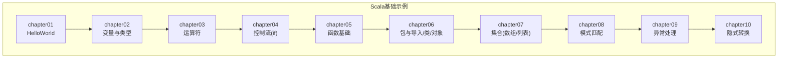

图表来源
- [Scala01_HelloWorld.scala](file://_04_scalaTest/src/main/scala/com/atguigu/scala/chapter01/Scala01_HelloWorld.scala#L1-L57)
- [Scala02_variable.scala](file://_04_scalaTest/src/main/scala/com/atguigu/scala/chapter02/Scala02_variable.scala#L1-L49)
- [Scala01_operator.scala](file://_04_scalaTest/src/main/scala/com/atguigu/scala/chapter03/Scala01_operator.scala#L1-L25)
- [Scala01_if.scala](file://_04_scalaTest/src/main/scala/com/atguigu/scala/chapter04/Scala01_if.scala#L1-L104)
- [Scala01_function.scala](file://_04_scalaTest/src/main/scala/com/atguigu/scala/chapter05/Scala01_function.scala#L1-L55)
- [Scala01_package.scala](file://_04_scalaTest/src/main/scala/com/atguigu/scala/chapter06/Scala01_package.scala#L1-L65)
- [Scala02_import.scala](file://_04_scalaTest/src/main/scala/com/atguigu/scala/chapter06/Scala02_import.scala#L1-L128)
- [Scala03_class.scala](file://_04_scalaTest/src/main/scala/com/atguigu/scala/chapter06/Scala03_class.scala#L1-L60)
- [Scala08_object.scala](file://_04_scalaTest/src/main/scala/com/atguigu/scala/chapter06/Scala08_object.scala#L1-L55)
- [Scala01_array.scala](file://_04_scalaTest/src/main/scala/com/atguigu/scala/chapter07/Scala01_array.scala#L1-L77)
- [Scala03_list.scala](file://_04_scalaTest/src/main/scala/com/atguigu/scala/chapter07/Scala03_list.scala#L1-L61)
- [Scala01_match.scala](file://_04_scalaTest/src/main/scala/com/atguigu/scala/chapter08/Scala01_match.scala#L1-L36)
- [Scala01_exception.scala](file://_04_scalaTest/src/main/scala/com/atguigu/scala/chapter09/Scala01_exception.scala#L1-L46)
- [Scala01_transform.scala](file://_04_scalaTest/src/main/scala/com/atguigu/scala/chapter10/Scala01_transform.scala#L1-L37)

章节来源
- [Scala01_HelloWorld.scala](file://_04_scalaTest/src/main/scala/com/atguigu/scala/chapter01/Scala01_HelloWorld.scala#L1-L57)
- [Scala02_variable.scala](file://_04_scalaTest/src/main/scala/com/atguigu/scala/chapter02/Scala02_variable.scala#L1-L49)
- [Scala01_operator.scala](file://_04_scalaTest/src/main/scala/com/atguigu/scala/chapter03/Scala01_operator.scala#L1-L25)
- [Scala01_if.scala](file://_04_scalaTest/src/main/scala/com/atguigu/scala/chapter04/Scala01_if.scala#L1-L104)
- [Scala01_function.scala](file://_04_scalaTest/src/main/scala/com/atguigu/scala/chapter05/Scala01_function.scala#L1-L55)
- [Scala01_package.scala](file://_04_scalaTest/src/main/scala/com/atguigu/scala/chapter06/Scala01_package.scala#L1-L65)
- [Scala02_import.scala](file://_04_scalaTest/src/main/scala/com/atguigu/scala/chapter06/Scala02_import.scala#L1-L128)
- [Scala03_class.scala](file://_04_scalaTest/src/main/scala/com/atguigu/scala/chapter06/Scala03_class.scala#L1-L60)
- [Scala08_object.scala](file://_04_scalaTest/src/main/scala/com/atguigu/scala/chapter06/Scala08_object.scala#L1-L55)
- [Scala01_array.scala](file://_04_scalaTest/src/main/scala/com/atguigu/scala/chapter07/Scala01_array.scala#L1-L77)
- [Scala03_list.scala](file://_04_scalaTest/src/main/scala/com/atguigu/scala/chapter07/Scala03_list.scala#L1-L61)
- [Scala01_match.scala](file://_04_scalaTest/src/main/scala/com/atguigu/scala/chapter08/Scala01_match.scala#L1-L36)
- [Scala01_exception.scala](file://_04_scalaTest/src/main/scala/com/atguigu/scala/chapter09/Scala01_exception.scala#L1-L46)
- [Scala01_transform.scala](file://_04_scalaTest/src/main/scala/com/atguigu/scala/chapter10/Scala01_transform.scala#L1-L37)

## 核心组件
- Hello, Scala：演示对象、main入口、println与Predef的关系、Unit返回类型、参数签名差异
- 变量与类型：var/val、类型推断、初始化方式、可变与不可变
- 运算符本质：中缀语法与方法调用等价
- 控制流：if/else分支、表达式返回值、三元简化
- 函数基础：函数与方法的区别、函数嵌套、函数作为一等公民
- 包与导入：包声明、嵌套包、import位置、导包/导类/导对象、别名与屏蔽
- 类与对象：class与object、伴生类与伴生对象、apply工厂方法
- 集合：数组Array与List、符号操作、多维数组、集合转换
- 模式匹配：match语法、守卫与通配、异常分支
- 异常处理：try/catch/finally、模式匹配异常、@throws注解
- 隐式转换：隐式函数、类型提升、编译期查找

章节来源
- [Scala01_HelloWorld.scala](file://_04_scalaTest/src/main/scala/com/atguigu/scala/chapter01/Scala01_HelloWorld.scala#L1-L57)
- [Scala02_variable.scala](file://_04_scalaTest/src/main/scala/com/atguigu/scala/chapter02/Scala02_variable.scala#L1-L49)
- [Scala01_operator.scala](file://_04_scalaTest/src/main/scala/com/atguigu/scala/chapter03/Scala01_operator.scala#L1-L25)
- [Scala01_if.scala](file://_04_scalaTest/src/main/scala/com/atguigu/scala/chapter04/Scala01_if.scala#L1-L104)
- [Scala01_function.scala](file://_04_scalaTest/src/main/scala/com/atguigu/scala/chapter05/Scala01_function.scala#L1-L55)
- [Scala01_package.scala](file://_04_scalaTest/src/main/scala/com/atguigu/scala/chapter06/Scala01_package.scala#L1-L65)
- [Scala02_import.scala](file://_04_scalaTest/src/main/scala/com/atguigu/scala/chapter06/Scala02_import.scala#L1-L128)
- [Scala03_class.scala](file://_04_scalaTest/src/main/scala/com/atguigu/scala/chapter06/Scala03_class.scala#L1-L60)
- [Scala08_object.scala](file://_04_scalaTest/src/main/scala/com/atguigu/scala/chapter06/Scala08_object.scala#L1-L55)
- [Scala01_array.scala](file://_04_scalaTest/src/main/scala/com/atguigu/scala/chapter07/Scala01_array.scala#L1-L77)
- [Scala03_list.scala](file://_04_scalaTest/src/main/scala/com/atguigu/scala/chapter07/Scala03_list.scala#L1-L61)
- [Scala01_match.scala](file://_04_scalaTest/src/main/scala/com/atguigu/scala/chapter08/Scala01_match.scala#L1-L36)
- [Scala01_exception.scala](file://_04_scalaTest/src/main/scala/com/atguigu/scala/chapter09/Scala01_exception.scala#L1-L46)
- [Scala01_transform.scala](file://_04_scalaTest/src/main/scala/com/atguigu/scala/chapter10/Scala01_transform.scala#L1-L37)

## 架构总览
以下图示展示从“Hello World”到“集合与模式匹配”的学习路径，体现各章节之间的递进关系。

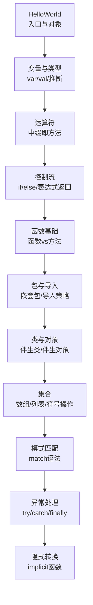

图表来源
- [Scala01_HelloWorld.scala](file://_04_scalaTest/src/main/scala/com/atguigu/scala/chapter01/Scala01_HelloWorld.scala#L1-L57)
- [Scala02_variable.scala](file://_04_scalaTest/src/main/scala/com/atguigu/scala/chapter02/Scala02_variable.scala#L1-L49)
- [Scala01_operator.scala](file://_04_scalaTest/src/main/scala/com/atguigu/scala/chapter03/Scala01_operator.scala#L1-L25)
- [Scala01_if.scala](file://_04_scalaTest/src/main/scala/com/atguigu/scala/chapter04/Scala01_if.scala#L1-L104)
- [Scala01_function.scala](file://_04_scalaTest/src/main/scala/com/atguigu/scala/chapter05/Scala01_function.scala#L1-L55)
- [Scala01_package.scala](file://_04_scalaTest/src/main/scala/com/atguigu/scala/chapter06/Scala01_package.scala#L1-L65)
- [Scala02_import.scala](file://_04_scalaTest/src/main/scala/com/atguigu/scala/chapter06/Scala02_import.scala#L1-L128)
- [Scala03_class.scala](file://_04_scalaTest/src/main/scala/com/atguigu/scala/chapter06/Scala03_class.scala#L1-L60)
- [Scala08_object.scala](file://_04_scalaTest/src/main/scala/com/atguigu/scala/chapter06/Scala08_object.scala#L1-L55)
- [Scala01_array.scala](file://_04_scalaTest/src/main/scala/com/atguigu/scala/chapter07/Scala01_array.scala#L1-L77)
- [Scala03_list.scala](file://_04_scalaTest/src/main/scala/com/atguigu/scala/chapter07/Scala03_list.scala#L1-L61)
- [Scala01_match.scala](file://_04_scalaTest/src/main/scala/com/atguigu/scala/chapter08/Scala01_match.scala#L1-L36)
- [Scala01_exception.scala](file://_04_scalaTest/src/main/scala/com/atguigu/scala/chapter09/Scala01_exception.scala#L1-L46)
- [Scala01_transform.scala](file://_04_scalaTest/src/main/scala/com/atguigu/scala/chapter10/Scala01_transform.scala#L1-L37)

## 详细组件分析

### Hello, Scala（对象与入口）
- 对象与main方法：演示Scala以对象为程序入口，方法签名与Java差异
- 默认导入：println与Predef的关系
- Unit返回类型：无返回值类型
- 参数签名：参数名在前、类型在后的风格

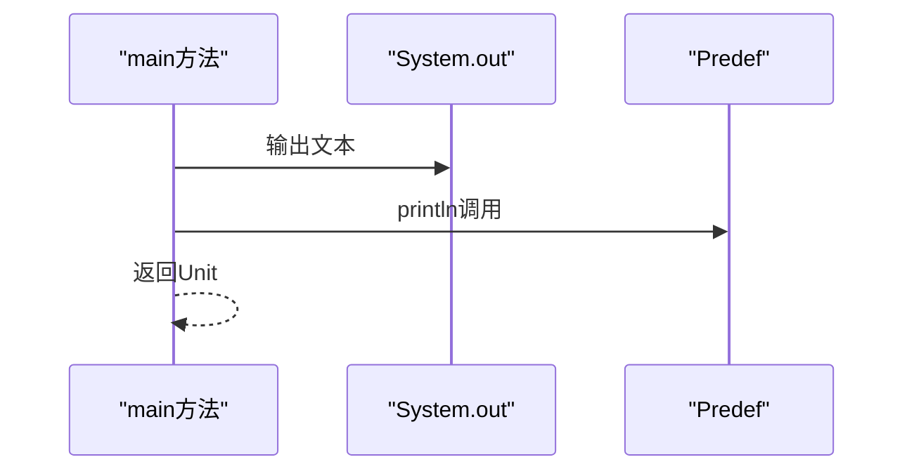

图表来源
- [Scala01_HelloWorld.scala](file://_04_scalaTest/src/main/scala/com/atguigu/scala/chapter01/Scala01_HelloWorld.scala#L1-L57)

章节来源
- [Scala01_HelloWorld.scala](file://_04_scalaTest/src/main/scala/com/atguigu/scala/chapter01/Scala01_HelloWorld.scala#L1-L57)

### 变量与类型（var/val、类型推断、初始化）
- var/val语义：可变与不可变变量
- 类型推断：编译器根据字面量推断类型
- 初始化：强调声明同时初始化
- 实践要点：优先使用不可变val；必要时使用var

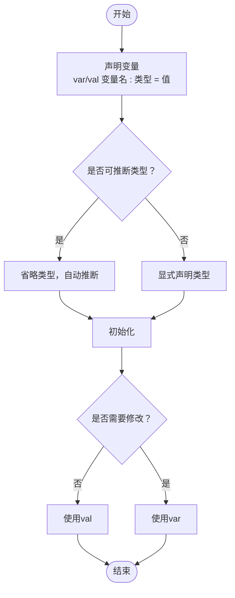

图表来源
- [Scala02_variable.scala](file://_04_scalaTest/src/main/scala/com/atguigu/scala/chapter02/Scala02_variable.scala#L1-L49)

章节来源
- [Scala02_variable.scala](file://_04_scalaTest/src/main/scala/com/atguigu/scala/chapter02/Scala02_variable.scala#L1-L49)

### 运算符（中缀语法即方法）
- 核心观点：Scala没有真正的运算符，中缀语法只是方法调用的语法糖
- 示例：加法等价于方法调用

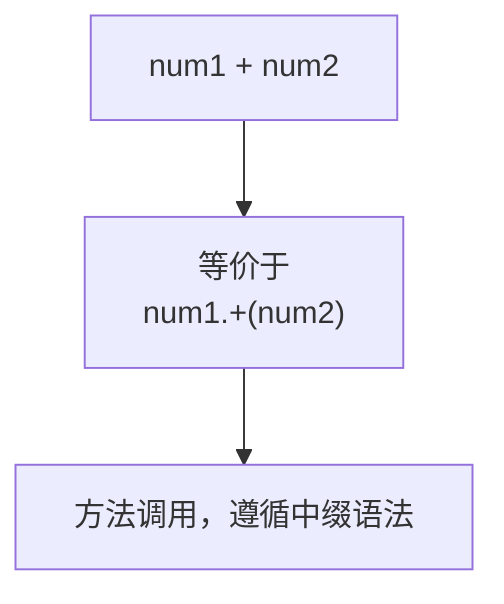

图表来源
- [Scala01_operator.scala](file://_04_scalaTest/src/main/scala/com/atguigu/scala/chapter03/Scala01_operator.scala#L1-L25)

章节来源
- [Scala01_operator.scala](file://_04_scalaTest/src/main/scala/com/atguigu/scala/chapter03/Scala01_operator.scala#L1-L25)

### 控制流（if/else与表达式返回）
- if/else分支：单分支、双分支、多分支
- 表达式返回值：if表达式返回满足条件分支的最后一行结果
- 三元简化：布尔表达式三元简写

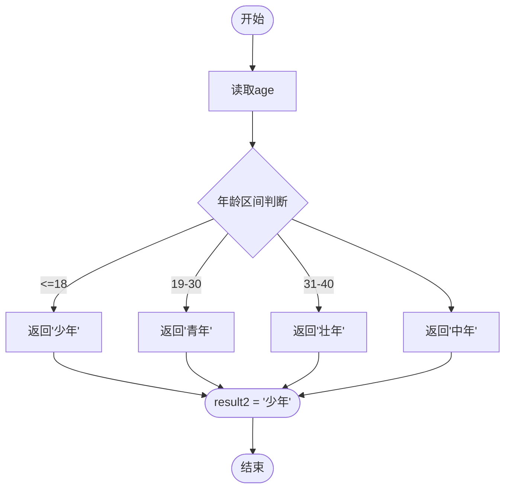

图表来源
- [Scala01_if.scala](file://_04_scalaTest/src/main/scala/com/atguigu/scala/chapter04/Scala01_if.scala#L1-L104)

章节来源
- [Scala01_if.scala](file://_04_scalaTest/src/main/scala/com/atguigu/scala/chapter04/Scala01_if.scala#L1-L104)

### 函数基础（函数式与面向对象）
- 函数与方法：函数式中的函数与方法的区别
- 函数嵌套：函数内部可再定义函数
- 函数作为一等公民：可作为值、参数、返回值使用

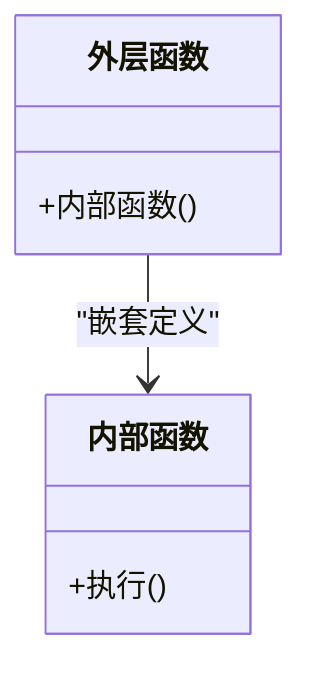

图表来源
- [Scala01_function.scala](file://_04_scalaTest/src/main/scala/com/atguigu/scala/chapter05/Scala01_function.scala#L1-L55)

章节来源
- [Scala01_function.scala](file://_04_scalaTest/src/main/scala/com/atguigu/scala/chapter05/Scala01_function.scala#L1-L55)

### 包与导入（包作用域与import策略）
- 包声明：可多次与嵌套声明，子包可访问父包内容
- 包对象：包可作为对象使用
- import机制：导包、导类、导对象；别名与屏蔽；默认导入Predef、java.lang、scala

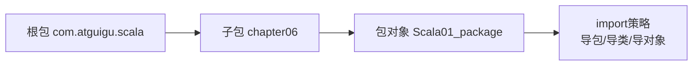

图表来源
- [Scala01_package.scala](file://_04_scalaTest/src/main/scala/com/atguigu/scala/chapter06/Scala01_package.scala#L1-L65)
- [Scala02_import.scala](file://_04_scalaTest/src/main/scala/com/atguigu/scala/chapter06/Scala02_import.scala#L1-L128)

章节来源
- [Scala01_package.scala](file://_04_scalaTest/src/main/scala/com/atguigu/scala/chapter06/Scala01_package.scala#L1-L65)
- [Scala02_import.scala](file://_04_scalaTest/src/main/scala/com/atguigu/scala/chapter06/Scala02_import.scala#L1-L128)

### 类与对象（伴生类与伴生对象）
- 类与对象：class为伴生类，object为伴生对象
- apply工厂方法：伴生对象中的apply用于创建伴生类实例
- 访问控制：构造器私有时通过伴生对象apply创建实例

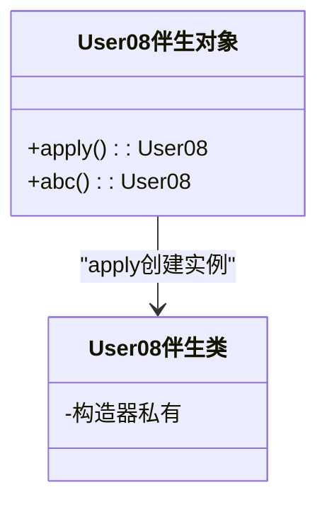

图表来源
- [Scala08_object.scala](file://_04_scalaTest/src/main/scala/com/atguigu/scala/chapter06/Scala08_object.scala#L1-L55)
- [Scala03_class.scala](file://_04_scalaTest/src/main/scala/com/atguigu/scala/chapter06/Scala03_class.scala#L1-L60)

章节来源
- [Scala08_object.scala](file://_04_scalaTest/src/main/scala/com/atguigu/scala/chapter06/Scala08_object.scala#L1-L55)
- [Scala03_class.scala](file://_04_scalaTest/src/main/scala/com/atguigu/scala/chapter06/Scala03_class.scala#L1-L60)

### 集合（数组与列表）
- 数组Array：创建、更新、符号操作（+:、:+）、多维数组、合并、范围与填充
- 列表List：不可变List与可变ListBuffer、Nil与::/:+++、可变与不可变转换

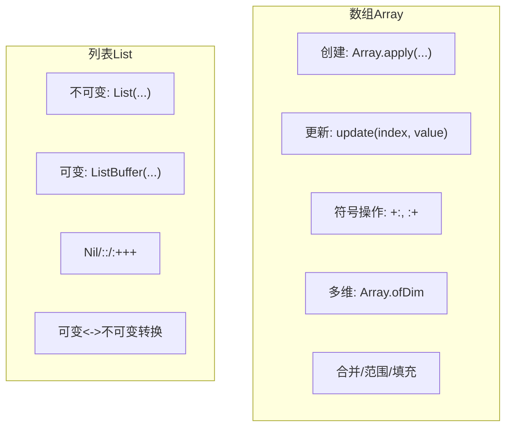

图表来源
- [Scala01_array.scala](file://_04_scalaTest/src/main/scala/com/atguigu/scala/chapter07/Scala01_array.scala#L1-L77)
- [Scala03_list.scala](file://_04_scalaTest/src/main/scala/com/atguigu/scala/chapter07/Scala03_list.scala#L1-L61)

章节来源
- [Scala01_array.scala](file://_04_scalaTest/src/main/scala/com/atguigu/scala/chapter07/Scala01_array.scala#L1-L77)
- [Scala03_list.scala](file://_04_scalaTest/src/main/scala/com/atguigu/scala/chapter07/Scala03_list.scala#L1-L61)

### 模式匹配（match语法）
- 语法：match { case ... => ... }
- 匹配顺序：自上而下，命中即止；可选通配分支
- 应用：四则运算示例

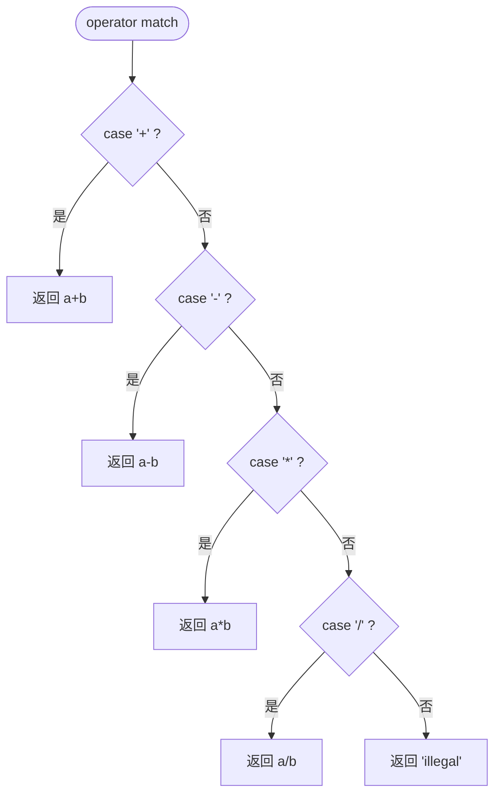

图表来源
- [Scala01_match.scala](file://_04_scalaTest/src/main/scala/com/atguigu/scala/chapter08/Scala01_match.scala#L1-L36)

章节来源
- [Scala01_match.scala](file://_04_scalaTest/src/main/scala/com/atguigu/scala/chapter08/Scala01_match.scala#L1-L36)

### 异常处理（try/catch/finally与@throws）
- try/catch/finally：标准异常处理结构
- 模式匹配异常：按异常类型分支处理
- 声明异常：@throws注解

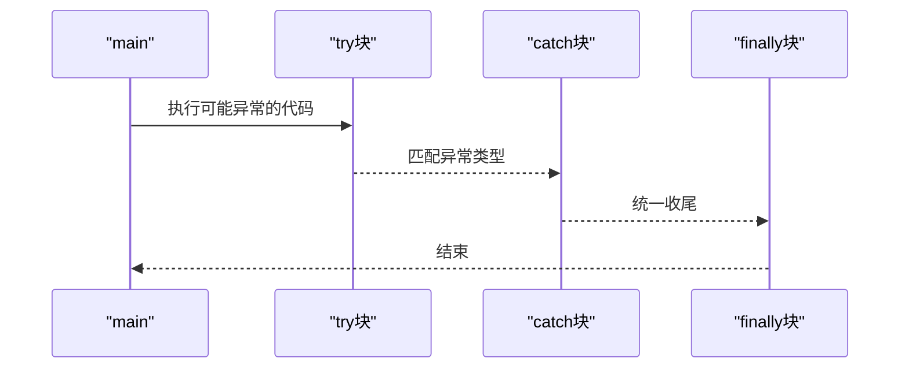

图表来源
- [Scala01_exception.scala](file://_04_scalaTest/src/main/scala/com/atguigu/scala/chapter09/Scala01_exception.scala#L1-L46)

章节来源
- [Scala01_exception.scala](file://_04_scalaTest/src/main/scala/com/atguigu/scala/chapter09/Scala01_exception.scala#L1-L46)

### 隐式转换（implicit函数）
- 类型提升：Byte到Int的自动装箱
- 自定义隐式转换：implicit def将Double隐式转为Int
- 编译期查找：找不到时触发隐式转换再次尝试

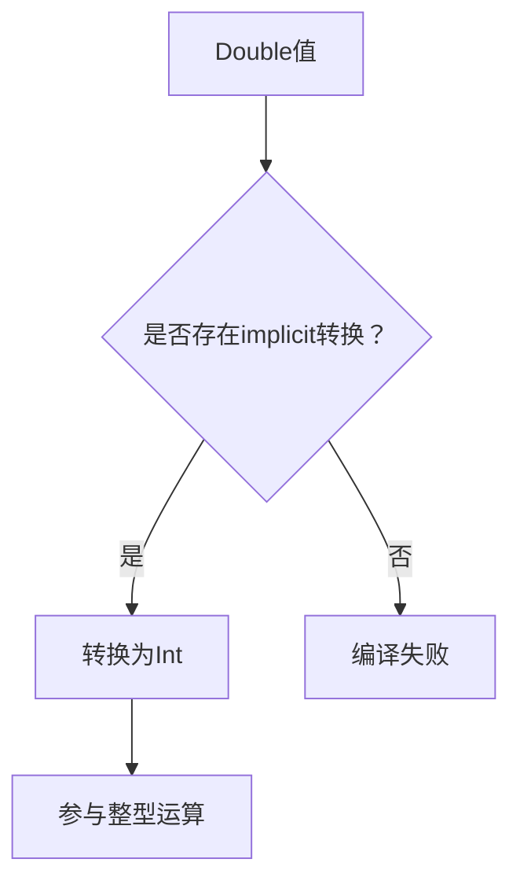

图表来源
- [Scala01_transform.scala](file://_04_scalaTest/src/main/scala/com/atguigu/scala/chapter10/Scala01_transform.scala#L1-L37)

章节来源
- [Scala01_transform.scala](file://_04_scalaTest/src/main/scala/com/atguigu/scala/chapter10/Scala01_transform.scala#L1-L37)

## 依赖分析
- 包依赖：章节间呈线性依赖，后文依赖前文的基础概念
- 默认导入：Predef、java.lang、scala默认可用，减少样板代码
- 导入策略：灵活的导包/导类/导对象，支持别名与屏蔽

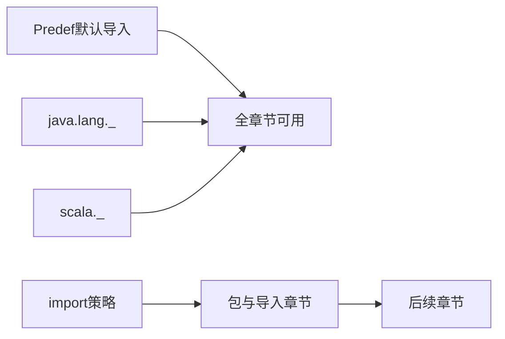

图表来源
- [Scala02_import.scala](file://_04_scalaTest/src/main/scala/com/atguigu/scala/chapter06/Scala02_import.scala#L1-L128)

章节来源
- [Scala02_import.scala](file://_04_scalaTest/src/main/scala/com/atguigu/scala/chapter06/Scala02_import.scala#L1-L128)

## 性能考虑
- 函数式与集合：优先使用不可变集合与惰性求值链路，避免不必要的中间集合拷贝
- 模式匹配：保持case顺序合理，避免重复计算；通配case置于末尾
- 隐式转换：谨慎使用，避免隐式转换链过长导致编译时间增加与可读性下降
- 对象创建：伴生对象apply可封装复杂构造逻辑，减少重复样板代码

## 故障排查指南
- 空指针与算术异常：在异常处理中使用模式匹配捕获具体异常类型
- @throws注解：明确声明可能抛出的异常，便于上游调用方处理
- 分号与语法：Scala允许省略分号，但需确保无歧义；若出现编译错误，检查作用域与类型推断

章节来源
- [Scala01_exception.scala](file://_04_scalaTest/src/main/scala/com/atguigu/scala/chapter09/Scala01_exception.scala#L1-L46)

## 结论
通过本仓库的示例文件，读者可以系统掌握Scala的基础语法与核心特性：从Hello World到变量、运算符、控制流，再到函数式与面向对象的融合、包与导入、集合与模式匹配、异常处理与隐式转换。这些内容为后续在Spark等大数据生态中的实践打下坚实基础。

## 附录
- 与Java互操作要点
  - 包路径：Scala包与物理路径无关，注意import路径
  - 默认导入：Predef、java.lang、scala默认可用
  - 静态成员：通过伴生对象或静态工具类桥接Java静态方法
- Spark开发建议
  - 使用不可变集合与函数式API（map/filter/reduce）组织数据处理流水线
  - 利用模式匹配进行数据清洗与分流
  - 通过伴生对象提供工厂方法与配置入口，提升可测试性与可维护性