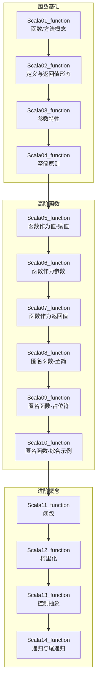
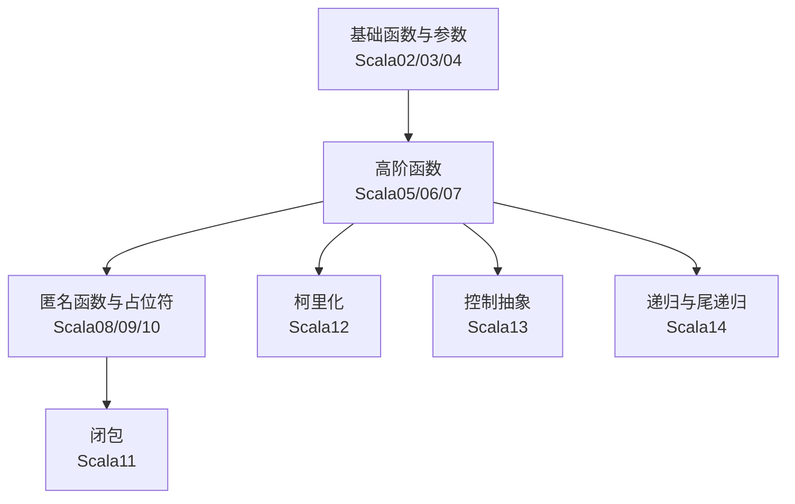
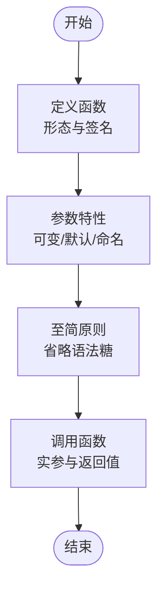
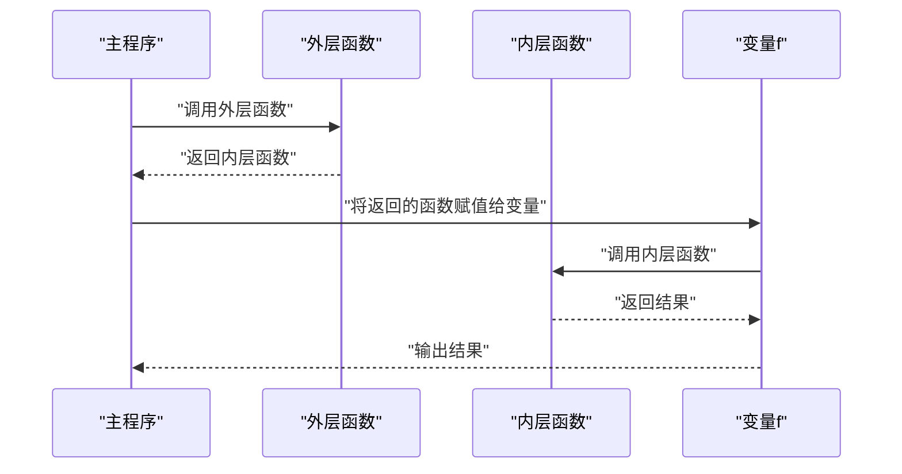
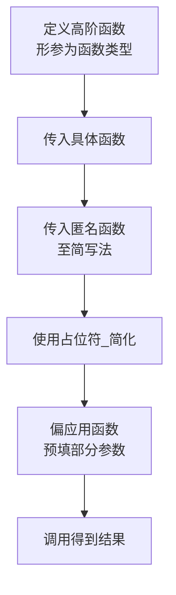
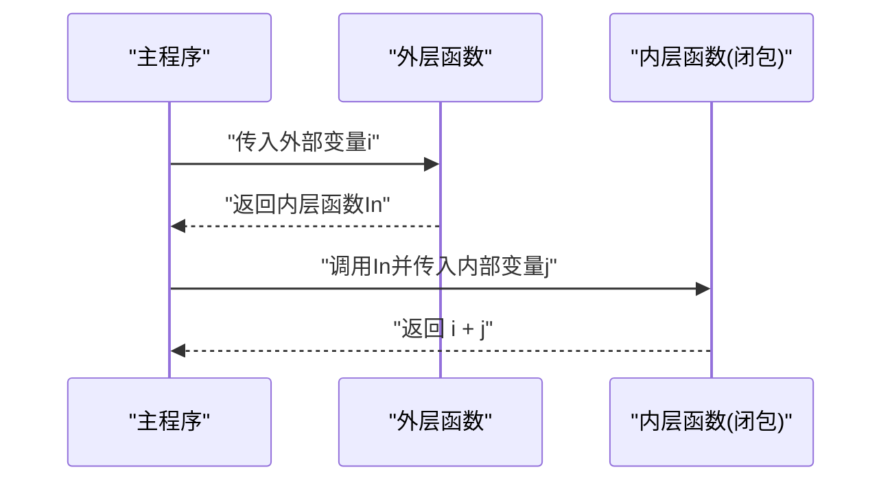
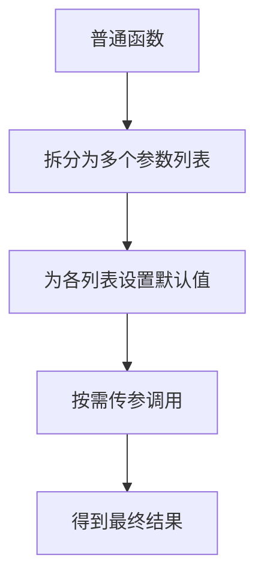
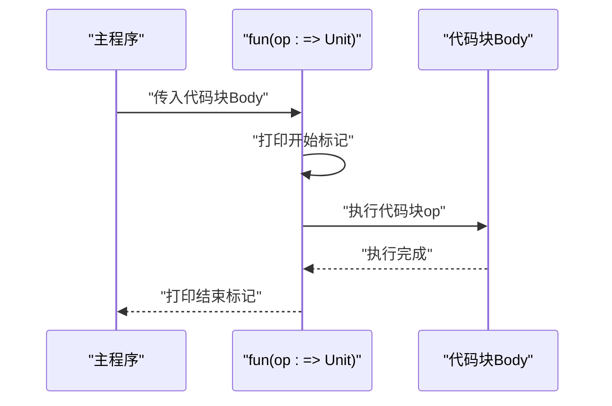
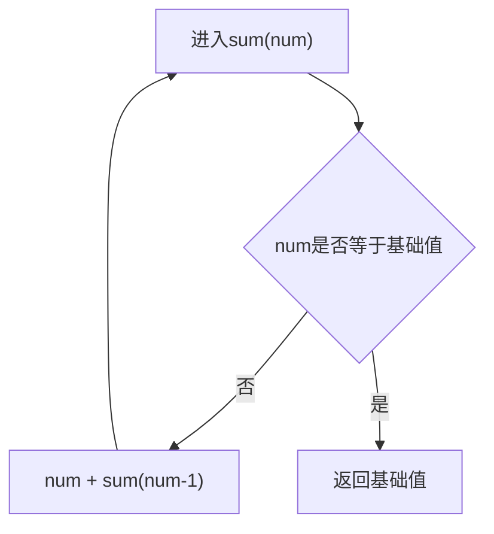
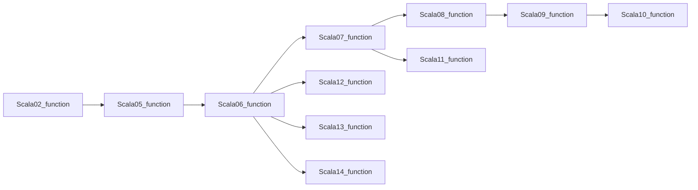

# 函数编程

<cite>
**本文引用的文件**
- [Scala01_function.scala](file://_04_scalaTest/src/main/scala/com/atguigu/scala/chapter05/Scala01_function.scala)
- [Scala02_function.scala](file://_04_scalaTest/src/main/scala/com/atguigu/scala/chapter05/Scala02_function.scala)
- [Scala03_function.scala](file://_04_scalaTest/src/main/scala/com/atguigu/scala/chapter05/Scala03_function.scala)
- [Scala04_function.scala](file://_04_scalaTest/src/main/scala/com/atguigu/scala/chapter05/Scala04_function.scala)
- [Scala05_function.scala](file://_04_scalaTest/src/main/scala/com/atguigu/scala/chapter05/Scala05_function.scala)
- [Scala06_function.scala](file://_04_scalaTest/src/main/scala/com/atguigu/scala/chapter05/Scala06_function.scala)
- [Scala07_function.scala](file://_04_scalaTest/src/main/scala/com/atguigu/scala/chapter05/Scala07_function.scala)
- [Scala08_function.scala](file://_04_scalaTest/src/main/scala/com/atguigu/scala/chapter05/Scala08_function.scala)
- [Scala09_function.scala](file://_04_scalaTest/src/main/scala/com/atguigu/scala/chapter05/Scala09_function.scala)
- [Scala10_function.scala](file://_04_scalaTest/src/main/scala/com/atguigu/scala/chapter05/Scala10_function.scala)
- [Scala11_function.scala](file://_04_scalaTest/src/main/scala/com/atguigu/scala/chapter05/Scala11_function.scala)
- [Scala12_function.scala](file://_04_scalaTest/src/main/scala/com/atguigu/scala/chapter05/Scala12_function.scala)
- [Scala13_function.scala](file://_04_scalaTest/src/main/scala/com/atguigu/scala/chapter05/Scala13_function.scala)
- [Scala14_function.scala](file://_04_scalaTest/src/main/scala/com/atguigu/scala/chapter05/Scala14_function.scala)
</cite>

## 目录
1. [引言](#引言)
2. [项目结构](#项目结构)
3. [核心组件](#核心组件)
4. [架构总览](#架构总览)
5. [详细组件分析](#详细组件分析)
6. [依赖分析](#依赖分析)
7. [性能考虑](#性能考虑)
8. [故障排查指南](#故障排查指南)
9. [结论](#结论)
10. [附录](#附录)

## 引言
本文件系统性梳理Scala函数式编程的关键主题：函数定义与调用、参数与返回值、默认参数与命名参数、匿名函数、偏应用与占位符、闭包、柯里化、控制抽象、递归与尾递归等。通过仓库中“chapter05”下的多个示例文件，逐步展示从基础语法到高阶函数与函数式编程思想的演进路径，并结合可视化图示帮助不同层次读者建立清晰的认知框架。

## 项目结构
本次文档聚焦于Scala章节05的函数式编程示例，涵盖以下文件：
- 基础语法与函数/方法区别
- 函数定义与参数、返回值形态
- 参数特性（可变参数、默认值、命名参数）
- 至简原则与匿名函数
- 函数作为值（赋值、参数、返回值）
- 匿名函数与占位符、偏应用
- 闭包
- 柯里化与隐式
- 控制抽象
- 递归与尾递归

图表来源
- [Scala01_function.scala](file://_04_scalaTest/src/main/scala/com/atguigu/scala/chapter05/Scala01_function.scala#L1-L55)
- [Scala02_function.scala](file://_04_scalaTest/src/main/scala/com/atguigu/scala/chapter05/Scala02_function.scala#L1-L47)
- [Scala03_function.scala](file://_04_scalaTest/src/main/scala/com/atguigu/scala/chapter05/Scala03_function.scala#L1-L55)
- [Scala04_function.scala](file://_04_scalaTest/src/main/scala/com/atguigu/scala/chapter05/Scala04_function.scala#L1-L90)
- [Scala05_function.scala](file://_04_scalaTest/src/main/scala/com/atguigu/scala/chapter05/Scala05_function.scala#L1-L32)
- [Scala06_function.scala](file://_04_scalaTest/src/main/scala/com/atguigu/scala/chapter05/Scala06_function.scala#L1-L41)
- [Scala07_function.scala](file://_04_scalaTest/src/main/scala/com/atguigu/scala/chapter05/Scala07_function.scala#L1-L29)
- [Scala08_function.scala](file://_04_scalaTest/src/main/scala/com/atguigu/scala/chapter05/Scala08_function.scala#L1-L41)
- [Scala09_function.scala](file://_04_scalaTest/src/main/scala/com/atguigu/scala/chapter05/Scala09_function.scala#L1-L34)
- [Scala10_function.scala](file://_04_scalaTest/src/main/scala/com/atguigu/scala/chapter05/Scala10_function.scala#L1-L37)
- [Scala11_function.scala](file://_04_scalaTest/src/main/scala/com/atguigu/scala/chapter05/Scala11_function.scala#L1-L31)
- [Scala12_function.scala](file://_04_scalaTest/src/main/scala/com/atguigu/scala/chapter05/Scala12_function.scala#L1-L38)
- [Scala13_function.scala](file://_04_scalaTest/src/main/scala/com/atguigu/scala/chapter05/Scala13_function.scala#L1-L44)
- [Scala14_function.scala](file://_04_scalaTest/src/main/scala/com/atguigu/scala/chapter05/Scala14_function.scala#L1-L65)

章节来源
- [Scala01_function.scala](file://_04_scalaTest/src/main/scala/com/atguigu/scala/chapter05/Scala01_function.scala#L1-L55)
- [Scala02_function.scala](file://_04_scalaTest/src/main/scala/com/atguigu/scala/chapter05/Scala02_function.scala#L1-L47)
- [Scala03_function.scala](file://_04_scalaTest/src/main/scala/com/atguigu/scala/chapter05/Scala03_function.scala#L1-L55)
- [Scala04_function.scala](file://_04_scalaTest/src/main/scala/com/atguigu/scala/chapter05/Scala04_function.scala#L1-L90)
- [Scala05_function.scala](file://_04_scalaTest/src/main/scala/com/atguigu/scala/chapter05/Scala05_function.scala#L1-L32)
- [Scala06_function.scala](file://_04_scalaTest/src/main/scala/com/atguigu/scala/chapter05/Scala06_function.scala#L1-L41)
- [Scala07_function.scala](file://_04_scalaTest/src/main/scala/com/atguigu/scala/chapter05/Scala07_function.scala#L1-L29)
- [Scala08_function.scala](file://_04_scalaTest/src/main/scala/com/atguigu/scala/chapter05/Scala08_function.scala#L1-L41)
- [Scala09_function.scala](file://_04_scalaTest/src/main/scala/com/atguigu/scala/chapter05/Scala09_function.scala#L1-L34)
- [Scala10_function.scala](file://_04_scalaTest/src/main/scala/com/atguigu/scala/chapter05/Scala10_function.scala#L1-L37)
- [Scala11_function.scala](file://_04_scalaTest/src/main/scala/com/atguigu/scala/chapter05/Scala11_function.scala#L1-L31)
- [Scala12_function.scala](file://_04_scalaTest/src/main/scala/com/atguigu/scala/chapter05/Scala12_function.scala#L1-L38)
- [Scala13_function.scala](file://_04_scalaTest/src/main/scala/com/atguigu/scala/chapter05/Scala13_function.scala#L1-L44)
- [Scala14_function.scala](file://_04_scalaTest/src/main/scala/com/atguigu/scala/chapter05/Scala14_function.scala#L1-L65)

## 核心组件
- 函数定义与返回值形态：覆盖无参/有参、无返回/有返回、多参数组合，演示函数签名与调用方式。
- 参数特性：可变参数、默认参数、命名参数；解释参数列表长度限制与函数作为值时的约束。
- 至简原则：省略大括号、省略返回类型、省略空参括号、省略等号等语法糖。
- 高阶函数：函数作为值赋值给变量、作为参数传入、作为返回值传出。
- 匿名函数：语法、至简写法、占位符“_”、偏应用函数。
- 闭包：内部函数对外部局部变量的捕获与使用。
- 柯里化：多参数列表的函数设计与默认值配合。
- 控制抽象：以“=> Unit”形式传递代码块，延迟求值。
- 递归与尾递归：普通递归与尾递归的实现与性能差异。

章节来源
- [Scala02_function.scala](file://_04_scalaTest/src/main/scala/com/atguigu/scala/chapter05/Scala02_function.scala#L1-L47)
- [Scala03_function.scala](file://_04_scalaTest/src/main/scala/com/atguigu/scala/chapter05/Scala03_function.scala#L1-L55)
- [Scala04_function.scala](file://_04_scalaTest/src/main/scala/com/atguigu/scala/chapter05/Scala04_function.scala#L1-L90)
- [Scala05_function.scala](file://_04_scalaTest/src/main/scala/com/atguigu/scala/chapter05/Scala05_function.scala#L1-L32)
- [Scala06_function.scala](file://_04_scalaTest/src/main/scala/com/atguigu/scala/chapter05/Scala06_function.scala#L1-L41)
- [Scala07_function.scala](file://_04_scalaTest/src/main/scala/com/atguigu/scala/chapter05/Scala07_function.scala#L1-L29)
- [Scala08_function.scala](file://_04_scalaTest/src/main/scala/com/atguigu/scala/chapter05/Scala08_function.scala#L1-L41)
- [Scala09_function.scala](file://_04_scalaTest/src/main/scala/com/atguigu/scala/chapter05/Scala09_function.scala#L1-L34)
- [Scala10_function.scala](file://_04_scalaTest/src/main/scala/com/atguigu/scala/chapter05/Scala10_function.scala#L1-L37)
- [Scala11_function.scala](file://_04_scalaTest/src/main/scala/com/atguigu/scala/chapter05/Scala11_function.scala#L1-L31)
- [Scala12_function.scala](file://_04_scalaTest/src/main/scala/com/atguigu/scala/chapter05/Scala12_function.scala#L1-L38)
- [Scala13_function.scala](file://_04_scalaTest/src/main/scala/com/atguigu/scala/chapter05/Scala13_function.scala#L1-L44)
- [Scala14_function.scala](file://_04_scalaTest/src/main/scala/com/atguigu/scala/chapter05/Scala14_function.scala#L1-L65)

## 架构总览
下图展示了从基础函数到高阶函数与函数式核心概念的演进关系，体现“函数即对象”的思想以及函数在数据处理与控制流中的角色。

图表来源
- [Scala02_function.scala](file://_04_scalaTest/src/main/scala/com/atguigu/scala/chapter05/Scala02_function.scala#L1-L47)
- [Scala03_function.scala](file://_04_scalaTest/src/main/scala/com/atguigu/scala/chapter05/Scala03_function.scala#L1-L55)
- [Scala04_function.scala](file://_04_scalaTest/src/main/scala/com/atguigu/scala/chapter05/Scala04_function.scala#L1-L90)
- [Scala05_function.scala](file://_04_scalaTest/src/main/scala/com/atguigu/scala/chapter05/Scala05_function.scala#L1-L32)
- [Scala06_function.scala](file://_04_scalaTest/src/main/scala/com/atguigu/scala/chapter05/Scala06_function.scala#L1-L41)
- [Scala07_function.scala](file://_04_scalaTest/src/main/scala/com/atguigu/scala/chapter05/Scala07_function.scala#L1-L29)
- [Scala08_function.scala](file://_04_scalaTest/src/main/scala/com/atguigu/scala/chapter05/Scala08_function.scala#L1-L41)
- [Scala09_function.scala](file://_04_scalaTest/src/main/scala/com/atguigu/scala/chapter05/Scala09_function.scala#L1-L34)
- [Scala10_function.scala](file://_04_scalaTest/src/main/scala/com/atguigu/scala/chapter05/Scala10_function.scala#L1-L37)
- [Scala11_function.scala](file://_04_scalaTest/src/main/scala/com/atguigu/scala/chapter05/Scala11_function.scala#L1-L31)
- [Scala12_function.scala](file://_04_scalaTest/src/main/scala/com/atguigu/scala/chapter05/Scala12_function.scala#L1-L38)
- [Scala13_function.scala](file://_04_scalaTest/src/main/scala/com/atguigu/scala/chapter05/Scala13_function.scala#L1-L44)
- [Scala14_function.scala](file://_04_scalaTest/src/main/scala/com/atguigu/scala/chapter05/Scala14_function.scala#L1-L65)

## 详细组件分析

### 组件A：函数定义与调用（形态与参数）
- 形态覆盖：无参/有参、无返回/有返回、多参数组合；强调函数签名与调用一致性。
- 参数特性：可变参数仅能位于末尾；默认参数与命名参数提升可读性；函数作为值时参数最多支持22个。
- 至简原则：省略大括号、省略返回类型、省略空参括号、省略等号等，提升表达力。

图表来源
- [Scala02_function.scala](file://_04_scalaTest/src/main/scala/com/atguigu/scala/chapter05/Scala02_function.scala#L1-L47)
- [Scala03_function.scala](file://_04_scalaTest/src/main/scala/com/atguigu/scala/chapter05/Scala03_function.scala#L1-L55)
- [Scala04_function.scala](file://_04_scalaTest/src/main/scala/com/atguigu/scala/chapter05/Scala04_function.scala#L1-L90)

章节来源
- [Scala02_function.scala](file://_04_scalaTest/src/main/scala/com/atguigu/scala/chapter05/Scala02_function.scala#L1-L47)
- [Scala03_function.scala](file://_04_scalaTest/src/main/scala/com/atguigu/scala/chapter05/Scala03_function.scala#L1-L55)
- [Scala04_function.scala](file://_04_scalaTest/src/main/scala/com/atguigu/scala/chapter05/Scala04_function.scala#L1-L90)

### 组件B：函数作为值（赋值、参数、返回值）
- 赋值给变量：通过下划线将函数整体转为值，变量类型为函数类型。
- 作为参数：形参类型为函数类型，调用时传入具体函数或匿名函数。
- 作为返回值：外层函数返回内层函数，形成闭包或柯里化基础。

图表来源
- [Scala05_function.scala](file://_04_scalaTest/src/main/scala/com/atguigu/scala/chapter05/Scala05_function.scala#L1-L32)
- [Scala06_function.scala](file://_04_scalaTest/src/main/scala/com/atguigu/scala/chapter05/Scala06_function.scala#L1-L41)
- [Scala07_function.scala](file://_04_scalaTest/src/main/scala/com/atguigu/scala/chapter05/Scala07_function.scala#L1-L29)

章节来源
- [Scala05_function.scala](file://_04_scalaTest/src/main/scala/com/atguigu/scala/chapter05/Scala05_function.scala#L1-L32)
- [Scala06_function.scala](file://_04_scalaTest/src/main/scala/com/atguigu/scala/chapter05/Scala06_function.scala#L1-L41)
- [Scala07_function.scala](file://_04_scalaTest/src/main/scala/com/atguigu/scala/chapter05/Scala07_function.scala#L1-L29)

### 组件C：匿名函数、偏应用与占位符
- 语法与至简：参数列表、函数体、省略大括号、省略参数类型、省略括号、省略参数名使用“_”占位。
- 偏应用：对部分参数预填值，形成新函数；与“_”占位符结合实现简洁表达。

图表来源
- [Scala08_function.scala](file://_04_scalaTest/src/main/scala/com/atguigu/scala/chapter05/Scala08_function.scala#L1-L41)
- [Scala09_function.scala](file://_04_scalaTest/src/main/scala/com/atguigu/scala/chapter05/Scala09_function.scala#L1-L34)
- [Scala10_function.scala](file://_04_scalaTest/src/main/scala/com/atguigu/scala/chapter05/Scala10_function.scala#L1-L37)

章节来源
- [Scala08_function.scala](file://_04_scalaTest/src/main/scala/com/atguigu/scala/chapter05/Scala08_function.scala#L1-L41)
- [Scala09_function.scala](file://_04_scalaTest/src/main/scala/com/atguigu/scala/chapter05/Scala09_function.scala#L1-L34)
- [Scala10_function.scala](file://_04_scalaTest/src/main/scala/com/atguigu/scala/chapter05/Scala10_function.scala#L1-L37)

### 组件D：闭包
- 定义与行为：内部函数使用外部函数的局部变量，形成闭包；不同版本对闭包实现细节有所差异。
- 示例：外层函数返回内层函数，内层函数仍可访问外层局部变量。

图表来源
- [Scala11_function.scala](file://_04_scalaTest/src/main/scala/com/atguigu/scala/chapter05/Scala11_function.scala#L1-L31)

章节来源
- [Scala11_function.scala](file://_04_scalaTest/src/main/scala/com/atguigu/scala/chapter05/Scala11_function.scala#L1-L31)

### 组件E：柯里化
- 定义与优势：多参数列表的函数设计，便于部分应用与默认值组合；与隐式机制结合用于排序等场景。
- 示例：注册函数从单参数列表改为多参数列表，支持链式调用与默认值。

图表来源
- [Scala12_function.scala](file://_04_scalaTest/src/main/scala/com/atguigu/scala/chapter05/Scala12_function.scala#L1-L38)

章节来源
- [Scala12_function.scala](file://_04_scalaTest/src/main/scala/com/atguigu/scala/chapter05/Scala12_function.scala#L1-L38)

### 组件F：控制抽象
- 概念：将代码块作为参数传递，延迟执行；常用于包装执行前后逻辑。
- 示例：Breaks.breakable与自定义fun(op: => Unit)，展示惰性求值与副作用封装。

图表来源
- [Scala13_function.scala](file://_04_scalaTest/src/main/scala/com/atguigu/scala/chapter05/Scala13_function.scala#L1-L44)

章节来源
- [Scala13_function.scala](file://_04_scalaTest/src/main/scala/com/atguigu/scala/chapter05/Scala13_function.scala#L1-L44)

### 组件G：递归与尾递归
- 普通递归：函数调用自身，需确保终止条件与合理递归深度。
- 尾递归：将累积结果作为参数，避免栈增长，适合大数据量场景。

图表来源
- [Scala14_function.scala](file://_04_scalaTest/src/main/scala/com/atguigu/scala/chapter05/Scala14_function.scala#L1-L65)

章节来源
- [Scala14_function.scala](file://_04_scalaTest/src/main/scala/com/atguigu/scala/chapter05/Scala14_function.scala#L1-L65)

## 依赖分析
- 文件间依赖关系：示例文件按主题递进组织，先基础后高阶，再进阶概念；彼此独立，无直接编译期依赖。
- 运行时耦合：高阶函数示例之间存在概念上的依赖（值/参数/返回值三者互为基础）；匿名函数与占位符、偏应用相互印证。
- 外部库：控制抽象示例使用标准库的Breaks工具，体现函数式风格与现有生态的结合。

图表来源
- [Scala02_function.scala](file://_04_scalaTest/src/main/scala/com/atguigu/scala/chapter05/Scala02_function.scala#L1-L47)
- [Scala05_function.scala](file://_04_scalaTest/src/main/scala/com/atguigu/scala/chapter05/Scala05_function.scala#L1-L32)
- [Scala06_function.scala](file://_04_scalaTest/src/main/scala/com/atguigu/scala/chapter05/Scala06_function.scala#L1-L41)
- [Scala07_function.scala](file://_04_scalaTest/src/main/scala/com/atguigu/scala/chapter05/Scala07_function.scala#L1-L29)
- [Scala08_function.scala](file://_04_scalaTest/src/main/scala/com/atguigu/scala/chapter05/Scala08_function.scala#L1-L41)
- [Scala09_function.scala](file://_04_scalaTest/src/main/scala/com/atguigu/scala/chapter05/Scala09_function.scala#L1-L34)
- [Scala10_function.scala](file://_04_scalaTest/src/main/scala/com/atguigu/scala/chapter05/Scala10_function.scala#L1-L37)
- [Scala11_function.scala](file://_04_scalaTest/src/main/scala/com/atguigu/scala/chapter05/Scala11_function.scala#L1-L31)
- [Scala12_function.scala](file://_04_scalaTest/src/main/scala/com/atguigu/scala/chapter05/Scala12_function.scala#L1-L38)
- [Scala13_function.scala](file://_04_scalaTest/src/main/scala/com/atguigu/scala/chapter05/Scala13_function.scala#L1-L44)
- [Scala14_function.scala](file://_04_scalaTest/src/main/scala/com/atguigu/scala/chapter05/Scala14_function.scala#L1-L65)

章节来源
- [Scala02_function.scala](file://_04_scalaTest/src/main/scala/com/atguigu/scala/chapter05/Scala02_function.scala#L1-L47)
- [Scala05_function.scala](file://_04_scalaTest/src/main/scala/com/atguigu/scala/chapter05/Scala05_function.scala#L1-L32)
- [Scala06_function.scala](file://_04_scalaTest/src/main/scala/com/atguigu/scala/chapter05/Scala06_function.scala#L1-L41)
- [Scala07_function.scala](file://_04_scalaTest/src/main/scala/com/atguigu/scala/chapter05/Scala07_function.scala#L1-L29)
- [Scala08_function.scala](file://_04_scalaTest/src/main/scala/com/atguigu/scala/chapter05/Scala08_function.scala#L1-L41)
- [Scala09_function.scala](file://_04_scalaTest/src/main/scala/com/atguigu/scala/chapter05/Scala09_function.scala#L1-L34)
- [Scala10_function.scala](file://_04_scalaTest/src/main/scala/com/atguigu/scala/chapter05/Scala10_function.scala#L1-L37)
- [Scala11_function.scala](file://_04_scalaTest/src/main/scala/com/atguigu/scala/chapter05/Scala11_function.scala#L1-L31)
- [Scala12_function.scala](file://_04_scalaTest/src/main/scala/com/atguigu/scala/chapter05/Scala12_function.scala#L1-L38)
- [Scala13_function.scala](file://_04_scalaTest/src/main/scala/com/atguigu/scala/chapter05/Scala13_function.scala#L1-L44)
- [Scala14_function.scala](file://_04_scalaTest/src/main/scala/com/atguigu/scala/chapter05/Scala14_function.scala#L1-L65)

## 性能考虑
- 递归深度与栈溢出：普通递归在深度较大时可能导致栈溢出，应优先采用尾递归或迭代方案。
- 函数作为值与闭包：闭包可能持有外部引用导致内存占用增加，需注意生命周期管理。
- 匿名函数与占位符：过度使用可能降低可读性，建议在简单场景使用，复杂逻辑优先具名函数。
- 柯里化与偏应用：有助于减少重复参数传递，但过度拆分会增加调用层级，需权衡可读性与性能。

## 故障排查指南
- 参数列表超限：函数作为值赋值给变量时，参数最多支持22个，超过将无法编译。
- 返回类型与return冲突：若显式使用return，返回类型不可省略；若返回类型为Unit，即使使用return也无效。
- 占位符误用：占位符“_”仅适用于参数在函数体中按顺序仅出现一次的情形，否则需显式命名参数。
- 递归无终止：普通递归必须保证终止条件，否则将无限调用导致栈溢出；尾递归需确保累积参数正确传递。

章节来源
- [Scala03_function.scala](file://_04_scalaTest/src/main/scala/com/atguigu/scala/chapter05/Scala03_function.scala#L1-L55)
- [Scala04_function.scala](file://_04_scalaTest/src/main/scala/com/atguigu/scala/chapter05/Scala04_function.scala#L1-L90)
- [Scala08_function.scala](file://_04_scalaTest/src/main/scala/com/atguigu/scala/chapter05/Scala08_function.scala#L1-L41)
- [Scala14_function.scala](file://_04_scalaTest/src/main/scala/com/atguigu/scala/chapter05/Scala14_function.scala#L1-L65)

## 结论
通过仓库中的系列示例，我们系统地梳理了Scala函数式编程的核心要素：从基础定义与参数特性，到高阶函数与匿名函数，再到闭包、柯里化、控制抽象与递归。这些概念共同构成了函数式编程的思维范式：将函数视为一等公民，强调不可变、组合与抽象，从而在数据处理与控制流中获得更高的表达力与可维护性。建议在实践中结合具体场景选择合适的函数风格，并遵循至简原则与性能考量。

## 附录
- 实践建议
  - 优先使用匿名函数与占位符简化短小逻辑，复杂逻辑使用具名函数提升可读性。
  - 利用柯里化与默认参数构建灵活的API，减少样板代码。
  - 使用控制抽象封装通用流程（如异常处理、资源清理），保持业务逻辑纯净。
  - 对大范围数据处理优先采用尾递归或迭代，避免栈溢出风险。
- 参考路径
  - [函数定义与返回值形态](file://_04_scalaTest/src/main/scala/com/atguigu/scala/chapter05/Scala02_function.scala#L1-L47)
  - [参数特性与至简原则](file://_04_scalaTest/src/main/scala/com/atguigu/scala/chapter05/Scala03_function.scala#L1-L55)
  - [函数作为值与高阶函数](file://_04_scalaTest/src/main/scala/com/atguigu/scala/chapter05/Scala05_function.scala#L1-L32)
  - [匿名函数与占位符](file://_04_scalaTest/src/main/scala/com/atguigu/scala/chapter05/Scala08_function.scala#L1-L41)
  - [闭包示例](file://_04_scalaTest/src/main/scala/com/atguigu/scala/chapter05/Scala11_function.scala#L1-L31)
  - [柯里化与隐式](file://_04_scalaTest/src/main/scala/com/atguigu/scala/chapter05/Scala12_function.scala#L1-L38)
  - [控制抽象](file://_04_scalaTest/src/main/scala/com/atguigu/scala/chapter05/Scala13_function.scala#L1-L44)
  - [递归与尾递归](file://_04_scalaTest/src/main/scala/com/atguigu/scala/chapter05/Scala14_function.scala#L1-L65)