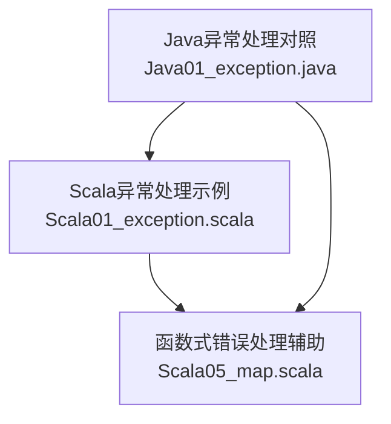
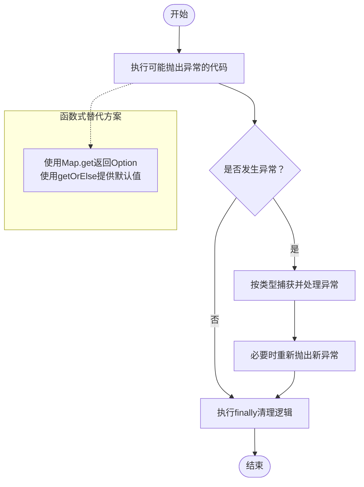
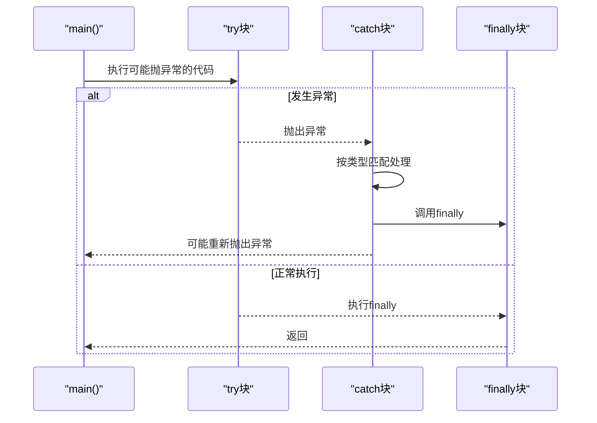
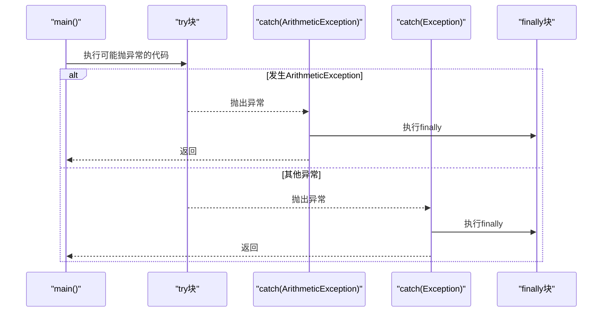
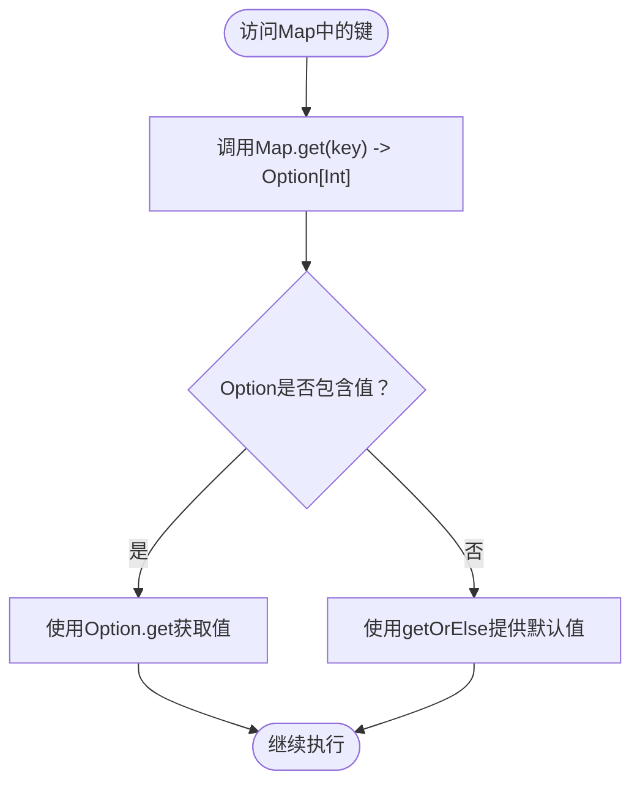
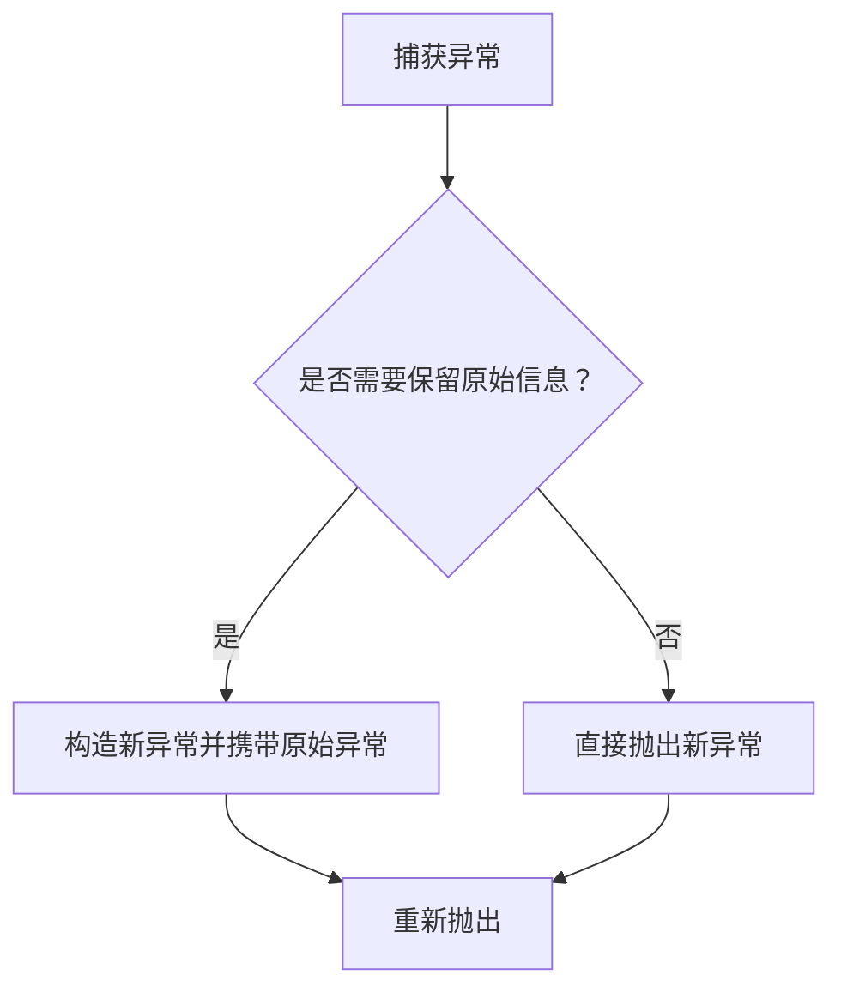
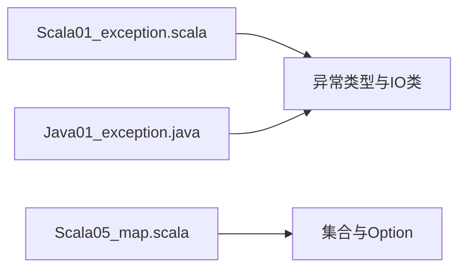

# 异常处理

<cite>
**本文引用的文件**
- [Scala01_exception.scala](file://_04_scalaTest/src/main/scala/com/atguigu/scala/chapter09/Scala01_exception.scala)
- [Java01_exception.java](file://_04_scalaTest/src/main/java/com/atguigu/java/chapter09/Java01_exception.java)
- [Scala05_map.scala](file://_04_scalaTest/src/main/scala/com/atguigu/scala/chapter07/Scala05_map.scala)
</cite>

## 目录
1. [简介](#简介)
2. [项目结构](#项目结构)
3. [核心组件](#核心组件)
4. [架构总览](#架构总览)
5. [详细组件分析](#详细组件分析)
6. [依赖分析](#依赖分析)
7. [性能考虑](#性能考虑)
8. [故障排查指南](#故障排查指南)
9. [结论](#结论)
10. [附录](#附录)

## 简介
本文件围绕Scala异常处理机制展开，结合仓库中的示例代码，系统讲解以下内容：
- 传统try-catch-finally的使用方式与注意事项
- Scala与Java在异常处理上的差异（如throws声明、@throws注解、模式匹配异常捕获）
- 使用Option与getOrElse等方法替代异常的函数式思路
- 自定义异常的抛出与捕获实践
- 在函数式风格下进行安全错误处理的策略建议
- 对比传统try-catch与函数式错误处理的优劣，帮助读者选择合适策略

## 项目结构
本次文档聚焦于Scala与Java异常处理相关示例文件，主要涉及：
- Scala异常处理示例：Scala01_exception.scala
- Java异常处理对照：Java01_exception.java
- 函数式错误处理辅助示例：Scala05_map.scala（演示Option与getOrElse）

图表来源
- [Scala01_exception.scala](file://_04_scalaTest/src/main/scala/com/atguigu/scala/chapter09/Scala01_exception.scala#L1-L45)
- [Java01_exception.java](file://_04_scalaTest/src/main/java/com/atguigu/java/chapter09/Java01_exception.java#L1-L45)
- [Scala05_map.scala](file://_04_scalaTest/src/main/scala/com/atguigu/scala/chapter07/Scala05_map.scala#L1-L89)

章节来源
- [Scala01_exception.scala](file://_04_scalaTest/src/main/scala/com/atguigu/scala/chapter09/Scala01_exception.scala#L1-L45)
- [Java01_exception.java](file://_04_scalaTest/src/main/java/com/atguigu/java/chapter09/Java01_exception.java#L1-L45)
- [Scala05_map.scala](file://_04_scalaTest/src/main/scala/com/atguigu/scala/chapter07/Scala05_map.scala#L1-L89)

## 核心组件
- 传统异常捕获与finally清理：示例展示了try-catch-finally的基本用法，以及在catch块中使用模式匹配对不同异常类型进行分支处理；finally用于执行收尾逻辑。
- 抛出与声明：示例演示了throw语句抛出异常，以及使用@throws注解声明可能抛出的异常类型。
- Java对比：Java01_exception.java展示了Java中throws声明与多个catch分支的典型用法，便于对比Scala的差异。
- 函数式错误处理辅助：Scala05_map.scala通过Map的apply/get/getOrElse等方法，演示了以Option和getOrElse表达“无值”的方式，从而避免抛出NoSuchElementException等异常。

章节来源
- [Scala01_exception.scala](file://_04_scalaTest/src/main/scala/com/atguigu/scala/chapter09/Scala01_exception.scala#L10-L33)
- [Scala01_exception.scala](file://_04_scalaTest/src/main/scala/com/atguigu/scala/chapter09/Scala01_exception.scala#L41-L44)
- [Java01_exception.java](file://_04_scalaTest/src/main/java/com/atguigu/java/chapter09/Java01_exception.java#L9-L37)
- [Scala05_map.scala](file://_04_scalaTest/src/main/scala/com/atguigu/scala/chapter07/Scala05_map.scala#L36-L51)

## 架构总览
下图展示了异常处理在程序执行中的整体流程：正常路径与异常路径并存，finally负责清理；同时给出函数式风格下的替代方案（以Option表达缺失值）。

图表来源
- [Scala01_exception.scala](file://_04_scalaTest/src/main/scala/com/atguigu/scala/chapter09/Scala01_exception.scala#L19-L33)
- [Scala05_map.scala](file://_04_scalaTest/src/main/scala/com/atguigu/scala/chapter07/Scala05_map.scala#L36-L51)

## 详细组件分析

### 组件A：Scala异常捕获与finally清理
- try块：包含可能引发ArithmeticException等运行时异常的计算。
- catch块：采用模式匹配对异常类型进行分支处理，分别输出提示或重新抛出包装后的异常。
- finally块：无论是否发生异常都会执行，适合做资源释放等清理工作。
- @throws注解：用于声明方法可能抛出的异常类型，便于调用方了解风险。

图表来源
- [Scala01_exception.scala](file://_04_scalaTest/src/main/scala/com/atguigu/scala/chapter09/Scala01_exception.scala#L19-L33)
- [Scala01_exception.scala](file://_04_scalaTest/src/main/scala/com/atguigu/scala/chapter09/Scala01_exception.scala#L41-L44)

章节来源
- [Scala01_exception.scala](file://_04_scalaTest/src/main/scala/com/atguigu/scala/chapter09/Scala01_exception.scala#L19-L33)
- [Scala01_exception.scala](file://_04_scalaTest/src/main/scala/com/atguigu/scala/chapter09/Scala01_exception.scala#L41-L44)

### 组件B：Java异常处理对比
- Java中通过throws声明方法可能抛出的异常类型，调用方需在调用点或上层方法中使用try-catch处理。
- Java支持多catch分支，便于区分不同异常类型并分别处理。
- finally同样用于清理资源。

图表来源
- [Java01_exception.java](file://_04_scalaTest/src/main/java/com/atguigu/java/chapter09/Java01_exception.java#L9-L37)

章节来源
- [Java01_exception.java](file://_04_scalaTest/src/main/java/com/atguigu/java/chapter09/Java01_exception.java#L9-L37)

### 组件C：函数式错误处理（Option与getOrElse）
- 通过Map.get返回Option类型，若键不存在则为None，避免直接抛出NoSuchElementException。
- 使用getOrElse提供默认值，使调用方无需在边界处显式处理异常。
- apply(key)在键不存在时会抛异常，与get行为形成对比，体现函数式风格下“显式错误”的价值。

图表来源
- [Scala05_map.scala](file://_04_scalaTest/src/main/scala/com/atguigu/scala/chapter07/Scala05_map.scala#L36-L51)

章节来源
- [Scala05_map.scala](file://_04_scalaTest/src/main/scala/com/atguigu/scala/chapter07/Scala05_map.scala#L36-L51)

### 组件D：抛出与重新抛出
- throw用于主动抛出异常实例。
- 在catch中可根据需要包装并重新抛出新的异常，以便在调用栈中保留上下文信息。

图表来源
- [Scala01_exception.scala](file://_04_scalaTest/src/main/scala/com/atguigu/scala/chapter09/Scala01_exception.scala#L25-L30)

章节来源
- [Scala01_exception.scala](file://_04_scalaTest/src/main/scala/com/atguigu/scala/chapter09/Scala01_exception.scala#L25-L30)

## 依赖分析
- Scala异常处理示例依赖标准库中的异常类型与IO类，用于演示ArithmeticException、NullPointerException以及文件读取异常。
- Java异常处理示例与Scala示例在同一工程中，便于对比两种语言的异常处理差异。
- 函数式错误处理示例依赖Scala集合库，重点展示Option与Map操作。

图表来源
- [Scala01_exception.scala](file://_04_scalaTest/src/main/scala/com/atguigu/scala/chapter09/Scala01_exception.scala#L1-L4)
- [Scala05_map.scala](file://_04_scalaTest/src/main/scala/com/atguigu/scala/chapter07/Scala05_map.scala#L1-L1)

章节来源
- [Scala01_exception.scala](file://_04_scalaTest/src/main/scala/com/atguigu/scala/chapter09/Scala01_exception.scala#L1-L4)
- [Scala05_map.scala](file://_04_scalaTest/src/main/scala/com/atguigu/scala/chapter07/Scala05_map.scala#L1-L1)

## 性能考虑
- finally块中的逻辑应尽量轻量，避免在异常路径中引入昂贵操作，以免影响性能。
- 使用函数式风格（如Option+getOrElse）可减少异常开销，尤其在高频访问且易出现“无值”场景时。
- 在需要频繁判断键是否存在时，优先使用Map.get配合Option，而非依赖异常传播。

## 故障排查指南
- 算术异常：检查除数是否为零，确保在进入除法前进行校验。
- 空指针异常：确认对象初始化与引用有效性，避免在未初始化的对象上调用方法。
- 文件读取异常：确认文件路径存在且具备读取权限，必要时在调用前进行存在性检查。
- 资源泄漏：确保finally中释放资源，或使用with-resource模式（在Scala中可用try-with-resources的等价思路）。

章节来源
- [Scala01_exception.scala](file://_04_scalaTest/src/main/scala/com/atguigu/scala/chapter09/Scala01_exception.scala#L19-L33)
- [Scala01_exception.scala](file://_04_scalaTest/src/main/scala/com/atguigu/scala/chapter09/Scala01_exception.scala#L35-L35)

## 结论
- Scala与Java在异常处理上的核心差异体现在：Scala不强制throws声明，支持@throws注解声明，且在catch中可使用模式匹配进行类型化处理；Java要求throws声明并在多catch中分类型处理。
- 在函数式风格下，优先使用Option与getOrElse表达“无值”，可显著降低异常传播成本，提升代码可读性与健壮性。
- 对于已知的边界条件（如键不存在），采用函数式错误处理优于依赖异常；对于不可预期的外部错误（如IO失败），仍可使用try-catch-finally进行隔离与恢复。

## 附录
- 实践建议
  - 明确异常边界：对可预测的错误（如键不存在）使用Option；对不可预测的外部错误使用异常。
  - 保持finally轻量：仅做必要的清理，避免在finally中抛出异常。
  - 合理使用@throws：对外暴露API时，使用@throws标注可能抛出的异常类型，便于调用方正确处理。
  - 包装异常：在catch中根据需要包装异常，保留原始异常上下文，便于调试与追踪。