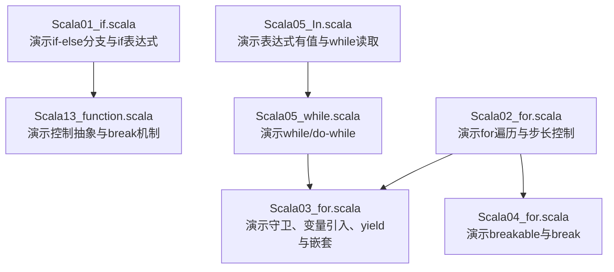
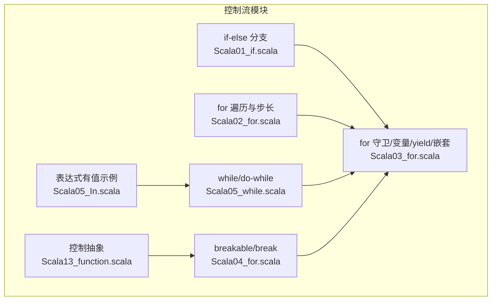
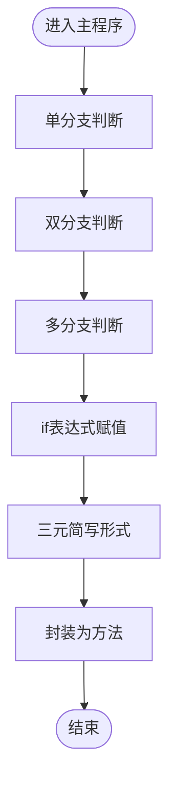
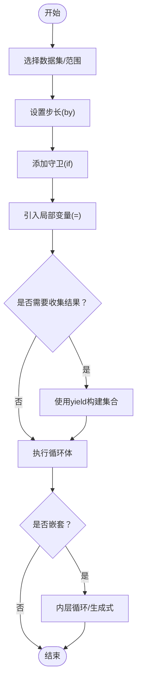
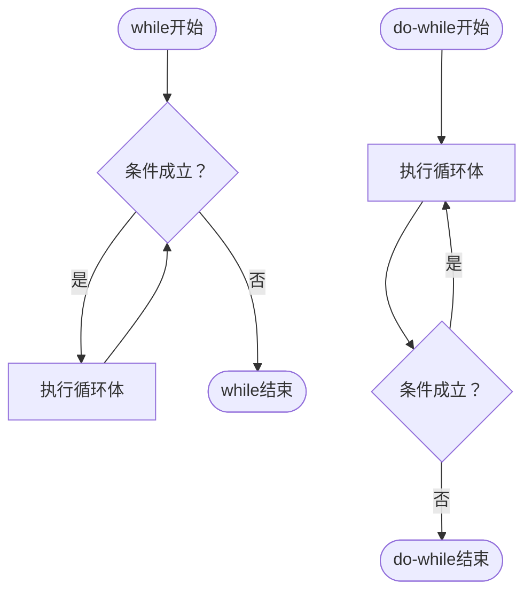
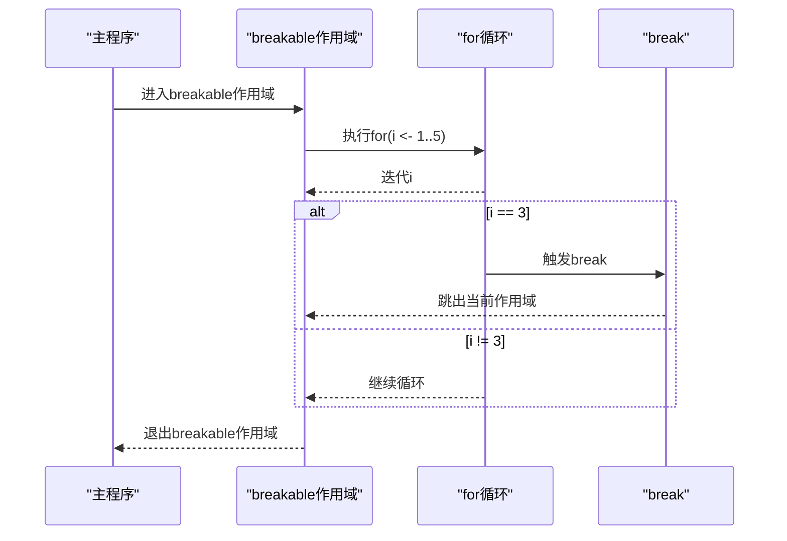
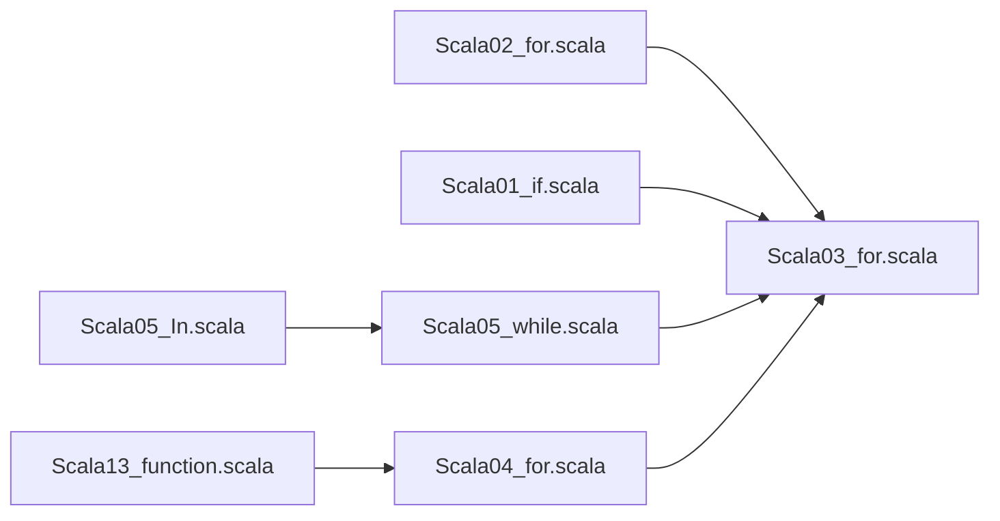

# 控制流语句

<cite>
**本文引用的文件**
- [Scala01_if.scala](file://_04_scalaTest/src/main/scala/com/atguigu/scala/chapter04/Scala01_if.scala)
- [Scala02_for.scala](file://_04_scalaTest/src/main/scala/com/atguigu/scala/chapter04/Scala02_for.scala)
- [Scala03_for.scala](file://_04_scalaTest/src/main/scala/com/atguigu/scala/chapter04/Scala03_for.scala)
- [Scala04_for.scala](file://_04_scalaTest/src/main/scala/com/atguigu/scala/chapter04/Scala04_for.scala)
- [Scala05_while.scala](file://_04_scalaTest/src/main/scala/com/atguigu/scala/chapter04/Scala05_while.scala)
- [Scala13_function.scala](file://_04_scalaTest/src/main/scala/com/atguigu/scala/chapter05/Scala13_function.scala)
- [Scala05_In.scala](file://_04_scalaTest/src/main/scala/com/atguigu/scala/chapter02/Scala05_In.scala)
</cite>

## 目录
1. [引言](#引言)
2. [项目结构](#项目结构)
3. [核心组件](#核心组件)
4. [架构总览](#架构总览)
5. [详细组件分析](#详细组件分析)
6. [依赖关系分析](#依赖关系分析)
7. [性能考量](#性能考量)
8. [故障排查指南](#故障排查指南)
9. [结论](#结论)
10. [附录](#附录)

## 引言
本文件系统性梳理Scala控制流语句，围绕以下目标展开：  
- 深入讲解if-else条件语句的使用，明确表达式形式与语句形式的差异；  
- 全面覆盖for循环的多种形态：传统遍历、步长控制、循环守卫、引入局部变量、嵌套循环、以及通过yield构建表达式结果；  
- 重点阐述Scala for表达式的强大能力（集合遍历、过滤、映射等），并给出复杂循环逻辑的实际示例路径；  
- 对比Scala与Java在控制流方面的差异，帮助读者理解Scala的编程范式。

## 项目结构
本次文档聚焦于Scala测试工程中的控制流示例文件，涵盖分支与循环的典型用法与进阶特性。下图给出与控制流相关的核心文件及其职责概览：

图表来源
- [Scala01_if.scala](file://_04_scalaTest/src/main/scala/com/atguigu/scala/chapter04/Scala01_if.scala#L1-L104)
- [Scala02_for.scala](file://_04_scalaTest/src/main/scala/com/atguigu/scala/chapter04/Scala02_for.scala#L1-L86)
- [Scala03_for.scala](file://_04_scalaTest/src/main/scala/com/atguigu/scala/chapter04/Scala03_for.scala#L1-L96)
- [Scala04_for.scala](file://_04_scalaTest/src/main/scala/com/atguigu/scala/chapter04/Scala04_for.scala#L1-L42)
- [Scala05_while.scala](file://_04_scalaTest/src/main/scala/com/atguigu/scala/chapter04/Scala05_while.scala#L1-L34)
- [Scala13_function.scala](file://_04_scalaTest/src/main/scala/com/atguigu/scala/chapter05/Scala13_function.scala#L1-L43)
- [Scala05_In.scala](file://_04_scalaTest/src/main/scala/com/atguigu/scala/chapter02/Scala05_In.scala#L1-L50)

章节来源
- [Scala01_if.scala](file://_04_scalaTest/src/main/scala/com/atguigu/scala/chapter04/Scala01_if.scala#L1-L104)
- [Scala02_for.scala](file://_04_scalaTest/src/main/scala/com/atguigu/scala/chapter04/Scala02_for.scala#L1-L86)
- [Scala03_for.scala](file://_04_scalaTest/src/main/scala/com/atguigu/scala/chapter04/Scala03_for.scala#L1-L96)
- [Scala04_for.scala](file://_04_scalaTest/src/main/scala/com/atguigu/scala/chapter04/Scala04_for.scala#L1-L42)
- [Scala05_while.scala](file://_04_scalaTest/src/main/scala/com/atguigu/scala/chapter04/Scala05_while.scala#L1-L34)
- [Scala13_function.scala](file://_04_scalaTest/src/main/scala/com/atguigu/scala/chapter05/Scala13_function.scala#L1-L43)
- [Scala05_In.scala](file://_04_scalaTest/src/main/scala/com/atguigu/scala/chapter02/Scala05_In.scala#L1-L50)

## 核心组件
- 分支控制（if-else）：演示单/双/多分支，以及if表达式作为右值赋值与三元简写形式。
- for循环：演示遍历范围、步长、守卫、引入变量、yield表达式、嵌套循环。
- while/do-while：演示先判后行与先行后判两种模式。
- 中断控制：演示通过Breaks.breakable与break实现“类break”行为。
- 控制抽象：演示以“按需求值”的方式将代码片段作为参数传递，体现Scala的控制抽象能力。

章节来源
- [Scala01_if.scala](file://_04_scalaTest/src/main/scala/com/atguigu/scala/chapter04/Scala01_if.scala#L1-L104)
- [Scala02_for.scala](file://_04_scalaTest/src/main/scala/com/atguigu/scala/chapter04/Scala02_for.scala#L1-L86)
- [Scala03_for.scala](file://_04_scalaTest/src/main/scala/com/atguigu/scala/chapter04/Scala03_for.scala#L1-L96)
- [Scala04_for.scala](file://_04_scalaTest/src/main/scala/com/atguigu/scala/chapter04/Scala04_for.scala#L1-L42)
- [Scala05_while.scala](file://_04_scalaTest/src/main/scala/com/atguigu/scala/chapter04/Scala05_while.scala#L1-L34)
- [Scala13_function.scala](file://_04_scalaTest/src/main/scala/com/atguigu/scala/chapter05/Scala13_function.scala#L1-L43)

## 架构总览
下图展示控制流模块之间的协作关系与数据流向：

图表来源
- [Scala01_if.scala](file://_04_scalaTest/src/main/scala/com/atguigu/scala/chapter04/Scala01_if.scala#L1-L104)
- [Scala02_for.scala](file://_04_scalaTest/src/main/scala/com/atguigu/scala/chapter04/Scala02_for.scala#L1-L86)
- [Scala03_for.scala](file://_04_scalaTest/src/main/scala/com/atguigu/scala/chapter04/Scala03_for.scala#L1-L96)
- [Scala04_for.scala](file://_04_scalaTest/src/main/scala/com/atguigu/scala/chapter04/Scala04_for.scala#L1-L42)
- [Scala05_while.scala](file://_04_scalaTest/src/main/scala/com/atguigu/scala/chapter04/Scala05_while.scala#L1-L34)
- [Scala13_function.scala](file://_04_scalaTest/src/main/scala/com/atguigu/scala/chapter05/Scala13_function.scala#L1-L43)
- [Scala05_In.scala](file://_04_scalaTest/src/main/scala/com/atguigu/scala/chapter02/Scala05_In.scala#L1-L50)

## 详细组件分析

### if-else 条件语句
- 单/双/多分支：分别演示不同层级的条件判断。
- if表达式作为值：if表达式可作为右值赋给变量，并返回满足分支的最后一行表达式结果；可与三元简写形式结合使用。
- 方法封装：将判断逻辑封装为方法，便于复用与测试。

图表来源
- [Scala01_if.scala](file://_04_scalaTest/src/main/scala/com/atguigu/scala/chapter04/Scala01_if.scala#L1-L104)

章节来源
- [Scala01_if.scala](file://_04_scalaTest/src/main/scala/com/atguigu/scala/chapter04/Scala01_if.scala#L1-L104)

### for 循环：遍历、守卫、变量引入与yield
- 遍历范围与步长：演示to/inclusive、until、Range构造与by步长控制。
- 循环守卫：通过if子句实现类似continue的效果。
- 引入局部变量：在同一for生成式中声明临时变量。
- yield表达式：将每次迭代的结果收集为集合，形成“for表达式”。
- 嵌套循环：支持外层/内层嵌套，或同层并列生成式组合。

图表来源
- [Scala02_for.scala](file://_04_scalaTest/src/main/scala/com/atguigu/scala/chapter04/Scala02_for.scala#L1-L86)
- [Scala03_for.scala](file://_04_scalaTest/src/main/scala/com/atguigu/scala/chapter04/Scala03_for.scala#L1-L96)

章节来源
- [Scala02_for.scala](file://_04_scalaTest/src/main/scala/com/atguigu/scala/chapter04/Scala02_for.scala#L1-L86)
- [Scala03_for.scala](file://_04_scalaTest/src/main/scala/com/atguigu/scala/chapter04/Scala03_for.scala#L1-L96)

### while/do-while 循环
- while：先判断条件再执行循环体。
- do-while：先执行循环体再判断条件。
- 结合输入输出示例：展示表达式具有值的特性与while循环的配合使用。

图表来源
- [Scala05_while.scala](file://_04_scalaTest/src/main/scala/com/atguigu/scala/chapter04/Scala05_while.scala#L1-L34)
- [Scala05_In.scala](file://_04_scalaTest/src/main/scala/com/atguigu/scala/chapter02/Scala05_In.scala#L1-L50)

章节来源
- [Scala05_while.scala](file://_04_scalaTest/src/main/scala/com/atguigu/scala/chapter04/Scala05_while.scala#L1-L34)
- [Scala05_In.scala](file://_04_scalaTest/src/main/scala/com/atguigu/scala/chapter02/Scala05_In.scala#L1-L50)

### breakable/break 与控制抽象
- breakable/break：通过Breaks对象提供的作用域包装实现“类break”中断。
- 控制抽象：以“按需求值”的形式将代码块作为参数传入，体现延迟计算与高阶抽象。

图表来源
- [Scala04_for.scala](file://_04_scalaTest/src/main/scala/com/atguigu/scala/chapter04/Scala04_for.scala#L1-L42)
- [Scala13_function.scala](file://_04_scalaTest/src/main/scala/com/atguigu/scala/chapter05/Scala13_function.scala#L1-L43)

章节来源
- [Scala04_for.scala](file://_04_scalaTest/src/main/scala/com/atguigu/scala/chapter04/Scala04_for.scala#L1-L42)
- [Scala13_function.scala](file://_04_scalaTest/src/main/scala/com/atguigu/scala/chapter05/Scala13_function.scala#L1-L43)

### Scala与Java控制流差异要点
- break/continue：Java具备break/continue关键字；Scala通过Breaks.breakable与break模拟中断语义。
- for循环：Java常见for(int i...)与增强for遍历；Scala采用“生成式风格”的for(i <- 集合)”。
- 表达式有值：Scala中if/for等控制结构本身可作为表达式返回值，Java不具备此特性。
- 控制抽象：Scala支持以“按需求值”的方式将代码块作为参数传递，体现函数式控制抽象。

章节来源
- [Scala04_for.scala](file://_04_scalaTest/src/main/scala/com/atguigu/scala/chapter04/Scala04_for.scala#L1-L42)
- [Scala02_for.scala](file://_04_scalaTest/src/main/scala/com/atguigu/scala/chapter04/Scala02_for.scala#L1-L86)
- [Scala01_if.scala](file://_04_scalaTest/src/main/scala/com/atguigu/scala/chapter04/Scala01_if.scala#L1-L104)
- [Scala13_function.scala](file://_04_scalaTest/src/main/scala/com/atguigu/scala/chapter05/Scala13_function.scala#L1-L43)

## 依赖关系分析
- 文件间依赖：控制流示例文件彼此独立，主要通过标准库与scala.util.control.Breaks进行交互。
- 外部依赖：Breaks用于提供breakable/break能力；while/do-while与输入输出示例共同体现表达式有值的特性。

图表来源
- [Scala01_if.scala](file://_04_scalaTest/src/main/scala/com/atguigu/scala/chapter04/Scala01_if.scala#L1-L104)
- [Scala02_for.scala](file://_04_scalaTest/src/main/scala/com/atguigu/scala/chapter04/Scala02_for.scala#L1-L86)
- [Scala03_for.scala](file://_04_scalaTest/src/main/scala/com/atguigu/scala/chapter04/Scala03_for.scala#L1-L96)
- [Scala04_for.scala](file://_04_scalaTest/src/main/scala/com/atguigu/scala/chapter04/Scala04_for.scala#L1-L42)
- [Scala05_while.scala](file://_04_scalaTest/src/main/scala/com/atguigu/scala/chapter04/Scala05_while.scala#L1-L34)
- [Scala13_function.scala](file://_04_scalaTest/src/main/scala/com/atguigu/scala/chapter05/Scala13_function.scala#L1-L43)
- [Scala05_In.scala](file://_04_scalaTest/src/main/scala/com/atguigu/scala/chapter02/Scala05_In.scala#L1-L50)

## 性能考量
- for表达式与yield：在需要收集结果时使用yield可避免显式累加器，但需注意中间集合的内存占用。
- 步长与范围：合理设置步长与范围可减少不必要的迭代次数。
- 嵌套循环：尽量降低内层数量级，必要时通过守卫提前过滤数据。
- 控制抽象：延迟求值可带来更好的可读性，但在高频路径上应关注闭包与按需求值带来的额外开销。

## 故障排查指南
- break不可用：若直接使用break会编译失败，应使用scala.util.control.Breaks.breakable与break。
- continue替代：Scala无continue，可用if守卫或对条件取反实现相同效果。
- 表达式无值：while/do-while等结构本身为语句，若期望返回值请改用for/yield或在循环外累积结果。
- 作用域问题：break仅在breakable作用域内有效，确保break位于正确的嵌套层级。

章节来源
- [Scala04_for.scala](file://_04_scalaTest/src/main/scala/com/atguigu/scala/chapter04/Scala04_for.scala#L1-L42)
- [Scala03_for.scala](file://_04_scalaTest/src/main/scala/com/atguigu/scala/chapter04/Scala03_for.scala#L1-L96)
- [Scala05_while.scala](file://_04_scalaTest/src/main/scala/com/atguigu/scala/chapter04/Scala05_while.scala#L1-L34)

## 结论
Scala的控制流以“表达式有值”和“控制抽象”为核心特征，for循环通过生成式语法、守卫、变量引入与yield实现了强大的集合处理能力；while/do-while保持了传统循环的灵活性；break机制通过Breaks提供了安全的中断语义。相较Java，Scala在控制流方面更强调函数式与表达式风格，有助于写出简洁且可组合的代码。

## 附录
- 示例路径参考（不直接展示代码内容）：
  - if-else表达式与三元简写：[Scala01_if.scala](file://_04_scalaTest/src/main/scala/com/atguigu/scala/chapter04/Scala01_if.scala#L60-L86)
  - for遍历与步长：[Scala02_for.scala](file://_04_scalaTest/src/main/scala/com/atguigu/scala/chapter04/Scala02_for.scala#L26-L79)
  - for守卫与变量引入：[Scala03_for.scala](file://_04_scalaTest/src/main/scala/com/atguigu/scala/chapter04/Scala03_for.scala#L18-L39)
  - for表达式与yield：[Scala03_for.scala](file://_04_scalaTest/src/main/scala/com/atguigu/scala/chapter04/Scala03_for.scala#L43-L56)
  - 嵌套循环与同层生成式：[Scala03_for.scala](file://_04_scalaTest/src/main/scala/com/atguigu/scala/chapter04/Scala03_for.scala#L61-L74)
  - while/do-while示例：[Scala05_while.scala](file://_04_scalaTest/src/main/scala/com/atguigu/scala/chapter04/Scala05_while.scala#L18-L31)
  - breakable/break使用：[Scala04_for.scala](file://_04_scalaTest/src/main/scala/com/atguigu/scala/chapter04/Scala04_for.scala#L25-L34)
  - 控制抽象示例：[Scala13_function.scala](file://_04_scalaTest/src/main/scala/com/atguigu/scala/chapter05/Scala13_function.scala#L25-L41)
  - 表达式有值与while读取：[Scala05_In.scala](file://_04_scalaTest/src/main/scala/com/atguigu/scala/chapter02/Scala05_In.scala#L31-L49)