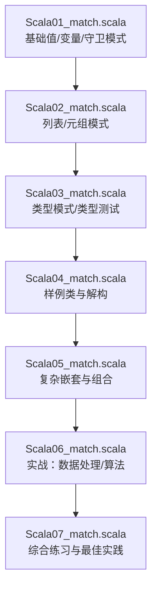
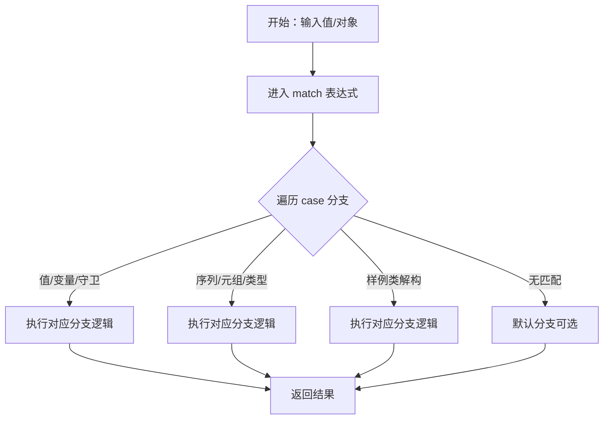
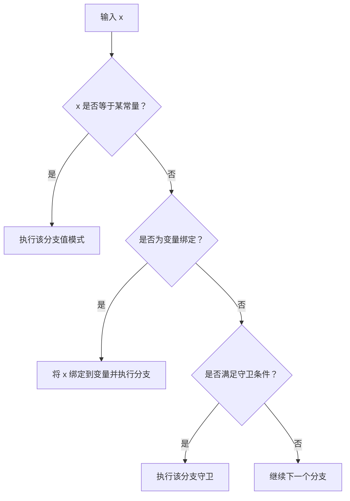
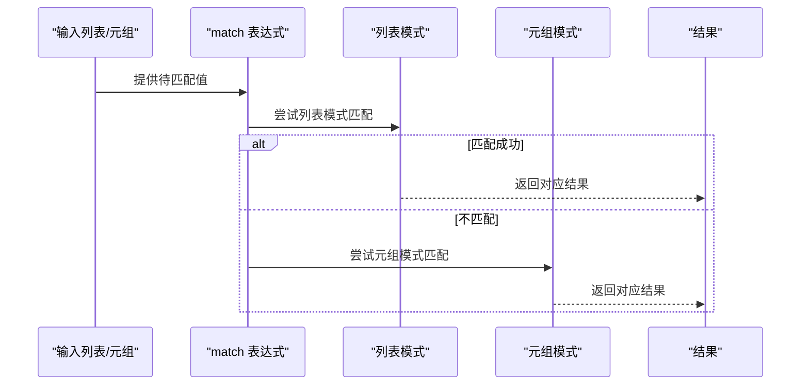
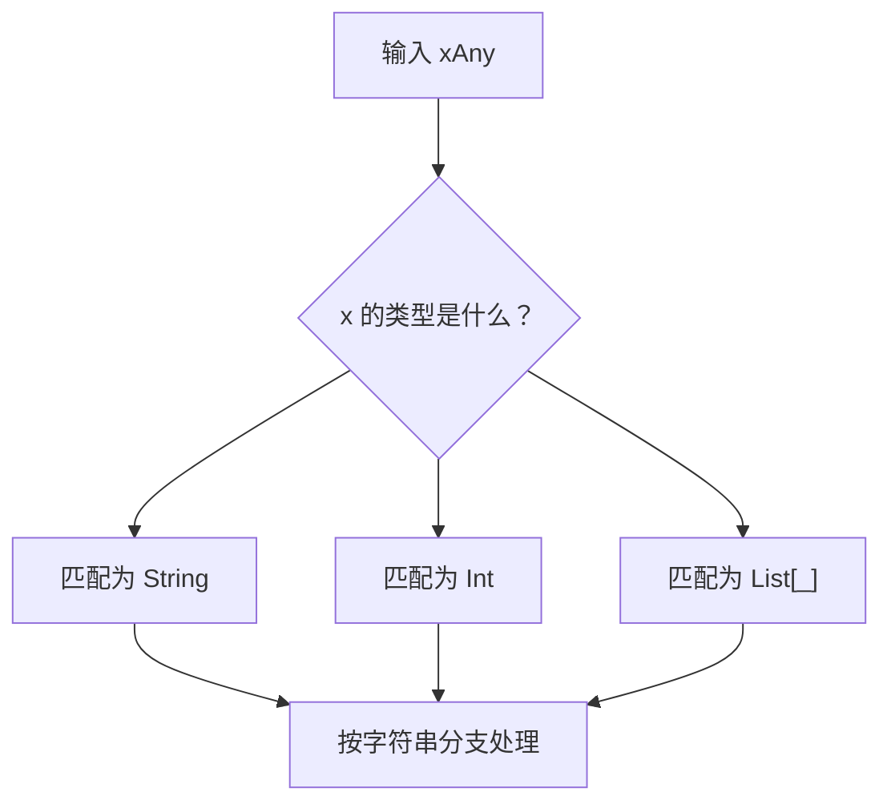
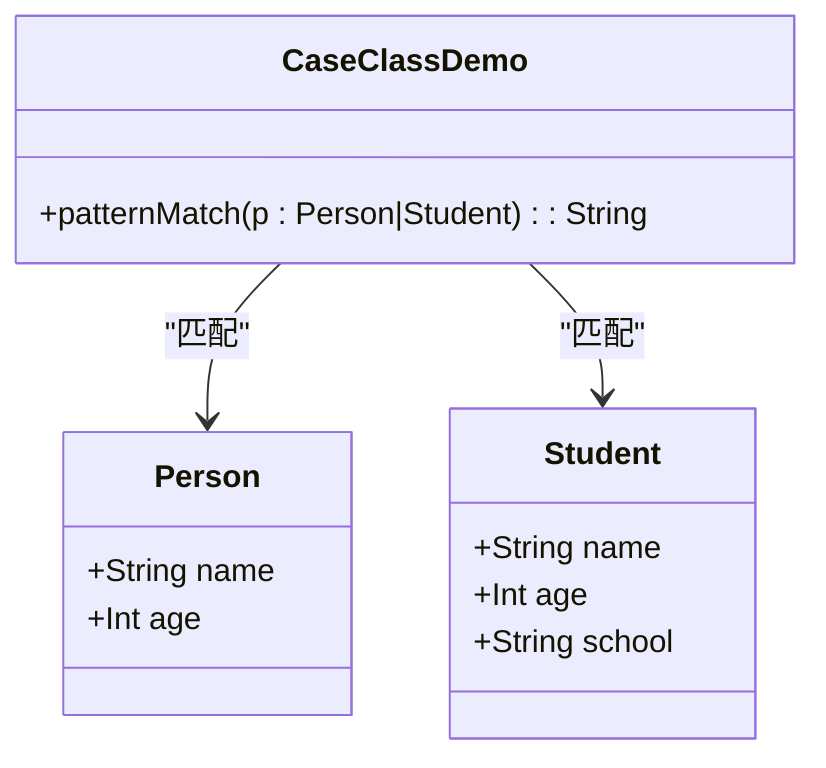
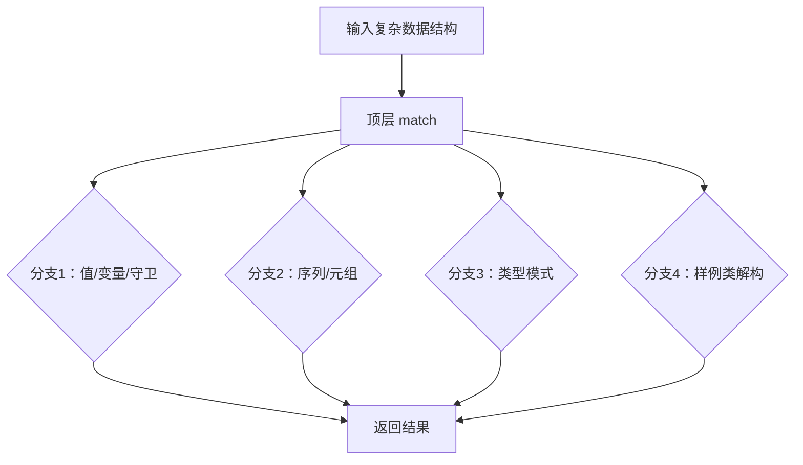
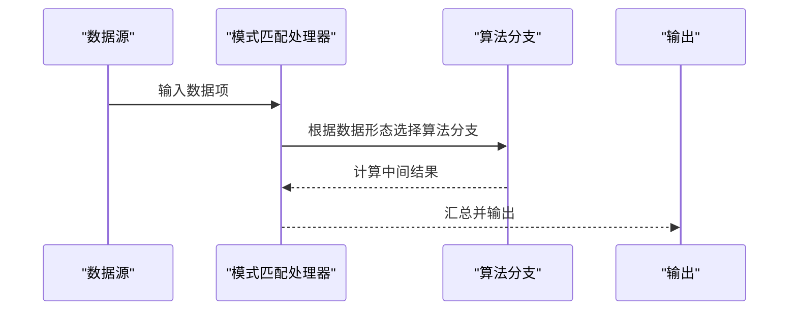
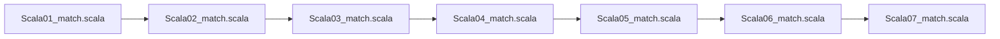

# 模式匹配

<cite>
**本文引用的文件**
- [Scala01_match.scala](file://_04_scalaTest/src/main/scala/com/atguigu/scala/chapter08/Scala01_match.scala)
- [Scala02_match.scala](file://_04_scalaTest/src/main/scala/com/atguigu/scala/chapter08/Scala02_match.scala)
- [Scala03_match.scala](file://_04_scalaTest/src/main/scala/com/atguigu/scala/chapter08/Scala03_match.scala)
- [Scala04_match.scala](file://_04_scalaTest/src/main/scala/com/atguigu/scala/chapter08/Scala04_match.scala)
- [Scala05_match.scala](file://_04_scalaTest/src/main/scala/com/atguigu/scala/chapter08/Scala05_match.scala)
- [Scala06_match.scala](file://_04_scalaTest/src/main/scala/com/atguigu/scala/chapter08/Scala06_match.scala)
- [Scala07_match.scala](file://_04_scalaTest/src/main/scala/com/atguigu/scala/chapter08/Scala07_match.scala)
</cite>

## 目录
1. [引言](#引言)
2. [项目结构](#项目结构)
3. [核心组件](#核心组件)
4. [架构总览](#架构总览)
5. [详细组件分析](#详细组件分析)
6. [依赖分析](#依赖分析)
7. [性能考虑](#性能考虑)
8. [故障排查指南](#故障排查指南)
9. [结论](#结论)
10. [附录](#附录)

## 引言
本篇文档围绕Scala中的“模式匹配”展开，系统梳理match表达式的语法与用法，覆盖值模式、变量模式、构造器模式、序列模式、元组模式、类型模式等，并结合样例类（case class）的自动getter与解构能力，展示其在数据处理与算法实现中的强大表现。同时通过与传统switch语句的对比，帮助读者理解模式匹配的优势与适用场景。

## 项目结构
本次文档聚焦于Scala章节08的模式匹配相关示例文件，它们按主题逐步递进，从基础的值/变量/守卫模式，到列表/元组/类型模式，再到样例类的解构与应用，最后扩展到更复杂的组合与实战案例。

**图示来源**
- [Scala01_match.scala](file://_04_scalaTest/src/main/scala/com/atguigu/scala/chapter08/Scala01_match.scala#L1-L200)
- [Scala02_match.scala](file://_04_scalaTest/src/main/scala/com/atguigu/scala/chapter08/Scala02_match.scala#L1-L200)
- [Scala03_match.scala](file://_04_scalaTest/src/main/scala/com/atguigu/scala/chapter08/Scala03_match.scala#L1-L200)
- [Scala04_match.scala](file://_04_scalaTest/src/main/scala/com/atguigu/scala/chapter08/Scala04_match.scala#L1-L200)
- [Scala05_match.scala](file://_04_scalaTest/src/main/scala/com/atguigu/scala/chapter08/Scala05_match.scala#L1-L200)
- [Scala06_match.scala](file://_04_scalaTest/src/main/scala/com/atguigu/scala/chapter08/Scala06_match.scala#L1-L200)
- [Scala07_match.scala](file://_04_scalaTest/src/main/scala/com/atguigu/scala/chapter08/Scala07_match.scala#L1-L200)

**章节来源**
- [Scala01_match.scala](file://_04_scalaTest/src/main/scala/com/atguigu/scala/chapter08/Scala01_match.scala#L1-L200)
- [Scala02_match.scala](file://_04_scalaTest/src/main/scala/com/atguigu/scala/chapter08/Scala02_match.scala#L1-L200)
- [Scala03_match.scala](file://_04_scalaTest/src/main/scala/com/atguigu/scala/chapter08/Scala03_match.scala#L1-L200)
- [Scala04_match.scala](file://_04_scalaTest/src/main/scala/com/atguigu/scala/chapter08/Scala04_match.scala#L1-L200)
- [Scala05_match.scala](file://_04_scalaTest/src/main/scala/com/atguigu/scala/chapter08/Scala05_match.scala#L1-L200)
- [Scala06_match.scala](file://_04_scalaTest/src/main/scala/com/atguigu/scala/chapter08/Scala06_match.scala#L1-L200)
- [Scala07_match.scala](file://_04_scalaTest/src/main/scala/com/atguigu/scala/chapter08/Scala07_match.scala#L1-L200)

## 核心组件
- match表达式：以关键字“match”开始，后接待匹配值；每个分支以“case”定义，支持守卫（guard）与通配符“_”。
- 值模式：对常量或字面量进行精确匹配。
- 变量模式：将匹配到的值绑定到变量名，可用于后续处理。
- 构造器模式：对对象的内部结构进行匹配，常用于样例类。
- 序列模式：对List/Set等序列进行结构化匹配，支持可变参数“@_*”。
- 元组模式：对二元或多元组进行并行解构。
- 类型模式：基于类型进行匹配，常与“isInstanceOf”等运行时类型信息结合。
- 样例类（case class）：自动生成伴生对象、apply/unapply、getter等，天然适配模式匹配。
- 守卫（guard）：在case后使用“if 条件”进行额外过滤，提升分支表达力。

**章节来源**
- [Scala01_match.scala](file://_04_scalaTest/src/main/scala/com/atguigu/scala/chapter08/Scala01_match.scala#L1-L200)
- [Scala02_match.scala](file://_04_scalaTest/src/main/scala/com/atguigu/scala/chapter08/Scala02_match.scala#L1-L200)
- [Scala03_match.scala](file://_04_scalaTest/src/main/scala/com/atguigu/scala/chapter08/Scala03_match.scala#L1-L200)
- [Scala04_match.scala](file://_04_scalaTest/src/main/scala/com/atguigu/scala/chapter08/Scala04_match.scala#L1-L200)

## 架构总览
下图展示了从“输入值/对象”到“分支选择与结果产出”的整体流程，体现模式匹配的分派机制与可扩展性。

[此图为概念性流程示意，不直接映射具体源码文件，故不提供图示来源]

## 详细组件分析

### 基础：值模式、变量模式与守卫
- 值模式：对固定字面量进行匹配，适合枚举式分支。
- 变量模式：将匹配到的值绑定到变量，便于在分支内复用。
- 守卫：在case后添加条件判断，避免重复分支与样板代码。

**图示来源**
- [Scala01_match.scala](file://_04_scalaTest/src/main/scala/com/atguigu/scala/chapter08/Scala01_match.scala#L1-L200)

**章节来源**
- [Scala01_match.scala](file://_04_scalaTest/src/main/scala/com/atguigu/scala/chapter08/Scala01_match.scala#L1-L200)

### 列表与元组：序列模式与并行解构
- 列表模式：支持头部尾部匹配、可变参数“@_*”捕获剩余元素。
- 元组模式：对二元/多元组进行位置解构，支持嵌套。

**图示来源**
- [Scala02_match.scala](file://_04_scalaTest/src/main/scala/com/atguigu/scala/chapter08/Scala02_match.scala#L1-L200)

**章节来源**
- [Scala02_match.scala](file://_04_scalaTest/src/main/scala/com/atguigu/scala/chapter08/Scala02_match.scala#L1-L200)

### 类型模式：基于类型的分支策略
- 类型模式：根据运行时类型进行分支，常与“isInstanceOf”等结合，实现多态分支。
- 类型测试：在分支中进行类型判断与转换，避免显式强制类型转换。

**图示来源**
- [Scala03_match.scala](file://_04_scalaTest/src/main/scala/com/atguigu/scala/chapter08/Scala03_match.scala#L1-L200)

**章节来源**
- [Scala03_match.scala](file://_04_scalaTest/src/main/scala/com/atguigu/scala/chapter08/Scala03_match.scala#L1-L200)

### 样例类与解构：自动getter与结构化匹配
- 样例类（case class）：自动生成apply/unapply、getter、toString等，天然适配模式匹配。
- 解构赋值：在case中直接对字段进行命名绑定，提升可读性与安全性。

**图示来源**
- [Scala04_match.scala](file://_04_scalaTest/src/main/scala/com/atguigu/scala/chapter08/Scala04_match.scala#L1-L200)

**章节来源**
- [Scala04_match.scala](file://_04_scalaTest/src/main/scala/com/atguigu/scala/chapter08/Scala04_match.scala#L1-L200)

### 复杂嵌套与组合：多层模式与混合策略
- 嵌套匹配：在case体内部再次使用match，实现深层结构的分派。
- 混合策略：在同一match中同时使用值/变量/类型/序列/元组/样例类等模式，形成强大的分支表达力。

**图示来源**
- [Scala05_match.scala](file://_04_scalaTest/src/main/scala/com/atguigu/scala/chapter08/Scala05_match.scala#L1-L200)

**章节来源**
- [Scala05_match.scala](file://_04_scalaTest/src/main/scala/com/atguigu/scala/chapter08/Scala05_match.scala#L1-L200)

### 实战：数据处理与算法实现
- 数据处理：利用模式匹配对不同数据形态进行统一处理，减少if-else分支与样板代码。
- 算法实现：在递归/树形结构/状态机等场景中，模式匹配能清晰表达分支与收敛条件。

**图示来源**
- [Scala06_match.scala](file://_04_scalaTest/src/main/scala/com/atguigu/scala/chapter08/Scala06_match.scala#L1-L200)

**章节来源**
- [Scala06_match.scala](file://_04_scalaTest/src/main/scala/com/atguigu/scala/chapter08/Scala06_match.scala#L1-L200)

### 综合练习与最佳实践
- 避免遗漏默认分支，确保分支穷尽性。
- 合理使用守卫，避免过度复杂的条件判断。
- 对可变参数与通配符保持谨慎，优先使用明确的结构化模式。
- 在样例类中保持字段稳定，便于长期维护与演进。

**章节来源**
- [Scala07_match.scala](file://_04_scalaTest/src/main/scala/com/atguigu/scala/chapter08/Scala07_match.scala#L1-L200)

## 依赖分析
- 内聚性：各示例文件围绕同一主题（模式匹配）组织，逐步加深复杂度，内聚良好。
- 耦合性：文件间呈线性递进关系，耦合度低，便于独立学习与查阅。
- 可扩展性：模式匹配语法灵活，易于扩展到新的数据形态与业务场景。

**图示来源**
- [Scala01_match.scala](file://_04_scalaTest/src/main/scala/com/atguigu/scala/chapter08/Scala01_match.scala#L1-L200)
- [Scala02_match.scala](file://_04_scalaTest/src/main/scala/com/atguigu/scala/chapter08/Scala02_match.scala#L1-L200)
- [Scala03_match.scala](file://_04_scalaTest/src/main/scala/com/atguigu/scala/chapter08/Scala03_match.scala#L1-L200)
- [Scala04_match.scala](file://_04_scalaTest/src/main/scala/com/atguigu/scala/chapter08/Scala04_match.scala#L1-L200)
- [Scala05_match.scala](file://_04_scalaTest/src/main/scala/com/atguigu/scala/chapter08/Scala05_match.scala#L1-L200)
- [Scala06_match.scala](file://_04_scalaTest/src/main/scala/com/atguigu/scala/chapter08/Scala06_match.scala#L1-L200)
- [Scala07_match.scala](file://_04_scalaTest/src/main/scala/com/atguigu/scala/chapter08/Scala07_match.scala#L1-L200)

## 性能考虑
- 分支顺序：将最可能命中且判断简单的case置于前面，有助于减少比较次数。
- 守卫成本：守卫条件应尽量轻量，避免在高频路径上引入昂贵计算。
- 类型模式：频繁的类型判断可能带来运行时开销，必要时可结合缓存或预处理。
- 样例类解构：字段访问为常量时间，但过多嵌套会增加分支深度，需权衡可读性与性能。

[本节为通用指导，不直接分析具体文件，故不提供章节来源]

## 故障排查指南
- 未覆盖所有情况：若缺少默认分支，可能导致非预期行为；建议始终提供兜底分支或显式处理未知分支。
- 守卫误用：当守卫条件过于复杂或与主模式重叠时，易导致分支难以维护；应拆分或简化条件。
- 类型模式误判：运行时类型与编译期类型不一致时可能出现意外分支；可通过显式类型检查增强健壮性。
- 样例类字段缺失：当新增字段或字段名称变更时，解构可能失效；应同步更新匹配分支。

**章节来源**
- [Scala01_match.scala](file://_04_scalaTest/src/main/scala/com/atguigu/scala/chapter08/Scala01_match.scala#L1-L200)
- [Scala02_match.scala](file://_04_scalaTest/src/main/scala/com/atguigu/scala/chapter08/Scala02_match.scala#L1-L200)
- [Scala03_match.scala](file://_04_scalaTest/src/main/scala/com/atguigu/scala/chapter08/Scala03_match.scala#L1-L200)
- [Scala04_match.scala](file://_04_scalaTest/src/main/scala/com/atguigu/scala/chapter08/Scala04_match.scala#L1-L200)
- [Scala05_match.scala](file://_04_scalaTest/src/main/scala/com/atguigu/scala/chapter08/Scala05_match.scala#L1-L200)
- [Scala06_match.scala](file://_04_scalaTest/src/main/scala/com/atguigu/scala/chapter08/Scala06_match.scala#L1-L200)
- [Scala07_match.scala](file://_04_scalaTest/src/main/scala/com/atguigu/scala/chapter08/Scala07_match.scala#L1-L200)

## 结论
Scala的模式匹配以match表达式为核心，融合值/变量/构造器/序列/元组/类型等多种模式，并与样例类的解构能力相得益彰。它不仅在语法层面提供了比传统switch更强大的表达力，在工程实践中也显著提升了可读性、可维护性与安全性。通过循序渐进的学习路径与实战演练，可以快速掌握其在数据处理与算法实现中的关键价值。

## 附录
- 与传统switch的差异要点
  - switch通常仅支持常量与枚举匹配，而模式匹配支持值、变量、类型、序列、元组、样例类等多形态。
  - 模式匹配天然支持守卫与解构，能以更简洁的方式表达条件与结构化提取。
  - 在函数式编程范式中，模式匹配常作为分发与转换的核心手段，具备更强的组合性与可扩展性。

[本节为概念性总结，不直接分析具体文件，故不提供章节来源]