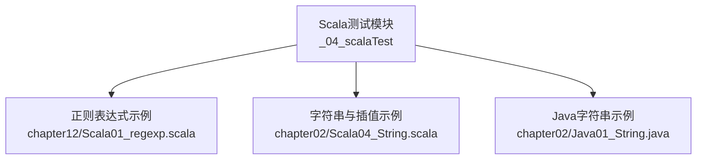
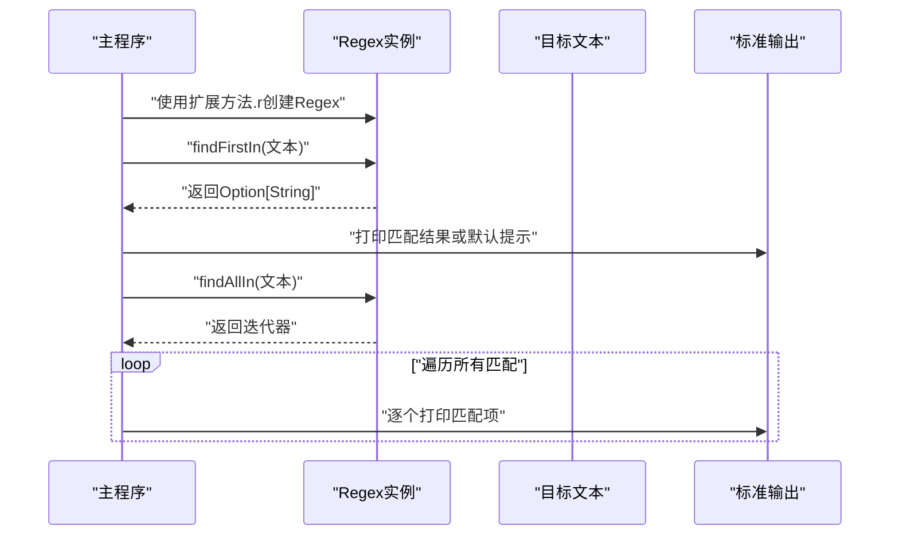
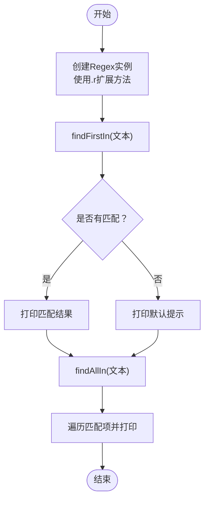
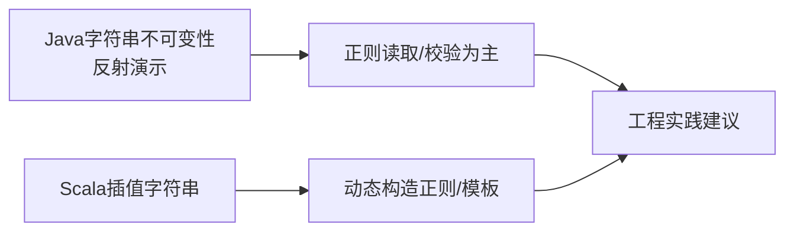
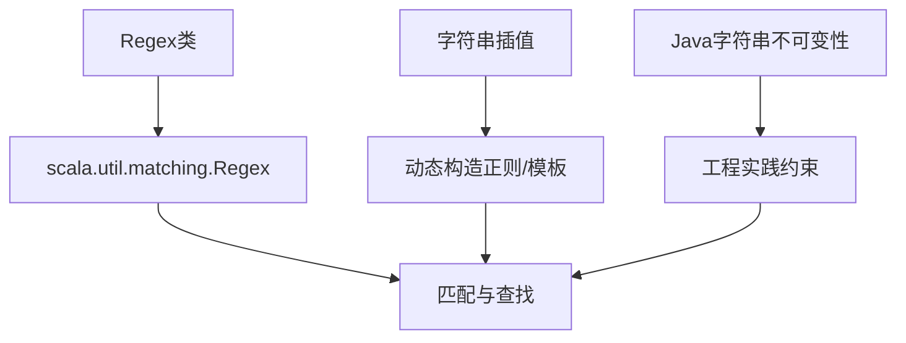

# 正则表达式

<cite>
**本文引用的文件**
- [Scala01_regexp.scala](file://_04_scalaTest/src/main/scala/com/atguigu/scala/chapter12/Scala01_regexp.scala)
- [Scala04_String.scala](file://_04_scalaTest/src/main/scala/com/atguigu/scala/chapter02/Scala04_String.scala)
- [Java01_String.java](file://_04_scalaTest/src/main/java/com/atguigu/java/chapter02/Java01_String.java)
</cite>

## 目录
1. [引言](#引言)
2. [项目结构](#项目结构)
3. [核心组件](#核心组件)
4. [架构总览](#架构总览)
5. [详细组件分析](#详细组件分析)
6. [依赖分析](#依赖分析)
7. [性能考虑](#性能考虑)
8. [故障排查指南](#故障排查指南)
9. [结论](#结论)
10. [附录](#附录)

## 引言
本文件围绕Scala中的正则表达式展开，结合仓库中的示例，系统讲解Regex类的创建与使用、常见语法（字符类、量词、分组、锚点等）、匹配与查找操作（findFirstIn、findAllIn）、以及在实际场景中的应用思路。同时，通过与Java字符串处理的对比，帮助读者理解Scala正则表达式在工程实践中的定位与优势。

## 项目结构
本次文档聚焦于Scala章节中的正则表达式示例文件，该文件位于Scala测试模块中，便于学习与演示。此外，还参考了字符串与插值字符串的示例，以说明正则表达式与字符串处理的衔接。



**图示来源**
- [Scala01_regexp.scala](file://_04_scalaTest/src/main/scala/com/atguigu/scala/chapter12/Scala01_regexp.scala#L1-L50)
- [Scala04_String.scala](file://_04_scalaTest/src/main/scala/com/atguigu/scala/chapter02/Scala04_String.scala#L1-L58)
- [Java01_String.java](file://_04_scalaTest/src/main/java/com/atguigu/java/chapter02/Java01_String.java#L1-L46)

**章节来源**
- [Scala01_regexp.scala](file://_04_scalaTest/src/main/scala/com/atguigu/scala/chapter12/Scala01_regexp.scala#L1-L50)

## 核心组件
- Regex类与导入
  - 示例通过导入scala.util.matching.Regex来使用正则表达式能力。
  - 使用扩展方法.r将字符串转换为Regex实例，便于后续匹配与查找。
- 基本匹配与查找
  - findFirstIn用于返回第一个匹配项的Option[String]。
  - findAllIn返回Regex.MatchIterator，可遍历所有匹配项。
- 实战示例
  - 字符串中查找固定模式的片段。
  - 使用手机号规则进行匹配校验。

上述用法在示例文件中有明确体现，适合初学者快速上手。

**章节来源**
- [Scala01_regexp.scala](file://_04_scalaTest/src/main/scala/com/atguigu/scala/chapter12/Scala01_regexp.scala#L1-L50)

## 架构总览
下图展示了正则表达式在示例程序中的运行流程：从定义正则到执行匹配与输出结果。



**图示来源**
- [Scala01_regexp.scala](file://_04_scalaTest/src/main/scala/com/atguigu/scala/chapter12/Scala01_regexp.scala#L24-L47)

## 详细组件分析

### 组件A：Regex类与基本匹配
- 创建Regex
  - 使用字符串.r扩展方法创建Regex实例，随后可直接调用匹配与查找方法。
- 匹配操作
  - findFirstIn：返回第一个匹配项的Option[String]，若无匹配则为None。
  - findAllIn：返回Regex.MatchIterator，支持foreach遍历所有匹配。
- 实际应用
  - 在示例中，先对一段文本执行查找，再对手机号字符串进行规则匹配，体现了“文本检索”和“数据校验”的典型场景。



**图示来源**
- [Scala01_regexp.scala](file://_04_scalaTest/src/main/scala/com/atguigu/scala/chapter12/Scala01_regexp.scala#L24-L47)

**章节来源**
- [Scala01_regexp.scala](file://_04_scalaTest/src/main/scala/com/atguigu/scala/chapter12/Scala01_regexp.scala#L24-L47)

### 组件B：正则语法与示例对照
- 常用元字符与语法要点（来自示例注释）
  - 锚点：^（行首）、$（行尾）
  - 通配：.（任意字符）
  - 量词：*（0次或多次）、+（1次或多次）、?（0次或1次）
  - 字符类：[]（范围与枚举）
  - 量词限定：{}（精确次数或范围）
  - 选择：|（逻辑或）
- 示例中的模式
  - "[s|S]{2}cala"：匹配大小写不敏感的“ss/SS/...cala”片段。
  - "^((13[0-9])|(18[^4]))[0-9]{8}$"：基于范围与否定类的手机号规则校验。
- 与字符串插值的结合
  - 在Scala中，字符串插值可用于动态构造正则表达式（如将变量嵌入到模式中），从而实现灵活的匹配策略。

```mermaid
flowchart TD
A["正则语法要点"] --> B["锚点与通配<br/>^ $ ."]
A --> C["量词与字符类<br/>* + ? [] {}"]
A --> D["选择与组合<br/>|"]
E["示例模式"] --> F["片段匹配<br/>\"[s|S]...cala\""]
E --> G["手机号规则<br/>\"^((13[0-9])|(18[^4]))[0-9]{8}$\""]
H["字符串插值"] --> I["动态构造正则"]
F --> I
G --> I
```

**图示来源**
- [Scala01_regexp.scala](file://_04_scalaTest/src/main/scala/com/atguigu/scala/chapter12/Scala01_regexp.scala#L11-L22)
- [Scala01_regexp.scala](file://_04_scalaTest/src/main/scala/com/atguigu/scala/chapter12/Scala01_regexp.scala#L24-L47)
- [Scala04_String.scala](file://_04_scalaTest/src/main/scala/com/atguigu/scala/chapter02/Scala04_String.scala#L28-L31)

**章节来源**
- [Scala01_regexp.scala](file://_04_scalaTest/src/main/scala/com/atguigu/scala/chapter12/Scala01_regexp.scala#L11-L22)
- [Scala01_regexp.scala](file://_04_scalaTest/src/main/scala/com/atguigu/scala/chapter12/Scala01_regexp.scala#L24-L47)
- [Scala04_String.scala](file://_04_scalaTest/src/main/scala/com/atguigu/scala/chapter02/Scala04_String.scala#L28-L31)

### 组件C：与Java字符串处理的对比
- 不可变性与反射演示
  - Java侧示例展示了字符串不可变性与反射修改内部字段的行为，强调了字符串对象的“只读”本质。
- 与正则的关系
  - 正则表达式通常用于“读取/解析/校验”，而非修改原始字符串；这与Java字符串不可变性的思想一致。
- Scala插值字符串
  - 通过s"..."等插值方式，可在构建正则表达式或替换模板时更自然地拼接变量，提升可读性与安全性。



**图示来源**
- [Java01_String.java](file://_04_scalaTest/src/main/java/com/atguigu/java/chapter02/Java01_String.java#L12-L45)
- [Scala04_String.scala](file://_04_scalaTest/src/main/scala/com/atguigu/scala/chapter02/Scala04_String.scala#L28-L31)

**章节来源**
- [Java01_String.java](file://_04_scalaTest/src/main/java/com/atguigu/java/chapter02/Java01_String.java#L12-L45)
- [Scala04_String.scala](file://_04_scalaTest/src/main/scala/com/atguigu/scala/chapter02/Scala04_String.scala#L28-L31)

## 依赖分析
- 直接依赖
  - 示例依赖scala.util.matching.Regex，用于正则匹配与查找。
- 间接关联
  - 字符串插值与正则表达式结合，常用于动态生成规则或替换模板。
  - Java侧字符串不可变性示例，有助于理解正则“只读”处理文本的合理性。



**图示来源**
- [Scala01_regexp.scala](file://_04_scalaTest/src/main/scala/com/atguigu/scala/chapter12/Scala01_regexp.scala#L24-L47)
- [Scala04_String.scala](file://_04_scalaTest/src/main/scala/com/atguigu/scala/chapter02/Scala04_String.scala#L28-L31)
- [Java01_String.java](file://_04_scalaTest/src/main/java/com/atguigu/java/chapter02/Java01_String.java#L12-L45)

**章节来源**
- [Scala01_regexp.scala](file://_04_scalaTest/src/main/scala/com/atguigu/scala/chapter12/Scala01_regexp.scala#L24-L47)
- [Scala04_String.scala](file://_04_scalaTest/src/main/scala/com/atguigu/scala/chapter02/Scala04_String.scala#L28-L31)
- [Java01_String.java](file://_04_scalaTest/src/main/java/com/atguigu/java/chapter02/Java01_String.java#L12-L45)

## 性能考虑
- 预编译正则
  - 对重复使用的复杂模式，建议在作用域内预编译Regex，避免每次匹配都重新解析模式。
- 迭代器与惰性
  - findAllIn返回迭代器，按需消费，有助于减少一次性收集带来的内存压力。
- 模式优化
  - 尽量使用锚点（^/$）限定边界，减少回溯。
  - 使用非贪婪量词与字符类缩小匹配空间。
- 字符串插值与正则
  - 动态构造时注意转义特殊字符，避免意外的正则行为。

## 故障排查指南
- 无匹配或默认提示
  - 若findFirstIn返回None，检查锚点、字符类与量词是否与输入一致。
- 手机号规则不生效
  - 核对范围与否定类的组合，确保输入长度与字符集符合预期。
- 输出为空或异常
  - 确认输入文本编码与边界条件，必要时在构造正则前进行清洗与断言。

## 结论
本仓库中的正则表达式示例清晰展示了Regex的基本用法：从创建、匹配到查找的完整流程，并通过手机号规则演示了实际业务校验场景。结合Scala插值字符串与Java字符串不可变性示例，可以更好地理解正则在工程中的定位与最佳实践。建议在生产环境中配合预编译、边界限定与模式优化，以获得更高的稳定性与性能。

## 附录
- 常用语法要点（来自示例注释）
  - 锚点：^（行首）、$（行尾）
  - 通配：.（任意字符）
  - 量词：*（0次或多次）、+（1次或多次）、?（0次或1次）
  - 字符类：[]（范围与枚举）
  - 量词限定：{}（精确次数或范围）
  - 选择：|（逻辑或）

**章节来源**
- [Scala01_regexp.scala](file://_04_scalaTest/src/main/scala/com/atguigu/scala/chapter12/Scala01_regexp.scala#L11-L22)