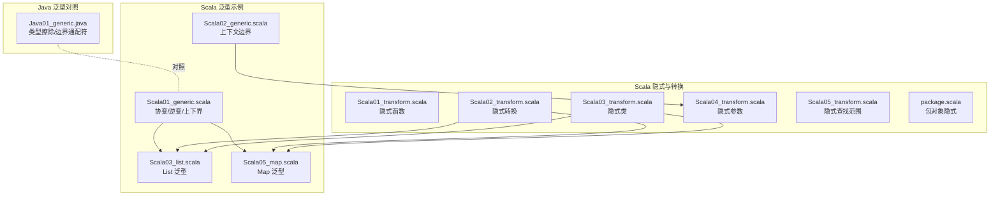
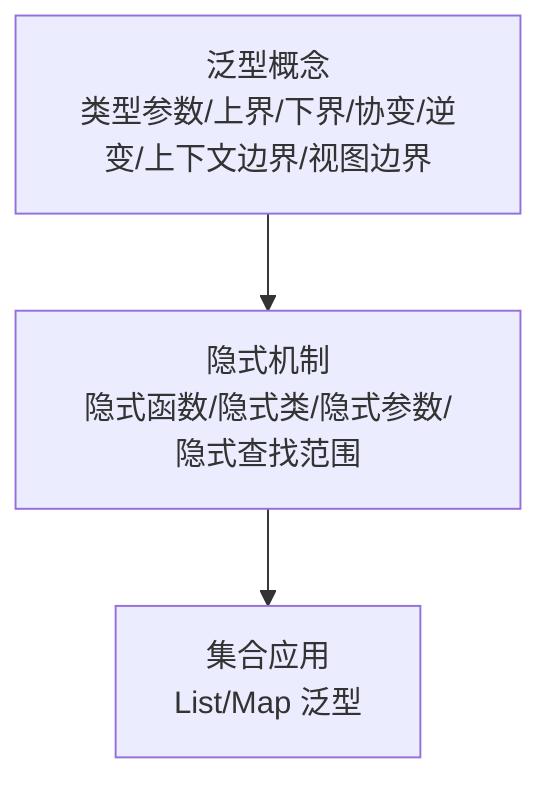
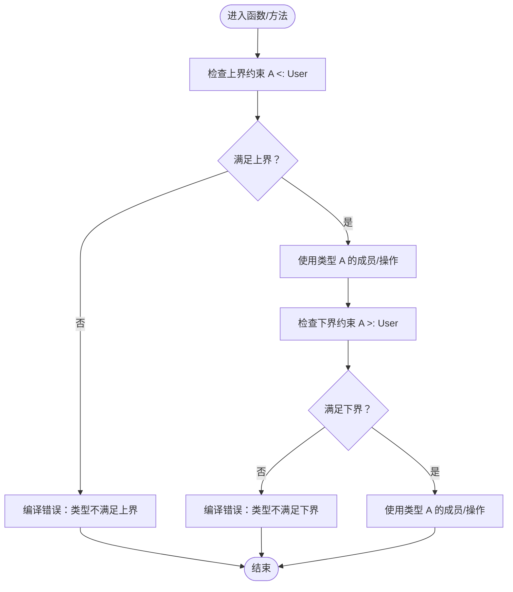
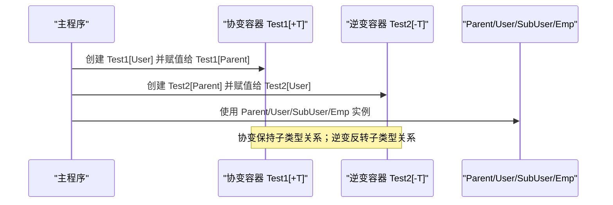
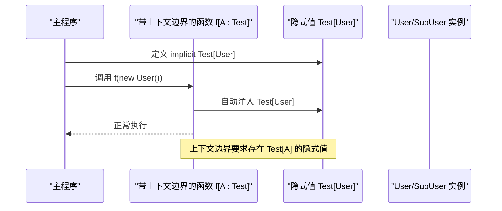
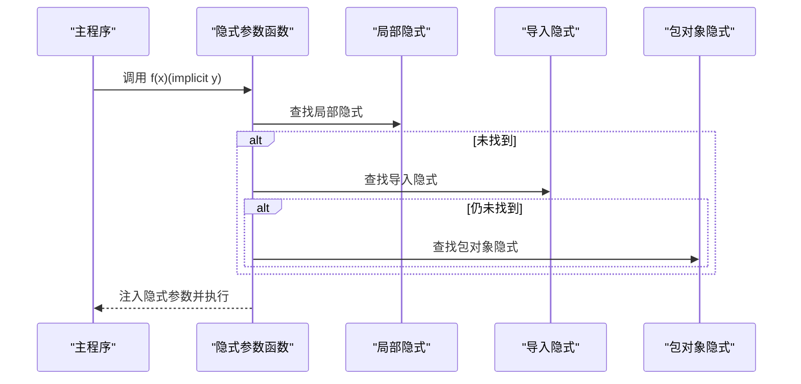
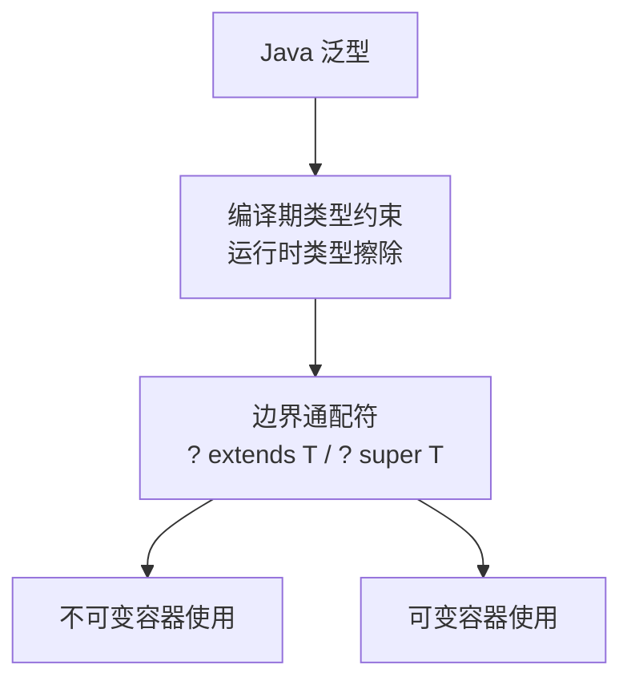
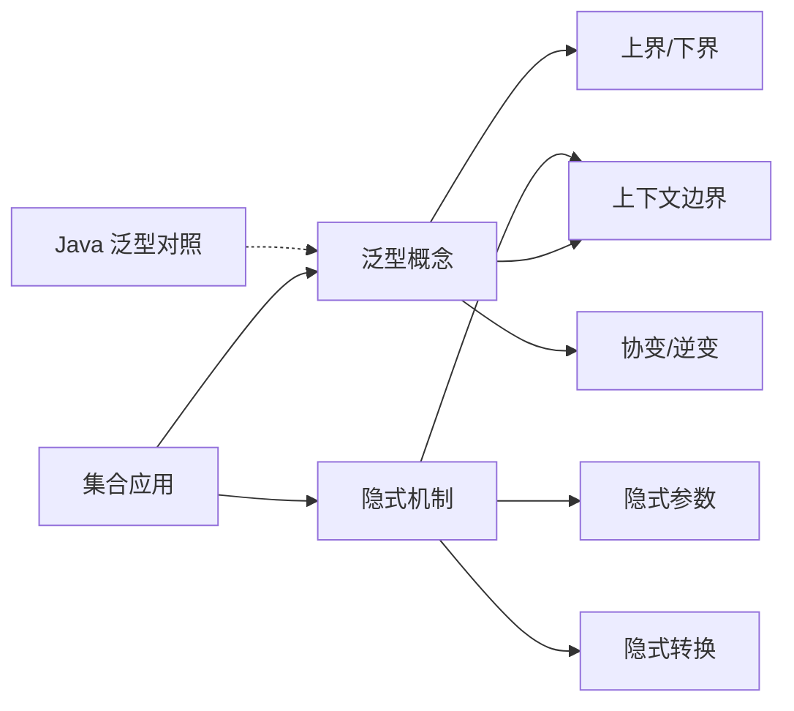

# 泛型编程

<cite>
**本文引用的文件**
- [Scala01_generic.scala](file://_04_scalaTest/src/main/scala/com/atguigu/scala/chapter11/Scala01_generic.scala)
- [Scala02_generic.scala](file://_04_scalaTest/src/main/scala/com/atguigu/scala/chapter11/Scala02_generic.scala)
- [Java01_generic.java](file://_04_scalaTest/src/main/java/com/atguigu/java/chapter11/Java01_generic.java)
- [Scala03_list.scala](file://_04_scalaTest/src/main/scala/com/atguigu/scala/chapter07/Scala03_list.scala)
- [Scala05_map.scala](file://_04_scalaTest/src/main/scala/com/atguigu/scala/chapter07/Scala05_map.scala)
- [Scala01_transform.scala](file://_04_scalaTest/src/main/scala/com/atguigu/scala/chapter10/Scala01_transform.scala)
- [Scala02_transform.scala](file://_04_scalaTest/src/main/scala/com/atguigu/scala/chapter10/Scala02_transform.scala)
- [Scala03_transform.scala](file://_04_scalaTest/src/main/scala/com/atguigu/scala/chapter10/Scala03_transform.scala)
- [Scala04_transform.scala](file://_04_scalaTest/src/main/scala/com/atguigu/scala/chapter10/Scala04_transform.scala)
- [Scala05_transform.scala](file://_04_scalaTest/src/main/scala/com/atguigu/scala/chapter10/Scala05_transform.scala)
- [package.scala](file://_04_scalaTest/src/main/scala/com/atguigu/scala/chapter10/package.scala)
- [Scala12_function.scala](file://_04_scalaTest/src/main/scala/com/atguigu/scala/chapter05/Scala12_function.scala)
</cite>

## 目录
1. [引言](#引言)
2. [项目结构](#项目结构)
3. [核心组件](#核心组件)
4. [架构总览](#架构总览)
5. [详细组件分析](#详细组件分析)
6. [依赖关系分析](#依赖关系分析)
7. [性能考量](#性能考量)
8. [故障排查指南](#故障排查指南)
9. [结论](#结论)
10. [附录](#附录)

## 引言
本文件围绕Scala泛型编程展开，系统梳理类型参数、类型变量、上界与下界、协变与逆变、上下文边界与视图边界、隐式参数与隐式转换等关键概念，并结合仓库中的示例文件，给出从基础到进阶的实践路径。同时，对比Java泛型的类型擦除与边界通配符，帮助读者建立完整的类型系统认知。

## 项目结构
本仓库中与泛型直接相关的内容主要集中在Scala章节的“泛型”和“隐式转换/参数”两部分，以及Java章节的“泛型”。集合操作示例位于“集合”章节，便于理解泛型在集合中的应用。



图表来源
- [Scala01_generic.scala](file://_04_scalaTest/src/main/scala/com/atguigu/scala/chapter11/Scala01_generic.scala#L1-L94)
- [Scala02_generic.scala](file://_04_scalaTest/src/main/scala/com/atguigu/scala/chapter11/Scala02_generic.scala#L1-L31)
- [Scala03_list.scala](file://_04_scalaTest/src/main/scala/com/atguigu/scala/chapter07/Scala03_list.scala#L1-L61)
- [Scala05_map.scala](file://_04_scalaTest/src/main/scala/com/atguigu/scala/chapter07/Scala05_map.scala#L1-L89)
- [Scala01_transform.scala](file://_04_scalaTest/src/main/scala/com/atguigu/scala/chapter10/Scala01_transform.scala#L1-L36)
- [Scala02_transform.scala](file://_04_scalaTest/src/main/scala/com/atguigu/scala/chapter10/Scala02_transform.scala#L1-L60)
- [Scala03_transform.scala](file://_04_scalaTest/src/main/scala/com/atguigu/scala/chapter10/Scala03_transform.scala#L1-L49)
- [Scala04_transform.scala](file://_04_scalaTest/src/main/scala/com/atguigu/scala/chapter10/Scala04_transform.scala#L1-L52)
- [Scala05_transform.scala](file://_04_scalaTest/src/main/scala/com/atguigu/scala/chapter10/Scala05_transform.scala#L1-L46)
- [package.scala](file://_04_scalaTest/src/main/scala/com/atguigu/scala/chapter10/package.scala#L1-L9)
- [Java01_generic.java](file://_04_scalaTest/src/main/java/com/atguigu/java/chapter11/Java01_generic.java#L1-L128)

章节来源
- [Scala01_generic.scala](file://_04_scalaTest/src/main/scala/com/atguigu/scala/chapter11/Scala01_generic.scala#L1-L94)
- [Scala02_generic.scala](file://_04_scalaTest/src/main/scala/com/atguigu/scala/chapter11/Scala02_generic.scala#L1-L31)
- [Java01_generic.java](file://_04_scalaTest/src/main/java/com/atguigu/java/chapter11/Java01_generic.java#L1-L128)

## 核心组件
- 类型参数与类型变量：在类、对象、函数中定义形如[A]、[B]的类型参数，用于表达“未确定的具体类型”，并在使用处以实参形式传入具体类型。
- 上界与下界：使用[A <: T]限制类型参数必须是T或其子类型；使用[A >: T]限制类型参数必须是T或其父类型。
- 协变与逆变：在类型参数位置使用+T实现协变（子类型关系保持），使用-T实现逆变（子类型关系反转）。
- 上下文边界：使用[A : C]表达“存在隐式值C[A]”，常用于约束类型具备某种能力（如可比较、可序列化等）。
- 视图边界：旧式写法[A <% T]，表示可通过隐式转换将A视作T；在现代Scala中更推荐使用上下文边界。
- 隐式参数与隐式转换：通过implicit关键字声明隐式值，让编译器在调用点自动注入参数或进行类型转换，提升API可用性与表达力。

章节来源
- [Scala01_generic.scala](file://_04_scalaTest/src/main/scala/com/atguigu/scala/chapter11/Scala01_generic.scala#L1-L94)
- [Scala02_generic.scala](file://_04_scalaTest/src/main/scala/com/atguigu/scala/chapter11/Scala02_generic.scala#L1-L31)
- [Scala01_transform.scala](file://_04_scalaTest/src/main/scala/com/atguigu/scala/chapter10/Scala01_transform.scala#L1-L36)
- [Scala02_transform.scala](file://_04_scalaTest/src/main/scala/com/atguigu/scala/chapter10/Scala02_transform.scala#L1-L60)
- [Scala03_transform.scala](file://_04_scalaTest/src/main/scala/com/atguigu/scala/chapter10/Scala03_transform.scala#L1-L49)
- [Scala04_transform.scala](file://_04_scalaTest/src/main/scala/com/atguigu/scala/chapter10/Scala04_transform.scala#L1-L52)
- [Scala05_transform.scala](file://_04_scalaTest/src/main/scala/com/atguigu/scala/chapter10/Scala05_transform.scala#L1-L46)
- [package.scala](file://_04_scalaTest/src/main/scala/com/atguigu/scala/chapter10/package.scala#L1-L9)

## 架构总览
下图展示了“泛型概念—隐式机制—集合应用”的整体关系：泛型提供类型抽象，隐式机制提供自动注入与类型转换，集合示例体现泛型的实际落地。



图表来源
- [Scala01_generic.scala](file://_04_scalaTest/src/main/scala/com/atguigu/scala/chapter11/Scala01_generic.scala#L1-L94)
- [Scala02_generic.scala](file://_04_scalaTest/src/main/scala/com/atguigu/scala/chapter11/Scala02_generic.scala#L1-L31)
- [Scala01_transform.scala](file://_04_scalaTest/src/main/scala/com/atguigu/scala/chapter10/Scala01_transform.scala#L1-L36)
- [Scala02_transform.scala](file://_04_scalaTest/src/main/scala/com/atguigu/scala/chapter10/Scala02_transform.scala#L1-L60)
- [Scala03_transform.scala](file://_04_scalaTest/src/main/scala/com/atguigu/scala/chapter10/Scala03_transform.scala#L1-L49)
- [Scala04_transform.scala](file://_04_scalaTest/src/main/scala/com/atguigu/scala/chapter10/Scala04_transform.scala#L1-L52)
- [Scala05_transform.scala](file://_04_scalaTest/src/main/scala/com/atguigu/scala/chapter10/Scala05_transform.scala#L1-L46)
- [package.scala](file://_04_scalaTest/src/main/scala/com/atguigu/scala/chapter10/package.scala#L1-L9)
- [Scala03_list.scala](file://_04_scalaTest/src/main/scala/com/atguigu/scala/chapter07/Scala03_list.scala#L1-L61)
- [Scala05_map.scala](file://_04_scalaTest/src/main/scala/com/atguigu/scala/chapter07/Scala05_map.scala#L1-L89)

## 详细组件分析

### 组件A：类型参数、上界与下界
- 类型参数：在类/函数中定义形如[A]的类型参数，使用时以实参形式传入具体类型。
- 上界[A <: T]：要求类型参数是T或其子类型，常用于限制可使用的成员或操作。
- 下界[A >: T]：要求类型参数是T或其父类型，常用于接受更宽泛的父类型。



图表来源
- [Scala01_generic.scala](file://_04_scalaTest/src/main/scala/com/atguigu/scala/chapter11/Scala01_generic.scala#L59-L66)

章节来源
- [Scala01_generic.scala](file://_04_scalaTest/src/main/scala/com/atguigu/scala/chapter11/Scala01_generic.scala#L1-L94)

### 组件B：协变与逆变
- 协变[+T]：允许将子类型实例赋给父类型参数位置的容器，体现“子类型关系保持”。
- 逆变[-T]：允许将父类型实例赋给子类型参数位置的容器，体现“子类型关系反转”。



图表来源
- [Scala01_generic.scala](file://_04_scalaTest/src/main/scala/com/atguigu/scala/chapter11/Scala01_generic.scala#L15-L30)

章节来源
- [Scala01_generic.scala](file://_04_scalaTest/src/main/scala/com/atguigu/scala/chapter11/Scala01_generic.scala#L1-L94)

### 组件C：上下文边界与视图边界
- 上下文边界[A : C]：要求存在隐式值C[A]，常用于表达“类型具备某能力”（如可比较、可序列化等）。
- 视图边界[A <% T]：旧式写法，表示可通过隐式转换将A视作T；现代更推荐上下文边界。



图表来源
- [Scala02_generic.scala](file://_04_scalaTest/src/main/scala/com/atguigu/scala/chapter11/Scala02_generic.scala#L8-L18)

章节来源
- [Scala02_generic.scala](file://_04_scalaTest/src/main/scala/com/atguigu/scala/chapter11/Scala02_generic.scala#L1-L31)

### 组件D：隐式参数与隐式转换
- 隐式参数：在函数参数列表中使用implicit修饰，调用时由编译器自动查找并注入。
- 隐式转换：通过implicit函数或隐式类，将一种类型自动转换为另一种类型，增强API可用性。
- 隐式查找范围：局部定义、导入、包对象等作用域内的隐式值均可能被编译器发现。



图表来源
- [Scala04_transform.scala](file://_04_scalaTest/src/main/scala/com/atguigu/scala/chapter10/Scala04_transform.scala#L1-L52)
- [Scala05_transform.scala](file://_04_scalaTest/src/main/scala/com/atguigu/scala/chapter10/Scala05_transform.scala#L1-L46)
- [package.scala](file://_04_scalaTest/src/main/scala/com/atguigu/scala/chapter10/package.scala#L1-L9)

章节来源
- [Scala01_transform.scala](file://_04_scalaTest/src/main/scala/com/atguigu/scala/chapter10/Scala01_transform.scala#L1-L36)
- [Scala02_transform.scala](file://_04_scalaTest/src/main/scala/com/atguigu/scala/chapter10/Scala02_transform.scala#L1-L60)
- [Scala03_transform.scala](file://_04_scalaTest/src/main/scala/com/atguigu/scala/chapter10/Scala03_transform.scala#L1-L49)
- [Scala04_transform.scala](file://_04_scalaTest/src/main/scala/com/atguigu/scala/chapter10/Scala04_transform.scala#L1-L52)
- [Scala05_transform.scala](file://_04_scalaTest/src/main/scala/com/atguigu/scala/chapter10/Scala05_transform.scala#L1-L46)
- [package.scala](file://_04_scalaTest/src/main/scala/com/atguigu/scala/chapter10/package.scala#L1-L9)

### 组件E：泛型在集合中的应用
- List 泛型：演示不可变List与可变ListBuffer的创建、元素操作与相互转换。
- Map 泛型：演示不可变Map与可变Map的创建、增删改查、键值迭代与与其他集合的转换。

```mermaid
classDiagram
class T[] {
+apply(index) : T
+ : +(elements) : T[]
+ : : (head) : T[]
+ : : : (other) : T[]
+toList() : T[]
}
class Map~K,V~ {
+apply(key) : V
+get(key) : Option~V~
+put(k,v) : Unit
+remove(k) : Unit
+keys : Iterable~K~
+values : Iterable~V~
+keysIterator : Iterator~K~
+valuesIterator : Iterator~V~
+toArray() : (K,V)[]
+toList() : (K,V)[]
+toSet() : Set~(K,V)~
}
class ListBuffer~T~ {
+append(elems) : Unit
+remove(idx) : Unit
+toList() : T[]
}
T[] <.. ListBuffer~T~ : "相互转换"
Map~K,V~ <.. (K,V)[] : "toSet/toArray/toList"
```

图表来源
- [Scala03_list.scala](file://_04_scalaTest/src/main/scala/com/atguigu/scala/chapter07/Scala03_list.scala#L1-L61)
- [Scala05_map.scala](file://_04_scalaTest/src/main/scala/com/atguigu/scala/chapter07/Scala05_map.scala#L1-L89)

章节来源
- [Scala03_list.scala](file://_04_scalaTest/src/main/scala/com/atguigu/scala/chapter07/Scala03_list.scala#L1-L61)
- [Scala05_map.scala](file://_04_scalaTest/src/main/scala/com/atguigu/scala/chapter07/Scala05_map.scala#L1-L89)

### 组件F：Java泛型对照
- 类型擦除：Java泛型在运行时仅保留声明类型信息，编译期约束类型安全。
- 边界通配符：使用? extends T与? super T表达上界与下界，配合不可变/可变容器使用。



图表来源
- [Java01_generic.java](file://_04_scalaTest/src/main/java/com/atguigu/java/chapter11/Java01_generic.java#L35-L106)

章节来源
- [Java01_generic.java](file://_04_scalaTest/src/main/java/com/atguigu/java/chapter11/Java01_generic.java#L1-L128)

## 依赖关系分析
- 泛型与隐式的关系：上下文边界[A : C]依赖于存在隐式值C[A]；隐式参数在调用点由编译器自动注入。
- 隐式转换与集合：隐式转换可将原始类型扩展为具备额外方法的对象，从而在集合操作中获得更丰富的API体验。
- Java对照：Java的边界通配符与Scala的上界/下界在语义上相似，但Scala的类型系统在编译期提供了更强的静态约束与表达力。



图表来源
- [Scala01_generic.scala](file://_04_scalaTest/src/main/scala/com/atguigu/scala/chapter11/Scala01_generic.scala#L1-L94)
- [Scala02_generic.scala](file://_04_scalaTest/src/main/scala/com/atguigu/scala/chapter11/Scala02_generic.scala#L1-L31)
- [Scala01_transform.scala](file://_04_scalaTest/src/main/scala/com/atguigu/scala/chapter10/Scala01_transform.scala#L1-L36)
- [Scala02_transform.scala](file://_04_scalaTest/src/main/scala/com/atguigu/scala/chapter10/Scala02_transform.scala#L1-L60)
- [Scala03_list.scala](file://_04_scalaTest/src/main/scala/com/atguigu/scala/chapter07/Scala03_list.scala#L1-L61)
- [Scala05_map.scala](file://_04_scalaTest/src/main/scala/com/atguigu/scala/chapter07/Scala05_map.scala#L1-L89)
- [Java01_generic.java](file://_04_scalaTest/src/main/java/com/atguigu/java/chapter11/Java01_generic.java#L1-L128)

章节来源
- [Scala01_generic.scala](file://_04_scalaTest/src/main/scala/com/atguigu/scala/chapter11/Scala01_generic.scala#L1-L94)
- [Scala02_generic.scala](file://_04_scalaTest/src/main/scala/com/atguigu/scala/chapter11/Scala02_generic.scala#L1-L31)
- [Scala01_transform.scala](file://_04_scalaTest/src/main/scala/com/atguigu/scala/chapter10/Scala01_transform.scala#L1-L36)
- [Scala02_transform.scala](file://_04_scalaTest/src/main/scala/com/atguigu/scala/chapter10/Scala02_transform.scala#L1-L60)
- [Scala03_list.scala](file://_04_scalaTest/src/main/scala/com/atguigu/scala/chapter07/Scala03_list.scala#L1-L61)
- [Scala05_map.scala](file://_04_scalaTest/src/main/scala/com/atguigu/scala/chapter07/Scala05_map.scala#L1-L89)
- [Java01_generic.java](file://_04_scalaTest/src/main/java/com/atguigu/java/chapter11/Java01_generic.java#L1-L128)

## 性能考量
- 类型擦除与运行时成本：Java泛型在运行时存在类型擦除，可能导致运行时类型检查与装箱拆箱开销；Scala泛型在编译期提供更强约束，通常避免了不必要的装箱。
- 集合操作的复杂度：List与Map的常见操作（增删改查、迭代、转换）在Scala集合库中有明确的时间复杂度约定，合理选择集合类型与操作组合可降低时间与空间开销。
- 隐式查找的成本：隐式参数与隐式转换的查找发生在编译期，运行时不会产生额外开销；但在复杂作用域内查找可能增加编译时间，应避免过度嵌套与歧义。

## 故障排查指南
- 上下文边界未找到隐式值：当使用[A : C]时，若编译器无法在当前作用域找到C[A]的隐式值，将报错。请检查是否在正确的作用域定义了隐式值，或是否遗漏了必要的导入。
- 隐式冲突与歧义：当同一作用域存在多个匹配的隐式值时，编译器无法确定选用哪一个，会报歧义错误。请精简作用域内的隐式定义或调整可见性。
- 协变/逆变使用不当：在协变容器中误用父类型，在逆变容器中误用子类型会导致编译错误。请根据容器的变型标记与类型层次关系正确使用。
- Java泛型边界通配符误用：在Java中，? extends T与? super T的使用需与容器的可变性相匹配，否则可能导致编译错误或运行时异常。

章节来源
- [Scala02_generic.scala](file://_04_scalaTest/src/main/scala/com/atguigu/scala/chapter11/Scala02_generic.scala#L8-L18)
- [Scala04_transform.scala](file://_04_scalaTest/src/main/scala/com/atguigu/scala/chapter10/Scala04_transform.scala#L1-L52)
- [Scala05_transform.scala](file://_04_scalaTest/src/main/scala/com/atguigu/scala/chapter10/Scala05_transform.scala#L1-L46)
- [Java01_generic.java](file://_04_scalaTest/src/main/java/com/atguigu/java/chapter11/Java01_generic.java#L35-L106)

## 结论
Scala泛型通过类型参数、上界/下界、协变/逆变与上下文边界等机制，提供了强大的类型抽象能力；配合隐式参数与隐式转换，进一步提升了API的可用性与表达力。与Java泛型相比，Scala在编译期的静态约束更严格，且在集合与函数式编程场景中提供了更丰富的工具。建议在实际开发中优先使用上下文边界替代视图边界，并谨慎使用隐式，确保代码清晰可维护。

## 附录
- 相关示例文件路径参考：
  - [Scala01_generic.scala](file://_04_scalaTest/src/main/scala/com/atguigu/scala/chapter11/Scala01_generic.scala#L1-L94)
  - [Scala02_generic.scala](file://_04_scalaTest/src/main/scala/com/atguigu/scala/chapter11/Scala02_generic.scala#L1-L31)
  - [Java01_generic.java](file://_04_scalaTest/src/main/java/com/atguigu/java/chapter11/Java01_generic.java#L1-L128)
  - [Scala03_list.scala](file://_04_scalaTest/src/main/scala/com/atguigu/scala/chapter07/Scala03_list.scala#L1-L61)
  - [Scala05_map.scala](file://_04_scalaTest/src/main/scala/com/atguigu/scala/chapter07/Scala05_map.scala#L1-L89)
  - [Scala01_transform.scala](file://_04_scalaTest/src/main/scala/com/atguigu/scala/chapter10/Scala01_transform.scala#L1-L36)
  - [Scala02_transform.scala](file://_04_scalaTest/src/main/scala/com/atguigu/scala/chapter10/Scala02_transform.scala#L1-L60)
  - [Scala03_transform.scala](file://_04_scalaTest/src/main/scala/com/atguigu/scala/chapter10/Scala03_transform.scala#L1-L49)
  - [Scala04_transform.scala](file://_04_scalaTest/src/main/scala/com/atguigu/scala/chapter10/Scala04_transform.scala#L1-L52)
  - [Scala05_transform.scala](file://_04_scalaTest/src/main/scala/com/atguigu/scala/chapter10/Scala05_transform.scala#L1-L46)
  - [package.scala](file://_04_scalaTest/src/main/scala/com/atguigu/scala/chapter10/package.scala#L1-L9)
  - [Scala12_function.scala](file://_04_scalaTest/src/main/scala/com/atguigu/scala/chapter05/Scala12_function.scala#L1-L37)