# 集合操作

<cite>
**本文引用的文件**
- [Scala01_array.scala](file://_04_scalaTest/src/main/scala/com/atguigu/scala/chapter07/Scala01_array.scala)
- [Scala02_array.scala](file://_04_scalaTest/src/main/scala/com/atguigu/scala/chapter07/Scala02_array.scala)
- [Scala03_list.scala](file://_04_scalaTest/src/main/scala/com/atguigu/scala/chapter07/Scala03_list.scala)
- [Scala04_set.scala](file://_04_scalaTest/src/main/scala/com/atguigu/scala/chapter07/Scala04_set.scala)
- [Scala05_map.scala](file://_04_scalaTest/src/main/scala/com/atguigu/scala/chapter07/Scala05_map.scala)
- [Scala06_tuple.scala](file://_04_scalaTest/src/main/scala/com/atguigu/scala/chapter07/Scala06_tuple.scala)
- [Scala07_queue.scala](file://_04_scalaTest/src/main/scala/com/atguigu/scala/chapter07/Scala07_queue.scala)
- [Scala11_par.scala](file://_04_scalaTest/src/main/scala/com/atguigu/scala/chapter07/Scala11_par.scala)
- [Scala12_wordcount.scala](file://_04_scalaTest/src/main/scala/com/atguigu/scala/chapter07/Scala12_wordcount.scala)
</cite>

## 目录
1. [引言](#引言)
2. [项目结构](#项目结构)
3. [核心组件](#核心组件)
4. [架构总览](#架构总览)
5. [详细组件分析](#详细组件分析)
6. [依赖分析](#依赖分析)
7. [性能考虑](#性能考虑)
8. [故障排查指南](#故障排查指南)
9. [结论](#结论)
10. [附录](#附录)

## 引言
本文件围绕Scala集合操作展开，系统梳理不可变与可变集合的差异、数组、列表、集合、映射、元组、队列等常用集合类型的特性与用法；深入讲解高阶函数如map、filter、flatMap、fold/reduce等在集合上的典型应用；介绍并行集合par的使用与线程行为观察；通过WordCount等经典算法展示集合操作在实际项目中的落地方式；最后给出性能考量与最佳实践，并与Java集合进行对比，帮助读者高效、正确地使用Scala集合。

## 项目结构
本次文档聚焦于Scala集合示例代码，主要位于以下路径：
- chapter07：数组、列表、集合、映射、元组、队列、并行集合、WordCount等演示
- chapter10：隐式转换相关内容（与集合扩展能力相关）

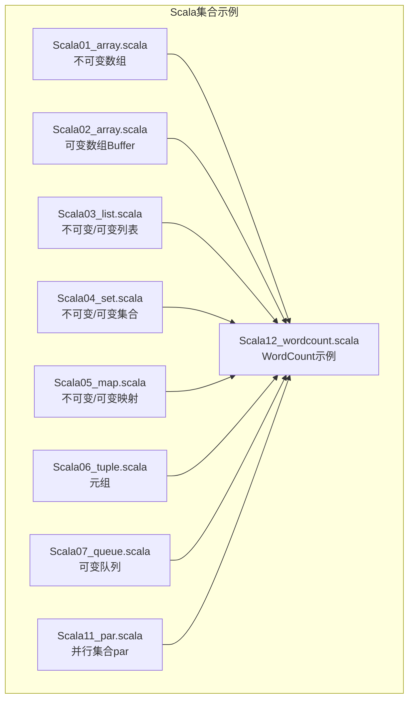

图表来源
- [Scala01_array.scala](file://_04_scalaTest/src/main/scala/com/atguigu/scala/chapter07/Scala01_array.scala#L1-L77)
- [Scala02_array.scala](file://_04_scalaTest/src/main/scala/com/atguigu/scala/chapter07/Scala02_array.scala#L1-L49)
- [Scala03_list.scala](file://_04_scalaTest/src/main/scala/com/atguigu/scala/chapter07/Scala03_list.scala#L1-L61)
- [Scala04_set.scala](file://_04_scalaTest/src/main/scala/com/atguigu/scala/chapter07/Scala04_set.scala#L1-L60)
- [Scala05_map.scala](file://_04_scalaTest/src/main/scala/com/atguigu/scala/chapter07/Scala05_map.scala#L1-L89)
- [Scala06_tuple.scala](file://_04_scalaTest/src/main/scala/com/atguigu/scala/chapter07/Scala06_tuple.scala#L1-L39)
- [Scala07_queue.scala](file://_04_scalaTest/src/main/scala/com/atguigu/scala/chapter07/Scala07_queue.scala#L1-L30)
- [Scala11_par.scala](file://_04_scalaTest/src/main/scala/com/atguigu/scala/chapter07/Scala11_par.scala#L1-L17)
- [Scala12_wordcount.scala](file://_04_scalaTest/src/main/scala/com/atguigu/scala/chapter07/Scala12_wordcount.scala#L1-L49)

章节来源
- [Scala01_array.scala](file://_04_scalaTest/src/main/scala/com/atguigu/scala/chapter07/Scala01_array.scala#L1-L77)
- [Scala02_array.scala](file://_04_scalaTest/src/main/scala/com/atguigu/scala/chapter07/Scala02_array.scala#L1-L49)
- [Scala03_list.scala](file://_04_scalaTest/src/main/scala/com/atguigu/scala/chapter07/Scala03_list.scala#L1-L61)
- [Scala04_set.scala](file://_04_scalaTest/src/main/scala/com/atguigu/scala/chapter07/Scala04_set.scala#L1-L60)
- [Scala05_map.scala](file://_04_scalaTest/src/main/scala/com/atguigu/scala/chapter07/Scala05_map.scala#L1-L89)
- [Scala06_tuple.scala](file://_04_scalaTest/src/main/scala/com/atguigu/scala/chapter07/Scala06_tuple.scala#L1-L39)
- [Scala07_queue.scala](file://_04_scalaTest/src/main/scala/com/atguigu/scala/chapter07/Scala07_queue.scala#L1-L30)
- [Scala11_par.scala](file://_04_scalaTest/src/main/scala/com/atguigu/scala/chapter07/Scala11_par.scala#L1-L17)
- [Scala12_wordcount.scala](file://_04_scalaTest/src/main/scala/com/atguigu/scala/chapter07/Scala12_wordcount.scala#L1-L49)

## 核心组件
- 不可变集合与可变集合
  - 不可变集合：一旦创建，其内容不可更改，适合并发安全与函数式编程风格
  - 可变集合：支持原地修改，适合需要频繁变更的场景
- 常用集合类型
  - 数组：定长或变长容器，支持索引访问与符号操作
  - 列表：链式结构，支持::与:::拼接
  - 集合：去重集合，支持交并差运算
  - 映射：键值对集合，支持getOrElse等安全访问
  - 元组：固定长度异构组合，常用于对偶
  - 队列：FIFO结构，支持入队出队
- 高阶函数
  - map：对每个元素进行变换
  - flatMap：先映射再展平
  - groupBy：按条件分组
  - sortBy/mapValues/take：排序与截断
- 并行集合
  - par：将集合切换为并行视图，底层由执行池调度
- 经典算法
  - WordCount：读取文本、切词、分组计数、排序取TopN

章节来源
- [Scala01_array.scala](file://_04_scalaTest/src/main/scala/com/atguigu/scala/chapter07/Scala01_array.scala#L1-L77)
- [Scala02_array.scala](file://_04_scalaTest/src/main/scala/com/atguigu/scala/chapter07/Scala02_array.scala#L1-L49)
- [Scala03_list.scala](file://_04_scalaTest/src/main/scala/com/atguigu/scala/chapter07/Scala03_list.scala#L1-L61)
- [Scala04_set.scala](file://_04_scalaTest/src/main/scala/com/atguigu/scala/chapter07/Scala04_set.scala#L1-L60)
- [Scala05_map.scala](file://_04_scalaTest/src/main/scala/com/atguigu/scala/chapter07/Scala05_map.scala#L1-L89)
- [Scala06_tuple.scala](file://_04_scalaTest/src/main/scala/com/atguigu/scala/chapter07/Scala06_tuple.scala#L1-L39)
- [Scala07_queue.scala](file://_04_scalaTest/src/main/scala/com/atguigu/scala/chapter07/Scala07_queue.scala#L1-L30)
- [Scala11_par.scala](file://_04_scalaTest/src/main/scala/com/atguigu/scala/chapter07/Scala11_par.scala#L1-L17)
- [Scala12_wordcount.scala](file://_04_scalaTest/src/main/scala/com/atguigu/scala/chapter07/Scala12_wordcount.scala#L1-L49)

## 架构总览
下图展示了集合示例之间的关系与数据流向，体现从基础集合到WordCount处理链路的组织方式。

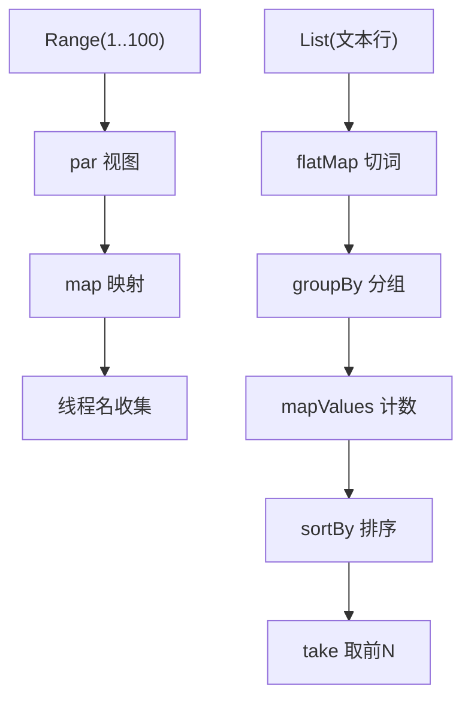

图表来源
- [Scala11_par.scala](file://_04_scalaTest/src/main/scala/com/atguigu/scala/chapter07/Scala11_par.scala#L1-L17)
- [Scala12_wordcount.scala](file://_04_scalaTest/src/main/scala/com/atguigu/scala/chapter07/Scala12_wordcount.scala#L1-L49)

## 详细组件分析

### 数组（Array）
- 不可变数组
  - 创建与更新：通过apply创建，支持update与索引赋值
  - 符号操作：+:（头部插入）、:+（尾部追加）
  - 多维数组与工具：ofDim、concat、range、fill
- 可变数组Buffer
  - 创建与更新：append、update、remove
  - 转换：toBuffer、toArray
- 性能与适用性
  - 不可变数组适合只读场景；可变数组适合频繁修改
  - 多维数组适合矩阵类计算；fill/range适合快速构造

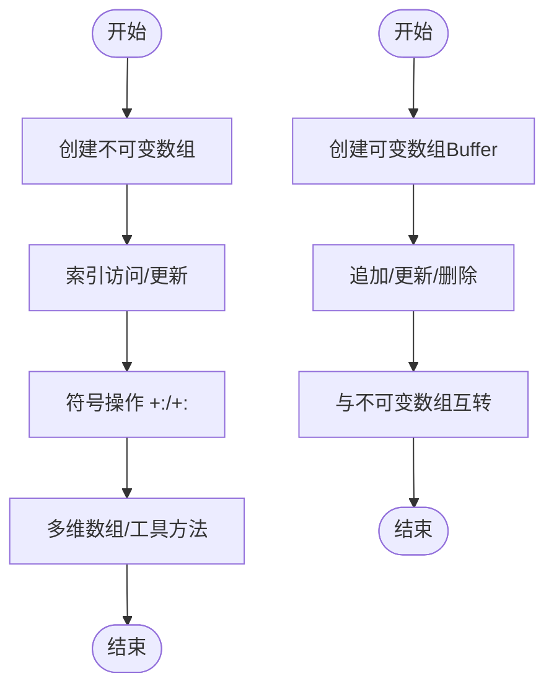

图表来源
- [Scala01_array.scala](file://_04_scalaTest/src/main/scala/com/atguigu/scala/chapter07/Scala01_array.scala#L1-L77)
- [Scala02_array.scala](file://_04_scalaTest/src/main/scala/com/atguigu/scala/chapter07/Scala02_array.scala#L1-L49)

章节来源
- [Scala01_array.scala](file://_04_scalaTest/src/main/scala/com/atguigu/scala/chapter07/Scala01_array.scala#L1-L77)
- [Scala02_array.scala](file://_04_scalaTest/src/main/scala/com/atguigu/scala/chapter07/Scala02_array.scala#L1-L49)

### 列表（List）
- 不可变列表
  - 创建与类型：List构造，查看运行时类型
- 可变列表Buffer
  - append/remove等原地修改
- 符号操作
  - ::（头插）、:::（整体拼接）
- 转换
  - toBuffer、toList

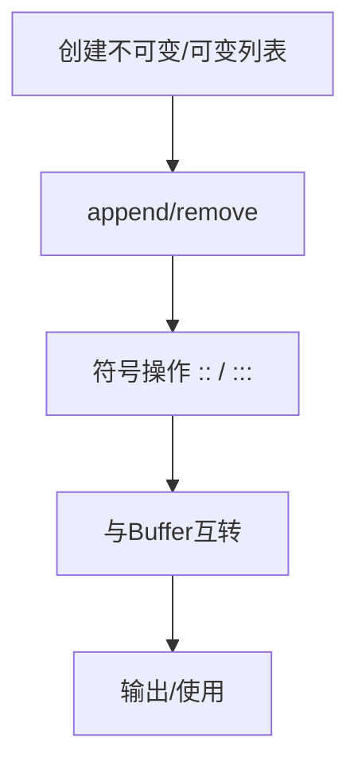

图表来源
- [Scala03_list.scala](file://_04_scalaTest/src/main/scala/com/atguigu/scala/chapter07/Scala03_list.scala#L1-L61)

章节来源
- [Scala03_list.scala](file://_04_scalaTest/src/main/scala/com/atguigu/scala/chapter07/Scala03_list.scala#L1-L61)

### 集合（Set）
- 不可变与可变集合
  - add/remove/update等原地修改
- 集合运算
  - 交集、差集（&、&~）

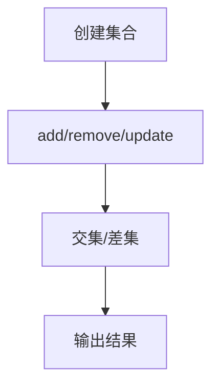

图表来源
- [Scala04_set.scala](file://_04_scalaTest/src/main/scala/com/atguigu/scala/chapter07/Scala04_set.scala#L1-L60)

章节来源
- [Scala04_set.scala](file://_04_scalaTest/src/main/scala/com/atguigu/scala/chapter07/Scala04_set.scala#L1-L60)

### 映射（Map）
- 不可变与可变映射
  - put/remove/update等
- 安全访问
  - apply/get/getOrElse
- 转换
  - toArray/toList/toSet
- 迭代
  - keys/values/遍历键值对

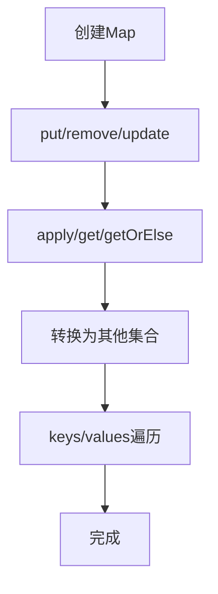

图表来源
- [Scala05_map.scala](file://_04_scalaTest/src/main/scala/com/atguigu/scala/chapter07/Scala05_map.scala#L1-L89)

章节来源
- [Scala05_map.scala](file://_04_scalaTest/src/main/scala/com/atguigu/scala/chapter07/Scala05_map.scala#L1-L89)

### 元组（Tuple）
- 定义与访问：位置访问（_1/_2/...），productElement
- 与Map的关系：Map的键值对本质是对偶元组

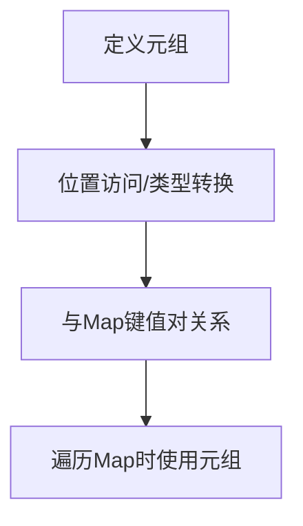

图表来源
- [Scala06_tuple.scala](file://_04_scalaTest/src/main/scala/com/atguigu/scala/chapter07/Scala06_tuple.scala#L1-L39)

章节来源
- [Scala06_tuple.scala](file://_04_scalaTest/src/main/scala/com/atguigu/scala/chapter07/Scala06_tuple.scala#L1-L39)

### 队列（Queue）
- FIFO结构：enqueue入队、dequeue出队

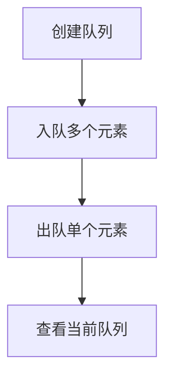

图表来源
- [Scala07_queue.scala](file://_04_scalaTest/src/main/scala/com/atguigu/scala/chapter07/Scala07_queue.scala#L1-L30)

章节来源
- [Scala07_queue.scala](file://_04_scalaTest/src/main/scala/com/atguigu/scala/chapter07/Scala07_queue.scala#L1-L30)

### 并行集合（par）
- 使用par将集合切换为并行视图
- 通过map观察不同执行线程名，验证并行行为

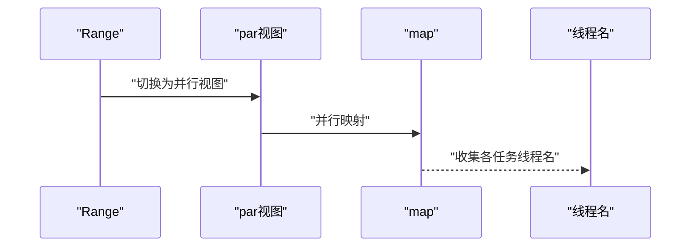

图表来源
- [Scala11_par.scala](file://_04_scalaTest/src/main/scala/com/atguigu/scala/chapter07/Scala11_par.scala#L1-L17)

章节来源
- [Scala11_par.scala](file://_04_scalaTest/src/main/scala/com/atguigu/scala/chapter07/Scala11_par.scala#L1-L17)

### WordCount（文本统计）
- 流程
  - 读取文件行到List
  - flatMap按空格切分为单词
  - groupBy按单词分组
  - mapValues统计频次
  - toList后按频次排序，取前N
- 关键点
  - flatMap展平多行切分后的单词序列
  - mapValues仅对值做size统计，简洁清晰
  - sortBy配合Ordering实现降序排序
  - take实现TopN

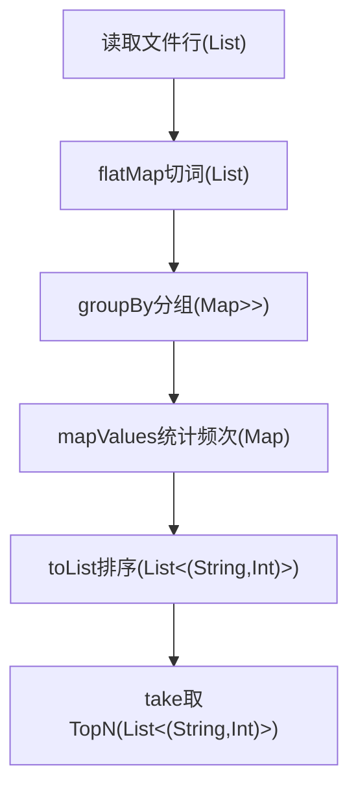

图表来源
- [Scala12_wordcount.scala](file://_04_scalaTest/src/main/scala/com/atguigu/scala/chapter07/Scala12_wordcount.scala#L1-L49)

章节来源
- [Scala12_wordcount.scala](file://_04_scalaTest/src/main/scala/com/atguigu/scala/chapter07/Scala12_wordcount.scala#L1-L49)

## 依赖分析
- 模块内依赖
  - 所有集合示例均在同一包内，彼此无直接依赖
- 外部依赖
  - 文件读取使用scala.io.Source
  - 并行集合使用scala.collection.parallel.ParIterable
- 数据流向
  - WordCount示例串联了数组/列表/映射/排序/截断等集合操作

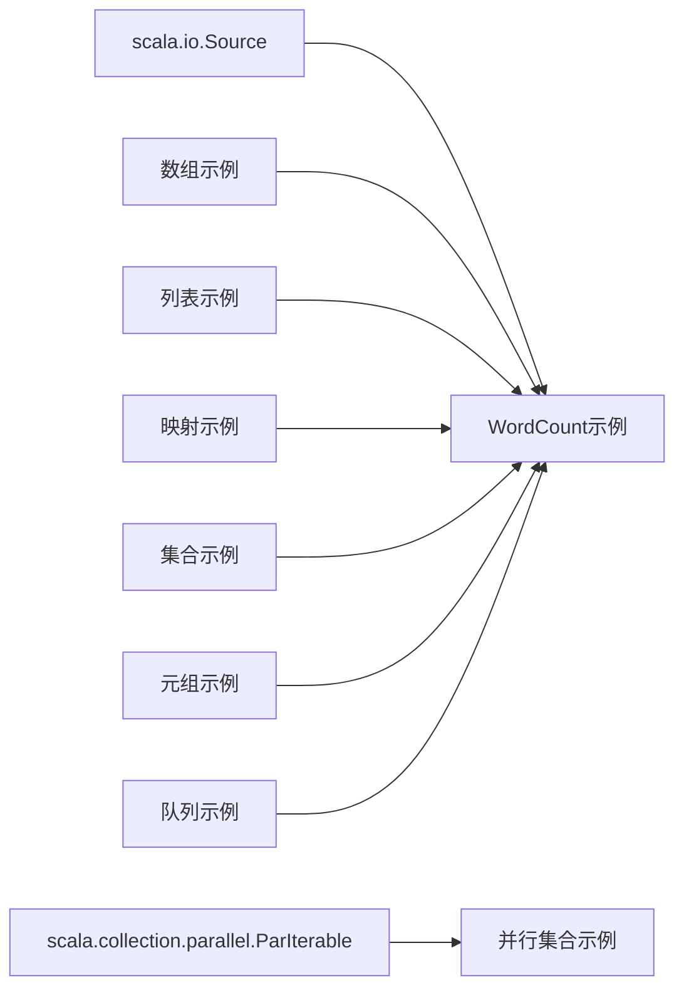

图表来源
- [Scala12_wordcount.scala](file://_04_scalaTest/src/main/scala/com/atguigu/scala/chapter07/Scala12_wordcount.scala#L1-L49)
- [Scala11_par.scala](file://_04_scalaTest/src/main/scala/com/atguigu/scala/chapter07/Scala11_par.scala#L1-L17)

章节来源
- [Scala12_wordcount.scala](file://_04_scalaTest/src/main/scala/com/atguigu/scala/chapter07/Scala12_wordcount.scala#L1-L49)
- [Scala11_par.scala](file://_04_scalaTest/src/main/scala/com/atguigu/scala/chapter07/Scala11_par.scala#L1-L17)

## 性能考虑
- 不可变 vs 可变
  - 不可变集合避免竞态，适合共享与链式变换；可变集合减少中间对象分配，适合批处理
- 并行集合
  - 对CPU密集且无共享状态的map操作收益明显；注意任务粒度与线程池开销
- 高阶函数
  - mapValues在仅对值变换时更高效且语义清晰
  - flatMap可能产生大量中间集合，需结合数据规模评估
- I/O与内存
  - WordCount示例建议分块读取与惰性处理，避免一次性加载大文件

## 故障排查指南
- 访问不存在的键
  - 使用get或getOrElse进行安全访问，避免NoSuchElementException
- 并行执行线程名观察
  - 通过map收集线程名确认是否进入并行路径
- 队列空队列异常
  - 出队前检查队列非空，避免异常

章节来源
- [Scala05_map.scala](file://_04_scalaTest/src/main/scala/com/atguigu/scala/chapter07/Scala05_map.scala#L1-L89)
- [Scala11_par.scala](file://_04_scalaTest/src/main/scala/com/atguigu/scala/chapter07/Scala11_par.scala#L1-L17)
- [Scala07_queue.scala](file://_04_scalaTest/src/main/scala/com/atguigu/scala/chapter07/Scala07_queue.scala#L1-L30)

## 结论
通过上述示例，可以系统掌握Scala集合的不可变与可变差异、常见集合类型的操作与转换、高阶函数在集合上的组合使用、并行集合的简单实践以及WordCount等经典算法的实现思路。结合性能与故障排查建议，能够在实际项目中更高效、稳健地运用Scala集合。

## 附录
- 与Java集合的对比要点
  - 不可变集合：Scala不可变集合天然线程安全，Java对应Collections.unmodifiableXxx但易被反射破坏
  - 可变集合：Scala可变集合在API上更统一（append/update/remove），Java需要选择具体实现（ArrayList/HashMap等）
  - 并行：Scala par提供统一并行视图；Java并行流需显式并行化
  - 元组：Scala元组类型安全且内置位置访问；Java通常使用Pair或Record类