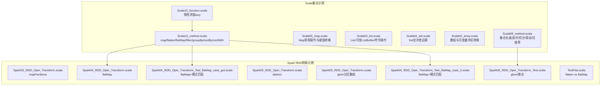
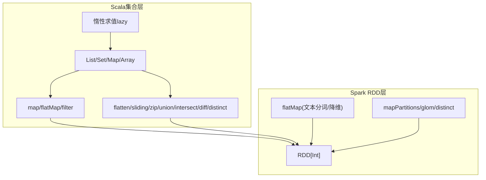
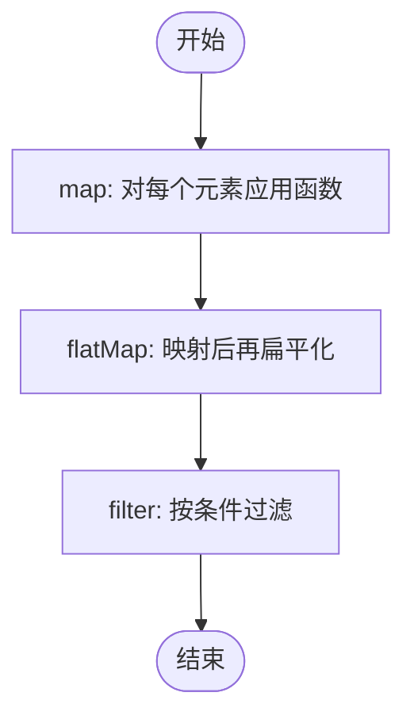
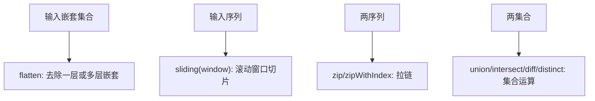
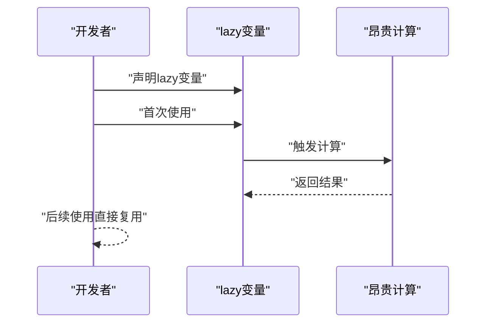
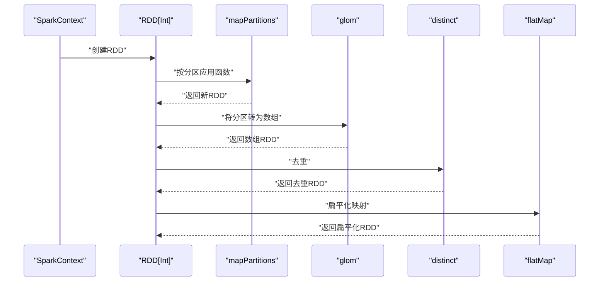
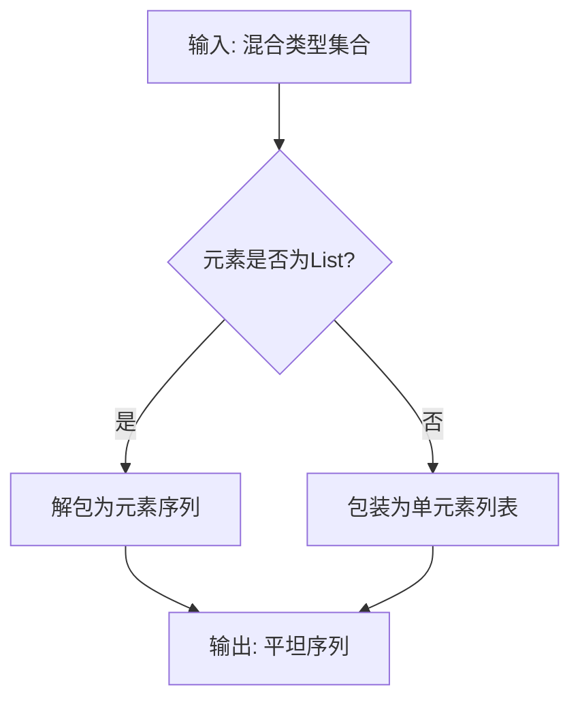
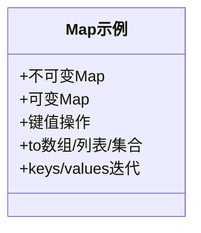
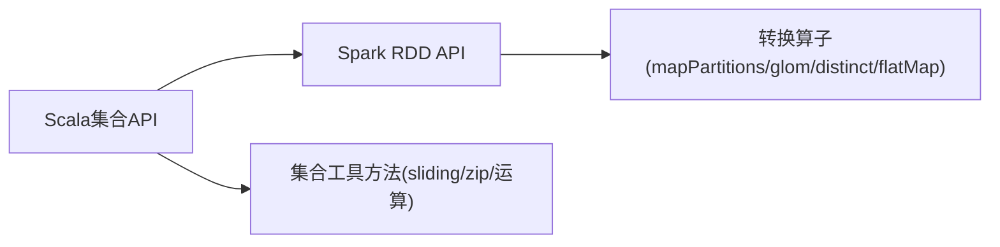

# 集合转换操作

<cite>
**本文引用的文件**
- [Scala10_method.scala](file://_04_scalaTest/src/main/scala/com/atguigu/scala/chapter07/Scala10_method.scala)
- [Scala05_map.scala](file://_04_scalaTest/src/main/scala/com/atguigu/scala/chapter07/Scala05_map.scala)
- [Scala03_list.scala](file://_04_scalaTest/src/main/scala/com/atguigu/scala/chapter07/Scala03_list.scala)
- [Scala04_set.scala](file://_04_scalaTest/src/main/scala/com/atguigu/scala/chapter07/Scala04_set.scala)
- [Scala02_array.scala](file://_04_scalaTest/src/main/scala/com/atguigu/scala/chapter07/Scala02_array.scala)
- [Scala08_method.scala](file://_04_scalaTest/src/main/scala/com/atguigu/scala/chapter07/Scala08_method.scala)
- [Scala15_function.scala](file://_04_scalaTest/src/main/scala/com/atguigu/scala/chapter05/Scala15_function.scala)
- [Spark04_RDD_Oper_Transform.scala](file://_04_sparkTest/src/main/java/com/atguigu/bigdata/spark/core/rdd/oper/transform/Spark04_RDD_Oper_Transform.scala)
- [Spark05_RDD_Oper_Transform_Test.scala](file://_04_sparkTest/src/main/java/com/atguigu/bigdata/spark/core/rdd/oper/transform/Spark05_RDD_Oper_Transform_Test.scala)
- [Spark02_RDD_Oper_Transform.scala](file://_04_sparkTest/src/main/java/com/atguigu/bigdata/spark/core/rdd/oper/transform/Spark02_RDD_Oper_Transform.scala)
- [Spark09_RDD_Oper_Transform.scala](file://_04_sparkTest/src/main/java/com/atguigu/bigdata/spark/core/rdd/oper/transform/Spark09_RDD_Oper_Transform.scala)
- [Spark05_RDD_Oper_Transform.scala](file://_04_sparkTest/src/main/java/com/atguigu/bigdata/spark/core/rdd/oper/transform/Spark05_RDD_Oper_Transform.scala)
- [Spark04_RDD_Oper_Transform_Test_flatMap_case_got.scala](file://_04_sparkTest/src/main/java/B_日期/_12月23日/Spark04_RDD_Oper_Transform_Test_flatMap_case_got.scala)
- [Spark04_RDD_Oper_Transform_Test_flatMap_case_2.scala](file://_04_sparkTest/src/main/java/B_日期/_12月23日/Spark04_RDD_Oper_Transform_Test_flatMap_case_2.scala)
- [TestFlat.scala](file://_04_sparkTest/src/main/java/com/atguigu/bigdata/spark/core/test/TestFlat.scala)
</cite>

## 目录
1. [简介](#简介)
2. [项目结构](#项目结构)
3. [核心组件](#核心组件)
4. [架构总览](#架构总览)
5. [详细组件分析](#详细组件分析)
6. [依赖分析](#依赖分析)
7. [性能考量](#性能考量)
8. [故障排查指南](#故障排查指南)
9. [结论](#结论)
10. [附录](#附录)

## 简介
本文件围绕Scala集合转换操作展开，系统梳理map、flatMap、filter等基础转换，讲解它们的组合使用与链式调用，引入惰性求值（lazy）与严格求值的差异，并结合Spark RDD转换示例说明在大数据场景下的实践。文档同时提供性能建议与常见问题排查，帮助读者在数据清洗、格式转换、业务逻辑处理等任务中做出合理选择。

## 项目结构
本仓库中与集合转换相关的示例主要分布在以下位置：
- Scala集合示例：chapter07目录下的List、Set、Map、Array、常用方法与集合工具方法演示
- 惰性求值示例：chapter05下的惰性函数示例
- Spark RDD转换示例：spark core rdd oper transform目录下的map、flatMap、glom、distinct、mapPartitions等



图表来源
- [Scala10_method.scala](file://_04_scalaTest/src/main/scala/com/atguigu/scala/chapter07/Scala10_method.scala#L1-L94)
- [Spark04_RDD_Oper_Transform.scala](file://_04_sparkTest/src/main/java/com/atguigu/bigdata/spark/core/rdd/oper/transform/Spark04_RDD_Oper_Transform.scala#L1-L32)
- [Spark05_RDD_Oper_Transform_Test.scala](file://_04_sparkTest/src/main/java/com/atguigu/bigdata/spark/core/rdd/oper/transform/Spark05_RDD_Oper_Transform_Test.scala#L1-L34)
- [Spark02_RDD_Oper_Transform.scala](file://_04_sparkTest/src/main/java/com/atguigu/bigdata/spark/core/rdd/oper/transform/Spark02_RDD_Oper_Transform.scala#L1-L30)
- [Spark09_RDD_Oper_Transform.scala](file://_04_sparkTest/src/main/java/com/atguigu/bigdata/spark/core/rdd/oper/transform/Spark09_RDD_Oper_Transform.scala#L1-L35)
- [Spark05_RDD_Oper_Transform.scala](file://_04_sparkTest/src/main/java/com/atguigu/bigdata/spark/core/rdd/oper/transform/Spark05_RDD_Oper_Transform.scala#L1-L29)
- [Spark04_RDD_Oper_Transform_Test_flatMap_case_got.scala](file://_04_sparkTest/src/main/java/B_日期/_12月23日/Spark04_RDD_Oper_Transform_Test_flatMap_case_got.scala#L1-L30)
- [Spark04_RDD_Oper_Transform_Test_flatMap_case_2.scala](file://_04_sparkTest/src/main/java/B_日期/_12月23日/Spark04_RDD_Oper_Transform_Test_flatMap_case_2.scala#L1-L33)
- [TestFlat.scala](file://_04_sparkTest/src/main/java/com/atguigu/bigdata/spark/core/test/TestFlat.scala#L1-L10)

章节来源
- [Scala10_method.scala](file://_04_scalaTest/src/main/scala/com/atguigu/scala/chapter07/Scala10_method.scala#L1-L94)
- [Spark04_RDD_Oper_Transform.scala](file://_04_sparkTest/src/main/java/com/atguigu/bigdata/spark/core/rdd/oper/transform/Spark04_RDD_Oper_Transform.scala#L1-L32)

## 核心组件
- 基础转换操作
  - map：一对一映射，保持元素个数不变
  - flatMap：先map再flatten，常用于“一对多”扁平化
  - filter：按谓词过滤，保留满足条件的元素
  - groupBy/sortBy/sortWith：分组与排序
- 集合工具方法
  - flatten：扁平化嵌套集合
  - sliding/take/drop/zip/union/intersect/diff/distinct：切片、滚动窗口、拉链、集合运算
- 惰性求值
  - lazy：延迟计算，仅在首次访问时执行
- Spark RDD转换
  - mapPartitions：按分区粒度处理
  - glom：将分区转为数组
  - distinct：去重
  - flatMap：典型的一对多转换

章节来源
- [Scala10_method.scala](file://_04_scalaTest/src/main/scala/com/atguigu/scala/chapter07/Scala10_method.scala#L1-L94)
- [Spark02_RDD_Oper_Transform.scala](file://_04_sparkTest/src/main/java/com/atguigu/bigdata/spark/core/rdd/oper/transform/Spark02_RDD_Oper_Transform.scala#L1-L30)
- [Spark05_RDD_Oper_Transform.scala](file://_04_sparkTest/src/main/java/com/atguigu/bigdata/spark/core/rdd/oper/transform/Spark05_RDD_Oper_Transform.scala#L1-L29)
- [Spark09_RDD_Oper_Transform.scala](file://_04_sparkTest/src/main/java/com/atguigu/bigdata/spark/core/rdd/oper/transform/Spark09_RDD_Oper_Transform.scala#L1-L35)
- [Spark04_RDD_Oper_Transform.scala](file://_04_sparkTest/src/main/java/com/atguigu/bigdata/spark/core/rdd/oper/transform/Spark04_RDD_Oper_Transform.scala#L1-L32)

## 架构总览
下图展示了从集合转换到Spark RDD转换的整体关系：Scala侧提供丰富的集合转换能力，Spark RDD在此基础上进一步扩展分区级转换与大规模数据处理。



图表来源
- [Scala10_method.scala](file://_04_scalaTest/src/main/scala/com/atguigu/scala/chapter07/Scala10_method.scala#L1-L94)
- [Spark02_RDD_Oper_Transform.scala](file://_04_sparkTest/src/main/java/com/atguigu/bigdata/spark/core/rdd/oper/transform/Spark02_RDD_Oper_Transform.scala#L1-L30)
- [Spark04_RDD_Oper_Transform.scala](file://_04_sparkTest/src/main/java/com/atguigu/bigdata/spark/core/rdd/oper/transform/Spark04_RDD_Oper_Transform.scala#L1-L32)

## 详细组件分析

### 组件A：集合转换操作（map/flatMap/filter）
- map：对每个元素应用函数，保持数量一致
- flatMap：先对每个元素做映射，再将嵌套结构扁平化
- filter：基于谓词筛选元素
- 组合使用：链式调用可表达复杂的转换流水线



图表来源
- [Scala10_method.scala](file://_04_scalaTest/src/main/scala/com/atguigu/scala/chapter07/Scala10_method.scala#L1-L94)

章节来源
- [Scala10_method.scala](file://_04_scalaTest/src/main/scala/com/atguigu/scala/chapter07/Scala10_method.scala#L1-L94)

### 组件B：集合工具方法（flatten/sliding/zip/集合运算）
- flatten：去除嵌套层级
- sliding：滚动窗口切片
- zip/zipWithIndex：拉链与带索引拉链
- 集合运算：union/intersect/diff/distinct



图表来源
- [Scala10_method.scala](file://_04_scalaTest/src/main/scala/com/atguigu/scala/chapter07/Scala10_method.scala#L1-L94)
- [Scala08_method.scala](file://_04_scalaTest/src/main/scala/com/atguigu/scala/chapter07/Scala08_method.scala#L1-L138)

章节来源
- [Scala08_method.scala](file://_04_scalaTest/src/main/scala/com/atguigu/scala/chapter07/Scala08_method.scala#L1-L138)
- [Scala10_method.scala](file://_04_scalaTest/src/main/scala/com/atguigu/scala/chapter07/Scala10_method.scala#L1-L94)

### 组件C：惰性求值（lazy）
- 在需要时才计算，有助于避免不必要的中间结果构造，节省内存与CPU
- 适合昂贵或可选的计算路径



图表来源
- [Scala15_function.scala](file://_04_scalaTest/src/main/scala/com/atguigu/scala/chapter05/Scala15_function.scala#L1-L28)

章节来源
- [Scala15_function.scala](file://_04_scalaTest/src/main/scala/com/atguigu/scala/chapter05/Scala15_function.scala#L1-L28)

### 组件D：Spark RDD转换（mapPartitions/glom/distinct/flatMap）
- mapPartitions：按分区处理，减少函数调用开销
- glom：将分区转为数组，便于分区级聚合
- distinct：去重
- flatMap：典型的一对多转换（如按空格拆分单词）



图表来源
- [Spark02_RDD_Oper_Transform.scala](file://_04_sparkTest/src/main/java/com/atguigu/bigdata/spark/core/rdd/oper/transform/Spark02_RDD_Oper_Transform.scala#L1-L30)
- [Spark05_RDD_Oper_Transform.scala](file://_04_sparkTest/src/main/java/com/atguigu/bigdata/spark/core/rdd/oper/transform/Spark05_RDD_Oper_Transform.scala#L1-L29)
- [Spark09_RDD_Oper_Transform.scala](file://_04_sparkTest/src/main/java/com/atguigu/bigdata/spark/core/rdd/oper/transform/Spark09_RDD_Oper_Transform.scala#L1-L35)
- [Spark04_RDD_Oper_Transform.scala](file://_04_sparkTest/src/main/java/com/atguigu/bigdata/spark/core/rdd/oper/transform/Spark04_RDD_Oper_Transform.scala#L1-L32)

章节来源
- [Spark02_RDD_Oper_Transform.scala](file://_04_sparkTest/src/main/java/com/atguigu/bigdata/spark/core/rdd/oper/transform/Spark02_RDD_Oper_Transform.scala#L1-L30)
- [Spark05_RDD_Oper_Transform.scala](file://_04_sparkTest/src/main/java/com/atguigu/bigdata/spark/core/rdd/oper/transform/Spark05_RDD_Oper_Transform.scala#L1-L29)
- [Spark09_RDD_Oper_Transform.scala](file://_04_sparkTest/src/main/java/com/atguigu/bigdata/spark/core/rdd/oper/transform/Spark09_RDD_Oper_Transform.scala#L1-L35)
- [Spark04_RDD_Oper_Transform.scala](file://_04_sparkTest/src/main/java/com/atguigu/bigdata/spark/core/rdd/oper/transform/Spark04_RDD_Oper_Transform.scala#L1-L32)

### 组件E：flatMap与模式匹配（降维/类型处理）
- 使用flatMap结合模式匹配，将混合类型（如List与Int）统一降维
- 适合清洗阶段：将不规整数据规整化



图表来源
- [Spark04_RDD_Oper_Transform_Test_flatMap_case_got.scala](file://_04_sparkTest/src/main/java/B_日期/_12月23日/Spark04_RDD_Oper_Transform_Test_flatMap_case_got.scala#L1-L30)
- [Spark04_RDD_Oper_Transform_Test_flatMap_case_2.scala](file://_04_sparkTest/src/main/java/B_日期/_12月23日/Spark04_RDD_Oper_Transform_Test_flatMap_case_2.scala#L1-L33)

章节来源
- [Spark04_RDD_Oper_Transform_Test_flatMap_case_got.scala](file://_04_sparkTest/src/main/java/B_日期/_12月23日/Spark04_RDD_Oper_Transform_Test_flatMap_case_got.scala#L1-L30)
- [Spark04_RDD_Oper_Transform_Test_flatMap_case_2.scala](file://_04_sparkTest/src/main/java/B_日期/_12月23日/Spark04_RDD_Oper_Transform_Test_flatMap_case_2.scala#L1-L33)

### 组件F：flatten与flatMap的区别
- flatten：去除嵌套层级
- flatMap：先映射再flatten，常用于“一对多”场景（如按空格拆分句子）

```mermaid
flowchart TD
A["输入: 嵌套集合"] --> F["flatMap: 映射后拼接"]
A --> L["flatten: 去除嵌套层级"]
S["输入: 字符串集合"] --> FS["flatMap(_.split(\" \"))"]
S --> FL["flatten: 仅去除嵌套"]
```

图表来源
- [TestFlat.scala](file://_04_sparkTest/src/main/java/com/atguigu/bigdata/spark/core/test/TestFlat.scala#L1-L10)
- [Scala10_method.scala](file://_04_scalaTest/src/main/scala/com/atguigu/scala/chapter07/Scala10_method.scala#L1-L94)

章节来源
- [TestFlat.scala](file://_04_sparkTest/src/main/java/com/atguigu/bigdata/spark/core/test/TestFlat.scala#L1-L10)
- [Scala10_method.scala](file://_04_scalaTest/src/main/scala/com/atguigu/scala/chapter07/Scala10_method.scala#L1-L94)

### 组件G：集合与Map的相互转换
- 将可变Map转换为Array/List/Set等序列，便于进一步处理
- 提供keys/values/entries的迭代方式



图表来源
- [Scala05_map.scala](file://_04_scalaTest/src/main/scala/com/atguigu/scala/chapter07/Scala05_map.scala#L1-L89)

章节来源
- [Scala05_map.scala](file://_04_scalaTest/src/main/scala/com/atguigu/scala/chapter07/Scala05_map.scala#L1-L89)

## 依赖分析
- Scala集合层依赖于标准库提供的集合类型与工具方法
- Spark RDD层依赖于Spark运行时，mapPartitions/glom/distinct等算子在分布式环境下执行
- flatMap在Scala与Spark中均承担“一对多”转换职责，是数据清洗与格式转换的关键



图表来源
- [Scala10_method.scala](file://_04_scalaTest/src/main/scala/com/atguigu/scala/chapter07/Scala10_method.scala#L1-L94)
- [Spark02_RDD_Oper_Transform.scala](file://_04_sparkTest/src/main/java/com/atguigu/bigdata/spark/core/rdd/oper/transform/Spark02_RDD_Oper_Transform.scala#L1-L30)
- [Spark05_RDD_Oper_Transform.scala](file://_04_sparkTest/src/main/java/com/atguigu/bigdata/spark/core/rdd/oper/transform/Spark05_RDD_Oper_Transform.scala#L1-L29)
- [Spark09_RDD_Oper_Transform.scala](file://_04_sparkTest/src/main/java/com/atguigu/bigdata/spark/core/rdd/oper/transform/Spark09_RDD_Oper_Transform.scala#L1-L35)
- [Spark04_RDD_Oper_Transform.scala](file://_04_sparkTest/src/main/java/com/atguigu/bigdata/spark/core/rdd/oper/transform/Spark04_RDD_Oper_Transform.scala#L1-L32)

章节来源
- [Spark02_RDD_Oper_Transform.scala](file://_04_sparkTest/src/main/java/com/atguigu/bigdata/spark/core/rdd/oper/transform/Spark02_RDD_Oper_Transform.scala#L1-L30)
- [Spark05_RDD_Oper_Transform.scala](file://_04_sparkTest/src/main/java/com/atguigu/bigdata/spark/core/rdd/oper/transform/Spark05_RDD_Oper_Transform.scala#L1-L29)
- [Spark09_RDD_Oper_Transform.scala](file://_04_sparkTest/src/main/java/com/atguigu/bigdata/spark/core/rdd/oper/transform/Spark09_RDD_Oper_Transform.scala#L1-L35)
- [Spark04_RDD_Oper_Transform.scala](file://_04_sparkTest/src/main/java/com/atguigu/bigdata/spark/core/rdd/oper/transform/Spark04_RDD_Oper_Transform.scala#L1-L32)

## 性能考量
- 严格 vs 惰性
  - 惰性（lazy）适合昂贵或可选计算，避免无谓的中间结果构造
  - 严格（立即）适合需要明确内存占用与可预测执行时间的场景
- Spark分区级转换
  - mapPartitions：减少函数调用次数，适合重用资源或批量处理
  - glom：将分区转为数组，便于分区内的聚合或排序
  - distinct：在大数据上代价较高，需评估重复率与分区策略
- flatMap的权衡
  - 一对多可能放大数据量，应配合filter或早期裁剪
  - 文本分词等场景建议在flatMap之前做必要的预过滤

章节来源
- [Scala15_function.scala](file://_04_scalaTest/src/main/scala/com/atguigu/scala/chapter05/Scala15_function.scala#L1-L28)
- [Spark02_RDD_Oper_Transform.scala](file://_04_sparkTest/src/main/java/com/atguigu/bigdata/spark/core/rdd/oper/transform/Spark02_RDD_Oper_Transform.scala#L1-L30)
- [Spark05_RDD_Oper_Transform.scala](file://_04_sparkTest/src/main/java/com/atguigu/bigdata/spark/core/rdd/oper/transform/Spark05_RDD_Oper_Transform.scala#L1-L29)
- [Spark09_RDD_Oper_Transform.scala](file://_04_sparkTest/src/main/java/com/atguigu/bigdata/spark/core/rdd/oper/transform/Spark09_RDD_Oper_Transform.scala#L1-L35)

## 故障排查指南
- flatMap后元素数量异常增多
  - 检查映射函数是否产生多个元素；必要时在flatMap前使用filter裁剪
  - 参考：[TestFlat.scala](file://_04_sparkTest/src/main/java/com/atguigu/bigdata/spark/core/test/TestFlat.scala#L1-L10)
- 混合类型扁平化失败或结果不符合预期
  - 使用模式匹配确保不同类型分支正确处理
  - 参考：
    - [Spark04_RDD_Oper_Transform_Test_flatMap_case_got.scala](file://_04_sparkTest/src/main/java/B_日期/_12月23日/Spark04_RDD_Oper_Transform_Test_flatMap_case_got.scala#L1-L30)
    - [Spark04_RDD_Oper_Transform_Test_flatMap_case_2.scala](file://_04_sparkTest/src/main/java/B_日期/_12月23日/Spark04_RDD_Oper_Transform_Test_flatMap_case_2.scala#L1-L33)
- Spark分区处理性能不佳
  - 优先尝试mapPartitions减少函数调用开销
  - 参考：[Spark02_RDD_Oper_Transform.scala](file://_04_sparkTest/src/main/java/com/atguigu/bigdata/spark/core/rdd/oper/transform/Spark02_RDD_Oper_Transform.scala#L1-L30)
- 去重成本过高
  - 评估重复率与分区数量；必要时预排序或采用近似去重方案
  - 参考：[Spark09_RDD_Oper_Transform.scala](file://_04_sparkTest/src/main/java/com/atguigu/bigdata/spark/core/rdd/oper/transform/Spark09_RDD_Oper_Transform.scala#L1-L35)

章节来源
- [TestFlat.scala](file://_04_sparkTest/src/main/java/com/atguigu/bigdata/spark/core/test/TestFlat.scala#L1-L10)
- [Spark04_RDD_Oper_Transform_Test_flatMap_case_got.scala](file://_04_sparkTest/src/main/java/B_日期/_12月23日/Spark04_RDD_Oper_Transform_Test_flatMap_case_got.scala#L1-L30)
- [Spark04_RDD_Oper_Transform_Test_flatMap_case_2.scala](file://_04_sparkTest/src/main/java/B_日期/_12月23日/Spark04_RDD_Oper_Transform_Test_flatMap_case_2.scala#L1-L33)
- [Spark02_RDD_Oper_Transform.scala](file://_04_sparkTest/src/main/java/com/atguigu/bigdata/spark/core/rdd/oper/transform/Spark02_RDD_Oper_Transform.scala#L1-L30)
- [Spark09_RDD_Oper_Transform.scala](file://_04_sparkTest/src/main/java/com/atguigu/bigdata/spark/core/rdd/oper/transform/Spark09_RDD_Oper_Transform.scala#L1-L35)

## 结论
- map/flatMap/filter构成集合转换的基础，通过链式组合可表达复杂的数据处理逻辑
- flatten与sliding/zip等工具方法丰富了集合操作的表达力
- 惰性求值（lazy）在Scala中可显著降低不必要的计算与内存占用
- Spark RDD的mapPartitions/glom/distinct/flatMap等算子提供了强大的分布式转换能力
- 实践中应根据数据规模、内存预算与性能目标选择严格或惰性策略，并在flatMap前后进行合理的裁剪与预处理

## 附录
- 实际项目应用建议
  - 数据清洗：先filter后flatMap，利用模式匹配处理混合类型
  - 格式转换：使用map与flatten组合，将嵌套结构规整化
  - 业务逻辑处理：在Spark端使用mapPartitions进行批处理，提升吞吐
- 参考文件路径
  - [Scala10_method.scala](file://_04_scalaTest/src/main/scala/com/atguigu/scala/chapter07/Scala10_method.scala#L1-L94)
  - [Spark04_RDD_Oper_Transform.scala](file://_04_sparkTest/src/main/java/com/atguigu/bigdata/spark/core/rdd/oper/transform/Spark04_RDD_Oper_Transform.scala#L1-L32)
  - [Spark02_RDD_Oper_Transform.scala](file://_04_sparkTest/src/main/java/com/atguigu/bigdata/spark/core/rdd/oper/transform/Spark02_RDD_Oper_Transform.scala#L1-L30)
  - [Spark09_RDD_Oper_Transform.scala](file://_04_sparkTest/src/main/java/com/atguigu/bigdata/spark/core/rdd/oper/transform/Spark09_RDD_Oper_Transform.scala#L1-L35)
  - [Spark04_RDD_Oper_Transform_Test_flatMap_case_got.scala](file://_04_sparkTest/src/main/java/B_日期/_12月23日/Spark04_RDD_Oper_Transform_Test_flatMap_case_got.scala#L1-L30)
  - [Spark04_RDD_Oper_Transform_Test_flatMap_case_2.scala](file://_04_sparkTest/src/main/java/B_日期/_12月23日/Spark04_RDD_Oper_Transform_Test_flatMap_case_2.scala#L1-L33)
  - [TestFlat.scala](file://_04_sparkTest/src/main/java/com/atguigu/bigdata/spark/core/test/TestFlat.scala#L1-L10)