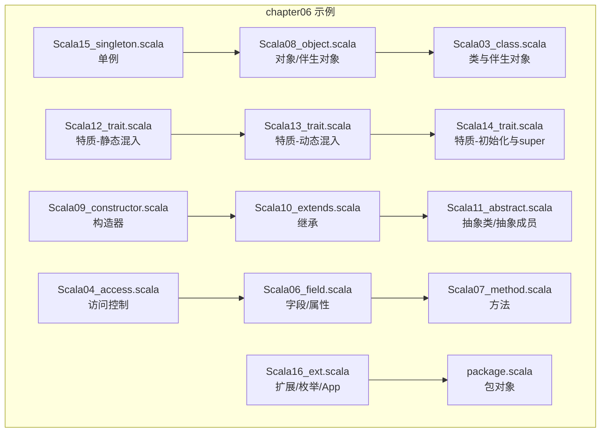
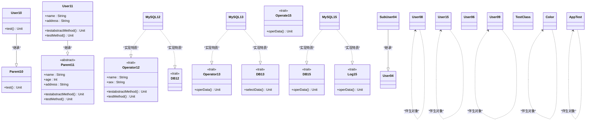
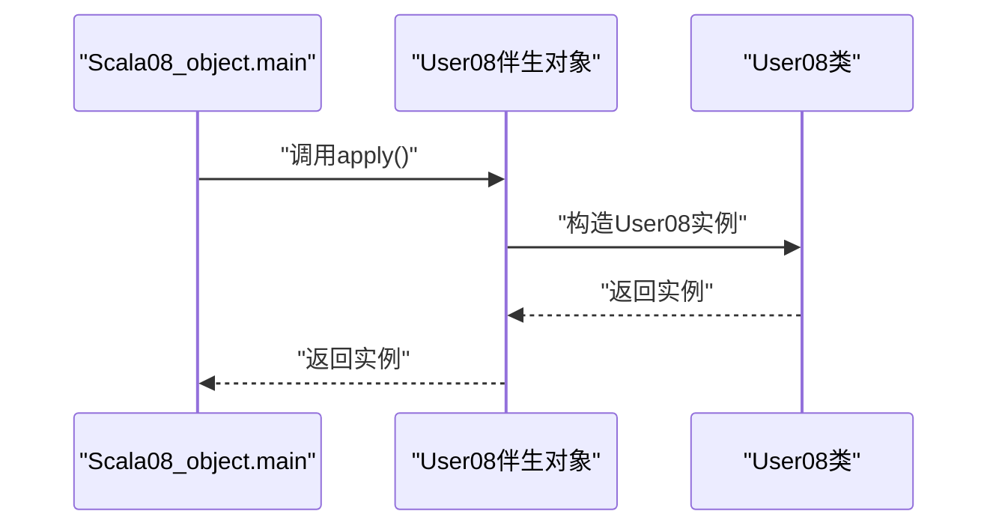
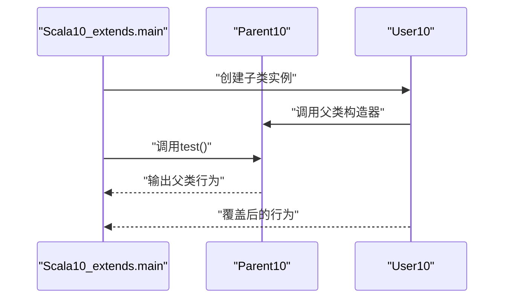
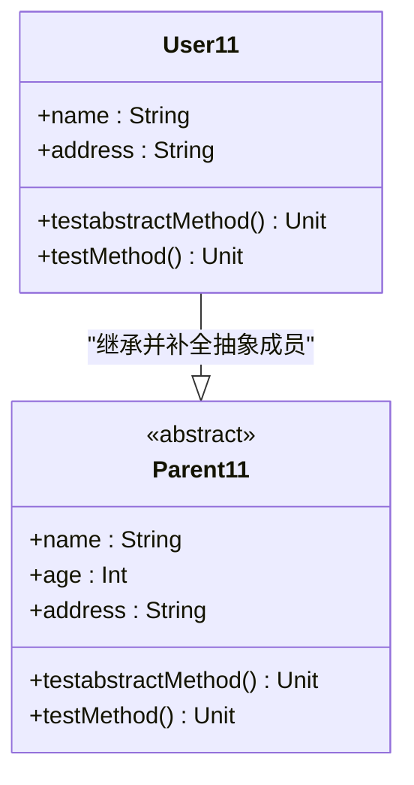
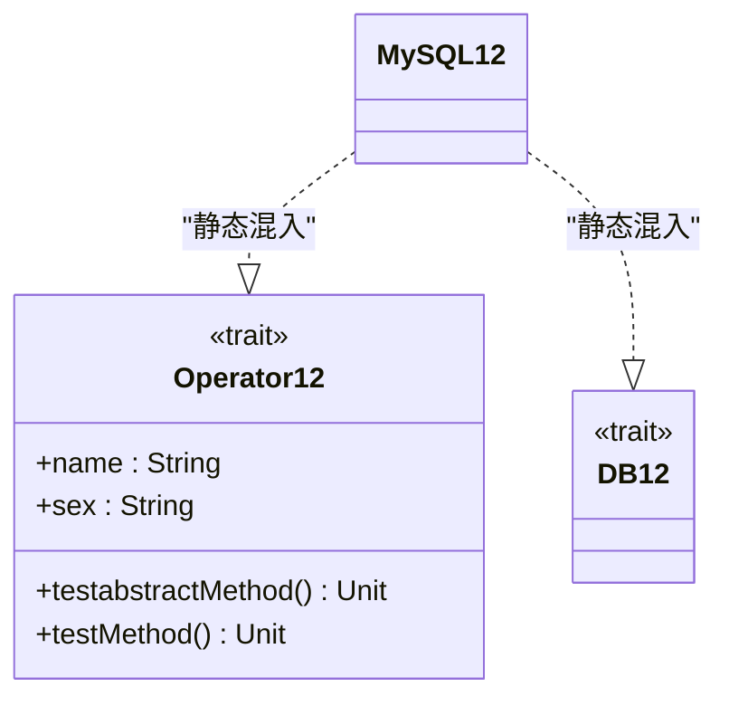
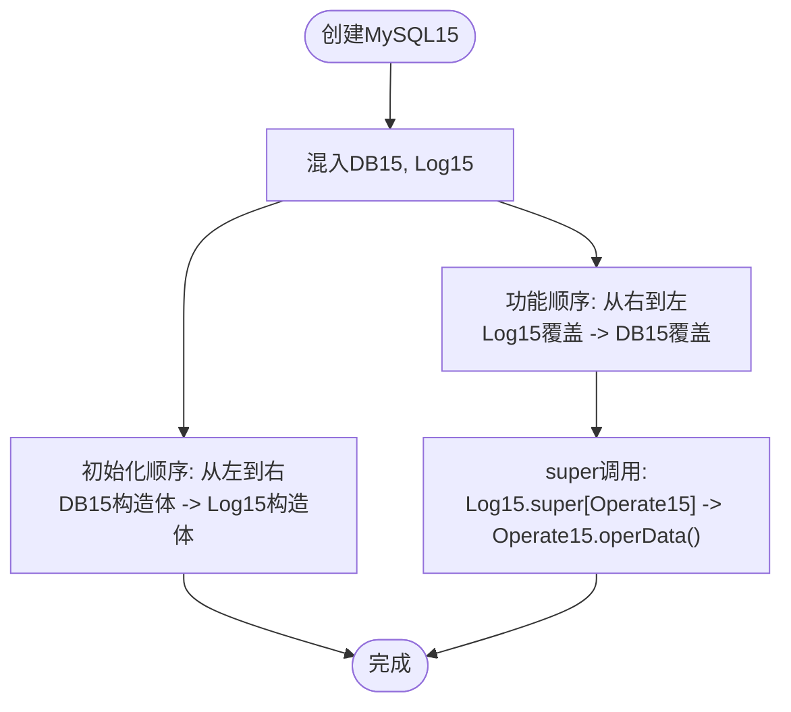
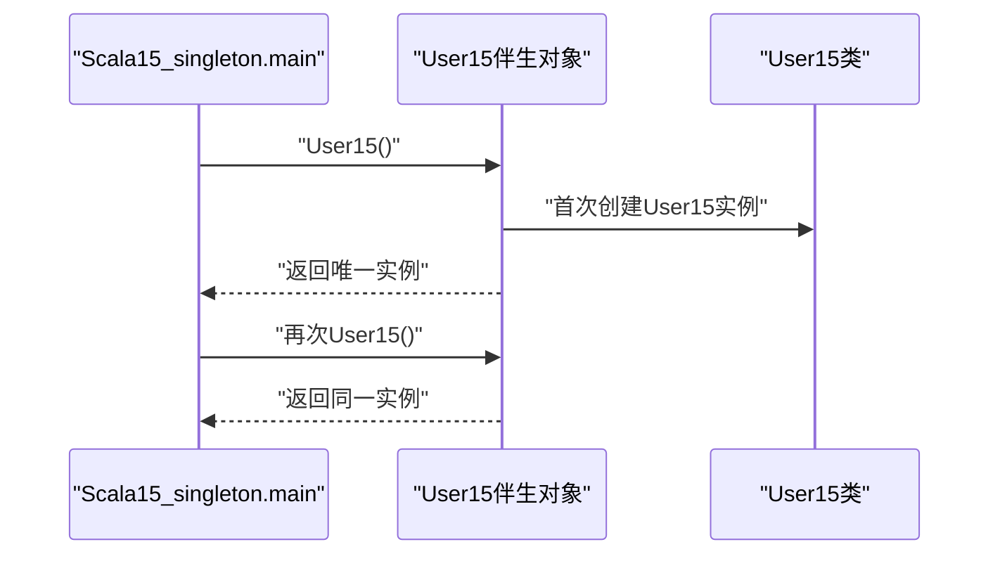
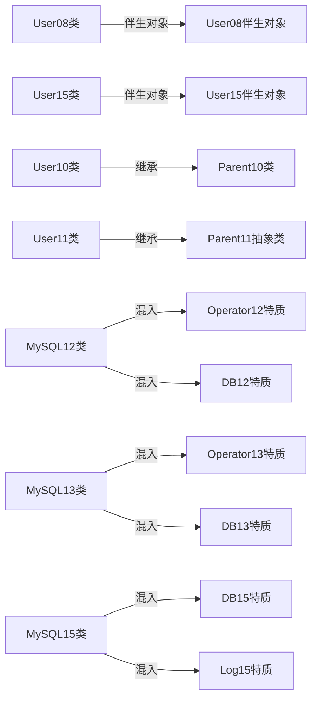

# 面向对象编程

<cite>
**本文引用的文件**
- [Scala03_class.scala](file://_04_scalaTest/src/main/scala/com/atguigu/scala/chapter06/Scala03_class.scala)
- [Scala04_access.scala](file://_04_scalaTest/src/main/scala/com/atguigu/scala/chapter06/Scala04_access.scala)
- [Scala06_field.scala](file://_04_scalaTest/src/main/scala/com/atguigu/scala/chapter06/Scala06_field.scala)
- [Scala07_method.scala](file://_04_scalaTest/src/main/scala/com/atguigu/scala/chapter06/Scala07_method.scala)
- [Scala08_object.scala](file://_04_scalaTest/src/main/scala/com/atguigu/scala/chapter06/Scala08_object.scala)
- [Scala09_constructor.scala](file://_04_scalaTest/src/main/scala/com/atguigu/scala/chapter06/Scala09_constructor.scala)
- [Scala10_extends.scala](file://_04_scalaTest/src/main/scala/com/atguigu/scala/chapter06/Scala10_extends.scala)
- [Scala11_abstract.scala](file://_04_scalaTest/src/main/scala/com/atguigu/scala/chapter06/Scala11_abstract.scala)
- [Scala12_trait.scala](file://_04_scalaTest/src/main/scala/com/atguigu/scala/chapter06/Scala12_trait.scala)
- [Scala13_trait.scala](file://_04_scalaTest/src/main/scala/com/atguigu/scala/chapter06/Scala13_trait.scala)
- [Scala14_trait.scala](file://_04_scalaTest/src/main/scala/com/atguigu/scala/chapter06/Scala14_trait.scala)
- [Scala15_singleton.scala](file://_04_scalaTest/src/main/scala/com/atguigu/scala/chapter06/Scala15_singleton.scala)
- [Scala16_ext.scala](file://_04_scalaTest/src/main/scala/com/atguigu/scala/chapter06/Scala16_ext.scala)
- [package.scala](file://_04_scalaTest/src/main/scala/com/atguigu/scala/chapter06/package.scala)
</cite>

## 目录
1. 引言
2. 项目结构
3. 核心组件
4. 架构总览
5. 详细组件分析
6. 依赖分析
7. 性能考虑
8. 故障排查指南
9. 结论
10. 附录

## 引言
本文件系统性梳理Scala面向对象编程的关键主题，覆盖类与对象、字段与方法、继承、抽象类、特质（Trait）、单例与伴生对象、访问控制、以及与Java的差异与最佳实践。文档以仓库中的Scala示例为依据，通过图示与分层讲解，帮助读者建立对Scala面向对象体系的完整认知。

## 项目结构
本项目以“章节”组织Scala示例，每个示例聚焦一个面向对象主题。核心位于 chapter06 包下的多个文件，分别演示类、字段、方法、访问控制、构造器、继承、抽象类、特质、单例等概念；另有包对象与扩展示例，补充包级成员与类型别名等能力。

图表来源
- [Scala03_class.scala](file://_04_scalaTest/src/main/scala/com/atguigu/scala/chapter06/Scala03_class.scala#L1-L60)
- [Scala04_access.scala](file://_04_scalaTest/src/main/scala/com/atguigu/scala/chapter06/Scala04_access.scala#L1-L68)
- [Scala06_field.scala](file://_04_scalaTest/src/main/scala/com/atguigu/scala/chapter06/Scala06_field.scala#L1-L64)
- [Scala07_method.scala](file://_04_scalaTest/src/main/scala/com/atguigu/scala/chapter06/Scala07_method.scala#L1-L60)
- [Scala08_object.scala](file://_04_scalaTest/src/main/scala/com/atguigu/scala/chapter06/Scala08_object.scala#L1-L55)
- [Scala09_constructor.scala](file://_04_scalaTest/src/main/scala/com/atguigu/scala/chapter06/Scala09_constructor.scala#L1-L58)
- [Scala10_extends.scala](file://_04_scalaTest/src/main/scala/com/atguigu/scala/chapter06/Scala10_extends.scala#L1-L47)
- [Scala11_abstract.scala](file://_04_scalaTest/src/main/scala/com/atguigu/scala/chapter06/Scala11_abstract.scala#L1-L92)
- [Scala12_trait.scala](file://_04_scalaTest/src/main/scala/com/atguigu/scala/chapter06/Scala12_trait.scala#L1-L38)
- [Scala13_trait.scala](file://_04_scalaTest/src/main/scala/com/atguigu/scala/chapter06/Scala13_trait.scala#L1-L54)
- [Scala14_trait.scala](file://_04_scalaTest/src/main/scala/com/atguigu/scala/chapter06/Scala14_trait.scala#L1-L63)
- [Scala15_singleton.scala](file://_04_scalaTest/src/main/scala/com/atguigu/scala/chapter06/Scala15_singleton.scala#L1-L62)
- [Scala16_ext.scala](file://_04_scalaTest/src/main/scala/com/atguigu/scala/chapter06/Scala16_ext.scala#L1-L79)
- [package.scala](file://_04_scalaTest/src/main/scala/com/atguigu/scala/chapter06/package.scala#L1-L15)

章节来源
- [Scala03_class.scala](file://_04_scalaTest/src/main/scala/com/atguigu/scala/chapter06/Scala03_class.scala#L1-L60)
- [package.scala](file://_04_scalaTest/src/main/scala/com/atguigu/scala/chapter06/package.scala#L1-L15)

## 核心组件
- 类与对象：类用于定义结构与行为，伴生对象提供静态语义与工厂方法；二者共享相同名称。
- 字段与属性：Scala以var/val声明属性，自动提供getter/setter；@BeanProperty可生成Java Bean风格的get/set。
- 方法：支持重载与重写；重写需显式override标注（具体方法重写必须加）。
- 继承：单继承，子类必须调用父类构造器；方法重写遵循override约定。
- 抽象：抽象类与抽象成员（方法/属性），具体类需补全抽象成员。
- 特质：多重继承能力，支持静态与动态混入；初始化顺序与super调用有明确规则。
- 单例：伴生对象实现单例；apply方法提供便捷构造。
- 访问控制：private、private[包]、protected、默认（无修饰符）；包对象提供包级成员。

章节来源
- [Scala03_class.scala](file://_04_scalaTest/src/main/scala/com/atguigu/scala/chapter06/Scala03_class.scala#L1-L60)
- [Scala06_field.scala](file://_04_scalaTest/src/main/scala/com/atguigu/scala/chapter06/Scala06_field.scala#L1-L64)
- [Scala07_method.scala](file://_04_scalaTest/src/main/scala/com/atguigu/scala/chapter06/Scala07_method.scala#L1-L60)
- [Scala10_extends.scala](file://_04_scalaTest/src/main/scala/com/atguigu/scala/chapter06/Scala10_extends.scala#L1-L47)
- [Scala11_abstract.scala](file://_04_scalaTest/src/main/scala/com/atguigu/scala/chapter06/Scala11_abstract.scala#L1-L92)
- [Scala12_trait.scala](file://_04_scalaTest/src/main/scala/com/atguigu/scala/chapter06/Scala12_trait.scala#L1-L38)
- [Scala13_trait.scala](file://_04_scalaTest/src/main/scala/com/atguigu/scala/chapter06/Scala13_trait.scala#L1-L54)
- [Scala14_trait.scala](file://_04_scalaTest/src/main/scala/com/atguigu/scala/chapter06/Scala14_trait.scala#L1-L63)
- [Scala15_singleton.scala](file://_04_scalaTest/src/main/scala/com/atguigu/scala/chapter06/Scala15_singleton.scala#L1-L62)
- [Scala04_access.scala](file://_04_scalaTest/src/main/scala/com/atguigu/scala/chapter06/Scala04_access.scala#L1-L68)

## 架构总览
下图展示了面向对象各要素之间的关系与典型交互路径：类与伴生对象协同提供实例与工厂；继承链体现父子关系；抽象类约束具体类；特质通过静态/动态混入叠加能力；单例由伴生对象提供；包对象提供包级成员。

图表来源
- [Scala10_extends.scala](file://_04_scalaTest/src/main/scala/com/atguigu/scala/chapter06/Scala10_extends.scala#L1-L47)
- [Scala11_abstract.scala](file://_04_scalaTest/src/main/scala/com/atguigu/scala/chapter06/Scala11_abstract.scala#L1-L92)
- [Scala12_trait.scala](file://_04_scalaTest/src/main/scala/com/atguigu/scala/chapter06/Scala12_trait.scala#L1-L38)
- [Scala13_trait.scala](file://_04_scalaTest/src/main/scala/com/atguigu/scala/chapter06/Scala13_trait.scala#L1-L54)
- [Scala14_trait.scala](file://_04_scalaTest/src/main/scala/com/atguigu/scala/chapter06/Scala14_trait.scala#L1-L63)
- [Scala08_object.scala](file://_04_scalaTest/src/main/scala/com/atguigu/scala/chapter06/Scala08_object.scala#L1-L55)
- [Scala15_singleton.scala](file://_04_scalaTest/src/main/scala/com/atguigu/scala/chapter06/Scala15_singleton.scala#L1-L62)
- [Scala04_access.scala](file://_04_scalaTest/src/main/scala/com/atguigu/scala/chapter06/Scala04_access.scala#L1-L68)
- [Scala06_field.scala](file://_04_scalaTest/src/main/scala/com/atguigu/scala/chapter06/Scala06_field.scala#L1-L64)
- [Scala09_constructor.scala](file://_04_scalaTest/src/main/scala/com/atguigu/scala/chapter06/Scala09_constructor.scala#L1-L58)
- [Scala16_ext.scala](file://_04_scalaTest/src/main/scala/com/atguigu/scala/chapter06/Scala16_ext.scala#L1-L79)

## 详细组件分析

### 类与对象、伴生对象
- 类与伴生对象：同一名称的class与object构成伴生关系，二者可互相访问彼此的私有成员；对象常作为工厂与单例容器。
- 伴生对象的apply方法：用于提供便捷构造，避免直接new；示例中通过apply与自定义abc方法创建实例。
- 伴生类构造器私有化：结合伴生对象的apply，实现受控实例化与单例。

图表来源
- [Scala08_object.scala](file://_04_scalaTest/src/main/scala/com/atguigu/scala/chapter06/Scala08_object.scala#L1-L55)

章节来源
- [Scala03_class.scala](file://_04_scalaTest/src/main/scala/com/atguigu/scala/chapter06/Scala03_class.scala#L1-L60)
- [Scala08_object.scala](file://_04_scalaTest/src/main/scala/com/atguigu/scala/chapter06/Scala08_object.scala#L1-L55)

### 字段与属性
- var/val声明属性：var可变，val不可变；Scala自动提供getter/setter；@BeanProperty可生成Java Bean风格的get/set。
- 访问修饰符影响getter/setter可见性：private/private[包]/protected/default修饰属性时，生成的方法可见性随之变化。
- 示例展示了不同修饰符下的字段与Bean属性声明。

章节来源
- [Scala06_field.scala](file://_04_scalaTest/src/main/scala/com/atguigu/scala/chapter06/Scala06_field.scala#L1-L64)

### 方法与重载/重写
- 方法声明语法与特性：支持重载与重写；重载基于签名差异；重写需override标注（具体方法重写必须加）。
- 多态与重载：示例展示了重载方法的签名差异与调用选择。

章节来源
- [Scala07_method.scala](file://_04_scalaTest/src/main/scala/com/atguigu/scala/chapter06/Scala07_method.scala#L1-L60)

### 继承与super
- 单继承与构造器调用：子类必须调用父类构造器；方法重写通过override实现。
- 示例演示了父类与子类的方法重写。

图表来源
- [Scala10_extends.scala](file://_04_scalaTest/src/main/scala/com/atguigu/scala/chapter06/Scala10_extends.scala#L1-L47)

章节来源
- [Scala10_extends.scala](file://_04_scalaTest/src/main/scala/com/atguigu/scala/chapter06/Scala10_extends.scala#L1-L47)

### 抽象类与抽象成员
- 抽象类与抽象成员：抽象类可包含抽象方法与抽象属性，也可包含具体成员；具体类继承后必须补全抽象成员。
- 重写规则：抽象方法/属性可加可不加override；重写具体方法必须加override；val可重写，var不可重写具体属性。

图表来源
- [Scala11_abstract.scala](file://_04_scalaTest/src/main/scala/com/atguigu/scala/chapter06/Scala11_abstract.scala#L1-L92)

章节来源
- [Scala11_abstract.scala](file://_04_scalaTest/src/main/scala/com/atguigu/scala/chapter06/Scala11_abstract.scala#L1-L92)

### 特质（Trait）：静态与动态混入
- 静态混入：类通过with关键字同时实现多个特质；需补全抽象成员。
- 动态混入：在创建实例时临时混入特质，适合按需叠加行为。
- 示例展示了静态混入与动态混入两种方式。

图表来源
- [Scala12_trait.scala](file://_04_scalaTest/src/main/scala/com/atguigu/scala/chapter06/Scala12_trait.scala#L1-L38)

章节来源
- [Scala12_trait.scala](file://_04_scalaTest/src/main/scala/com/atguigu/scala/chapter06/Scala12_trait.scala#L1-L38)
- [Scala13_trait.scala](file://_04_scalaTest/src/main/scala/com/atguigu/scala/chapter06/Scala13_trait.scala#L1-L54)

### 特质初始化顺序与super调用
- 初始化顺序：按混入顺序从左到右执行特质构造体。
- 功能顺序：方法覆盖按混入顺序从右到左生效。
- super调用：可在特质中通过super或super[特质]精确指定调用链。

图表来源
- [Scala14_trait.scala](file://_04_scalaTest/src/main/scala/com/atguigu/scala/chapter06/Scala14_trait.scala#L1-L63)

章节来源
- [Scala14_trait.scala](file://_04_scalaTest/src/main/scala/com/atguigu/scala/chapter06/Scala14_trait.scala#L1-L63)

### 单例与伴生对象
- 单例实现：伴生对象通过私有构造与apply方法提供全局唯一实例。
- 示例验证了多次调用返回同一实例。

图表来源
- [Scala15_singleton.scala](file://_04_scalaTest/src/main/scala/com/atguigu/scala/chapter06/Scala15_singleton.scala#L1-L62)

章节来源
- [Scala15_singleton.scala](file://_04_scalaTest/src/main/scala/com/atguigu/scala/chapter06/Scala15_singleton.scala#L1-L62)

### 访问控制
- 修饰符范围：private（本类）、private[包]（本类+同包）、protected（本类+子类）、默认（任意）。
- 示例展示了不同修饰符对字段与方法可见性的影响，以及子类对受保护成员的访问。

章节来源
- [Scala04_access.scala](file://_04_scalaTest/src/main/scala/com/atguigu/scala/chapter06/Scala04_access.scala#L1-L68)

### 构造器
- 主构造器：类体即构造体，参数在类签名中声明。
- 辅助构造器：def this(...)形式，必须直接或间接调用主构造器；被调用者需声明在调用者之前。
- 示例演示了主/辅助构造器的声明与调用顺序。

章节来源
- [Scala09_constructor.scala](file://_04_scalaTest/src/main/scala/com/atguigu/scala/chapter06/Scala09_constructor.scala#L1-L58)

### 扩展与包对象
- 类型与反射：classOf、getClass、Class.forName等获取Class对象。
- 枚举与应用类：Enumeration提供枚举能力；App简化程序入口。
- 包对象：在包范围内提供共享成员与工具方法。

章节来源
- [Scala16_ext.scala](file://_04_scalaTest/src/main/scala/com/atguigu/scala/chapter06/Scala16_ext.scala#L1-L79)
- [package.scala](file://_04_scalaTest/src/main/scala/com/atguigu/scala/chapter06/package.scala#L1-L15)

## 依赖分析
- 组件耦合：类与伴生对象强耦合（共享名称与私有互通）；继承链清晰，抽象类约束具体类；特质通过混入形成松耦合叠加。
- 外部依赖：示例未引入外部库，主要依赖Scala标准库与语言特性。
- 循环依赖：示例未出现循环依赖；若在实际工程中使用特质混入，需注意初始化顺序与super调用避免环状覆盖。

图表来源
- [Scala08_object.scala](file://_04_scalaTest/src/main/scala/com/atguigu/scala/chapter06/Scala08_object.scala#L1-L55)
- [Scala15_singleton.scala](file://_04_scalaTest/src/main/scala/com/atguigu/scala/chapter06/Scala15_singleton.scala#L1-L62)
- [Scala10_extends.scala](file://_04_scalaTest/src/main/scala/com/atguigu/scala/chapter06/Scala10_extends.scala#L1-L47)
- [Scala11_abstract.scala](file://_04_scalaTest/src/main/scala/com/atguigu/scala/chapter06/Scala11_abstract.scala#L1-L92)
- [Scala12_trait.scala](file://_04_scalaTest/src/main/scala/com/atguigu/scala/chapter06/Scala12_trait.scala#L1-L38)
- [Scala13_trait.scala](file://_04_scalaTest/src/main/scala/com/atguigu/scala/chapter06/Scala13_trait.scala#L1-L54)
- [Scala14_trait.scala](file://_04_scalaTest/src/main/scala/com/atguigu/scala/chapter06/Scala14_trait.scala#L1-L63)

## 性能考虑
- 特质混入：合理设计混入顺序，避免重复初始化与多余super调用导致的性能损耗。
- 单例与伴生对象：通过伴生对象缓存实例可减少对象创建开销；但需注意线程安全与延迟初始化策略。
- 访问控制：过度使用private[包]可能影响内联与优化机会，应权衡封装与性能。
- Bean属性：@BeanProperty生成的get/set方法在反射场景有用，但在高性能路径建议直接使用Scala属性。

## 故障排查指南
- 重写错误：重写具体方法未加override会导致编译错误；检查override标注与方法签名一致性。
- 构造器调用：辅助构造器未正确调用主构造器或顺序不当，会导致编译失败；确保调用链顺序正确。
- 特质super调用：super调用链不明确时，使用super[特质]精确定位；注意初始化顺序与功能顺序的差异。
- 访问控制：private[包]修饰的成员仅在包内可见；跨包访问失败时检查修饰符与包路径。
- 单例失效：若多次调用返回不同实例，检查伴生对象是否正确实现单例逻辑与apply方法。

章节来源
- [Scala07_method.scala](file://_04_scalaTest/src/main/scala/com/atguigu/scala/chapter06/Scala07_method.scala#L1-L60)
- [Scala09_constructor.scala](file://_04_scalaTest/src/main/scala/com/atguigu/scala/chapter06/Scala09_constructor.scala#L1-L58)
- [Scala14_trait.scala](file://_04_scalaTest/src/main/scala/com/atguigu/scala/chapter06/Scala14_trait.scala#L1-L63)
- [Scala04_access.scala](file://_04_scalaTest/src/main/scala/com/atguigu/scala/chapter06/Scala04_access.scala#L1-L68)
- [Scala15_singleton.scala](file://_04_scalaTest/src/main/scala/com/atguigu/scala/chapter06/Scala15_singleton.scala#L1-L62)

## 结论
Scala的面向对象模型在Java基础上提供了更灵活的组合能力：伴生对象与apply实现优雅的构造与单例；特质的静态/动态混入支持多重继承与可插拔行为；抽象类与抽象成员约束实现完整性；访问控制与包对象进一步增强模块化与封装。结合示例与最佳实践，可在保持类型安全的同时获得更高的表达力与可维护性。

## 附录
- 与Java的差异要点
  - 类与对象：Scala以伴生对象提供静态语义与工厂，无需static关键字；apply方法自动识别。
  - 访问控制：Scala新增private[包]限定，包内可见；默认修饰符更接近public。
  - 构造器：Scala将类体作为构造体，主/辅助构造器语法简洁；子类构造器调用父类构造器的约束一致。
  - 特质：Scala支持多重继承与混入，弥补Java单继承的不足；初始化与super调用有明确规则。
  - 单例：通过伴生对象实现单例，无需显式的静态工厂方法。

章节来源
- [Scala03_class.scala](file://_04_scalaTest/src/main/scala/com/atguigu/scala/chapter06/Scala03_class.scala#L1-L60)
- [Scala04_access.scala](file://_04_scalaTest/src/main/scala/com/atguigu/scala/chapter06/Scala04_access.scala#L1-L68)
- [Scala09_constructor.scala](file://_04_scalaTest/src/main/scala/com/atguigu/scala/chapter06/Scala09_constructor.scala#L1-L58)
- [Scala12_trait.scala](file://_04_scalaTest/src/main/scala/com/atguigu/scala/chapter06/Scala12_trait.scala#L1-L38)
- [Scala15_singleton.scala](file://_04_scalaTest/src/main/scala/com/atguigu/scala/chapter06/Scala15_singleton.scala#L1-L62)