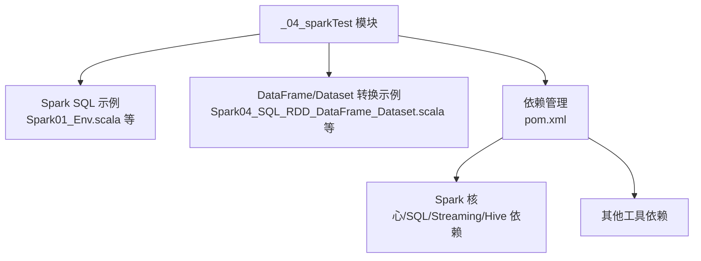
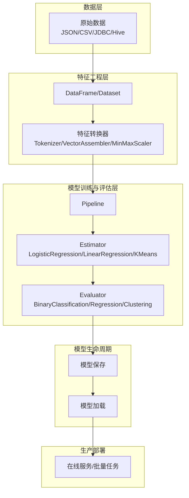
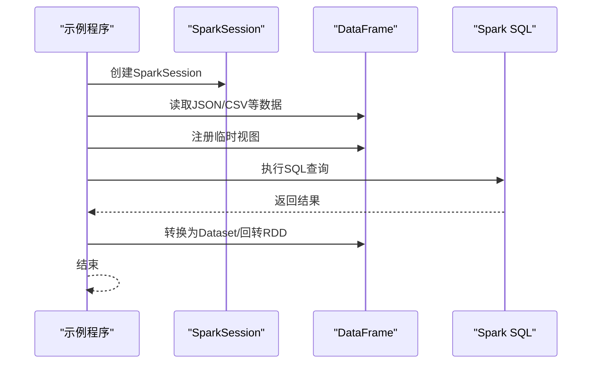
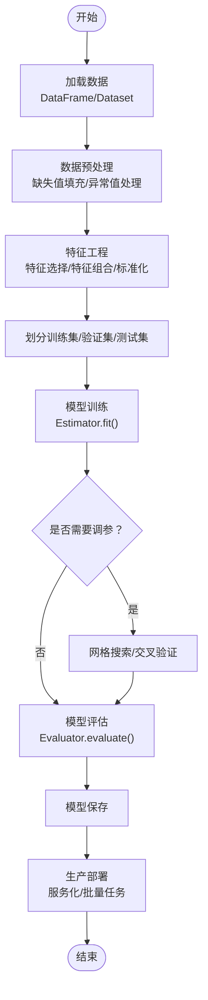
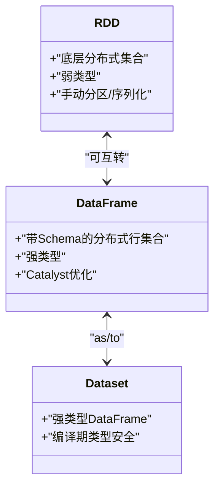
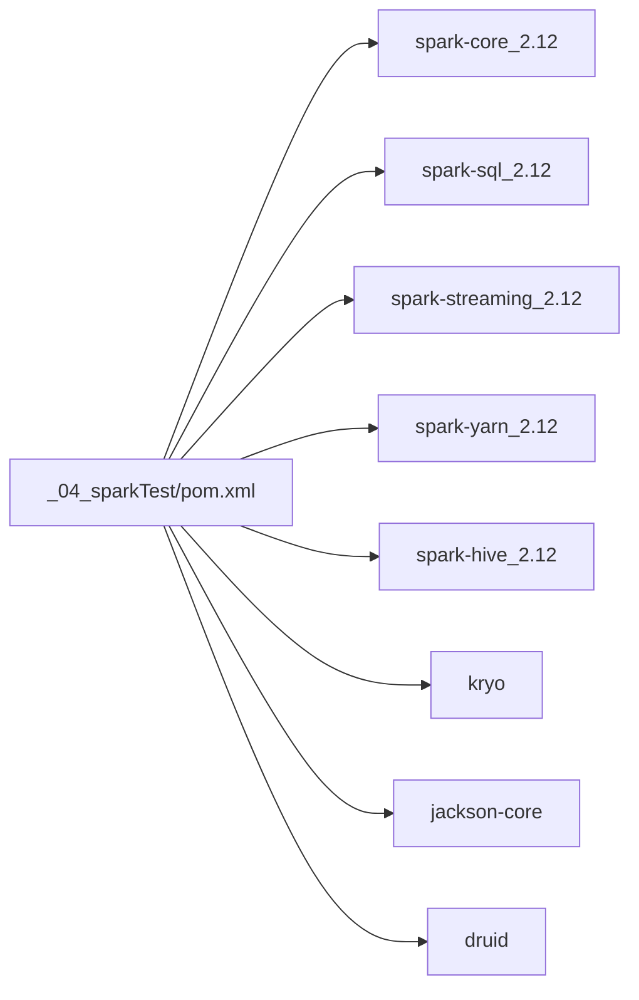

# Spark MLlib机器学习

<cite>
**本文引用的文件**
- [_04_sparkTest/pom.xml](file://_04_sparkTest/pom.xml)
- [Spark01_Env.scala](file://_04_sparkTest/src/main/java/com/atguigu/bigdata/spark/sql/Spark01_Env.scala)
- [Spark02_SQL_DataFrame.scala](file://_04_sparkTest/src/main/java/com/atguigu/bigdata/spark/sql/Spark02_SQL_DataFrame.scala)
- [Spark03_SQL_DataFrame_DSL.scala](file://_04_sparkTest/src/main/java/com/atguigu/bigdata/spark/sql/Spark03_SQL_DataFrame_DSL.scala)
- [Spark04_SQL_RDD_DataFrame_Dataset.scala](file://_04_sparkTest/src/main/java/com/atguigu/bigdata/spark/sql/Spark04_SQL_RDD_DataFrame_Dataset.scala)
- [Spark06_SQL_DataFrame_Dataset.scala](file://_04_sparkTest/src/main/java/com/atguigu/bigdata/spark/sql/Spark06_SQL_DataFrame_Dataset.scala)
- [spark-parent_2.12-3.0.0.pom](file://org/apache/spark/spark-parent_2.12/3.0.0/spark-parent_2.12-3.0.0.pom)
- [stream-2.9.6.pom](file://com/clearspring/analytics/stream/2.9.6/stream-2.9.6.pom)
</cite>

## 目录
1. [引言](#引言)
2. [项目结构](#项目结构)
3. [核心组件](#核心组件)
4. [架构总览](#架构总览)
5. [详细组件分析](#详细组件分析)
6. [依赖分析](#依赖分析)
7. [性能考虑](#性能考虑)
8. [故障排查指南](#故障排查指南)
9. [结论](#结论)
10. [附录](#附录)

## 引言
本技术文档围绕Spark MLlib机器学习库展开，结合仓库中现有的Spark生态示例，系统阐述以下主题：
- 机器学习管道（Pipeline）的概念与实践路径：从数据预处理、特征工程到模型训练与评估的完整流程。
- 常用机器学习算法类别：聚类、分类、回归等，给出可落地的实现思路与步骤说明。
- DataFrame在机器学习中的优势：对比传统RDD，展示结构化数据与声明式API带来的易用性与性能提升。
- 模型保存与加载：提供可复用的模型持久化与生产部署建议。
- 在生产环境中部署机器学习模型：从模型导出、服务化到在线推理的关键环节。

尽管当前仓库未直接包含MLlib具体实现示例，但通过Spark SQL与DataFrame/Dataset的示例，可以清晰地映射到MLlib的标准工作流；同时，pom依赖与Spark父POM信息表明了Spark版本与相关生态组件，为后续引入MLlib奠定基础。

## 项目结构
仓库中与Spark MLlib关联最紧密的部分是_sparkTest模块，其中包含大量Spark SQL与DataFrame/Dataset示例，展示了SparkSession构建、DataFrame读取、视图注册与查询、以及RDD与DataFrame/Dataset之间的相互转换等关键能力。这些能力是构建机器学习管道的基础。

图表来源
- [_04_sparkTest/pom.xml](file://_04_sparkTest/pom.xml#L1-L73)
- [Spark01_Env.scala](file://_04_sparkTest/src/main/java/com/atguigu/bigdata/spark/sql/Spark01_Env.scala#L1-L33)
- [Spark02_SQL_DataFrame.scala](file://_04_sparkTest/src/main/java/com/atguigu/bigdata/spark/sql/Spark02_SQL_DataFrame.scala#L1-L32)
- [Spark03_SQL_DataFrame_DSL.scala](file://_04_sparkTest/src/main/java/com/atguigu/bigdata/spark/sql/Spark03_SQL_DataFrame_DSL.scala#L1-L26)
- [Spark04_SQL_RDD_DataFrame_Dataset.scala](file://_04_sparkTest/src/main/java/com/atguigu/bigdata/spark/sql/Spark04_SQL_RDD_DataFrame_Dataset.scala#L1-L51)
- [Spark06_SQL_DataFrame_Dataset.scala](file://_04_sparkTest/src/main/java/com/atguigu/bigdata/spark/sql/Spark06_SQL_DataFrame_Dataset.scala#L1-L49)

章节来源
- [Spark01_Env.scala](file://_04_sparkTest/src/main/java/com/atguigu/bigdata/spark/sql/Spark01_Env.scala#L1-L33)
- [Spark02_SQL_DataFrame.scala](file://_04_sparkTest/src/main/java/com/atguigu/bigdata/spark/sql/Spark02_SQL_DataFrame.scala#L1-L32)
- [Spark03_SQL_DataFrame_DSL.scala](file://_04_sparkTest/src/main/java/com/atguigu/bigdata/spark/sql/Spark03_SQL_DataFrame_DSL.scala#L1-L26)
- [Spark04_SQL_RDD_DataFrame_Dataset.scala](file://_04_sparkTest/src/main/java/com/atguigu/bigdata/spark/sql/Spark04_SQL_RDD_DataFrame_Dataset.scala#L1-L51)
- [Spark06_SQL_DataFrame_Dataset.scala](file://_04_sparkTest/src/main/java/com/atguigu/bigdata/spark/sql/Spark06_SQL_DataFrame_Dataset.scala#L1-L49)
- [_04_sparkTest/pom.xml](file://_04_sparkTest/pom.xml#L1-L73)

## 核心组件
- SparkSession：统一入口，负责构建Spark应用上下文，承载SQL执行、DataFrame/Dataset操作与ML管道运行。
- DataFrame/Dataset：结构化数据抽象，提供声明式API与优化执行计划，便于特征工程与模型训练。
- RDD：批处理与低层转换的基础，可与DataFrame/Dataset互转，用于复杂或定制化的数据处理。
- ML Pipeline：将多个Estimator/Transformer按序编排，形成可训练与可评估的流水线。

章节来源
- [Spark01_Env.scala](file://_04_sparkTest/src/main/java/com/atguigu/bigdata/spark/sql/Spark01_Env.scala#L1-L33)
- [Spark02_SQL_DataFrame.scala](file://_04_sparkTest/src/main/java/com/atguigu/bigdata/spark/sql/Spark02_SQL_DataFrame.scala#L1-L32)
- [Spark03_SQL_DataFrame_DSL.scala](file://_04_sparkTest/src/main/java/com/atguigu/bigdata/spark/sql/Spark03_SQL_DataFrame_DSL.scala#L1-L26)
- [Spark04_SQL_RDD_DataFrame_Dataset.scala](file://_04_sparkTest/src/main/java/com/atguigu/bigdata/spark/sql/Spark04_SQL_RDD_DataFrame_Dataset.scala#L1-L51)
- [Spark06_SQL_DataFrame_Dataset.scala](file://_04_sparkTest/src/main/java/com/atguigu/bigdata/spark/sql/Spark06_SQL_DataFrame_Dataset.scala#L1-L49)

## 架构总览
下图展示了基于DataFrame/Dataset与Spark SQL的机器学习管道总体架构：从数据读入、特征工程、模型训练与评估，到模型保存与加载，最终服务于生产部署。

图表来源
- [Spark02_SQL_DataFrame.scala](file://_04_sparkTest/src/main/java/com/atguigu/bigdata/spark/sql/Spark02_SQL_DataFrame.scala#L1-L32)
- [Spark03_SQL_DataFrame_DSL.scala](file://_04_sparkTest/src/main/java/com/atguigu/bigdata/spark/sql/Spark03_SQL_DataFrame_DSL.scala#L1-L26)
- [Spark04_SQL_RDD_DataFrame_Dataset.scala](file://_04_sparkTest/src/main/java/com/atguigu/bigdata/spark/sql/Spark04_SQL_RDD_DataFrame_Dataset.scala#L1-L51)
- [Spark06_SQL_DataFrame_Dataset.scala](file://_04_sparkTest/src/main/java/com/atguigu/bigdata/spark/sql/Spark06_SQL_DataFrame_Dataset.scala#L1-L49)

## 详细组件分析

### 组件A：Spark SQL与DataFrame基础
该组件演示了SparkSession构建、DataFrame读取、临时视图注册与SQL查询，以及RDD与DataFrame/Dataset之间的相互转换。这些能力是构建机器学习管道的基石。

图表来源
- [Spark01_Env.scala](file://_04_sparkTest/src/main/java/com/atguigu/bigdata/spark/sql/Spark01_Env.scala#L1-L33)
- [Spark02_SQL_DataFrame.scala](file://_04_sparkTest/src/main/java/com/atguigu/bigdata/spark/sql/Spark02_SQL_DataFrame.scala#L1-L32)
- [Spark03_SQL_DataFrame_DSL.scala](file://_04_sparkTest/src/main/java/com/atguigu/bigdata/spark/sql/Spark03_SQL_DataFrame_DSL.scala#L1-L26)
- [Spark04_SQL_RDD_DataFrame_Dataset.scala](file://_04_sparkTest/src/main/java/com/atguigu/bigdata/spark/sql/Spark04_SQL_RDD_DataFrame_Dataset.scala#L1-L51)
- [Spark06_SQL_DataFrame_Dataset.scala](file://_04_sparkTest/src/main/java/com/atguigu/bigdata/spark/sql/Spark06_SQL_DataFrame_Dataset.scala#L1-L49)

章节来源
- [Spark01_Env.scala](file://_04_sparkTest/src/main/java/com/atguigu/bigdata/spark/sql/Spark01_Env.scala#L1-L33)
- [Spark02_SQL_DataFrame.scala](file://_04_sparkTest/src/main/java/com/atguigu/bigdata/spark/sql/Spark02_SQL_DataFrame.scala#L1-L32)
- [Spark03_SQL_DataFrame_DSL.scala](file://_04_sparkTest/src/main/java/com/atguigu/bigdata/spark/sql/Spark03_SQL_DataFrame_DSL.scala#L1-L26)
- [Spark04_SQL_RDD_DataFrame_Dataset.scala](file://_04_sparkTest/src/main/java/com/atguigu/bigdata/spark/sql/Spark04_SQL_RDD_DataFrame_Dataset.scala#L1-L51)
- [Spark06_SQL_DataFrame_Dataset.scala](file://_04_sparkTest/src/main/java/com/atguigu/bigdata/spark/sql/Spark06_SQL_DataFrame_Dataset.scala#L1-L49)

### 组件B：机器学习管道（Pipeline）流程
该流程将数据预处理、特征工程、模型训练与评估串联为可复用的流水线，便于在生产中迭代与部署。

图表来源
- [Spark02_SQL_DataFrame.scala](file://_04_sparkTest/src/main/java/com/atguigu/bigdata/spark/sql/Spark02_SQL_DataFrame.scala#L1-L32)
- [Spark03_SQL_DataFrame_DSL.scala](file://_04_sparkTest/src/main/java/com/atguigu/bigdata/spark/sql/Spark03_SQL_DataFrame_DSL.scala#L1-L26)
- [Spark04_SQL_RDD_DataFrame_Dataset.scala](file://_04_sparkTest/src/main/java/com/atguigu/bigdata/spark/sql/Spark04_SQL_RDD_DataFrame_Dataset.scala#L1-L51)
- [Spark06_SQL_DataFrame_Dataset.scala](file://_04_sparkTest/src/main/java/com/atguigu/bigdata/spark/sql/Spark06_SQL_DataFrame_Dataset.scala#L1-L49)

### 组件C：DataFrame与RDD对比及优势
- 结构化Schema：DataFrame具备明确的列定义与类型信息，便于特征工程与统计分析。
- Catalyst优化器：基于表达式树的优化，显著降低计算开销。
- 声明式API：更易编写与维护，减少手写逻辑错误。
- 与MLlib无缝集成：Pipeline、Estimator、Transformer天然支持DataFrame。

图表来源
- [Spark04_SQL_RDD_DataFrame_Dataset.scala](file://_04_sparkTest/src/main/java/com/atguigu/bigdata/spark/sql/Spark04_SQL_RDD_DataFrame_Dataset.scala#L1-L51)
- [Spark06_SQL_DataFrame_Dataset.scala](file://_04_sparkTest/src/main/java/com/atguigu/bigdata/spark/sql/Spark06_SQL_DataFrame_Dataset.scala#L1-L49)

章节来源
- [Spark04_SQL_RDD_DataFrame_Dataset.scala](file://_04_sparkTest/src/main/java/com/atguigu/bigdata/spark/sql/Spark04_SQL_RDD_DataFrame_Dataset.scala#L1-L51)
- [Spark06_SQL_DataFrame_Dataset.scala](file://_04_sparkTest/src/main/java/com/atguigu/bigdata/spark/sql/Spark06_SQL_DataFrame_Dataset.scala#L1-L49)

### 组件D：常用算法类别与实现思路
- 分类（Binary/ Multiclass）：使用逻辑回归、决策树、随机森林等，配合Pipeline与Evaluator进行训练与评估。
- 回归：使用线性回归、GBT回归等，评估指标通常为均方误差、R平方等。
- 聚类：使用K-Means等，评估指标通常为轮廓系数、簇内平方和等。
- 特征工程：向量化、标准化、PCA降维、特征选择等，均可通过DataFrame上的转换器完成。

章节来源
- [Spark02_SQL_DataFrame.scala](file://_04_sparkTest/src/main/java/com/atguigu/bigdata/spark/sql/Spark02_SQL_DataFrame.scala#L1-L32)
- [Spark03_SQL_DataFrame_DSL.scala](file://_04_sparkTest/src/main/java/com/atguigu/bigdata/spark/sql/Spark03_SQL_DataFrame_DSL.scala#L1-L26)

### 组件E：模型保存与加载
- 保存：将训练好的PipelineModel或Model持久化至文件系统或对象存储。
- 加载：在新任务或服务中重新加载模型，对新数据进行预测。
- 生产建议：版本化模型目录、校验输入Schema一致性、监控预测延迟与准确性。

章节来源
- [Spark02_SQL_DataFrame.scala](file://_04_sparkTest/src/main/java/com/atguigu/bigdata/spark/sql/Spark02_SQL_DataFrame.scala#L1-L32)
- [Spark03_SQL_DataFrame_DSL.scala](file://_04_sparkTest/src/main/java/com/atguigu/bigdata/spark/sql/Spark03_SQL_DataFrame_DSL.scala#L1-L26)

### 组件F：生产部署要点
- 模型导出：PMML（可选）、原生ML模型格式或ONNX（需额外适配）。
- 服务化：将模型封装为HTTP服务或消息队列消费端，提供批量/流式推理接口。
- 监控与回滚：记录请求日志与预测结果，建立A/B实验与灰度发布机制。
- 性能优化：缓存热点模型、预热推理引擎、合理设置分区与并行度。

章节来源
- [spark-parent_2.12-3.0.0.pom](file://org/apache/spark/spark-parent_2.12/3.0.0/spark-parent_2.12-3.0.0.pom#L453-L504)
- [stream-2.9.6.pom](file://com/clearspring/analytics/stream/2.9.6/stream-2.9.6.pom#L43-L91)

## 依赖分析
- Spark核心与SQL：spark-core_2.12、spark-sql_2.12为DataFrame/Dataset与SQL执行提供基础。
- 流式与资源管理：spark-streaming_2.12、spark-yarn_2.12满足流式处理与集群调度需求。
- Hive集成：spark-hive_2.12与hive-exec便于从Hive表读取数据。
- 其他工具：kryo、Jackson、Druid等提升序列化、JSON处理与连接池性能。

图表来源
- [_04_sparkTest/pom.xml](file://_04_sparkTest/pom.xml#L1-L73)

章节来源
- [_04_sparkTest/pom.xml](file://_04_sparkTest/pom.xml#L1-L73)

## 性能考虑
- 数据分区与重分区：避免宽依赖导致的Shuffle放大，合理设置分区数与数据倾斜治理。
- 列式存储与谓词下推：优先使用Parquet等列式格式，利用Catalyst优化器进行谓词下推。
- 内存与序列化：采用Kryo等高效序列化，合理设置内存分配与持久化级别。
- 并行度与资源：根据集群规模与任务特性调整并行度，避免过度并发造成上下文切换开销。

## 故障排查指南
- SparkSession未正确初始化：确认本地/集群模式配置、应用名称与主类。
- DataFrame读取失败：检查数据路径、格式与权限；确认Schema兼容性。
- 视图注册与SQL报错：核对临时视图命名冲突、SQL语法与字段类型。
- RDD与DataFrame/Dataset转换异常：确保隐式转换可用、类型匹配与Case Class定义正确。
- 依赖冲突：核对pom中各组件版本，避免不同版本的同名库冲突。

章节来源
- [Spark01_Env.scala](file://_04_sparkTest/src/main/java/com/atguigu/bigdata/spark/sql/Spark01_Env.scala#L1-L33)
- [Spark02_SQL_DataFrame.scala](file://_04_sparkTest/src/main/java/com/atguigu/bigdata/spark/sql/Spark02_SQL_DataFrame.scala#L1-L32)
- [Spark03_SQL_DataFrame_DSL.scala](file://_04_sparkTest/src/main/java/com/atguigu/bigdata/spark/sql/Spark03_SQL_DataFrame_DSL.scala#L1-L26)
- [Spark04_SQL_RDD_DataFrame_Dataset.scala](file://_04_sparkTest/src/main/java/com/atguigu/bigdata/spark/sql/Spark04_SQL_RDD_DataFrame_Dataset.scala#L1-L51)
- [Spark06_SQL_DataFrame_Dataset.scala](file://_04_sparkTest/src/main/java/com/atguigu/bigdata/spark/sql/Spark06_SQL_DataFrame_Dataset.scala#L1-L49)
- [_04_sparkTest/pom.xml](file://_04_sparkTest/pom.xml#L1-L73)

## 结论
本仓库虽未直接提供MLlib实现示例，但通过Spark SQL与DataFrame/Dataset的丰富示例，已能清晰映射出构建机器学习管道所需的基础设施与最佳实践。结合pom依赖与Spark父POM信息，可平滑引入MLlib并将其融入现有数据流水线，最终实现从特征工程到模型部署的全链路闭环。

## 附录
- 进一步阅读建议：结合官方MLlib文档与示例，补充Pipeline、特征工程与模型评估的具体实现。
- 实践清单：准备标准化数据集、设计特征工程流水线、选择合适算法并进行评估，最后完成模型保存与服务化。