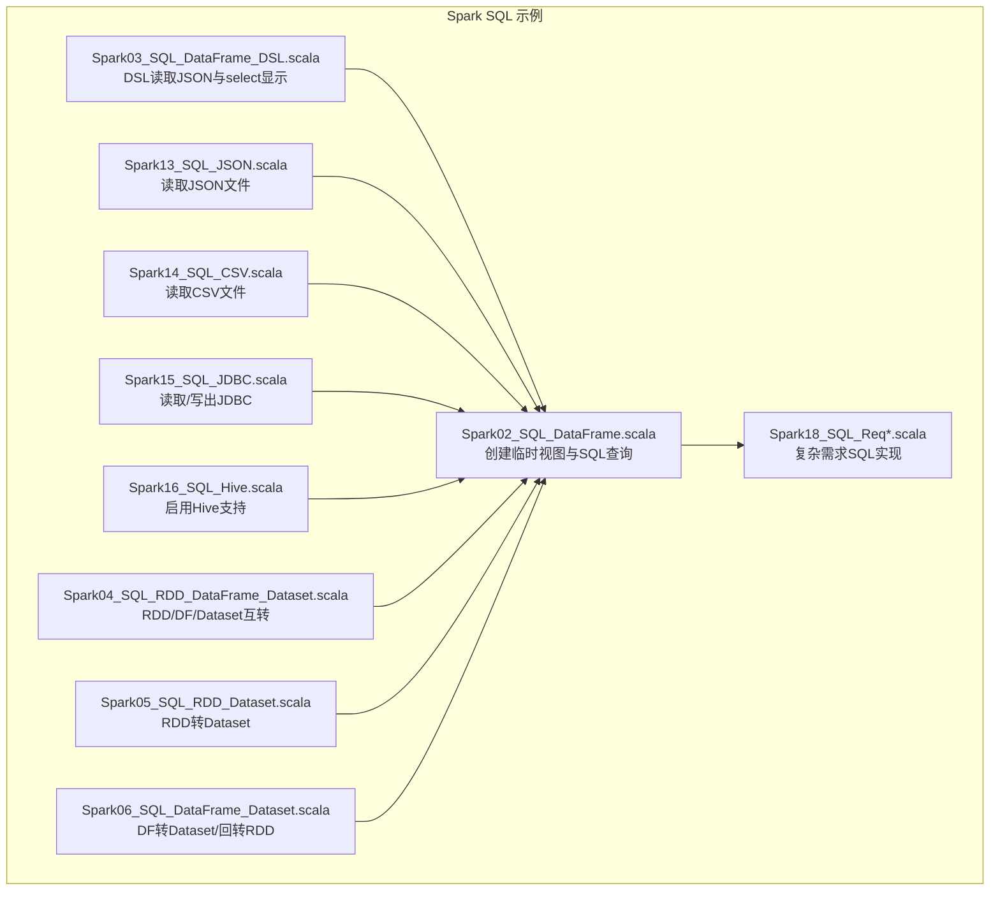
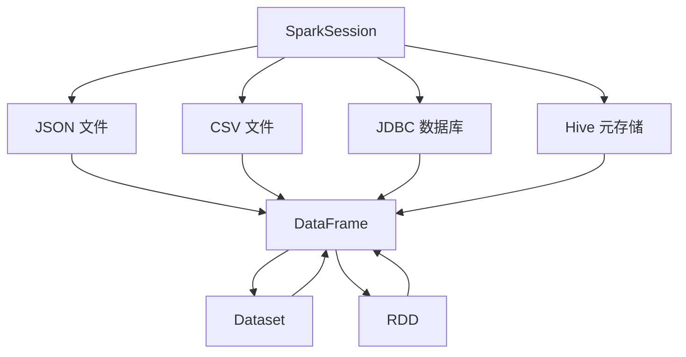
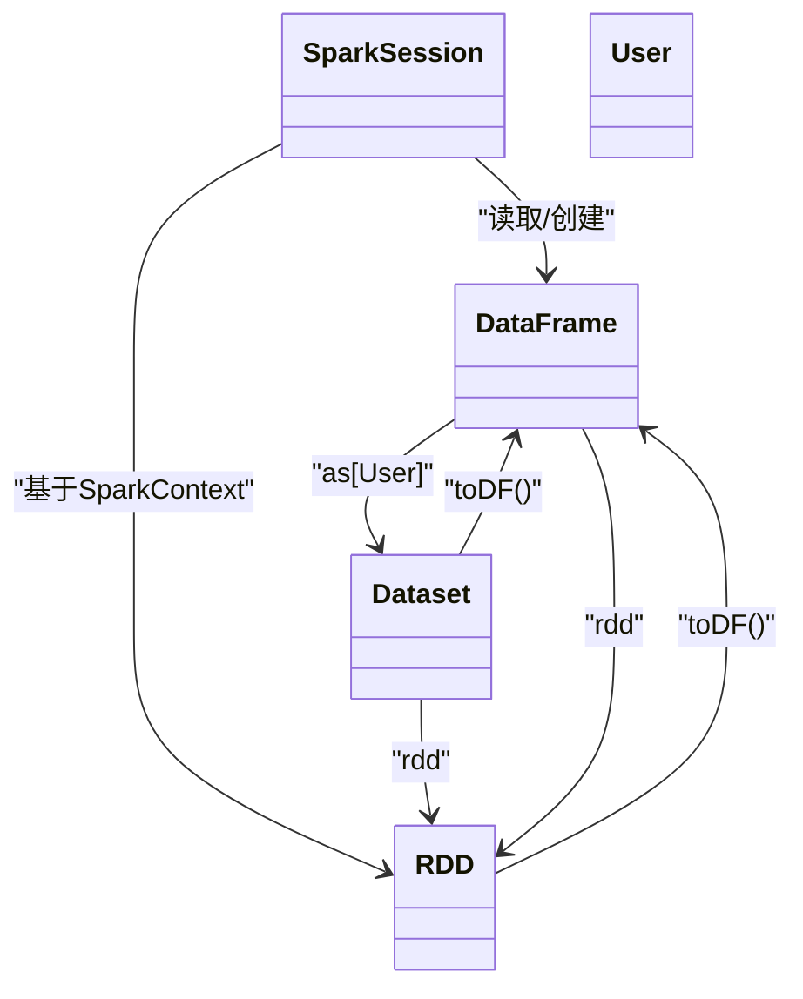
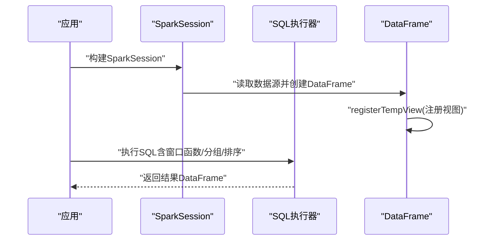
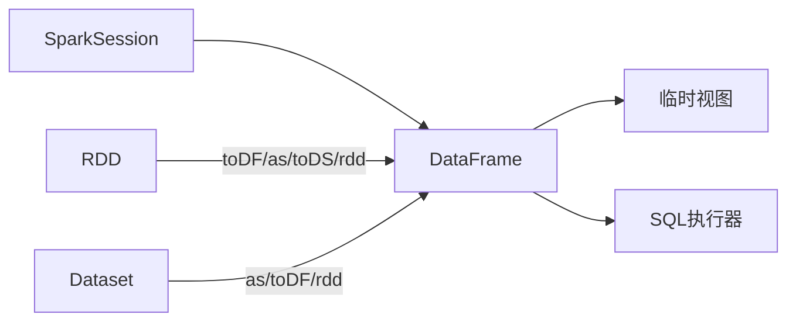

# DataFrame基础操作

<cite>
**本文引用的文件**
- [Spark02_SQL_DataFrame.scala](file://_04_sparkTest/src/main/java/com/atguigu/bigdata/spark/sql/Spark02_SQL_DataFrame.scala)
- [Spark03_SQL_DataFrame_DSL.scala](file://_04_sparkTest/src/main/java/com/atguigu/bigdata/spark/sql/Spark03_SQL_DataFrame_DSL.scala)
- [Spark04_SQL_RDD_DataFrame_Dataset.scala](file://_04_sparkTest/src/main/java/com/atguigu/bigdata/spark/sql/Spark04_SQL_RDD_DataFrame_Dataset.scala)
- [Spark05_SQL_RDD_Dataset.scala](file://_04_sparkTest/src/main/java/com/atguigu/bigdata/spark/sql/Spark05_SQL_RDD_Dataset.scala)
- [Spark06_SQL_DataFrame_Dataset.scala](file://_04_sparkTest/src/main/java/com/atguigu/bigdata/spark/sql/Spark06_SQL_DataFrame_Dataset.scala)
- [Spark13_SQL_JSON.scala](file://_04_sparkTest/src/main/java/com/atguigu/bigdata/spark/sql/Spark13_SQL_JSON.scala)
- [Spark14_SQL_CSV.scala](file://_04_sparkTest/src/main/java/com/atguigu/bigdata/spark/sql/Spark14_SQL_CSV.scala)
- [Spark15_SQL_JDBC.scala](file://_04_sparkTest/src/main/java/com/atguigu/bigdata/spark/sql/Spark15_SQL_JDBC.scala)
- [Spark16_SQL_Hive.scala](file://_04_sparkTest/src/main/java/com/atguigu/bigdata/spark/sql/Spark16_SQL_Hive.scala)
- [Spark18_SQL_Req.scala](file://_04_sparkTest/src/main/java/com/atguigu/bigdata/spark/sql/Spark18_SQL_Req.scala)
- [Spark18_SQL_Req_1.scala](file://_04_sparkTest/src/main/java/com/atguigu/bigdata/spark/sql/Spark18_SQL_Req_1.scala)
- [Spark18_SQL_Req_2.scala](file://_04_sparkTest/src/main/java/com/atguigu/bigdata/spark/sql/Spark18_SQL_Req_2.scala)
</cite>

## 目录
1. [引言](#引言)
2. [项目结构](#项目结构)
3. [核心组件](#核心组件)
4. [架构总览](#架构总览)
5. [详细组件分析](#详细组件分析)
6. [依赖关系分析](#依赖关系分析)
7. [性能考虑](#性能考虑)
8. [故障排查指南](#故障排查指南)
9. [结论](#结论)
10. [附录](#附录)

## 引言
本文件围绕DataFrame的基础操作，系统梳理SparkSession创建DataFrame、从多种数据源（JSON、CSV、JDBC、Hive）读取数据的方法，并结合仓库中的示例演示DataFrame DSL语法（select、filter、groupBy、orderBy等）与SQL语法的使用方式。同时，对比DataFrame与RDD/Dataset的关系及适用场景，并给出性能优化建议。

## 项目结构
本仓库中与DataFrame相关的核心示例集中在“_04_sparkTest/src/main/java/com/atguigu/bigdata/spark/sql”目录下，涵盖环境搭建、数据源读取、视图与SQL查询、DSL操作、三者转换、以及复杂需求的SQL实现等主题。

图表来源
- [Spark02_SQL_DataFrame.scala](file://_04_sparkTest/src/main/java/com/atguigu/bigdata/spark/sql/Spark02_SQL_DataFrame.scala#L1-L32)
- [Spark03_SQL_DataFrame_DSL.scala](file://_04_sparkTest/src/main/java/com/atguigu/bigdata/spark/sql/Spark03_SQL_DataFrame_DSL.scala#L1-L27)
- [Spark13_SQL_JSON.scala](file://_04_sparkTest/src/main/java/com/atguigu/bigdata/spark/sql/Spark13_SQL_JSON.scala#L1-L30)
- [Spark14_SQL_CSV.scala](file://_04_sparkTest/src/main/java/com/atguigu/bigdata/spark/sql/Spark14_SQL_CSV.scala#L1-L28)
- [Spark15_SQL_JDBC.scala](file://_04_sparkTest/src/main/java/com/atguigu/bigdata/spark/sql/Spark15_SQL_JDBC.scala#L1-L39)
- [Spark16_SQL_Hive.scala](file://_04_sparkTest/src/main/java/com/atguigu/bigdata/spark/sql/Spark16_SQL_Hive.scala#L1-L27)
- [Spark04_SQL_RDD_DataFrame_Dataset.scala](file://_04_sparkTest/src/main/java/com/atguigu/bigdata/spark/sql/Spark04_SQL_RDD_DataFrame_Dataset.scala#L1-L52)
- [Spark05_SQL_RDD_Dataset.scala](file://_04_sparkTest/src/main/java/com/atguigu/bigdata/spark/sql/Spark05_SQL_RDD_Dataset.scala#L1-L44)
- [Spark06_SQL_DataFrame_Dataset.scala](file://_04_sparkTest/src/main/java/com/atguigu/bigdata/spark/sql/Spark06_SQL_DataFrame_Dataset.scala#L1-L50)
- [Spark18_SQL_Req.scala](file://_04_sparkTest/src/main/java/com/atguigu/bigdata/spark/sql/Spark18_SQL_Req.scala#L1-L43)

章节来源
- [Spark02_SQL_DataFrame.scala](file://_04_sparkTest/src/main/java/com/atguigu/bigdata/spark/sql/Spark02_SQL_DataFrame.scala#L1-L32)
- [Spark03_SQL_DataFrame_DSL.scala](file://_04_sparkTest/src/main/java/com/atguigu/bigdata/spark/sql/Spark03_SQL_DataFrame_DSL.scala#L1-L27)
- [Spark13_SQL_JSON.scala](file://_04_sparkTest/src/main/java/com/atguigu/bigdata/spark/sql/Spark13_SQL_JSON.scala#L1-L30)
- [Spark14_SQL_CSV.scala](file://_04_sparkTest/src/main/java/com/atguigu/bigdata/spark/sql/Spark14_SQL_CSV.scala#L1-L28)
- [Spark15_SQL_JDBC.scala](file://_04_sparkTest/src/main/java/com/atguigu/bigdata/spark/sql/Spark15_SQL_JDBC.scala#L1-L39)
- [Spark16_SQL_Hive.scala](file://_04_sparkTest/src/main/java/com/atguigu/bigdata/spark/sql/Spark16_SQL_Hive.scala#L1-L27)
- [Spark04_SQL_RDD_DataFrame_Dataset.scala](file://_04_sparkTest/src/main/java/com/atguigu/bigdata/spark/sql/Spark04_SQL_RDD_DataFrame_Dataset.scala#L1-L52)
- [Spark05_SQL_RDD_Dataset.scala](file://_04_sparkTest/src/main/java/com/atguigu/bigdata/spark/sql/Spark05_SQL_RDD_Dataset.scala#L1-L44)
- [Spark06_SQL_DataFrame_Dataset.scala](file://_04_sparkTest/src/main/java/com/atguigu/bigdata/spark/sql/Spark06_SQL_DataFrame_Dataset.scala#L1-L50)
- [Spark18_SQL_Req.scala](file://_04_sparkTest/src/main/java/com/atguigu/bigdata/spark/sql/Spark18_SQL_Req.scala#L1-L43)

## 核心组件
- SparkSession：DataFrame读取、写入、SQL执行与临时视图管理的入口。
- DataFrame：结构化数据抽象，支持DSL与SQL两种表达方式。
- Dataset：强类型数据集，可视为特定类型的DataFrame。
- RDD：弹性分布式数据集，可与DataFrame/Dataset相互转换。

章节来源
- [Spark02_SQL_DataFrame.scala](file://_04_sparkTest/src/main/java/com/atguigu/bigdata/spark/sql/Spark02_SQL_DataFrame.scala#L1-L32)
- [Spark03_SQL_DataFrame_DSL.scala](file://_04_sparkTest/src/main/java/com/atguigu/bigdata/spark/sql/Spark03_SQL_DataFrame_DSL.scala#L1-L27)
- [Spark04_SQL_RDD_DataFrame_Dataset.scala](file://_04_sparkTest/src/main/java/com/atguigu/bigdata/spark/sql/Spark04_SQL_RDD_DataFrame_Dataset.scala#L1-L52)
- [Spark05_SQL_RDD_Dataset.scala](file://_04_sparkTest/src/main/java/com/atguigu/bigdata/spark/sql/Spark05_SQL_RDD_Dataset.scala#L1-L44)
- [Spark06_SQL_DataFrame_Dataset.scala](file://_04_sparkTest/src/main/java/com/atguigu/bigdata/spark/sql/Spark06_SQL_DataFrame_Dataset.scala#L1-L50)

## 架构总览
下图展示了从数据源到DataFrame再到SQL或DSL处理的整体流程，以及三者之间的转换关系。

图表来源
- [Spark02_SQL_DataFrame.scala](file://_04_sparkTest/src/main/java/com/atguigu/bigdata/spark/sql/Spark02_SQL_DataFrame.scala#L1-L32)
- [Spark03_SQL_DataFrame_DSL.scala](file://_04_sparkTest/src/main/java/com/atguigu/bigdata/spark/sql/Spark03_SQL_DataFrame_DSL.scala#L1-L27)
- [Spark13_SQL_JSON.scala](file://_04_sparkTest/src/main/java/com/atguigu/bigdata/spark/sql/Spark13_SQL_JSON.scala#L1-L30)
- [Spark14_SQL_CSV.scala](file://_04_sparkTest/src/main/java/com/atguigu/bigdata/spark/sql/Spark14_SQL_CSV.scala#L1-L28)
- [Spark15_SQL_JDBC.scala](file://_04_sparkTest/src/main/java/com/atguigu/bigdata/spark/sql/Spark15_SQL_JDBC.scala#L1-L39)
- [Spark16_SQL_Hive.scala](file://_04_sparkTest/src/main/java/com/atguigu/bigdata/spark/sql/Spark16_SQL_Hive.scala#L1-L27)
- [Spark04_SQL_RDD_DataFrame_Dataset.scala](file://_04_sparkTest/src/main/java/com/atguigu/bigdata/spark/sql/Spark04_SQL_RDD_DataFrame_Dataset.scala#L1-L52)
- [Spark05_SQL_RDD_Dataset.scala](file://_04_sparkTest/src/main/java/com/atguigu/bigdata/spark/sql/Spark05_SQL_RDD_Dataset.scala#L1-L44)
- [Spark06_SQL_DataFrame_Dataset.scala](file://_04_sparkTest/src/main/java/com/atguigu/bigdata/spark/sql/Spark06_SQL_DataFrame_Dataset.scala#L1-L50)

## 详细组件分析

### 1) 创建与读取DataFrame
- 使用SparkSession.builder构建会话，随后通过spark.read加载不同格式数据源。
- JSON：逐行符合JSON格式即可被解析。
- CSV：可通过format("csv")并设置sep、inferSchema、header等选项。
- JDBC：通过format("jdbc")并配置url、driver、user、password、dbtable等。
- Hive：启用HiveSupport后可直接执行SQL。

章节来源
- [Spark03_SQL_DataFrame_DSL.scala](file://_04_sparkTest/src/main/java/com/atguigu/bigdata/spark/sql/Spark03_SQL_DataFrame_DSL.scala#L1-L27)
- [Spark13_SQL_JSON.scala](file://_04_sparkTest/src/main/java/com/atguigu/bigdata/spark/sql/Spark13_SQL_JSON.scala#L1-L30)
- [Spark14_SQL_CSV.scala](file://_04_sparkTest/src/main/java/com/atguigu/bigdata/spark/sql/Spark14_SQL_CSV.scala#L1-L28)
- [Spark15_SQL_JDBC.scala](file://_04_sparkTest/src/main/java/com/atguigu/bigdata/spark/sql/Spark15_SQL_JDBC.scala#L1-L39)
- [Spark16_SQL_Hive.scala](file://_04_sparkTest/src/main/java/com/atguigu/bigdata/spark/sql/Spark16_SQL_Hive.scala#L1-L27)

### 2) DataFrame DSL语法与基本操作
- select：选择列或表达式，支持通配符与派生列。
- filter：按条件过滤行。
- groupBy：按一列或多列分组，常与聚合函数配合。
- orderBy：按一列或多列排序。
- createOrReplaceTempView：将DataFrame注册为临时视图，以便SQL查询。
- show：打印DataFrame内容（生产环境建议限制行数）。

示例路径
- [Spark02_SQL_DataFrame.scala](file://_04_sparkTest/src/main/java/com/atguigu/bigdata/spark/sql/Spark02_SQL_DataFrame.scala#L1-L32)
- [Spark03_SQL_DataFrame_DSL.scala](file://_04_sparkTest/src/main/java/com/atguigu/bigdata/spark/sql/Spark03_SQL_DataFrame_DSL.scala#L1-L27)

章节来源
- [Spark02_SQL_DataFrame.scala](file://_04_sparkTest/src/main/java/com/atguigu/bigdata/spark/sql/Spark02_SQL_DataFrame.scala#L1-L32)
- [Spark03_SQL_DataFrame_DSL.scala](file://_04_sparkTest/src/main/java/com/atguigu/bigdata/spark/sql/Spark03_SQL_DataFrame_DSL.scala#L1-L27)

### 3) DataFrame与RDD/Dataset的转换
- RDD → DataFrame：使用implicits导入后，调用toDF并可指定列名。
- DataFrame → Dataset：使用as[类型]进行强类型转换。
- Dataset → DataFrame：使用toDF回退为弱类型。
- Dataset/RDD之间也可互相转换（rdd与toDS）。

图表来源
- [Spark04_SQL_RDD_DataFrame_Dataset.scala](file://_04_sparkTest/src/main/java/com/atguigu/bigdata/spark/sql/Spark04_SQL_RDD_DataFrame_Dataset.scala#L1-L52)
- [Spark05_SQL_RDD_Dataset.scala](file://_04_sparkTest/src/main/java/com/atguigu/bigdata/spark/sql/Spark05_SQL_RDD_Dataset.scala#L1-L44)
- [Spark06_SQL_DataFrame_Dataset.scala](file://_04_sparkTest/src/main/java/com/atguigu/bigdata/spark/sql/Spark06_SQL_DataFrame_Dataset.scala#L1-L50)

章节来源
- [Spark04_SQL_RDD_DataFrame_Dataset.scala](file://_04_sparkTest/src/main/java/com/atguigu/bigdata/spark/sql/Spark04_SQL_RDD_DataFrame_Dataset.scala#L1-L52)
- [Spark05_SQL_RDD_Dataset.scala](file://_04_sparkTest/src/main/java/com/atguigu/bigdata/spark/sql/Spark05_SQL_RDD_Dataset.scala#L1-L44)
- [Spark06_SQL_DataFrame_Dataset.scala](file://_04_sparkTest/src/main/java/com/atguigu/bigdata/spark/sql/Spark06_SQL_DataFrame_Dataset.scala#L1-L50)

### 4) 复杂需求与窗口函数
- 通过SQL实现分组、排序与排名（rank over partition by）。
- 支持多表关联与临时视图创建，便于后续查询。

图表来源
- [Spark18_SQL_Req.scala](file://_04_sparkTest/src/main/java/com/atguigu/bigdata/spark/sql/Spark18_SQL_Req.scala#L1-L43)
- [Spark18_SQL_Req_1.scala](file://_04_sparkTest/src/main/java/com/atguigu/bigdata/spark/sql/Spark18_SQL_Req_1.scala#L1-L39)
- [Spark18_SQL_Req_2.scala](file://_04_sparkTest/src/main/java/com/atguigu/bigdata/spark/sql/Spark18_SQL_Req_2.scala#L1-L200)

章节来源
- [Spark18_SQL_Req.scala](file://_04_sparkTest/src/main/java/com/atguigu/bigdata/spark/sql/Spark18_SQL_Req.scala#L1-L43)
- [Spark18_SQL_Req_1.scala](file://_04_sparkTest/src/main/java/com/atguigu/bigdata/spark/sql/Spark18_SQL_Req_1.scala#L1-L39)
- [Spark18_SQL_Req_2.scala](file://_04_sparkTest/src/main/java/com/atguigu/bigdata/spark/sql/Spark18_SQL_Req_2.scala#L1-L200)

### 5) 列操作、数据类型转换与缺失值处理
- 列操作：select、withColumn、drop、rename等（在仓库示例中未直接出现，但属于DataFrame常用API范畴）。
- 数据类型转换：通过cast或读取时inferSchema自动推断。
- 缺失值处理：na.fill/na.drop/na.replace等（在仓库示例中未直接出现，但属于DataFrame常用API范畴）。

说明：上述API为DataFrame常用能力，仓库示例侧重于读取与视图注册，未直接展示列操作与缺失值处理的具体调用。

## 依赖关系分析
- SparkSession是所有DataFrame操作的统一入口，负责连接运行时与执行引擎。
- DataFrame依赖Spark SQL执行器；临时视图用于SQL查询。
- RDD/Dataset与DataFrame的转换依赖spark.implicits隐式转换。

图表来源
- [Spark02_SQL_DataFrame.scala](file://_04_sparkTest/src/main/java/com/atguigu/bigdata/spark/sql/Spark02_SQL_DataFrame.scala#L1-L32)
- [Spark04_SQL_RDD_DataFrame_Dataset.scala](file://_04_sparkTest/src/main/java/com/atguigu/bigdata/spark/sql/Spark04_SQL_RDD_DataFrame_Dataset.scala#L1-L52)
- [Spark05_SQL_RDD_Dataset.scala](file://_04_sparkTest/src/main/java/com/atguigu/bigdata/spark/sql/Spark05_SQL_RDD_Dataset.scala#L1-L44)
- [Spark06_SQL_DataFrame_Dataset.scala](file://_04_sparkTest/src/main/java/com/atguigu/bigdata/spark/sql/Spark06_SQL_DataFrame_Dataset.scala#L1-L50)

章节来源
- [Spark02_SQL_DataFrame.scala](file://_04_sparkTest/src/main/java/com/atguigu/bigdata/spark/sql/Spark02_SQL_DataFrame.scala#L1-L32)
- [Spark04_SQL_RDD_DataFrame_Dataset.scala](file://_04_sparkTest/src/main/java/com/atguigu/bigdata/spark/sql/Spark04_SQL_RDD_DataFrame_Dataset.scala#L1-L52)
- [Spark05_SQL_RDD_Dataset.scala](file://_04_sparkTest/src/main/java/com/atguigu/bigdata/spark/sql/Spark05_SQL_RDD_Dataset.scala#L1-L44)
- [Spark06_SQL_DataFrame_Dataset.scala](file://_04_sparkTest/src/main/java/com/atguigu/bigdata/spark/sql/Spark06_SQL_DataFrame_Dataset.scala#L1-L50)

## 性能考虑
- 读取策略
  - CSV：开启inferSchema与header可自动识别结构，但首次扫描成本较高；必要时可显式指定schema以减少开销。
  - JSON：按行解析，建议单行即为完整JSON对象。
  - JDBC：合理设置分区键与分区数，避免单分区过载。
- 计算策略
  - 尽量延迟shuffle，合并多次转换，减少重复扫描。
  - 对大表join优先考虑广播小表或使用合适分区键。
  - 使用谓词下推（filter尽早发生）与列裁剪（select仅保留必要列）。
- 内存与序列化
  - 合理设置并行度与分区数，避免数据倾斜。
  - 在需要时使用高效序列化（如Kryo）与缓存热点DataFrame。

## 故障排查指南
- JSON/CSV读取失败
  - 确认文件编码与格式是否符合预期；CSV需明确分隔符与是否包含表头。
  - 参考示例路径定位问题：[Spark13_SQL_JSON.scala](file://_04_sparkTest/src/main/java/com/atguigu/bigdata/spark/sql/Spark13_SQL_JSON.scala#L1-L30)、[Spark14_SQL_CSV.scala](file://_04_sparkTest/src/main/java/com/atguigu/bigdata/spark/sql/Spark14_SQL_CSV.scala#L1-L28)
- JDBC连接异常
  - 校验URL、驱动、用户名与密码；确认目标库与表存在。
  - 参考示例路径：[Spark15_SQL_JDBC.scala](file://_04_sparkTest/src/main/java/com/atguigu/bigdata/spark/sql/Spark15_SQL_JDBC.scala#L1-L39)
- Hive支持
  - 启用HiveSupport后方可使用内置Hive功能。
  - 参考示例路径：[Spark16_SQL_Hive.scala](file://_04_sparkTest/src/main/java/com/atguigu/bigdata/spark/sql/Spark16_SQL_Hive.scala#L1-L27)
- 视图与SQL执行
  - 注册临时视图后确保SQL语句正确引用表名。
  - 参考示例路径：[Spark02_SQL_DataFrame.scala](file://_04_sparkTest/src/main/java/com/atguigu/bigdata/spark/sql/Spark02_SQL_DataFrame.scala#L1-L32)
- 复杂需求SQL报错
  - 检查窗口函数、分组与排序字段是否一致；确认临时视图已创建。
  - 参考示例路径：[Spark18_SQL_Req.scala](file://_04_sparkTest/src/main/java/com/atguigu/bigdata/spark/sql/Spark18_SQL_Req.scala#L1-L43)、[Spark18_SQL_Req_1.scala](file://_04_sparkTest/src/main/java/com/atguigu/bigdata/spark/sql/Spark18_SQL_Req_1.scala#L1-L39)

章节来源
- [Spark13_SQL_JSON.scala](file://_04_sparkTest/src/main/java/com/atguigu/bigdata/spark/sql/Spark13_SQL_JSON.scala#L1-L30)
- [Spark14_SQL_CSV.scala](file://_04_sparkTest/src/main/java/com/atguigu/bigdata/spark/sql/Spark14_SQL_CSV.scala#L1-L28)
- [Spark15_SQL_JDBC.scala](file://_04_sparkTest/src/main/java/com/atguigu/bigdata/spark/sql/Spark15_SQL_JDBC.scala#L1-L39)
- [Spark16_SQL_Hive.scala](file://_04_sparkTest/src/main/java/com/atguigu/bigdata/spark/sql/Spark16_SQL_Hive.scala#L1-L27)
- [Spark02_SQL_DataFrame.scala](file://_04_sparkTest/src/main/java/com/atguigu/bigdata/spark/sql/Spark02_SQL_DataFrame.scala#L1-L32)
- [Spark18_SQL_Req.scala](file://_04_sparkTest/src/main/java/com/atguigu/bigdata/spark/sql/Spark18_SQL_Req.scala#L1-L43)
- [Spark18_SQL_Req_1.scala](file://_04_sparkTest/src/main/java/com/atguigu/bigdata/spark/sql/Spark18_SQL_Req_1.scala#L1-L39)

## 结论
- DataFrame提供了结构化数据的统一抽象，既支持SQL也支持DSL，适合大多数批处理与交互式分析场景。
- 通过SparkSession可从JSON、CSV、JDBC、Hive等多种数据源快速创建DataFrame。
- 与RDD/Dataset相比，DataFrame在表达性与优化器方面具有优势，但在强类型与编译期安全上，Dataset更进一步。
- 实践中应结合数据规模、查询模式与团队偏好选择合适的API与数据模型，并遵循性能优化最佳实践。

## 附录
- 常用API要点（概念性总结）
  - 创建与读取：spark.read.json/csv/jdbc/format(...).load(...)
  - 视图与SQL：createOrReplaceTempView(...) + spark.sql(...)
  - DSL操作：select/filter/groupBy/orderBy/agg/withColumn/drop/rename/cast/na.*
  - 三者转换：RDD.toDF()/DataFrame.as[Type]/Dataset.toDF()/Dataset.rdd/RDD[Row].rdd
  - 复杂查询：窗口函数、多表join、临时视图