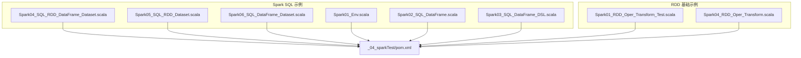
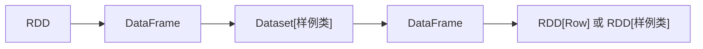
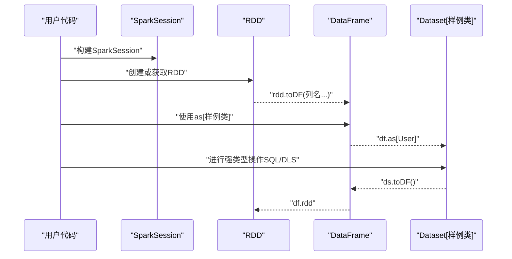
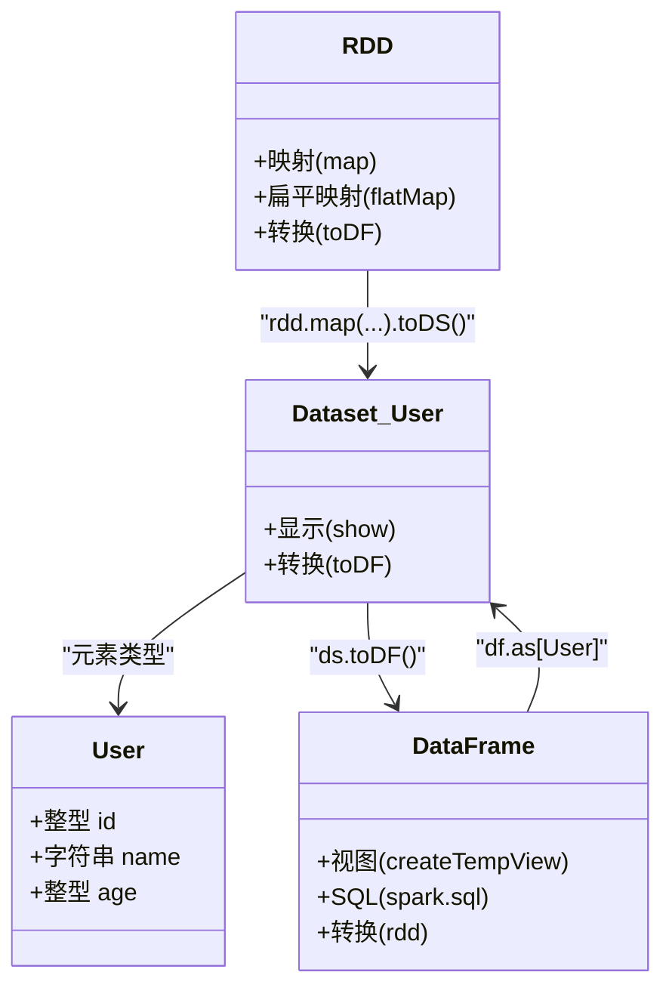

# Dataset操作详解

<cite>
**本文引用的文件**
- [Spark04_SQL_RDD_DataFrame_Dataset.scala](file://_04_sparkTest/src/main/java/com/atguigu/bigdata/spark/sql/Spark04_SQL_RDD_DataFrame_Dataset.scala)
- [Spark05_SQL_RDD_Dataset.scala](file://_04_sparkTest/src/main/java/com/atguigu/bigdata/spark/sql/Spark05_SQL_RDD_Dataset.scala)
- [Spark06_SQL_DataFrame_Dataset.scala](file://_04_sparkTest/src/main/java/com/atguigu/bigdata/spark/sql/Spark06_SQL_DataFrame_Dataset.scala)
- [Spark01_Env.scala](file://_04_sparkTest/src/main/java/com/atguigu/bigdata/spark/sql/Spark01_Env.scala)
- [Spark02_SQL_DataFrame.scala](file://_04_sparkTest/src/main/java/com/atguigu/bigdata/spark/sql/Spark02_SQL_DataFrame.scala)
- [Spark03_SQL_DataFrame_DSL.scala](file://_04_sparkTest/src/main/java/com/atguigu/bigdata/spark/sql/Spark03_SQL_DataFrame_DSL.scala)
- [Spark01_RDD_Oper_Transform_Test.scala](file://_04_sparkTest/src/main/java/com/atguigu/bigdata/spark/core/rdd/oper/transform/Spark01_RDD_Oper_Transform_Test.scala)
- [Spark04_RDD_Oper_Transform.scala](file://_04_sparkTest/src/main/java/com/atguigu/bigdata/spark/core/rdd/oper/transform/Spark04_RDD_Oper_Transform.scala)
- [pom.xml](file://_04_sparkTest/pom.xml)
</cite>

## 目录
1. [引言](#引言)
2. [项目结构](#项目结构)
3. [核心组件](#核心组件)
4. [架构总览](#架构总览)
5. [详细组件分析](#详细组件分析)
6. [依赖分析](#依赖分析)
7. [性能考虑](#性能考虑)
8. [故障排查指南](#故障排查指南)
9. [结论](#结论)
10. [附录](#附录)

## 引言
本文件围绕Spark SQL中的Dataset进行系统性技术文档整理，目标包括：
- 解释Dataset的概念、特点与优势，并与DataFrame进行对比；
- 总结Dataset的多种创建方式：从RDD转换、从DataFrame转换、直接创建（通过样例类）；
- 讲解Dataset的强类型特性与类型安全操作；
- 提供基于仓库示例的完整操作路径（map、flatMap、filter、groupBy等），并给出对应的代码片段路径；
- 说明序列化机制与性能优化策略，以及在大数据处理中的最佳实践。

## 项目结构
该仓库包含大量Spark相关示例，其中与Dataset密切相关的示例集中在Spark SQL目录下，涵盖从RDD到DataFrame再到Dataset的转换，以及DataFrame与Dataset之间的互转。同时，RDD操作示例展示了map、flatMap等常用算子，可作为理解Dataset DSL操作的背景知识。

图表来源
- [Spark04_SQL_RDD_DataFrame_Dataset.scala](file://_04_sparkTest/src/main/java/com/atguigu/bigdata/spark/sql/Spark04_SQL_RDD_DataFrame_Dataset.scala#L1-L52)
- [Spark05_SQL_RDD_Dataset.scala](file://_04_sparkTest/src/main/java/com/atguigu/bigdata/spark/sql/Spark05_SQL_RDD_Dataset.scala#L1-L44)
- [Spark06_SQL_DataFrame_Dataset.scala](file://_04_sparkTest/src/main/java/com/atguigu/bigdata/spark/sql/Spark06_SQL_DataFrame_Dataset.scala#L1-L50)
- [Spark01_Env.scala](file://_04_sparkTest/src/main/java/com/atguigu/bigdata/spark/sql/Spark01_Env.scala#L1-L33)
- [Spark02_SQL_DataFrame.scala](file://_04_sparkTest/src/main/java/com/atguigu/bigdata/spark/sql/Spark02_SQL_DataFrame.scala#L1-L32)
- [Spark03_SQL_DataFrame_DSL.scala](file://_04_sparkTest/src/main/java/com/atguigu/bigdata/spark/sql/Spark03_SQL_DataFrame_DSL.scala#L1-L27)
- [Spark01_RDD_Oper_Transform_Test.scala](file://_04_sparkTest/src/main/java/com/atguigu/bigdata/spark/core/rdd/oper/transform/Spark01_RDD_Oper_Transform_Test.scala#L1-L27)
- [Spark04_RDD_Oper_Transform.scala](file://_04_sparkTest/src/main/java/com/atguigu/bigdata/spark/core/rdd/oper/transform/Spark04_RDD_Oper_Transform.scala#L1-L32)
- [pom.xml](file://_04_sparkTest/pom.xml#L1-L73)

章节来源
- [pom.xml](file://_04_sparkTest/pom.xml#L1-L73)

## 核心组件
- SparkSession：统一入口，用于构建DataFrame/Dataset及执行SQL。
- RDD：弹性分布式数据集，可转换为Dataset或DataFrame。
- DataFrame：弱类型结构化数据集合，本质上是特定泛型的Dataset。
- Dataset：强类型结构化数据集合，支持编译期类型检查与优化。

章节来源
- [Spark01_Env.scala](file://_04_sparkTest/src/main/java/com/atguigu/bigdata/spark/sql/Spark01_Env.scala#L1-L33)
- [Spark02_SQL_DataFrame.scala](file://_04_sparkTest/src/main/java/com/atguigu/bigdata/spark/sql/Spark02_SQL_DataFrame.scala#L1-L32)
- [Spark03_SQL_DataFrame_DSL.scala](file://_04_sparkTest/src/main/java/com/atguigu/bigdata/spark/sql/Spark03_SQL_DataFrame_DSL.scala#L1-L27)
- [Spark04_SQL_RDD_DataFrame_Dataset.scala](file://_04_sparkTest/src/main/java/com/atguigu/bigdata/spark/sql/Spark04_SQL_RDD_DataFrame_Dataset.scala#L1-L52)
- [Spark05_SQL_RDD_Dataset.scala](file://_04_sparkTest/src/main/java/com/atguigu/bigdata/spark/sql/Spark05_SQL_RDD_Dataset.scala#L1-L44)
- [Spark06_SQL_DataFrame_Dataset.scala](file://_04_sparkTest/src/main/java/com/atguigu/bigdata/spark/sql/Spark06_SQL_DataFrame_Dataset.scala#L1-L50)

## 架构总览
下图展示了从RDD到DataFrame再到Dataset的转换链路，以及DataFrame与Dataset之间的互转关系。

图表来源
- [Spark04_SQL_RDD_DataFrame_Dataset.scala](file://_04_sparkTest/src/main/java/com/atguigu/bigdata/spark/sql/Spark04_SQL_RDD_DataFrame_Dataset.scala#L1-L52)
- [Spark05_SQL_RDD_Dataset.scala](file://_04_sparkTest/src/main/java/com/atguigu/bigdata/spark/sql/Spark05_SQL_RDD_Dataset.scala#L1-L44)
- [Spark06_SQL_DataFrame_Dataset.scala](file://_04_sparkTest/src/main/java/com/atguigu/bigdata/spark/sql/Spark06_SQL_DataFrame_Dataset.scala#L1-L50)

## 详细组件分析

### Dataset与DataFrame的关系
- DataFrame是特定泛型的Dataset，二者在运行时共享相同执行计划与优化器。
- DataFrame强调“列名+模式”的弱类型表达；Dataset强调“样例类+字段类型”的强类型表达。
- 在示例中，DataFrame与Dataset之间通过隐式转换进行互转，且Dataset可通过as[样例类]获得强类型视图。

章节来源
- [Spark06_SQL_DataFrame_Dataset.scala](file://_04_sparkTest/src/main/java/com/atguigu/bigdata/spark/sql/Spark06_SQL_DataFrame_Dataset.scala#L1-L50)

### Dataset的创建方式
- 从RDD转换：先将RDD映射为样例类，再toDS()得到Dataset。
- 从DataFrame转换：使用as[样例类]将DataFrame转为Dataset。
- 直接创建：通过SparkSession读取外部数据后，结合样例类进行强类型操作（示例中体现为读取JSON并进行SQL/DLS访问）。

章节来源
- [Spark05_SQL_RDD_Dataset.scala](file://_04_sparkTest/src/main/java/com/atguigu/bigdata/spark/sql/Spark05_SQL_RDD_Dataset.scala#L1-L44)
- [Spark06_SQL_DataFrame_Dataset.scala](file://_04_sparkTest/src/main/java/com/atguigu/bigdata/spark/sql/Spark06_SQL_DataFrame_Dataset.scala#L1-L50)
- [Spark01_Env.scala](file://_04_sparkTest/src/main/java/com/atguigu/bigdata/spark/sql/Spark01_Env.scala#L1-L33)
- [Spark02_SQL_DataFrame.scala](file://_04_sparkTest/src/main/java/com/atguigu/bigdata/spark/sql/Spark02_SQL_DataFrame.scala#L1-L32)
- [Spark03_SQL_DataFrame_DSL.scala](file://_04_sparkTest/src/main/java/com/atguigu/bigdata/spark/sql/Spark03_SQL_DataFrame_DSL.scala#L1-L27)

### 强类型特性与样例类
- 使用case class定义样例类，作为Dataset的元素类型，从而获得编译期类型安全与IDE智能提示。
- 示例中通过User样例类承载(id, name, age)，并在RDD转换为Dataset时使用。

章节来源
- [Spark04_SQL_RDD_DataFrame_Dataset.scala](file://_04_sparkTest/src/main/java/com/atguigu/bigdata/spark/sql/Spark04_SQL_RDD_DataFrame_Dataset.scala#L1-L52)
- [Spark05_SQL_RDD_Dataset.scala](file://_04_sparkTest/src/main/java/com/atguigu/bigdata/spark/sql/Spark05_SQL_RDD_Dataset.scala#L1-L44)
- [Spark06_SQL_DataFrame_Dataset.scala](file://_04_sparkTest/src/main/java/com/atguigu/bigdata/spark/sql/Spark06_SQL_DataFrame_Dataset.scala#L1-L50)

### Dataset常见操作（基于示例的路径）
以下为仓库中可直接对照的示例路径，展示Dataset/DLS的基本操作思路（map、flatMap、filter、groupBy等）。由于仓库未直接提供Dataset的map/flatMap/filter/groupBy示例，以下给出与之对应的操作路径与参考示例。

- map（映射单条记录）
  - 参考：RDD map示例路径
    - [Spark01_RDD_Oper_Transform_Test.scala](file://_04_sparkTest/src/main/java/com/atguigu/bigdata/spark/core/rdd/oper/transform/Spark01_RDD_Oper_Transform_Test.scala#L1-L27)
  - 说明：Dataset/DLS中亦可进行类似映射操作，示例中通过DataFrame读取JSON并进行SQL/DLS访问，可类比映射逻辑。

- flatMap（扁平化映射）
  - 参考：RDD flatMap示例路径
    - [Spark04_RDD_Oper_Transform.scala](file://_04_sparkTest/src/main/java/com/atguigu/bigdata/spark/core/rdd/oper/transform/Spark04_RDD_Oper_Transform.scala#L1-L32)
  - 说明：Dataset/DLS中同样支持扁平化映射，可参考该示例的函数式映射思想。

- filter（过滤）
  - 参考：DataFrame/DLS访问示例（可类比过滤逻辑）
    - [Spark02_SQL_DataFrame.scala](file://_04_sparkTest/src/main/java/com/atguigu/bigdata/spark/sql/Spark02_SQL_DataFrame.scala#L1-L32)
    - [Spark03_SQL_DataFrame_DSL.scala](file://_04_sparkTest/src/main/java/com/atguigu/bigdata/spark/sql/Spark03_SQL_DataFrame_DSL.scala#L1-L27)

- groupBy（分组）
  - 参考：DataFrame SQL/DLS示例（可类比分组逻辑）
    - [Spark02_SQL_DataFrame.scala](file://_04_sparkTest/src/main/java/com/atguigu/bigdata/spark/sql/Spark02_SQL_DataFrame.scala#L1-L32)
    - [Spark03_SQL_DataFrame_DSL.scala](file://_04_sparkTest/src/main/java/com/atguigu/bigdata/spark/sql/Spark03_SQL_DataFrame_DSL.scala#L1-L27)

章节来源
- [Spark01_RDD_Oper_Transform_Test.scala](file://_04_sparkTest/src/main/java/com/atguigu/bigdata/spark/core/rdd/oper/transform/Spark01_RDD_Oper_Transform_Test.scala#L1-L27)
- [Spark04_RDD_Oper_Transform.scala](file://_04_sparkTest/src/main/java/com/atguigu/bigdata/spark/core/rdd/oper/transform/Spark04_RDD_Oper_Transform.scala#L1-L32)
- [Spark02_SQL_DataFrame.scala](file://_04_sparkTest/src/main/java/com/atguigu/bigdata/spark/sql/Spark02_SQL_DataFrame.scala#L1-L32)
- [Spark03_SQL_DataFrame_DSL.scala](file://_04_sparkTest/src/main/java/com/atguigu/bigdata/spark/sql/Spark03_SQL_DataFrame_DSL.scala#L1-L27)

### Dataset与DataFrame互转序列

图表来源
- [Spark04_SQL_RDD_DataFrame_Dataset.scala](file://_04_sparkTest/src/main/java/com/atguigu/bigdata/spark/sql/Spark04_SQL_RDD_DataFrame_Dataset.scala#L1-L52)
- [Spark05_SQL_RDD_Dataset.scala](file://_04_sparkTest/src/main/java/com/atguigu/bigdata/spark/sql/Spark05_SQL_RDD_Dataset.scala#L1-L44)
- [Spark06_SQL_DataFrame_Dataset.scala](file://_04_sparkTest/src/main/java/com/atguigu/bigdata/spark/sql/Spark06_SQL_DataFrame_Dataset.scala#L1-L50)

### 类型安全与样例类关系

图表来源
- [Spark04_SQL_RDD_DataFrame_Dataset.scala](file://_04_sparkTest/src/main/java/com/atguigu/bigdata/spark/sql/Spark04_SQL_RDD_DataFrame_Dataset.scala#L1-L52)
- [Spark05_SQL_RDD_Dataset.scala](file://_04_sparkTest/src/main/java/com/atguigu/bigdata/spark/sql/Spark05_SQL_RDD_Dataset.scala#L1-L44)
- [Spark06_SQL_DataFrame_Dataset.scala](file://_04_sparkTest/src/main/java/com/atguigu/bigdata/spark/sql/Spark06_SQL_DataFrame_Dataset.scala#L1-L50)

## 依赖分析
- Spark版本与模块：示例使用Spark 3.0.0，包含spark-core、spark-sql、spark-streaming等模块。
- 序列化与优化：示例中未直接展示自定义序列化配置，但pom中引入了kryo依赖，可用于优化序列化性能。

章节来源
- [pom.xml](file://_04_sparkTest/pom.xml#L1-L73)

## 性能考虑
- 强类型优势：Dataset在编译期进行类型检查，减少运行时错误与装箱/拆箱开销，提升执行效率。
- 列裁剪与谓词下推：通过DataFrame/Dataset的查询计划优化，尽量在数据源侧完成过滤与投影。
- 分区与序列化：合理设置分区数量，避免数据倾斜；必要时采用高效序列化方案（如Kryo）。
- 内存管理：避免产生过大的中间结果，及时缓存热点数据并选择合适的缓存级别。

## 故障排查指南
- 隐式转换缺失：从RDD到DataFrame/Dataset需导入隐式转换，否则无法识别toDF/toDS/as等方法。
- 样例类不匹配：as[样例类]要求列名与类型一致，否则转换失败；建议先toDF确认Schema再映射。
- JSON读取问题：确保JSON格式正确，列名与样例类字段一致；必要时显式指定列名。
- 并行度与资源：本地测试时可使用local[*]，生产环境需根据集群资源调整并行度与内存分配。

章节来源
- [Spark04_SQL_RDD_DataFrame_Dataset.scala](file://_04_sparkTest/src/main/java/com/atguigu/bigdata/spark/sql/Spark04_SQL_RDD_DataFrame_Dataset.scala#L1-L52)
- [Spark06_SQL_DataFrame_Dataset.scala](file://_04_sparkTest/src/main/java/com/atguigu/bigdata/spark/sql/Spark06_SQL_DataFrame_Dataset.scala#L1-L50)
- [Spark01_Env.scala](file://_04_sparkTest/src/main/java/com/atguigu/bigdata/spark/sql/Spark01_Env.scala#L1-L33)

## 结论
- Dataset相比DataFrame具备更强的类型安全与编译期保护，适合复杂业务场景下的强约束数据处理。
- 从RDD到DataFrame再到Dataset的转换链路清晰，DataFrame与Dataset互转便捷，便于在不同抽象层次间切换。
- 结合仓库示例，可快速掌握Dataset的创建、类型安全操作与Schema转换流程；进一步的map/flatMap/filter/groupBy等操作可类比RDD与DataFrame/DLS示例进行迁移。

## 附录
- 示例路径索引（便于快速定位）
  - 从RDD到DataFrame/Dataset互转
    - [Spark04_SQL_RDD_DataFrame_Dataset.scala](file://_04_sparkTest/src/main/java/com/atguigu/bigdata/spark/sql/Spark04_SQL_RDD_DataFrame_Dataset.scala#L1-L52)
    - [Spark06_SQL_DataFrame_Dataset.scala](file://_04_sparkTest/src/main/java/com/atguigu/bigdata/spark/sql/Spark06_SQL_DataFrame_Dataset.scala#L1-L50)
  - 从RDD到Dataset
    - [Spark05_SQL_RDD_Dataset.scala](file://_04_sparkTest/src/main/java/com/atguigu/bigdata/spark/sql/Spark05_SQL_RDD_Dataset.scala#L1-L44)
  - DataFrame/DLS访问
    - [Spark01_Env.scala](file://_04_sparkTest/src/main/java/com/atguigu/bigdata/spark/sql/Spark01_Env.scala#L1-L33)
    - [Spark02_SQL_DataFrame.scala](file://_04_sparkTest/src/main/java/com/atguigu/bigdata/spark/sql/Spark02_SQL_DataFrame.scala#L1-L32)
    - [Spark03_SQL_DataFrame_DSL.scala](file://_04_sparkTest/src/main/java/com/atguigu/bigdata/spark/sql/Spark03_SQL_DataFrame_DSL.scala#L1-L27)
  - RDD算子参考
    - [Spark01_RDD_Oper_Transform_Test.scala](file://_04_sparkTest/src/main/java/com/atguigu/bigdata/spark/core/rdd/oper/transform/Spark01_RDD_Oper_Transform_Test.scala#L1-L27)
    - [Spark04_RDD_Oper_Transform.scala](file://_04_sparkTest/src/main/java/com/atguigu/bigdata/spark/core/rdd/oper/transform/Spark04_RDD_Oper_Transform.scala#L1-L32)