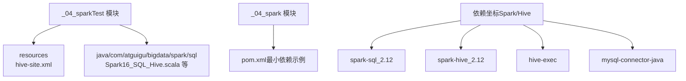
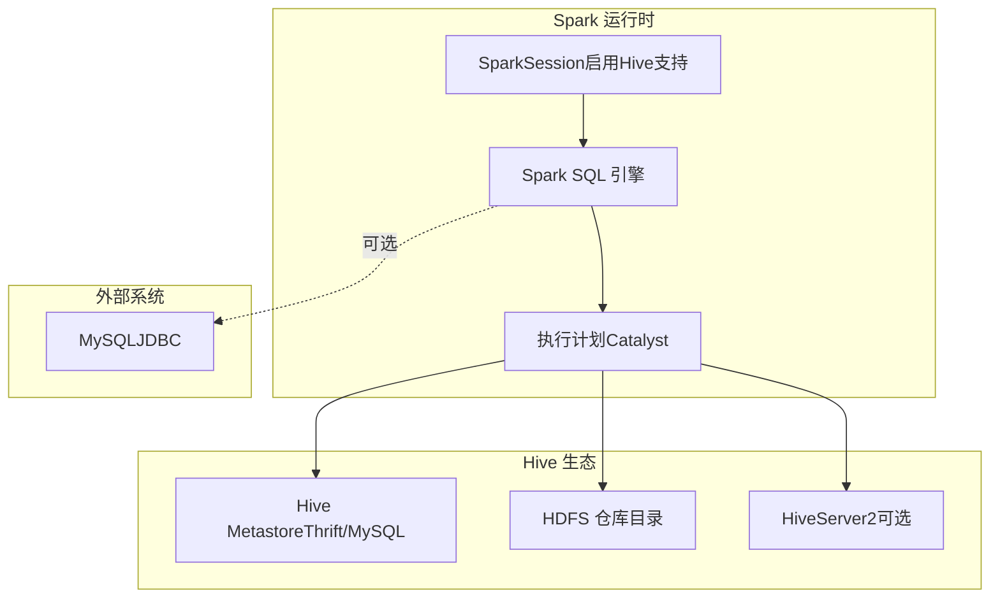
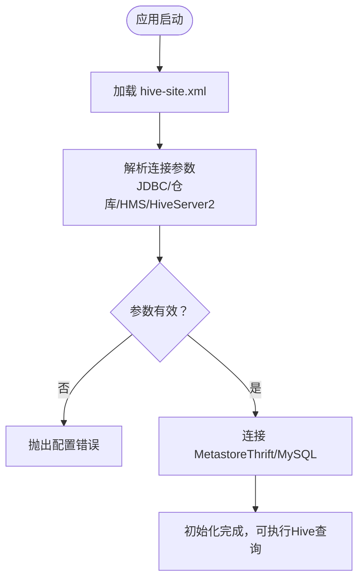
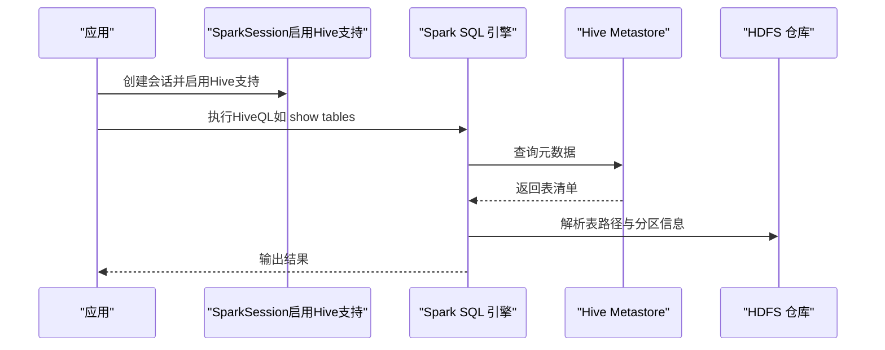
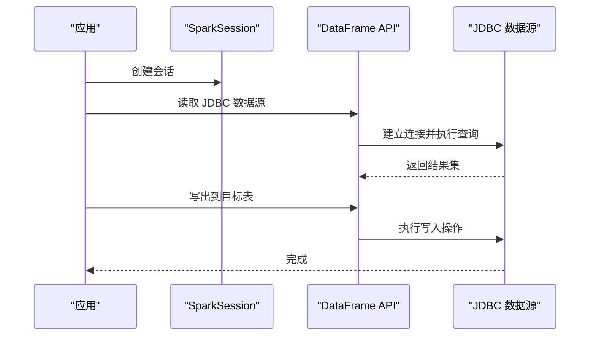
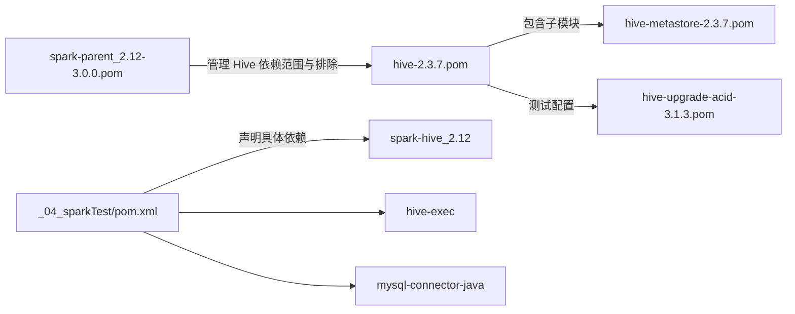
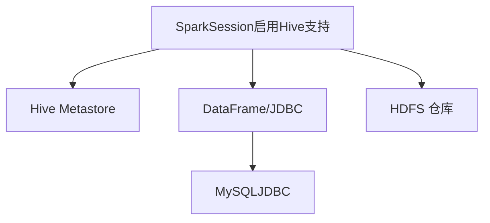

# Hive集成与元数据管理

<cite>
**本文引用的文件**
- [hive-site.xml](file://_04_sparkTest/src/main/resources/hive-site.xml)
- [pom.xml（Spark测试模块）](file://_04_sparkTest/pom.xml)
- [pom.xml（Spark核心模块）](file://_04_spark/pom.xml)
- [Spark16_SQL_Hive.scala](file://_04_sparkTest/src/main/java/com/atguigu/bigdata/spark/sql/Spark16_SQL_Hive.scala)
- [Spark16_SQL_Hive_my.scala](file://_04_sparkTest/src/main/java/com/atguigu/bigdata/spark/sql/Spark16_SQL_Hive_my.scala)
- [Spark15_SQL_JDBC.scala](file://_04_sparkTest/src/main/java/com/atguigu/bigdata/spark/sql/Spark15_SQL_JDBC.scala)
- [spark-parent_2.12-3.0.0.pom](file://org/apache/spark/spark-parent_2.12/3.0.0/spark-parent_2.12-3.0.0.pom)
- [hive-2.3.7.pom](file://org/apache/hive/hive/2.3.7/hive-2.3.7.pom)
- [hive-metastore-2.3.7.pom](file://org/apache/hive/hive-metastore/2.3.7/hive-metastore-2.3.7.pom)
- [hive-upgrade-acid-3.1.3.pom](file://org/apache/hive/hive-upgrade-acid/3.1.3/hive-upgrade-acid-3.1.3.pom)
</cite>

## 目录
1. [引言](#引言)
2. [项目结构](#项目结构)
3. [核心组件](#核心组件)
4. [架构总览](#架构总览)
5. [详细组件分析](#详细组件分析)
6. [依赖关系分析](#依赖关系分析)
7. [性能考虑](#性能考虑)
8. [故障排查指南](#故障排查指南)
9. [结论](#结论)
10. [附录](#附录)

## 引言
本文件围绕Spark与Hive的集成展开，系统阐述Spark SQL对Hive的兼容与集成方式，涵盖Hive Metastore的使用、配置要点、HiveQL在Spark中的执行路径、语法兼容性与性能对比，并提供基于仓库中现有示例的可运行步骤指引与最佳实践建议。读者可据此在本地或集群环境中完成Spark对Hive表的访问、临时表创建、以及原生Hive查询的执行。

## 项目结构
该仓库包含多个模块，其中与Spark/Hive集成直接相关的是“_04_sparkTest”模块，其资源目录下提供了Hive配置文件，pom中声明了Spark与Hive相关依赖；另一个“_04_spark”模块为轻量级示例工程，便于理解最小化依赖。

- 资源与示例位置
  - 配置文件：_04_sparkTest/src/main/resources/hive-site.xml
  - 示例代码：_04_sparkTest/src/main/java/com/atguigu/bigdata/spark/sql/Spark16_SQL_Hive.scala 等
  - 依赖定义：_04_sparkTest/pom.xml、_04_spark/pom.xml

**图表来源**
- [hive-site.xml](file://_04_sparkTest/src/main/resources/hive-site.xml#L1-L96)
- [Spark16_SQL_Hive.scala](file://_04_sparkTest/src/main/java/com/atguigu/bigdata/spark/sql/Spark16_SQL_Hive.scala#L1-L27)
- [pom.xml（Spark测试模块）](file://_04_sparkTest/pom.xml#L1-L73)
- [pom.xml（Spark核心模块）](file://_04_spark/pom.xml#L1-L29)

**章节来源**
- [hive-site.xml](file://_04_sparkTest/src/main/resources/hive-site.xml#L1-L96)
- [pom.xml（Spark测试模块）](file://_04_sparkTest/pom.xml#L1-L73)
- [pom.xml（Spark核心模块）](file://_04_spark/pom.xml#L1-L29)

## 核心组件
- Hive配置文件（hive-site.xml）
  - 提供Metastore JDBC连接信息、Schema校验开关、HDFS仓库目录、HiveServer2绑定地址与端口、本地模式参数等。
- Spark会话与Hive支持
  - 通过启用Hive支持创建SparkSession，即可在Spark SQL中直接使用Hive表与HiveQL。
- JDBC桥接（可选）
  - 使用Spark SQL的JDBC数据源读写关系型数据库，作为与Hive生态互补的数据接入手段。
- 依赖坐标
  - Spark核心依赖：spark-core、spark-sql、spark-streaming、spark-yarn、spark-streaming-kafka-0-10
  - Hive集成依赖：spark-hive、hive-exec、mysql-connector-java

**章节来源**
- [hive-site.xml](file://_04_sparkTest/src/main/resources/hive-site.xml#L1-L96)
- [Spark16_SQL_Hive.scala](file://_04_sparkTest/src/main/java/com/atguigu/bigdata/spark/sql/Spark16_SQL_Hive.scala#L1-L27)
- [Spark16_SQL_Hive_my.scala](file://_04_sparkTest/src/main/java/com/atguigu/bigdata/spark/sql/Spark16_SQL_Hive_my.scala#L1-L29)
- [Spark15_SQL_JDBC.scala](file://_04_sparkTest/src/main/java/com/atguigu/bigdata/spark/sql/Spark15_SQL_JDBC.scala#L1-L39)
- [pom.xml（Spark测试模块）](file://_04_sparkTest/pom.xml#L1-L73)

## 架构总览
下图展示了Spark SQL与Hive集成的整体架构：Spark通过启用Hive支持连接到Hive Metastore（可为远程Thrift服务或本地嵌入式），并从HDFS读取Hive表数据；同时，可通过JDBC访问关系型数据库以实现跨系统的数据互通。

**图表来源**
- [Spark16_SQL_Hive.scala](file://_04_sparkTest/src/main/java/com/atguigu/bigdata/spark/sql/Spark16_SQL_Hive.scala#L1-L27)
- [hive-site.xml](file://_04_sparkTest/src/main/resources/hive-site.xml#L1-L96)
- [Spark15_SQL_JDBC.scala](file://_04_sparkTest/src/main/java/com/atguigu/bigdata/spark/sql/Spark15_SQL_JDBC.scala#L1-L39)

## 详细组件分析

### 组件A：Hive配置与Metastore连接
- 关键配置项
  - Metastore JDBC连接：javax.jdo.option.ConnectionURL、ConnectionDriverName、ConnectionUserName、ConnectionPassword
  - 仓库目录：hive.metastore.warehouse.dir
  - Schema校验：hive.metastore.schema.verification
  - HMS地址与HiveServer2端口：hive.metastore.uris、hive.server2.thrift.bind.host、hive.server2.thrift.port
  - CLI行为：hive.cli.print.header、hive.cli.print.current.db
  - 本地模式：hive.exec.mode.local.auto、hive.exec.mode.local.auto.inputbytes.max、hive.exec.mode.local.auto.input.files.max
- 集成要点
  - 将hive-site.xml置于classpath（例如resources目录），Spark启动时自动加载
  - 若使用远程Metastore，需确保Thrift端口可达且凭据正确
  - 本地模式适合小数据集快速验证，生产环境建议关闭或谨慎配置

**图表来源**
- [hive-site.xml](file://_04_sparkTest/src/main/resources/hive-site.xml#L1-L96)

**章节来源**
- [hive-site.xml](file://_04_sparkTest/src/main/resources/hive-site.xml#L1-L96)

### 组件B：Spark启用Hive支持与HiveQL执行
- 启用方式
  - 在构建SparkSession时调用启用Hive支持的方法，即可在Spark SQL中使用Hive表与HiveQL
- 基本用法
  - 显示当前可用的表、执行Hive原生查询、创建临时视图等
- 示例参考
  - 启用Hive支持与显示表清单的示例位于以下文件路径
    - [Spark16_SQL_Hive.scala](file://_04_sparkTest/src/main/java/com/atguigu/bigdata/spark/sql/Spark16_SQL_Hive.scala#L1-L27)
    - [Spark16_SQL_Hive_my.scala](file://_04_sparkTest/src/main/java/com/atguigu/bigdata/spark/sql/Spark16_SQL_Hive_my.scala#L1-L29)

**图表来源**
- [Spark16_SQL_Hive.scala](file://_04_sparkTest/src/main/java/com/atguigu/bigdata/spark/sql/Spark16_SQL_Hive.scala#L1-L27)
- [hive-site.xml](file://_04_sparkTest/src/main/resources/hive-site.xml#L1-L96)

**章节来源**
- [Spark16_SQL_Hive.scala](file://_04_sparkTest/src/main/java/com/atguigu/bigdata/spark/sql/Spark16_SQL_Hive.scala#L1-L27)
- [Spark16_SQL_Hive_my.scala](file://_04_sparkTest/src/main/java/com/atguigu/bigdata/spark/sql/Spark16_SQL_Hive_my.scala#L1-L29)

### 组件C：JDBC桥接与外部数据源
- 用途
  - 通过JDBC读取关系型数据库数据，或将DataFrame写出至数据库，作为与Hive生态互补的数据接入手段
- 示例参考
  - JDBC读取与写出的示例位于以下文件路径
    - [Spark15_SQL_JDBC.scala](file://_04_sparkTest/src/main/java/com/atguigu/bigdata/spark/sql/Spark15_SQL_JDBC.scala#L1-L39)
- 依赖要求
  - 需在pom中引入对应驱动依赖（如MySQL Connector/J）

**图表来源**
- [Spark15_SQL_JDBC.scala](file://_04_sparkTest/src/main/java/com/atguigu/bigdata/spark/sql/Spark15_SQL_JDBC.scala#L1-L39)
- [pom.xml（Spark测试模块）](file://_04_sparkTest/pom.xml#L1-L73)

**章节来源**
- [Spark15_SQL_JDBC.scala](file://_04_sparkTest/src/main/java/com/atguigu/bigdata/spark/sql/Spark15_SQL_JDBC.scala#L1-L39)
- [pom.xml（Spark测试模块）](file://_04_sparkTest/pom.xml#L1-L73)

### 组件D：依赖与版本匹配
- Spark与Hive版本关系
  - Spark父POM中对Hive相关依赖有统一管理与排除策略，避免冲突
  - Hive模块POM中包含metastore、ql、serde、service等子模块
- 仓库中的依赖坐标
  - Spark核心：spark-core、spark-sql、spark-streaming、spark-yarn、spark-streaming-kafka-0-10
  - Hive集成：spark-hive、hive-exec、mysql-connector-java
- 版本一致性建议
  - 保持Spark与Hive客户端版本兼容，避免因SerDe或协议差异导致的异常

**图表来源**
- [spark-parent_2.12-3.0.0.pom](file://org/apache/spark/spark-parent_2.12/3.0.0/spark-parent_2.12-3.0.0.pom#L1521-L1835)
- [hive-2.3.7.pom](file://org/apache/hive/hive/2.3.7/hive-2.3.7.pom#L27-L1065)
- [hive-metastore-2.3.7.pom](file://org/apache/hive/hive-metastore/2.3.7/hive-metastore-2.3.7.pom#L1-L32)
- [hive-upgrade-acid-3.1.3.pom](file://org/apache/hive/hive-upgrade-acid/3.1.3/hive-upgrade-acid-3.1.3.pom#L213-L296)
- [pom.xml（Spark测试模块）](file://_04_sparkTest/pom.xml#L1-L73)

**章节来源**
- [spark-parent_2.12-3.0.0.pom](file://org/apache/spark/spark-parent_2.12/3.0.0/spark-parent_2.12-3.0.0.pom#L1521-L1835)
- [hive-2.3.7.pom](file://org/apache/hive/hive/2.3.7/hive-2.3.7.pom#L27-L1065)
- [hive-metastore-2.3.7.pom](file://org/apache/hive/hive-metastore/2.3.7/hive-metastore-2.3.7.pom#L1-L32)
- [hive-upgrade-acid-3.1.3.pom](file://org/apache/hive/hive-upgrade-acid/3.1.3/hive-upgrade-acid-3.1.3.pom#L213-L296)
- [pom.xml（Spark测试模块）](file://_04_sparkTest/pom.xml#L1-L73)

## 依赖关系分析
- 组件耦合
  - SparkSession启用Hive支持后，SQL执行路径依赖Hive Metastore提供的元数据与HDFS上的表数据
  - JDBC桥接独立于Hive，但可与Hive查询并行使用
- 外部依赖
  - MySQL驱动用于JDBC读写
  - Hive Exec用于HiveQL解析与执行
- 版本与范围
  - Spark父POM对Hive相关依赖进行集中管理，避免传递依赖冲突
  - Hive模块POM明确列出核心子模块，便于按需裁剪

**图表来源**
- [Spark16_SQL_Hive.scala](file://_04_sparkTest/src/main/java/com/atguigu/bigdata/spark/sql/Spark16_SQL_Hive.scala#L1-L27)
- [Spark15_SQL_JDBC.scala](file://_04_sparkTest/src/main/java/com/atguigu/bigdata/spark/sql/Spark15_SQL_JDBC.scala#L1-L39)
- [hive-site.xml](file://_04_sparkTest/src/main/resources/hive-site.xml#L1-L96)

**章节来源**
- [Spark16_SQL_Hive.scala](file://_04_sparkTest/src/main/java/com/atguigu/bigdata/spark/sql/Spark16_SQL_Hive.scala#L1-L27)
- [Spark15_SQL_JDBC.scala](file://_04_sparkTest/src/main/java/com/atguigu/bigdata/spark/sql/Spark15_SQL_JDBC.scala#L1-L39)
- [hive-site.xml](file://_04_sparkTest/src/main/resources/hive-site.xml#L1-L96)

## 性能考虑
- 本地模式参数
  - 通过本地模式阈值配置，可在小数据场景下减少任务调度开销，但需注意与实际生产环境的差异
- 仓库目录与分区
  - 合理规划HDFS仓库目录与分区字段，有助于提升扫描效率与裁剪能力
- 执行引擎
  - Spark SQL的Catalyst优化器与向量化执行可显著提升复杂查询性能，建议结合统计信息与分区设计进行调优

[本节为通用指导，不直接分析具体文件]

## 故障排查指南
- Hive配置错误
  - 检查hive-site.xml中的JDBC URL、驱动、用户名、密码是否正确
  - 确认Metastore URI与HiveServer2端口可达
- 连接失败
  - 若使用远程Metastore，确认网络连通性与防火墙策略
  - 若使用本地模式，检查输入大小与文件数量阈值
- JDBC异常
  - 确认已添加对应数据库驱动依赖并在类路径中可见
- 版本不匹配
  - 若出现SerDe或协议异常，优先核对Spark与Hive客户端版本一致性

**章节来源**
- [hive-site.xml](file://_04_sparkTest/src/main/resources/hive-site.xml#L1-L96)
- [pom.xml（Spark测试模块）](file://_04_sparkTest/pom.xml#L1-L73)

## 结论
通过在Spark中启用Hive支持并正确配置Hive Metastore，可以无缝复用现有的Hive表与HiveQL能力；结合JDBC桥接，可实现与关系型数据库的双向数据流动。仓库中的示例与依赖配置为快速落地提供了清晰路径。建议在生产环境中进一步完善版本匹配、分区与统计信息管理、以及监控与告警体系，以保障稳定性与性能。

[本节为总结性内容，不直接分析具体文件]

## 附录

### A. 在Spark中使用Hive表与HiveQL的步骤指引
- 准备工作
  - 将hive-site.xml放置于资源目录，确保随应用打包
  - 在pom中引入spark-hive与mysql-connector-java等依赖
- 启动与执行
  - 在代码中创建启用Hive支持的SparkSession
  - 执行HiveQL（如显示表、查询、创建临时视图等）
- 参考示例路径
  - [Spark16_SQL_Hive.scala](file://_04_sparkTest/src/main/java/com/atguigu/bigdata/spark/sql/Spark16_SQL_Hive.scala#L1-L27)
  - [Spark16_SQL_Hive_my.scala](file://_04_sparkTest/src/main/java/com/atguigu/bigdata/spark/sql/Spark16_SQL_Hive_my.scala#L1-L29)

**章节来源**
- [hive-site.xml](file://_04_sparkTest/src/main/resources/hive-site.xml#L1-L96)
- [pom.xml（Spark测试模块）](file://_04_sparkTest/pom.xml#L1-L73)
- [Spark16_SQL_Hive.scala](file://_04_sparkTest/src/main/java/com/atguigu/bigdata/spark/sql/Spark16_SQL_Hive.scala#L1-L27)
- [Spark16_SQL_Hive_my.scala](file://_04_sparkTest/src/main/java/com/atguigu/bigdata/spark/sql/Spark16_SQL_Hive_my.scala#L1-L29)

### B. 元数据管理最佳实践
- 表结构变更
  - 通过Hive DDL进行结构变更，Spark侧自动感知（需重启会话或刷新缓存）
- 分区管理
  - 合理设计分区字段与层级，定期维护分区统计信息
- 数据湖架构
  - 利用HDFS仓库目录承载结构化与半结构化数据，配合分区与分桶策略提升查询效率

[本节为通用指导，不直接分析具体文件]