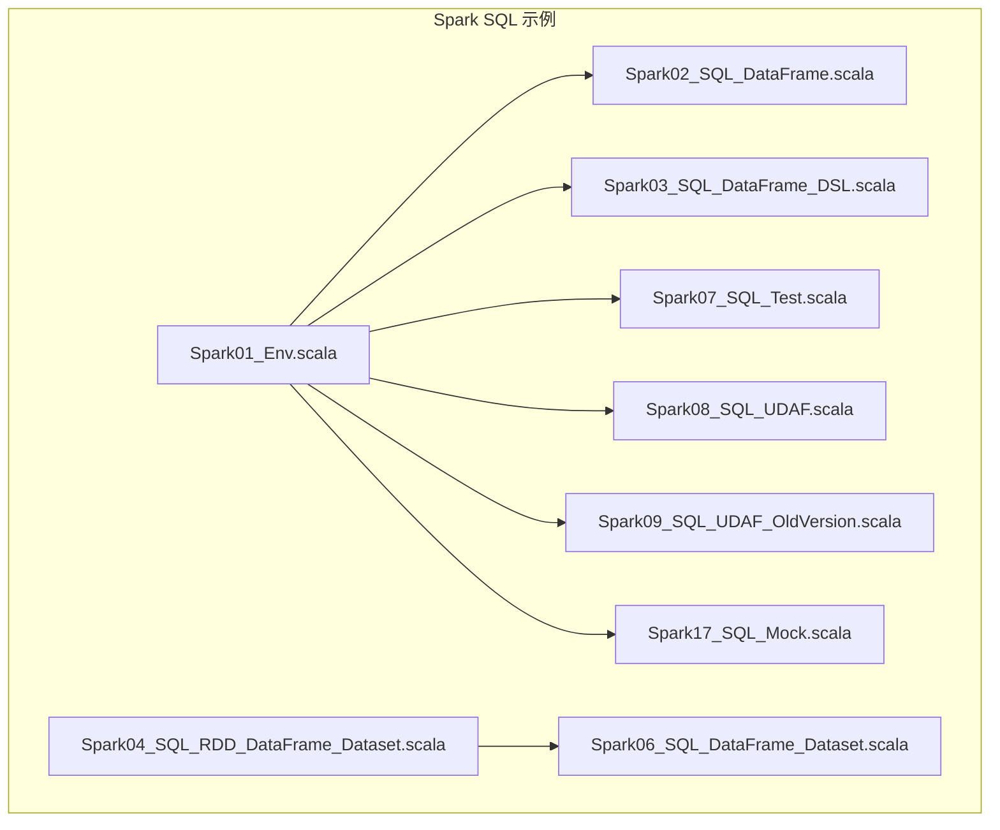
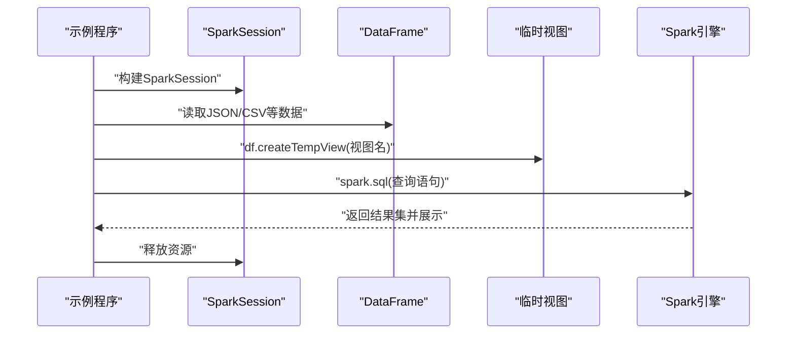
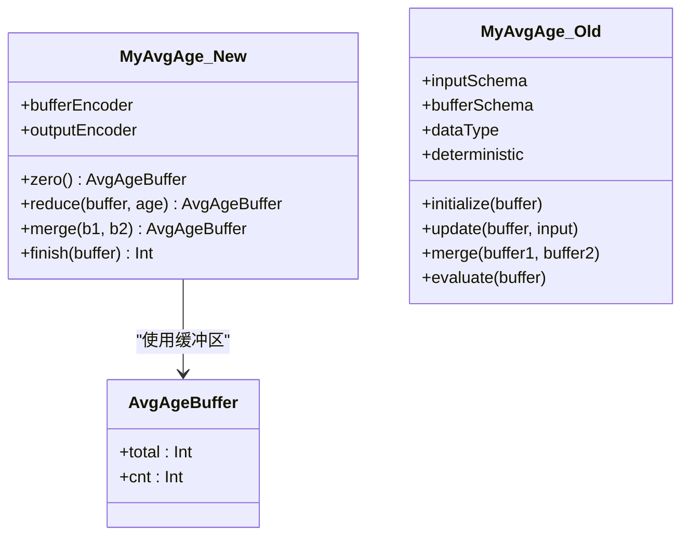
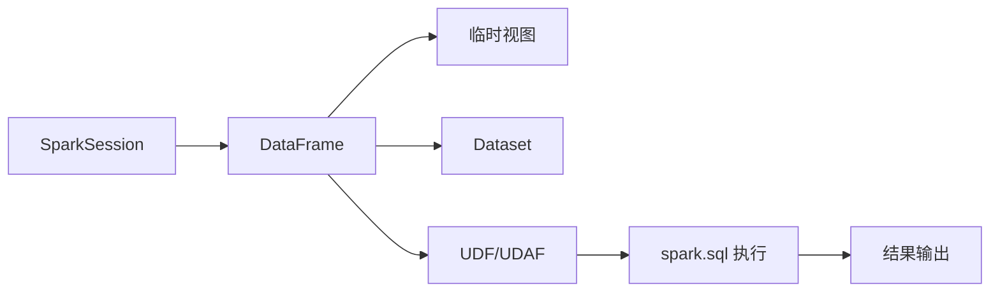

# SQL查询与DataFrame DSL

<cite>
**本文引用的文件**
- [Spark01_Env.scala](file://_04_sparkTest/src/main/java/com/atguigu/bigdata/spark/sql/Spark01_Env.scala)
- [Spark02_SQL_DataFrame.scala](file://_04_sparkTest/src/main/java/com/atguigu/bigdata/spark/sql/Spark02_SQL_DataFrame.scala)
- [Spark03_SQL_DataFrame_DSL.scala](file://_04_sparkTest/src/main/java/com/atguigu/bigdata/spark/sql/Spark03_SQL_DataFrame_DSL.scala)
- [Spark04_SQL_RDD_DataFrame_Dataset.scala](file://_04_sparkTest/src/main/java/com/atguigu/bigdata/spark/sql/Spark04_SQL_RDD_DataFrame_Dataset.scala)
- [Spark06_SQL_DataFrame_Dataset.scala](file://_04_sparkTest/src/main/java/com/atguigu/bigdata/spark/sql/Spark06_SQL_DataFrame_Dataset.scala)
- [Spark07_SQL_Test.scala](file://_04_sparkTest/src/main/java/com/atguigu/bigdata/spark/sql/Spark07_SQL_Test.scala)
- [Spark08_SQL_UDAF.scala](file://_04_sparkTest/src/main/java/com/atguigu/bigdata/spark/sql/Spark08_SQL_UDAF.scala)
- [Spark09_SQL_UDAF_OldVersion.scala](file://_04_sparkTest/src/main/java/com/atguigu/bigdata/spark/sql/Spark09_SQL_UDAF_OldVersion.scala)
- [Spark17_SQL_Mock.scala](file://_04_sparkTest/src/main/java/com/atguigu/bigdata/spark/sql/Spark17_SQL_Mock.scala)
</cite>

## 目录
1. [引言](#引言)
2. [项目结构](#项目结构)
3. [核心组件](#核心组件)
4. [架构总览](#架构总览)
5. [详细组件分析](#详细组件分析)
6. [依赖分析](#依赖分析)
7. [性能考虑](#性能考虑)
8. [故障排查指南](#故障排查指南)
9. [结论](#结论)
10. [附录](#附录)

## 引言
本文件围绕Spark SQL与DataFrame DSL展开，系统讲解如何在Spark中使用SQL语法与DataFrame DSL进行数据查询；详解临时视图的创建与使用（如createTempView、createOrReplaceTempView等）；覆盖复杂SQL查询（聚合、连接、子查询、窗口函数等）的编写思路；并通过DataFrame DSL的链式调用演示常见转换操作的组合使用；最后重点阐述用户自定义聚合函数（UDAF）的实现，包括新旧版本差异与迁移方法。

## 项目结构
该仓库中与Spark SQL直接相关的示例集中在“_04_sparkTest/src/main/java/.../spark/sql”目录下，按主题拆分了环境搭建、SQL与DSL对比、临时视图、UDAF、Mock Hive等示例程序，便于循序渐进学习。

图表来源
- [Spark01_Env.scala](file://_04_sparkTest/src/main/java/com/atguigu/bigdata/spark/sql/Spark01_Env.scala#L1-L33)
- [Spark02_SQL_DataFrame.scala](file://_04_sparkTest/src/main/java/com/atguigu/bigdata/spark/sql/Spark02_SQL_DataFrame.scala#L1-L32)
- [Spark03_SQL_DataFrame_DSL.scala](file://_04_sparkTest/src/main/java/com/atguigu/bigdata/spark/sql/Spark03_SQL_DataFrame_DSL.scala#L1-L27)
- [Spark04_SQL_RDD_DataFrame_Dataset.scala](file://_04_sparkTest/src/main/java/com/atguigu/bigdata/spark/sql/Spark04_SQL_RDD_DataFrame_Dataset.scala#L1-L52)
- [Spark06_SQL_DataFrame_Dataset.scala](file://_04_sparkTest/src/main/java/com/atguigu/bigdata/spark/sql/Spark06_SQL_DataFrame_Dataset.scala#L1-L50)
- [Spark07_SQL_Test.scala](file://_04_sparkTest/src/main/java/com/atguigu/bigdata/spark/sql/Spark07_SQL_Test.scala#L1-L42)
- [Spark08_SQL_UDAF.scala](file://_04_sparkTest/src/main/java/com/atguigu/bigdata/spark/sql/Spark08_SQL_UDAF.scala#L1-L66)
- [Spark09_SQL_UDAF_OldVersion.scala](file://_04_sparkTest/src/main/java/com/atguigu/bigdata/spark/sql/Spark09_SQL_UDAF_OldVersion.scala#L1-L81)
- [Spark17_SQL_Mock.scala](file://_04_sparkTest/src/main/java/com/atguigu/bigdata/spark/sql/Spark17_SQL_Mock.scala#L1-L80)

章节来源
- [Spark01_Env.scala](file://_04_sparkTest/src/main/java/com/atguigu/bigdata/spark/sql/Spark01_Env.scala#L1-L33)
- [Spark02_SQL_DataFrame.scala](file://_04_sparkTest/src/main/java/com/atguigu/bigdata/spark/sql/Spark02_SQL_DataFrame.scala#L1-L32)
- [Spark03_SQL_DataFrame_DSL.scala](file://_04_sparkTest/src/main/java/com/atguigu/bigdata/spark/sql/Spark03_SQL_DataFrame_DSL.scala#L1-L27)
- [Spark04_SQL_RDD_DataFrame_Dataset.scala](file://_04_sparkTest/src/main/java/com/atguigu/bigdata/spark/sql/Spark04_SQL_RDD_DataFrame_Dataset.scala#L1-L52)
- [Spark06_SQL_DataFrame_Dataset.scala](file://_04_sparkTest/src/main/java/com/atguigu/bigdata/spark/sql/Spark06_SQL_DataFrame_Dataset.scala#L1-L50)
- [Spark07_SQL_Test.scala](file://_04_sparkTest/src/main/java/com/atguigu/bigdata/spark/sql/Spark07_SQL_Test.scala#L1-L42)
- [Spark08_SQL_UDAF.scala](file://_04_sparkTest/src/main/java/com/atguigu/bigdata/spark/sql/Spark08_SQL_UDAF.scala#L1-L66)
- [Spark09_SQL_UDAF_OldVersion.scala](file://_04_sparkTest/src/main/java/com/atguigu/bigdata/spark/sql/Spark09_SQL_UDAF_OldVersion.scala#L1-L81)
- [Spark17_SQL_Mock.scala](file://_04_sparkTest/src/main/java/com/atguigu/bigdata/spark/sql/Spark17_SQL_Mock.scala#L1-L80)

## 核心组件
- SparkSession构建与环境准备：统一入口，负责读取数据、创建DataFrame、注册临时视图、执行SQL与停止资源。
- DataFrame与Dataset互转：通过隐式转换在RDD、DataFrame、Dataset之间灵活切换。
- 临时视图与SQL执行：将DataFrame注册为临时视图后，使用spark.sql执行查询。
- UDAF实现：新版本Aggregator强类型UDAF与旧版本UserDefinedAggregateFunction弱类型UDAF两种实现路径。
- Mock Hive示例：启用Hive支持后，通过DDL/DML创建表并加载本地数据进行查询。

章节来源
- [Spark01_Env.scala](file://_04_sparkTest/src/main/java/com/atguigu/bigdata/spark/sql/Spark01_Env.scala#L1-L33)
- [Spark04_SQL_RDD_DataFrame_Dataset.scala](file://_04_sparkTest/src/main/java/com/atguigu/bigdata/spark/sql/Spark04_SQL_RDD_DataFrame_Dataset.scala#L1-L52)
- [Spark06_SQL_DataFrame_Dataset.scala](file://_04_sparkTest/src/main/java/com/atguigu/bigdata/spark/sql/Spark06_SQL_DataFrame_Dataset.scala#L1-L50)
- [Spark08_SQL_UDAF.scala](file://_04_sparkTest/src/main/java/com/atguigu/bigdata/spark/sql/Spark08_SQL_UDAF.scala#L1-L66)
- [Spark09_SQL_UDAF_OldVersion.scala](file://_04_sparkTest/src/main/java/com/atguigu/bigdata/spark/sql/Spark09_SQL_UDAF_OldVersion.scala#L1-L81)
- [Spark17_SQL_Mock.scala](file://_04_sparkTest/src/main/java/com/atguigu/bigdata/spark/sql/Spark17_SQL_Mock.scala#L1-L80)

## 架构总览
下图展示了从数据读取到SQL执行与结果输出的整体流程，以及临时视图在其中的作用。

图表来源
- [Spark01_Env.scala](file://_04_sparkTest/src/main/java/com/atguigu/bigdata/spark/sql/Spark01_Env.scala#L1-L33)
- [Spark02_SQL_DataFrame.scala](file://_04_sparkTest/src/main/java/com/atguigu/bigdata/spark/sql/Spark02_SQL_DataFrame.scala#L1-L32)
- [Spark03_SQL_DataFrame_DSL.scala](file://_04_sparkTest/src/main/java/com/atguigu/bigdata/spark/sql/Spark03_SQL_DataFrame_DSL.scala#L1-L27)

## 详细组件分析

### 临时视图与SQL执行
- 创建临时视图：DataFrame提供多种注册方法，如createTempView、createOrReplaceTempView等，用于将DataFrame暴露为可被SQL查询的逻辑表。
- SQL执行：通过spark.sql执行查询，随后对结果进行展示或进一步处理。
- 示例路径
  - [Spark01_Env.scala](file://_04_sparkTest/src/main/java/com/atguigu/bigdata/spark/sql/Spark01_Env.scala#L1-L33)
  - [Spark02_SQL_DataFrame.scala](file://_04_sparkTest/src/main/java/com/atguigu/bigdata/spark/sql/Spark02_SQL_DataFrame.scala#L1-L32)

章节来源
- [Spark01_Env.scala](file://_04_sparkTest/src/main/java/com/atguigu/bigdata/spark/sql/Spark01_Env.scala#L1-L33)
- [Spark02_SQL_DataFrame.scala](file://_04_sparkTest/src/main/java/com/atguigu/bigdata/spark/sql/Spark02_SQL_DataFrame.scala#L1-L32)

### DataFrame DSL链式调用
- 链式转换：DataFrame DSL支持链式调用，如选择列、过滤、聚合、排序等操作可连续组合。
- 示例路径
  - [Spark03_SQL_DataFrame_DSL.scala](file://_04_sparkTest/src/main/java/com/atguigu/bigdata/spark/sql/Spark03_SQL_DataFrame_DSL.scala#L1-L27)

章节来源
- [Spark03_SQL_DataFrame_DSL.scala](file://_04_sparkTest/src/main/java/com/atguigu/bigdata/spark/sql/Spark03_SQL_DataFrame_DSL.scala#L1-L27)

### RDD、DataFrame、Dataset互转
- 转换关系：DataFrame本质上是特定类型的Dataset；通过隐式转换可在三者间自由切换。
- 示例路径
  - [Spark04_SQL_RDD_DataFrame_Dataset.scala](file://_04_sparkTest/src/main/java/com/atguigu/bigdata/spark/sql/Spark04_SQL_RDD_DataFrame_Dataset.scala#L1-L52)
  - [Spark06_SQL_DataFrame_Dataset.scala](file://_04_sparkTest/src/main/java/com/atguigu/bigdata/spark/sql/Spark06_SQL_DataFrame_Dataset.scala#L1-L50)

章节来源
- [Spark04_SQL_RDD_DataFrame_Dataset.scala](file://_04_sparkTest/src/main/java/com/atguigu/bigdata/spark/sql/Spark04_SQL_RDD_DataFrame_Dataset.scala#L1-L52)
- [Spark06_SQL_DataFrame_Dataset.scala](file://_04_sparkTest/src/main/java/com/atguigu/bigdata/spark/sql/Spark06_SQL_DataFrame_Dataset.scala#L1-L50)

### 复杂SQL查询思路
- 聚合查询：通过GROUP BY与聚合函数（如avg、sum、count等）实现统计分析。
- 连接查询：将多个表或视图通过JOIN进行关联，注意可能产生的笛卡尔积与shuffle开销。
- 子查询：在SELECT、FROM或WHERE子句中嵌套子查询表达复杂过滤与计算。
- 窗口函数：基于OVER子句进行排序、分桶与累计计算，适合时间序列与排行类分析。
- 说明：本仓库未直接给出复杂SQL示例代码，但可通过临时视图与UDF/UDAF配合实现上述能力。

[本节为概念性说明，不直接分析具体文件，故无章节来源]

### 用户自定义聚合函数（UDAF）
- 新版本强类型UDAF（Aggregator）：以类型安全的方式实现聚合，适合在SQL中通过udf.register结合functions.udaf使用。
- 旧版本弱类型UDAF（UserDefinedAggregateFunction）：通过inputSchema/bufferSchema/dataType/deterministic等接口描述输入、缓冲与输出结构，并实现initialize/update/merge/evaluate。
- 示例路径
  - [Spark08_SQL_UDAF.scala](file://_04_sparkTest/src/main/java/com/atguigu/bigdata/spark/sql/Spark08_SQL_UDAF.scala#L1-L66)
  - [Spark09_SQL_UDAF_OldVersion.scala](file://_04_sparkTest/src/main/java/com/atguigu/bigdata/spark/sql/Spark09_SQL_UDAF_OldVersion.scala#L1-L81)

图表来源
- [Spark08_SQL_UDAF.scala](file://_04_sparkTest/src/main/java/com/atguigu/bigdata/spark/sql/Spark08_SQL_UDAF.scala#L1-L66)
- [Spark09_SQL_UDAF_OldVersion.scala](file://_04_sparkTest/src/main/java/com/atguigu/bigdata/spark/sql/Spark09_SQL_UDAF_OldVersion.scala#L1-L81)

章节来源
- [Spark08_SQL_UDAF.scala](file://_04_sparkTest/src/main/java/com/atguigu/bigdata/spark/sql/Spark08_SQL_UDAF.scala#L1-L66)
- [Spark09_SQL_UDAF_OldVersion.scala](file://_04_sparkTest/src/main/java/com/atguigu/bigdata/spark/sql/Spark09_SQL_UDAF_OldVersion.scala#L1-L81)

### UDF与临时视图结合
- UDF注册：通过spark.udf.register在SQL中使用自定义函数。
- 与临时视图配合：先将DataFrame注册为临时视图，再在SQL中调用UDF实现业务逻辑。
- 示例路径
  - [Spark07_SQL_Test.scala](file://_04_sparkTest/src/main/java/com/atguigu/bigdata/spark/sql/Spark07_SQL_Test.scala#L1-L42)

章节来源
- [Spark07_SQL_Test.scala](file://_04_sparkTest/src/main/java/com/atguigu/bigdata/spark/sql/Spark07_SQL_Test.scala#L1-L42)

### Mock Hive示例
- 启用Hive支持：通过enableHiveSupport开启Hive元数据与语法支持。
- DDL/DML：使用spark.sql创建表、加载本地数据。
- 示例路径
  - [Spark17_SQL_Mock.scala](file://_04_sparkTest/src/main/java/com/atguigu/bigdata/spark/sql/Spark17_SQL_Mock.scala#L1-L80)

章节来源
- [Spark17_SQL_Mock.scala](file://_04_sparkTest/src/main/java/com/atguigu/bigdata/spark/sql/Spark17_SQL_Mock.scala#L1-L80)

## 依赖分析
- 组件耦合
  - 示例程序均依赖SparkSession与DataFrame API，形成统一入口与数据抽象层。
  - UDAF实现与Spark SQL的UDF机制紧密耦合，新旧版本API差异明显。
- 外部依赖
  - 本仓库示例主要依赖Spark SQL与Hive支持（通过enableHiveSupport），未显式声明额外外部库。
- 数据来源
  - 示例使用本地JSON/文本文件作为数据源，便于离线演示。

图表来源
- [Spark01_Env.scala](file://_04_sparkTest/src/main/java/com/atguigu/bigdata/spark/sql/Spark01_Env.scala#L1-L33)
- [Spark08_SQL_UDAF.scala](file://_04_sparkTest/src/main/java/com/atguigu/bigdata/spark/sql/Spark08_SQL_UDAF.scala#L1-L66)
- [Spark09_SQL_UDAF_OldVersion.scala](file://_04_sparkTest/src/main/java/com/atguigu/bigdata/spark/sql/Spark09_SQL_UDAF_OldVersion.scala#L1-L81)

章节来源
- [Spark01_Env.scala](file://_04_sparkTest/src/main/java/com/atguigu/bigdata/spark/sql/Spark01_Env.scala#L1-L33)
- [Spark08_SQL_UDAF.scala](file://_04_sparkTest/src/main/java/com/atguigu/bigdata/spark/sql/Spark08_SQL_UDAF.scala#L1-L66)
- [Spark09_SQL_UDAF_OldVersion.scala](file://_04_sparkTest/src/main/java/com/atguigu/bigdata/spark/sql/Spark09_SQL_UDAF_OldVersion.scala#L1-L81)

## 性能考虑
- 临时视图与缓存：对频繁使用的视图可结合缓存策略减少重复解析与优化成本。
- 聚合与连接：大表连接前尽量做预聚合与分区裁剪，避免不必要的shuffle。
- UDAF选择：优先使用新版本Aggregator强类型UDAF，具备更好的编译期类型检查与运行时优化空间。
- I/O与数据格式：优先使用列式存储与分区字段，降低扫描与反序列化开销。

[本节提供通用指导，不直接分析具体文件，故无章节来源]

## 故障排查指南
- 临时视图命名冲突：当多次注册同名视图时，应使用createOrReplaceTempView替换旧定义，避免查询结果不符合预期。
- UDF/UDAF注册位置：确保在SQL执行前完成注册，且函数名与SQL调用一致。
- Hive支持问题：启用Hive支持后，确认元数据配置与本地文件路径权限。
- 示例路径
  - [Spark02_SQL_DataFrame.scala](file://_04_sparkTest/src/main/java/com/atguigu/bigdata/spark/sql/Spark02_SQL_DataFrame.scala#L1-L32)
  - [Spark07_SQL_Test.scala](file://_04_sparkTest/src/main/java/com/atguigu/bigdata/spark/sql/Spark07_SQL_Test.scala#L1-L42)
  - [Spark17_SQL_Mock.scala](file://_04_sparkTest/src/main/java/com/atguigu/bigdata/spark/sql/Spark17_SQL_Mock.scala#L1-L80)

章节来源
- [Spark02_SQL_DataFrame.scala](file://_04_sparkTest/src/main/java/com/atguigu/bigdata/spark/sql/Spark02_SQL_DataFrame.scala#L1-L32)
- [Spark07_SQL_Test.scala](file://_04_sparkTest/src/main/java/com/atguigu/bigdata/spark/sql/Spark07_SQL_Test.scala#L1-L42)
- [Spark17_SQL_Mock.scala](file://_04_sparkTest/src/main/java/com/atguigu/bigdata/spark/sql/Spark17_SQL_Mock.scala#L1-L80)

## 结论
本仓库提供了从环境搭建、临时视图、SQL与DSL对比、UDAF实现到Mock Hive的完整示例路径。建议在实际项目中：
- 优先使用DataFrame DSL进行数据清洗与转换，必要时通过临时视图与SQL协同；
- 新项目采用Aggregator强类型UDAF，老项目逐步迁移至新API；
- 对复杂分析场景，结合窗口函数与连接查询实现高效统计与洞察。

[本节为总结性内容，不直接分析具体文件，故无章节来源]

## 附录
- 关键API与方法参考（示例路径）
  - 临时视图：[Spark02_SQL_DataFrame.scala](file://_04_sparkTest/src/main/java/com/atguigu/bigdata/spark/sql/Spark02_SQL_DataFrame.scala#L1-L32)
  - DataFrame DSL链式调用：[Spark03_SQL_DataFrame_DSL.scala](file://_04_sparkTest/src/main/java/com/atguigu/bigdata/spark/sql/Spark03_SQL_DataFrame_DSL.scala#L1-L27)
  - UDAF（新版本）：[Spark08_SQL_UDAF.scala](file://_04_sparkTest/src/main/java/com/atguigu/bigdata/spark/sql/Spark08_SQL_UDAF.scala#L1-L66)
  - UDAF（旧版本）：[Spark09_SQL_UDAF_OldVersion.scala](file://_04_sparkTest/src/main/java/com/atguigu/bigdata/spark/sql/Spark09_SQL_UDAF_OldVersion.scala#L1-L81)
  - UDF与临时视图：[Spark07_SQL_Test.scala](file://_04_sparkTest/src/main/java/com/atguigu/bigdata/spark/sql/Spark07_SQL_Test.scala#L1-L42)
  - Mock Hive：[Spark17_SQL_Mock.scala](file://_04_sparkTest/src/main/java/com/atguigu/bigdata/spark/sql/Spark17_SQL_Mock.scala#L1-L80)