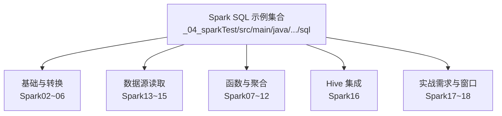
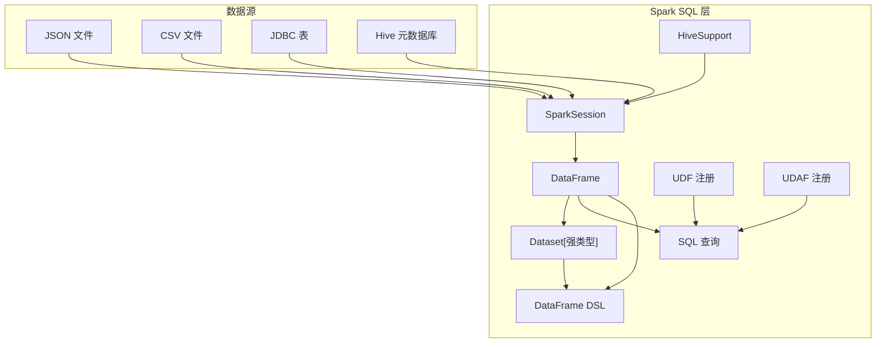
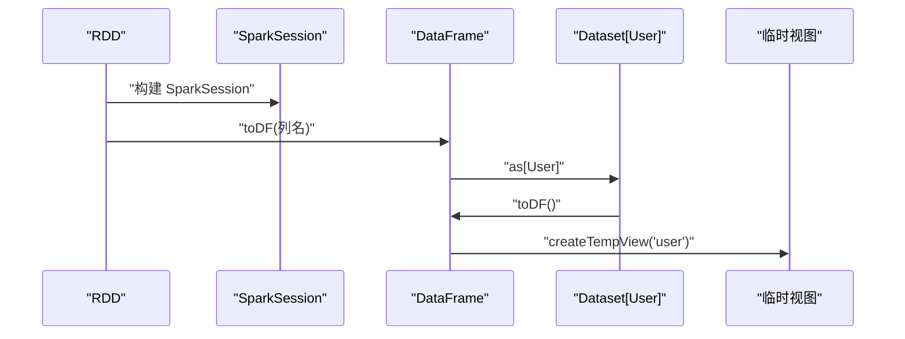
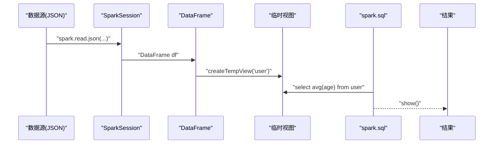
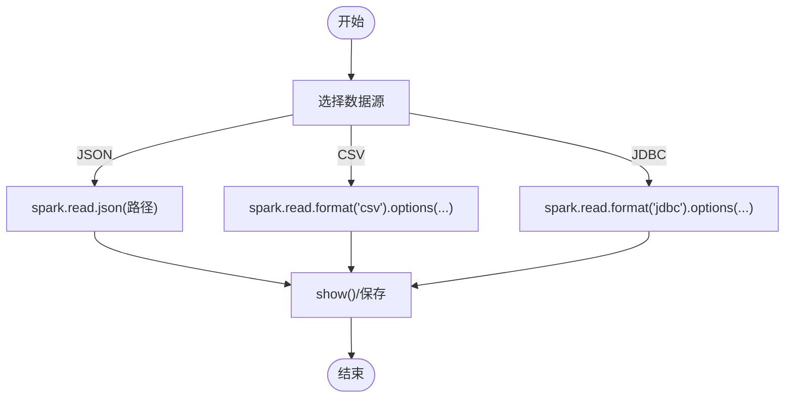
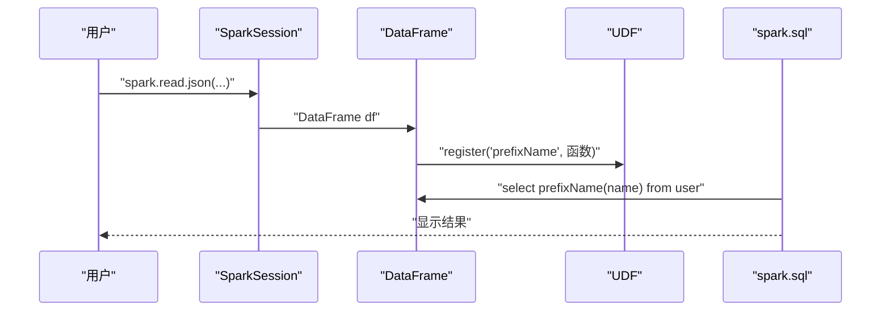
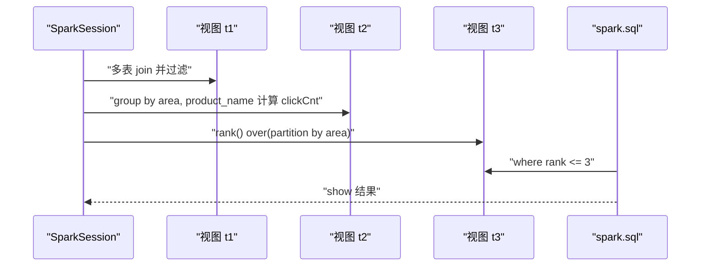
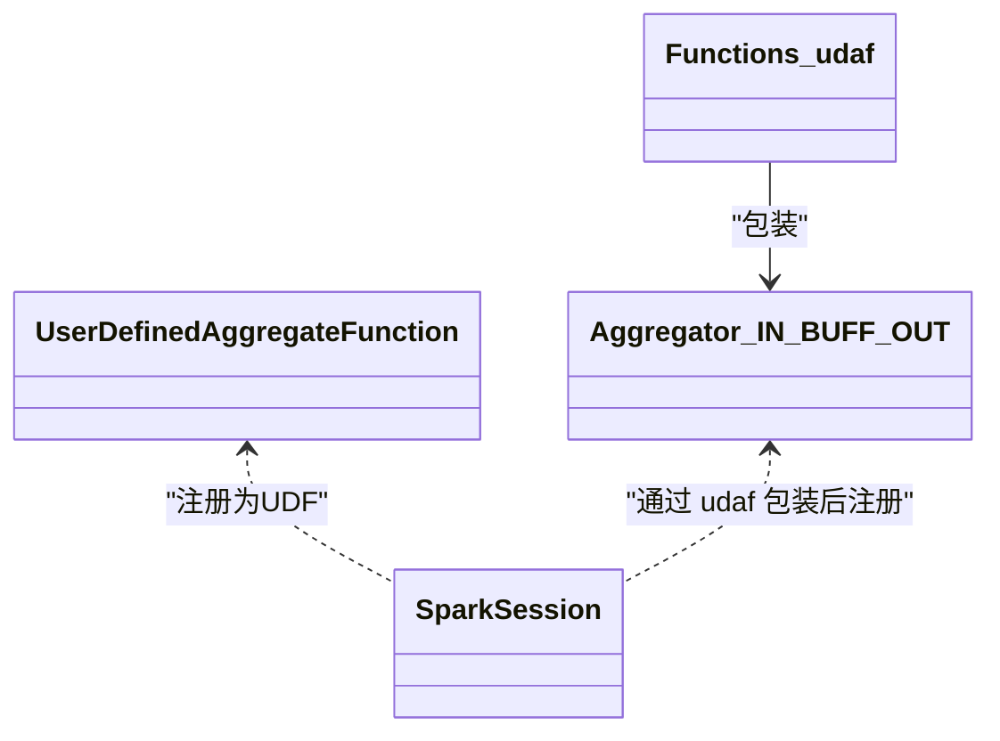
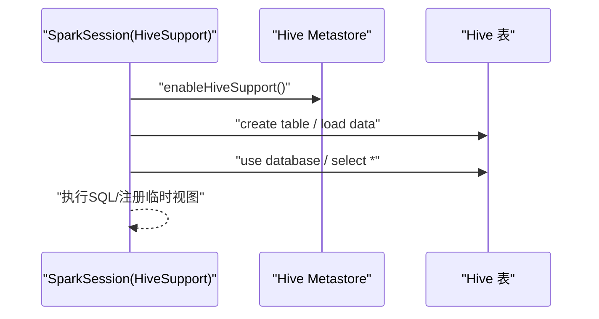
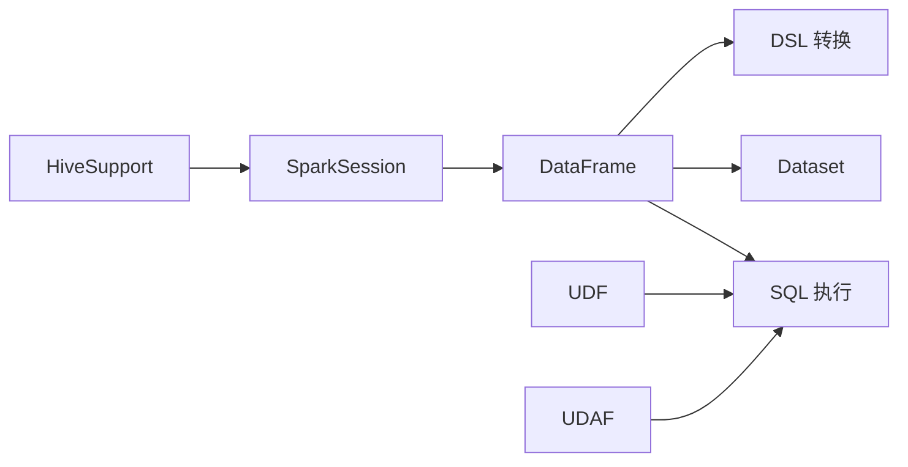

# Spark SQL与DataFrame/Dataset

<cite>
**本文引用的文件**
- [Spark02_SQL_DataFrame.scala](file://_04_sparkTest/src/main/java/com/atguigu/bigdata/spark/sql/Spark02_SQL_DataFrame.scala)
- [Spark03_SQL_DataFrame_DSL.scala](file://_04_sparkTest/src/main/java/com/atguigu/bigdata/spark/sql/Spark03_SQL_DataFrame_DSL.scala)
- [Spark04_SQL_RDD_DataFrame_Dataset.scala](file://_04_sparkTest/src/main/java/com/atguigu/bigdata/spark/sql/Spark04_SQL_RDD_DataFrame_Dataset.scala)
- [Spark05_SQL_RDD_Dataset.scala](file://_04_sparkTest/src/main/java/com/atguigu/bigdata/spark/sql/Spark05_SQL_RDD_Dataset.scala)
- [Spark06_SQL_DataFrame_Dataset.scala](file://_04_sparkTest/src/main/java/com/atguigu/bigdata/spark/sql/Spark06_SQL_DataFrame_Dataset.scala)
- [Spark07_SQL_Test.scala](file://_04_sparkTest/src/main/java/com/atguigu/bigdata/spark/sql/Spark07_SQL_Test.scala)
- [Spark08_SQL_UDAF.scala](file://_04_sparkTest/src/main/java/com/atguigu/bigdata/spark/sql/Spark08_SQL_UDAF.scala)
- [Spark09_SQL_UDAF_OldVersion.scala](file://_04_sparkTest/src/main/java/com/atguigu/bigdata/spark/sql/Spark09_SQL_UDAF_OldVersion.scala)
- [Spark10_SQL_UDAF_Class_OldVersion.scala](file://_04_sparkTest/src/main/java/com/atguigu/bigdata/spark/sql/Spark10_SQL_UDAF_Class_OldVersion.scala)
- [Spark11_SQL_SaveOrLoad.scala](file://_04_sparkTest/src/main/java/com/atguigu/bigdata/spark/sql/Spark11_SQL_SaveOrLoad.scala)
- [Spark13_SQL_JSON.scala](file://_04_sparkTest/src/main/java/com/atguigu/bigdata/spark/sql/Spark13_SQL_JSON.scala)
- [Spark14_SQL_CSV.scala](file://_04_sparkTest/src/main/java/com/atguigu/bigdata/spark/sql/Spark14_SQL_CSV.scala)
- [Spark15_SQL_JDBC.scala](file://_04_sparkTest/src/main/java/com/atguigu/bigdata/spark/sql/Spark15_SQL_JDBC.scala)
- [Spark16_SQL_Hive.scala](file://_04_sparkTest/src/main/java/com/atguigu/bigdata/spark/sql/Spark16_SQL_Hive.scala)
- [Spark16_SQL_Hive_my.scala](file://_04_sparkTest/src/main/java/com/atguigu/bigdata/spark/sql/Spark16_SQL_Hive_my.scala)
- [Spark17_SQL_Mock.scala](file://_04_sparkTest/src/main/java/com/atguigu/bigdata/spark/sql/Spark17_SQL_Mock.scala)
- [Spark18_SQL_Req.scala](file://_04_sparkTest/src/main/java/com/atguigu/bigdata/spark/sql/Spark18_SQL_Req.scala)
- [Spark18_SQL_Req_2.scala](file://_04_sparkTest/src/main/java/com/atguigu/bigdata/spark/sql/Spark18_SQL_Req_2.scala)
</cite>

## 目录
1. [引言](#引言)
2. [项目结构](#项目结构)
3. [核心组件](#核心组件)
4. [架构总览](#架构总览)
5. [详细组件分析](#详细组件分析)
6. [依赖关系分析](#依赖关系分析)
7. [性能考量](#性能考量)
8. [故障排查指南](#故障排查指南)
9. [结论](#结论)
10. [附录](#附录)

## 引言
本技术文档围绕Spark SQL与DataFrame/Dataset展开，系统阐述两者的关系与差异、在SQL中的角色、DataFrame DSL与SQL两种查询范式、数据读取（JSON/CSV/JDBC/Hive）、数据清洗与转换、聚合与窗口函数、UDAF（用户自定义聚合函数）的实现与版本差异，以及与Hive的集成与最佳实践。文档通过仓库中的示例代码路径进行说明，帮助读者快速理解并落地到实际工程。

## 项目结构
该仓库中与Spark SQL直接相关的核心示例位于“_04_sparkTest/src/main/java/com/atguigu/bigdata/spark/sql”目录下，涵盖从基础DataFrame创建、DSL与SQL访问、数据源读取（JSON/CSV/JDBC）、聚合与窗口函数、UDAF（含新旧版本）、Hive集成与复杂需求实战等主题。整体采用按功能模块划分的组织方式，便于学习与查阅。

**章节来源**
- file://_04_sparkTest/src/main/java/com/atguigu/bigdata/spark/sql/Spark02_SQL_DataFrame.scala#L1-L32
- file://_04_sparkTest/src/main/java/com/atguigu/bigdata/spark/sql/Spark13_SQL_JSON.scala#L1-L30
- file://_04_sparkTest/src/main/java/com/atguigu/bigdata/spark/sql/Spark14_SQL_CSV.scala#L1-L28
- file://_04_sparkTest/src/main/java/com/atguigu/bigdata/spark/sql/Spark15_SQL_JDBC.scala#L1-L39
- file://_04_sparkTest/src/main/java/com/atguigu/bigdata/spark/sql/Spark16_SQL_Hive.scala#L1-L26

## 核心组件
- SparkSession：所有Spark SQL操作的入口，负责构建DataFrame/Dataset、注册临时视图、执行SQL等。
- DataFrame：以命名列组织的分布式数据集，弱类型，适合SQL与DSL混合使用。
- Dataset：强类型集合，基于Encoder进行序列化，编译期类型安全，支持面向对象风格的转换。
- UDF/UDAF：用户自定义函数与聚合函数，扩展SQL能力；新旧版本API存在差异。
- HiveSupport：启用Hive支持后可直接使用Hive表与元数据。

**章节来源**
- file://_04_sparkTest/src/main/java/com/atguigu/bigdata/spark/sql/Spark02_SQL_DataFrame.scala#L1-L32
- file://_04_sparkTest/src/main/java/com/atguigu/bigdata/spark/sql/Spark04_SQL_RDD_DataFrame_Dataset.scala#L1-L51
- file://_04_sparkTest/src/main/java/com/atguigu/bigdata/spark/sql/Spark05_SQL_RDD_Dataset.scala#L1-L43
- file://_04_sparkTest/src/main/java/com/atguigu/bigdata/spark/sql/Spark07_SQL_Test.scala#L1-L42
- file://_04_sparkTest/src/main/java/com/atguigu/bigdata/spark/sql/Spark08_SQL_UDAF.scala#L1-L38
- file://_04_sparkTest/src/main/java/com/atguigu/bigdata/spark/sql/Spark16_SQL_Hive.scala#L1-L26

## 架构总览
下图展示了从数据源到DataFrame/Dataset再到SQL与DSL查询的整体流程，以及UDAF与Hive支持的关键节点。

**图表来源**
- [Spark13_SQL_JSON.scala](file://_04_sparkTest/src/main/java/com/atguigu/bigdata/spark/sql/Spark13_SQL_JSON.scala#L1-L30)
- [Spark14_SQL_CSV.scala](file://_04_sparkTest/src/main/java/com/atguigu/bigdata/spark/sql/Spark14_SQL_CSV.scala#L1-L28)
- [Spark15_SQL_JDBC.scala](file://_04_sparkTest/src/main/java/com/atguigu/bigdata/spark/sql/Spark15_SQL_JDBC.scala#L1-L39)
- [Spark16_SQL_Hive.scala](file://_04_sparkTest/src/main/java/com/atguigu/bigdata/spark/sql/Spark16_SQL_Hive.scala#L1-L26)
- [Spark02_SQL_DataFrame.scala](file://_04_sparkTest/src/main/java/com/atguigu/bigdata/spark/sql/Spark02_SQL_DataFrame.scala#L1-L32)
- [Spark07_SQL_Test.scala](file://_04_sparkTest/src/main/java/com/atguigu/bigdata/spark/sql/Spark07_SQL_Test.scala#L1-L42)
- [Spark08_SQL_UDAF.scala](file://_04_sparkTest/src/main/java/com/atguigu/bigdata/spark/sql/Spark08_SQL_UDAF.scala#L1-L38)

## 详细组件分析

### DataFrame与Dataset的关系与转换
- 关系要点
  - DataFrame是特定泛型的Dataset，二者共享底层逻辑计划优化器。
  - DataFrame偏向弱类型与SQL友好；Dataset偏向强类型与编译期安全。
- 转换路径
  - RDD → DataFrame/Dataset：通过隐式转换或显式映射后toDF/toDS。
  - DataFrame ↔ Dataset：as[类型]与toDF互转。
  - DataFrame → RDD[Row]：用于与RDD生态交互。

**图表来源**
- [Spark04_SQL_RDD_DataFrame_Dataset.scala](file://_04_sparkTest/src/main/java/com/atguigu/bigdata/spark/sql/Spark04_SQL_RDD_DataFrame_Dataset.scala#L1-L51)
- [Spark05_SQL_RDD_Dataset.scala](file://_04_sparkTest/src/main/java/com/atguigu/bigdata/spark/sql/Spark05_SQL_RDD_Dataset.scala#L1-L43)
- [Spark06_SQL_DataFrame_Dataset.scala](file://_04_sparkTest/src/main/java/com/atguigu/bigdata/spark/sql/Spark06_SQL_DataFrame_Dataset.scala#L1-L49)

**章节来源**
- file://_04_sparkTest/src/main/java/com/atguigu/bigdata/spark/sql/Spark04_SQL_RDD_DataFrame_Dataset.scala#L1-L51
- file://_04_sparkTest/src/main/java/com/atguigu/bigdata/spark/sql/Spark05_SQL_RDD_Dataset.scala#L1-L43
- file://_04_sparkTest/src/main/java/com/atguigu/bigdata/spark/sql/Spark06_SQL_DataFrame_Dataset.scala#L1-L49

### DataFrame DSL与SQL查询
- DSL：以链式API进行字段选择、过滤、聚合等，适合强类型场景。
- SQL：通过createTempView/全局视图注册后，使用spark.sql执行。
- 两者互补：复杂逻辑可用DSL表达，统一调度由Catalyst优化。

**图表来源**
- [Spark02_SQL_DataFrame.scala](file://_04_sparkTest/src/main/java/com/atguigu/bigdata/spark/sql/Spark02_SQL_DataFrame.scala#L1-L32)
- [Spark03_SQL_DataFrame_DSL.scala](file://_04_sparkTest/src/main/java/com/atguigu/bigdata/spark/sql/Spark03_SQL_DataFrame_DSL.scala#L1-L26)

**章节来源**
- file://_04_sparkTest/src/main/java/com/atguigu/bigdata/spark/sql/Spark02_SQL_DataFrame.scala#L1-L32
- file://_04_sparkTest/src/main/java/com/atguigu/bigdata/spark/sql/Spark03_SQL_DataFrame_DSL.scala#L1-L26

### 数据读取：JSON、CSV、JDBC
- JSON：逐行符合JSON格式即可，适合半结构化数据。
- CSV：可通过选项设置分隔符、推断Schema、是否包含头等。
- JDBC：支持读取与写出，需配置URL、驱动、凭据与表名。

**图表来源**
- [Spark13_SQL_JSON.scala](file://_04_sparkTest/src/main/java/com/atguigu/bigdata/spark/sql/Spark13_SQL_JSON.scala#L1-L30)
- [Spark14_SQL_CSV.scala](file://_04_sparkTest/src/main/java/com/atguigu/bigdata/spark/sql/Spark14_SQL_CSV.scala#L1-L28)
- [Spark15_SQL_JDBC.scala](file://_04_sparkTest/src/main/java/com/atguigu/bigdata/spark/sql/Spark15_SQL_JDBC.scala#L1-L39)

**章节来源**
- file://_04_sparkTest/src/main/java/com/atguigu/bigdata/spark/sql/Spark13_SQL_JSON.scala#L1-L30
- file://_04_sparkTest/src/main/java/com/atguigu/bigdata/spark/sql/Spark14_SQL_CSV.scala#L1-L28
- file://_04_sparkTest/src/main/java/com/atguigu/bigdata/spark/sql/Spark15_SQL_JDBC.scala#L1-L39

### 数据清洗与转换
- 基于DSL的常见操作：选择列、过滤、重命名、拼接、去重、排序等。
- UDF：当SQL无法满足业务时，注册UDF在SQL中使用，如给字段加前缀。
- 保存与加载：通用load接口可读取Parquet等格式；JSON/CSV读取更便捷。

**图表来源**
- [Spark07_SQL_Test.scala](file://_04_sparkTest/src/main/java/com/atguigu/bigdata/spark/sql/Spark07_SQL_Test.scala#L1-L42)
- [Spark11_SQL_SaveOrLoad.scala](file://_04_sparkTest/src/main/java/com/atguigu/bigdata/spark/sql/Spark11_SQL_SaveOrLoad.scala#L1-L33)

**章节来源**
- file://_04_sparkTest/src/main/java/com/atguigu/bigdata/spark/sql/Spark07_SQL_Test.scala#L1-L42
- file://_04_sparkTest/src/main/java/com/atguigu/bigdata/spark/sql/Spark11_SQL_SaveOrLoad.scala#L1-L33

### 聚合与窗口函数
- 聚合：count、avg、group by等在SQL与DSL中均可实现。
- 窗口函数：rank() over(partition by ...)用于分区内排序与取Top-N。
- 实战案例：关联城市与商品信息，统计各地区商品点击次数并取前三。

**图表来源**
- [Spark18_SQL_Req.scala](file://_04_sparkTest/src/main/java/com/atguigu/bigdata/spark/sql/Spark18_SQL_Req.scala#L1-L61)
- [Spark18_SQL_Req_2.scala](file://_04_sparkTest/src/main/java/com/atguigu/bigdata/spark/sql/Spark18_SQL_Req_2.scala#L38-L111)

**章节来源**
- file://_04_sparkTest/src/main/java/com/atguigu/bigdata/spark/sql/Spark18_SQL_Req.scala#L1-L61
- file://_04_sparkTest/src/main/java/com/atguigu/bigdata/spark/sql/Spark18_SQL_Req_2.scala#L38-L111

### UDAF（用户自定义聚合函数）：新旧版本差异
- 旧版本（Spark 3.0前）
  - 使用UserDefinedAggregateFunction或Aggregator强类型类实现。
  - 在SQL中不可直接使用强类型Aggregator；可在DSL中通过toColumn使用。
- 新版本（Spark 3.0+）
  - 通过functions.udaf将Aggregator包装后注册为SQL函数，可在SQL中直接调用。
- 示例覆盖
  - 旧版类实现与DSL使用：[Spark10_SQL_UDAF_Class_OldVersion.scala](file://_04_sparkTest/src/main/java/com/atguigu/bigdata/spark/sql/Spark10_SQL_UDAF_Class_OldVersion.scala#L1-L40)
  - 旧版函数式UDF：[Spark09_SQL_UDAF_OldVersion.scala](file://_04_sparkTest/src/main/java/com/atguigu/bigdata/spark/sql/Spark09_SQL_UDAF_OldVersion.scala#L1-L43)
  - 新版SQL可用UDAF：[Spark08_SQL_UDAF.scala](file://_04_sparkTest/src/main/java/com/atguigu/bigdata/spark/sql/Spark08_SQL_UDAF.scala#L1-L38)

**图表来源**
- [Spark08_SQL_UDAF.scala](file://_04_sparkTest/src/main/java/com/atguigu/bigdata/spark/sql/Spark08_SQL_UDAF.scala#L1-L38)
- [Spark09_SQL_UDAF_OldVersion.scala](file://_04_sparkTest/src/main/java/com/atguigu/bigdata/spark/sql/Spark09_SQL_UDAF_OldVersion.scala#L1-L43)
- [Spark10_SQL_UDAF_Class_OldVersion.scala](file://_04_sparkTest/src/main/java/com/atguigu/bigdata/spark/sql/Spark10_SQL_UDAF_Class_OldVersion.scala#L1-L40)

**章节来源**
- file://_04_sparkTest/src/main/java/com/atguigu/bigdata/spark/sql/Spark08_SQL_UDAF.scala#L1-L38
- file://_04_sparkTest/src/main/java/com/atguigu/bigdata/spark/sql/Spark09_SQL_UDAF_OldVersion.scala#L1-L43
- file://_04_sparkTest/src/main/java/com/atguigu/bigdata/spark/sql/Spark10_SQL_UDAF_Class_OldVersion.scala#L1-L40

### 与Hive集成与最佳实践
- 启用HiveSupport后，可直接使用Hive表与元数据。
- 示例包含建表、本地导入数据、切换数据库、查询等步骤。
- 最佳实践
  - 明确Hive仓库位置与权限。
  - 使用分区与桶表提升查询性能。
  - 在Spark中复用Hive元数据，避免重复建模。

**图表来源**
- [Spark16_SQL_Hive.scala](file://_04_sparkTest/src/main/java/com/atguigu/bigdata/spark/sql/Spark16_SQL_Hive.scala#L1-L26)
- [Spark16_SQL_Hive_my.scala](file://_04_sparkTest/src/main/java/com/atguigu/bigdata/spark/sql/Spark16_SQL_Hive_my.scala#L1-L28)
- [Spark17_SQL_Mock.scala](file://_04_sparkTest/src/main/java/com/atguigu/bigdata/spark/sql/Spark17_SQL_Mock.scala#L1-L80)

**章节来源**
- file://_04_sparkTest/src/main/java/com/atguigu/bigdata/spark/sql/Spark16_SQL_Hive.scala#L1-L26
- file://_04_sparkTest/src/main/java/com/atguigu/bigdata/spark/sql/Spark16_SQL_Hive_my.scala#L1-L28
- file://_04_sparkTest/src/main/java/com/atguigu/bigdata/spark/sql/Spark17_SQL_Mock.scala#L1-L80

## 依赖关系分析
- 组件耦合
  - SparkSession是核心入口，被所有示例依赖。
  - DataFrame/Dataset之间通过as/toDF/toDS相互转换，耦合度低。
  - UDF/UDAF通过注册后与SQL/DLS解耦。
- 外部依赖
  - JSON/CSV文件路径与内容格式需满足读取要求。
  - JDBC需正确配置驱动、URL、凭据与表名。
  - Hive集成需启用HiveSupport并确保元数据服务可用。

**图表来源**
- [Spark02_SQL_DataFrame.scala](file://_04_sparkTest/src/main/java/com/atguigu/bigdata/spark/sql/Spark02_SQL_DataFrame.scala#L1-L32)
- [Spark08_SQL_UDAF.scala](file://_04_sparkTest/src/main/java/com/atguigu/bigdata/spark/sql/Spark08_SQL_UDAF.scala#L1-L38)
- [Spark16_SQL_Hive.scala](file://_04_sparkTest/src/main/java/com/atguigu/bigdata/spark/sql/Spark16_SQL_Hive.scala#L1-L26)

**章节来源**
- file://_04_sparkTest/src/main/java/com/atguigu/bigdata/spark/sql/Spark02_SQL_DataFrame.scala#L1-L32
- file://_04_sparkTest/src/main/java/com/atguigu/bigdata/spark/sql/Spark08_SQL_UDAF.scala#L1-L38
- file://_04_sparkTest/src/main/java/com/atguigu/bigdata/spark/sql/Spark16_SQL_Hive.scala#L1-L26

## 性能考量
- 读取策略
  - 优先使用列式存储格式（如Parquet）以获得更好的压缩与扫描性能。
  - CSV/JSON读取时合理设置schema推断与分区，减少不必要的全量扫描。
- 计算优化
  - 利用Catalyst优化器与物化视图缓存热点查询。
  - 对大表join与聚合操作，尽量提前过滤与分区裁剪。
- 写出策略
  - JDBC写出时注意批处理与事务控制，避免单条记录写入导致性能下降。
- Hive集成
  - 合理使用分区字段，避免宽依赖与全表扫描。

[本节为通用指导，不直接分析具体文件]

## 故障排查指南
- JSON读取报错
  - 现象：非Parquet文件提示magic number不匹配。
  - 处理：明确指定format或使用spark.read.json读取JSON文件。
  - 参考：[Spark11_SQL_SaveOrLoad.scala](file://_04_sparkTest/src/main/java/com/atguigu/bigdata/spark/sql/Spark11_SQL_SaveOrLoad.scala#L1-L33)
- CSV读取异常
  - 现象：分隔符、头信息、Schema不匹配导致解析失败。
  - 处理：显式设置sep、inferSchema、header等选项。
  - 参考：[Spark14_SQL_CSV.scala](file://_04_sparkTest/src/main/java/com/atguigu/bigdata/spark/sql/Spark14_SQL_CSV.scala#L1-L28)
- JDBC连接失败
  - 现象：驱动、URL、凭据错误或网络问题。
  - 处理：核对driver、url、user、password与dbtable配置。
  - 参考：[Spark15_SQL_JDBC.scala](file://_04_sparkTest/src/main/java/com/atguigu/bigdata/spark/sql/Spark15_SQL_JDBC.scala#L1-L39)
- HiveSupport未启用
  - 现象：无法识别Hive表或元数据。
  - 处理：在SparkSession.builder中调用enableHiveSupport()。
  - 参考：[Spark16_SQL_Hive.scala](file://_04_sparkTest/src/main/java/com/atguigu/bigdata/spark/sql/Spark16_SQL_Hive.scala#L1-L26)

**章节来源**
- file://_04_sparkTest/src/main/java/com/atguigu/bigdata/spark/sql/Spark11_SQL_SaveOrLoad.scala#L1-L33
- file://_04_sparkTest/src/main/java/com/atguigu/bigdata/spark/sql/Spark14_SQL_CSV.scala#L1-L28
- file://_04_sparkTest/src/main/java/com/atguigu/bigdata/spark/sql/Spark15_SQL_JDBC.scala#L1-L39
- file://_04_sparkTest/src/main/java/com/atguigu/bigdata/spark/sql/Spark16_SQL_Hive.scala#L1-L26

## 结论
本仓库提供了从基础DataFrame/Dataset转换、DSL与SQL查询、多数据源读取、聚合与窗口函数、UDAF实现（新旧版本）、到Hive集成与实战需求的完整示例路径。建议在实际项目中结合这些模式：以DataFrame/Dataset为核心，配合SQL与DSL完成数据探索与生产任务；通过UDAF扩展复杂聚合；借助Hive实现元数据与历史数据的统一管理。

[本节为总结性内容，不直接分析具体文件]

## 附录
- 常用操作清单
  - 创建DataFrame：spark.read.json/csv/jdbc/format
  - 注册临时视图：createTempView
  - SQL查询：spark.sql
  - DSL转换：select/filter/groupBy/agg/window
  - UDF注册：spark.udf.register
  - UDAF注册（新版本）：functions.udaf(Aggregator).registerAsFunction
  - Hive支持：enableHiveSupport()

[本节为概览性内容，不直接分析具体文件]