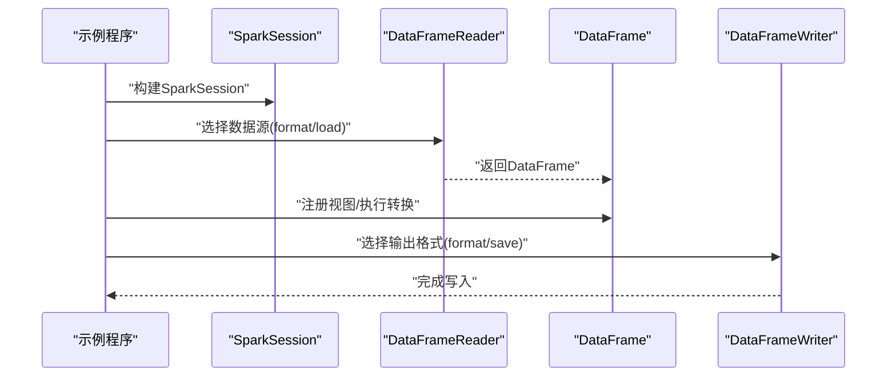
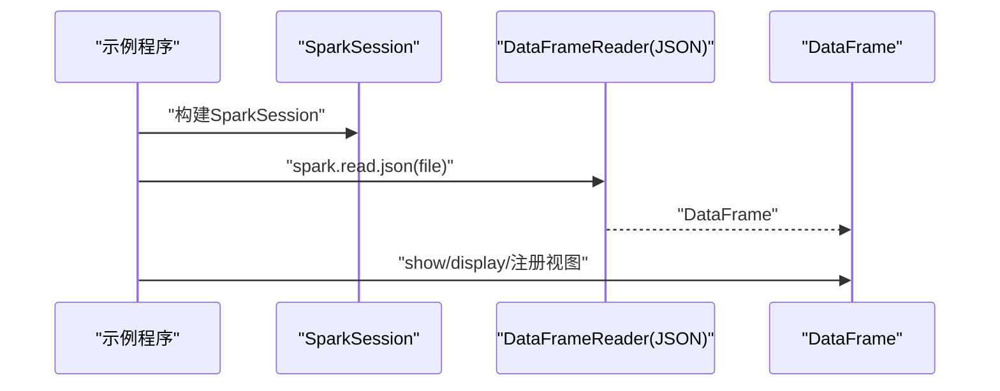
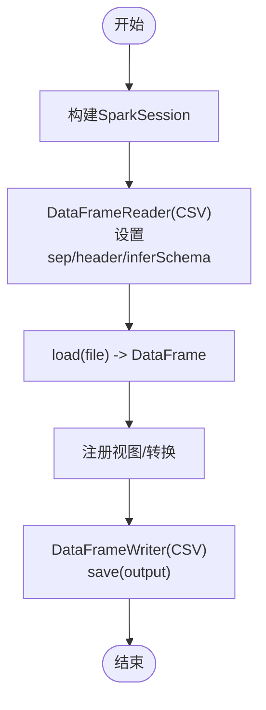
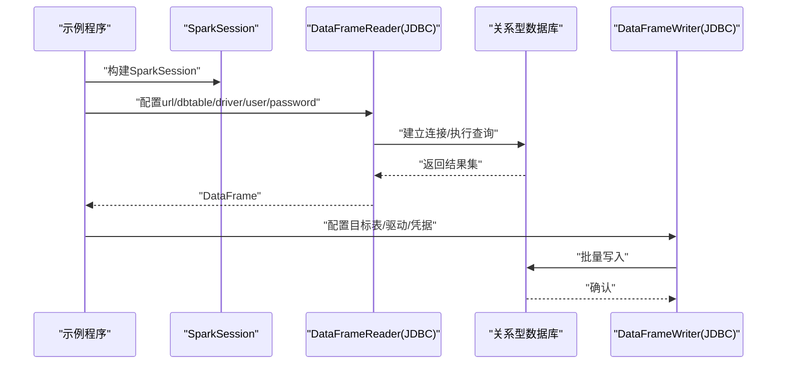
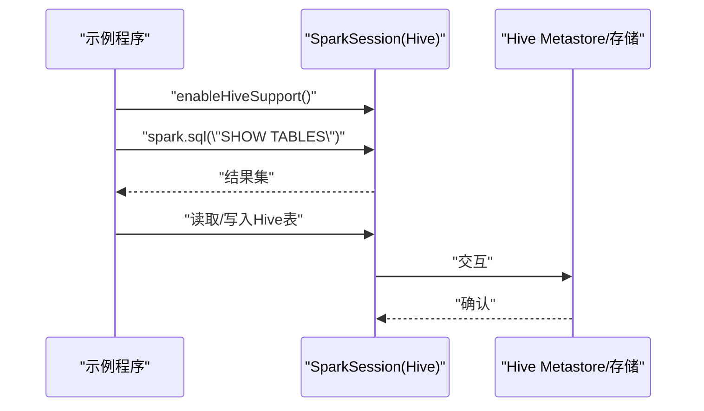
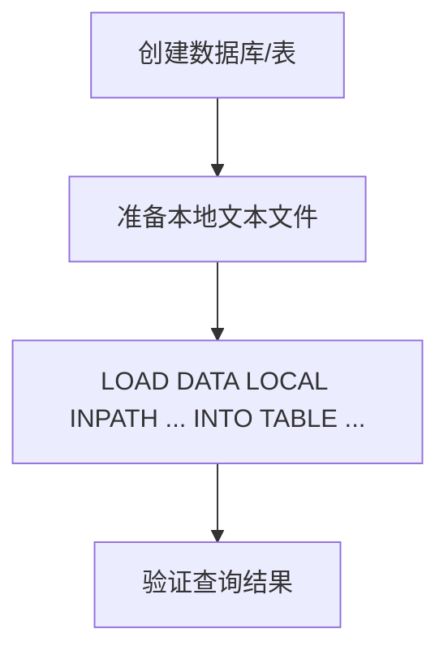
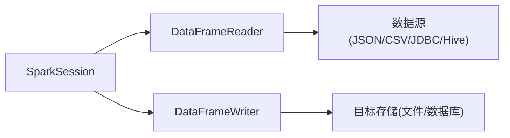

# 数据源集成与文件格式

<cite>
**本文引用的文件**
- [Spark01_Env.scala](file://_04_sparkTest/src/main/java/com/atguigu/bigdata/spark/sql/Spark01_Env.scala)
- [Spark02_SQL_DataFrame.scala](file://_04_sparkTest/src/main/java/com/atguigu/bigdata/spark/sql/Spark02_SQL_DataFrame.scala)
- [Spark03_SQL_DataFrame_DSL.scala](file://_04_sparkTest/src/main/java/com/atguigu/bigdata/spark/sql/Spark03_SQL_DataFrame_DSL.scala)
- [Spark11_SQL_SaveOrLoad.scala](file://_04_sparkTest/src/main/java/com/atguigu/bigdata/spark/sql/Spark11_SQL_SaveOrLoad.scala)
- [Spark12_SQL_SaveOrLoad.scala](file://_04_sparkTest/src/main/java/com/atguigu/bigdata/spark/sql/Spark12_SQL_SaveOrLoad.scala)
- [Spark13_SQL_JSON.scala](file://_04_sparkTest/src/main/java/com/atguigu/bigdata/spark/sql/Spark13_SQL_JSON.scala)
- [Spark14_SQL_CSV.scala](file://_04_sparkTest/src/main/java/com/atguigu/bigdata/spark/sql/Spark14_SQL_CSV.scala)
- [Spark14_SQL_CSV_my.scala](file://_04_sparkTest/src/main/java/com/atguigu/bigdata/spark/sql/Spark14_SQL_CSV_my.scala)
- [Spark15_SQL_JDBC.scala](file://_04_sparkTest/src/main/java/com/atguigu/bigdata/spark/sql/Spark15_SQL_JDBC.scala)
- [Spark15_SQL_JDBC_my.scala](file://_04_sparkTest/src/main/java/com/atguigu/bigdata/spark/sql/Spark15_SQL_JDBC_my.scala)
- [Spark16_SQL_Hive.scala](file://_04_sparkTest/src/main/java/com/atguigu/bigdata/spark/sql/Spark16_SQL_Hive.scala)
- [Spark16_SQL_Hive_my.scala](file://_04_sparkTest/src/main/java/com/atguigu/bigdata/spark/sql/Spark16_SQL_Hive_my.scala)
- [Spark17_SQL_Mock.scala](file://_04_sparkTest/src/main/java/com/atguigu/bigdata/spark/sql/Spark17_SQL_Mock.scala)
- [people.csv](file://_04_sparkTest/data/people.csv)
- [user.json](file://_04_sparkTest/data/user.json)
- [user_visit_action.txt](file://_04_sparkTest/data/user_visit_action.txt)
- [product_info.txt](file://_04_sparkTest/data/product_info.txt)
- [city_info.txt](file://_04_sparkTest/data/city_info.txt)
</cite>

## 目录
1. [引言](#引言)
2. [项目结构](#项目结构)
3. [核心组件](#核心组件)
4. [架构总览](#架构总览)
5. [详细组件分析](#详细组件分析)
6. [依赖分析](#依赖分析)
7. [性能考虑](#性能考虑)
8. [故障排查指南](#故障排查指南)
9. [结论](#结论)
10. [附录](#附录)

## 引言
本文件围绕Spark SQL在实际工程中的数据源集成与文件格式使用，系统梳理了JSON、CSV、JDBC、Hive等常见数据源的读取与写入方法，并结合仓库中的示例代码，给出参数配置、数据类型映射、分区策略、性能优化与外部系统集成等方面的实践建议。读者可据此快速完成从不同数据源读取数据并落盘到多种格式文件的任务。

## 项目结构
该仓库以“示例驱动”的方式组织Spark SQL相关代码，重点集中在_sparkTest模块的sql包下，涵盖环境搭建、DataFrame/Dataset操作、文件格式读写、JDBC与Hive集成、Mock数据加载等场景。数据样例位于data目录，便于直接运行示例。

```mermaid
graph TB
subgraph "示例代码"
S01["Spark01_Env.scala"]
S02["Spark02_SQL_DataFrame.scala"]
S03["Spark03_SQL_DataFrame_DSL.scala"]
S11["Spark11_SQL_SaveOrLoad.scala"]
S12["Spark12_SQL_SaveOrLoad.scala"]
S13["Spark13_SQL_JSON.scala"]
S14["Spark14_SQL_CSV.scala"]
S14m["Spark14_SQL_CSV_my.scala"]
S15["Spark15_SQL_JDBC.scala"]
S15m["Spark15_SQL_JDBC_my.scala"]
S16["Spark16_SQL_Hive.scala"]
S16m["Spark16_SQL_Hive_my.scala"]
S17["Spark17_SQL_Mock.scala"]
end
subgraph "数据样例"
D1["user.json"]
D2["people.csv"]
D3["user_visit_action.txt"]
D4["product_info.txt"]
D5["city_info.txt"]
end
S01 --> D1
S02 --> D1
S03 --> D1
S11 --> D1
S12 --> D1
S13 --> D1
S14 --> D2
S14m --> D2
S15 --> D1
S15m --> D1
S17 --> D3
S17 --> D4
S17 --> D5
```

**图示来源**
- [Spark01_Env.scala](file://_04_sparkTest/src/main/java/com/atguigu/bigdata/spark/sql/Spark01_Env.scala#L1-L33)
- [Spark13_SQL_JSON.scala](file://_04_sparkTest/src/main/java/com/atguigu/bigdata/spark/sql/Spark13_SQL_JSON.scala#L1-L30)
- [Spark14_SQL_CSV.scala](file://_04_sparkTest/src/main/java/com/atguigu/bigdata/spark/sql/Spark14_SQL_CSV.scala#L1-L28)
- [Spark15_SQL_JDBC.scala](file://_04_sparkTest/src/main/java/com/atguigu/bigdata/spark/sql/Spark15_SQL_JDBC.scala#L1-L39)
- [Spark17_SQL_Mock.scala](file://_04_sparkTest/src/main/java/com/atguigu/bigdata/spark/sql/Spark17_SQL_Mock.scala#L1-L80)

**章节来源**
- [Spark01_Env.scala](file://_04_sparkTest/src/main/java/com/atguigu/bigdata/spark/sql/Spark01_Env.scala#L1-L33)
- [Spark13_SQL_JSON.scala](file://_04_sparkTest/src/main/java/com/atguigu/bigdata/spark/sql/Spark13_SQL_JSON.scala#L1-L30)
- [Spark14_SQL_CSV.scala](file://_04_sparkTest/src/main/java/com/atguigu/bigdata/spark/sql/Spark14_SQL_CSV.scala#L1-L28)
- [Spark15_SQL_JDBC.scala](file://_04_sparkTest/src/main/java/com/atguigu/bigdata/spark/sql/Spark15_SQL_JDBC.scala#L1-L39)
- [Spark17_SQL_Mock.scala](file://_04_sparkTest/src/main/java/com/atguigu/bigdata/spark/sql/Spark17_SQL_Mock.scala#L1-L80)

## 核心组件
- SparkSession构建与生命周期管理：所有示例均通过builder模式创建SparkSession，本地开发常用local[*]模式。
- DataFrame读取与视图注册：统一采用spark.read.*或spark.read.format(...).load(...)方式读取；读取后可注册临时视图供SQL查询。
- 文件格式读写：示例覆盖JSON、CSV、JDBC、Hive等；默认保存格式为Parquet（可通过format显式指定）。
- 外部系统集成：JDBC连接数据库表；Hive启用内置支持；Mock数据通过SQL建表与本地文件导入。

**章节来源**
- [Spark01_Env.scala](file://_04_sparkTest/src/main/java/com/atguigu/bigdata/spark/sql/Spark01_Env.scala#L10-L31)
- [Spark11_SQL_SaveOrLoad.scala](file://_04_sparkTest/src/main/java/com/atguigu/bigdata/spark/sql/Spark11_SQL_SaveOrLoad.scala#L12-L26)
- [Spark12_SQL_SaveOrLoad.scala](file://_04_sparkTest/src/main/java/com/atguigu/bigdata/spark/sql/Spark12_SQL_SaveOrLoad.scala#L12-L20)
- [Spark16_SQL_Hive.scala](file://_04_sparkTest/src/main/java/com/atguigu/bigdata/spark/sql/Spark16_SQL_Hive.scala#L12-L21)

## 架构总览
下图展示了从数据源到DataFrame再到落盘的整体流程，以及Spark SQL在不同数据源间的通用调用路径。

**图示来源**
- [Spark01_Env.scala](file://_04_sparkTest/src/main/java/com/atguigu/bigdata/spark/sql/Spark01_Env.scala#L12-L28)
- [Spark11_SQL_SaveOrLoad.scala](file://_04_sparkTest/src/main/java/com/atguigu/bigdata/spark/sql/Spark11_SQL_SaveOrLoad.scala#L19-L26)
- [Spark12_SQL_SaveOrLoad.scala](file://_04_sparkTest/src/main/java/com/atguigu/bigdata/spark/sql/Spark12_SQL_SaveOrLoad.scala#L17-L20)

## 详细组件分析

### JSON数据源
- 读取要点
  - 支持单行JSON或多行JSON（NDJSON）；单文件整体需满足JSON规范，或每行一条记录。
  - 示例通过spark.read.json(file)直接读取，也可用spark.read.format("json").load(file)。
- 写出要点
  - 默认保存为Parquet；如需JSON写出，应使用spark.write.format("json").mode(...).save(path)。
- 参数与行为
  - inferSchema：自动推断schema（在CSV示例中有体现，JSON通常由解析器决定）。
  - multiLine：当JSON为多行且每行独立时，可开启以正确解析。
- 数据类型映射
  - 基本类型映射遵循Spark SQL标准；嵌套结构将映射为struct/array。
- 性能与优化
  - 建议使用压缩编码（如snappy/lz4）减少I/O。
  - 对大文件分片存储，避免单点热点。
- 外部系统集成
  - 可通过HDFS/S3等分布式文件系统访问；注意路径权限与网络延迟。

**图示来源**
- [Spark13_SQL_JSON.scala](file://_04_sparkTest/src/main/java/com/atguigu/bigdata/spark/sql/Spark13_SQL_JSON.scala#L12-L23)
- [Spark11_SQL_SaveOrLoad.scala](file://_04_sparkTest/src/main/java/com/atguigu/bigdata/spark/sql/Spark11_SQL_SaveOrLoad.scala#L19-L26)
- [Spark12_SQL_SaveOrLoad.scala](file://_04_sparkTest/src/main/java/com/atguigu/bigdata/spark/sql/Spark12_SQL_SaveOrLoad.scala#L17-L20)

**章节来源**
- [Spark13_SQL_JSON.scala](file://_04_sparkTest/src/main/java/com/atguigu/bigdata/spark/sql/Spark13_SQL_JSON.scala#L12-L23)
- [Spark11_SQL_SaveOrLoad.scala](file://_04_sparkTest/src/main/java/com/atguigu/bigdata/spark/sql/Spark11_SQL_SaveOrLoad.scala#L19-L26)
- [Spark12_SQL_SaveOrLoad.scala](file://_04_sparkTest/src/main/java/com/atguigu/bigdata/spark/sql/Spark12_SQL_SaveOrLoad.scala#L17-L20)

### CSV数据源
- 读取要点
  - 使用spark.read.format("csv").option(...).load(file)。
  - 常用选项：sep（分隔符）、header（是否含标题行）、inferSchema（自动推断）。
- 写出要点
  - 使用spark.write.format("csv").mode(...).save(path)，可配合option设置分隔符、是否包含头等。
- 数据类型映射
  - 字符串与数值类型按规则映射；布尔值需注意字符串形式。
- 性能与优化
  - 合理设置分隔符与字符集，避免转义开销。
  - 分区写入，减少小文件数量。
- 外部系统集成
  - 可对接HDFS/S3；注意跨集群传输带宽与延迟。

**图示来源**
- [Spark14_SQL_CSV.scala](file://_04_sparkTest/src/main/java/com/atguigu/bigdata/spark/sql/Spark14_SQL_CSV.scala#L17-L21)
- [Spark14_SQL_CSV_my.scala](file://_04_sparkTest/src/main/java/com/atguigu/bigdata/spark/sql/Spark14_SQL_CSV_my.scala#L17-L21)

**章节来源**
- [Spark14_SQL_CSV.scala](file://_04_sparkTest/src/main/java/com/atguigu/bigdata/spark/sql/Spark14_SQL_CSV.scala#L17-L21)
- [Spark14_SQL_CSV_my.scala](file://_04_sparkTest/src/main/java/com/atguigu/bigdata/spark/sql/Spark14_SQL_CSV_my.scala#L17-L21)

### JDBC数据源
- 读取要点
  - 使用spark.read.format("jdbc").option("url").option("dbtable").option("driver").option("user","password").load()。
- 写出要点
  - 使用spark.write.format("jdbc").option("url").option("dbtable").option("driver").option("user","password").save()。
- 参数与行为
  - url：JDBC连接串。
  - dbtable：表名或子查询（括号包裹）。
  - driver：驱动类名。
  - user/password：认证信息。
- 性能与优化
  - 并行读取：通过分区字段与numPartitions控制并行度。
  - 过滤下推：尽量在SQL中过滤，减少网络传输。
  - 批量写入：使用批量插入提升写入效率。
- 外部系统集成
  - 需确保驱动jar在classpath；生产环境建议使用连接池与超时重试。

**图示来源**
- [Spark15_SQL_JDBC.scala](file://_04_sparkTest/src/main/java/com/atguigu/bigdata/spark/sql/Spark15_SQL_JDBC.scala#L17-L33)
- [Spark15_SQL_JDBC_my.scala](file://_04_sparkTest/src/main/java/com/atguigu/bigdata/spark/sql/Spark15_SQL_JDBC_my.scala#L17-L36)

**章节来源**
- [Spark15_SQL_JDBC.scala](file://_04_sparkTest/src/main/java/com/atguigu/bigdata/spark/sql/Spark15_SQL_JDBC.scala#L17-L33)
- [Spark15_SQL_JDBC_my.scala](file://_04_sparkTest/src/main/java/com/atguigu/bigdata/spark/sql/Spark15_SQL_JDBC_my.scala#L17-L36)

### Hive数据源
- 读取要点
  - 通过enableHiveSupport()启用Hive支持；随后可直接使用spark.sql执行DDL/DML。
- 写出要点
  - 可将DataFrame保存为Hive表或导出为文件格式。
- 参数与行为
  - 内置Hive：无需额外元数据服务；外接Hive需配置metastore。
- 性能与优化
  - 列式存储（如Parquet/ORC）提升查询效率。
  - 分桶与分区策略降低扫描范围。
- 外部系统集成
  - 与HDFS/Hive Metastore协同；注意权限与命名空间。

**图示来源**
- [Spark16_SQL_Hive.scala](file://_04_sparkTest/src/main/java/com/atguigu/bigdata/spark/sql/Spark16_SQL_Hive.scala#L12-L21)
- [Spark16_SQL_Hive_my.scala](file://_04_sparkTest/src/main/java/com/atguigu/bigdata/spark/sql/Spark16_SQL_Hive_my.scala#L14-L23)

**章节来源**
- [Spark16_SQL_Hive.scala](file://_04_sparkTest/src/main/java/com/atguigu/bigdata/spark/sql/Spark16_SQL_Hive.scala#L12-L21)
- [Spark16_SQL_Hive_my.scala](file://_04_sparkTest/src/main/java/com/atguigu/bigdata/spark/sql/Spark16_SQL_Hive_my.scala#L14-L23)

### Mock数据加载（文本文件导入Hive表）
- 场景说明
  - 通过SQL建表并使用LOAD DATA LOCAL INPATH将本地文本文件导入Hive表，字段以制表符分隔。
- 实践要点
  - 先建表（指定行格式与分隔符），再导入数据，最后进行查询验证。
- 适用性
  - 适合离线批处理与演示场景；生产建议使用ETL工具或结构化管道。

**图示来源**
- [Spark17_SQL_Mock.scala](file://_04_sparkTest/src/main/java/com/atguigu/bigdata/spark/sql/Spark17_SQL_Mock.scala#L18-L72)

**章节来源**
- [Spark17_SQL_Mock.scala](file://_04_sparkTest/src/main/java/com/atguigu/bigdata/spark/sql/Spark17_SQL_Mock.scala#L18-L72)

## 依赖分析
- 组件耦合
  - 所有示例均依赖SparkSession作为入口，DataFrameReader/Writer贯穿读写两端。
  - Hive示例依赖enableHiveSupport()，JDBC示例依赖驱动与连接参数。
- 外部依赖
  - JDBC驱动需在运行环境中可用；Hive依赖HDFS与Metastore（根据启用方式而定）。
- 潜在循环依赖
  - 示例均为单文件任务，无循环依赖风险。

**图示来源**
- [Spark01_Env.scala](file://_04_sparkTest/src/main/java/com/atguigu/bigdata/spark/sql/Spark01_Env.scala#L12-L28)
- [Spark15_SQL_JDBC.scala](file://_04_sparkTest/src/main/java/com/atguigu/bigdata/spark/sql/Spark15_SQL_JDBC.scala#L17-L33)
- [Spark16_SQL_Hive.scala](file://_04_sparkTest/src/main/java/com/atguigu/bigdata/spark/sql/Spark16_SQL_Hive.scala#L12-L21)

**章节来源**
- [Spark01_Env.scala](file://_04_sparkTest/src/main/java/com/atguigu/bigdata/spark/sql/Spark01_Env.scala#L12-L28)
- [Spark15_SQL_JDBC.scala](file://_04_sparkTest/src/main/java/com/atguigu/bigdata/spark/sql/Spark15_SQL_JDBC.scala#L17-L33)
- [Spark16_SQL_Hive.scala](file://_04_sparkTest/src/main/java/com/atguigu/bigdata/spark/sql/Spark16_SQL_Hive.scala#L12-L21)

## 性能考虑
- 分区策略
  - 读取端：按分区字段划分，提高并行度与过滤效率。
  - 写出端：按业务键或时间维度分区，减少小文件并加速后续查询。
- 压缩与编码
  - 列式存储（Parquet/ORC）优先；压缩算法选择snappy/lz4/zstd平衡压缩比与CPU开销。
- 数据类型映射
  - 尽量使用紧凑类型（如Short/Int/Decimal）以节省内存与磁盘。
- I/O优化
  - 使用HDFS/S3等分布式文件系统；合理设置块大小与副本数。
- 写入策略
  - 批量写入、预排序写入、合并小文件。

## 故障排查指南
- JSON解析失败
  - 确认每行或整文件符合JSON规范；必要时启用multiLine选项。
  - 参考路径：[Spark13_SQL_JSON.scala](file://_04_sparkTest/src/main/java/com/atguigu/bigdata/spark/sql/Spark13_SQL_JSON.scala#L17-L23)
- CSV字段不匹配
  - 明确sep、header、inferSchema等选项；检查字符集与转义字符。
  - 参考路径：[Spark14_SQL_CSV.scala](file://_04_sparkTest/src/main/java/com/atguigu/bigdata/spark/sql/Spark14_SQL_CSV.scala#L17-L21)
- JDBC连接异常
  - 校验url、driver、user、password；确认网络连通与防火墙策略。
  - 参考路径：[Spark15_SQL_JDBC.scala](file://_04_sparkTest/src/main/java/com/atguigu/bigdata/spark/sql/Spark15_SQL_JDBC.scala#L17-L33)
- Hive启用失败
  - 确认已调用enableHiveSupport()；检查Hive元数据配置。
  - 参考路径：[Spark16_SQL_Hive.scala](file://_04_sparkTest/src/main/java/com/atguigu/bigdata/spark/sql/Spark16_SQL_Hive.scala#L12-L21)
- 写入模式与并发
  - mode参数（如overwrite/append）影响幂等性；并行度与分区策略影响吞吐。
  - 参考路径：[Spark12_SQL_SaveOrLoad.scala](file://_04_sparkTest/src/main/java/com/atguigu/bigdata/spark/sql/Spark12_SQL_SaveOrLoad.scala#L17-L20)

**章节来源**
- [Spark13_SQL_JSON.scala](file://_04_sparkTest/src/main/java/com/atguigu/bigdata/spark/sql/Spark13_SQL_JSON.scala#L17-L23)
- [Spark14_SQL_CSV.scala](file://_04_sparkTest/src/main/java/com/atguigu/bigdata/spark/sql/Spark14_SQL_CSV.scala#L17-L21)
- [Spark15_SQL_JDBC.scala](file://_04_sparkTest/src/main/java/com/atguigu/bigdata/spark/sql/Spark15_SQL_JDBC.scala#L17-L33)
- [Spark16_SQL_Hive.scala](file://_04_sparkTest/src/main/java/com/atguigu/bigdata/spark/sql/Spark16_SQL_Hive.scala#L12-L21)
- [Spark12_SQL_SaveOrLoad.scala](file://_04_sparkTest/src/main/java/com/atguigu/bigdata/spark/sql/Spark12_SQL_SaveOrLoad.scala#L17-L20)

## 结论
通过本仓库中的示例，可以系统掌握Spark SQL在JSON、CSV、JDBC、Hive等数据源上的读写方法与参数配置。结合分区、压缩、列式存储等优化手段，可在保证易用性的同时获得良好的性能表现。建议在生产环境中进一步完善错误处理、监控与运维体系。

## 附录
- 常用API与参数速查
  - 读取：spark.read.format(...).option(...).load(path)
  - 写出：spark.write.format(...).mode(...).save(path)
  - Hive：enableHiveSupport() + spark.sql(...)
  - JDBC：url、driver、user、password、dbtable
- 数据样例位置
  - JSON：[user.json](file://_04_sparkTest/data/user.json)
  - CSV：[people.csv](file://_04_sparkTest/data/people.csv)
  - 文本导入：[user_visit_action.txt](file://_04_sparkTest/data/user_visit_action.txt)、[product_info.txt](file://_04_sparkTest/data/product_info.txt)、[city_info.txt](file://_04_sparkTest/data/city_info.txt)