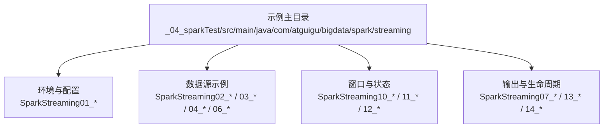
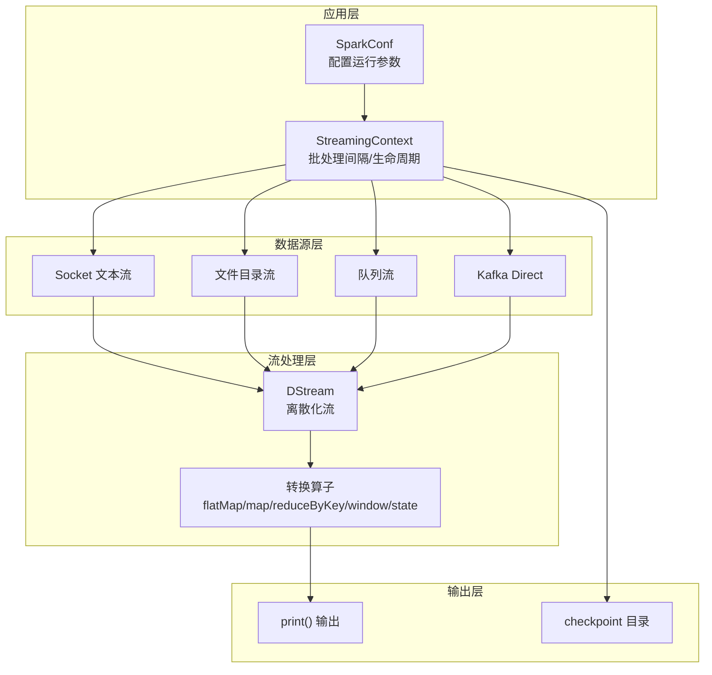
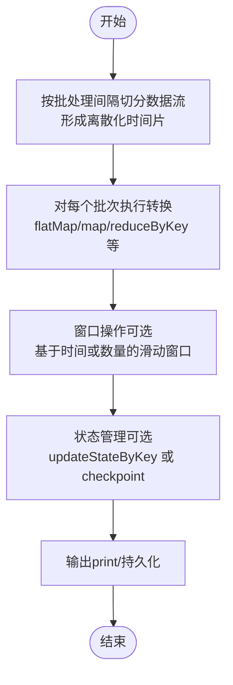
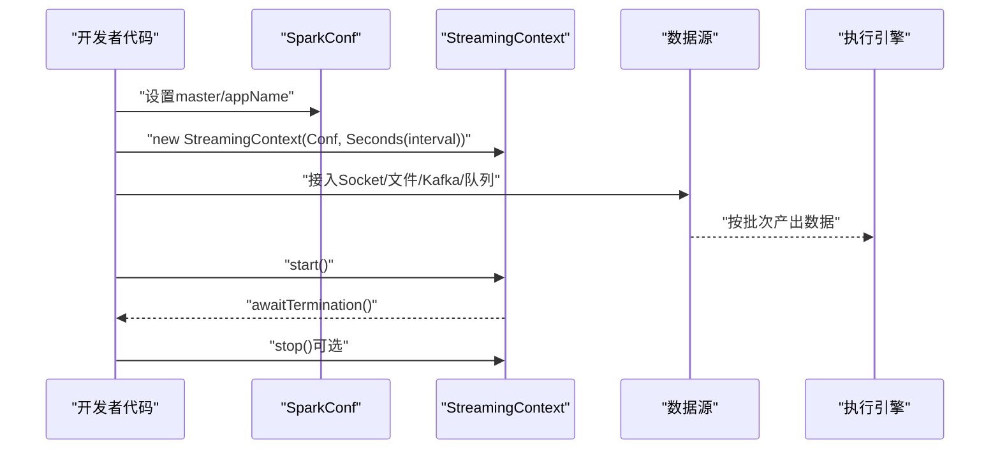
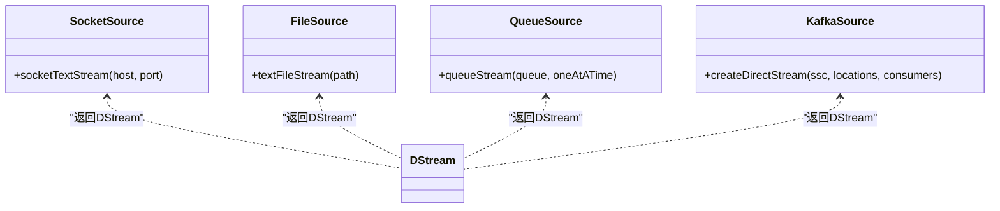
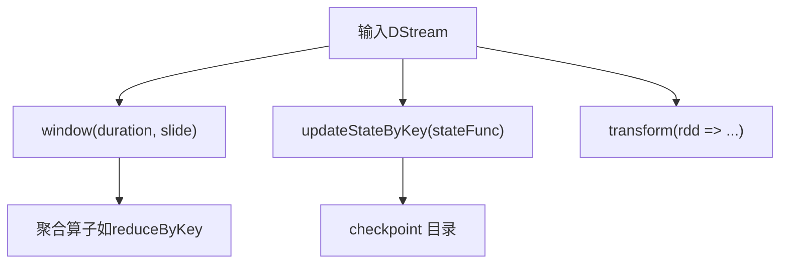
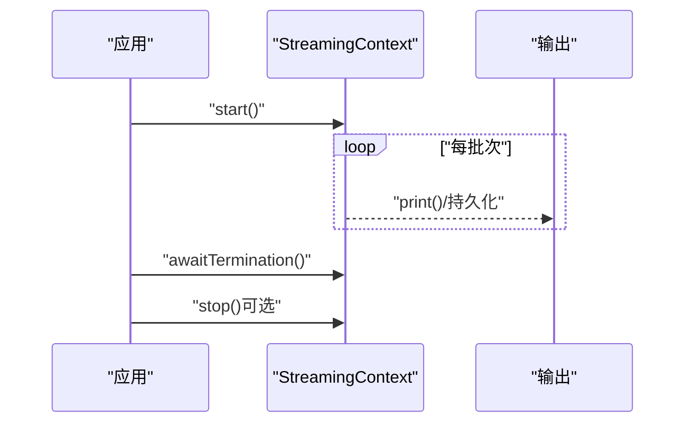
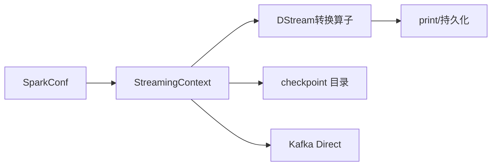

# Spark Streaming基础概念

<cite>
**本文引用的文件**
- [SparkStreaming01_Env.scala](file://_04_sparkTest/src/main/java/com/atguigu/bigdata/spark/streaming/SparkStreaming01_Env.scala)
- [SparkStreaming01_通用配置.scala](file://_04_sparkTest/src/main/java/B_日期/_12月30日/SparkStreaming01_通用配置.scala)
- [SparkStreaming02_WordCount.scala](file://_04_sparkTest/src/main/java/com/atguigu/bigdata/spark/streaming/SparkStreaming02_WordCount.scala)
- [SparkStreaming03_Source_Dir.scala](file://_04_sparkTest/src/main/java/com/atguigu/bigdata/spark/streaming/SparkStreaming03_Source_Dir.scala)
- [SparkStreaming04_Source_Queue.scala](file://_04_sparkTest/src/main/java/com/atguigu/bigdata/spark/streaming/SparkStreaming04_Source_Queue.scala)
- [SparkStreaming06_Source_Kafka.scala](file://_04_sparkTest/src/main/java/com/atguigu/bigdata/spark/streaming/SparkStreaming06_Source_Kafka.scala)
- [SparkStreaming07_Transform_Output.scala](file://_04_sparkTest/src/main/java/com/atguigu/bigdata/spark/streaming/SparkStreaming07_Transform_Output.scala)
- [SparkStreaming08_NoState.scala](file://_04_sparkTest/src/main/java/com/atguigu/bigdata/spark/streaming/SparkStreaming08_NoState.scala)
- [SparkStreaming09_NoState_Join.scala](file://_04_sparkTest/src/main/java/com/atguigu/bigdata/spark/streaming/SparkStreaming09_NoState_Join.scala)
- [SparkStreaming10_State.scala](file://_04_sparkTest/src/main/java/com/atguigu/bigdata/spark/streaming/SparkStreaming10_State.scala)
- [SparkStreaming11_Resume.scala](file://_04_sparkTest/src/main/java/com/atguigu/bigdata/spark/streaming/SparkStreaming11_Resume.scala)
- [SparkStreaming12_Window.scala](file://_04_sparkTest/src/main/java/com/atguigu/bigdata/spark/streaming/SparkStreaming12_Window.scala)
- [SparkStreaming12_Window_1.scala](file://_04_sparkTest/src/main/java/com/atguigu/bigdata/spark/streaming/SparkStreaming12_Window_1.scala)
- [SparkStreaming13_Output.scala](file://_04_sparkTest/src/main/java/com/atguigu/bigdata/spark/streaming/SparkStreaming13_Output.scala)
- [SparkStreaming14_Close.scala](file://_04_sparkTest/src/main/java/com/atguigu/bigdata/spark/streaming/SparkStreaming14_Close.scala)
</cite>

## 目录
1. [引言](#引言)
2. [项目结构](#项目结构)
3. [核心组件](#核心组件)
4. [架构总览](#架构总览)
5. [详细组件分析](#详细组件分析)
6. [依赖关系分析](#依赖关系分析)
7. [性能考量](#性能考量)
8. [故障排查指南](#故障排查指南)
9. [结论](#结论)
10. [附录](#附录)

## 引言
本技术文档围绕Spark Streaming的基础概念展开，重点阐释DStream（离散化流）的核心思想、微批处理机制的工作原理，以及StreamingContext的创建与配置。文档通过仓库中的示例代码路径，系统讲解批处理间隔（Batch Interval）的选择原则、与传统批处理的区别，并提供可直接对照参考的完整示例清单，帮助读者快速搭建开发环境并解决常见问题。

## 项目结构
该仓库中与Spark Streaming相关的示例集中在“_04_sparkTest/src/main/java/com/atguigu/bigdata/spark/streaming”目录下，按功能模块组织，覆盖环境初始化、数据源接入（Socket、文件、Kafka、队列）、窗口与状态管理、输出与关闭等主题。这些示例均以StreamingContext为核心入口，演示了批处理间隔设置、DStream链式转换、以及运行生命周期管理。

**章节来源**
- file://_04_sparkTest/src/main/java/com/atguigu/bigdata/spark/streaming/SparkStreaming01_Env.scala#L1-L20
- file://_04_sparkTest/src/main/java/B_日期/_12月30日/SparkStreaming01_通用配置.scala#L1-L36

## 核心组件
- SparkConf：用于配置Spark应用的运行参数，如本地模式、应用名称等。
- StreamingContext：Spark Streaming的运行时上下文，负责接收SparkConf并指定批处理间隔；同时提供数据源接入、DStream构建、启动与停止等能力。
- DStream：离散化流，是对连续数据流的时间分片抽象。每个时间片对应一个RDD，DStream上的操作最终映射为对各批次RDD的转换与行动。
- 批处理间隔（Batch Interval）：决定微批处理的粒度，直接影响延迟与吞吐之间的平衡。

上述组件在以下示例中均有体现：
- 环境与配置：SparkStreaming01_Env.scala、SparkStreaming01_通用配置.scala
- 基础WordCount：SparkStreaming02_WordCount.scala
- 数据源：SparkStreaming03_Source_Dir.scala、SparkStreaming04_Source_Queue.scala、SparkStreaming06_Source_Kafka.scala
- 状态与窗口：SparkStreaming10_State.scala、SparkStreaming12_Window.scala、SparkStreaming12_Window_1.scala
- 输出与生命周期：SparkStreaming07_Transform_Output.scala、SparkStreaming13_Output.scala、SparkStreaming14_Close.scala

**章节来源**
- file://_04_sparkTest/src/main/java/com/atguigu/bigdata/spark/streaming/SparkStreaming01_Env.scala#L1-L20
- file://_04_sparkTest/src/main/java/B_日期/_12月30日/SparkStreaming01_通用配置.scala#L1-L36
- file://_04_sparkTest/src/main/java/com/atguigu/bigdata/spark/streaming/SparkStreaming02_WordCount.scala#L1-L36

## 架构总览
下图展示了Spark Streaming从数据源到DStream再到计算与输出的整体流程，以及StreamingContext在整个过程中的作用。

**图表来源**
- [SparkStreaming01_Env.scala](file://_04_sparkTest/src/main/java/com/atguigu/bigdata/spark/streaming/SparkStreaming01_Env.scala#L1-L20)
- [SparkStreaming01_通用配置.scala](file://_04_sparkTest/src/main/java/B_日期/_12月30日/SparkStreaming01_通用配置.scala#L1-L36)
- [SparkStreaming02_WordCount.scala](file://_04_sparkTest/src/main/java/com/atguigu/bigdata/spark/streaming/SparkStreaming02_WordCount.scala#L1-L36)
- [SparkStreaming03_Source_Dir.scala](file://_04_sparkTest/src/main/java/com/atguigu/bigdata/spark/streaming/SparkStreaming03_Source_Dir.scala#L1-L28)
- [SparkStreaming04_Source_Queue.scala](file://_04_sparkTest/src/main/java/com/atguigu/bigdata/spark/streaming/SparkStreaming04_Source_Queue.scala#L1-L38)
- [SparkStreaming06_Source_Kafka.scala](file://_04_sparkTest/src/main/java/com/atguigu/bigdata/spark/streaming/SparkStreaming06_Source_Kafka.scala#L1-L72)
- [SparkStreaming10_State.scala](file://_04_sparkTest/src/main/java/com/atguigu/bigdata/spark/streaming/SparkStreaming10_State.scala#L1-L40)
- [SparkStreaming12_Window.scala](file://_04_sparkTest/src/main/java/com/atguigu/bigdata/spark/streaming/SparkStreaming12_Window.scala#L1-L32)
- [SparkStreaming12_Window_1.scala](file://_04_sparkTest/src/main/java/com/atguigu/bigdata/spark/streaming/SparkStreaming12_Window_1.scala#L1-L38)
- [SparkStreaming13_Output.scala](file://_04_sparkTest/src/main/java/com/atguigu/bigdata/spark/streaming/SparkStreaming13_Output.scala#L1-L200)
- [SparkStreaming14_Close.scala](file://_04_sparkTest/src/main/java/com/atguigu/bigdata/spark/streaming/SparkStreaming14_Close.scala#L1-L200)

## 详细组件分析

### DStream（离散化流）与微批处理
- DStream是对连续数据流在时间轴上的离散化切片，每个切片对应一个RDD。Spark Streaming将实时数据流切分为固定时间长度的小批次（由批处理间隔决定），在每个批次内以批处理的方式进行计算，从而实现近实时处理。
- 典型的DStream转换包括：flatMap、map、reduceByKey、window、updateStateByKey等。这些转换在每个批次上独立执行，形成“微批处理”的效果。

**图表来源**
- [SparkStreaming02_WordCount.scala](file://_04_sparkTest/src/main/java/com/atguigu/bigdata/spark/streaming/SparkStreaming02_WordCount.scala#L1-L36)
- [SparkStreaming12_Window.scala](file://_04_sparkTest/src/main/java/com/atguigu/bigdata/spark/streaming/SparkStreaming12_Window.scala#L1-L32)
- [SparkStreaming10_State.scala](file://_04_sparkTest/src/main/java/com/atguigu/bigdata/spark/streaming/SparkStreaming10_State.scala#L1-L40)

**章节来源**
- file://_04_sparkTest/src/main/java/com/atguigu/bigdata/spark/streaming/SparkStreaming02_WordCount.scala#L1-L36
- file://_04_sparkTest/src/main/java/com/atguigu/bigdata/spark/streaming/SparkStreaming12_Window.scala#L1-L32
- file://_04_sparkTest/src/main/java/com/atguigu/bigdata/spark/streaming/SparkStreaming10_State.scala#L1-L40

### StreamingContext 创建与配置
- 创建步骤：先构造SparkConf，再以批处理间隔（Seconds或Duration）创建StreamingContext。
- 生命周期：start()启动采集器与计算，awaitTermination()阻塞主线程等待停止信号；stop()显式关闭。
- 批处理间隔选择：示例中使用Seconds(1)、Seconds(3)、Seconds(9)等，间隔越短延迟越低但资源开销越大；过长则响应不及时。应结合业务延迟要求与集群资源权衡。

**图表来源**
- [SparkStreaming01_Env.scala](file://_04_sparkTest/src/main/java/com/atguigu/bigdata/spark/streaming/SparkStreaming01_Env.scala#L1-L20)
- [SparkStreaming01_通用配置.scala](file://_04_sparkTest/src/main/java/B_日期/_12月30日/SparkStreaming01_通用配置.scala#L1-L36)
- [SparkStreaming02_WordCount.scala](file://_04_sparkTest/src/main/java/com/atguigu/bigdata/spark/streaming/SparkStreaming02_WordCount.scala#L1-L36)

**章节来源**
- file://_04_sparkTest/src/main/java/com/atguigu/bigdata/spark/streaming/SparkStreaming01_Env.scala#L1-L20
- file://_04_sparkTest/src/main/java/B_日期/_12月30日/SparkStreaming01_通用配置.scala#L1-L36
- file://_04_sparkTest/src/main/java/com/atguigu/bigdata/spark/streaming/SparkStreaming02_WordCount.scala#L1-L36

### 数据源接入
- Socket文本流：适合本地测试与演示，按行读取。
- 文件目录流：监听目录新增文件，适合离线数据接入。
- 队列流：通过Scala mutable.Queue 提供模拟数据流，便于验证窗口与状态。
- Kafka直连：使用KafkaUtils.createDirectStream接入，避免Receiver瓶颈。

**图表来源**
- [SparkStreaming02_WordCount.scala](file://_04_sparkTest/src/main/java/com/atguigu/bigdata/spark/streaming/SparkStreaming02_WordCount.scala#L1-L36)
- [SparkStreaming03_Source_Dir.scala](file://_04_sparkTest/src/main/java/com/atguigu/bigdata/spark/streaming/SparkStreaming03_Source_Dir.scala#L1-L28)
- [SparkStreaming04_Source_Queue.scala](file://_04_sparkTest/src/main/java/com/atguigu/bigdata/spark/streaming/SparkStreaming04_Source_Queue.scala#L1-L38)
- [SparkStreaming06_Source_Kafka.scala](file://_04_sparkTest/src/main/java/com/atguigu/bigdata/spark/streaming/SparkStreaming06_Source_Kafka.scala#L1-L72)

**章节来源**
- file://_04_sparkTest/src/main/java/com/atguigu/bigdata/spark/streaming/SparkStreaming02_WordCount.scala#L1-L36
- file://_04_sparkTest/src/main/java/com/atguigu/bigdata/spark/streaming/SparkStreaming03_Source_Dir.scala#L1-L28
- file://_04_sparkTest/src/main/java/com/atguigu/bigdata/spark/streaming/SparkStreaming04_Source_Queue.scala#L1-L38
- file://_04_sparkTest/src/main/java/com/atguigu/bigdata/spark/streaming/SparkStreaming06_Source_Kafka.scala#L1-L72

### 窗口与状态管理
- 窗口：通过window(duration, slide)将多个批次聚合，窗口大小与滑动步长必须是批处理间隔的整数倍。
- 状态：updateStateByKey支持跨批次的状态累积；需设置checkpoint目录以保证容错。
- transform：可在Driver端对每个批次的RDD执行自定义逻辑，适合需要在Driver侧维护状态或周期性任务的场景。

**图表来源**
- [SparkStreaming12_Window.scala](file://_04_sparkTest/src/main/java/com/atguigu/bigdata/spark/streaming/SparkStreaming12_Window.scala#L1-L32)
- [SparkStreaming12_Window_1.scala](file://_04_sparkTest/src/main/java/com/atguigu/bigdata/spark/streaming/SparkStreaming12_Window_1.scala#L1-L38)
- [SparkStreaming10_State.scala](file://_04_sparkTest/src/main/java/com/atguigu/bigdata/spark/streaming/SparkStreaming10_State.scala#L1-L40)
- [SparkStreaming08_NoState.scala](file://_04_sparkTest/src/main/java/com/atguigu/bigdata/spark/streaming/SparkStreaming08_NoState.scala#L1-L58)

**章节来源**
- file://_04_sparkTest/src/main/java/com/atguigu/bigdata/spark/streaming/SparkStreaming12_Window.scala#L1-L32
- file://_04_sparkTest/src/main/java/com/atguigu/bigdata/spark/streaming/SparkStreaming12_Window_1.scala#L1-L38
- file://_04_sparkTest/src/main/java/com/atguigu/bigdata/spark/streaming/SparkStreaming10_State.scala#L1-L40
- file://_04_sparkTest/src/main/java/com/atguigu/bigdata/spark/streaming/SparkStreaming08_NoState.scala#L1-L58

### 输出与生命周期管理
- print()：默认输出到控制台，常用于调试与演示。
- checkpoint：用于状态恢复与容错，需在StreamingContext上设置目录。
- awaitTermination：阻塞主线程，等待外部停止信号；stop()用于优雅关闭。

**图表来源**
- [SparkStreaming07_Transform_Output.scala](file://_04_sparkTest/src/main/java/com/atguigu/bigdata/spark/streaming/SparkStreaming07_Transform_Output.scala#L1-L36)
- [SparkStreaming10_State.scala](file://_04_sparkTest/src/main/java/com/atguigu/bigdata/spark/streaming/SparkStreaming10_State.scala#L1-L40)
- [SparkStreaming13_Output.scala](file://_04_sparkTest/src/main/java/com/atguigu/bigdata/spark/streaming/SparkStreaming13_Output.scala#L1-L200)
- [SparkStreaming14_Close.scala](file://_04_sparkTest/src/main/java/com/atguigu/bigdata/spark/streaming/SparkStreaming14_Close.scala#L1-L200)

**章节来源**
- file://_04_sparkTest/src/main/java/com/atguigu/bigdata/spark/streaming/SparkStreaming07_Transform_Output.scala#L1-L36
- file://_04_sparkTest/src/main/java/com/atguigu/bigdata/spark/streaming/SparkStreaming10_State.scala#L1-L40
- file://_04_sparkTest/src/main/java/com/atguigu/bigdata/spark/streaming/SparkStreaming13_Output.scala#L1-L200
- file://_04_sparkTest/src/main/java/com/atguigu/bigdata/spark/streaming/SparkStreaming14_Close.scala#L1-L200

## 依赖关系分析
- 组件耦合：StreamingContext作为核心协调者，向上承接SparkConf与数据源，向下驱动DStream转换与输出。
- 外部依赖：Kafka直连依赖kafka-clients与spark-streaming-kafka-0-10包；checkpoint依赖HDFS或本地目录。
- 常见循环依赖：示例中未见循环依赖，均为单向数据流。

**图表来源**
- [SparkStreaming06_Source_Kafka.scala](file://_04_sparkTest/src/main/java/com/atguigu/bigdata/spark/streaming/SparkStreaming06_Source_Kafka.scala#L1-L72)
- [SparkStreaming10_State.scala](file://_04_sparkTest/src/main/java/com/atguigu/bigdata/spark/streaming/SparkStreaming10_State.scala#L1-L40)

**章节来源**
- file://_04_sparkTest/src/main/java/com/atguigu/bigdata/spark/streaming/SparkStreaming06_Source_Kafka.scala#L1-L72
- file://_04_sparkTest/src/main/java/com/atguigu/bigdata/spark/streaming/SparkStreaming10_State.scala#L1-L40

## 性能考量
- 批处理间隔：更短的间隔能降低延迟，但增加调度与序列化开销；应根据业务SLA与集群资源选择合适值。
- 并行度：合理设置分区数与执行器资源，避免单点瓶颈。
- 窗口与状态：窗口过大或状态键空间过大可能引发内存压力；建议结合外部存储（如Redis）实现高效状态管理。
- 输出频率：频繁print会影响吞吐，生产环境建议落盘或发送至消息系统。

[本节为通用指导，无需具体文件引用]

## 故障排查指南
- checkpoint未设置：使用updateStateByKey或基于时间的窗口函数时，若未设置checkpoint目录会报错。请在StreamingContext上调用checkpoint设置目录。
- 窗口参数非法：窗口大小与滑动步长必须为批处理间隔的整数倍，否则抛出异常。请检查window参数与批间隔的一致性。
- 程序提前退出：未调用start()或awaitTermination()，主线程可能在采集器启动前结束。确保在创建StreamingContext后调用start()并阻塞等待。
- 资源不足：CPU/内存/磁盘IO不足会导致批次堆积与延迟上升。可通过增大executor资源或调整批间隔缓解。

**章节来源**
- file://_04_sparkTest/src/main/java/com/atguigu/bigdata/spark/streaming/SparkStreaming10_State.scala#L1-L40
- file://_04_sparkTest/src/main/java/com/atguigu/bigdata/spark/streaming/SparkStreaming12_Window.scala#L1-L32
- file://_04_sparkTest/src/main/java/com/atguigu/bigdata/spark/streaming/SparkStreaming02_WordCount.scala#L1-L36

## 结论
Spark Streaming通过将连续数据流切分为固定时间片的微批处理，实现了近实时的数据处理能力。StreamingContext作为核心运行时，统一管理批间隔、数据源接入、DStream转换与生命周期。借助窗口与状态管理，可满足复杂业务场景；配合checkpoint与外部存储，可提升容错与性能。示例代码提供了从环境搭建到输出关闭的完整实践路径，便于快速落地。

[本节为总结性内容，无需具体文件引用]

## 附录
- 示例清单（可直接对照的代码路径）
  - 环境与配置：SparkStreaming01_Env.scala、SparkStreaming01_通用配置.scala
  - 基础WordCount：SparkStreaming02_WordCount.scala
  - 文件与队列数据源：SparkStreaming03_Source_Dir.scala、SparkStreaming04_Source_Queue.scala
  - Kafka数据源：SparkStreaming06_Source_Kafka.scala
  - 无状态与transform：SparkStreaming07_Transform_Output.scala、SparkStreaming08_NoState.scala
  - 无状态连接：SparkStreaming09_NoState_Join.scala
  - 状态与checkpoint：SparkStreaming10_State.scala
  - 恢复与重启：SparkStreaming11_Resume.scala
  - 窗口与窗口函数：SparkStreaming12_Window.scala、SparkStreaming12_Window_1.scala
  - 输出与生命周期：SparkStreaming13_Output.scala、SparkStreaming14_Close.scala

[本节为索引性内容，无需具体文件引用]