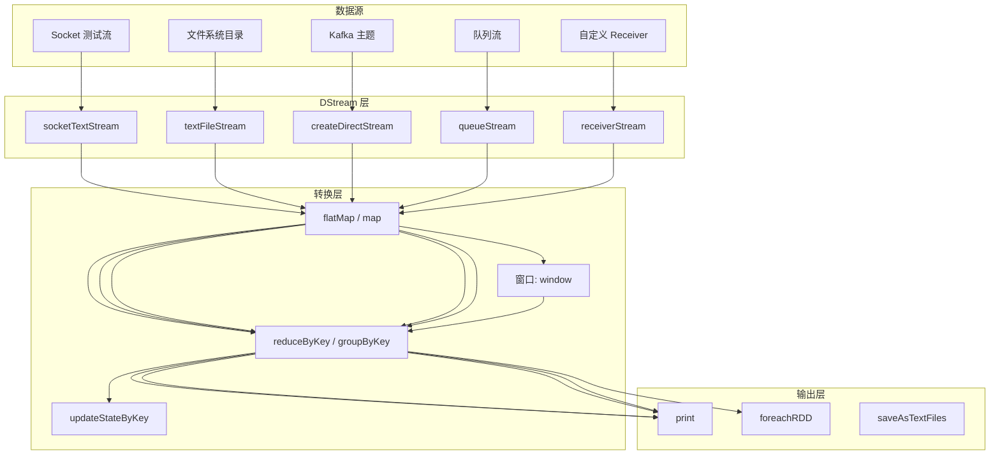
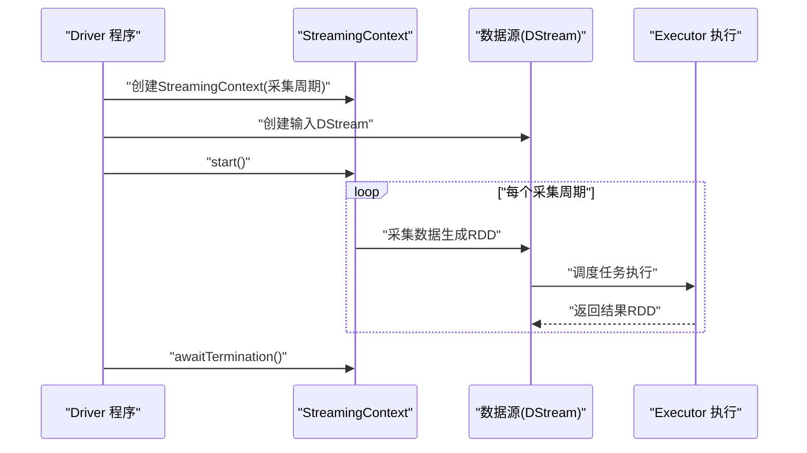
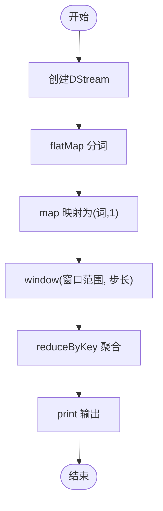
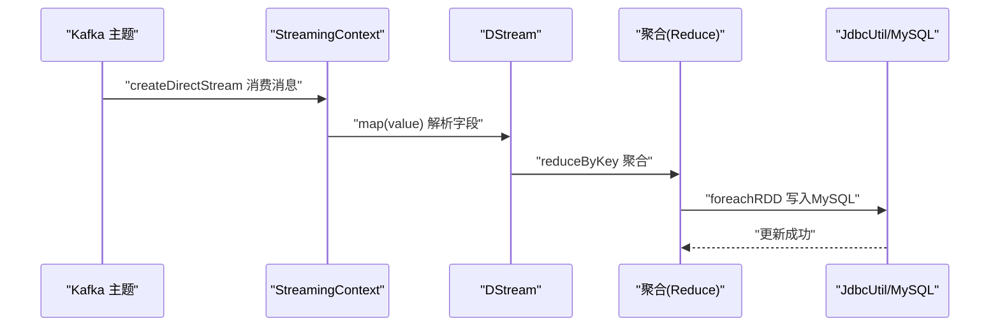
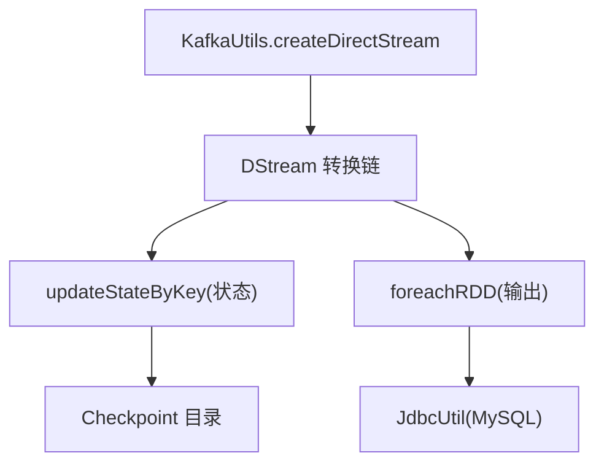

# Spark Streaming流处理

<cite>
**本文引用的文件**
- [SparkStreaming01_Env.scala](file://_04_sparkTest/src/main/java/com/atguigu/bigdata/spark/streaming/SparkStreaming01_Env.scala)
- [SparkStreaming02_WordCount.scala](file://_04_sparkTest/src/main/java/com/atguigu/bigdata/spark/streaming/SparkStreaming02_WordCount.scala)
- [SparkStreaming03_Source_Dir.scala](file://_04_sparkTest/src/main/java/com/atguigu/bigdata/spark/streaming/SparkStreaming03_Source_Dir.scala)
- [SparkStreaming04_Source_Queue.scala](file://_04_sparkTest/src/main/java/com/atguigu/bigdata/spark/streaming/SparkStreaming04_Source_Queue.scala)
- [SparkStreaming05_Source_DIY.scala](file://_04_sparkTest/src/main/java/com/atguigu/bigdata/spark/streaming/SparkStreaming05_Source_DIY.scala)
- [SparkStreaming06_Source_Kafka.scala](file://_04_sparkTest/src/main/java/com/atguigu/bigdata/spark/streaming/SparkStreaming06_Source_Kafka.scala)
- [SparkStreaming07_Transform_Output.scala](file://_04_sparkTest/src/main/java/com/atguigu/bigdata/spark/streaming/SparkStreaming07_Transform_Output.scala)
- [SparkStreaming10_State.scala](file://_04_sparkTest/src/main/java/com/atguigu/bigdata/spark/streaming/SparkStreaming10_State.scala)
- [SparkStreaming11_Resume.scala](file://_04_sparkTest/src/main/java/com/atguigu/bigdata/spark/streaming/SparkStreaming11_Resume.scala)
- [SparkStreaming12_Window.scala](file://_04_sparkTest/src/main/java/com/atguigu/bigdata/spark/streaming/SparkStreaming12_Window.scala)
- [SparkStreaming13_Output.scala](file://_04_sparkTest/src/main/java/com/atguigu/bigdata/spark/streaming/SparkStreaming13_Output.scala)
- [SparkStreaming16_Req3_LastHourAnalysis.scala](file://_04_sparkTest/src/main/java/com/atguigu/bigdata/spark/streaming/SparkStreaming16_Req3_LastHourAnalysis.scala)
- [SparkStreaming17_Req2_WordCount.scala](file://_04_sparkTest/src/main/java/com/atguigu/bigdata/spark/streaming/SparkStreaming17_Req2_WordCount.scala)
- [JdbcUtil.scala](file://_04_sparkTest/src/main/java/com/atguigu/bigdata/spark/streaming/JdbcUtil.scala)
</cite>

## 目录
1. [引言](#引言)
2. [项目结构](#项目结构)
3. [核心组件](#核心组件)
4. [架构总览](#架构总览)
5. [详细组件分析](#详细组件分析)
6. [依赖关系分析](#依赖关系分析)
7. [性能考虑](#性能考虑)
8. [故障排查指南](#故障排查指南)
9. [结论](#结论)
10. [附录](#附录)

## 引言
本技术文档围绕Spark Streaming流处理展开，系统性讲解DStream（离散化流）概念、微批处理机制、多种数据源接入（文件系统、Kafka、Socket、队列、自定义Receiver）、转换与输出操作、窗口操作，并结合实际需求（如最近一小时分析、广告点击量实时统计）给出可复用的实现思路与最佳实践。文档所有实现细节均来自仓库中的示例代码，确保可追溯与可验证。

## 项目结构
该仓库在Spark模块下提供了大量Streaming示例，涵盖环境搭建、数据源接入、转换与输出、状态管理、窗口操作、容错恢复与业务实战等主题。以下图示化展示与Spark Streaming相关的核心文件及其职责：

图表来源
- [SparkStreaming01_Env.scala](file://_04_sparkTest/src/main/java/com/atguigu/bigdata/spark/streaming/SparkStreaming01_Env.scala#L1-L20)
- [SparkStreaming02_WordCount.scala](file://_04_sparkTest/src/main/java/com/atguigu/bigdata/spark/streaming/SparkStreaming02_WordCount.scala#L1-L36)
- [SparkStreaming03_Source_Dir.scala](file://_04_sparkTest/src/main/java/com/atguigu/bigdata/spark/streaming/SparkStreaming03_Source_Dir.scala#L1-L28)
- [SparkStreaming04_Source_Queue.scala](file://_04_sparkTest/src/main/java/com/atguigu/bigdata/spark/streaming/SparkStreaming04_Source_Queue.scala#L1-L38)
- [SparkStreaming05_Source_DIY.scala](file://_04_sparkTest/src/main/java/com/atguigu/bigdata/spark/streaming/SparkStreaming05_Source_DIY.scala#L1-L53)
- [SparkStreaming06_Source_Kafka.scala](file://_04_sparkTest/src/main/java/com/atguigu/bigdata/spark/streaming/SparkStreaming06_Source_Kafka.scala#L1-L72)
- [SparkStreaming07_Transform_Output.scala](file://_04_sparkTest/src/main/java/com/atguigu/bigdata/spark/streaming/SparkStreaming07_Transform_Output.scala#L1-L37)
- [SparkStreaming10_State.scala](file://_04_sparkTest/src/main/java/com/atguigu/bigdata/spark/streaming/SparkStreaming10_State.scala#L1-L40)
- [SparkStreaming11_Resume.scala](file://_04_sparkTest/src/main/java/com/atguigu/bigdata/spark/streaming/SparkStreaming11_Resume.scala#L1-L35)
- [SparkStreaming12_Window.scala](file://_04_sparkTest/src/main/java/com/atguigu/bigdata/spark/streaming/SparkStreaming12_Window.scala#L1-L32)
- [SparkStreaming13_Output.scala](file://_04_sparkTest/src/main/java/com/atguigu/bigdata/spark/streaming/SparkStreaming13_Output.scala#L1-L35)
- [SparkStreaming16_Req3_LastHourAnalysis.scala](file://_04_sparkTest/src/main/java/com/atguigu/bigdata/spark/streaming/SparkStreaming16_Req3_LastHourAnalysis.scala#L1-L64)
- [SparkStreaming17_Req2_WordCount.scala](file://_04_sparkTest/src/main/java/com/atguigu/bigdata/spark/streaming/SparkStreaming17_Req2_WordCount.scala#L1-L89)
- [JdbcUtil.scala](file://_04_sparkTest/src/main/java/com/atguigu/bigdata/spark/streaming/JdbcUtil.scala#L1-L31)

章节来源
- [SparkStreaming01_Env.scala](file://_04_sparkTest/src/main/java/com/atguigu/bigdata/spark/streaming/SparkStreaming01_Env.scala#L1-L20)

## 核心组件
- StreamingContext：Spark Streaming运行时上下文，负责调度采集周期、DAG构建与任务提交。
- DStream：离散化时间序列，是Spark RDD在时间维度上的扩展；每个采集周期产生一个RDD。
- 数据源：
  - Socket：ssc.socketTextStream(host, port)，适合本地测试与演示。
  - 文件系统：ssc.textFileStream(path)，监控目录变化并按周期读取新增文件。
  - 队列：ssc.queueStream(queue, oneAtATime)，将内存中的RDD队列转为DStream，便于测试。
  - Kafka：KafkaUtils.createDirectStream，直接连接Kafka消费数据。
  - 自定义Receiver：继承Receiver[T]，通过store持久化到Executor内存或磁盘。
- 转换与输出：
  - 常见转换：flatMap、map、mapValues、reduceByKey、combineByKey、groupByKey、join、cogroup等。
  - 输出操作：print、foreachRDD、saveAsTextFiles等。
- 状态管理：updateStateByKey（需checkpoint）与外部存储（如Redis）结合的无状态累加策略。
- 窗口操作：window(windowDuration, slideDuration)，要求slide为采集周期整数倍。
- 恢复机制：StreamingContext.getOrCreate，基于checkpoint目录恢复作业。

章节来源
- [SparkStreaming02_WordCount.scala](file://_04_sparkTest/src/main/java/com/atguigu/bigdata/spark/streaming/SparkStreaming02_WordCount.scala#L1-L36)
- [SparkStreaming03_Source_Dir.scala](file://_04_sparkTest/src/main/java/com/atguigu/bigdata/spark/streaming/SparkStreaming03_Source_Dir.scala#L1-L28)
- [SparkStreaming04_Source_Queue.scala](file://_04_sparkTest/src/main/java/com/atguigu/bigdata/spark/streaming/SparkStreaming04_Source_Queue.scala#L1-L38)
- [SparkStreaming05_Source_DIY.scala](file://_04_sparkTest/src/main/java/com/atguigu/bigdata/spark/streaming/SparkStreaming05_Source_DIY.scala#L1-L53)
- [SparkStreaming06_Source_Kafka.scala](file://_04_sparkTest/src/main/java/com/atguigu/bigdata/spark/streaming/SparkStreaming06_Source_Kafka.scala#L1-L72)
- [SparkStreaming10_State.scala](file://_04_sparkTest/src/main/java/com/atguigu/bigdata/spark/streaming/SparkStreaming10_State.scala#L1-L40)
- [SparkStreaming12_Window.scala](file://_04_sparkTest/src/main/java/com/atguigu/bigdata/spark/streaming/SparkStreaming12_Window.scala#L1-L32)
- [SparkStreaming13_Output.scala](file://_04_sparkTest/src/main/java/com/atguigu/bigdata/spark/streaming/SparkStreaming13_Output.scala#L1-L35)
- [SparkStreaming11_Resume.scala](file://_04_sparkTest/src/main/java/com/atguigu/bigdata/spark/streaming/SparkStreaming11_Resume.scala#L1-L35)

## 架构总览
下图展示了从数据源到DStream、转换、窗口与输出的整体流程，映射到仓库中的具体示例文件：

图表来源
- [SparkStreaming02_WordCount.scala](file://_04_sparkTest/src/main/java/com/atguigu/bigdata/spark/streaming/SparkStreaming02_WordCount.scala#L1-L36)
- [SparkStreaming03_Source_Dir.scala](file://_04_sparkTest/src/main/java/com/atguigu/bigdata/spark/streaming/SparkStreaming03_Source_Dir.scala#L1-L28)
- [SparkStreaming06_Source_Kafka.scala](file://_04_sparkTest/src/main/java/com/atguigu/bigdata/spark/streaming/SparkStreaming06_Source_Kafka.scala#L1-L72)
- [SparkStreaming04_Source_Queue.scala](file://_04_sparkTest/src/main/java/com/atguigu/bigdata/spark/streaming/SparkStreaming04_Source_Queue.scala#L1-L38)
- [SparkStreaming05_Source_DIY.scala](file://_04_sparkTest/src/main/java/com/atguigu/bigdata/spark/streaming/SparkStreaming05_Source_DIY.scala#L1-L53)
- [SparkStreaming12_Window.scala](file://_04_sparkTest/src/main/java/com/atguigu/bigdata/spark/streaming/SparkStreaming12_Window.scala#L1-L32)
- [SparkStreaming13_Output.scala](file://_04_sparkTest/src/main/java/com/atguigu/bigdata/spark/streaming/SparkStreaming13_Output.scala#L1-L35)

## 详细组件分析

### DStream与微批处理机制
- DStream是对时间切片的RDD序列的抽象，每个采集周期生成一个RDD，驱动Spark DAG执行。
- 采集周期由StreamingContext构造函数的第二个参数决定（如Seconds(3)）。
- 无界流需要持续运行，通过ssc.start()启动采集器并在主线程阻塞等待终止。

图表来源
- [SparkStreaming01_Env.scala](file://_04_sparkTest/src/main/java/com/atguigu/bigdata/spark/streaming/SparkStreaming01_Env.scala#L1-L20)
- [SparkStreaming02_WordCount.scala](file://_04_sparkTest/src/main/java/com/atguigu/bigdata/spark/streaming/SparkStreaming02_WordCount.scala#L1-L36)

章节来源
- [SparkStreaming01_Env.scala](file://_04_sparkTest/src/main/java/com/atguigu/bigdata/spark/streaming/SparkStreaming01_Env.scala#L1-L20)
- [SparkStreaming02_WordCount.scala](file://_04_sparkTest/src/main/java/com/atguigu/bigdata/spark/streaming/SparkStreaming02_WordCount.scala#L1-L36)

### 数据源接入与配置

#### Socket数据源
- 使用socketTextStream(host, port)接入本地或远程Socket流，适合快速验证。
- 典型流程：创建DStream → flatMap → map → reduceByKey → print。

章节来源
- [SparkStreaming02_WordCount.scala](file://_04_sparkTest/src/main/java/com/atguigu/bigdata/spark/streaming/SparkStreaming02_WordCount.scala#L1-L36)

#### 文件系统数据源
- 使用textFileStream(path)监控目录变化，周期性读取新增文件内容。
- 适用于日志滚动、定时落盘等场景。

章节来源
- [SparkStreaming03_Source_Dir.scala](file://_04_sparkTest/src/main/java/com/atguigu/bigdata/spark/streaming/SparkStreaming03_Source_Dir.scala#L1-L28)

#### 队列数据源
- 使用queueStream(queue, oneAtATime)将内存中的RDD队列转为DStream，便于单元测试与压测。
- 示例中通过循环向队列追加RDD并sleep，模拟周期性数据到达。

章节来源
- [SparkStreaming04_Source_Queue.scala](file://_04_sparkTest/src/main/java/com/atguigu/bigdata/spark/streaming/SparkStreaming04_Source_Queue.scala#L1-L38)

#### 自定义Receiver数据源
- 继承Receiver[T]，重写onStart/onStop，使用store持久化采集数据。
- 示例中通过UUID随机字符串模拟采集，便于演示。

章节来源
- [SparkStreaming05_Source_DIY.scala](file://_04_sparkTest/src/main/java/com/atguigu/bigdata/spark/streaming/SparkStreaming05_Source_DIY.scala#L1-L53)

#### Kafka数据源
- 使用KafkaUtils.createDirectStream进行直连消费，支持指定主题、消费者参数与位置策略。
- 示例中配置BootstrapServers、GroupId、反序列化器等参数。

章节来源
- [SparkStreaming06_Source_Kafka.scala](file://_04_sparkTest/src/main/java/com/atguigu/bigdata/spark/streaming/SparkStreaming06_Source_Kafka.scala#L1-L72)

### 转换操作与输出
- 常用转换：flatMap、map、mapValues、reduceByKey、combineByKey、groupByKey、join/cogroup等。
- 输出操作：print（控制台打印）、foreachRDD（自定义输出逻辑）、saveAsTextFiles（保存到文件系统）。
- 默认无状态：每个周期的结果仅在当前周期内有效，不跨周期保留。

章节来源
- [SparkStreaming07_Transform_Output.scala](file://_04_sparkTest/src/main/java/com/atguigu/bigdata/spark/streaming/SparkStreaming07_Transform_Output.scala#L1-L37)
- [SparkStreaming13_Output.scala](file://_04_sparkTest/src/main/java/com/atguigu/bigdata/spark/streaming/SparkStreaming13_Output.scala#L1-L35)

### 状态管理与恢复
- updateStateByKey：对相同key的历史状态进行累加，需设置checkpoint目录。
- 检查点恢复：通过StreamingContext.getOrCreate从checkpoint目录恢复作业，避免重启丢失状态。

章节来源
- [SparkStreaming10_State.scala](file://_04_sparkTest/src/main/java/com/atguigu/bigdata/spark/streaming/SparkStreaming10_State.scala#L1-L40)
- [SparkStreaming11_Resume.scala](file://_04_sparkTest/src/main/java/com/atguigu/bigdata/spark/streaming/SparkStreaming11_Resume.scala#L1-L35)

### 窗口操作
- 窗口聚合：window(windowDuration, slideDuration)，窗口范围与步长必须为采集周期的整数倍。
- 示例：将3个采集周期作为一个窗口，步长为1个采集周期，实现滚动窗口统计。

图表来源
- [SparkStreaming12_Window.scala](file://_04_sparkTest/src/main/java/com/atguigu/bigdata/spark/streaming/SparkStreaming12_Window.scala#L1-L32)

章节来源
- [SparkStreaming12_Window.scala](file://_04_sparkTest/src/main/java/com/atguigu/bigdata/spark/streaming/SparkStreaming12_Window.scala#L1-L32)

### 实际业务案例

#### 最近一小时分析（按10秒粒度）
- 需求：最近一分钟，每10秒统计一次广告点击趋势。
- 实现要点：按时间字段做分桶（例如分钟级粒度），使用window(60秒, 10秒)滚动聚合。

章节来源
- [SparkStreaming16_Req3_LastHourAnalysis.scala](file://_04_sparkTest/src/main/java/com/atguigu/bigdata/spark/streaming/SparkStreaming16_Req3_LastHourAnalysis.scala#L1-L64)

#### 广告点击量实时统计（写入MySQL）
- 需求：将每日、区域、城市、广告ID的点击量写入MySQL，支持去重更新。
- 实现要点：map解析字段 → reduceByKey聚合 → foreachRDD逐批次写库；使用JdbcUtil统一管理连接池。

图表来源
- [SparkStreaming17_Req2_WordCount.scala](file://_04_sparkTest/src/main/java/com/atguigu/bigdata/spark/streaming/SparkStreaming17_Req2_WordCount.scala#L1-L89)
- [JdbcUtil.scala](file://_04_sparkTest/src/main/java/com/atguigu/bigdata/spark/streaming/JdbcUtil.scala#L1-L31)

章节来源
- [SparkStreaming17_Req2_WordCount.scala](file://_04_sparkTest/src/main/java/com/atguigu/bigdata/spark/streaming/SparkStreaming17_Req2_WordCount.scala#L1-L89)
- [JdbcUtil.scala](file://_04_sparkTest/src/main/java/com/atguigu/bigdata/spark/streaming/JdbcUtil.scala#L1-L31)

## 依赖关系分析
- 外部依赖：Kafka客户端、Druid连接池（用于MySQL连接管理）。
- 内部依赖：示例文件之间通过DStream链式转换形成数据依赖；状态与恢复依赖checkpoint目录。
- 关键耦合点：
  - Kafka直连依赖消费者配置与主题订阅。
  - 状态聚合依赖checkpoint目录与updateStateByKey。
  - 输出依赖外部系统（MySQL）可用性与连接池健康。

图表来源
- [SparkStreaming06_Source_Kafka.scala](file://_04_sparkTest/src/main/java/com/atguigu/bigdata/spark/streaming/SparkStreaming06_Source_Kafka.scala#L1-L72)
- [SparkStreaming10_State.scala](file://_04_sparkTest/src/main/java/com/atguigu/bigdata/spark/streaming/SparkStreaming10_State.scala#L1-L40)
- [SparkStreaming17_Req2_WordCount.scala](file://_04_sparkTest/src/main/java/com/atguigu/bigdata/spark/streaming/SparkStreaming17_Req2_WordCount.scala#L1-L89)
- [JdbcUtil.scala](file://_04_sparkTest/src/main/java/com/atguigu/bigdata/spark/streaming/JdbcUtil.scala#L1-L31)

章节来源
- [SparkStreaming06_Source_Kafka.scala](file://_04_sparkTest/src/main/java/com/atguigu/bigdata/spark/streaming/SparkStreaming06_Source_Kafka.scala#L1-L72)
- [SparkStreaming10_State.scala](file://_04_sparkTest/src/main/java/com/atguigu/bigdata/spark/streaming/SparkStreaming10_State.scala#L1-L40)
- [SparkStreaming17_Req2_WordCount.scala](file://_04_sparkTest/src/main/java/com/atguigu/bigdata/spark/streaming/SparkStreaming17_Req2_WordCount.scala#L1-L89)
- [JdbcUtil.scala](file://_04_sparkTest/src/main/java/com/atguigu/bigdata/spark/streaming/JdbcUtil.scala#L1-L31)

## 性能考虑
- 采集周期选择：过短导致任务调度开销大，过长影响延迟；应根据业务SLA权衡。
- 窗口参数：窗口大小与步长必须为采集周期整数倍，避免不一致导致异常。
- 状态管理：updateStateByKey会产生小文件，建议结合外部存储（如Redis）做缓存与合并。
- 输出吞吐：foreachRDD中批量写入、连接池复用、异步I/O可显著提升写入性能。
- 资源隔离：合理设置Executor核数与内存，避免GC与shuffle瓶颈。

## 故障排查指南
- 窗口参数校验失败：当窗口步长不是采集周期整数倍时会抛出异常，需调整为采集周期的整数倍。
- 状态聚合报错：未设置checkpoint目录时使用updateStateByKey会失败，需先调用checkpoint。
- Kafka消费异常：确认BootstrapServers、GroupId、反序列化器配置正确，主题存在且可读。
- 输出失败：检查MySQL连通性、表结构与权限，确保foreachRDD中异常被捕获与记录。
- 恢复失败：检查checkpoint目录是否存在、权限是否正确，确保getOrCreate路径一致。

章节来源
- [SparkStreaming12_Window.scala](file://_04_sparkTest/src/main/java/com/atguigu/bigdata/spark/streaming/SparkStreaming12_Window.scala#L1-L32)
- [SparkStreaming10_State.scala](file://_04_sparkTest/src/main/java/com/atguigu/bigdata/spark/streaming/SparkStreaming10_State.scala#L1-L40)
- [SparkStreaming17_Req2_WordCount.scala](file://_04_sparkTest/src/main/java/com/atguigu/bigdata/spark/streaming/SparkStreaming17_Req2_WordCount.scala#L1-L89)

## 结论
本仓库提供了从环境搭建、多数据源接入、转换与输出、状态管理、窗口操作到业务实战的完整示例。通过这些示例，读者可以快速掌握Spark Streaming的核心概念与工程化落地方法，并在此基础上扩展到更复杂的实时分析场景。

## 附录
- 常用代码片段路径参考（不含具体代码内容）：
  - 环境与采集周期：[SparkStreaming01_Env.scala](file://_04_sparkTest/src/main/java/com/atguigu/bigdata/spark/streaming/SparkStreaming01_Env.scala#L1-L20)
  - Socket WordCount：[SparkStreaming02_WordCount.scala](file://_04_sparkTest/src/main/java/com/atguigu/bigdata/spark/streaming/SparkStreaming02_WordCount.scala#L1-L36)
  - 文件系统文本流：[SparkStreaming03_Source_Dir.scala](file://_04_sparkTest/src/main/java/com/atguigu/bigdata/spark/streaming/SparkStreaming03_Source_Dir.scala#L1-L28)
  - 队列流模拟：[SparkStreaming04_Source_Queue.scala](file://_04_sparkTest/src/main/java/com/atguigu/bigdata/spark/streaming/SparkStreaming04_Source_Queue.scala#L1-L38)
  - 自定义Receiver：[SparkStreaming05_Source_DIY.scala](file://_04_sparkTest/src/main/java/com/atguigu/bigdata/spark/streaming/SparkStreaming05_Source_DIY.scala#L1-L53)
  - Kafka直连：[SparkStreaming06_Source_Kafka.scala](file://_04_sparkTest/src/main/java/com/atguigu/bigdata/spark/streaming/SparkStreaming06_Source_Kafka.scala#L1-L72)
  - 默认无状态转换输出：[SparkStreaming07_Transform_Output.scala](file://_04_sparkTest/src/main/java/com/atguigu/bigdata/spark/streaming/SparkStreaming07_Transform_Output.scala#L1-L37)
  - updateStateByKey有状态累加：[SparkStreaming10_State.scala](file://_04_sparkTest/src/main/java/com/atguigu/bigdata/spark/streaming/SparkStreaming10_State.scala#L1-L40)
  - 检查点恢复：[SparkStreaming11_Resume.scala](file://_04_sparkTest/src/main/java/com/atguigu/bigdata/spark/streaming/SparkStreaming11_Resume.scala#L1-L35)
  - 窗口聚合：[SparkStreaming12_Window.scala](file://_04_sparkTest/src/main/java/com/atguigu/bigdata/spark/streaming/SparkStreaming12_Window.scala#L1-L32)
  - foreachRDD输出骨架：[SparkStreaming13_Output.scala](file://_04_sparkTest/src/main/java/com/atguigu/bigdata/spark/streaming/SparkStreaming13_Output.scala#L1-L35)
  - 最近一小时趋势分析：[SparkStreaming16_Req3_LastHourAnalysis.scala](file://_04_sparkTest/src/main/java/com/atguigu/bigdata/spark/streaming/SparkStreaming16_Req3_LastHourAnalysis.scala#L1-L64)
  - 广告点击量实时统计：[SparkStreaming17_Req2_WordCount.scala](file://_04_sparkTest/src/main/java/com/atguigu/bigdata/spark/streaming/SparkStreaming17_Req2_WordCount.scala#L1-L89)
  - 数据库连接工具：[JdbcUtil.scala](file://_04_sparkTest/src/main/java/com/atguigu/bigdata/spark/streaming/JdbcUtil.scala#L1-L31)