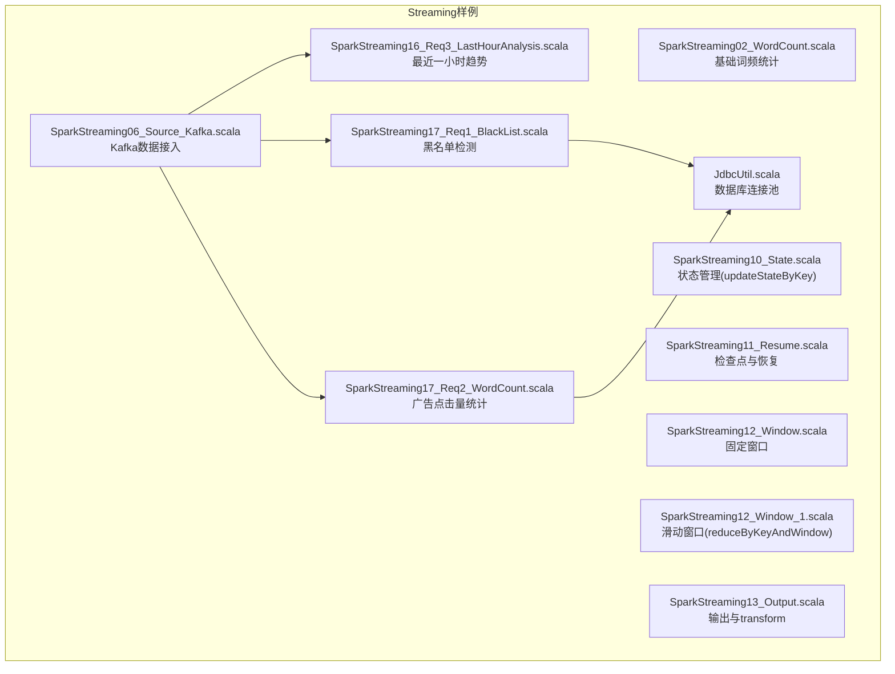
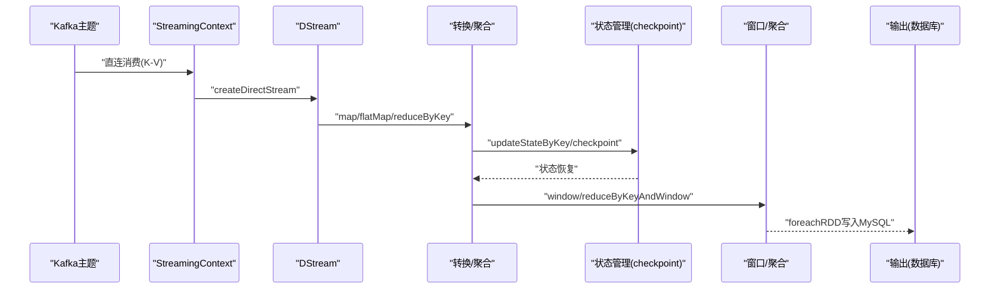
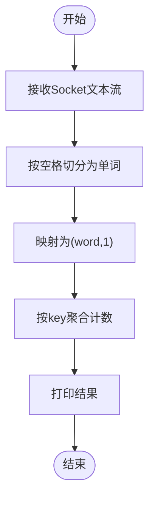
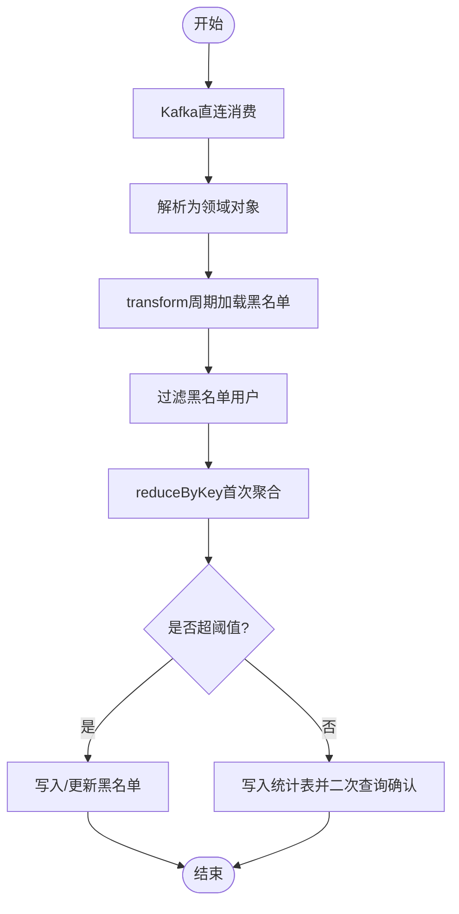
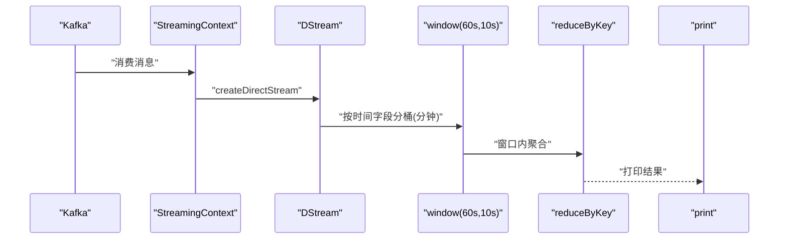
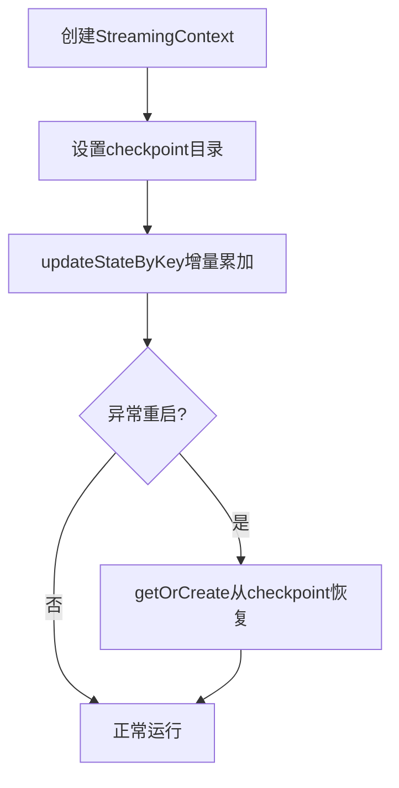
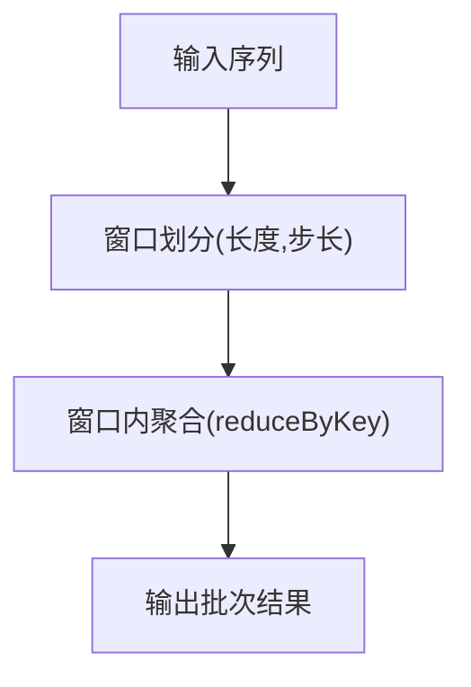
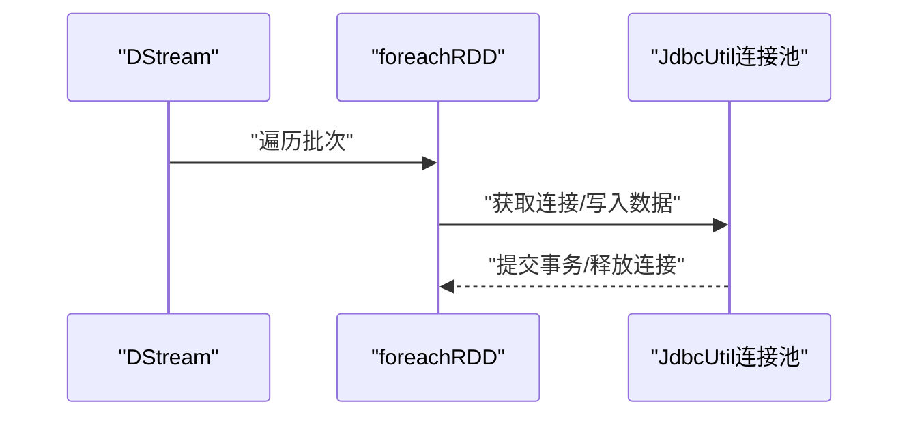
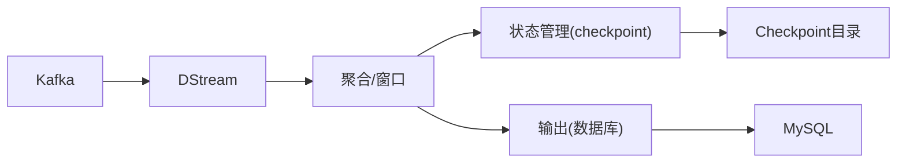

# 实际应用场景与案例分析

<cite>
**本文引用的文件**
- [SparkStreaming02_WordCount.scala](file://_04_sparkTest/src/main/java/com/atguigu/bigdata/spark/streaming/SparkStreaming02_WordCount.scala)
- [SparkStreaming06_Source_Kafka.scala](file://_04_sparkTest/src/main/java/com/atguigu/bigdata/spark/streaming/SparkStreaming06_Source_Kafka.scala)
- [SparkStreaming10_State.scala](file://_04_sparkTest/src/main/java/com/atguigu/bigdata/spark/streaming/SparkStreaming10_State.scala)
- [SparkStreaming11_Resume.scala](file://_04_sparkTest/src/main/java/com/atguigu/bigdata/spark/streaming/SparkStreaming11_Resume.scala)
- [SparkStreaming12_Window.scala](file://_04_sparkTest/src/main/java/com/atguigu/bigdata/spark/streaming/SparkStreaming12_Window.scala)
- [SparkStreaming12_Window_1.scala](file://_04_sparkTest/src/main/java/com/atguigu/bigdata/spark/streaming/SparkStreaming12_Window_1.scala)
- [SparkStreaming13_Output.scala](file://_04_sparkTest/src/main/java/com/atguigu/bigdata/spark/streaming/SparkStreaming13_Output.scala)
- [SparkStreaming16_Req3_LastHourAnalysis.scala](file://_04_sparkTest/src/main/java/com/atguigu/bigdata/spark/streaming/SparkStreaming16_Req3_LastHourAnalysis.scala)
- [SparkStreaming17_Req1_BlackList.scala](file://_04_sparkTest/src/main/java/com/atguigu/bigdata/spark/streaming/SparkStreaming17_Req1_BlackList.scala)
- [SparkStreaming17_Req2_WordCount.scala](file://_04_sparkTest/src/main/java/com/atguigu/bigdata/spark/streaming/SparkStreaming17_Req2_WordCount.scala)
- [JdbcUtil.scala](file://_04_sparkTest/src/main/java/com/atguigu/bigdata/spark/streaming/JdbcUtil.scala)
</cite>

## 目录
1. [引言](#引言)
2. [项目结构](#项目结构)
3. [核心组件](#核心组件)
4. [架构总览](#架构总览)
5. [详细组件分析](#详细组件分析)
6. [依赖关系分析](#依赖关系分析)
7. [性能考量](#性能考量)
8. [故障排查指南](#故障排查指南)
9. [结论](#结论)
10. [附录](#附录)

## 引言
本技术文档围绕Spark Streaming在实际业务中的三大典型场景展开：实时词频统计（WordCount）、黑名单检测、最近一小时数据分析。文档从数据接入、状态管理、窗口配置、结果输出到生产部署与性能调优进行全面解析，并通过可视化图示帮助读者建立系统化理解。

## 项目结构
仓库中与Spark Streaming直接相关的核心代码位于“_04_sparkTest/src/main/java/com/atguigu/bigdata/spark/streaming”目录下，涵盖以下主题：
- 基础WordCount与数据源接入（Socket/Kafka）
- 状态管理（updateStateByKey与检查点）
- 窗口操作（固定窗口与滑动窗口）
- 输出与容错恢复
- 实战案例：黑名单检测、广告点击量统计、最近一小时趋势分析

图表来源
- [SparkStreaming02_WordCount.scala](file://_04_sparkTest/src/main/java/com/atguigu/bigdata/spark/streaming/SparkStreaming02_WordCount.scala#L1-L36)
- [SparkStreaming06_Source_Kafka.scala](file://_04_sparkTest/src/main/java/com/atguigu/bigdata/spark/streaming/SparkStreaming06_Source_Kafka.scala#L1-L72)
- [SparkStreaming10_State.scala](file://_04_sparkTest/src/main/java/com/atguigu/bigdata/spark/streaming/SparkStreaming10_State.scala#L1-L40)
- [SparkStreaming11_Resume.scala](file://_04_sparkTest/src/main/java/com/atguigu/bigdata/spark/streaming/SparkStreaming11_Resume.scala#L1-L35)
- [SparkStreaming12_Window.scala](file://_04_sparkTest/src/main/java/com/atguigu/bigdata/spark/streaming/SparkStreaming12_Window.scala#L1-L32)
- [SparkStreaming12_Window_1.scala](file://_04_sparkTest/src/main/java/com/atguigu/bigdata/spark/streaming/SparkStreaming12_Window_1.scala#L1-L38)
- [SparkStreaming13_Output.scala](file://_04_sparkTest/src/main/java/com/atguigu/bigdata/spark/streaming/SparkStreaming13_Output.scala#L1-L35)
- [SparkStreaming16_Req3_LastHourAnalysis.scala](file://_04_sparkTest/src/main/java/com/atguigu/bigdata/spark/streaming/SparkStreaming16_Req3_LastHourAnalysis.scala#L1-L64)
- [SparkStreaming17_Req1_BlackList.scala](file://_04_sparkTest/src/main/java/com/atguigu/bigdata/spark/streaming/SparkStreaming17_Req1_BlackList.scala#L1-L177)
- [SparkStreaming17_Req2_WordCount.scala](file://_04_sparkTest/src/main/java/com/atguigu/bigdata/spark/streaming/SparkStreaming17_Req2_WordCount.scala#L1-L89)
- [JdbcUtil.scala](file://_04_sparkTest/src/main/java/com/atguigu/bigdata/spark/streaming/JdbcUtil.scala#L1-L31)

章节来源
- [SparkStreaming02_WordCount.scala](file://_04_sparkTest/src/main/java/com/atguigu/bigdata/spark/streaming/SparkStreaming02_WordCount.scala#L1-L36)
- [SparkStreaming06_Source_Kafka.scala](file://_04_sparkTest/src/main/java/com/atguigu/bigdata/spark/streaming/SparkStreaming06_Source_Kafka.scala#L1-L72)

## 核心组件
- 数据接入层：Socket文本流与Kafka直连流，支持自定义Receiver与存储级别配置。
- 转换与聚合层：flatMap、map、reduceByKey、updateStateByKey、窗口函数、transform。
- 状态与容错：基于检查点的状态恢复、updateStateByKey的本地状态管理。
- 输出与持久化：foreachRDD写入MySQL，结合JDBC连接池优化资源复用。
- 实战需求适配：黑名单检测、广告点击量统计、最近一小时趋势分析。

章节来源
- [SparkStreaming06_Source_Kafka.scala](file://_04_sparkTest/src/main/java/com/atguigu/bigdata/spark/streaming/SparkStreaming06_Source_Kafka.scala#L1-L72)
- [SparkStreaming10_State.scala](file://_04_sparkTest/src/main/java/com/atguigu/bigdata/spark/streaming/SparkStreaming10_State.scala#L1-L40)
- [SparkStreaming11_Resume.scala](file://_04_sparkTest/src/main/java/com/atguigu/bigdata/spark/streaming/SparkStreaming11_Resume.scala#L1-L35)
- [SparkStreaming13_Output.scala](file://_04_sparkTest/src/main/java/com/atguigu/bigdata/spark/streaming/SparkStreaming13_Output.scala#L1-L35)
- [JdbcUtil.scala](file://_04_sparkTest/src/main/java/com/atguigu/bigdata/spark/streaming/JdbcUtil.scala#L1-L31)

## 架构总览
下图展示了从数据接入到结果输出的端到端流程，覆盖状态管理、窗口配置与输出策略：

图表来源
- [SparkStreaming06_Source_Kafka.scala](file://_04_sparkTest/src/main/java/com/atguigu/bigdata/spark/streaming/SparkStreaming06_Source_Kafka.scala#L1-L72)
- [SparkStreaming10_State.scala](file://_04_sparkTest/src/main/java/com/atguigu/bigdata/spark/streaming/SparkStreaming10_State.scala#L1-L40)
- [SparkStreaming12_Window.scala](file://_04_sparkTest/src/main/java/com/atguigu/bigdata/spark/streaming/SparkStreaming12_Window.scala#L1-L32)
- [SparkStreaming13_Output.scala](file://_04_sparkTest/src/main/java/com/atguigu/bigdata/spark/streaming/SparkStreaming13_Output.scala#L1-L35)
- [SparkStreaming17_Req2_WordCount.scala](file://_04_sparkTest/src/main/java/com/atguigu/bigdata/spark/streaming/SparkStreaming17_Req2_WordCount.scala#L1-L89)

## 详细组件分析

### 实时词频统计（WordCount）
- 业务目标：对实时输入文本进行分词并统计词频，输出到控制台。
- 技术要点：
  - 使用Socket文本流作为数据源，便于本地演示。
  - 采用flatMap、map与reduceByKey完成词频统计。
  - print输出周期由批次间隔控制。
- 关键路径参考
  - [SparkStreaming02_WordCount.scala](file://_04_sparkTest/src/main/java/com/atguigu/bigdata/spark/streaming/SparkStreaming02_WordCount.scala#L1-L36)

图表来源
- [SparkStreaming02_WordCount.scala](file://_04_sparkTest/src/main/java/com/atguigu/bigdata/spark/streaming/SparkStreaming02_WordCount.scala#L1-L36)

章节来源
- [SparkStreaming02_WordCount.scala](file://_04_sparkTest/src/main/java/com/atguigu/bigdata/spark/streaming/SparkStreaming02_WordCount.scala#L1-L36)

### 黑名单检测
- 业务目标：基于用户维度的广告点击量阈值检测，动态维护黑名单并落库。
- 技术要点：
  - Kafka直连消费，按字段拆分为领域模型。
  - transform在Driver侧周期性加载黑名单，过滤无效数据。
  - reduceByKey进行首次聚合；foreachRDD二次校验与入库。
  - 对于超阈值用户，插入/更新黑名单；对未超阈值用户，写入统计表并再次查询确认是否达标。
  - 使用JdbcUtil连接池管理数据库连接。
- 关键路径参考
  - [SparkStreaming17_Req1_BlackList.scala](file://_04_sparkTest/src/main/java/com/atguigu/bigdata/spark/streaming/SparkStreaming17_Req1_BlackList.scala#L1-L177)
  - [JdbcUtil.scala](file://_04_sparkTest/src/main/java/com/atguigu/bigdata/spark/streaming/JdbcUtil.scala#L1-L31)

图表来源
- [SparkStreaming17_Req1_BlackList.scala](file://_04_sparkTest/src/main/java/com/atguigu/bigdata/spark/streaming/SparkStreaming17_Req1_BlackList.scala#L1-L177)
- [JdbcUtil.scala](file://_04_sparkTest/src/main/java/com/atguigu/bigdata/spark/streaming/JdbcUtil.scala#L1-L31)

章节来源
- [SparkStreaming17_Req1_BlackList.scala](file://_04_sparkTest/src/main/java/com/atguigu/bigdata/spark/streaming/SparkStreaming17_Req1_BlackList.scala#L1-L177)
- [JdbcUtil.scala](file://_04_sparkTest/src/main/java/com/atguigu/bigdata/spark/streaming/JdbcUtil.scala#L1-L31)

### 最近一小时数据分析
- 业务目标：统计最近一分钟内每10秒的广告点击趋势，支持滑动窗口。
- 技术要点：
  - Kafka直连消费，提取时间字段并按分钟粒度聚合。
  - 使用window(Seconds(60), Seconds(10))构建滑动窗口，reduceByKey聚合。
  - 输出打印周期由批次间隔控制。
- 关键路径参考
  - [SparkStreaming16_Req3_LastHourAnalysis.scala](file://_04_sparkTest/src/main/java/com/atguigu/bigdata/spark/streaming/SparkStreaming16_Req3_LastHourAnalysis.scala#L1-L64)

图表来源
- [SparkStreaming16_Req3_LastHourAnalysis.scala](file://_04_sparkTest/src/main/java/com/atguigu/bigdata/spark/streaming/SparkStreaming16_Req3_LastHourAnalysis.scala#L1-L64)

章节来源
- [SparkStreaming16_Req3_LastHourAnalysis.scala](file://_04_sparkTest/src/main/java/com/atguigu/bigdata/spark/streaming/SparkStreaming16_Req3_LastHourAnalysis.scala#L1-L64)

### 状态管理与检查点
- updateStateByKey：对相同key的增量进行本地累加，适合轻量状态；需设置checkpoint目录以支持恢复。
- 检查点与恢复：通过getOrCreate从checkpoint目录恢复上下文，保障作业重启后状态连续。
- 关键路径参考
  - [SparkStreaming10_State.scala](file://_04_sparkTest/src/main/java/com/atguigu/bigdata/spark/streaming/SparkStreaming10_State.scala#L1-L40)
  - [SparkStreaming11_Resume.scala](file://_04_sparkTest/src/main/java/com/atguigu/bigdata/spark/streaming/SparkStreaming11_Resume.scala#L1-L35)

图表来源
- [SparkStreaming10_State.scala](file://_04_sparkTest/src/main/java/com/atguigu/bigdata/spark/streaming/SparkStreaming10_State.scala#L1-L40)
- [SparkStreaming11_Resume.scala](file://_04_sparkTest/src/main/java/com/atguigu/bigdata/spark/streaming/SparkStreaming11_Resume.scala#L1-L35)

章节来源
- [SparkStreaming10_State.scala](file://_04_sparkTest/src/main/java/com/atguigu/bigdata/spark/streaming/SparkStreaming10_State.scala#L1-L40)
- [SparkStreaming11_Resume.scala](file://_04_sparkTest/src/main/java/com/atguigu/bigdata/spark/streaming/SparkStreaming11_Resume.scala#L1-L35)

### 窗口配置与实现
- 固定窗口：window(窗口长度, 步长)，要求步长为批次间隔的整数倍。
- 滑动窗口：reduceByKeyAndWindow支持增量/减量函数，减少全量重算开销。
- 关键路径参考
  - [SparkStreaming12_Window.scala](file://_04_sparkTest/src/main/java/com/atguigu/bigdata/spark/streaming/SparkStreaming12_Window.scala#L1-L32)
  - [SparkStreaming12_Window_1.scala](file://_04_sparkTest/src/main/java/com/atguigu/bigdata/spark/streaming/SparkStreaming12_Window_1.scala#L1-L38)

图表来源
- [SparkStreaming12_Window.scala](file://_04_sparkTest/src/main/java/com/atguigu/bigdata/spark/streaming/SparkStreaming12_Window.scala#L1-L32)
- [SparkStreaming12_Window_1.scala](file://_04_sparkTest/src/main/java/com/atguigu/bigdata/spark/streaming/SparkStreaming12_Window_1.scala#L1-L38)

章节来源
- [SparkStreaming12_Window.scala](file://_04_sparkTest/src/main/java/com/atguigu/bigdata/spark/streaming/SparkStreaming12_Window.scala#L1-L32)
- [SparkStreaming12_Window_1.scala](file://_04_sparkTest/src/main/java/com/atguigu/bigdata/spark/streaming/SparkStreaming12_Window_1.scala#L1-L38)

### 输出与数据持久化
- foreachRDD：在Driver端遍历每个批次的RDD，进行数据库写入或外部系统集成。
- transform：在Executor端对RDD进行转换，也可用于跨分区的复杂处理。
- 关键路径参考
  - [SparkStreaming13_Output.scala](file://_04_sparkTest/src/main/java/com/atguigu/bigdata/spark/streaming/SparkStreaming13_Output.scala#L1-L35)
  - [SparkStreaming17_Req2_WordCount.scala](file://_04_sparkTest/src/main/java/com/atguigu/bigdata/spark/streaming/SparkStreaming17_Req2_WordCount.scala#L1-L89)
  - [JdbcUtil.scala](file://_04_sparkTest/src/main/java/com/atguigu/bigdata/spark/streaming/JdbcUtil.scala#L1-L31)

图表来源
- [SparkStreaming13_Output.scala](file://_04_sparkTest/src/main/java/com/atguigu/bigdata/spark/streaming/SparkStreaming13_Output.scala#L1-L35)
- [SparkStreaming17_Req2_WordCount.scala](file://_04_sparkTest/src/main/java/com/atguigu/bigdata/spark/streaming/SparkStreaming17_Req2_WordCount.scala#L1-L89)
- [JdbcUtil.scala](file://_04_sparkTest/src/main/java/com/atguigu/bigdata/spark/streaming/JdbcUtil.scala#L1-L31)

章节来源
- [SparkStreaming13_Output.scala](file://_04_sparkTest/src/main/java/com/atguigu/bigdata/spark/streaming/SparkStreaming13_Output.scala#L1-L35)
- [SparkStreaming17_Req2_WordCount.scala](file://_04_sparkTest/src/main/java/com/atguigu/bigdata/spark/streaming/SparkStreaming17_Req2_WordCount.scala#L1-L89)
- [JdbcUtil.scala](file://_04_sparkTest/src/main/java/com/atguigu/bigdata/spark/streaming/JdbcUtil.scala#L1-L31)

## 依赖关系分析
- 组件耦合：
  - 黑名单检测与广告点击量统计均依赖Kafka数据源与JDBC连接池。
  - 状态管理与检查点用于保证updateStateByKey的连续性与可恢复性。
  - 窗口操作与聚合在不同场景下组合使用，满足不同时间维度的统计需求。
- 外部依赖：
  - Kafka：消息队列，提供高吞吐低延迟的数据接入。
  - MySQL：持久化统计结果与黑名单状态，配合JdbcUtil连接池提升资源利用率。

图表来源
- [SparkStreaming06_Source_Kafka.scala](file://_04_sparkTest/src/main/java/com/atguigu/bigdata/spark/streaming/SparkStreaming06_Source_Kafka.scala#L1-L72)
- [SparkStreaming10_State.scala](file://_04_sparkTest/src/main/java/com/atguigu/bigdata/spark/streaming/SparkStreaming10_State.scala#L1-L40)
- [SparkStreaming17_Req1_BlackList.scala](file://_04_sparkTest/src/main/java/com/atguigu/bigdata/spark/streaming/SparkStreaming17_Req1_BlackList.scala#L1-L177)
- [SparkStreaming17_Req2_WordCount.scala](file://_04_sparkTest/src/main/java/com/atguigu/bigdata/spark/streaming/SparkStreaming17_Req2_WordCount.scala#L1-L89)
- [JdbcUtil.scala](file://_04_sparkTest/src/main/java/com/atguigu/bigdata/spark/streaming/JdbcUtil.scala#L1-L31)

章节来源
- [SparkStreaming06_Source_Kafka.scala](file://_04_sparkTest/src/main/java/com/atguigu/bigdata/spark/streaming/SparkStreaming06_Source_Kafka.scala#L1-L72)
- [SparkStreaming10_State.scala](file://_04_sparkTest/src/main/java/com/atguigu/bigdata/spark/streaming/SparkStreaming10_State.scala#L1-L40)
- [SparkStreaming17_Req1_BlackList.scala](file://_04_sparkTest/src/main/java/com/atguigu/bigdata/spark/streaming/SparkStreaming17_Req1_BlackList.scala#L1-L177)
- [SparkStreaming17_Req2_WordCount.scala](file://_04_sparkTest/src/main/java/com/atguigu/bigdata/spark/streaming/SparkStreaming17_Req2_WordCount.scala#L1-L89)
- [JdbcUtil.scala](file://_04_sparkTest/src/main/java/com/atguigu/bigdata/spark/streaming/JdbcUtil.scala#L1-L31)

## 性能考量
- 批次间隔与窗口配置
  - 窗口长度与步长必须是批次间隔的整数倍，避免窗口对齐问题导致的重复/遗漏。
  - 较短批次间隔提升实时性但增加调度开销；较长窗口降低抖动但增大延迟。
- 状态管理
  - updateStateByKey会产生小文件，建议结合外部状态存储（如Redis）或采用无状态+外部存储的组合方案。
  - 设置checkpoint目录以支持状态恢复，确保异常重启后状态连续。
- 输出与I/O
  - 使用连接池复用数据库连接，避免频繁创建/销毁连接带来的开销。
  - 写入采用批量/幂等写入策略，减少重复写入与冲突。
- 数据分区与并行度
  - Kafka分区数与Spark并行度匹配，避免热点分区导致的负载倾斜。
  - 对于高基数key的聚合，可考虑预聚合或使用哈希分区降低单点压力。
- 容错与恢复
  - 开启检查点并配置合理的最小暂停时间与超时，平衡一致性与吞吐。
  - 对于黑名单检测等强一致场景，写入前先读取最新状态，避免脏写。

## 故障排查指南
- 窗口配置错误
  - 现象：窗口计算异常或结果不正确。
  - 排查：确认窗口长度与步长均为批次间隔的整数倍；核对时间字段与分桶逻辑。
  - 参考路径
    - [SparkStreaming12_Window.scala](file://_04_sparkTest/src/main/java/com/atguigu/bigdata/spark/streaming/SparkStreaming12_Window.scala#L1-L32)
    - [SparkStreaming12_Window_1.scala](file://_04_sparkTest/src/main/java/com/atguigu/bigdata/spark/streaming/SparkStreaming12_Window_1.scala#L1-L38)
- 状态丢失或恢复失败
  - 现象：重启后状态清空或聚合结果异常。
  - 排查：检查checkpoint目录是否存在且可写；确认updateStateByKey已设置checkpoint。
  - 参考路径
    - [SparkStreaming10_State.scala](file://_04_sparkTest/src/main/java/com/atguigu/bigdata/spark/streaming/SparkStreaming10_State.scala#L1-L40)
    - [SparkStreaming11_Resume.scala](file://_04_sparkTest/src/main/java/com/atguigu/bigdata/spark/streaming/SparkStreaming11_Resume.scala#L1-L35)
- 黑名单检测误判
  - 现象：用户被错误加入黑名单或漏判。
  - 排查：确认transform周期加载黑名单的频率与一致性；检查二次查询逻辑与阈值设定。
  - 参考路径
    - [SparkStreaming17_Req1_BlackList.scala](file://_04_sparkTest/src/main/java/com/atguigu/bigdata/spark/streaming/SparkStreaming17_Req1_BlackList.scala#L1-L177)
- 输出写入异常
  - 现象：数据库连接失败或写入阻塞。
  - 排查：检查JdbcUtil连接池配置与数据库可用性；确认foreachRDD中连接的获取/释放逻辑。
  - 参考路径
    - [SparkStreaming17_Req2_WordCount.scala](file://_04_sparkTest/src/main/java/com/atguigu/bigdata/spark/streaming/SparkStreaming17_Req2_WordCount.scala#L1-L89)
    - [JdbcUtil.scala](file://_04_sparkTest/src/main/java/com/atguigu/bigdata/spark/streaming/JdbcUtil.scala#L1-L31)

章节来源
- [SparkStreaming12_Window.scala](file://_04_sparkTest/src/main/java/com/atguigu/bigdata/spark/streaming/SparkStreaming12_Window.scala#L1-L32)
- [SparkStreaming12_Window_1.scala](file://_04_sparkTest/src/main/java/com/atguigu/bigdata/spark/streaming/SparkStreaming12_Window_1.scala#L1-L38)
- [SparkStreaming10_State.scala](file://_04_sparkTest/src/main/java/com/atguigu/bigdata/spark/streaming/SparkStreaming10_State.scala#L1-L40)
- [SparkStreaming11_Resume.scala](file://_04_sparkTest/src/main/java/com/atguigu/bigdata/spark/streaming/SparkStreaming11_Resume.scala#L1-L35)
- [SparkStreaming17_Req1_BlackList.scala](file://_04_sparkTest/src/main/java/com/atguigu/bigdata/spark/streaming/SparkStreaming17_Req1_BlackList.scala#L1-L177)
- [SparkStreaming17_Req2_WordCount.scala](file://_04_sparkTest/src/main/java/com/atguigu/bigdata/spark/streaming/SparkStreaming17_Req2_WordCount.scala#L1-L89)
- [JdbcUtil.scala](file://_04_sparkTest/src/main/java/com/atguigu/bigdata/spark/streaming/JdbcUtil.scala#L1-L31)

## 结论
通过对实时词频统计、黑名单检测与最近一小时趋势分析三个场景的系统化梳理，可以看出Spark Streaming在数据接入、状态管理、窗口配置与输出持久化方面具备良好的灵活性与可扩展性。结合检查点与外部状态存储，可在保证一致性的同时提升系统的稳定性与性能。生产环境中应重点关注窗口对齐、状态恢复、连接池与分区策略等关键环节，以获得更优的吞吐与更低的延迟。

## 附录
- 典型实现路径索引
  - 基础WordCount：[SparkStreaming02_WordCount.scala](file://_04_sparkTest/src/main/java/com/atguigu/bigdata/spark/streaming/SparkStreaming02_WordCount.scala#L1-L36)
  - Kafka数据接入：[SparkStreaming06_Source_Kafka.scala](file://_04_sparkTest/src/main/java/com/atguigu/bigdata/spark/streaming/SparkStreaming06_Source_Kafka.scala#L1-L72)
  - 状态管理与检查点：[SparkStreaming10_State.scala](file://_04_sparkTest/src/main/java/com/atguigu/bigdata/spark/streaming/SparkStreaming10_State.scala#L1-L40)、[SparkStreaming11_Resume.scala](file://_04_sparkTest/src/main/java/com/atguigu/bigdata/spark/streaming/SparkStreaming11_Resume.scala#L1-L35)
  - 窗口操作：[SparkStreaming12_Window.scala](file://_04_sparkTest/src/main/java/com/atguigu/bigdata/spark/streaming/SparkStreaming12_Window.scala#L1-L32)、[SparkStreaming12_Window_1.scala](file://_04_sparkTest/src/main/java/com/atguigu/bigdata/spark/streaming/SparkStreaming12_Window_1.scala#L1-L38)
  - 输出与持久化：[SparkStreaming13_Output.scala](file://_04_sparkTest/src/main/java/com/atguigu/bigdata/spark/streaming/SparkStreaming13_Output.scala#L1-L35)、[SparkStreaming17_Req2_WordCount.scala](file://_04_sparkTest/src/main/java/com/atguigu/bigdata/spark/streaming/SparkStreaming17_Req2_WordCount.scala#L1-L89)
  - 黑名单检测：[SparkStreaming17_Req1_BlackList.scala](file://_04_sparkTest/src/main/java/com/atguigu/bigdata/spark/streaming/SparkStreaming17_Req1_BlackList.scala#L1-L177)
  - 最近一小时趋势：[SparkStreaming16_Req3_LastHourAnalysis.scala](file://_04_sparkTest/src/main/java/com/atguigu/bigdata/spark/streaming/SparkStreaming16_Req3_LastHourAnalysis.scala#L1-L64)
  - 数据库连接池：[JdbcUtil.scala](file://_04_sparkTest/src/main/java/com/atguigu/bigdata/spark/streaming/JdbcUtil.scala#L1-L31)