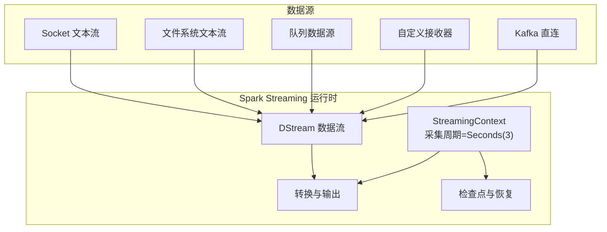
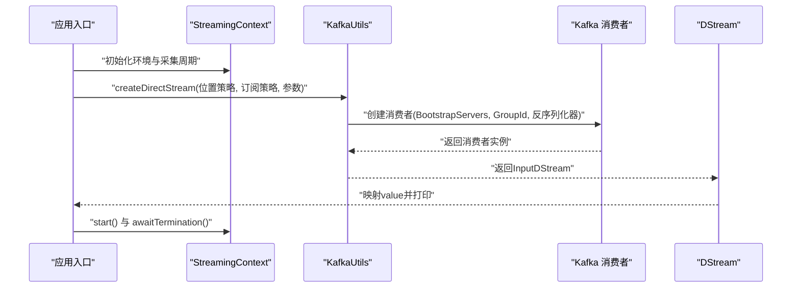
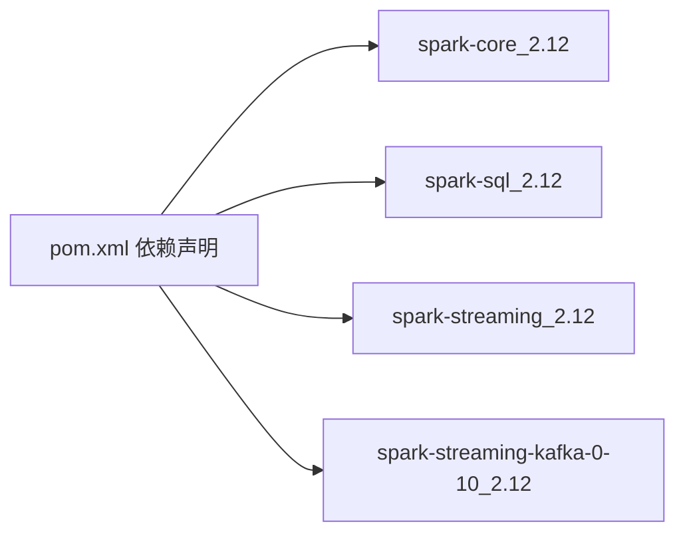

# 数据源接入与配置

<cite>
**本文引用的文件**
- [SparkStreaming01_Env.scala](file://_04_sparkTest/src/main/java/com/atguigu/bigdata/spark/streaming/SparkStreaming01_Env.scala)
- [SparkStreaming02_WordCount.scala](file://_04_sparkTest/src/main/java/com/atguigu/bigdata/spark/streaming/SparkStreaming02_WordCount.scala)
- [SparkStreaming03_Source_Dir.scala](file://_04_sparkTest/src/main/java/com/atguigu/bigdata/spark/streaming/SparkStreaming03_Source_Dir.scala)
- [SparkStreaming04_Source_Queue.scala](file://_04_sparkTest/src/main/java/com/atguigu/bigdata/spark/streaming/SparkStreaming04_Source_Queue.scala)
- [SparkStreaming05_Source_DIY.scala](file://_04_sparkTest/src/main/java/com/atguigu/bigdata/spark/streaming/SparkStreaming05_Source_DIY.scala)
- [SparkStreaming06_Source_Kafka.scala](file://_04_sparkTest/src/main/java/com/atguigu/bigdata/spark/streaming/SparkStreaming06_Source_Kafka.scala)
- [SparkStreaming06_Source_Kafka_my.scala](file://_04_sparkTest/src/main/java/B_日期/_12月30日/SparkStreaming06_Source_Kafka_my.scala)
- [SparkStreaming06_Source_Kafka_fixing.scala](file://_04_sparkTest/src/main/java/com/atguigu/bigdata/spark/streaming/SparkStreaming06_Source_Kafka_fixing.scala)
- [SparkStreaming06_Source_Kafka_fixing_GaoFan.scala](file://_04_sparkTest/src/main/java/com/atguigu/bigdata/spark/streaming/SparkStreaming06_Source_Kafka_fixing_GaoFan.scala)
- [SparkStreaming07_Transform_Output.scala](file://_04_sparkTest/src/main/java/com/atguigu/bigdata/spark/streaming/SparkStreaming07_Transform_Output.scala)
- [SparkStreaming11_Resume.scala](file://_04_sparkTest/src/main/java/com/atguigu/bigdata/spark/streaming/SparkStreaming11_Resume.scala)
- [pom.xml](file://_04_sparkTest/pom.xml)
</cite>

## 目录
1. [引言](#引言)
2. [项目结构](#项目结构)
3. [核心组件](#核心组件)
4. [架构总览](#架构总览)
5. [详细组件分析](#详细组件分析)
6. [依赖关系分析](#依赖关系分析)
7. [性能考量](#性能考量)
8. [故障排查指南](#故障排查指南)
9. [结论](#结论)
10. [附录](#附录)

## 引言
本技术文档围绕Spark Streaming数据源接入与配置展开，系统性介绍多种数据源的创建方式与最佳实践，包括：
- 文件系统监听（Directory Stream）
- 队列数据源（Queue Stream）
- 自定义数据源（DStream.createDirectStream）
- Kafka数据源（含消费者组、主题订阅、偏移量管理）

文档同时提供适用场景、性能特征与故障处理策略，并给出常见配置错误的排查方法，帮助读者在实际工程中做出合理选择与优化。

## 项目结构
该仓库中与Spark Streaming直接相关的示例位于“_04_sparkTest/src/main/java/com/atguigu/bigdata/spark/streaming”目录下，涵盖环境搭建、多种数据源接入、窗口与状态管理、输出与恢复等典型场景；另有“B_日期/_12月30日”目录下的Kafka示例，展示了不同风格的Kafka接入实现。

```mermaid
graph TB
A["SparkStreaming01_Env.scala<br/>环境初始化"] --> B["SparkStreaming02_WordCount.scala<br/>Socket数据源"]
A --> C["SparkStreaming03_Source_Dir.scala<br/>文件系统监听"]
A --> D["SparkStreaming04_Source_Queue.scala<br/>队列数据源"]
A --> E["SparkStreaming05_Source_DIY.scala<br/>自定义接收器"]
A --> F["SparkStreaming06_Source_Kafka.scala<br/>Kafka直连"]
A --> G["SparkStreaming06_Source_Kafka_my.scala<br/>Kafka直连(多主题)"]
A --> H["SparkStreaming06_Source_Kafka_fixing.scala<br/>Kafka直连(修复版)"]
A --> I["SparkStreaming06_Source_Kafka_fixing_GaoFan.scala<br/>Kafka直连(高凡版)"]
A --> J["SparkStreaming07_Transform_Output.scala<br/>转换与输出"]
A --> K["SparkStreaming11_Resume.scala<br/>检查点与恢复"]
```

图表来源
- [SparkStreaming01_Env.scala](file://_04_sparkTest/src/main/java/com/atguigu/bigdata/spark/streaming/SparkStreaming01_Env.scala#L1-L20)
- [SparkStreaming02_WordCount.scala](file://_04_sparkTest/src/main/java/com/atguigu/bigdata/spark/streaming/SparkStreaming02_WordCount.scala#L1-L36)
- [SparkStreaming03_Source_Dir.scala](file://_04_sparkTest/src/main/java/com/atguigu/bigdata/spark/streaming/SparkStreaming03_Source_Dir.scala#L1-L28)
- [SparkStreaming04_Source_Queue.scala](file://_04_sparkTest/src/main/java/com/atguigu/bigdata/spark/streaming/SparkStreaming04_Source_Queue.scala#L1-L37)
- [SparkStreaming05_Source_DIY.scala](file://_04_sparkTest/src/main/java/com/atguigu/bigdata/spark/streaming/SparkStreaming05_Source_DIY.scala#L1-L53)
- [SparkStreaming06_Source_Kafka.scala](file://_04_sparkTest/src/main/java/com/atguigu/bigdata/spark/streaming/SparkStreaming06_Source_Kafka.scala#L1-L71)
- [SparkStreaming06_Source_Kafka_my.scala](file://_04_sparkTest/src/main/java/B_日期/_12月30日/SparkStreaming06_Source_Kafka_my.scala#L29-L51)
- [SparkStreaming06_Source_Kafka_fixing.scala](file://_04_sparkTest/src/main/java/com/atguigu/bigdata/spark/streaming/SparkStreaming06_Source_Kafka_fixing.scala#L30-L48)
- [SparkStreaming06_Source_Kafka_fixing_GaoFan.scala](file://_04_sparkTest/src/main/java/com/atguigu/bigdata/spark/streaming/SparkStreaming06_Source_Kafka_fixing_GaoFan.scala#L1-L65)
- [SparkStreaming07_Transform_Output.scala](file://_04_sparkTest/src/main/java/com/atguigu/bigdata/spark/streaming/SparkStreaming07_Transform_Output.scala#L1-L37)
- [SparkStreaming11_Resume.scala](file://_04_sparkTest/src/main/java/com/atguigu/bigdata/spark/streaming/SparkStreaming11_Resume.scala#L1-L35)

章节来源
- [SparkStreaming01_Env.scala](file://_04_sparkTest/src/main/java/com/atguigu/bigdata/spark/streaming/SparkStreaming01_Env.scala#L1-L20)
- [pom.xml](file://_04_sparkTest/pom.xml#L1-L73)

## 核心组件
- 环境对象StreamingContext：负责创建Spark Streaming运行环境，设置采集周期与集群参数。
- 数据源DStream：代表无界数据流，支持多种输入源，如Socket、文件、队列、Kafka等。
- 接收器Receiver：用于基于Receiver的输入源（如Socket、自定义），具备存储级别与生命周期管理。
- Kafka直连InputDStream：通过KafkaUtils.createDirectStream进行零拷贝、精确一次语义的消费。
- 检查点与恢复：通过checkpoint与getOrCreate实现作业重启后的状态恢复。

章节来源
- [SparkStreaming01_Env.scala](file://_04_sparkTest/src/main/java/com/atguigu/bigdata/spark/streaming/SparkStreaming01_Env.scala#L1-L20)
- [SparkStreaming02_WordCount.scala](file://_04_sparkTest/src/main/java/com/atguigu/bigdata/spark/streaming/SparkStreaming02_WordCount.scala#L1-L36)
- [SparkStreaming05_Source_DIY.scala](file://_04_sparkTest/src/main/java/com/atguigu/bigdata/spark/streaming/SparkStreaming05_Source_DIY.scala#L1-L53)
- [SparkStreaming06_Source_Kafka.scala](file://_04_sparkTest/src/main/java/com/atguigu/bigdata/spark/streaming/SparkStreaming06_Source_Kafka.scala#L1-L71)
- [SparkStreaming11_Resume.scala](file://_04_sparkTest/src/main/java/com/atguigu/bigdata/spark/streaming/SparkStreaming11_Resume.scala#L1-L35)

## 架构总览
下图展示了Spark Streaming在本地模式下的典型数据流路径：环境初始化后，根据所选数据源创建DStream，经过转换与输出操作，最终由StreamingContext驱动执行。

图表来源
- [SparkStreaming01_Env.scala](file://_04_sparkTest/src/main/java/com/atguigu/bigdata/spark/streaming/SparkStreaming01_Env.scala#L1-L20)
- [SparkStreaming02_WordCount.scala](file://_04_sparkTest/src/main/java/com/atguigu/bigdata/spark/streaming/SparkStreaming02_WordCount.scala#L1-L36)
- [SparkStreaming03_Source_Dir.scala](file://_04_sparkTest/src/main/java/com/atguigu/bigdata/spark/streaming/SparkStreaming03_Source_Dir.scala#L1-L28)
- [SparkStreaming04_Source_Queue.scala](file://_04_sparkTest/src/main/java/com/atguigu/bigdata/spark/streaming/SparkStreaming04_Source_Queue.scala#L1-L37)
- [SparkStreaming05_Source_DIY.scala](file://_04_sparkTest/src/main/java/com/atguigu/bigdata/spark/streaming/SparkStreaming05_Source_DIY.scala#L1-L53)
- [SparkStreaming06_Source_Kafka.scala](file://_04_sparkTest/src/main/java/com/atguigu/bigdata/spark/streaming/SparkStreaming06_Source_Kafka.scala#L1-L71)
- [SparkStreaming11_Resume.scala](file://_04_sparkTest/src/main/java/com/atguigu/bigdata/spark/streaming/SparkStreaming11_Resume.scala#L1-L35)

## 详细组件分析

### 文件系统监听（Directory Stream）
- 创建方式：通过textFileStream指定目录，自动监听新增文件并读取其内容。
- 典型流程：环境初始化 → 创建文件流 → 分词映射 → 聚合统计 → 打印输出。
- 适用场景：日志文件增量采集、批转流场景。
- 性能特点：基于文件系统事件，延迟取决于文件落盘与目录监控；适合中小规模、低频更新的文本数据。
- 最佳实践：确保目录权限可读，避免频繁小文件；结合窗口与去重策略提升吞吐。

章节来源
- [SparkStreaming03_Source_Dir.scala](file://_04_sparkTest/src/main/java/com/atguigu/bigdata/spark/streaming/SparkStreaming03_Source_Dir.scala#L1-L28)

### 队列数据源（Queue Stream）
- 创建方式：使用queueStream将RDD队列包装为DStream，适合测试与演示。
- 典型流程：构建RDD队列 → 创建队列流 → 分词映射 → 聚合统计 → 打印输出。
- 适用场景：本地调试、单元测试、模拟实时数据。
- 性能特点：内存队列，吞吐受限于队列容量与线程调度；不适合生产高并发场景。
- 最佳实践：合理设置采集周期，避免队列积压；生产环境建议替换为真实数据源。

章节来源
- [SparkStreaming04_Source_Queue.scala](file://_04_sparkTest/src/main/java/com/atguigu/bigdata/spark/streaming/SparkStreaming04_Source_Queue.scala#L1-L37)

### 自定义数据源（DStream.createDirectStream）
- 创建方式：通过KafkaUtils.createDirectStream实现直连Kafka，无需Receiver，具备更高的吞吐与容错能力。
- 关键配置：
  - Bootstrap服务器列表
  - 消费者组（GROUP_ID_CONFIG）
  - 键值反序列化器
  - 主题订阅（Subscribe）
  - 分区位置策略（PreferConsistent）
- 典型流程：环境初始化 → 构造Kafka参数 → createDirectStream → 映射value → 打印输出。
- 适用场景：生产级Kafka数据接入，要求低延迟与高吞吐。
- 性能特点：零拷贝、精确一次语义；分区与并行度直接影响吞吐。
- 最佳实践：合理设置分区数与并行度；关注消费者组一致性与偏移量提交策略。

章节来源
- [SparkStreaming06_Source_Kafka.scala](file://_04_sparkTest/src/main/java/com/atguigu/bigdata/spark/streaming/SparkStreaming06_Source_Kafka.scala#L1-L71)
- [SparkStreaming06_Source_Kafka_my.scala](file://_04_sparkTest/src/main/java/B_日期/_12月30日/SparkStreaming06_Source_Kafka_my.scala#L29-L51)
- [SparkStreaming06_Source_Kafka_fixing.scala](file://_04_sparkTest/src/main/java/com/atguigu/bigdata/spark/streaming/SparkStreaming06_Source_Kafka_fixing.scala#L30-L48)
- [SparkStreaming06_Source_Kafka_fixing_GaoFan.scala](file://_04_sparkTest/src/main/java/com/atguigu/bigdata/spark/streaming/SparkStreaming06_Source_Kafka_fixing_GaoFan.scala#L1-L65)

### Socket数据源（网络流）
- 创建方式：socketTextStream建立TCP连接，按行读取数据。
- 典型流程：环境初始化 → 建立Socket流 → 分词映射 → 聚合统计 → 打印输出。
- 适用场景：本地联调、快速验证数据链路。
- 性能特点：单通道阻塞读取，吞吐有限；适合低频、小规模数据。
- 最佳实践：避免长时间阻塞；生产环境应替换为Kafka或文件系统。

章节来源
- [SparkStreaming02_WordCount.scala](file://_04_sparkTest/src/main/java/com/atguigu/bigdata/spark/streaming/SparkStreaming02_WordCount.scala#L1-L36)

### 自定义接收器（Receiver）
- 创建方式：继承Receiver并实现onStart/onStop，通过store写入内部缓冲。
- 典型流程：环境初始化 → receiverStream(new MyReceiver()) → 打印输出。
- 适用场景：非标准协议或第三方系统接入。
- 性能特点：基于Receiver的背压与存储级别影响稳定性；需谨慎选择存储级别。
- 最佳实践：合理设置存储级别；保证onStop及时释放资源；避免阻塞主线程。

章节来源
- [SparkStreaming05_Source_DIY.scala](file://_04_sparkTest/src/main/java/com/atguigu/bigdata/spark/streaming/SparkStreaming05_Source_DIY.scala#L1-L53)

### Kafka数据源配置与使用
- 消费者组配置：通过GROUP_ID_CONFIG设置消费者组ID，实现多实例负载均衡与容错。
- 主题订阅：使用Subscribe指定主题集合，支持多主题。
- 偏移量管理：直连模式下由Spark管理偏移量，结合检查点实现恢复。
- 反序列化器：键值反序列化器需与生产端一致。
- 分区位置策略：PreferConsistent确保分区分配均匀。

图表来源
- [SparkStreaming06_Source_Kafka.scala](file://_04_sparkTest/src/main/java/com/atguigu/bigdata/spark/streaming/SparkStreaming06_Source_Kafka.scala#L1-L71)
- [SparkStreaming06_Source_Kafka_my.scala](file://_04_sparkTest/src/main/java/B_日期/_12月30日/SparkStreaming06_Source_Kafka_my.scala#L29-L51)
- [SparkStreaming06_Source_Kafka_fixing.scala](file://_04_sparkTest/src/main/java/com/atguigu/bigdata/spark/streaming/SparkStreaming06_Source_Kafka_fixing.scala#L30-L48)
- [SparkStreaming06_Source_Kafka_fixing_GaoFan.scala](file://_04_sparkTest/src/main/java/com/atguigu/bigdata/spark/streaming/SparkStreaming06_Source_Kafka_fixing_GaoFan.scala#L1-L65)

章节来源
- [SparkStreaming06_Source_Kafka.scala](file://_04_sparkTest/src/main/java/com/atguigu/bigdata/spark/streaming/SparkStreaming06_Source_Kafka.scala#L1-L71)
- [SparkStreaming06_Source_Kafka_my.scala](file://_04_sparkTest/src/main/java/B_日期/_12月30日/SparkStreaming06_Source_Kafka_my.scala#L29-L51)
- [SparkStreaming06_Source_Kafka_fixing.scala](file://_04_sparkTest/src/main/java/com/atguigu/bigdata/spark/streaming/SparkStreaming06_Source_Kafka_fixing.scala#L30-L48)
- [SparkStreaming06_Source_Kafka_fixing_GaoFan.scala](file://_04_sparkTest/src/main/java/com/atguigu/bigdata/spark/streaming/SparkStreaming06_Source_Kafka_fixing_GaoFan.scala#L1-L65)

### 数据转换与输出
- 转换链路：flatMap → map → reduceByKey形成词频统计。
- 输出策略：print默认输出到控制台；可扩展为自定义输出算子。
- 适用场景：实时统计、指标监控、告警触发。

章节来源
- [SparkStreaming07_Transform_Output.scala](file://_04_sparkTest/src/main/java/com/atguigu/bigdata/spark/streaming/SparkStreaming07_Transform_Output.scala#L1-L37)

### 检查点与恢复
- 检查点目录：通过checkpoint设置持久化目录。
- 恢复机制：getOrCreate从检查点加载环境，实现作业重启后的状态恢复。
- 适用场景：长周期运行、需要容错与高可用的流处理任务。

章节来源
- [SparkStreaming11_Resume.scala](file://_04_sparkTest/src/main/java/com/atguigu/bigdata/spark/streaming/SparkStreaming11_Resume.scala#L1-L35)

## 依赖关系分析
- 核心依赖：spark-core、spark-sql、spark-streaming、spark-streaming-kafka-0-10。
- 版本：统一使用3.0.0，确保API兼容性。
- 外部集成：Kafka直连依赖spark-streaming-kafka-0-10，提供KafkaUtils与策略类。

图表来源
- [pom.xml](file://_04_sparkTest/pom.xml#L1-L73)

章节来源
- [pom.xml](file://_04_sparkTest/pom.xml#L1-L73)

## 性能考量
- 采集周期：采集周期越短，延迟越低但资源消耗越高；需结合业务需求权衡。
- 并行度：Kafka分区数与Spark并行度成正比，合理设置可提升吞吐。
- 存储级别：Receiver接收器的存储级别影响内存占用与容错能力，需按场景选择。
- 直连模式：Kafka直连避免Receiver瓶颈，适合高吞吐场景。
- 状态管理：无状态计算开销低，有状态计算需考虑检查点与内存压力。

[本节为通用指导，不直接分析具体文件]

## 故障排查指南
- Kafka连接失败
  - 现象：无法连接Bootstrap服务器或主题不存在。
  - 排查：确认BootstrapServers配置正确；检查消费者组是否被其他实例占用；确认主题已创建且分区数满足需求。
  - 参考路径：Kafka参数构造与订阅策略。
  
  章节来源
  - [SparkStreaming06_Source_Kafka.scala](file://_04_sparkTest/src/main/java/com/atguigu/bigdata/spark/streaming/SparkStreaming06_Source_Kafka.scala#L1-L71)
  - [SparkStreaming06_Source_Kafka_my.scala](file://_04_sparkTest/src/main/java/B_日期/_12月30日/SparkStreaming06_Source_Kafka_my.scala#L29-L51)
  - [SparkStreaming06_Source_Kafka_fixing.scala](file://_04_sparkTest/src/main/java/com/atguigu/bigdata/spark/streaming/SparkStreaming06_Source_Kafka_fixing.scala#L30-L48)
  - [SparkStreaming06_Source_Kafka_fixing_GaoFan.scala](file://_04_sparkTest/src/main/java/com/atguigu/bigdata/spark/streaming/SparkStreaming06_Source_Kafka_fixing_GaoFan.scala#L1-L65)

- Receiver阻塞或内存溢出
  - 现象：接收器无法持续采集或内存占用过高。
  - 排查：调整存储级别；避免在onStart中执行阻塞操作；确保onStop释放资源。
  - 参考路径：自定义接收器实现。

  章节来源
  - [SparkStreaming05_Source_DIY.scala](file://_04_sparkTest/src/main/java/com/atguigu/bigdata/spark/streaming/SparkStreaming05_Source_DIY.scala#L1-L53)

- 检查点未生效
  - 现象：作业重启后状态未恢复。
  - 排查：确认checkpoint目录存在且可写；getOrCreate回调是否正确返回StreamingContext；检查磁盘空间与权限。
  - 参考路径：检查点与恢复实现。

  章节来源
  - [SparkStreaming11_Resume.scala](file://_04_sparkTest/src/main/java/com/atguigu/bigdata/spark/streaming/SparkStreaming11_Resume.scala#L1-L35)

- 采集周期过长导致延迟
  - 现象：业务对实时性要求较高。
  - 排查：适当缩短采集周期；评估资源与吞吐平衡；必要时增加并行度。
  - 参考路径：环境初始化与采集周期设置。

  章节来源
  - [SparkStreaming01_Env.scala](file://_04_sparkTest/src/main/java/com/atguigu/bigdata/spark/streaming/SparkStreaming01_Env.scala#L1-L20)

## 结论
- 文件系统监听适合日志与小规模文本数据；队列数据源适合本地测试；Socket适合快速联调；Kafka直连适合生产级高吞吐场景。
- Kafka接入的关键在于消费者组、主题订阅、反序列化器与分区策略；结合检查点可实现稳定恢复。
- 在实际部署中，应综合考虑延迟、吞吐、资源与可靠性，选择合适的数据源与配置策略。

[本节为总结性内容，不直接分析具体文件]

## 附录
- 数据源选择指南
  - 低延迟、高吞吐、生产级：优先Kafka直连。
  - 日志与文本文件：文件系统监听。
  - 本地测试与演示：队列数据源或Socket。
  - 自定义协议或第三方系统：自定义接收器。
- 常见配置错误
  - Kafka参数缺失或错误：缺少BootstrapServers、GroupId或反序列化器。
  - 检查点目录不可写：导致恢复失败。
  - 存储级别不当：导致内存溢出或性能下降。
  - 采集周期过短：资源紧张；过长：延迟升高。

[本节为通用指导，不直接分析具体文件]