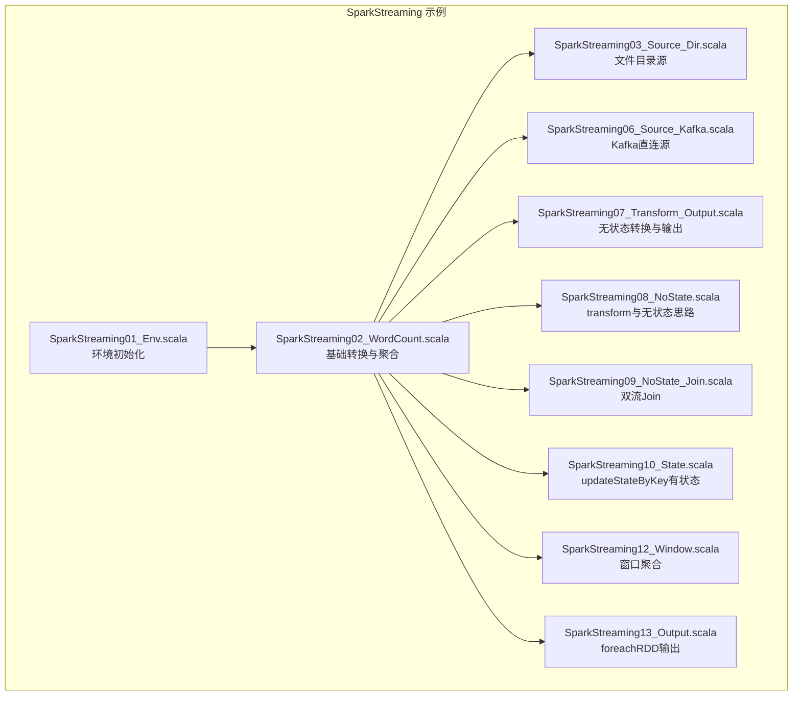
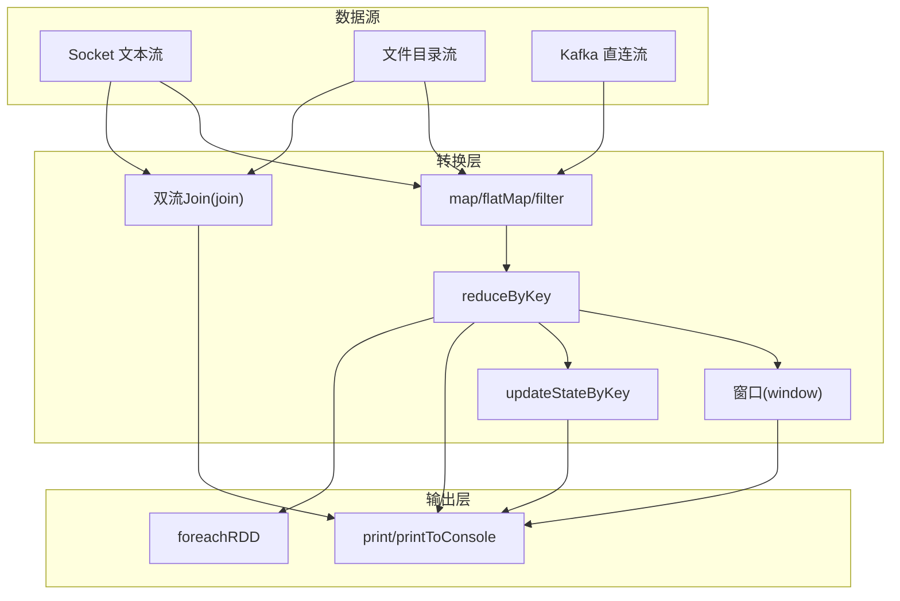
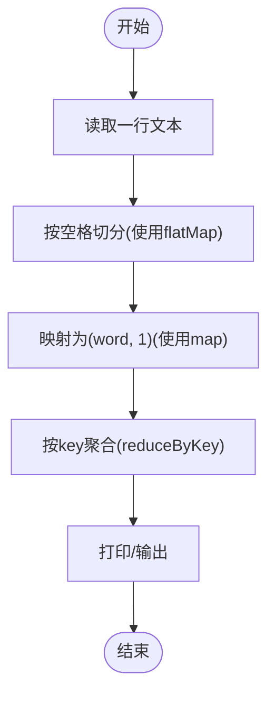
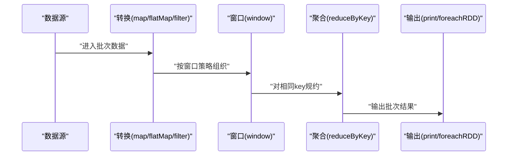
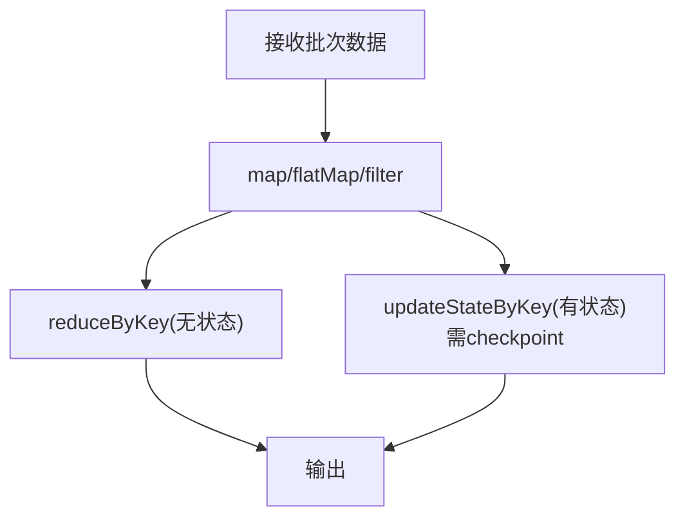
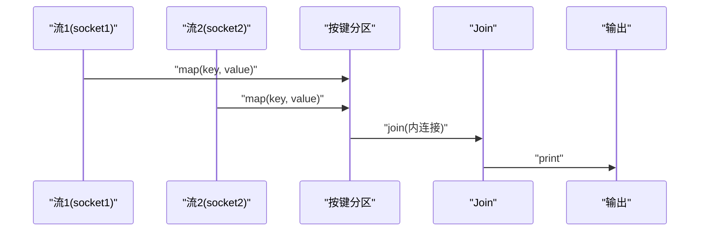
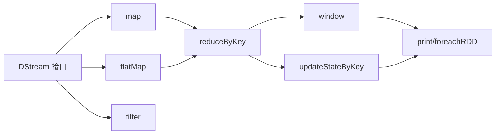

# 流数据转换操作

<cite>
**本文引用的文件**
- [SparkStreaming01_Env.scala](file://_04_sparkTest/src/main/java/com/atguigu/bigdata/spark/streaming/SparkStreaming01_Env.scala)
- [SparkStreaming02_WordCount.scala](file://_04_sparkTest/src/main/java/com/atguigu/bigdata/spark/streaming/SparkStreaming02_WordCount.scala)
- [SparkStreaming03_Source_Dir.scala](file://_04_sparkTest/src/main/java/com/atguigu/bigdata/spark/streaming/SparkStreaming03_Source_Dir.scala)
- [SparkStreaming06_Source_Kafka.scala](file://_04_sparkTest/src/main/java/com/atguigu/bigdata/spark/streaming/SparkStreaming06_Source_Kafka.scala)
- [SparkStreaming07_Transform_Output.scala](file://_04_sparkTest/src/main/java/com/atguigu/bigdata/spark/streaming/SparkStreaming07_Transform_Output.scala)
- [SparkStreaming08_NoState.scala](file://_04_sparkTest/src/main/java/com/atguigu/bigdata/spark/streaming/SparkStreaming08_NoState.scala)
- [SparkStreaming09_NoState_Join.scala](file://_04_sparkTest/src/main/java/com/atguigu/bigdata/spark/streaming/SparkStreaming09_NoState_Join.scala)
- [SparkStreaming10_State.scala](file://_04_sparkTest/src/main/java/com/atguigu/bigdata/spark/streaming/SparkStreaming10_State.scala)
- [SparkStreaming12_Window.scala](file://_04_sparkTest/src/main/java/com/atguigu/bigdata/spark/streaming/SparkStreaming12_Window.scala)
- [SparkStreaming13_Output.scala](file://_04_sparkTest/src/main/java/com/atguigu/bigdata/spark/streaming/SparkStreaming13_Output.scala)
</cite>

## 目录
1. [引言](#引言)
2. [项目结构](#项目结构)
3. [核心组件](#核心组件)
4. [架构总览](#架构总览)
5. [详细组件分析](#详细组件分析)
6. [依赖关系分析](#依赖关系分析)
7. [性能考虑](#性能考虑)
8. [故障排查指南](#故障排查指南)
9. [结论](#结论)
10. [附录](#附录)

## 引言
本技术文档围绕Spark Streaming的流数据转换操作展开，系统讲解一对一转换（map、flatMap、filter）与一对多转换（flatMap），并结合窗口、状态管理（updateStateByKey）、双流Join等典型场景，给出可直接定位到源码路径的示例与流程图。同时提供性能优化与内存管理的最佳实践建议，帮助读者快速掌握流式计算的关键能力。

## 项目结构
该仓库中与Spark Streaming转换操作直接相关的示例集中在“_04_sparkTest/src/main/java/com/atguigu/bigdata/spark/streaming”目录下，按功能划分为环境搭建、数据源接入、转换与聚合、窗口、状态、输出等模块。这些示例共同构成了一条从数据接入到转换、聚合、输出的完整链路。

图表来源
- [SparkStreaming01_Env.scala](file://_04_sparkTest/src/main/java/com/atguigu/bigdata/spark/streaming/SparkStreaming01_Env.scala#L1-L20)
- [SparkStreaming02_WordCount.scala](file://_04_sparkTest/src/main/java/com/atguigu/bigdata/spark/streaming/SparkStreaming02_WordCount.scala#L1-L36)
- [SparkStreaming03_Source_Dir.scala](file://_04_sparkTest/src/main/java/com/atguigu/bigdata/spark/streaming/SparkStreaming03_Source_Dir.scala#L1-L28)
- [SparkStreaming06_Source_Kafka.scala](file://_04_sparkTest/src/main/java/com/atguigu/bigdata/spark/streaming/SparkStreaming06_Source_Kafka.scala#L1-L72)
- [SparkStreaming07_Transform_Output.scala](file://_04_sparkTest/src/main/java/com/atguigu/bigdata/spark/streaming/SparkStreaming07_Transform_Output.scala#L1-L37)
- [SparkStreaming08_NoState.scala](file://_04_sparkTest/src/main/java/com/atguigu/bigdata/spark/streaming/SparkStreaming08_NoState.scala#L1-L58)
- [SparkStreaming09_NoState_Join.scala](file://_04_sparkTest/src/main/java/com/atguigu/bigdata/spark/streaming/SparkStreaming09_NoState_Join.scala#L1-L42)
- [SparkStreaming10_State.scala](file://_04_sparkTest/src/main/java/com/atguigu/bigdata/spark/streaming/SparkStreaming10_State.scala#L1-L40)
- [SparkStreaming12_Window.scala](file://_04_sparkTest/src/main/java/com/atguigu/bigdata/spark/streaming/SparkStreaming12_Window.scala#L1-L32)
- [SparkStreaming13_Output.scala](file://_04_sparkTest/src/main/java/com/atguigu/bigdata/spark/streaming/SparkStreaming13_Output.scala#L1-L35)

章节来源
- [SparkStreaming01_Env.scala](file://_04_sparkTest/src/main/java/com/atguigu/bigdata/spark/streaming/SparkStreaming01_Env.scala#L1-L20)

## 核心组件
- 环境与上下文
  - StreamingContext负责作业生命周期与采集周期配置，是所有流式转换的根容器。
  - 参考路径：[SparkStreaming01_Env.scala](file://_04_sparkTest/src/main/java/com/atguigu/bigdata/spark/streaming/SparkStreaming01_Env.scala#L1-L20)
- 数据源
  - Socket文本流、文件目录流、Kafka直连流等，作为DStream的起点。
  - 参考路径：
    - [SparkStreaming02_WordCount.scala](file://_04_sparkTest/src/main/java/com/atguigu/bigdata/spark/streaming/SparkStreaming02_WordCount.scala#L1-L36)
    - [SparkStreaming03_Source_Dir.scala](file://_04_sparkTest/src/main/java/com/atguigu/bigdata/spark/streaming/SparkStreaming03_Source_Dir.scala#L1-L28)
    - [SparkStreaming06_Source_Kafka.scala](file://_04_sparkTest/src/main/java/com/atguigu/bigdata/spark/streaming/SparkStreaming06_Source_Kafka.scala#L1-L72)
- 转换与聚合
  - 一对一转换：map、flatMap、filter；一对多转换：flatMap。
  - 聚合：reduceByKey、窗口聚合、updateStateByKey。
  - 参考路径：
    - [SparkStreaming02_WordCount.scala](file://_04_sparkTest/src/main/java/com/atguigu/bigdata/spark/streaming/SparkStreaming02_WordCount.scala#L1-L36)
    - [SparkStreaming12_Window.scala](file://_04_sparkTest/src/main/java/com/atguigu/bigdata/spark/streaming/SparkStreaming12_Window.scala#L1-L32)
    - [SparkStreaming10_State.scala](file://_04_sparkTest/src/main/java/com/atguigu/bigdata/spark/streaming/SparkStreaming10_State.scala#L1-L40)
- Join与连接
  - 双流Join：基于键的内连接。
  - 参考路径：[SparkStreaming09_NoState_Join.scala](file://_04_sparkTest/src/main/java/com/atguigu/bigdata/spark/streaming/SparkStreaming09_NoState_Join.scala#L1-L42)
- 输出与Checkpoint
  - foreachRDD输出、transform转换、checkpoint目录设置。
  - 参考路径：
    - [SparkStreaming07_Transform_Output.scala](file://_04_sparkTest/src/main/java/com/atguigu/bigdata/spark/streaming/SparkStreaming07_Transform_Output.scala#L1-L37)
    - [SparkStreaming08_NoState.scala](file://_04_sparkTest/src/main/java/com/atguigu/bigdata/spark/streaming/SparkStreaming08_NoState.scala#L1-L58)
    - [SparkStreaming13_Output.scala](file://_04_sparkTest/src/main/java/com/atguigu/bigdata/spark/streaming/SparkStreaming13_Output.scala#L1-L35)

章节来源
- [SparkStreaming02_WordCount.scala](file://_04_sparkTest/src/main/java/com/atguigu/bigdata/spark/streaming/SparkStreaming02_WordCount.scala#L1-L36)
- [SparkStreaming09_NoState_Join.scala](file://_04_sparkTest/src/main/java/com/atguigu/bigdata/spark/streaming/SparkStreaming09_NoState_Join.scala#L1-L42)
- [SparkStreaming10_State.scala](file://_04_sparkTest/src/main/java/com/atguigu/bigdata/spark/streaming/SparkStreaming10_State.scala#L1-L40)
- [SparkStreaming12_Window.scala](file://_04_sparkTest/src/main/java/com/atguigu/bigdata/spark/streaming/SparkStreaming12_Window.scala#L1-L32)
- [SparkStreaming07_Transform_Output.scala](file://_04_sparkTest/src/main/java/com/atguigu/bigdata/spark/streaming/SparkStreaming07_Transform_Output.scala#L1-L37)
- [SparkStreaming08_NoState.scala](file://_04_sparkTest/src/main/java/com/atguigu/bigdata/spark/streaming/SparkStreaming08_NoState.scala#L1-L58)
- [SparkStreaming13_Output.scala](file://_04_sparkTest/src/main/java/com/atguigu/bigdata/spark/streaming/SparkStreaming13_Output.scala#L1-L35)

## 架构总览
下图展示了从数据源到转换、聚合、输出的整体流程，涵盖socket、文件目录、Kafka三种常见数据源，以及map/flatMap/filter、reduceByKey、窗口、updateStateByKey、双流Join等关键转换。

图表来源
- [SparkStreaming02_WordCount.scala](file://_04_sparkTest/src/main/java/com/atguigu/bigdata/spark/streaming/SparkStreaming02_WordCount.scala#L1-L36)
- [SparkStreaming03_Source_Dir.scala](file://_04_sparkTest/src/main/java/com/atguigu/bigdata/spark/streaming/SparkStreaming03_Source_Dir.scala#L1-L28)
- [SparkStreaming06_Source_Kafka.scala](file://_04_sparkTest/src/main/java/com/atguigu/bigdata/spark/streaming/SparkStreaming06_Source_Kafka.scala#L1-L72)
- [SparkStreaming09_NoState_Join.scala](file://_04_sparkTest/src/main/java/com/atguigu/bigdata/spark/streaming/SparkStreaming09_NoState_Join.scala#L1-L42)
- [SparkStreaming10_State.scala](file://_04_sparkTest/src/main/java/com/atguigu/bigdata/spark/streaming/SparkStreaming10_State.scala#L1-L40)
- [SparkStreaming12_Window.scala](file://_04_sparkTest/src/main/java/com/atguigu/bigdata/spark/streaming/SparkStreaming12_Window.scala#L1-L32)
- [SparkStreaming07_Transform_Output.scala](file://_04_sparkTest/src/main/java/com/atguigu/bigdata/spark/streaming/SparkStreaming07_Transform_Output.scala#L1-L37)
- [SparkStreaming13_Output.scala](file://_04_sparkTest/src/main/java/com/atguigu/bigdata/spark/streaming/SparkStreaming13_Output.scala#L1-L35)

## 详细组件分析

### 一对一转换：map、flatMap、filter
- 功能与语义
  - map：对每个元素进行一对一映射，常用于结构化或打标。
  - flatMap：一对多转换，常用于切分单词、展平嵌套结构。
  - filter：基于条件过滤，减少后续处理的数据量。
- 典型用法与示例路径
  - 基础WordCount链路中包含flatMap与map，体现典型的“切词→二元组→聚合”的模式。
    - 示例路径：[SparkStreaming02_WordCount.scala](file://_04_sparkTest/src/main/java/com/atguigu/bigdata/spark/streaming/SparkStreaming02_WordCount.scala#L1-L36)
  - transform在Driver端进行全局逻辑，适合无状态但需在Driver侧参与的转换。
    - 示例路径：[SparkStreaming08_NoState.scala](file://_04_sparkTest/src/main/java/com/atguigu/bigdata/spark/streaming/SparkStreaming08_NoState.scala#L1-L58)
- 复杂度与性能
  - map/flatMap/filter均为O(n)线性复杂度；flatMap可能放大数据规模，需配合filter限流或窗口聚合降低峰值。
- 错误与边界
  - 注意空值与异常抛出，避免在map/flatMap中引入NPE；必要时在filter阶段剔除非法记录。

图表来源
- [SparkStreaming02_WordCount.scala](file://_04_sparkTest/src/main/java/com/atguigu/bigdata/spark/streaming/SparkStreaming02_WordCount.scala#L1-L36)

章节来源
- [SparkStreaming02_WordCount.scala](file://_04_sparkTest/src/main/java/com/atguigu/bigdata/spark/streaming/SparkStreaming02_WordCount.scala#L1-L36)
- [SparkStreaming08_NoState.scala](file://_04_sparkTest/src/main/java/com/atguigu/bigdata/spark/streaming/SparkStreaming08_NoState.scala#L1-L58)

### 一对多转换：flatMap
- 适用场景
  - 文本切词、展平列表、广播后的多播等。
- 示例路径
  - 切词与二元组构造的经典链路：
    - [SparkStreaming02_WordCount.scala](file://_04_sparkTest/src/main/java/com/atguigu/bigdata/spark/streaming/SparkStreaming02_WordCount.scala#L1-L36)
- 性能要点
  - flatMap可能产生大量中间元组，应结合窗口或早期filter控制数据量。

章节来源
- [SparkStreaming02_WordCount.scala](file://_04_sparkTest/src/main/java/com/atguigu/bigdata/spark/streaming/SparkStreaming02_WordCount.scala#L1-L36)

### 聚合与窗口：reduceByKey 与 window
- reduceByKey
  - 对相同key的value进行规约，天然支持无状态聚合。
  - 示例路径：[SparkStreaming02_WordCount.scala](file://_04_sparkTest/src/main/java/com/atguigu/bigdata/spark/streaming/SparkStreaming02_WordCount.scala#L1-L36)
- 窗口聚合
  - window(duration, slide)将多个采集周期合并为窗口，slide需为采集周期整数倍。
  - 示例路径：[SparkStreaming12_Window.scala](file://_04_sparkTest/src/main/java/com/atguigu/bigdata/spark/streaming/SparkStreaming12_Window.scala#L1-L32)
- 复杂度与性能
  - reduceByKey时间复杂度近似O(n)，空间取决于key数量；窗口聚合会增加内存占用，需合理设置窗口与滑动步长。

图表来源
- [SparkStreaming02_WordCount.scala](file://_04_sparkTest/src/main/java/com/atguigu/bigdata/spark/streaming/SparkStreaming02_WordCount.scala#L1-L36)
- [SparkStreaming12_Window.scala](file://_04_sparkTest/src/main/java/com/atguigu/bigdata/spark/streaming/SparkStreaming12_Window.scala#L1-L32)

章节来源
- [SparkStreaming02_WordCount.scala](file://_04_sparkTest/src/main/java/com/atguigu/bigdata/spark/streaming/SparkStreaming02_WordCount.scala#L1-L36)
- [SparkStreaming12_Window.scala](file://_04_sparkTest/src/main/java/com/atguigu/bigdata/spark/streaming/SparkStreaming12_Window.scala#L1-L32)

### 状态管理：updateStateByKey 与 transform
- 无状态转换
  - reduceByKey默认无状态，每批次独立计算，适合实时计数。
  - 示例路径：[SparkStreaming07_Transform_Output.scala](file://_04_sparkTest/src/main/java/com/atguigu/bigdata/spark/streaming/SparkStreaming07_Transform_Output.scala#L1-L37)
- 有状态转换：updateStateByKey
  - 基于key维护跨批次状态，适合累计计数、会话聚合等。
  - 需设置checkpoint目录以持久化状态。
  - 示例路径：[SparkStreaming10_State.scala](file://_04_sparkTest/src/main/java/com/atguigu/bigdata/spark/streaming/SparkStreaming10_State.scala#L1-L40)
- transform
  - 在Driver端执行的全局转换，适合与外部系统交互或进行全局逻辑。
  - 示例路径：[SparkStreaming08_NoState.scala](file://_04_sparkTest/src/main/java/com/atguigu/bigdata/spark/streaming/SparkStreaming08_NoState.scala#L1-L58)
- 复杂度与性能
  - updateStateByKey会累积状态，内存压力较大；建议结合外部存储（如Redis）做“状态外置”。

图表来源
- [SparkStreaming07_Transform_Output.scala](file://_04_sparkTest/src/main/java/com/atguigu/bigdata/spark/streaming/SparkStreaming07_Transform_Output.scala#L1-L37)
- [SparkStreaming10_State.scala](file://_04_sparkTest/src/main/java/com/atguigu/bigdata/spark/streaming/SparkStreaming10_State.scala#L1-L40)
- [SparkStreaming08_NoState.scala](file://_04_sparkTest/src/main/java/com/atguigu/bigdata/spark/streaming/SparkStreaming08_NoState.scala#L1-L58)

章节来源
- [SparkStreaming07_Transform_Output.scala](file://_04_sparkTest/src/main/java/com/atguigu/bigdata/spark/streaming/SparkStreaming07_Transform_Output.scala#L1-L37)
- [SparkStreaming10_State.scala](file://_04_sparkTest/src/main/java/com/atguigu/bigdata/spark/streaming/SparkStreaming10_State.scala#L1-L40)
- [SparkStreaming08_NoState.scala](file://_04_sparkTest/src/main/java/com/atguigu/bigdata/spark/streaming/SparkStreaming08_NoState.scala#L1-L58)

### Join操作：双流Join
- 内连接（Join）
  - 基于相同key的双流内连接，要求两条流均已按键分区。
  - 示例路径：[SparkStreaming09_NoState_Join.scala](file://_04_sparkTest/src/main/java/com/atguigu/bigdata/spark/streaming/SparkStreaming09_NoState_Join.scala#L1-L42)
- 外连接（Outer Join）
  - 若需保留一侧缺失值，可采用leftOuterJoin/rightOuterJoin/connect配合自定义逻辑实现。
  - 本仓库未直接提供外连接示例，但可通过connect与状态结合实现类似效果。

图表来源
- [SparkStreaming09_NoState_Join.scala](file://_04_sparkTest/src/main/java/com/atguigu/bigdata/spark/streaming/SparkStreaming09_NoState_Join.scala#L1-L42)

章节来源
- [SparkStreaming09_NoState_Join.scala](file://_04_sparkTest/src/main/java/com/atguigu/bigdata/spark/streaming/SparkStreaming09_NoState_Join.scala#L1-L42)

### 输出与Checkpoint
- foreachRDD输出
  - 将每个批次的RDD交给用户函数处理，适合写入数据库、缓存等外部系统。
  - 示例路径：[SparkStreaming13_Output.scala](file://_04_sparkTest/src/main/java/com/atguigu/bigdata/spark/streaming/SparkStreaming13_Output.scala#L1-L35)
- checkpoint
  - 有状态算子（如updateStateByKey）依赖checkpoint目录持久化状态。
  - 示例路径：[SparkStreaming10_State.scala](file://_04_sparkTest/src/main/java/com/atguigu/bigdata/spark/streaming/SparkStreaming10_State.scala#L1-L40)

章节来源
- [SparkStreaming13_Output.scala](file://_04_sparkTest/src/main/java/com/atguigu/bigdata/spark/streaming/SparkStreaming13_Output.scala#L1-L35)
- [SparkStreaming10_State.scala](file://_04_sparkTest/src/main/java/com/atguigu/bigdata/spark/streaming/SparkStreaming10_State.scala#L1-L40)

## 依赖关系分析
- 组件耦合
  - 数据源与转换层松耦合，通过DStream接口串联。
  - 聚合与窗口层对上游转换无侵入，便于组合。
  - 状态管理与Checkpoint存在强依赖，需统一规划。
- 外部依赖
  - Kafka直连依赖kafka-clients与kafka010包。
  - 文件目录源依赖HDFS或本地文件系统。
- 可能的循环依赖
  - 示例代码为单向数据流，不存在循环依赖风险。

图表来源
- [SparkStreaming02_WordCount.scala](file://_04_sparkTest/src/main/java/com/atguigu/bigdata/spark/streaming/SparkStreaming02_WordCount.scala#L1-L36)
- [SparkStreaming12_Window.scala](file://_04_sparkTest/src/main/java/com/atguigu/bigdata/spark/streaming/SparkStreaming12_Window.scala#L1-L32)
- [SparkStreaming10_State.scala](file://_04_sparkTest/src/main/java/com/atguigu/bigdata/spark/streaming/SparkStreaming10_State.scala#L1-L40)
- [SparkStreaming07_Transform_Output.scala](file://_04_sparkTest/src/main/java/com/atguigu/bigdata/spark/streaming/SparkStreaming07_Transform_Output.scala#L1-L37)
- [SparkStreaming13_Output.scala](file://_04_sparkTest/src/main/java/com/atguigu/bigdata/spark/streaming/SparkStreaming13_Output.scala#L1-L35)

章节来源
- [SparkStreaming06_Source_Kafka.scala](file://_04_sparkTest/src/main/java/com/atguigu/bigdata/spark/streaming/SparkStreaming06_Source_Kafka.scala#L1-L72)

## 性能考虑
- 转换链路优化
  - 优先使用flatMap/filter在早期限流，避免中间放大导致GC压力。
  - reduceByKey天然无状态，适合高频实时统计；若需累计，再权衡updateStateByKey。
- 窗口与滑动
  - 窗口大小与滑动步长应为采集周期整数倍；窗口越大内存占用越高。
  - 合理设置批间隔，使滑动步长与批间隔匹配，提升吞吐。
- 状态与Checkpoint
  - updateStateByKey会产生持续增长的状态，建议结合外部存储（如Redis）做“状态外置”，仅保留最小必要状态在内存。
  - checkpoint目录需具备高可用与低延迟，避免成为瓶颈。
- 输出与背压
  - foreachRDD写外部系统时注意限流与异步提交，避免阻塞流处理线程。
- 内存管理
  - 控制缓存比例与序列化策略，避免频繁Full GC。
  - 对热点key进行分区或打散，缓解单点压力。

## 故障排查指南
- 窗口配置错误
  - 现象：窗口与滑动步长不满足整数倍关系时报错。
  - 排查：核对采集周期与窗口/滑动参数。
  - 参考路径：[SparkStreaming12_Window.scala](file://_04_sparkTest/src/main/java/com/atguigu/bigdata/spark/streaming/SparkStreaming12_Window.scala#L1-L32)
- 缺少Checkpoint目录
  - 现象：使用updateStateByKey时报“未设置checkpoint目录”。
  - 排查：在StreamingContext上设置checkpoint目录。
  - 参考路径：[SparkStreaming10_State.scala](file://_04_sparkTest/src/main/java/com/atguigu/bigdata/spark/streaming/SparkStreaming10_State.scala#L1-L40)
- 数据源不可用
  - 现象：Socket/Kafka无法连接。
  - 排查：确认主机、端口、topic、消费者组配置正确。
  - 参考路径：
    - [SparkStreaming02_WordCount.scala](file://_04_sparkTest/src/main/java/com/atguigu/bigdata/spark/streaming/SparkStreaming02_WordCount.scala#L1-L36)
    - [SparkStreaming06_Source_Kafka.scala](file://_04_sparkTest/src/main/java/com/atguigu/bigdata/spark/streaming/SparkStreaming06_Source_Kafka.scala#L1-L72)
- 输出阻塞
  - 现象：foreachRDD写入外部系统卡顿。
  - 排查：检查外部系统延迟、连接池、异步提交策略。
  - 参考路径：[SparkStreaming13_Output.scala](file://_04_sparkTest/src/main/java/com/atguigu/bigdata/spark/streaming/SparkStreaming13_Output.scala#L1-L35)

章节来源
- [SparkStreaming12_Window.scala](file://_04_sparkTest/src/main/java/com/atguigu/bigdata/spark/streaming/SparkStreaming12_Window.scala#L1-L32)
- [SparkStreaming10_State.scala](file://_04_sparkTest/src/main/java/com/atguigu/bigdata/spark/streaming/SparkStreaming10_State.scala#L1-L40)
- [SparkStreaming02_WordCount.scala](file://_04_sparkTest/src/main/java/com/atguigu/bigdata/spark/streaming/SparkStreaming02_WordCount.scala#L1-L36)
- [SparkStreaming06_Source_Kafka.scala](file://_04_sparkTest/src/main/java/com/atguigu/bigdata/spark/streaming/SparkStreaming06_Source_Kafka.scala#L1-L72)
- [SparkStreaming13_Output.scala](file://_04_sparkTest/src/main/java/com/atguigu/bigdata/spark/streaming/SparkStreaming13_Output.scala#L1-L35)

## 结论
通过对Spark Streaming转换操作的系统梳理，可以看出：map/flatMap/filter构成基础转换层，reduceByKey与窗口提供聚合能力，updateStateByKey实现有状态累计，双流Join满足多源关联需求。结合合理的窗口与滑动策略、状态外置与Checkpoint配置、以及输出限流与异步提交，可在保证实时性的前提下获得稳定与高效的流处理表现。

## 附录
- 经典场景参考路径
  - WordCount（切词→二元组→聚合）：[SparkStreaming02_WordCount.scala](file://_04_sparkTest/src/main/java/com/atguigu/bigdata/spark/streaming/SparkStreaming02_WordCount.scala#L1-L36)
  - 文件目录源WordCount：[SparkStreaming03_Source_Dir.scala](file://_04_sparkTest/src/main/java/com/atguigu/bigdata/spark/streaming/SparkStreaming03_Source_Dir.scala#L1-L28)
  - Kafka直连源WordCount思路：[SparkStreaming06_Source_Kafka.scala](file://_04_sparkTest/src/main/java/com/atguigu/bigdata/spark/streaming/SparkStreaming06_Source_Kafka.scala#L1-L72)
  - 窗口聚合：[SparkStreaming12_Window.scala](file://_04_sparkTest/src/main/java/com/atguigu/bigdata/spark/streaming/SparkStreaming12_Window.scala#L1-L32)
  - 有状态累计：[SparkStreaming10_State.scala](file://_04_sparkTest/src/main/java/com/atguigu/bigdata/spark/streaming/SparkStreaming10_State.scala#L1-L40)
  - 双流Join：[SparkStreaming09_NoState_Join.scala](file://_04_sparkTest/src/main/java/com/atguigu/bigdata/spark/streaming/SparkStreaming09_NoState_Join.scala#L1-L42)
  - transform与无状态思路：[SparkStreaming08_NoState.scala](file://_04_sparkTest/src/main/java/com/atguigu/bigdata/spark/streaming/SparkStreaming08_NoState.scala#L1-L58)
  - 输出与foreachRDD：[SparkStreaming13_Output.scala](file://_04_sparkTest/src/main/java/com/atguigu/bigdata/spark/streaming/SparkStreaming13_Output.scala#L1-L35)