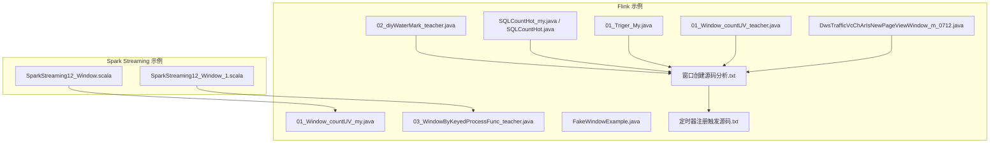
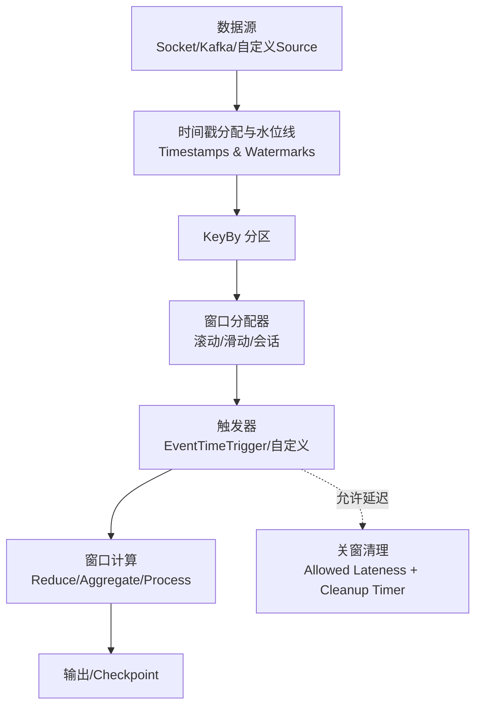
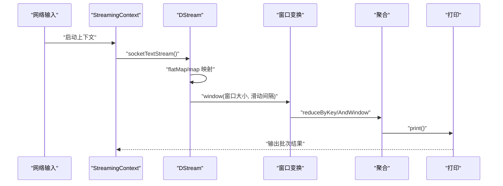
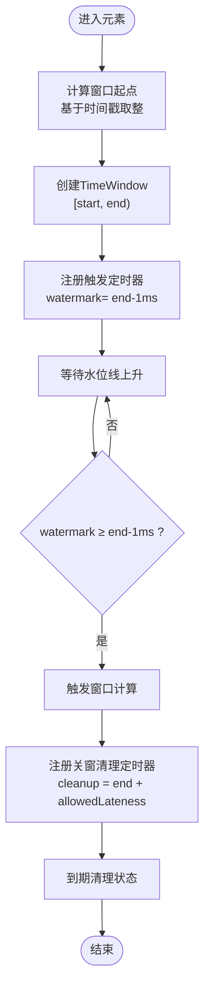
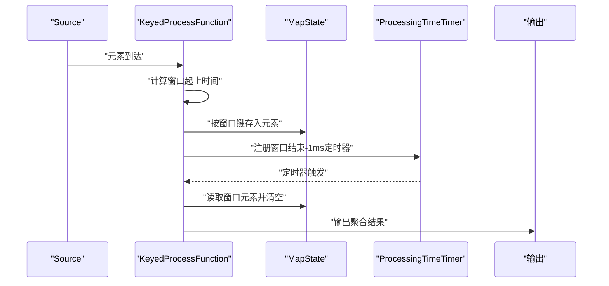
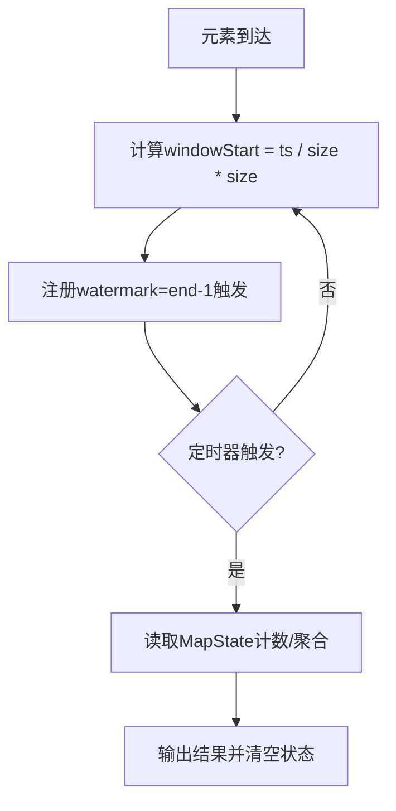
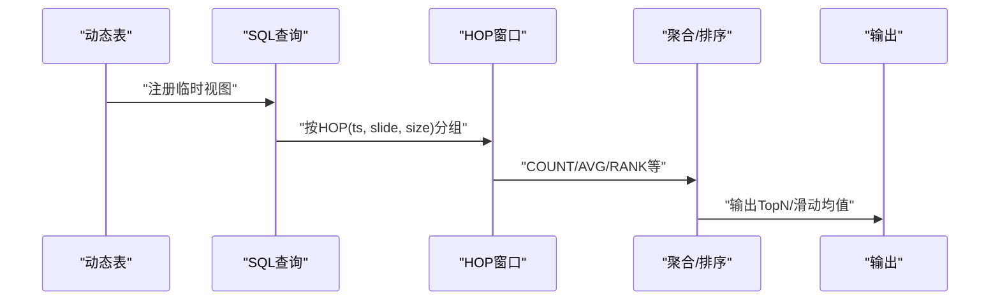
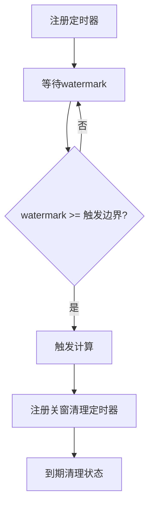
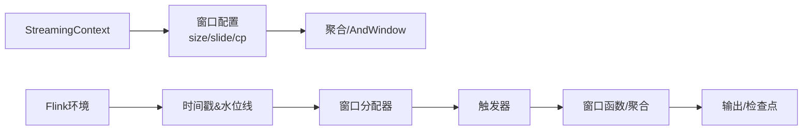

# 窗口操作与时间处理

<cite>
**本文引用的文件**
- [SparkStreaming12_Window.scala](file://_04_sparkTest/src/main/java/com/atguigu/bigdata/spark/streaming/SparkStreaming12_Window.scala)
- [SparkStreaming12_Window_1.scala](file://_04_sparkTest/src/main/java/com/atguigu/bigdata/spark/streaming/SparkStreaming12_Window_1.scala)
- [窗口创建源码分析.txt](file://_06_flink/窗口创建源码分析.txt)
- [01_Window_countUV_my.java](file://_06_flink/src/main/java/_09_window/_01_Window_countUV_my.java)
- [03_WindowByKeyedProcessFunc_teacher.java](file://_06_flink/src/main/java/_09_window/_03_WindowByKeyedProcessFunc_teacher.java)
- [FakeWindowExample.java](file://_06_flink_wu/src/main/Java/com/atguigu/chatper09/FakeWindowExample.java)
- [SQLCountHot_my.java](file://_06_flink/src/main/java/_19_FlinkSQL/_03_SQLCountHot_my.java)
- [SQLCountHot.java](file://_06_flink/src/main/java/_19_FlinkSQL/_03_SQLCountHot.java)
- [AverageTimestampExample.java](file://_06_flink_wu/src/main/java/com/atguigu/chatper09/AverageTimestampExample.java)
- [定时器注册触发源码.txt](file://_06_flink/定时器注册触发源码.txt)
- [02_diyWaterMark_teacher.java](file://_06_flink/src/main/java/_10_waterMark/_02_diyWaterMark_teacher.java)
- [01_Triger_My.java](file://_06_flink/src/main/java/_16_triger/_01_Triger_My.java)
- [01_Window_countUV_teacher.java](file://_06_flink/src/main/java/_09_window/_01_Window_countUV_teacher.java)
- [DwsTrafficVcChArIsNewPageViewWindow_m_0712.java](file://_200_flinkRealtime/src/main/java/com/atguigu/gmall/realtime/app/dws/DwsTrafficVcChArIsNewPageViewWindow_m_0712.java)
</cite>

## 目录
1. [引言](#引言)
2. [项目结构](#项目结构)
3. [核心组件](#核心组件)
4. [架构总览](#架构总览)
5. [详细组件分析](#详细组件分析)
6. [依赖关系分析](#依赖关系分析)
7. [性能考虑](#性能考虑)
8. [故障排查指南](#故障排查指南)
9. [结论](#结论)
10. [附录](#附录)

## 引言
本技术文档聚焦于流处理中的“窗口操作与时间处理”，系统阐述滑动窗口与翻滚窗口的概念差异、窗口大小与滑动间隔的配置原则及其对性能与准确性的权衡；同时解释事件时间与处理时间的语义差异，并结合仓库中的 Spark Streaming 与 Apache Flink 示例，给出基于时间的聚合、滑动平均等常见需求的实现路径与优化建议。

## 项目结构
本仓库中与窗口与时间处理直接相关的内容主要分布在以下位置：
- Spark Streaming 示例：窗口大小与滑动间隔的配置、基于窗口的聚合
- Flink 示例：滚动/处理时间窗口、事件时间窗口与水位线、窗口触发与清理、SQL HOP 窗口函数、自定义窗口与定时器

**图表来源**
- [SparkStreaming12_Window.scala](file://_04_sparkTest/src/main/java/com/atguigu/bigdata/spark/streaming/SparkStreaming12_Window.scala#L1-L32)
- [SparkStreaming12_Window_1.scala](file://_04_sparkTest/src/main/java/com/atguigu/bigdata/spark/streaming/SparkStreaming12_Window_1.scala#L1-L39)
- [窗口创建源码分析.txt](file://_06_flink/窗口创建源码分析.txt#L1-L80)
- [01_Window_countUV_my.java](file://_06_flink/src/main/java/_09_window/_01_Window_countUV_my.java#L1-L62)
- [03_WindowByKeyedProcessFunc_teacher.java](file://_06_flink/src/main/java/_09_window/_03_WindowByKeyedProcessFunc_teacher.java#L35-L94)
- [FakeWindowExample.java](file://_06_flink_wu/src/main/java/com/atguigu/chatper09/FakeWindowExample.java#L54-L86)
- [SQLCountHot_my.java](file://_06_flink/src/main/java/_19_FlinkSQL/_03_SQLCountHot_my.java#L63-L93)
- [SQLCountHot.java](file://_06_flink/src/main/java/_19_FlinkSQL/_03_SQLCountHot.java#L63-L92)
- [定时器注册触发源码.txt](file://_06_flink/定时器注册触发源码.txt#L1-L24)
- [02_diyWaterMark_teacher.java](file://_06_flink/src/main/java/_10_waterMark/_02_diyWaterMark_teacher.java#L51-L75)
- [01_Triger_My.java](file://_06_flink/src/main/java/_16_triger/_01_Triger_My.java#L34-L62)
- [01_Window_countUV_teacher.java](file://_06_flink/src/main/java/_09_window/_01_Window_countUV_teacher.java#L33-L46)
- [DwsTrafficVcChArIsNewPageViewWindow_m_0712.java](file://_200_flinkRealtime/src/main/java/com/atguigu/gmall/realtime/app/dws/DwsTrafficVcChArIsNewPageViewWindow_m_0712.java#L224-L243)

**章节来源**
- [SparkStreaming12_Window.scala](file://_04_sparkTest/src/main/java/com/atguigu/bigdata/spark/streaming/SparkStreaming12_Window.scala#L1-L32)
- [SparkStreaming12_Window_1.scala](file://_04_sparkTest/src/main/java/com/atguigu/bigdata/spark/streaming/SparkStreaming12_Window_1.scala#L1-L39)
- [窗口创建源码分析.txt](file://_06_flink/窗口创建源码分析.txt#L1-L80)

## 核心组件
- 翻滚窗口（Tumbling Window）：按固定窗口大小划分，窗口之间不重叠，适合稳定周期统计。
- 滑动窗口（Sliding Window）：窗口可重叠，滑动间隔小于窗口大小，适合趋势与平滑指标。
- 事件时间（Event Time）：以数据本身携带的时间戳为准，强调业务真实发生时刻。
- 处理时间（Processing Time）：以系统当前时间为准，强调计算发生的时刻。
- 水位线（Watermark）：用于表达“到此时间为止已无迟到数据”的边界，驱动事件时间窗口触发与关窗。
- 触发器（Trigger）：控制窗口何时产出结果，常见为事件时间触发器。
- 关窗清理（Cleanup）：允许延迟（allowed lateness）后清理状态，避免无限增长。

**章节来源**
- [窗口创建源码分析.txt](file://_06_flink/窗口创建源码分析.txt#L1-L80)
- [02_diyWaterMark_teacher.java](file://_06_flink/src/main/java/_10_waterMark/_02_diyWaterMark_teacher.java#L51-L75)
- [01_Triger_My.java](file://_06_flink/src/main/java/_16_triger/_01_Triger_My.java#L34-L62)

## 架构总览
下图展示了从数据源到窗口计算再到结果输出的整体流程，涵盖事件时间与处理时间两种窗口模型、水位线与触发器的作用。

**图表来源**
- [02_diyWaterMark_teacher.java](file://_06_flink/src/main/java/_10_waterMark/_02_diyWaterMark_teacher.java#L51-L75)
- [01_Triger_My.java](file://_06_flink/src/main/java/_16_triger/_01_Triger_My.java#L34-L62)
- [窗口创建源码分析.txt](file://_06_flink/窗口创建源码分析.txt#L1-L80)

## 详细组件分析

### Spark Streaming 窗口与时间配置
- 翻滚窗口与滑动窗口
  - 翻滚窗口：窗口大小固定，滑动间隔等于窗口大小，窗口不重叠。
  - 滑动窗口：窗口大小固定，滑动间隔小于窗口大小，窗口重叠。
- 配置原则
  - 窗口大小与滑动间隔必须是采集周期的整数倍，否则会报错或行为异常。
  - 滑动间隔越小，实时性越好但计算量越大；窗口越大，平滑性越好但延迟与内存占用越高。
- 实现要点
  - 使用 window(duration, slide) 定义窗口。
  - 使用 reduceByKey 或 reduceByKeyAndWindow 进行聚合；后者支持增量维护（添加/移出）以降低重算成本。

**图表来源**
- [SparkStreaming12_Window.scala](file://_04_sparkTest/src/main/java/com/atguigu/bigdata/spark/streaming/SparkStreaming12_Window.scala#L1-L32)
- [SparkStreaming12_Window_1.scala](file://_04_sparkTest/src/main/java/com/atguigu/bigdata/spark/streaming/SparkStreaming12_Window_1.scala#L1-L39)

**章节来源**
- [SparkStreaming12_Window.scala](file://_04_sparkTest/src/main/java/com/atguigu/bigdata/spark/streaming/SparkStreaming12_Window.scala#L1-L32)
- [SparkStreaming12_Window_1.scala](file://_04_sparkTest/src/main/java/com/atguigu/bigdata/spark/streaming/SparkStreaming12_Window_1.scala#L1-L39)

### Flink 事件时间窗口与水位线
- 窗口划分规则
  - 以时间戳对齐到窗口起点，起点 = 时间戳 - (时间戳 - 偏移 + 窗口大小) % 窗口大小。
  - 左闭右开区间，最大可归属时间 = 结束时间 - 1ms。
- 触发与关窗
  - 默认触发器在 watermark ≥ 窗口最大时间时触发。
  - 关窗时间为 窗口最大时间 + 允许延迟（allowed lateness），到期清理状态。
- 水位线策略
  - 有界乱序场景使用 bounded out-of-orderness；也可自定义周期性发射水位线。

**图表来源**
- [窗口创建源码分析.txt](file://_06_flink/窗口创建源码分析.txt#L1-L80)
- [02_diyWaterMark_teacher.java](file://_06_flink/src/main/java/_10_waterMark/_02_diyWaterMark_teacher.java#L51-L75)

**章节来源**
- [窗口创建源码分析.txt](file://_06_flink/窗口创建源码分析.txt#L1-L80)
- [02_diyWaterMark_teacher.java](file://_06_flink/src/main/java/_10_waterMark/_02_diyWaterMark_teacher.java#L51-L75)

### Flink 处理时间窗口与定时器
- 处理时间窗口
  - 基于本地系统时间滚动窗口，适合对实时性要求高且容忍少量乱序的场景。
- 定时器机制
  - 注册 processing time 定时器，到期触发计算；与事件时间窗口不同，不需要水位线参与。
- 自定义窗口示例
  - 使用 MapState 维护窗口内元素列表，按窗口起止时间作为键，到期统一输出。

**图表来源**
- [03_WindowByKeyedProcessFunc_teacher.java](file://_06_flink/src/main/java/_09_window/_03_WindowByKeyedProcessFunc_teacher.java#L35-L94)

**章节来源**
- [03_WindowByKeyedProcessFunc_teacher.java](file://_06_flink/src/main/java/_09_window/_03_WindowByKeyedProcessFunc_teacher.java#L35-L94)

### 自定义窗口与窗口函数
- 自定义滚动窗口
  - 通过计算 windowStart = timestamp / windowSize * windowSize 得到窗口边界，注册 end-1 定时器触发计算。
- 窗口函数与聚合
  - 使用 ProcessWindowFunction 收集全量元素进行统计；
  - 使用 ReduceFunction/AggregateFunction 进行增量聚合；
  - 在实时宽表场景中，窗口结束后补充 stt、edt、ts 等字段。

**图表来源**
- [FakeWindowExample.java](file://_06_flink_wu/src/main/java/com/atguigu/chatper09/FakeWindowExample.java#L54-L86)
- [01_Window_countUV_teacher.java](file://_06_flink/src/main/java/_09_window/_01_Window_countUV_teacher.java#L33-L46)
- [DwsTrafficVcChArIsNewPageViewWindow_m_0712.java](file://_200_flinkRealtime/src/main/java/com/atguigu/gmall/realtime/app/dws/DwsTrafficVcChArIsNewPageViewWindow_m_0712.java#L224-L243)

**章节来源**
- [FakeWindowExample.java](file://_06_flink_wu/src/main/java/com/atguigu/chatper09/FakeWindowExample.java#L54-L86)
- [01_Window_countUV_teacher.java](file://_06_flink/src/main/java/_09_window/_01_Window_countUV_teacher.java#L33-L46)
- [DwsTrafficVcChArIsNewPageViewWindow_m_0712.java](file://_200_flinkRealtime/src/main/java/com/atguigu/gmall/realtime/app/dws/DwsTrafficVcChArIsNewPageViewWindow_m_0712.java#L224-L243)

### Flink SQL 窗口与滑动平均
- HOP 函数
  - 使用 HOP(ts, slide, size) 定义滑动窗口，配合 HOP_START/HOP_END 获取窗口边界。
- 滑动平均
  - 可通过 AVG/ROW_NUMBER 等窗口函数实现滑动均值与 TopN 场景。

**图表来源**
- [SQLCountHot_my.java](file://_06_flink/src/main/java/_19_FlinkSQL/_03_SQLCountHot_my.java#L63-L93)
- [SQLCountHot.java](file://_06_flink/src/main/java/_19_FlinkSQL/_03_SQLCountHot.java#L63-L92)

**章节来源**
- [SQLCountHot_my.java](file://_06_flink/src/main/java/_19_FlinkSQL/_03_SQLCountHot_my.java#L63-L93)
- [SQLCountHot.java](file://_06_flink/src/main/java/_19_FlinkSQL/_03_SQLCountHot.java#L63-L92)

### 定时器与延迟处理
- 定时器延迟原因
  - 窗口触发与定时器注册的边界处理存在 1ms 差异，导致 watermark 达到 end-1ms 才真正触发。
- 允许延迟与清理
  - 设置 allowed lateness 延长关窗时间，到期清理状态，避免内存膨胀。

**图表来源**
- [定时器注册触发源码.txt](file://_06_flink/定时器注册触发源码.txt#L1-L24)
- [窗口创建源码分析.txt](file://_06_flink/窗口创建源码分析.txt#L60-L80)

**章节来源**
- [定时器注册触发源码.txt](file://_06_flink/定时器注册触发源码.txt#L1-L24)
- [窗口创建源码分析.txt](file://_06_flink/窗口创建源码分析.txt#L60-L80)

## 依赖关系分析
- Spark Streaming
  - StreamingContext 依赖采集周期与窗口配置；窗口变换依赖父 DStream 的 slide interval。
- Flink
  - 窗口分配器依赖时间语义（事件/处理）与水位线策略；
  - 触发器依赖 watermark 到达情况；
  - 状态与定时器共同决定窗口生命周期与内存占用。

**图表来源**
- [SparkStreaming12_Window.scala](file://_04_sparkTest/src/main/java/com/atguigu/bigdata/spark/streaming/SparkStreaming12_Window.scala#L1-L32)
- [SparkStreaming12_Window_1.scala](file://_04_sparkTest/src/main/java/com/atguigu/bigdata/spark/streaming/SparkStreaming12_Window_1.scala#L1-L39)
- [窗口创建源码分析.txt](file://_06_flink/窗口创建源码分析.txt#L1-L80)

**章节来源**
- [SparkStreaming12_Window.scala](file://_04_sparkTest/src/main/java/com/atguigu/bigdata/spark/streaming/SparkStreaming12_Window.scala#L1-L32)
- [SparkStreaming12_Window_1.scala](file://_04_sparkTest/src/main/java/com/atguigu/bigdata/spark/streaming/SparkStreaming12_Window_1.scala#L1-L39)
- [窗口创建源码分析.txt](file://_06_flink/窗口创建源码分析.txt#L1-L80)

## 性能考虑
- 窗口参数权衡
  - 滑动间隔越小，吞吐越高但 CPU 压力增大；窗口越大，平滑效果更好但延迟与内存上升。
- 状态与内存
  - 使用增量聚合（如 reduceByKeyAndWindow）减少重算；合理设置 allowed lateness，避免长期持有大量状态。
- 水位线与触发
  - 适当放宽乱序容忍度（bounded out-of-orderness）可提升吞吐；但需评估准确性。
- 并行度与分区
  - KeyBy 分区数应与数据倾斜与背压能力匹配；避免热点 key 导致内存峰值。

[本节为通用指导，无需列出具体文件来源]

## 故障排查指南
- Spark Streaming
  - 窗口与滑动间隔必须为采集周期整数倍，否则抛出配置错误；检查 reduceByKeyAndWindow 的“添加/移出”函数是否幂等。
- Flink
  - 若窗口不触发，检查水位线是否持续推进；确认 allowed lateness 是否过小导致提前关窗。
  - 定时器未触发：核对 watermark 与触发边界的 1ms 差异；确保注册时间正确。
  - 状态异常：确认窗口清理定时器是否注册，以及清理时间是否覆盖允许延迟。

**章节来源**
- [SparkStreaming12_Window.scala](file://_04_sparkTest/src/main/java/com/atguigu/bigdata/spark/streaming/SparkStreaming12_Window.scala#L1-L32)
- [SparkStreaming12_Window_1.scala](file://_04_sparkTest/src/main/java/com/atguigu/bigdata/spark/streaming/SparkStreaming12_Window_1.scala#L1-L39)
- [窗口创建源码分析.txt](file://_06_flink/窗口创建源码分析.txt#L1-L80)
- [定时器注册触发源码.txt](file://_06_flink/定时器注册触发源码.txt#L1-L24)

## 结论
- 翻滚窗口适合稳定周期统计，滑动窗口适合趋势与平滑指标。
- 事件时间强调业务真实发生时刻，处理时间强调系统计算时刻；二者在准确性与延迟上存在权衡。
- 合理配置窗口大小与滑动间隔、利用增量聚合与水位线策略、控制允许延迟与状态清理，是获得高性能与高准确性的关键。

[本节为总结性内容，无需列出具体文件来源]

## 附录
- 常见实现路径参考
  - Spark：使用 window(...) 与 reduceByKey/AndWindow 实现翻滚/滑动聚合。
  - Flink：事件时间窗口使用 TumblingEventTimeWindows + EventTimeTrigger；处理时间窗口使用 TumblingProcessingTimeWindows + ProcessingTimeTimer；SQL 使用 HOP 实现滑动窗口与 TopN/滑动均值。

**章节来源**
- [SparkStreaming12_Window.scala](file://_04_sparkTest/src/main/java/com/atguigu/bigdata/spark/streaming/SparkStreaming12_Window.scala#L1-L32)
- [SparkStreaming12_Window_1.scala](file://_04_sparkTest/src/main/java/com/atguigu/bigdata/spark/streaming/SparkStreaming12_Window_1.scala#L1-L39)
- [01_Window_countUV_my.java](file://_06_flink/src/main/java/_09_window/_01_Window_countUV_my.java#L1-L62)
- [SQLCountHot_my.java](file://_06_flink/src/main/java/_19_FlinkSQL/_03_SQLCountHot_my.java#L63-L93)